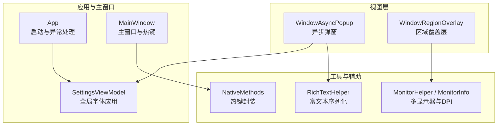
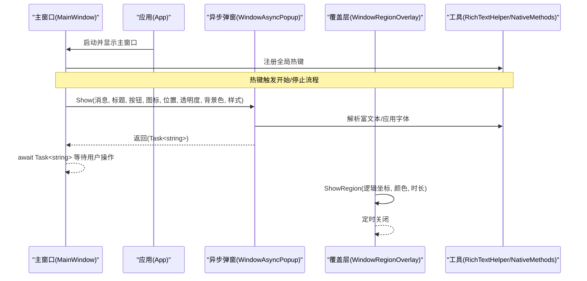
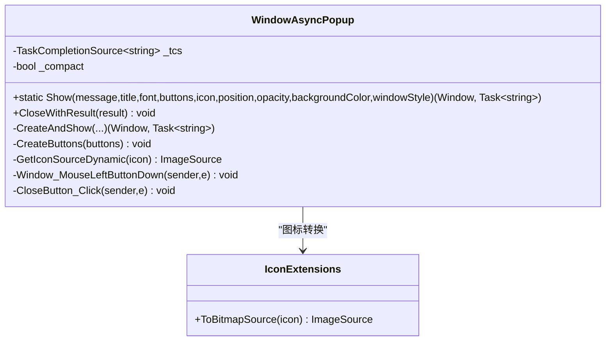
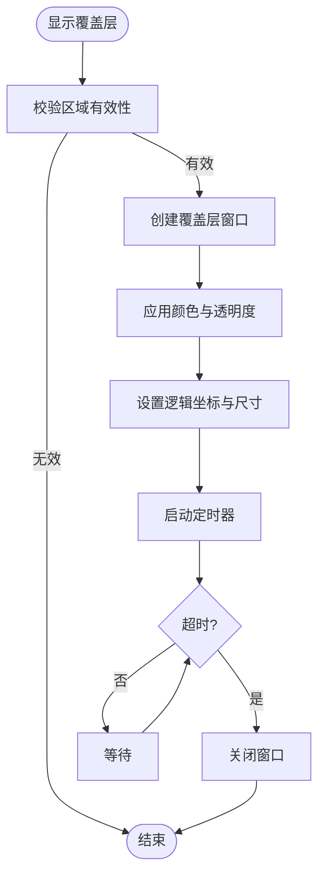
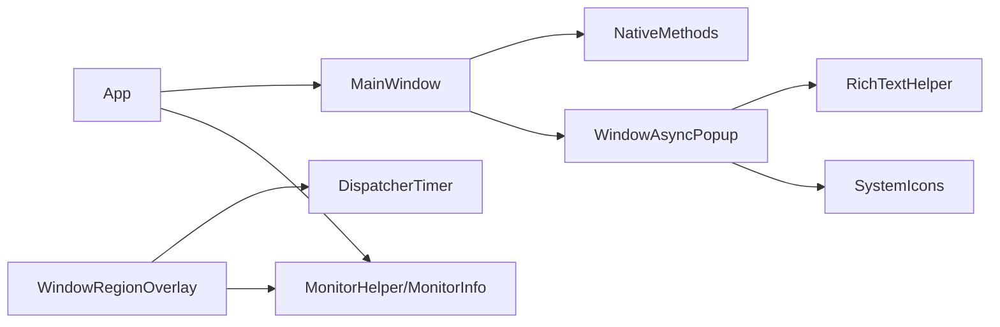

# 异步弹窗系统

<cite>
**本文引用的文件**   
- [WindowAsyncPopup.xaml.cs](file://ShaoLu/Views/WindowAsyncPopup.xaml.cs)
- [WindowAsyncPopup.xaml](file://ShaoLu/Views/WindowAsyncPopup.xaml)
- [WindowRegionOverlay.xaml.cs](file://ShaoLu/Views/WindowRegionOverlay.xaml.cs)
- [WindowRegionOverlay.xaml](file://ShaoLu/Views/WindowRegionOverlay.xaml)
- [MainWindow.xaml.cs](file://ShaoLu/MainWindow.xaml.cs)
- [App.xaml.cs](file://ShaoLu/App.xaml.cs)
- [NativeMethods.cs](file://ShaoLu/Utils/NativeMethods.cs)
- [MonitorHelper.cs](file://ShaoLu/Tools/ImageEdit/Helpers/MonitorHelper.cs)
- [MonitorInfo.cs](file://ShaoLu/Tools/ImageEdit/Helpers/MonitorInfo.cs)
- [RichTextHelper.cs](file://ShaoLu/Utils/RichTextHelper.cs)
- [SettingsViewModel.cs](file://ShaoLu/Viewmodels/SettingsViewModel.cs)
</cite>

## 目录
1. [简介](#简介)
2. [项目结构](#项目结构)
3. [核心组件](#核心组件)
4. [架构总览](#架构总览)
5. [详细组件分析](#详细组件分析)
6. [依赖关系分析](#依赖关系分析)
7. [性能考虑](#性能考虑)
8. [故障排查指南](#故障排查指南)
9. [结论](#结论)
10. [附录](#附录)

## 简介
本文件为 ShaoLu 的“异步弹窗系统”提供开发级文档，覆盖以下关键主题：
- 非模态窗口管理与生命周期控制
- Z-order 与置顶策略（Topmost）
- 弹窗与主窗口的通信模式、消息传递与数据共享
- 区域覆盖层实现、鼠标事件拦截与透明窗口技术
- 弹窗定位算法、多显示器支持与 DPI 缩放适配
- 富文本渲染与字体样式应用

该子系统以 WPF 为基础，通过 TaskCompletionSource 实现非阻塞的用户交互，结合 Topmost 与透明覆盖层完成可视化调试与提示。

## 项目结构
与异步弹窗相关的代码主要分布在 Views、Utils、Tools 与 Viewmodels 等目录中：
- Views：弹窗与覆盖层 UI 及行为实现
- Utils：富文本序列化、原生方法封装
- Tools/ImageEdit/Helpers：多显示器与 DPI 工具
- Viewmodels：设置与全局字体应用

图表来源
- [WindowAsyncPopup.xaml.cs:1-328](file://ShaoLu/Views/WindowAsyncPopup.xaml.cs#L1-L328)
- [WindowRegionOverlay.xaml.cs:1-72](file://ShaoLu/Views/WindowRegionOverlay.xaml.cs#L1-L72)
- [RichTextHelper.cs:1-44](file://ShaoLu/Utils/RichTextHelper.cs#L1-L44)
- [NativeMethods.cs:1-19](file://ShaoLu/Utils/NativeMethods.cs#L1-L19)
- [MonitorHelper.cs:1-71](file://ShaoLu/Tools/ImageEdit/Helpers/MonitorHelper.cs#L1-L71)
- [MonitorInfo.cs:1-58](file://ShaoLu/Tools/ImageEdit/Helpers/MonitorInfo.cs#L1-L58)
- [App.xaml.cs:1-112](file://ShaoLu/App.xaml.cs#L1-L112)
- [MainWindow.xaml.cs:1-376](file://ShaoLu/MainWindow.xaml.cs#L1-L376)
- [SettingsViewModel.cs:228-260](file://ShaoLu/Viewmodels/SettingsViewModel.cs#L228-L260)

章节来源
- [WindowAsyncPopup.xaml.cs:1-328](file://ShaoLu/Views/WindowAsyncPopup.xaml.cs#L1-L328)
- [WindowRegionOverlay.xaml.cs:1-72](file://ShaoLu/Views/WindowRegionOverlay.xaml.cs#L1-L72)
- [App.xaml.cs:1-112](file://ShaoLu/App.xaml.cs#L1-L112)
- [MainWindow.xaml.cs:1-376](file://ShaoLu/MainWindow.xaml.cs#L1-L376)

## 核心组件
- WindowAsyncPopup：非模态异步弹窗，支持自定义标题、图标、按钮、背景色与不透明度、紧凑模式、富文本内容、键盘交互与关闭回调。
- WindowRegionOverlay：屏幕区域标示覆盖层，用于可视化调试矩形区域，支持颜色与自动关闭。
- RichTextHelper：FlowDocument 与字符串之间的序列化和反序列化，支持纯文本与富文本。
- NativeMethods：封装 Windows 热键 API，供主窗口注册/注销全局热键。
- MonitorHelper / MonitorInfo：枚举显示器、获取 DPI 缩放因子、坐标转换（物理坐标到 WPF 逻辑坐标）。
- SettingsViewModel.ApplyGlobalFont：将字体设置应用到所有已打开窗口。

章节来源
- [WindowAsyncPopup.xaml.cs:1-328](file://ShaoLu/Views/WindowAsyncPopup.xaml.cs#L1-L328)
- [WindowRegionOverlay.xaml.cs:1-72](file://ShaoLu/Views/WindowRegionOverlay.xaml.cs#L1-L72)
- [RichTextHelper.cs:1-44](file://ShaoLu/Utils/RichTextHelper.cs#L1-L44)
- [NativeMethods.cs:1-19](file://ShaoLu/Utils/NativeMethods.cs#L1-L19)
- [MonitorHelper.cs:1-71](file://ShaoLu/Tools/ImageEdit/Helpers/MonitorHelper.cs#L1-L71)
- [MonitorInfo.cs:1-58](file://ShaoLu/Tools/ImageEdit/Helpers/MonitorInfo.cs#L1-L58)
- [SettingsViewModel.cs:228-260](file://ShaoLu/Viewmodels/SettingsViewModel.cs#L228-L260)

## 架构总览
异步弹窗系统由“主窗口 + 弹窗 + 覆盖层 + 工具服务”组成，采用非阻塞任务流进行用户交互，并通过 Topmost 保证弹窗在最前显示。

图表来源
- [MainWindow.xaml.cs:1-376](file://ShaoLu/MainWindow.xaml.cs#L1-L376)
- [App.xaml.cs:1-112](file://ShaoLu/App.xaml.cs#L1-L112)
- [WindowAsyncPopup.xaml.cs:1-328](file://ShaoLu/Views/WindowAsyncPopup.xaml.cs#L1-L328)
- [WindowRegionOverlay.xaml.cs:1-72](file://ShaoLu/Views/WindowRegionOverlay.xaml.cs#L1-L72)
- [RichTextHelper.cs:1-44](file://ShaoLu/Utils/RichTextHelper.cs#L1-L44)
- [NativeMethods.cs:1-19](file://ShaoLu/Utils/NativeMethods.cs#L1-L19)

## 详细组件分析

### 异步弹窗 WindowAsyncPopup
- 非模态显示：使用 Show() 而非 ShowDialog()，避免阻塞调用线程。
- 生命周期管理：通过 TaskCompletionSource<string> 在按钮点击或窗口关闭时设置结果，确保任务正常结束。
- 置顶与透明：XAML 中设置 Topmost="True" 与 AllowsTransparency="True"，配合无边框与自定义标题栏。
- 定位与尺寸：支持手动指定位置（WindowStartupLocation.Manual），SizeToContent 自适应内容；紧凑模式调整最小宽高与边距。
- 图标缓存：静态字典缓存系统图标，减少 GDI+ 到 WPF 的转换开销。
- 富文本渲染：使用 FlowDocumentScrollViewer 展示富文本，支持字体模型（族、大小、样式、粗细、颜色）。
- 按钮生成：动态创建按钮，默认按钮响应 Enter 键；按钮点击后线程安全地设置结果并关闭窗口。
- 拖拽移动：无边框窗口通过 MouseLeftButtonDown 调用 DragMove 实现拖拽。

图表来源
- [WindowAsyncPopup.xaml.cs:1-328](file://ShaoLu/Views/WindowAsyncPopup.xaml.cs#L1-L328)
- [WindowAsyncPopup.xaml:1-64](file://ShaoLu/Views/WindowAsyncPopup.xaml#L1-L64)

章节来源
- [WindowAsyncPopup.xaml.cs:1-328](file://ShaoLu/Views/WindowAsyncPopup.xaml.cs#L1-L328)
- [WindowAsyncPopup.xaml:1-64](file://ShaoLu/Views/WindowAsyncPopup.xaml#L1-L64)

### 区域覆盖层 WindowRegionOverlay
- 用途：可视化调试屏幕区域，绘制带边框与半透明背景的矩形。
- 定位：基于逻辑坐标（WPF 自动处理 DPI），直接设置 Left/Top/Width/Height。
- 自动关闭：使用 DispatcherTimer 在指定秒数后关闭。
- 透明与不可命中：AllowsTransparency="True"、Background="Transparent"、IsHitTestVisible="False"，确保仅作为视觉指示。

图表来源
- [WindowRegionOverlay.xaml.cs:1-72](file://ShaoLu/Views/WindowRegionOverlay.xaml.cs#L1-L72)
- [WindowRegionOverlay.xaml:1-16](file://ShaoLu/Views/WindowRegionOverlay.xaml#L1-L16)

章节来源
- [WindowRegionOverlay.xaml.cs:1-72](file://ShaoLu/Views/WindowRegionOverlay.xaml.cs#L1-L72)
- [WindowRegionOverlay.xaml:1-16](file://ShaoLu/Views/WindowRegionOverlay.xaml#L1-L16)

### 主窗口与热键集成 MainWindow
- 热键注册：在 OnSourceInitialized 中通过 NativeMethods.RegisterHotKey 注册开始/停止热键。
- 消息钩子：WndProc 处理 WM_HOTKEY，触发 ViewModel 命令执行开始/停止流程。
- 资源清理：OnClosed 中移除 Hook 并注销热键，同时关闭所有子窗口。
- 弹窗使用：在错误处理路径中使用 WindowAsyncPopup.Show 显示错误信息。

章节来源
- [MainWindow.xaml.cs:1-376](file://ShaoLu/MainWindow.xaml.cs#L1-L376)
- [NativeMethods.cs:1-19](file://ShaoLu/Utils/NativeMethods.cs#L1-L19)

### 应用启动与全局异常处理 App
- 全局异常兜底：捕获 DispatcherUnhandledException、AppDomain.UnhandledException、TaskScheduler.UnobservedTaskException。
- 初始化语言与服务容器：LanguageService 初始化与 DI 容器配置。
- 显示主窗口与应用全局字体：在启动阶段创建并显示 MainWindow，应用全局字体设置。
- DPI 缓存：OCRService.UpdateDpi 缓存 DPI 缩放因子供后台线程使用。

章节来源
- [App.xaml.cs:1-112](file://ShaoLu/App.xaml.cs#L1-L112)

### 富文本与字体应用
- RichTextHelper：支持 FlowDocument 与字符串互转，兼容纯文本与富文本格式。
- 字体模型：弹窗支持 FontModel（族、大小、样式、粗细、颜色），在 FlowDocument 级别应用。
- 全局字体：SettingsViewModel.ApplyGlobalFont 遍历 Application.Current.Windows 统一设置字体属性。

章节来源
- [RichTextHelper.cs:1-44](file://ShaoLu/Utils/RichTextHelper.cs#L1-L44)
- [SettingsViewModel.cs:228-260](file://ShaoLu/Viewmodels/SettingsViewModel.cs#L228-L260)

### 多显示器与 DPI 缩放
- MonitorHelper：枚举显示器、获取 DPI 缩放因子（按显示器或窗口）。
- MonitorInfo：存储显示器句柄、是否主屏、工作区与屏幕矩形、WPF 轴坐标矩形、ScaleX/Y。
- 坐标转换：提供 ToWpfAxis 方法将物理坐标转换为 WPF 逻辑坐标。

章节来源
- [MonitorHelper.cs:1-71](file://ShaoLu/Tools/ImageEdit/Helpers/MonitorHelper.cs#L1-L71)
- [MonitorInfo.cs:1-58](file://ShaoLu/Tools/ImageEdit/Helpers/MonitorInfo.cs#L1-L58)

## 依赖关系分析
- WindowAsyncPopup 依赖 RichTextHelper（富文本）、SystemIcons（图标）、Dispatcher（UI 线程调度）。
- WindowRegionOverlay 依赖 DispatcherTimer（自动关闭）、WPF 透明窗口能力。
- MainWindow 依赖 NativeMethods（热键）、ViewModels（业务逻辑）。
- App 依赖 LanguageService、Ioc 容器、OCRService（DPI 缓存）。
- 多显示器与 DPI 工具独立于弹窗，但可为定位与缩放提供支撑。

图表来源
- [App.xaml.cs:1-112](file://ShaoLu/App.xaml.cs#L1-L112)
- [MainWindow.xaml.cs:1-376](file://ShaoLu/MainWindow.xaml.cs#L1-L376)
- [WindowAsyncPopup.xaml.cs:1-328](file://ShaoLu/Views/WindowAsyncPopup.xaml.cs#L1-L328)
- [WindowRegionOverlay.xaml.cs:1-72](file://ShaoLu/Views/WindowRegionOverlay.xaml.cs#L1-L72)
- [NativeMethods.cs:1-19](file://ShaoLu/Utils/NativeMethods.cs#L1-L19)
- [MonitorHelper.cs:1-71](file://ShaoLu/Tools/ImageEdit/Helpers/MonitorHelper.cs#L1-L71)
- [MonitorInfo.cs:1-58](file://ShaoLu/Tools/ImageEdit/Helpers/MonitorInfo.cs#L1-L58)

章节来源
- [App.xaml.cs:1-112](file://ShaoLu/App.xaml.cs#L1-L112)
- [MainWindow.xaml.cs:1-376](file://ShaoLu/MainWindow.xaml.cs#L1-L376)
- [WindowAsyncPopup.xaml.cs:1-328](file://ShaoLu/Views/WindowAsyncPopup.xaml.cs#L1-L328)
- [WindowRegionOverlay.xaml.cs:1-72](file://ShaoLu/Views/WindowRegionOverlay.xaml.cs#L1-L72)
- [NativeMethods.cs:1-19](file://ShaoLu/Utils/NativeMethods.cs#L1-L19)
- [MonitorHelper.cs:1-71](file://ShaoLu/Tools/ImageEdit/Helpers/MonitorHelper.cs#L1-L71)
- [MonitorInfo.cs:1-58](file://ShaoLu/Tools/ImageEdit/Helpers/MonitorInfo.cs#L1-L58)

## 性能考虑
- 图标缓存：WindowAsyncPopup 静态字典缓存系统图标，避免重复转换带来的 CPU 与内存开销。
- 富文本序列化：仅在需要时解析与设置 FlowDocument，避免频繁重建文档对象。
- 透明窗口：AllowsTransparency 会带来额外渲染成本，建议仅在必要时启用（如覆盖层）。
- 定时器：覆盖层使用短周期定时器，应在关闭后立即停止，防止资源泄漏。
- DPI 计算：MonitorHelper 使用 Win32 API 获取 DPI，应避免在高频循环中重复调用。

[本节为通用指导，无需引用具体文件]

## 故障排查指南
- 弹窗未关闭导致任务挂起：检查 Closed 事件是否正确设置 TaskCompletionSource 结果；确保 CloseWithResult 被调用或在关闭事件中处理。
- 弹窗未置顶或遮挡：确认 XAML 中 Topmost="True"；在多显示器环境下检查定位坐标是否正确。
- 富文本显示异常：验证 RichTextHelper 序列化/反序列化逻辑；确保传入字符串为合法 FlowDocument 或纯文本。
- 透明窗口渲染问题：确保 Background 设置为 Transparent，且 AllowsTransparency="True"；注意某些 GPU 驱动对透明窗口的限制。
- 热键冲突或未生效：检查 NativeMethods 注册/注销是否成对出现；确认快捷键组合未被系统或其他程序占用。
- DPI 缩放错位：使用 MonitorInfo.ToWpfAxis 进行坐标转换；确保在不同 DPI 显示器间切换时重新计算位置。

章节来源
- [WindowAsyncPopup.xaml.cs:1-328](file://ShaoLu/Views/WindowAsyncPopup.xaml.cs#L1-L328)
- [WindowRegionOverlay.xaml.cs:1-72](file://ShaoLu/Views/WindowRegionOverlay.xaml.cs#L1-L72)
- [RichTextHelper.cs:1-44](file://ShaoLu/Utils/RichTextHelper.cs#L1-L44)
- [NativeMethods.cs:1-19](file://ShaoLu/Utils/NativeMethods.cs#L1-L19)
- [MonitorHelper.cs:1-71](file://ShaoLu/Tools/ImageEdit/Helpers/MonitorHelper.cs#L1-L71)
- [MonitorInfo.cs:1-58](file://ShaoLu/Tools/ImageEdit/Helpers/MonitorInfo.cs#L1-L58)

## 结论
ShaoLu 的异步弹窗系统通过非模态窗口、任务化交互与透明覆盖层实现了灵活、高效的提示与调试能力。其设计兼顾了用户体验（置顶、透明、富文本、字体定制）与工程实践（线程安全、资源清理、DPI 适配）。在多显示器与高 DPI 场景下，借助 MonitorHelper/MonitorInfo 可保证定位与缩放的准确性。建议在后续迭代中继续优化渲染性能与错误恢复机制。

[本节为总结性内容，无需引用具体文件]

## 附录
- 弹窗定位算法要点：
  - 支持手动指定位置（WindowStartupLocation.Manual），否则居中显示。
  - 紧凑模式调整最小宽高与内边距，提升空间利用率。
- 多显示器支持：
  - 使用 MonitorHelper 枚举显示器与 DPI，MonitorInfo 提供 WPF 轴坐标矩形。
  - 坐标转换需从物理坐标到逻辑坐标，避免跨显示器错位。
- 透明窗口技术：
  - AllowsTransparency="True" 与 Background="Transparent" 组合实现透明效果。
  - IsHitTestVisible="False" 使覆盖层不拦截鼠标事件。
- 鼠标事件拦截：
  - 弹窗通过 MouseLeftButtonDown 调用 DragMove 实现拖拽。
  - 覆盖层禁用命中测试，确保仅作为视觉指示。

[本节为补充说明，无需引用具体文件]