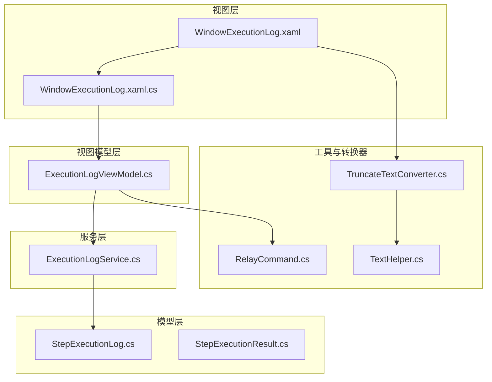
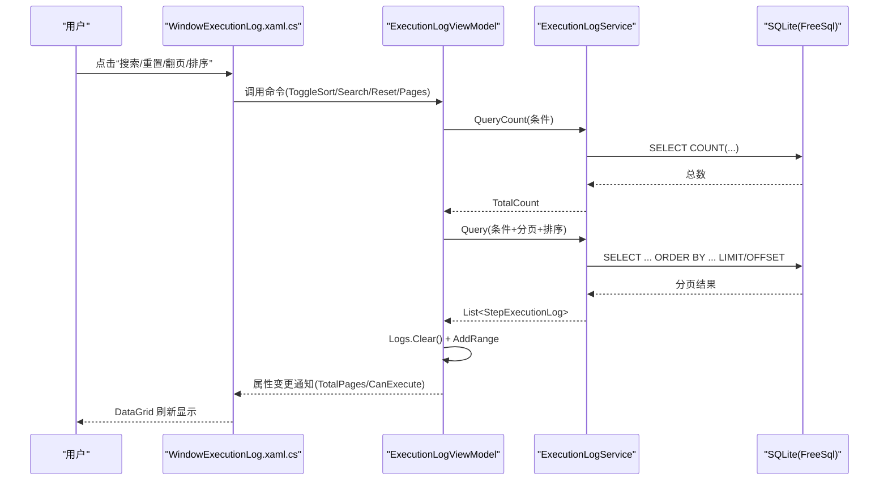
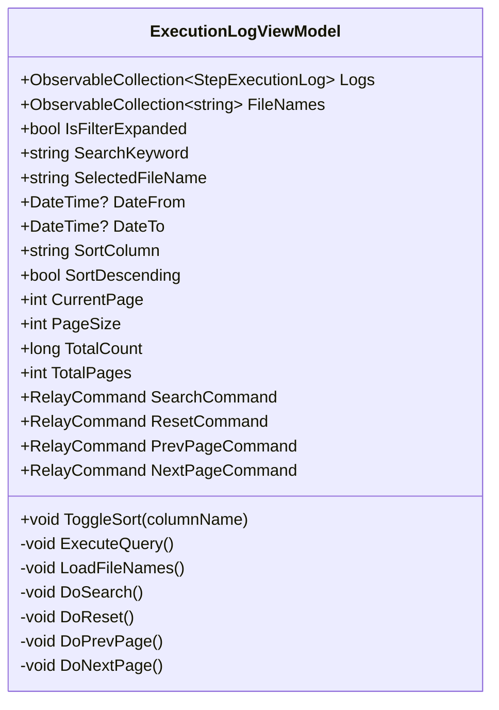
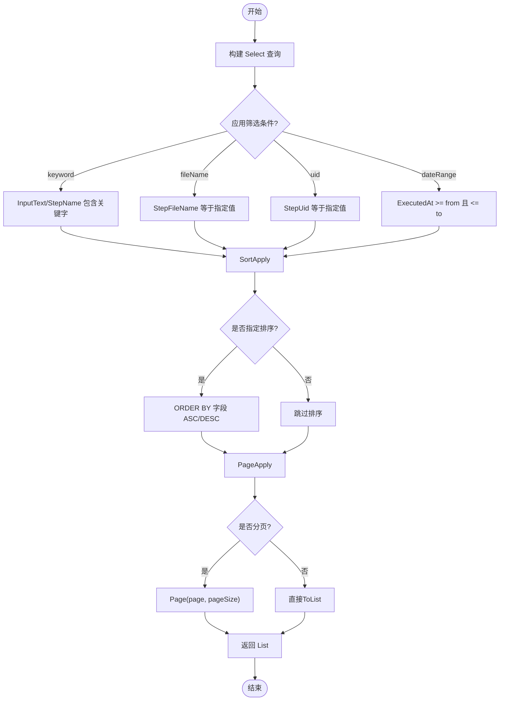
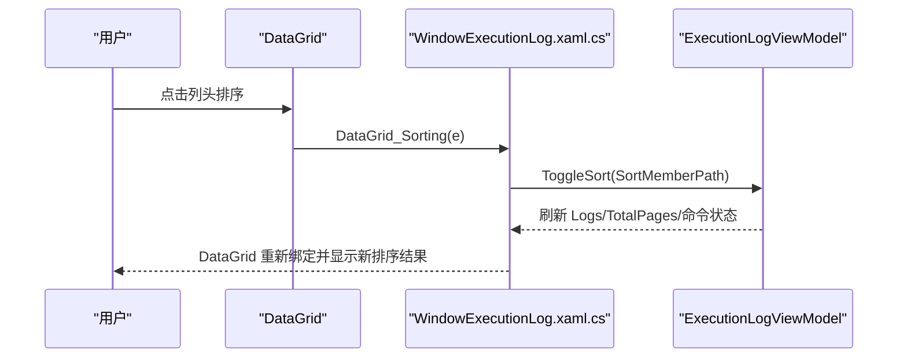
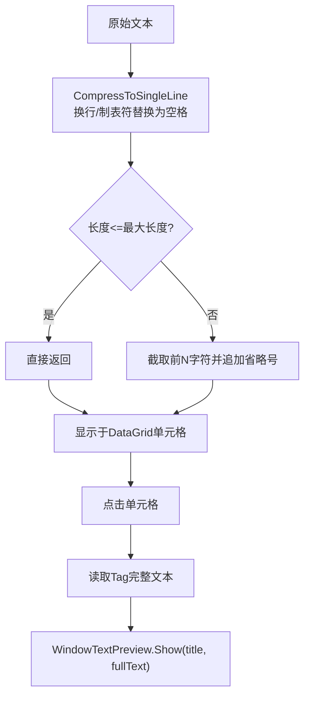
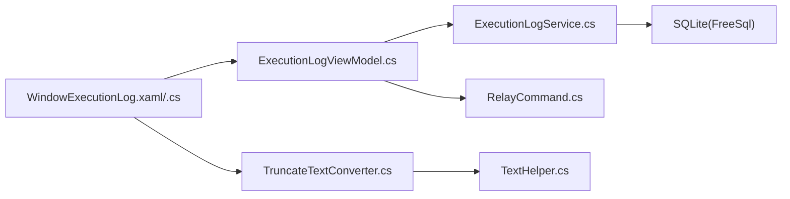

# 执行日志窗口

<cite>
**本文引用的文件**   
- [ExecutionLogViewModel.cs](file://ShaoLu/Viewmodels/ExecutionLogViewModel.cs)
- [ExecutionLogService.cs](file://ShaoLu/Services/ExecutionLogService.cs)
- [StepExecutionLog.cs](file://ShaoLu/Models/StepExecutionLog.cs)
- [StepExecutionResult.cs](file://ShaoLu/Models/StepExecutionResult.cs)
- [WindowExecutionLog.xaml](file://ShaoLu/Views/WindowExecutionLog.xaml)
- [WindowExecutionLog.xaml.cs](file://ShaoLu/Views/WindowExecutionLog.xaml.cs)
- [RelayCommand.cs](file://ShaoLu/Utils/RelayCommand.cs)
- [TruncateTextConverter.cs](file://ShaoLu/Converters/TruncateTextConverter.cs)
- [TextHelper.cs](file://ShaoLu/Utils/TextHelper.cs)
</cite>

## 目录
1. [简介](#简介)
2. [项目结构](#项目结构)
3. [核心组件](#核心组件)
4. [架构总览](#架构总览)
5. [详细组件分析](#详细组件分析)
6. [依赖关系分析](#依赖关系分析)
7. [性能考虑](#性能考虑)
8. [故障排查指南](#故障排查指南)
9. [结论](#结论)
10. [附录](#附录)

## 简介
本文件为 ShaoLu 的“执行日志窗口”提供完整开发文档，覆盖日志查看界面的实现、数据管理、筛选过滤、排序与分页、文本显示优化、错误处理与导出能力等。重点说明 ExecutionLogViewModel 的数据管理与更新机制，ExecutionLogService 的分页查询与统计，以及 UI 层在大数据量下的渲染优化策略。

## 项目结构
执行日志窗口由视图（XAML）、代码隐藏（事件处理）、视图模型（状态与命令）、服务（数据访问）和模型（实体）组成：
- 视图层：WindowExecutionLog.xaml 定义界面布局、绑定与交互；WindowExecutionLog.xaml.cs 处理 DataGrid 排序拦截与文本预览。
- 视图模型层：ExecutionLogViewModel 负责筛选、排序、分页、加载文件名与刷新列表。
- 服务层：ExecutionLogService 基于 FreeSql + SQLite 提供写入、查询、计数、去重文件名与清理旧日志。
- 模型层：StepExecutionLog 表示一条执行日志；StepExecutionResult 表示步骤执行结果（用于上下文记录）。
- 工具与转换器：RelayCommand 封装命令；TruncateTextConverter 与 TextHelper 负责长文本压缩与截断显示。

**图表来源** 
- [WindowExecutionLog.xaml:1-129](file://ShaoLu/Views/WindowExecutionLog.xaml#L1-L129)
- [WindowExecutionLog.xaml.cs:1-47](file://ShaoLu/Views/WindowExecutionLog.xaml.cs#L1-L47)
- [ExecutionLogViewModel.cs:1-230](file://ShaoLu/Viewmodels/ExecutionLogViewModel.cs#L1-L230)
- [ExecutionLogService.cs:1-179](file://ShaoLu/Services/ExecutionLogService.cs#L1-L179)
- [StepExecutionLog.cs:1-47](file://ShaoLu/Models/StepExecutionLog.cs#L1-L47)
- [StepExecutionResult.cs:1-51](file://ShaoLu/Models/StepExecutionResult.cs#L1-L51)
- [RelayCommand.cs:1-113](file://ShaoLu/Utils/RelayCommand.cs#L1-L113)
- [TruncateTextConverter.cs:1-32](file://ShaoLu/Converters/TruncateTextConverter.cs#L1-L32)
- [TextHelper.cs:1-43](file://ShaoLu/Utils/TextHelper.cs#L1-L43)

**章节来源**
- [WindowExecutionLog.xaml:1-129](file://ShaoLu/Views/WindowExecutionLog.xaml#L1-L129)
- [WindowExecutionLog.xaml.cs:1-47](file://ShaoLu/Views/WindowExecutionLog.xaml.cs#L1-L47)
- [ExecutionLogViewModel.cs:1-230](file://ShaoLu/Viewmodels/ExecutionLogViewModel.cs#L1-L230)
- [ExecutionLogService.cs:1-179](file://ShaoLu/Services/ExecutionLogService.cs#L1-L179)
- [StepExecutionLog.cs:1-47](file://ShaoLu/Models/StepExecutionLog.cs#L1-L47)
- [StepExecutionResult.cs:1-51](file://ShaoLu/Models/StepExecutionResult.cs#L1-L51)
- [RelayCommand.cs:1-113](file://ShaoLu/Utils/RelayCommand.cs#L1-L113)
- [TruncateTextConverter.cs:1-32](file://ShaoLu/Converters/TruncateTextConverter.cs#L1-L32)
- [TextHelper.cs:1-43](file://ShaoLu/Utils/TextHelper.cs#L1-L43)

## 核心组件
- ExecutionLogViewModel：维护 Logs、FileNames、搜索关键字、日期范围、排序列与方向、分页参数与总数；提供 Search、Reset、PrevPage、NextPage 命令；通过 ExecuteQuery 调用服务进行服务端分页查询并刷新 UI。
- ExecutionLogService：封装 FreeSql + SQLite 的增删查改；支持关键字匹配 InputText/StepName、按 StepFileName 或 StepUid 筛选、时间范围、排序与分页；提供 Count 与 Distinct FileNames；支持清理旧日志。
- WindowExecutionLog：XAML 定义搜索栏、可折叠筛选区、DataGrid 列与分页控件；代码隐藏中拦截 DataGrid 排序事件以触发 ViewModel 的服务端排序，并提供点击截断文本预览功能。
- 模型与工具：StepExecutionLog 映射数据库表；TruncateTextConverter 与 TextHelper 负责长文本单行压缩与截断；RelayCommand 统一命令封装。

**章节来源**
- [ExecutionLogViewModel.cs:1-230](file://ShaoLu/Viewmodels/ExecutionLogViewModel.cs#L1-L230)
- [ExecutionLogService.cs:1-179](file://ShaoLu/Services/ExecutionLogService.cs#L1-L179)
- [WindowExecutionLog.xaml:1-129](file://ShaoLu/Views/WindowExecutionLog.xaml#L1-L129)
- [WindowExecutionLog.xaml.cs:1-47](file://ShaoLu/Views/WindowExecutionLog.xaml.cs#L1-L47)
- [StepExecutionLog.cs:1-47](file://ShaoLu/Models/StepExecutionLog.cs#L1-L47)
- [TruncateTextConverter.cs:1-32](file://ShaoLu/Converters/TruncateTextConverter.cs#L1-L32)
- [TextHelper.cs:1-43](file://ShaoLu/Utils/TextHelper.cs#L1-L43)
- [RelayCommand.cs:1-113](file://ShaoLu/Utils/RelayCommand.cs#L1-L113)

## 架构总览
下图展示从用户操作到数据返回的完整流程：UI 触发命令 → ViewModel 组装查询条件 → Service 执行 SQL → 返回分页结果 → UI 刷新。

**图表来源** 
- [WindowExecutionLog.xaml.cs:23-32](file://ShaoLu/Views/WindowExecutionLog.xaml.cs#L23-L32)
- [ExecutionLogViewModel.cs:134-225](file://ShaoLu/Viewmodels/ExecutionLogViewModel.cs#L134-L225)
- [ExecutionLogService.cs:60-107](file://ShaoLu/Services/ExecutionLogService.cs#L60-L107)

## 详细组件分析

### ExecutionLogViewModel：日志数据管理与实时更新
- 数据集合：Logs 使用 ObservableCollection 以便 UI 自动刷新；FileNames 用于下拉筛选。
- 筛选与排序：SearchKeyword、SelectedFileName、DateFrom/To、SortColumn/SortDescending 组合成查询条件；ToggleSort 切换排序列与方向并重置页码。
- 分页：CurrentPage、PageSize、TotalCount、TotalPages 控制分页；Prev/Next 命令根据边界条件启用。
- 查询流程：DoSearch/DoReset/DoPrevPage/DoNextPage 均调用 ExecuteQuery，先获取 TotalCount，再执行分页查询并填充 Logs。
- 实时性：每次查询后更新 TotalPages 并重新计算命令 CanExecute，确保 UI 按钮状态正确。
- 内存优化：每次查询前 Clear Logs 再逐条添加，避免重复项；默认 PageSize=100 限制单次渲染数量。

**图表来源** 
- [ExecutionLogViewModel.cs:11-228](file://ShaoLu/Viewmodels/ExecutionLogViewModel.cs#L11-L228)

**章节来源**
- [ExecutionLogViewModel.cs:24-225](file://ShaoLu/Viewmodels/ExecutionLogViewModel.cs#L24-L225)

### ExecutionLogService：数据访问与分页查询
- 连接与初始化：Lazy 初始化 FreeSql，自动创建数据库目录与表结构。
- 写入：Log 方法插入 StepExecutionLog，包含 StepUid、StepFileName、StepName、InputText、OCRText、ExecutedAt。
- 查询：Query 支持 keyword（InputText/StepName 模糊匹配）、stepFileName、stepUid、from/to 时间范围、orderBy/descending 排序、page/pageSize 分页。
- 计数：QueryCount 返回满足条件的总记录数，用于分页显示。
- 其他：GetDistinctFileNames 返回不重复的文件名列表；CleanupOldLogs 按保留天数清理旧日志。

**图表来源** 
- [ExecutionLogService.cs:60-107](file://ShaoLu/Services/ExecutionLogService.cs#L60-L107)

**章节来源**
- [ExecutionLogService.cs:14-176](file://ShaoLu/Services/ExecutionLogService.cs#L14-L176)

### WindowExecutionLog：界面与交互
- 搜索与筛选：主搜索框支持回车触发搜索；可折叠筛选区包含 StepFileName 下拉框与起止日期选择器；提供重置按钮。
- 数据表格：DataGrid 绑定 Logs，禁用本地排序，启用列头排序事件交由 ViewModel 处理；输入与 OCR 文本列使用 TruncateTextConverter 截断显示，点击弹出预览。
- 分页控件：上一页/下一页按钮绑定命令，显示当前页与总页数，以及总记录数。
- 事件处理：DataGrid_Sorting 拦截默认排序，调用 ViewModel.ToggleSort；LogText_Click 打开预览窗口。

**图表来源** 
- [WindowExecutionLog.xaml.cs:23-32](file://ShaoLu/Views/WindowExecutionLog.xaml.cs#L23-L32)
- [ExecutionLogViewModel.cs:173-186](file://ShaoLu/Viewmodels/ExecutionLogViewModel.cs#L173-L186)

**章节来源**
- [WindowExecutionLog.xaml:24-126](file://ShaoLu/Views/WindowExecutionLog.xaml#L24-L126)
- [WindowExecutionLog.xaml.cs:23-44](file://ShaoLu/Views/WindowExecutionLog.xaml.cs#L23-L44)

### 文本显示与预览：截断与展开
- TruncateTextConverter：将长文本压缩为单行并按最大长度截断，追加省略号；可通过参数调整最大长度。
- TextHelper：提供 CompressToSingleLine 与 Truncate 等方法，保证表格概览简洁一致。
- 预览交互：点击截断文本时，读取 Tag 中的完整文本并通过 WindowTextPreview 弹窗展示。

**图表来源** 
- [TruncateTextConverter.cs:12-24](file://ShaoLu/Converters/TruncateTextConverter.cs#L12-L24)
- [TextHelper.cs:15-30](file://ShaoLu/Utils/TextHelper.cs#L15-L30)
- [WindowExecutionLog.xaml.cs:37-44](file://ShaoLu/Views/WindowExecutionLog.xaml.cs#L37-L44)

**章节来源**
- [TruncateTextConverter.cs:1-32](file://ShaoLu/Converters/TruncateTextConverter.cs#L1-L32)
- [TextHelper.cs:1-43](file://ShaoLu/Utils/TextHelper.cs#L1-L43)
- [WindowExecutionLog.xaml.cs:37-44](file://ShaoLu/Views/WindowExecutionLog.xaml.cs#L37-L44)

### 日志级别分类、时间戳显示、错误高亮与导出
- 日志级别分类：当前实现未对日志进行级别分类（如 Info/Warn/Error），仅记录执行时间与内容。可在 StepExecutionLog 扩展 Level 字段并在 UI 增加筛选列。
- 时间戳显示：ExecutedAt 列使用格式化字符串 yyyy-MM-dd HH:mm:ss，便于阅读。
- 错误高亮：当前未实现错误行高亮。建议在 UI 层根据 StepExecutionResult.ErrorMessage 或自定义规则设置行背景色。
- 导出功能：当前未实现导出。建议新增 ExportCommand，将 Logs 序列化为 CSV/Excel 或通过系统剪贴板导出。

[本节为概念性说明，不直接分析具体文件]

## 依赖关系分析
- ViewModel 依赖 Service 进行数据访问；Service 依赖 FreeSql + SQLite 存储；UI 依赖 ViewModel 暴露的属性与命令。
- 转换器与工具类被 UI 层使用以提升文本显示性能与一致性。
- RelayCommand 为命令提供统一的执行与状态管理能力。

**图表来源** 
- [WindowExecutionLog.xaml.cs:1-47](file://ShaoLu/Views/WindowExecutionLog.xaml.cs#L1-L47)
- [ExecutionLogViewModel.cs:1-230](file://ShaoLu/Viewmodels/ExecutionLogViewModel.cs#L1-L230)
- [ExecutionLogService.cs:1-179](file://ShaoLu/Services/ExecutionLogService.cs#L1-L179)
- [TruncateTextConverter.cs:1-32](file://ShaoLu/Converters/TruncateTextConverter.cs#L1-L32)
- [TextHelper.cs:1-43](file://ShaoLu/Utils/TextHelper.cs#L1-L43)
- [RelayCommand.cs:1-113](file://ShaoLu/Utils/RelayCommand.cs#L1-L113)

**章节来源**
- [ExecutionLogViewModel.cs:1-230](file://ShaoLu/Viewmodels/ExecutionLogViewModel.cs#L1-L230)
- [ExecutionLogService.cs:1-179](file://ShaoLu/Services/ExecutionLogService.cs#L1-L179)
- [WindowExecutionLog.xaml.cs:1-47](file://ShaoLu/Views/WindowExecutionLog.xaml.cs#L1-L47)

## 性能考虑
- 服务端分页：默认 PageSize=100，避免一次性加载大量数据；UI 仅渲染当前页，降低内存占用与渲染压力。
- 文本压缩与截断：TruncateTextConverter 与 TextHelper 将多行文本压缩为单行并截断，减少 UI 布局计算与绘制开销。
- 排序在服务端完成：拦截 DataGrid 本地排序，改为服务端 ORDER BY，避免客户端大规模排序。
- 集合更新策略：每次查询前 Clear Logs 再逐条添加，避免重复项；必要时可使用更高效的批量更新策略（如临时集合后一次性赋值）。
- 数据库索引建议：对 StepFileName、ExecutedAt、StepUid 建立索引可提升筛选与排序性能。
- 虚拟滚动：WPF DataGrid 已具备虚拟化能力；若未来数据量极大，可考虑第三方虚拟化控件或自定义虚拟化方案。
- 异步化：当前查询为同步调用，若响应较慢，可引入异步 Task 与进度反馈，避免阻塞 UI 线程。

[本节为通用性能指导，不直接分析具体文件]

## 故障排查指南
- 数据库尚未创建：LoadFileNames 捕获异常忽略，首次运行不会报错；确认 ApplicationData 路径存在并可写。
- 查询失败：ExecuteQuery 捕获异常并记录 NLog 日志；检查关键词、日期范围与排序列名是否正确。
- 排序无效：确保 DataGrid_Sorting 中 e.Handled=true 阻止本地排序；SortMemberPath 与 ViewModel.SortColumn 保持一致。
- 文本预览为空：确认 TextBlock.Tag 绑定了完整文本；点击事件读取 Tag 非空后再打开预览窗口。
- 导出缺失：如需导出，需新增命令与服务层序列化逻辑；建议提供 CSV/Excel 两种格式。

**章节来源**
- [ExecutionLogViewModel.cs:120-132](file://ShaoLu/Viewmodels/ExecutionLogViewModel.cs#L120-L132)
- [ExecutionLogViewModel.cs:188-225](file://ShaoLu/Viewmodels/ExecutionLogViewModel.cs#L188-L225)
- [WindowExecutionLog.xaml.cs:23-32](file://ShaoLu/Views/WindowExecutionLog.xaml.cs#L23-L32)
- [WindowExecutionLog.xaml.cs:37-44](file://ShaoLu/Views/WindowExecutionLog.xaml.cs#L37-L44)

## 结论
执行日志窗口通过清晰的 MVVM 分层与 FreeSql + SQLite 的服务端分页查询，实现了高效、可扩展的日志查看能力。UI 层采用文本压缩与截断、服务端排序与分页等手段保障大数据量下的流畅体验。后续可在此基础上扩展日志级别分类、错误高亮与导出功能，进一步提升诊断与运维效率。

[本节为总结性内容，不直接分析具体文件]

## 附录
- 数据模型字段说明：
  - Id：自增主键
  - StepUid：步骤唯一标识
  - StepFileName：步骤文件名（无扩展名）
  - StepName：步骤名称
  - InputText：本次执行的输入内容
  - OCRText：OCR 识别结果
  - ExecutedAt：执行时间

**章节来源**
- [StepExecutionLog.cs:6-45](file://ShaoLu/Models/StepExecutionLog.cs#L6-L45)