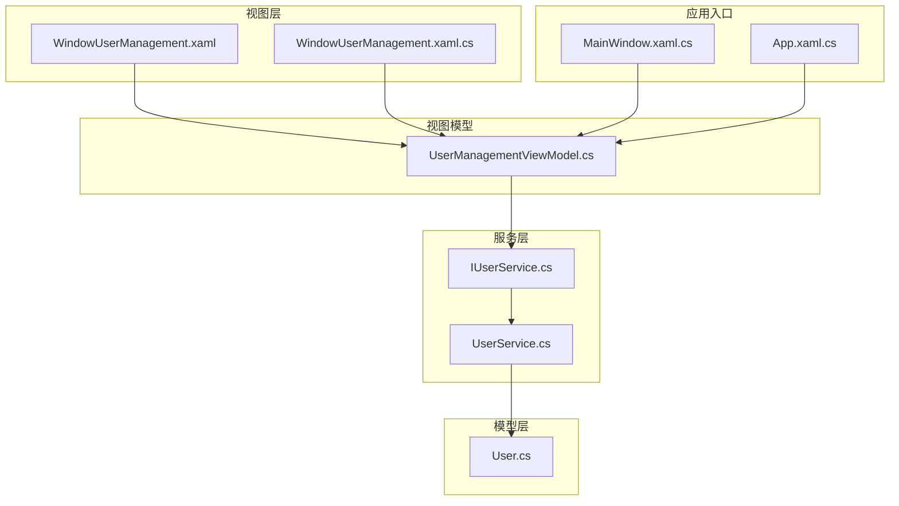
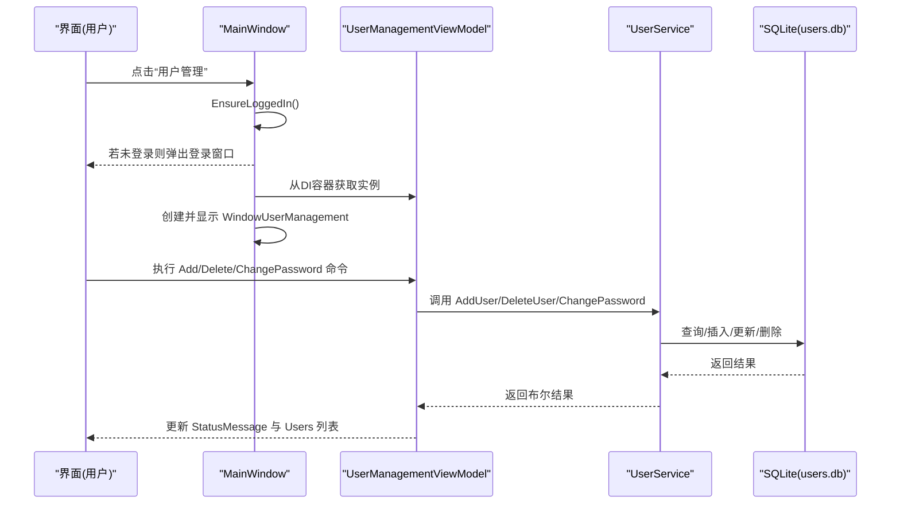
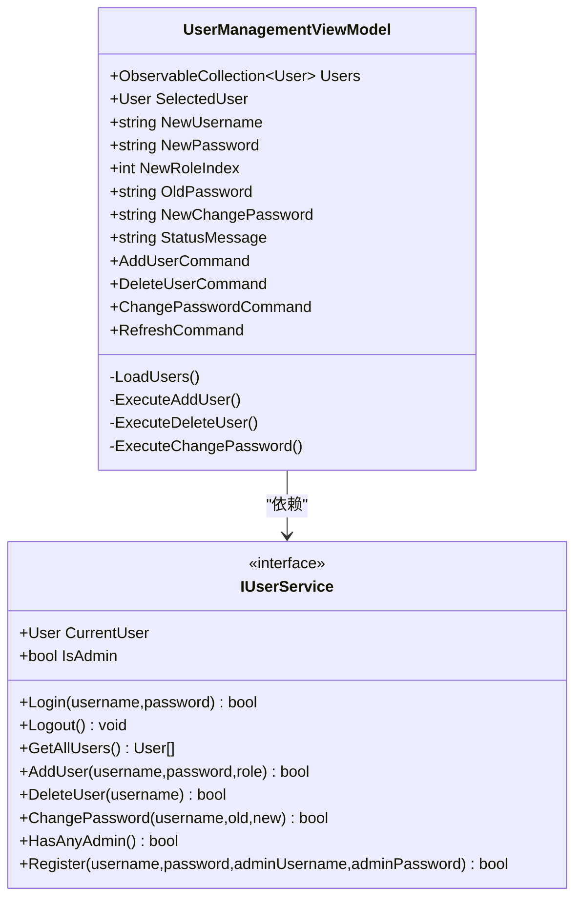
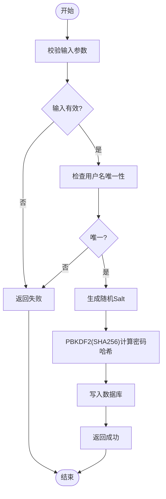
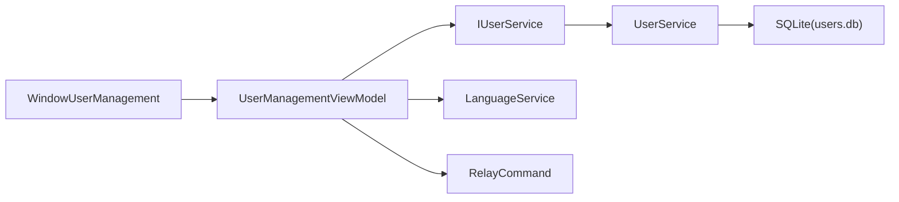

# 用户管理窗口

<cite>
**本文引用的文件**
- [UserManagementViewModel.cs](file://ShaoLu/Viewmodels/UserManagementViewModel.cs)
- [WindowUserManagement.xaml](file://ShaoLu/Views/WindowUserManagement.xaml)
- [WindowUserManagement.xaml.cs](file://ShaoLu/Views/WindowUserManagement.xaml.cs)
- [UserService.cs](file://ShaoLu/Services/UserService.cs)
- [IUserService.cs](file://ShaoLu/Services/IUserService.cs)
- [User.cs](file://ShaoLu/Models/User.cs)
- [MainWindow.xaml.cs](file://ShaoLu/MainWindow.xaml.cs)
- [App.xaml.cs](file://ShaoLu/App.xaml.cs)
- [LanguageService.cs](file://ShaoLu/Services/LanguageService.cs)
- [RelayCommand.cs](file://ShaoLu/Utils/RelayCommand.cs)
</cite>

## 目录
1. [简介](#简介)
2. [项目结构](#项目结构)
3. [核心组件](#核心组件)
4. [架构总览](#架构总览)
5. [详细组件分析](#详细组件分析)
6. [依赖关系分析](#依赖关系分析)
7. [性能与可扩展性](#性能与可扩展性)
8. [故障排查指南](#故障排查指南)
9. [结论](#结论)
10. [附录：数据模型与接口定义](#附录数据模型与接口定义)

## 简介
本文件为 ShaoLu 的用户管理窗口提供完整开发文档，覆盖用户列表显示、CRUD 操作、权限控制、角色分配、状态管理与交互流程。重点说明 UserManagementViewModel 的数据管理、业务规则处理，以及 UserService 在数据持久化、密码安全、登录态维护等方面的实现。同时给出数据同步、冲突解决与安全审计的扩展建议。

## 项目结构
用户管理功能由视图层（XAML）、视图代码隐藏、视图模型与服务层组成，遵循 MVVM 模式并通过依赖注入装配。

图表来源
- [WindowUserManagement.xaml:1-100](file://ShaoLu/Views/WindowUserManagement.xaml#L1-L100)
- [WindowUserManagement.xaml.cs:1-33](file://ShaoLu/Views/WindowUserManagement.xaml.cs#L1-L33)
- [UserManagementViewModel.cs:1-194](file://ShaoLu/Viewmodels/UserManagementViewModel.cs#L1-L194)
- [IUserService.cs:1-20](file://ShaoLu/Services/IUserService.cs#L1-L20)
- [UserService.cs:1-239](file://ShaoLu/Services/UserService.cs#L1-L239)
- [User.cs:1-33](file://ShaoLu/Models/User.cs#L1-L33)
- [MainWindow.xaml.cs:313-321](file://ShaoLu/MainWindow.xaml.cs#L313-L321)
- [App.xaml.cs:55-66](file://ShaoLu/App.xaml.cs#L55-L66)

章节来源
- [WindowUserManagement.xaml:1-100](file://ShaoLu/Views/WindowUserManagement.xaml#L1-L100)
- [UserManagementViewModel.cs:1-194](file://ShaoLu/Viewmodels/UserManagementViewModel.cs#L1-L194)
- [UserService.cs:1-239](file://ShaoLu/Services/UserService.cs#L1-L239)
- [App.xaml.cs:55-66](file://ShaoLu/App.xaml.cs#L55-L66)
- [MainWindow.xaml.cs:313-321](file://ShaoLu/MainWindow.xaml.cs#L313-L321)

## 核心组件
- 视图模型 UserManagementViewModel：负责用户列表展示、新增用户、删除用户、修改密码、刷新列表、状态消息输出与本地化提示。
- 视图 WindowUserManagement：绑定 ObservableCollection<User> 到 DataGrid，提供添加用户表单与修改密码表单，通过 PasswordBox 事件将输入值同步到 ViewModel。
- 服务 IUserService/ UserService：封装用户数据的增删改查、密码哈希与校验、当前登录用户状态、管理员权限判断、注册与管理员审批逻辑。
- 模型 User：用户实体，包含用户名、密码哈希、盐、角色、创建时间等字段。
- 应用入口与导航：App 中注册依赖注入；MainWindow 中触发用户管理窗口并保证已登录。

章节来源
- [UserManagementViewModel.cs:1-194](file://ShaoLu/Viewmodels/UserManagementViewModel.cs#L1-L194)
- [WindowUserManagement.xaml:1-100](file://ShaoLu/Views/WindowUserManagement.xaml#L1-L100)
- [WindowUserManagement.xaml.cs:1-33](file://ShaoLu/Views/WindowUserManagement.xaml.cs#L1-L33)
- [IUserService.cs:1-20](file://ShaoLu/Services/IUserService.cs#L1-L20)
- [UserService.cs:1-239](file://ShaoLu/Services/UserService.cs#L1-L239)
- [User.cs:1-33](file://ShaoLu/Models/User.cs#L1-L33)
- [App.xaml.cs:55-66](file://ShaoLu/App.xaml.cs#L55-L66)
- [MainWindow.xaml.cs:313-321](file://ShaoLu/MainWindow.xaml.cs#L313-L321)

## 架构总览
用户管理窗口采用 MVVM + DI 的架构：
- 视图层通过 XAML 绑定 ViewModel 属性，使用 RelayCommand 驱动命令。
- ViewModel 调用 IUserService 完成业务逻辑与数据访问。
- UserService 基于 FreeSql 与 SQLite 进行数据持久化，内置密码安全机制。
- MainWindow 作为入口，确保用户已登录后才允许打开用户管理窗口。

图表来源
- [MainWindow.xaml.cs:313-321](file://ShaoLu/MainWindow.xaml.cs#L313-L321)
- [UserManagementViewModel.cs:96-191](file://ShaoLu/Viewmodels/UserManagementViewModel.cs#L96-L191)
- [UserService.cs:107-185](file://ShaoLu/Services/UserService.cs#L107-L185)

## 详细组件分析

### 视图模型 UserManagementViewModel
- 数据绑定
  - Users：ObservableCollection<User>，用于 DataGrid 展示。
  - SelectedUser：当前选中用户，支持双向绑定。
  - NewUsername/NewPassword/NewRoleIndex：新增用户表单输入。
  - OldPassword/NewChangePassword：修改密码表单输入。
  - StatusMessage：状态消息，供界面反馈。
- 命令与交互
  - AddUserCommand：校验输入、选择角色、调用 UserService.AddUser，成功后清空表单并刷新列表。
  - DeleteUserCommand：校验选中用户、禁止删除自己、二次确认、调用 UserService.DeleteUser，成功后刷新列表。
  - ChangePasswordCommand：校验旧密码与新密码、调用 UserService.ChangePassword，成功后清空密码框。
  - RefreshCommand：直接调用 LoadUsers 刷新列表。
- 业务规则
  - 新增用户时根据下拉索引映射 Admin/User 角色。
  - 删除用户时防止删除最后一个管理员账户。
  - 所有错误信息通过 LanguageService.GetLocalizedString 本地化。

图表来源
- [UserManagementViewModel.cs:10-191](file://ShaoLu/Viewmodels/UserManagementViewModel.cs#L10-L191)
- [IUserService.cs:6-18](file://ShaoLu/Services/IUserService.cs#L6-L18)

章节来源
- [UserManagementViewModel.cs:1-194](file://ShaoLu/Viewmodels/UserManagementViewModel.cs#L1-L194)

### 视图 WindowUserManagement
- 布局与绑定
  - DataGrid 绑定 Users 与 SelectedUser，列包括用户名、角色、创建时间。
  - 新增用户区域：用户名、密码、角色下拉、添加按钮。
  - 修改密码区域：只读显示选中用户名、旧密码、新密码、修改按钮。
  - 底部删除按钮与状态文本。
- 事件处理
  - PasswordBox 的 PasswordChanged 事件将输入值同步到 ViewModel 对应属性。

章节来源
- [WindowUserManagement.xaml:1-100](file://ShaoLu/Views/WindowUserManagement.xaml#L1-L100)
- [WindowUserManagement.xaml.cs:1-33](file://ShaoLu/Views/WindowUserManagement.xaml.cs#L1-L33)

### 服务 UserService
- 数据持久化
  - 使用 FreeSql 连接 SQLite，数据库路径位于 ApplicationData/AutoShaoLu/users.db。
  - 自动建表（UseAutoSyncStructure）。
- 安全机制
  - 生成随机 Salt，使用 PBKDF2(SHA256) 对密码进行哈希存储。
  - 常量时间比较避免时序攻击。
- 登录态与权限
  - CurrentUser 保存当前登录用户，IsAdmin 判断是否为管理员。
  - Login/Logout 管理会话。
- CRUD 与业务规则
  - GetAllUsers：按创建时间排序返回用户列表。
  - AddUser：检查用户名唯一性，生成 Salt 与 Hash，插入记录。
  - DeleteUser：不允许删除最后一个管理员；若删除的是当前用户则注销。
  - ChangePassword：验证旧密码后重新生成 Salt 与 Hash 并更新。
  - HasAnyAdmin/Register：支持首次注册或管理员审批场景。

图表来源
- [UserService.cs:107-129](file://ShaoLu/Services/UserService.cs#L107-L129)
- [UserService.cs:39-74](file://ShaoLu/Services/UserService.cs#L39-L74)

章节来源
- [UserService.cs:1-239](file://ShaoLu/Services/UserService.cs#L1-L239)

### 模型 User
- 字段
  - Id：自增主键。
  - Username：用户名，非空，最大长度 128。
  - PasswordHash：密码哈希。
  - Salt：盐值。
  - Role：枚举 UserRole（Admin/User）。
  - CreatedAt：创建时间。

章节来源
- [User.cs:1-33](file://ShaoLu/Models/User.cs#L1-L33)

### 应用入口与导航
- App.xaml.cs：通过 Microsoft.Extensions.DependencyInjection 注册 IUserService 与 UserManagementViewModel，并使用 CommunityToolkit.Mvvm 的 Ioc 容器。
- MainWindow.xaml.cs：在菜单项“用户管理”中，先确保已登录，再从 DI 容器获取 UserManagementViewModel，创建并显示 WindowUserManagement。

章节来源
- [App.xaml.cs:55-66](file://ShaoLu/App.xaml.cs#L55-L66)
- [MainWindow.xaml.cs:313-321](file://ShaoLu/MainWindow.xaml.cs#L313-L321)

## 依赖关系分析
- 视图层依赖 ViewModel：通过 DataContext 绑定。
- ViewModel 依赖 IUserService：通过构造函数注入。
- UserService 依赖 FreeSql 与 SQLite：单例懒加载初始化。
- 语言服务 LanguageService：提供本地化字符串。
- 命令系统 RelayCommand：封装 ICommand，支持 CanExecute。

图表来源
- [WindowUserManagement.xaml.cs:1-33](file://ShaoLu/Views/WindowUserManagement.xaml.cs#L1-L33)
- [UserManagementViewModel.cs:1-194](file://ShaoLu/Viewmodels/UserManagementViewModel.cs#L1-L194)
- [UserService.cs:1-239](file://ShaoLu/Services/UserService.cs#L1-L239)
- [LanguageService.cs:1-67](file://ShaoLu/Services/LanguageService.cs#L1-L67)
- [RelayCommand.cs:1-113](file://ShaoLu/Utils/RelayCommand.cs#L1-L113)

章节来源
- [UserManagementViewModel.cs:1-194](file://ShaoLu/Viewmodels/UserManagementViewModel.cs#L1-L194)
- [UserService.cs:1-239](file://ShaoLu/Services/UserService.cs#L1-L239)
- [LanguageService.cs:1-67](file://ShaoLu/Services/LanguageService.cs#L1-L67)
- [RelayCommand.cs:1-113](file://ShaoLu/Utils/RelayCommand.cs#L1-L113)

## 性能与可扩展性
- 数据加载
  - LoadUsers 每次清空集合再逐项添加，适合小规模用户列表；当用户量增长时可考虑分页或增量更新。
- 并发与线程
  - 当前实现均为同步操作；如需异步，可在 ViewModel 中使用 async/await 并在后台线程执行 IO，再通过 Dispatcher 更新 UI。
- 缓存
  - 可引入内存缓存减少重复查询；注意失效策略与一致性。
- 可扩展点
  - 批量操作：在 ViewModel 增加批量删除/批量角色变更命令，在服务层提供事务保障。
  - 审计日志：在 UserService 的关键操作前后记录审计日志（谁、何时、做了什么）。
  - 冲突解决：在高并发下可增加版本号或乐观锁字段，避免覆盖更新。

[本节为通用指导，不直接分析具体文件]

## 故障排查指南
- 无法打开用户管理窗口
  - 检查是否已登录：MainWindow 中的 EnsureLoggedIn 会拦截未登录用户。
  - 检查 DI 容器是否正确注册：App.xaml.cs 中需注册 IUserService 与 UserManagementViewModel。
- 新增用户失败
  - 检查用户名是否重复：UserService.AddUser 会进行唯一性校验。
  - 检查输入是否为空：ViewModel 在执行前进行空值校验。
- 删除用户失败
  - 尝试删除最后一个管理员会被阻止：UserService.DeleteUser 内部计数保护。
  - 尝试删除当前登录用户：ViewModel 禁止删除自己。
- 修改密码失败
  - 旧密码不正确：UserService.ChangePassword 会校验旧密码。
  - 输入为空：ViewModel 进行空值校验。
- 本地化提示不显示
  - 检查 LanguageService 初始化与资源字典配置。

章节来源
- [MainWindow.xaml.cs:313-321](file://ShaoLu/MainWindow.xaml.cs#L313-L321)
- [App.xaml.cs:55-66](file://ShaoLu/App.xaml.cs#L55-L66)
- [UserManagementViewModel.cs:96-191](file://ShaoLu/Viewmodels/UserManagementViewModel.cs#L96-L191)
- [UserService.cs:107-185](file://ShaoLu/Services/UserService.cs#L107-L185)
- [LanguageService.cs:1-67](file://ShaoLu/Services/LanguageService.cs#L1-L67)

## 结论
用户管理窗口实现了清晰的 MVVM 分层与依赖注入，具备完整的用户 CRUD、角色分配、权限控制与密码安全机制。通过 LanguageService 提供多语言支持，结合 RelayCommand 简化命令绑定。建议在后续迭代中补充批量操作、异步 IO、缓存与审计日志，以提升性能与可维护性。

[本节为总结，不直接分析具体文件]

## 附录：数据模型与接口定义
- User 实体字段
  - Id：自增主键
  - Username：用户名（非空）
  - PasswordHash：密码哈希
  - Salt：盐值
  - Role：UserRole（Admin/User）
  - CreatedAt：创建时间
- IUserService 接口方法
  - Login/Logout：登录与登出
  - GetAllUsers/AddUser/DeleteUser/ChangePassword：用户数据操作
  - HasAnyAdmin/Register：管理员存在性与注册流程

章节来源
- [User.cs:1-33](file://ShaoLu/Models/User.cs#L1-L33)
- [IUserService.cs:1-20](file://ShaoLu/Services/IUserService.cs#L1-L20)