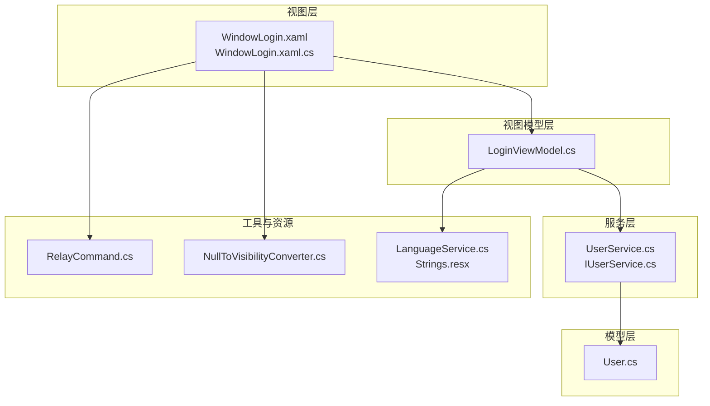
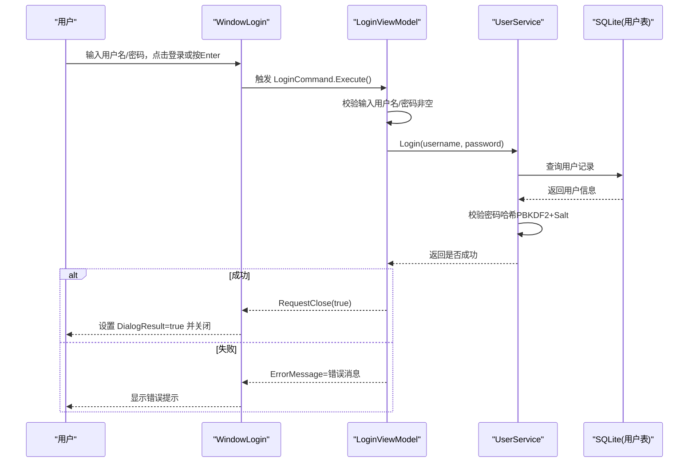
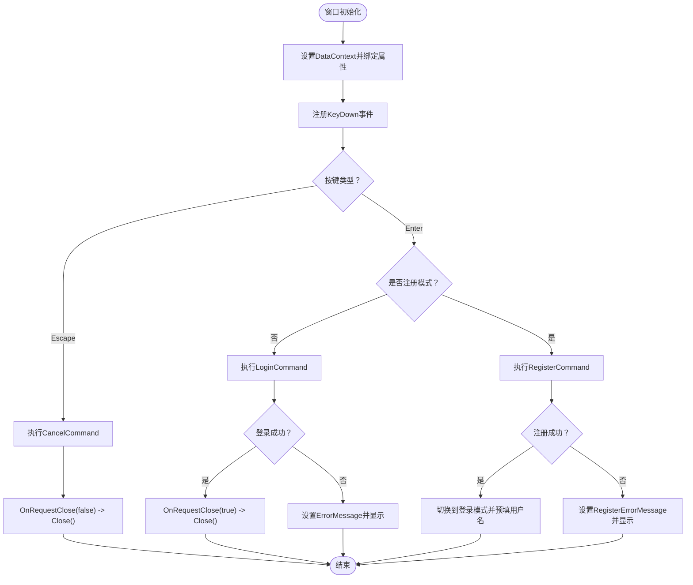
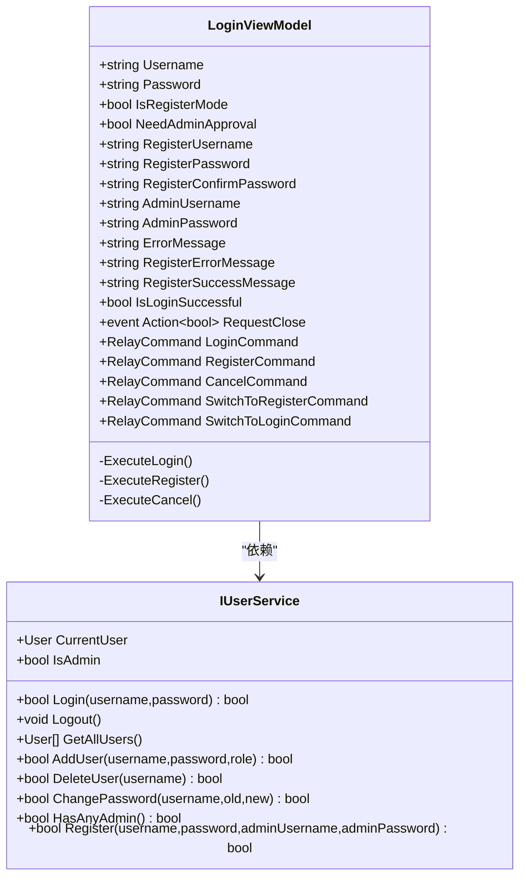
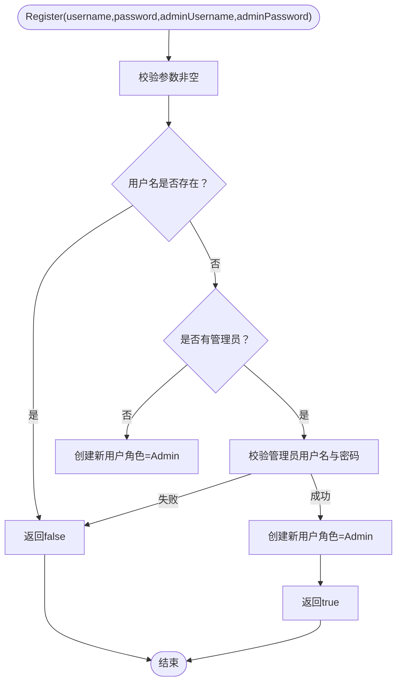
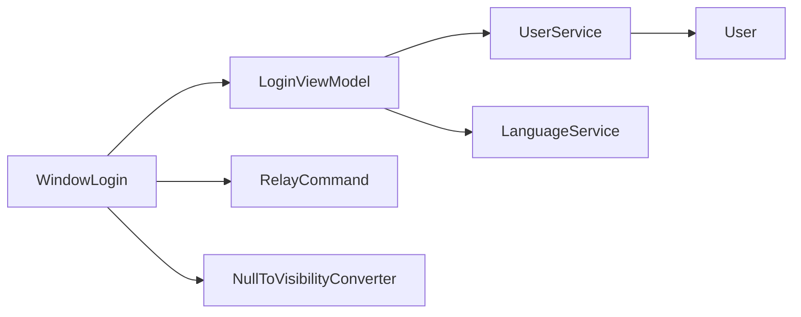

# 登录窗口

<cite>
**本文引用的文件**   
- [WindowLogin.xaml](file://ShaoLu/Views/WindowLogin.xaml)
- [WindowLogin.xaml.cs](file://ShaoLu/Views/WindowLogin.xaml.cs)
- [LoginViewModel.cs](file://ShaoLu/Viewmodels/LoginViewModel.cs)
- [IUserService.cs](file://ShaoLu/Services/IUserService.cs)
- [UserService.cs](file://ShaoLu/Services/UserService.cs)
- [User.cs](file://ShaoLu/Models/User.cs)
- [RelayCommand.cs](file://ShaoLu/Utils/RelayCommand.cs)
- [NullToVisibilityConverter.cs](file://ShaoLu/Converters/NullToVisibilityConverter.cs)
- [LanguageService.cs](file://ShaoLu/Services/LanguageService.cs)
- [MainWindow.xaml.cs](file://ShaoLu/MainWindow.xaml.cs)
- [Strings.resx](file://ShaoLu/Resources/Strings.resx)
</cite>

## 目录
1. [简介](#简介)
2. [项目结构](#项目结构)
3. [核心组件](#核心组件)
4. [架构总览](#架构总览)
5. [详细组件分析](#详细组件分析)
6. [依赖关系分析](#依赖关系分析)
7. [性能考虑](#性能考虑)
8. [故障排查指南](#故障排查指南)
9. [结论](#结论)
10. [附录](#附录)

## 简介
本文件为 ShaoLu 的“登录窗口”开发文档，覆盖以下要点：
- 用户认证流程与注册功能
- 管理员密码验证（首次注册或已有管理员时的审批）
- 模态窗口交互（ShowDialog、结果返回）
- LoginViewModel 的数据绑定机制、命令模式与异步处理建议
- 键盘快捷键支持（Enter 登录、Escape 关闭）、密码框事件处理、窗口拖动
- 错误处理、用户反馈与安全最佳实践

## 项目结构
登录窗口采用 WPF 的 MVVM 模式：
- View：WindowLogin.xaml/.cs 负责 UI 与交互
- ViewModel：LoginViewModel 负责状态、命令与业务编排
- Service：UserService 实现用户认证、注册、权限判断等
- Model：User 定义用户数据模型
- Utils：RelayCommand 提供命令封装
- Converters：NullToVisibilityConverter 用于空值到可见性的转换
- Localization：LanguageService + Strings.resx 提供多语言文本

图表来源
- [WindowLogin.xaml:1-191](file://ShaoLu/Views/WindowLogin.xaml#L1-L191)
- [WindowLogin.xaml.cs:1-87](file://ShaoLu/Views/WindowLogin.xaml.cs#L1-L87)
- [LoginViewModel.cs:1-251](file://ShaoLu/Viewmodels/LoginViewModel.cs#L1-L251)
- [UserService.cs:1-239](file://ShaoLu/Services/UserService.cs#L1-L239)
- [User.cs:1-33](file://ShaoLu/Models/User.cs#L1-L33)
- [RelayCommand.cs:1-113](file://ShaoLu/Utils/RelayCommand.cs#L1-L113)
- [NullToVisibilityConverter.cs:1-26](file://ShaoLu/Converters/NullToVisibilityConverter.cs#L1-L26)
- [LanguageService.cs:1-66](file://ShaoLu/Services/LanguageService.cs#L1-L66)
- [Strings.resx:546-623](file://ShaoLu/Resources/Strings.resx#L546-L623)

章节来源
- [WindowLogin.xaml:1-191](file://ShaoLu/Views/WindowLogin.xaml#L1-L191)
- [WindowLogin.xaml.cs:1-87](file://ShaoLu/Views/WindowLogin.xaml.cs#L1-L87)
- [LoginViewModel.cs:1-251](file://ShaoLu/Viewmodels/LoginViewModel.cs#L1-L251)

## 核心组件
- WindowLogin（View）
  - 使用 DataContext 绑定 LoginViewModel
  - 通过 PasswordChanged 事件将 PasswordBox 的值同步到 ViewModel
  - 处理 Enter/Escape 快捷键、窗口拖动、关闭按钮
  - 订阅 RequestClose 事件以设置 DialogResult 并关闭窗口
- LoginViewModel（ViewModel）
  - 暴露 Username、Password、IsRegisterMode、NeedAdminApproval 等属性
  - 暴露 LoginCommand、RegisterCommand、CancelCommand、SwitchToRegisterCommand、SwitchToLoginCommand
  - 执行登录校验、注册校验、调用 UserService
  - 通过 RequestClose 事件通知 View 关闭
- UserService（Service）
  - 基于 FreeSql + SQLite 持久化用户数据
  - 实现 Login、Register、HasAnyAdmin、AddUser、ChangePassword、DeleteUser 等方法
  - 使用 PBKDF2(SHA256) + Salt 进行密码哈希与比较
- User（Model）
  - 包含 Id、Username、PasswordHash、Salt、Role、CreatedAt
- RelayCommand（Utils）
  - 实现 ICommand，支持 Execute/CanExecute
- NullToVisibilityConverter（Converters）
  - 将 null 转换为 Collapsed，非 null 转换为 Visible
- LanguageService（Localization）
  - 提供 GetLocalizedString 获取本地化字符串

章节来源
- [WindowLogin.xaml.cs:1-87](file://ShaoLu/Views/WindowLogin.xaml.cs#L1-L87)
- [LoginViewModel.cs:1-251](file://ShaoLu/Viewmodels/LoginViewModel.cs#L1-L251)
- [UserService.cs:1-239](file://ShaoLu/Services/UserService.cs#L1-L239)
- [User.cs:1-33](file://ShaoLu/Models/User.cs#L1-L33)
- [RelayCommand.cs:1-113](file://ShaoLu/Utils/RelayCommand.cs#L1-L113)
- [NullToVisibilityConverter.cs:1-26](file://ShaoLu/Converters/NullToVisibilityConverter.cs#L1-L26)
- [LanguageService.cs:1-66](file://ShaoLu/Services/LanguageService.cs#L1-L66)

## 架构总览
登录窗口采用 MVVM + 服务层的分层架构。View 仅负责展示与输入，ViewModel 编排业务逻辑并通过服务访问数据层。

图表来源
- [WindowLogin.xaml.cs:19-40](file://ShaoLu/Views/WindowLogin.xaml.cs#L19-L40)
- [LoginViewModel.cs:49-75](file://ShaoLu/Viewmodels/LoginViewModel.cs#L49-L75)
- [UserService.cs:76-93](file://ShaoLu/Services/UserService.cs#L76-L93)

章节来源
- [MainWindow.xaml.cs:356-373](file://ShaoLu/MainWindow.xaml.cs#L356-L373)
- [WindowLogin.xaml.cs:1-87](file://ShaoLu/Views/WindowLogin.xaml.cs#L1-L87)
- [LoginViewModel.cs:1-251](file://ShaoLu/Viewmodels/LoginViewModel.cs#L1-L251)
- [UserService.cs:1-239](file://ShaoLu/Services/UserService.cs#L1-L239)

## 详细组件分析

### 登录窗口（WindowLogin）
- 数据绑定
  - DataContext 设置为 LoginViewModel
  - 文本框绑定 Username、RegisterUsername 等属性
  - 错误消息通过 NullToVisibilityConverter 控制显示
- 键盘快捷键
  - Escape：调用 CancelCommand 关闭
  - Enter：在登录模式下触发 LoginCommand；在注册模式下触发 RegisterCommand
- 密码框事件
  - PasswordChanged 事件将 PasswordBox.Password 同步到 ViewModel 对应属性
- 窗口拖动
  - 重写 OnMouseLeftButtonDown，调用 DragMove 支持自定义标题栏拖动
- 模态交互
  - 订阅 RequestClose 事件，设置 DialogResult 并 Close

图表来源
- [WindowLogin.xaml.cs:19-40](file://ShaoLu/Views/WindowLogin.xaml.cs#L19-L40)
- [WindowLogin.xaml.cs:78-84](file://ShaoLu/Views/WindowLogin.xaml.cs#L78-L84)
- [WindowLogin.xaml.cs:48-66](file://ShaoLu/Views/WindowLogin.xaml.cs#L48-L66)

章节来源
- [WindowLogin.xaml:1-191](file://ShaoLu/Views/WindowLogin.xaml#L1-L191)
- [WindowLogin.xaml.cs:1-87](file://ShaoLu/Views/WindowLogin.xaml.cs#L1-L87)

### 视图模型（LoginViewModel）
- 数据属性
  - Username、Password、IsRegisterMode、NeedAdminApproval
  - RegisterUsername、RegisterPassword、RegisterConfirmPassword、AdminUsername、AdminPassword
  - ErrorMessage、RegisterErrorMessage、RegisterSuccessMessage
- 命令
  - LoginCommand：校验输入，调用 UserService.Login，成功后设置 IsLoginSuccessful 并触发 RequestClose
  - RegisterCommand：校验注册表单，必要时校验管理员凭据，调用 UserService.Register，成功后切换至登录模式并预填用户名
  - CancelCommand：触发 RequestClose(false)
  - SwitchToRegisterCommand/SwitchToLoginCommand：切换模式并更新 NeedAdminApproval
- 本地化
  - 通过 LanguageService.GetLocalizedString 获取错误消息与提示文本

图表来源
- [LoginViewModel.cs:1-251](file://ShaoLu/Viewmodels/LoginViewModel.cs#L1-L251)
- [IUserService.cs:1-20](file://ShaoLu/Services/IUserService.cs#L1-L20)

章节来源
- [LoginViewModel.cs:1-251](file://ShaoLu/Viewmodels/LoginViewModel.cs#L1-L251)
- [LanguageService.cs:1-66](file://ShaoLu/Services/LanguageService.cs#L1-L66)

### 服务层（UserService）
- 数据库
  - 使用 FreeSql 连接 SQLite，自动建表
  - 用户表 app_user，字段包括 Id、Username、PasswordHash、Salt、Role、CreatedAt
- 安全
  - 生成随机 Salt（RNGCryptoServiceProvider）
  - 使用 PBKDF2(SHA256) 计算密码哈希
  - 常量时间比较避免时序攻击
- 登录
  - 根据用户名查找用户，校验密码哈希，成功后设置 CurrentUser
- 注册
  - 若系统已有管理员，则必须提供管理员用户名和密码进行审批
  - 首次注册的用户自动成为管理员
- 其他
  - HasAnyAdmin、AddUser、ChangePassword、DeleteUser 等管理方法

图表来源
- [UserService.cs:194-236](file://ShaoLu/Services/UserService.cs#L194-L236)

章节来源
- [UserService.cs:1-239](file://ShaoLu/Services/UserService.cs#L1-L239)
- [User.cs:1-33](file://ShaoLu/Models/User.cs#L1-L33)

### 转换器与本地化
- NullToVisibilityConverter
  - 将 null 映射为 Collapsed，非 null 映射为 Visible，支持 Inverse 参数
- LanguageService
  - 读取当前语言配置，提供 GetLocalizedString(key) 获取本地化文本
  - 登录窗口的错误消息与提示均通过该服务获取

章节来源
- [NullToVisibilityConverter.cs:1-26](file://ShaoLu/Converters/NullToVisibilityConverter.cs#L1-L26)
- [LanguageService.cs:1-66](file://ShaoLu/Services/LanguageService.cs#L1-L66)
- [Strings.resx:546-623](file://ShaoLu/Resources/Strings.resx#L546-L623)

### 主窗口集成（模态调用）
- MainWindow 在需要编辑功能时检查登录状态
- 未登录则创建 LoginViewModel 和 WindowLogin，设置 Owner 并以 ShowDialog 显示
- 根据 DialogResult 决定是否刷新登录状态 UI

章节来源
- [MainWindow.xaml.cs:356-373](file://ShaoLu/MainWindow.xaml.cs#L356-L373)

## 依赖关系分析
- View 依赖 ViewModel（DataContext）
- ViewModel 依赖 IUserService（接口解耦）
- Service 依赖 Model（User）与 FreeSql（SQLite）
- View 依赖 RelayCommand（命令）与 NullToVisibilityConverter（UI 绑定）
- ViewModel 依赖 LanguageService（本地化）

图表来源
- [WindowLogin.xaml.cs:1-87](file://ShaoLu/Views/WindowLogin.xaml.cs#L1-L87)
- [LoginViewModel.cs:1-251](file://ShaoLu/Viewmodels/LoginViewModel.cs#L1-L251)
- [UserService.cs:1-239](file://ShaoLu/Services/UserService.cs#L1-L239)
- [User.cs:1-33](file://ShaoLu/Models/User.cs#L1-L33)
- [RelayCommand.cs:1-113](file://ShaoLu/Utils/RelayCommand.cs#L1-L113)
- [NullToVisibilityConverter.cs:1-26](file://ShaoLu/Converters/NullToVisibilityConverter.cs#L1-L26)
- [LanguageService.cs:1-66](file://ShaoLu/Services/LanguageService.cs#L1-L66)

章节来源
- [MainWindow.xaml.cs:356-373](file://ShaoLu/MainWindow.xaml.cs#L356-L373)

## 性能考虑
- 数据库操作
  - FreeSql 单例懒加载，避免重复初始化
  - 登录/注册均为轻量查询与插入，适合桌面应用
- 密码哈希
  - PBKDF2 迭代次数适中（10000），兼顾安全与性能
- UI 响应
  - 当前登录/注册逻辑为同步调用，若未来增加网络请求或耗时操作，建议改为异步命令（AsyncRelayCommand）并在 UI 线程更新状态
- 内存与资源
  - 窗口关闭后释放事件订阅（RequestClose）以避免内存泄漏

[本节为通用指导，不直接分析具体文件]

## 故障排查指南
- 登录失败
  - 检查用户名与密码是否正确
  - 查看 ErrorMessage 是否为空（由 ViewModel 设置）
  - 确认数据库中用户存在且密码哈希匹配
- 注册失败
  - 若已有管理员，需正确输入管理员用户名与密码
  - 检查用户名是否已存在
  - 查看 RegisterErrorMessage 提示信息
- 界面不显示错误消息
  - 检查 NullToVisibilityConverter 绑定是否正确
  - 确认 ErrorMessage/RegisterErrorMessage 非空
- 快捷键无效
  - 确认焦点在窗口内
  - 检查 KeyDown 事件是否被其他控件拦截
- 无法拖动窗口
  - 确保 WindowStyle=None 且 AllowsTransparency=True
  - 检查 OnMouseLeftButtonDown 是否调用 DragMove

章节来源
- [LoginViewModel.cs:49-75](file://ShaoLu/Viewmodels/LoginViewModel.cs#L49-L75)
- [LoginViewModel.cs:175-248](file://ShaoLu/Viewmodels/LoginViewModel.cs#L175-L248)
- [WindowLogin.xaml.cs:19-40](file://ShaoLu/Views/WindowLogin.xaml.cs#L19-L40)
- [WindowLogin.xaml.cs:78-84](file://ShaoLu/Views/WindowLogin.xaml.cs#L78-L84)
- [NullToVisibilityConverter.cs:1-26](file://ShaoLu/Converters/NullToVisibilityConverter.cs#L1-L26)

## 结论
登录窗口通过清晰的 MVVM 分层实现了用户认证与注册功能，结合管理员审批机制保障安全性。命令模式与数据绑定简化了 UI 与逻辑的耦合，本地化服务提升了用户体验。建议在后续迭代中引入异步命令以提升长时间操作的响应性，并持续优化错误提示与用户引导。

[本节为总结，不直接分析具体文件]

## 附录
- 关键本地化键（示例）
  - LoginTitle、Login_Username、Login_Password、Login_Button、Login_Cancel
  - RegisterTitle、Register_ConfirmPassword、Register_NeedAdminApproval、Register_AdminUsername、Register_AdminPassword、Register_FirstAdminHint
  - Error_EmptyUsername、Error_EmptyPassword、Error_LoginFailed、Error_PasswordMismatch、Error_PasswordTooShort、Error_EmptyAdminUsername、Error_EmptyAdminPassword、Error_RegisterFailedAdmin、Error_RegisterFailed
- 数据模型字段
  - User.Id、User.Username、User.PasswordHash、User.Salt、User.Role、User.CreatedAt

章节来源
- [Strings.resx:546-623](file://ShaoLu/Resources/Strings.resx#L546-L623)
- [User.cs:1-33](file://ShaoLu/Models/User.cs#L1-L33)