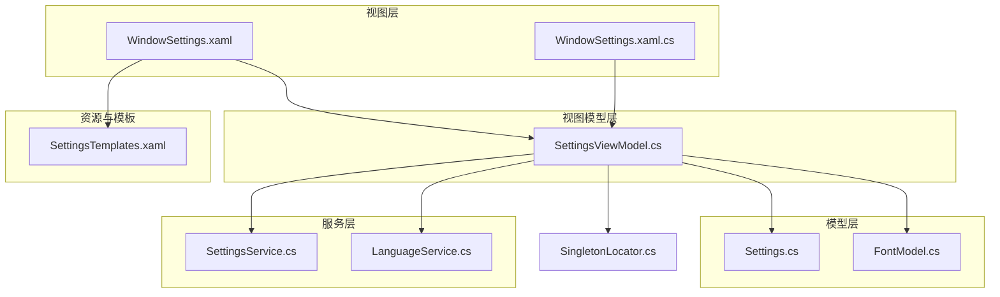
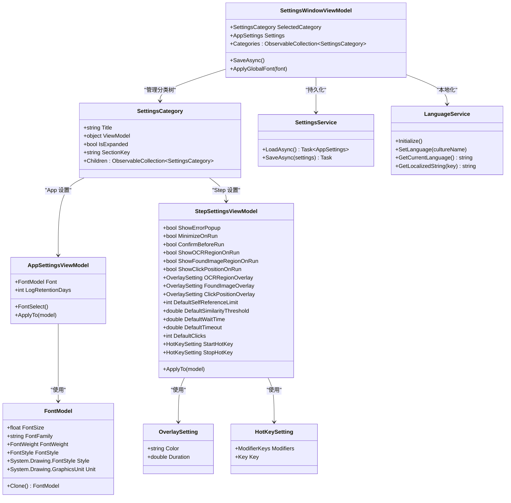
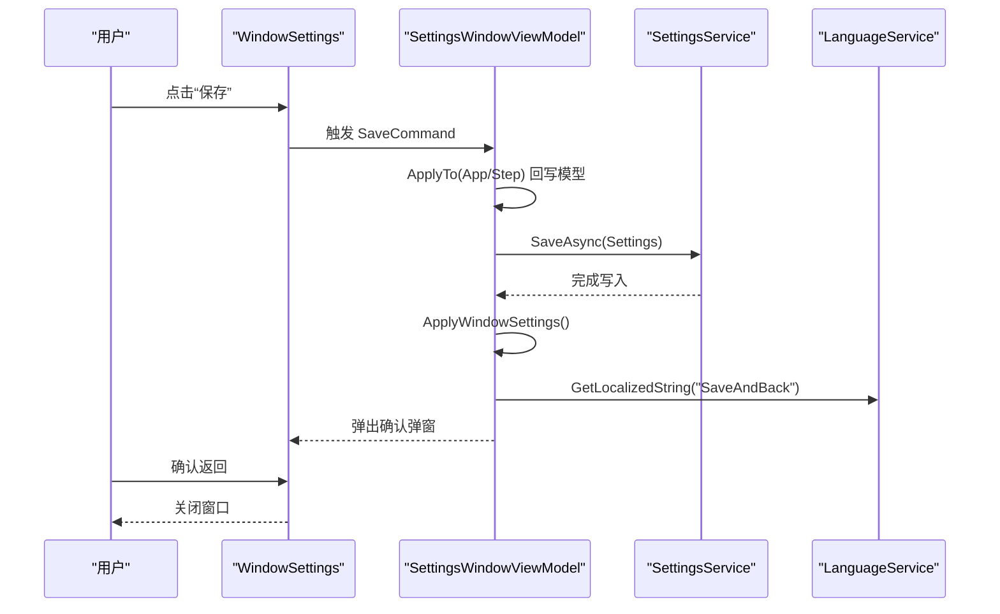
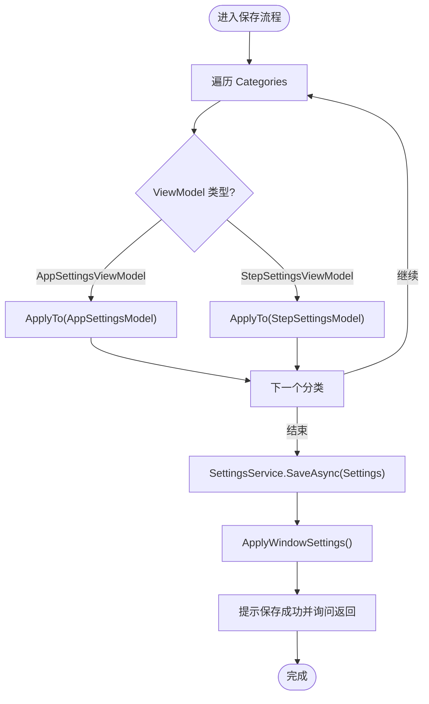
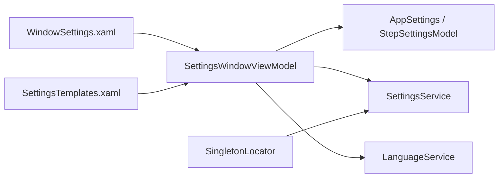

# 设置窗口

<cite>
**本文引用的文件**   
- [SettingsViewModel.cs](file://ShaoLu/Viewmodels/SettingsViewModel.cs)
- [WindowSettings.xaml](file://ShaoLu/Views/WindowSettings.xaml)
- [WindowSettings.xaml.cs](file://ShaoLu/Views/WindowSettings.xaml.cs)
- [SettingsTemplates.xaml](file://ShaoLu/Templates/SettingsTemplates.xaml)
- [Settings.cs](file://ShaoLu/Models/Settings.cs)
- [FontModel.cs](file://ShaoLu/Models/FontModel.cs)
- [SettingsService.cs](file://ShaoLu/Services/SettingsService.cs)
- [SingletonLocator.cs](file://ShaoLu/Utils/SingletonLocator.cs)
- [LanguageService.cs](file://ShaoLu/Services/LanguageService.cs)
</cite>

## 目录
1. [简介](#简介)
2. [项目结构](#项目结构)
3. [核心组件](#核心组件)
4. [架构总览](#架构总览)
5. [详细组件分析](#详细组件分析)
6. [依赖关系分析](#依赖关系分析)
7. [性能考虑](#性能考虑)
8. [故障排查指南](#故障排查指南)
9. [结论](#结论)
10. [附录](#附录)

## 简介
本文件为 ShaoLu 的“设置窗口”提供完整的开发文档，覆盖配置界面的实现、数据验证与持久化、实时预览、分组导航与滚动定位、以及用户偏好保存等关键能力。重点说明 SettingsViewModel 的配置管理逻辑、不同设置类型的界面控件选择策略、默认值管理与配置文件读写流程，帮助开发者快速理解并扩展设置功能。

## 项目结构
设置窗口采用 MVVM 模式：
- View（视图）：WindowSettings.xaml/.cs 负责布局与交互事件
- ViewModel（视图模型）：SettingsViewModel.cs 负责状态、命令、数据绑定与业务编排
- Model（模型）：Settings.cs、FontModel.cs 定义数据结构与默认值
- Service（服务）：SettingsService.cs 负责 JSON 序列化/反序列化的持久化
- 模板与资源：SettingsTemplates.xaml 定义各类设置的 UI 模板
- 工具与服务：LanguageService.cs 提供本地化；SingletonLocator.cs 暴露全局单例 Settings

图表来源
- [WindowSettings.xaml:1-79](file://ShaoLu/Views/WindowSettings.xaml#L1-L79)
- [WindowSettings.xaml.cs:1-85](file://ShaoLu/Views/WindowSettings.xaml.cs#L1-L85)
- [SettingsViewModel.cs:1-260](file://ShaoLu/Viewmodels/SettingsViewModel.cs#L1-L260)
- [Settings.cs:1-117](file://ShaoLu/Models/Settings.cs#L1-L117)
- [FontModel.cs:1-46](file://ShaoLu/Models/FontModel.cs#L1-L46)
- [SettingsService.cs:1-38](file://ShaoLu/Services/SettingsService.cs#L1-L38)
- [LanguageService.cs:1-67](file://ShaoLu/Services/LanguageService.cs#L1-L67)
- [SingletonLocator.cs:1-19](file://ShaoLu/Utils/SingletonLocator.cs#L1-L19)

章节来源
- [WindowSettings.xaml:1-79](file://ShaoLu/Views/WindowSettings.xaml#L1-L79)
- [WindowSettings.xaml.cs:1-85](file://ShaoLu/Views/WindowSettings.xaml.cs#L1-L85)
- [SettingsViewModel.cs:1-260](file://ShaoLu/Viewmodels/SettingsViewModel.cs#L1-L260)
- [SettingsTemplates.xaml:1-170](file://ShaoLu/Templates/SettingsTemplates.xaml#L1-L170)
- [Settings.cs:1-117](file://ShaoLu/Models/Settings.cs#L1-L117)
- [FontModel.cs:1-46](file://ShaoLu/Models/FontModel.cs#L1-L46)
- [SettingsService.cs:1-38](file://ShaoLu/Services/SettingsService.cs#L1-L38)
- [LanguageService.cs:1-67](file://ShaoLu/Services/LanguageService.cs#L1-L67)
- [SingletonLocator.cs:1-19](file://ShaoLu/Utils/SingletonLocator.cs#L1-L19)

## 核心组件
- 设置分类节点 SettingsCategory：用于左侧树形导航，包含标题、子项、展开状态与 SectionKey（用于右侧滚动定位）。
- AppSettingsViewModel：管理应用级设置（字体、日志保留天数），提供字体选择命令与 ApplyTo 回写方法。
- StepSettingsViewModel：管理步骤运行行为、默认参数与调试覆盖层设置，支持布尔开关、数值输入与颜色/时长编辑。
- SettingsWindowViewModel：构建分类树、绑定 SelectedCategory、执行 SaveAsync 保存并应用全局字体。
- WindowSettings：承载 UI，处理 TreeView 选中变化与滚动定位，底部按钮触发保存或取消。
- SettingsService：JSON 文件的异步加载与保存。
- LanguageService：多语言字符串获取与当前语言持久化。
- SingletonLocator：提供全局 Settings 实例入口。

章节来源
- [SettingsViewModel.cs:1-260](file://ShaoLu/Viewmodels/SettingsViewModel.cs#L1-L260)
- [WindowSettings.xaml.cs:1-85](file://ShaoLu/Views/WindowSettings.xaml.cs#L1-L85)
- [SettingsService.cs:1-38](file://ShaoLu/Services/SettingsService.cs#L1-L38)
- [LanguageService.cs:1-67](file://ShaoLu/Services/LanguageService.cs#L1-L67)
- [SingletonLocator.cs:1-19](file://ShaoLu/Utils/SingletonLocator.cs#L1-L19)

## 架构总览
设置窗口通过 MVVM 将 UI 与业务解耦：
- 视图层使用 DataTemplate 渲染不同类型的设置面板（App/Step）
- 视图模型维护分类树与选中项，提供命令进行保存与应用
- 模型层集中定义所有设置项及其默认值
- 服务层负责 JSON 持久化与国际化文本
- 单例定位器在应用启动时加载 Settings，供各模块共享

图表来源
- [SettingsViewModel.cs:1-260](file://ShaoLu/Viewmodels/SettingsViewModel.cs#L1-L260)
- [Settings.cs:1-117](file://ShaoLu/Models/Settings.cs#L1-L117)
- [FontModel.cs:1-46](file://ShaoLu/Models/FontModel.cs#L1-L46)
- [SettingsService.cs:1-38](file://ShaoLu/Services/SettingsService.cs#L1-L38)
- [LanguageService.cs:1-67](file://ShaoLu/Services/LanguageService.cs#L1-L67)

## 详细组件分析

### 设置窗口视图（WindowSettings）
- 布局分为左右两栏：左侧 TreeView 展示分类树，右侧 ScrollViewer 承载可滚动的设置面板。
- 通过 ContentControl 绑定 Categories[0] 与 Categories[1] 的 ViewModel，分别渲染 App 与 Step 设置模板。
- TreeView_SelectedItemChanged 更新 SelectedCategory，并根据 SectionKey 调用 ScrollToSection 滚动到对应区域。
- 底部按钮绑定 SaveCommand 与 Cancel_Click，完成保存或关闭窗口。

图表来源
- [WindowSettings.xaml:1-79](file://ShaoLu/Views/WindowSettings.xaml#L1-L79)
- [WindowSettings.xaml.cs:1-85](file://ShaoLu/Views/WindowSettings.xaml.cs#L1-L85)
- [SettingsViewModel.cs:1-260](file://ShaoLu/Viewmodels/SettingsViewModel.cs#L1-L260)
- [SettingsService.cs:1-38](file://ShaoLu/Services/SettingsService.cs#L1-L38)
- [LanguageService.cs:1-67](file://ShaoLu/Services/LanguageService.cs#L1-L67)

章节来源
- [WindowSettings.xaml:1-79](file://ShaoLu/Views/WindowSettings.xaml#L1-L79)
- [WindowSettings.xaml.cs:1-85](file://ShaoLu/Views/WindowSettings.xaml.cs#L1-L85)

### 视图模型（SettingsViewModel）
- SettingsCategory：封装分类标题、子项集合、展开状态与 SectionKey，用于导航与滚动定位。
- AppSettingsViewModel：
  - 属性：Font（字体）、LogRetentionDays（日志保留天数）
  - 构造函数从 AppSettingsModel 初始化
  - ApplyTo 将 ViewModel 的值回写到模型
  - FontSelect 打开系统字体对话框，选择后生成 FontModel
- StepSettingsViewModel：
  - 属性：运行行为开关、默认参数（相似度阈值、等待时间、超时、点击次数）、调试覆盖层（颜色与时长）、热键设置
  - 构造函数从 StepSettingsModel 初始化
  - ApplyTo 将 ViewModel 的值回写到模型
- SettingsWindowViewModel：
  - 构造时从 SingletonLocator.Settings 获取全局 AppSettings，BuildTree 构建分类树并默认选中 App 分类
  - SaveAsync：遍历分类，调用各自 ApplyTo 回写模型，然后调用 SettingsService.SaveAsync，最后应用全局字体并提示是否返回
  - ApplyGlobalFont：将字体应用到所有已打开窗口

图表来源
- [SettingsViewModel.cs:1-260](file://ShaoLu/Viewmodels/SettingsViewModel.cs#L1-L260)

章节来源
- [SettingsViewModel.cs:1-260](file://ShaoLu/Viewmodels/SettingsViewModel.cs#L1-L260)

### 模板与界面控件（SettingsTemplates.xaml）
- App 设置模板：
  - 字体：TextBox 绑定 Font.FontFamily 与 Font.FontSize，按钮触发 FontSelectCommand
  - 日志保留天数：NumericBox 绑定 LogRetentionDays，范围 0~3650，显示单位提示
- Step 设置模板：
  - 运行行为：CheckBox 绑定 ShowErrorPopup、MinimizeOnRun、ConfirmBeforeRun
  - 默认参数：NumericBox 绑定 DefaultSimilarityThreshold（精度 3，间隔 0.05，范围 0~1）、DefaultWaitTime（精度 3，间隔 0.1）、DefaultTimeout（精度 3，间隔 0.5）、DefaultClicks（范围 1~999）
  - 调试选项：每行包含 CheckBox、颜色 TextBox（LostFocus 触发更新）、NumericBox（覆盖层持续时间，范围 0.5~30，精度 1，间隔 0.5）
- 每个 Expander 设置 Tag 为 SectionKey，便于右侧滚动定位

章节来源
- [SettingsTemplates.xaml:1-170](file://ShaoLu/Templates/SettingsTemplates.xaml#L1-L170)

### 模型与默认值（Settings.cs、FontModel.cs）
- AppSettingsModel：窗口尺寸、字体、日志保留天数（0=永不清理）
- StepSettingsModel：运行行为开关、自引用限制、确认运行、调试覆盖层（颜色与时长）、默认相似度阈值、默认等待/超时时间、默认点击次数、开始/停止热键
- OverlaySetting：颜色（十六进制字符串）、持续时间（秒）
- HotKeySetting：修饰键与主键
- FontModel：字体族、大小、粗细、样式、单位、颜色与边框相关属性，并提供 Clone 方法与默认系统字体初始化

章节来源
- [Settings.cs:1-117](file://ShaoLu/Models/Settings.cs#L1-L117)
- [FontModel.cs:1-46](file://ShaoLu/Models/FontModel.cs#L1-L46)

### 持久化存储（SettingsService.cs）
- 路径：应用根目录 settings.json
- LoadAsync：若文件不存在则返回空 AppSettings；存在则反序列化为对象
- SaveAsync：以缩进格式序列化到文件

章节来源
- [SettingsService.cs:1-38](file://ShaoLu/Services/SettingsService.cs#L1-L38)

### 单例与全局设置（SingletonLocator.cs）
- 提供静态 Settings 字段，应用启动时通过 SettingsService.LoadAsync().GetAwaiter().GetResult() 同步加载
- 其他模块可通过 SingletonLocator.Settings 访问全局配置

章节来源
- [SingletonLocator.cs:1-19](file://ShaoLu/Utils/SingletonLocator.cs#L1-L19)

### 本地化（LanguageService.cs）
- Initialize：读取上次保存的语言文件或系统语言，设置 LocalizeDictionary 的 Culture
- SetLanguage：设置语言并持久化到 current_language.txt
- GetLocalizedString：根据 key 获取本地化字符串，找不到时返回 key 或默认值

章节来源
- [LanguageService.cs:1-67](file://ShaoLu/Services/LanguageService.cs#L1-L67)

## 依赖关系分析
- 视图依赖视图模型：WindowSettings 绑定 SettingsWindowViewModel，并通过命令与事件驱动交互
- 视图模型依赖模型与服务：SettingsViewModel 持有 AppSettings，调用 SettingsService 持久化，并使用 LanguageService 获取本地化文本
- 模板依赖 ViewModel 类型：DataTemplate 按类型选择 AppSettingsViewModel 或 StepSettingsViewModel 的 UI
- 单例依赖服务：SingletonLocator.Settings 由 SettingsService 加载

图表来源
- [WindowSettings.xaml:1-79](file://ShaoLu/Views/WindowSettings.xaml#L1-L79)
- [SettingsViewModel.cs:1-260](file://ShaoLu/Viewmodels/SettingsViewModel.cs#L1-L260)
- [SettingsService.cs:1-38](file://ShaoLu/Services/SettingsService.cs#L1-L38)
- [LanguageService.cs:1-67](file://ShaoLu/Services/LanguageService.cs#L1-L67)
- [SettingsTemplates.xaml:1-170](file://ShaoLu/Templates/SettingsTemplates.xaml#L1-L170)
- [SingletonLocator.cs:1-19](file://ShaoLu/Utils/SingletonLocator.cs#L1-L19)

章节来源
- [SettingsViewModel.cs:1-260](file://ShaoLu/Viewmodels/SettingsViewModel.cs#L1-L260)
- [SettingsService.cs:1-38](file://ShaoLu/Services/SettingsService.cs#L1-L38)
- [LanguageService.cs:1-67](file://ShaoLu/Services/LanguageService.cs#L1-L67)
- [SettingsTemplates.xaml:1-170](file://ShaoLu/Templates/SettingsTemplates.xaml#L1-L170)
- [SingletonLocator.cs:1-19](file://ShaoLu/Utils/SingletonLocator.cs#L1-L19)

## 性能考虑
- 设置保存为异步操作，避免阻塞 UI 线程
- JSON 序列化使用 WriteIndented=true，可读性好但体积略大；如需优化可关闭缩进
- 字体应用遍历所有已打开窗口，窗口数量较多时可能带来轻微开销；建议仅在保存后执行一次
- 模板中 NumericBox 与 TextBox 的 UpdateSourceTrigger 设置为 PropertyChanged 或 LostFocus，减少频繁绑定更新

## 故障排查指南
- 保存失败
  - 检查 settings.json 文件路径是否存在且可写
  - 查看 SettingsService.SaveAsync 是否抛出异常（如权限不足）
- 字体未生效
  - 确认 FontModel 的 FontFamily 非空
  - 检查 ApplyGlobalFont 是否正确遍历 Application.Current.Windows
- 语言切换无效
  - 确认 LanguageService.SetLanguage 成功写入 current_language.txt
  - 检查 LocalizeDictionary 的 Culture 是否设置成功
- 滚动定位不生效
  - 确保 Expander 的 Tag 与 SectionKey 一致
  - 检查 FindElementByTag 递归查找逻辑是否命中目标元素

章节来源
- [SettingsService.cs:1-38](file://ShaoLu/Services/SettingsService.cs#L1-L38)
- [SettingsViewModel.cs:1-260](file://ShaoLu/Viewmodels/SettingsViewModel.cs#L1-L260)
- [LanguageService.cs:1-67](file://ShaoLu/Services/LanguageService.cs#L1-L67)
- [WindowSettings.xaml.cs:1-85](file://ShaoLu/Views/WindowSettings.xaml.cs#L1-L85)

## 结论
设置窗口通过清晰的 MVVM 分层与模板化 UI，实现了灵活的配置管理、实时预览与持久化存储。SettingsViewModel 作为核心协调者，统一管理分类树、数据回写与保存流程；模板与控件选择贴合数据类型，提升用户体验；服务层保证配置的可靠持久化与多语言支持。整体设计易于扩展与维护，适合持续增加新的设置项与界面控件。

## 附录
- 新增设置项建议流程
  - 在 Models/Settings.cs 中添加新属性与默认值
  - 在 Viewmodels/SettingsViewModel.cs 的对应 ViewModel 中添加属性与 ApplyTo 映射
  - 在 Templates/SettingsTemplates.xaml 中添加对应的 UI 控件与绑定
  - 如需分组导航，更新 BuildTree 中的分类与 SectionKey
  - 测试保存与加载流程，确保 JSON 序列化兼容