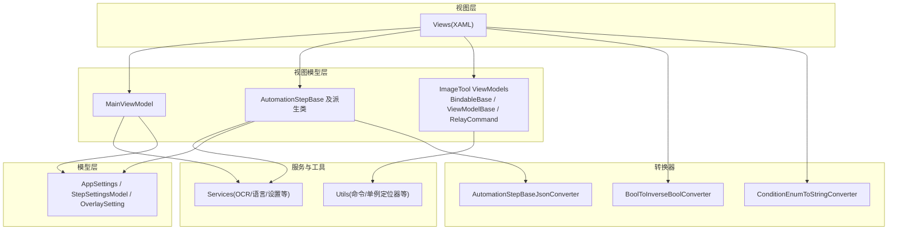
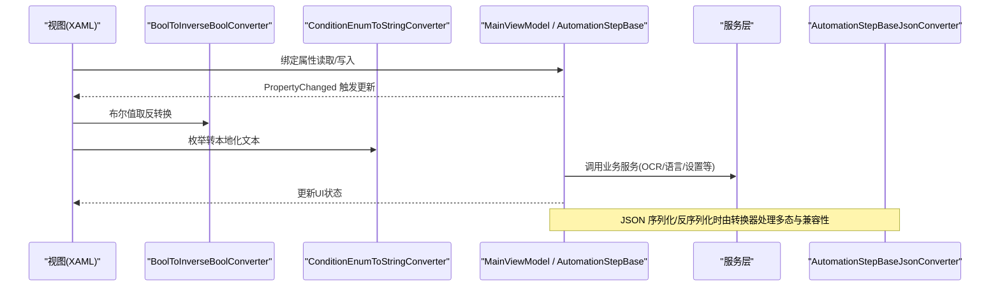
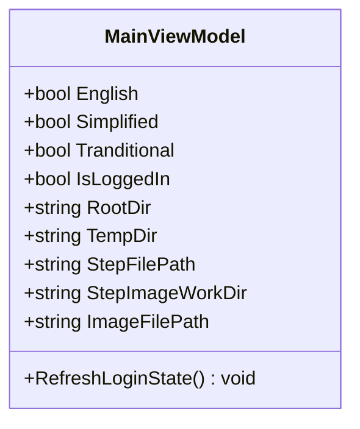
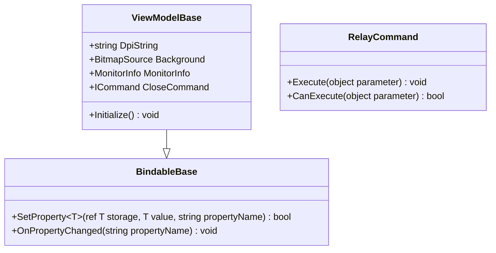
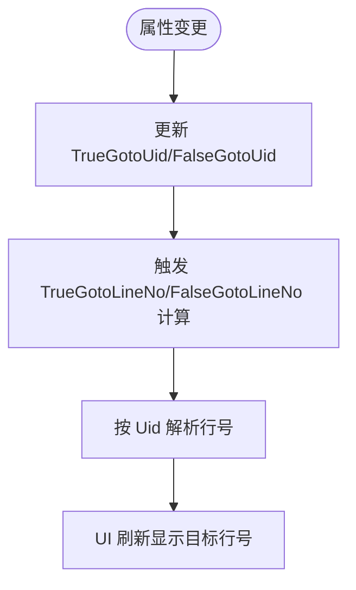
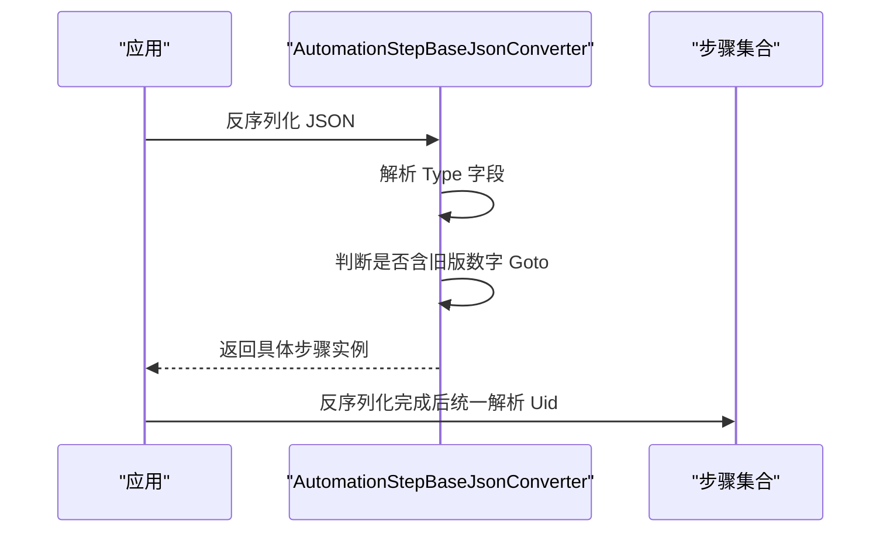
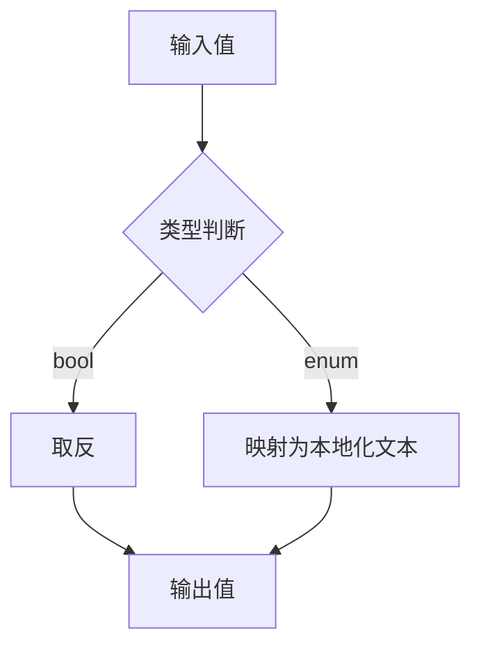
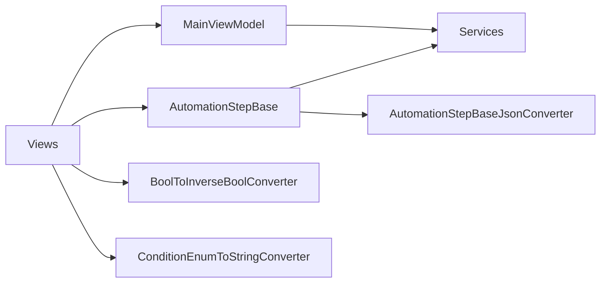

# 数据绑定系统

<cite>
**本文引用的文件**   
- [Readme.md](file://Readme.md)
- [MainViewModel.cs](file://ShaoLu/Viewmodels/MainViewModel.cs)
- [BindableBase.cs](file://ShaoLu/Tools/ImageEdit/ViewModels/BindableBase.cs)
- [ViewModelBase.cs](file://ShaoLu/Tools/ImageEdit/ViewModels/ViewModelBase.cs)
- [RelayCommand.cs](file://ShaoLu/Tools/ImageEdit/ViewModels/RelayCommand.cs)
- [AutomationStepJsonConverter.cs](file://ShaoLu/Converters/AutomationStepJsonConverter.cs)
- [BoolToInverseBoolConverter.cs](file://ShaoLu/Converters/BoolToInverseBoolConverter.cs)
- [ConditionEnumToStringConverter.cs](file://ShaoLu/Converters/ConditionEnumToStringConverter.cs)
- [Settings.cs](file://ShaoLu/Models/Settings.cs)
- [AutomationStep.cs](file://ShaoLu/Viewmodels/AutomationStep.cs)
</cite>

## 目录
1. [简介](#简介)
2. [项目结构](#项目结构)
3. [核心组件](#核心组件)
4. [架构总览](#架构总览)
5. [详细组件分析](#详细组件分析)
6. [依赖关系分析](#依赖关系分析)
7. [性能考虑](#性能考虑)
8. [故障排查指南](#故障排查指南)
9. [结论](#结论)
10. [附录](#附录)

## 简介
本文件为 ShaoLu 数据绑定系统的开发文档，聚焦 MVVM 模式下的数据绑定实现、转换器（Converter）的使用与自定义方法、JSON 序列化配置、数据类型转换与格式化规则、双向绑定、验证机制与错误处理，以及性能优化与调试技巧。读者可据此快速理解并扩展 ShaoLu 的绑定体系。

## 项目结构
ShaoLu 采用 WPF + MVVM 架构，视图层通过 XAML 绑定到 ViewModel；ViewModel 基于 CommunityToolkit.Mvvm 或自研基类提供属性变更通知；业务模型位于 Models，转换器位于 Converters，服务位于 Services，工具与辅助逻辑位于 Utils 与 Tools。

图表来源 
- [MainViewModel.cs:1-76](file://ShaoLu/Viewmodels/MainViewModel.cs#L1-L76)
- [AutomationStep.cs:1-200](file://ShaoLu/Viewmodels/AutomationStep.cs#L1-L200)
- [Settings.cs:1-117](file://ShaoLu/Models/Settings.cs#L1-L117)
- [BoolToInverseBoolConverter.cs:1-24](file://ShaoLu/Converters/BoolToInverseBoolConverter.cs#L1-L24)
- [ConditionEnumToStringConverter.cs:1-170](file://ShaoLu/Converters/ConditionEnumToStringConverter.cs#L1-L170)
- [AutomationStepJsonConverter.cs:1-185](file://ShaoLu/Converters/AutomationStepJsonConverter.cs#L1-L185)

章节来源
- [Readme.md:1-283](file://Readme.md#L1-L283)

## 核心组件
- 属性变更通知与双向绑定
  - 使用 CommunityToolkit.Mvvm 的 ObservableObject 与 SetProperty，简化 INotifyPropertyChanged 的实现，支持双向绑定与 UI 自动刷新。
  - 在图像编辑子模块中，使用自研 BindableBase 与 ViewModelBase，封装 SetProperty 与 OnPropertyChanged，并提供 ICommand 实现 RelayCommand。
- 步骤模型与通用属性
  - AutomationStepBase 定义所有自动化步骤的通用属性（名称、描述、启用、等待时间、跳转 Uid、执行结果、错误信息等），并通过只读属性将 Uid 映射为行号用于 UI 显示。
- JSON 多态序列化
  - AutomationStepBaseJsonConverter 负责基类到具体步骤类型的反序列化，兼容旧版数字行号跳转字段，并在反序列化后统一解析为 Uid。
- 值转换器
  - BoolToInverseBoolConverter：布尔取反，常用于“启用/禁用”、“可见性反转”等场景。
  - ConditionEnumToStringConverter：将条件相关枚举转换为本地化中文文本，供 UI 下拉框、提示等展示。

章节来源
- [MainViewModel.cs:1-76](file://ShaoLu/Viewmodels/MainViewModel.cs#L1-L76)
- [BindableBase.cs:1-25](file://ShaoLu/Tools/ImageEdit/ViewModels/BindableBase.cs#L1-L25)
- [ViewModelBase.cs:1-80](file://ShaoLu/Tools/ImageEdit/ViewModels/ViewModelBase.cs#L1-L80)
- [RelayCommand.cs:1-28](file://ShaoLu/Tools/ImageEdit/ViewModels/RelayCommand.cs#L1-L28)
- [AutomationStep.cs:1-200](file://ShaoLu/Viewmodels/AutomationStep.cs#L1-L200)
- [AutomationStepJsonConverter.cs:1-185](file://ShaoLu/Converters/AutomationStepJsonConverter.cs#L1-L185)
- [BoolToInverseBoolConverter.cs:1-24](file://ShaoLu/Converters/BoolToInverseBoolConverter.cs#L1-L24)
- [ConditionEnumToStringConverter.cs:1-170](file://ShaoLu/Converters/ConditionEnumToStringConverter.cs#L1-L170)

## 架构总览
下图展示了从视图到 ViewModel、再到模型与服务的数据流，以及转换器在绑定链中的作用。

图表来源 
- [MainViewModel.cs:1-76](file://ShaoLu/Viewmodels/MainViewModel.cs#L1-L76)
- [AutomationStep.cs:1-200](file://ShaoLu/Viewmodels/AutomationStep.cs#L1-L200)
- [BoolToInverseBoolConverter.cs:1-24](file://ShaoLu/Converters/BoolToInverseBoolConverter.cs#L1-L24)
- [ConditionEnumToStringConverter.cs:1-170](file://ShaoLu/Converters/ConditionEnumToStringConverter.cs#L1-L170)
- [AutomationStepJsonConverter.cs:1-185](file://ShaoLu/Converters/AutomationStepJsonConverter.cs#L1-L185)

## 详细组件分析

### 属性变更与双向绑定（CommunityToolkit.Mvvm）
- MainViewModel 继承 ObservableObject，使用 SetProperty 包装属性 setter，确保属性变化时触发 PropertyChanged，从而驱动 UI 刷新。
- 典型用法包括 IsLoggedIn、StepFilePath、StepImageWorkDir 等属性的绑定与刷新。

图表来源 
- [MainViewModel.cs:1-76](file://ShaoLu/Viewmodels/MainViewModel.cs#L1-L76)

章节来源
- [MainViewModel.cs:1-76](file://ShaoLu/Viewmodels/MainViewModel.cs#L1-L76)

### 属性变更与命令（ImageTool 子模块）
- BindableBase 实现 INotifyPropertyChanged，封装 SetProperty 与 OnPropertyChanged，减少样板代码。
- ViewModelBase 扩展 BindableBase，提供背景图、DPI 字符串、鼠标事件订阅、关闭命令等能力。
- RelayCommand 实现 ICommand，支持 Execute 与 CanExecute 控制按钮可用性。

图表来源 
- [BindableBase.cs:1-25](file://ShaoLu/Tools/ImageEdit/ViewModels/BindableBase.cs#L1-L25)
- [ViewModelBase.cs:1-80](file://ShaoLu/Tools/ImageEdit/ViewModels/ViewModelBase.cs#L1-L80)
- [RelayCommand.cs:1-28](file://ShaoLu/Tools/ImageEdit/ViewModels/RelayCommand.cs#L1-L28)

章节来源
- [BindableBase.cs:1-25](file://ShaoLu/Tools/ImageEdit/ViewModels/BindableBase.cs#L1-L25)
- [ViewModelBase.cs:1-80](file://ShaoLu/Tools/ImageEdit/ViewModels/ViewModelBase.cs#L1-L80)
- [RelayCommand.cs:1-28](file://ShaoLu/Tools/ImageEdit/ViewModels/RelayCommand.cs#L1-L28)

### 步骤模型与通用属性（MVVM 数据源）
- AutomationStepBase 定义通用属性：IsNeed、IsSave、IsError、ErrorMessage、LineNo、Name、Description、Type、WaitTime、ErrorType、Uid、TrueGotoUid、FalseGotoUid 等。
- TrueGotoLineNo 与 FalseGotoLineNo 为只读计算属性，根据 Uid 解析当前步骤集合中的行号，便于 UI 显示与选择。
- AllSteps 暴露包含“无跳转”占位项的集合，供 Goto 下拉框绑定。

图表来源 
- [AutomationStep.cs:1-200](file://ShaoLu/Viewmodels/AutomationStep.cs#L1-L200)

章节来源
- [AutomationStep.cs:1-200](file://ShaoLu/Viewmodels/AutomationStep.cs#L1-L200)

### JSON 多态序列化与兼容性处理
- AutomationStepBaseJsonConverter 在 Read 中：
  - 解析 Type 字段（支持字符串与数字枚举）。
  - 根据 StepType 映射到具体类型实例化对象。
  - 兼容旧格式：若存在数字类型的 TrueGoto/FalseGoto，则移除该字段并记录待解析映射，后续统一解析为 Guid。
- Write 中直接序列化具体类型，避免循环引用与重复转换。

图表来源 
- [AutomationStepJsonConverter.cs:1-185](file://ShaoLu/Converters/AutomationStepJsonConverter.cs#L1-L185)

章节来源
- [AutomationStepJsonConverter.cs:1-185](file://ShaoLu/Converters/AutomationStepJsonConverter.cs#L1-L185)

### 值转换器（WPF IValueConverter）
- BoolToInverseBoolConverter：对布尔值进行取反，适用于需要反向语义绑定的场景（如“禁用=可见”）。
- ConditionEnumToStringConverter：将多种条件相关枚举转换为本地化中文文本，提升 UI 可读性与一致性。

图表来源 
- [BoolToInverseBoolConverter.cs:1-24](file://ShaoLu/Converters/BoolToInverseBoolConverter.cs#L1-L24)
- [ConditionEnumToStringConverter.cs:1-170](file://ShaoLu/Converters/ConditionEnumToStringConverter.cs#L1-L170)

章节来源
- [BoolToInverseBoolConverter.cs:1-24](file://ShaoLu/Converters/BoolToInverseBoolConverter.cs#L1-L24)
- [ConditionEnumToStringConverter.cs:1-170](file://ShaoLu/Converters/ConditionEnumToStringConverter.cs#L1-L170)

### 配置模型与默认值
- Settings.cs 定义了 AppSettings、StepSettingsModel、OverlaySetting、HotKeySetting 等配置模型，提供窗口尺寸、字体、日志保留天数、运行前确认、覆盖层颜色与时长、默认阈值与超时等默认值。
- 这些模型通常通过服务层持久化与加载，并在 UI 中双向绑定以即时生效。

章节来源
- [Settings.cs:1-117](file://ShaoLu/Models/Settings.cs#L1-L117)

## 依赖关系分析
- 视图层依赖 ViewModel 的属性与命令，通过 XAML 绑定驱动 UI。
- ViewModel 依赖服务层（OCR、语言、设置等）与工具（单例定位器、命令实现）。
- 转换器独立于业务逻辑，仅做数据呈现转换。
- JSON 转换器与步骤模型强耦合，需保证枚举映射与字段命名一致。

图表来源 
- [MainViewModel.cs:1-76](file://ShaoLu/Viewmodels/MainViewModel.cs#L1-L76)
- [AutomationStep.cs:1-200](file://ShaoLu/Viewmodels/AutomationStep.cs#L1-L200)
- [BoolToInverseBoolConverter.cs:1-24](file://ShaoLu/Converters/BoolToInverseBoolConverter.cs#L1-L24)
- [ConditionEnumToStringConverter.cs:1-170](file://ShaoLu/Converters/ConditionEnumToStringConverter.cs#L1-L170)
- [AutomationStepJsonConverter.cs:1-185](file://ShaoLu/Converters/AutomationStepJsonConverter.cs#L1-L185)

章节来源
- [MainViewModel.cs:1-76](file://ShaoLu/Viewmodels/MainViewModel.cs#L1-L76)
- [AutomationStep.cs:1-200](file://ShaoLu/Viewmodels/AutomationStep.cs#L1-L200)

## 性能考虑
- 属性变更通知
  - 使用 SetProperty 避免不必要的 PropertyChanged 触发，仅在值变化时通知。
  - 对于只读计算属性（如 TrueGotoLineNo），应在依赖属性变更时触发 OnPropertyChanged，避免频繁全量刷新。
- 转换器性能
  - 值转换器应保持轻量，避免复杂计算或 IO 操作；必要时缓存结果或使用一次性转换。
  - 大量枚举映射建议使用 switch 表达式，提高可读性与性能。
- JSON 序列化
  - 多态反序列化在 Read 中解析一次 JSON 文档，避免多次解析开销。
  - 旧版兼容逻辑在反序列化阶段完成，避免运行时额外处理。
- UI 刷新
  - 批量更新集合时，优先使用 ObservableCollection 的批量操作，减少多次 UI 重绘。
  - 图片与大图资源应延迟加载与缓存，避免主线程阻塞。

## 故障排查指南
- 属性未更新
  - 检查是否正确实现 SetProperty 与 OnPropertyChanged。
  - 确认绑定路径与属性名一致，避免拼写错误。
- 转换器异常
  - 检查输入类型是否符合预期，增加空值与类型保护。
  - 对枚举映射进行单元测试，确保新增枚举有对应映射。
- JSON 反序列化失败
  - 确认 Type 字段存在且值有效。
  - 检查旧版数字 Goto 字段是否被正确移除与解析。
  - 核对 StepType 枚举与实际类名的映射关系。
- 跳转行号不显示
  - 确认步骤集合已初始化且可通过 SingletonLocator 访问。
  - 检查 Uid 是否为 Guid.Empty 或未赋值。

章节来源
- [AutomationStep.cs:1-200](file://ShaoLu/Viewmodels/AutomationStep.cs#L1-L200)
- [AutomationStepJsonConverter.cs:1-185](file://ShaoLu/Converters/AutomationStepJsonConverter.cs#L1-L185)

## 结论
ShaoLu 的数据绑定系统以 MVVM 为核心，结合 CommunityToolkit.Mvvm 与自研基类，实现了高效、可维护的属性变更与双向绑定。转换器提供了灵活的显示层适配，JSON 转换器确保了多态与向后兼容。通过合理的性能优化与完善的错误处理，系统在复杂自动化场景中保持了良好的稳定性与可扩展性。

## 附录
- 最佳实践
  - 在 ViewModel 中尽量保持纯数据与逻辑，UI 相关逻辑放在转换器或行为中。
  - 使用只读计算属性减少冗余状态，按需触发通知。
  - 对关键流程（如 JSON 反序列化、枚举映射）编写单元测试。
- 调试技巧
  - 使用 NLog 记录关键步骤的执行与错误信息。
  - 在转换器中加入断点与日志，验证输入输出是否符合预期。
  - 利用 WPF 绑定诊断工具查看绑定路径与错误。