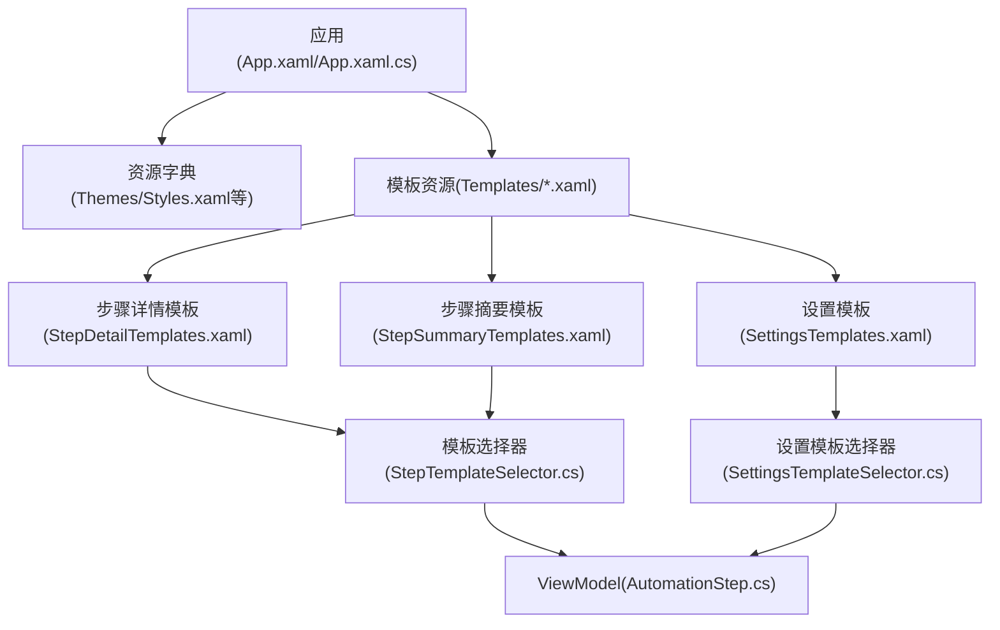
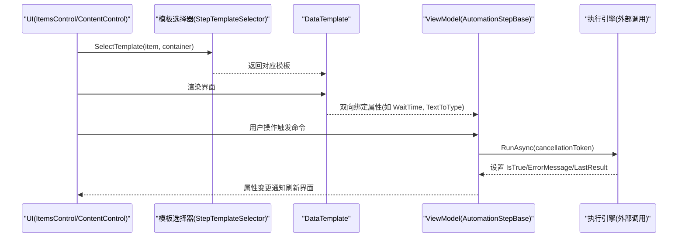
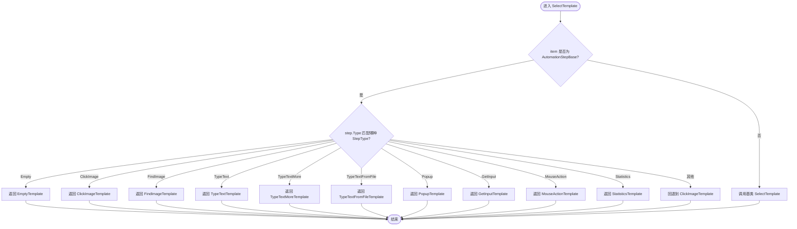
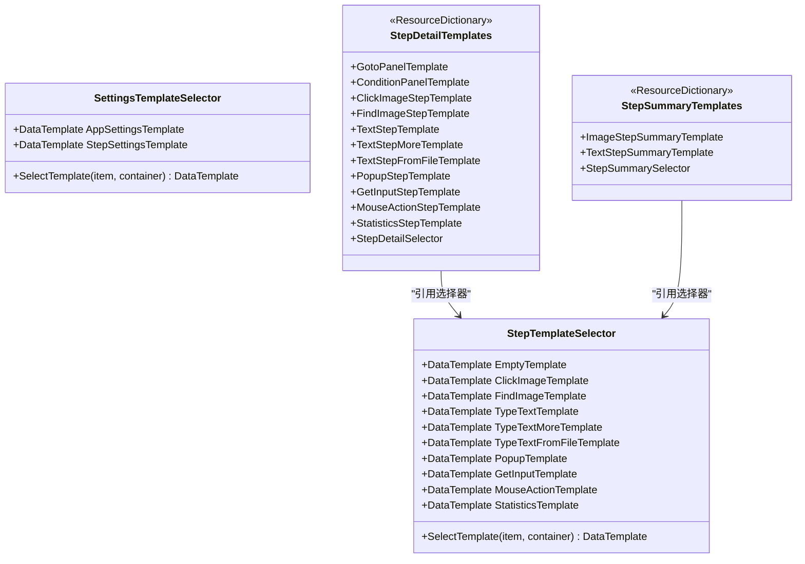
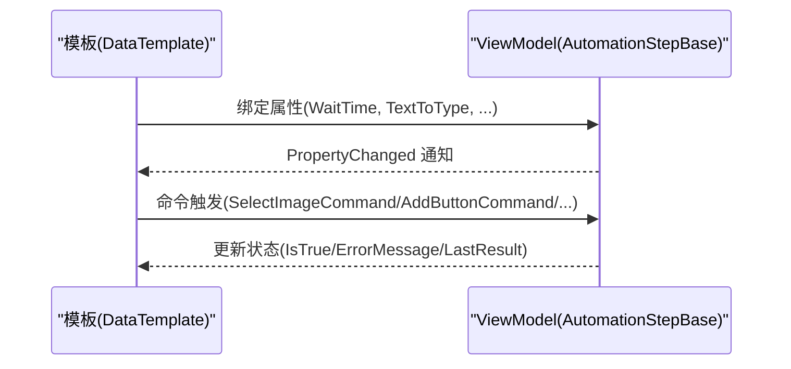
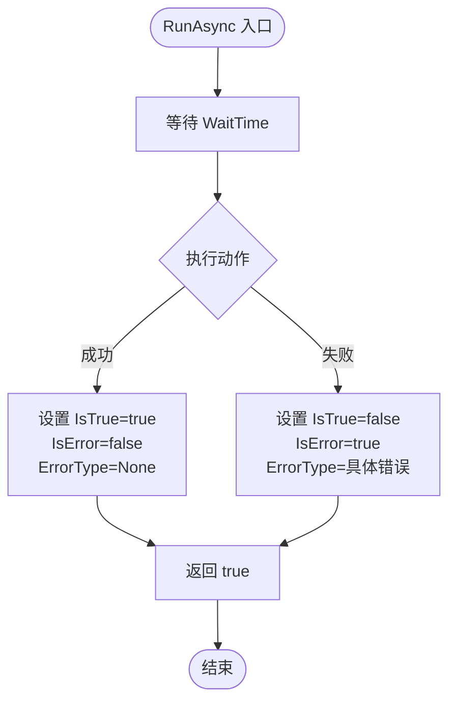
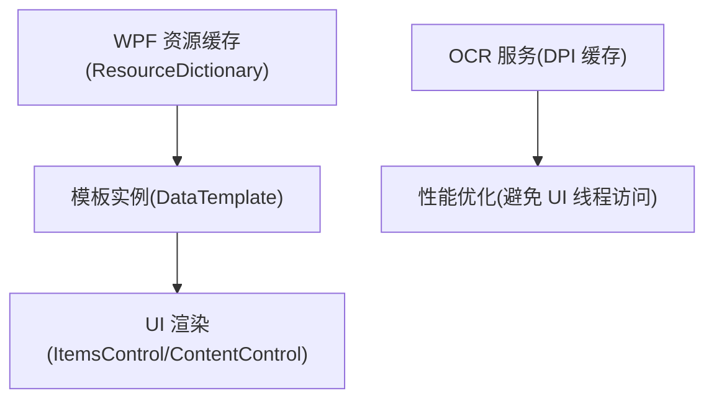
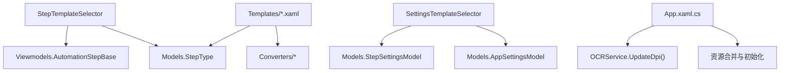

# 模板系统架构

<cite>
**本文引用的文件**   
- [StepTemplateSelector.cs](file://ShaoLu/Converters/StepTemplateSelector.cs)
- [SettingsTemplateSelector.cs](file://ShaoLu/Converters/SettingsTemplateSelector.cs)
- [StepDetailTemplates.xaml](file://ShaoLu/Templates/StepDetailTemplates.xaml)
- [StepSummaryTemplates.xaml](file://ShaoLu/Templates/StepSummaryTemplates.xaml)
- [SettingsTemplates.xaml](file://ShaoLu/Templates/SettingsTemplates.xaml)
- [AutomationStep.cs](file://ShaoLu/Viewmodels/AutomationStep.cs)
- [AutomationStepModel.cs](file://ShaoLu/Models/AutomationStepModel.cs)
- [App.xaml](file://ShaoLu/App.xaml)
- [App.xaml.cs](file://ShaoLu/App.xaml.cs)
- [OCRService.cs](file://ShaoLu/Services/OCRService.cs)
</cite>

## 目录
1. [简介](#简介)
2. [项目结构](#项目结构)
3. [核心组件](#核心组件)
4. [架构总览](#架构总览)
5. [详细组件分析](#详细组件分析)
6. [依赖关系分析](#依赖关系分析)
7. [性能考量](#性能考量)
8. [故障排除指南](#故障排除指南)
9. [结论](#结论)
10. [附录：自定义模板开发指南与最佳实践](#附录自定义模板开发指南与最佳实践)

## 简介
本技术文档围绕 ShaoLu 的 XAML 模板系统，系统性阐述模板选择器（StepTemplateSelector）的工作原理、动态模板加载机制、运行时模板切换策略、模板与 ViewModel 的数据绑定模式与生命周期管理、模板缓存与性能优化，以及自定义模板的开发指南与调试排错方法。目标是帮助开发者快速理解并扩展该模板体系，确保在复杂自动化步骤场景下具备高可维护性与高性能表现。

## 项目结构
ShaoLu 采用 WPF + MVVM 架构，模板系统由以下关键部分组成：
- 模板选择器：根据数据项类型或枚举值选择对应的 DataTemplate
- 模板资源字典：集中定义各类步骤的详细编辑界面与摘要展示界面
- ViewModel 层：承载步骤模型、命令、状态与执行逻辑
- 应用资源与启动流程：全局资源合并与初始化，为模板加载提供基础环境

图表来源
- [App.xaml:1-36](file://ShaoLu/App.xaml#L1-L36)
- [App.xaml.cs:19-91](file://ShaoLu/App.xaml.cs#L19-L91)
- [StepDetailTemplates.xaml:1-782](file://ShaoLu/Templates/StepDetailTemplates.xaml#L1-L782)
- [StepSummaryTemplates.xaml:1-55](file://ShaoLu/Templates/StepSummaryTemplates.xaml#L1-L55)
- [SettingsTemplates.xaml:1-170](file://ShaoLu/Templates/SettingsTemplates.xaml#L1-L170)
- [StepTemplateSelector.cs:1-46](file://ShaoLu/Converters/StepTemplateSelector.cs#L1-L46)
- [SettingsTemplateSelector.cs:1-26](file://ShaoLu/Converters/SettingsTemplateSelector.cs#L1-L26)

章节来源
- [App.xaml:1-36](file://ShaoLu/App.xaml#L1-L36)
- [App.xaml.cs:19-91](file://ShaoLu/App.xaml.cs#L19-L91)

## 核心组件
- StepTemplateSelector：基于步骤类型（StepType）选择对应 DataTemplate，实现“按类型渲染”的核心逻辑
- SettingsTemplateSelector：基于设置模型类型选择设置面板模板
- 模板资源字典：集中管理各步骤的编辑界面与摘要界面，支持复用与组合
- AutomationStepBase 及其派生类：封装步骤通用属性、条件判断、跳转配置、执行结果与生命周期
- App 启动流程：注册服务、初始化语言、合并资源、显示主窗口，为模板系统提供运行环境

章节来源
- [StepTemplateSelector.cs:1-46](file://ShaoLu/Converters/StepTemplateSelector.cs#L1-L46)
- [SettingsTemplateSelector.cs:1-26](file://ShaoLu/Converters/SettingsTemplateSelector.cs#L1-L26)
- [StepDetailTemplates.xaml:1-782](file://ShaoLu/Templates/StepDetailTemplates.xaml#L1-L782)
- [StepSummaryTemplates.xaml:1-55](file://ShaoLu/Templates/StepSummaryTemplates.xaml#L1-L55)
- [SettingsTemplates.xaml:1-170](file://ShaoLu/Templates/SettingsTemplates.xaml#L1-L170)
- [AutomationStep.cs:25-296](file://ShaoLu/Viewmodels/AutomationStep.cs#L25-L296)
- [App.xaml.cs:19-91](file://ShaoLu/App.xaml.cs#L19-L91)

## 架构总览
模板系统的整体工作流如下：
- UI 列表或面板绑定到步骤集合（ObservableCollection）
- 选择器根据每个步骤实例的类型（StepType）返回相应 DataTemplate
- DataTemplate 通过双向绑定驱动 ViewModel 的属性更新
- 用户交互触发 ViewModel 中的命令，执行步骤逻辑（RunAsync）
- 执行结果反馈至 UI（IsTrue、ErrorMessage、LastResult 等）

图表来源
- [StepTemplateSelector.cs:21-43](file://ShaoLu/Converters/StepTemplateSelector.cs#L21-L43)
- [StepDetailTemplates.xaml:772-782](file://ShaoLu/Templates/StepDetailTemplates.xaml#L772-L782)
- [AutomationStep.cs:288-296](file://ShaoLu/Viewmodels/AutomationStep.cs#L288-L296)

## 详细组件分析

### 模板选择器（StepTemplateSelector）工作原理
- 继承 DataTemplateSelector，重写 SelectTemplate
- 根据 item 的 Type（StepType）映射到具体 DataTemplate
- 对未覆盖的类型提供默认回退（如 ClickImageTemplate）
- 支持 Empty、ClickImage、FindImage、TypeText、TypeTextMore、TypeTextFromFile、Popup、GetInput、MouseAction、Statistics 等多种步骤类型

图表来源
- [StepTemplateSelector.cs:21-43](file://ShaoLu/Converters/StepTemplateSelector.cs#L21-L43)

章节来源
- [StepTemplateSelector.cs:1-46](file://ShaoLu/Converters/StepTemplateSelector.cs#L1-L46)

### 动态模板加载与运行时切换
- 模板资源以 ResourceDictionary 形式集中管理，XAML 中通过 x:Key 引用
- 选择器在运行时根据数据项类型动态返回模板，无需重新加载资源
- 通过 ContentControl.ContentTemplate 绑定选择器实例，实现运行时切换
- 设置面板使用 SettingsTemplateSelector 根据模型类型切换 AppSettingsTemplate 与 StepSettingsTemplate

图表来源
- [StepDetailTemplates.xaml:772-782](file://ShaoLu/Templates/StepDetailTemplates.xaml#L772-L782)
- [StepSummaryTemplates.xaml:52-55](file://ShaoLu/Templates/StepSummaryTemplates.xaml#L52-L55)
- [SettingsTemplateSelector.cs:12-23](file://ShaoLu/Converters/SettingsTemplateSelector.cs#L12-L23)

章节来源
- [StepDetailTemplates.xaml:1-782](file://ShaoLu/Templates/StepDetailTemplates.xaml#L1-L782)
- [StepSummaryTemplates.xaml:1-55](file://ShaoLu/Templates/StepSummaryTemplates.xaml#L1-L55)
- [SettingsTemplateSelector.cs:1-26](file://ShaoLu/Converters/SettingsTemplateSelector.cs#L1-L26)

### 模板与 ViewModel 的数据绑定模式
- 模板通过 Binding 将 UI 控件与 ViewModel 属性双向绑定（Mode=TwoWay）
- 常用绑定包括：WaitTime、TextToType、DelayBetweenKeys、ImagePath、SimilarityThreshold、PopupText、WindowX/Y、BackgroundColor 等
- 命令（ICommand）用于处理用户交互（如 SelectImageCommand、AddButtonCommand、ResetIndexCommand）
- 条件面板与跳转面板通过静态模板（GotoPanelTemplate、ConditionPanelTemplate）复用，减少重复代码

图表来源
- [StepDetailTemplates.xaml:205-249](file://ShaoLu/Templates/StepDetailTemplates.xaml#L205-L249)
- [StepDetailTemplates.xaml:289-307](file://ShaoLu/Templates/StepDetailTemplates.xaml#L289-L307)
- [StepDetailTemplates.xaml:310-343](file://ShaoLu/Templates/StepDetailTemplates.xaml#L310-L343)
- [StepDetailTemplates.xaml:346-385](file://ShaoLu/Templates/StepDetailTemplates.xaml#L346-L385)
- [StepDetailTemplates.xaml:388-538](file://ShaoLu/Templates/StepDetailTemplates.xaml#L388-L538)
- [StepDetailTemplates.xaml:541-600](file://ShaoLu/Templates/StepDetailTemplates.xaml#L541-L600)
- [StepDetailTemplates.xaml:603-657](file://ShaoLu/Templates/StepDetailTemplates.xaml#L603-L657)

章节来源
- [StepDetailTemplates.xaml:1-782](file://ShaoLu/Templates/StepDetailTemplates.xaml#L1-L782)
- [AutomationStep.cs:25-296](file://ShaoLu/Viewmodels/AutomationStep.cs#L25-L296)

### 生命周期管理与执行流程
- 每个步骤继承 AutomationStepBase，统一实现 Clone() 与 RunAsync(CancellationToken)
- RunAsync 负责等待时间、执行动作、设置 IsTrue/IsError/ErrorType/LastResult
- 弹窗步骤（PopupStep）支持多种关闭模式（ButtonClick、Timeout、StepReached），并与取消令牌协作保证资源释放
- 自引用限制（SelfReferenceLimit）防止循环跳转导致死循环

图表来源
- [AutomationStep.cs:345-364](file://ShaoLu/Viewmodels/AutomationStep.cs#L345-L364)
- [AutomationStep.cs:499-515](file://ShaoLu/Viewmodels/AutomationStep.cs#L499-L515)
- [AutomationStep.cs:651-679](file://ShaoLu/Viewmodels/AutomationStep.cs#L651-L679)
- [AutomationStep.cs:888-1014](file://ShaoLu/Viewmodels/AutomationStep.cs#L888-L1014)

章节来源
- [AutomationStep.cs:25-296](file://ShaoLu/Viewmodels/AutomationStep.cs#L25-L296)
- [AutomationStep.cs:345-364](file://ShaoLu/Viewmodels/AutomationStep.cs#L345-L364)
- [AutomationStep.cs:499-515](file://ShaoLu/Viewmodels/AutomationStep.cs#L499-L515)
- [AutomationStep.cs:651-679](file://ShaoLu/Viewmodels/AutomationStep.cs#L651-L679)
- [AutomationStep.cs:888-1014](file://ShaoLu/Viewmodels/AutomationStep.cs#L888-L1014)

### 模板缓存机制与性能优化
- WPF 资源字典（ResourceDictionary）天然缓存模板实例，避免重复创建开销
- ItemsControl/ListBox 启用 VirtualizingStackPanel 与 Recycling 模式，提升大数据量渲染性能
- OCR 服务缓存 DPI 缩放因子，避免后台线程访问 UI 对象导致的竞态与性能损耗
- 模板选择器在运行时直接返回已加载模板，无额外 I/O 或反射开销

图表来源
- [StepDetailTemplates.xaml:368-376](file://ShaoLu/Templates/StepDetailTemplates.xaml#L368-L376)
- [OCRService.cs:18-48](file://ShaoLu/Services/OCRService.cs#L18-L48)

章节来源
- [StepDetailTemplates.xaml:368-376](file://ShaoLu/Templates/StepDetailTemplates.xaml#L368-L376)
- [OCRService.cs:18-48](file://ShaoLu/Services/OCRService.cs#L18-L48)

## 依赖关系分析
- StepTemplateSelector 依赖 Models.StepType 与 Viewmodels.AutomationStep.AutomationStepBase
- SettingsTemplateSelector 依赖 Models.AppSettingsModel 与 StepSettingsModel
- 模板资源字典依赖 Converters 与 Models，提供 UI 绑定与显示逻辑
- App 启动流程负责合并资源、注册服务、初始化语言与 DPI 缓存

图表来源
- [StepTemplateSelector.cs:1-46](file://ShaoLu/Converters/StepTemplateSelector.cs#L1-L46)
- [SettingsTemplateSelector.cs:1-26](file://ShaoLu/Converters/SettingsTemplateSelector.cs#L1-L26)
- [App.xaml.cs:19-91](file://ShaoLu/App.xaml.cs#L19-L91)

章节来源
- [StepTemplateSelector.cs:1-46](file://ShaoLu/Converters/StepTemplateSelector.cs#L1-L46)
- [SettingsTemplateSelector.cs:1-26](file://ShaoLu/Converters/SettingsTemplateSelector.cs#L1-L26)
- [App.xaml.cs:19-91](file://ShaoLu/App.xaml.cs#L19-L91)

## 性能考量
- 模板实例化与缓存：WPF 资源字典自动缓存模板，避免重复创建
- 虚拟化与回收：大数据列表使用 VirtualizingStackPanel 与 Recycling 模式
- OCR 性能：DPI 缓存避免 UI 线程访问，减少跨线程开销
- 命令与异步：RunAsync 使用 CancellationToken 支持取消与超时控制
- 资源清理：应用退出时释放图像识别相关资源，避免内存泄漏

章节来源
- [StepDetailTemplates.xaml:368-376](file://ShaoLu/Templates/StepDetailTemplates.xaml#L368-L376)
- [OCRService.cs:18-48](file://ShaoLu/Services/OCRService.cs#L18-L48)
- [App.xaml.cs:92-111](file://ShaoLu/App.xaml.cs#L92-L111)

## 故障排除指南
- 模板未显示：检查 StepTemplateSelector 是否配置了所有需要的 DataTemplate
- 绑定失效：确认 ViewModel 属性实现了 INotifyPropertyChanged（CommunityToolkit.Mvvm 的 ObservableObject）
- 弹窗不关闭：检查 CloseMode 与 AutoCloseSeconds 配置，确保取消令牌正确注册
- OCR 区域异常：确认 DPI 缓存已更新，OCR 引擎初始化成功
- 自引用死循环：调整 SelfReferenceLimit，避免无限跳转

章节来源
- [StepTemplateSelector.cs:21-43](file://ShaoLu/Converters/StepTemplateSelector.cs#L21-L43)
- [AutomationStep.cs:888-1014](file://ShaoLu/Viewmodels/AutomationStep.cs#L888-L1014)
- [OCRService.cs:53-69](file://ShaoLu/Services/OCRService.cs#L53-L69)

## 结论
ShaoLu 的模板系统以 WPF 资源字典为核心，结合模板选择器与 MVVM 模式，实现了高度可扩展、可维护的 UI 渲染机制。通过运行时模板切换、双向数据绑定、异步执行与资源缓存，系统在复杂自动化场景中保持了良好的性能与用户体验。开发者可基于现有模板与选择器快速扩展新步骤类型，遵循最佳实践确保稳定性与可测试性。

## 附录：自定义模板开发指南与最佳实践
- 新增步骤类型：
  - 在 Models.StepType 中添加新枚举值
  - 在 AutomationStepBase 派生类中实现 Clone() 与 RunAsync()
  - 在 StepDetailTemplates.xaml 中定义新的 DataTemplate
  - 在 StepTemplateSelector 中映射新类型到模板
- 模板设计建议：
  - 使用静态模板（如 GotoPanelTemplate、ConditionPanelTemplate）提高复用性
  - 合理使用虚拟化和回收提升大数据渲染性能
  - 避免在模板中执行耗时操作，将逻辑移至 ViewModel 命令
- 调试技巧：
  - 使用 Visual Studio 的 XAML 调试工具检查模板绑定
  - 启用 NLog 日志记录执行过程与异常信息
  - 通过 LastResult 与 ErrorMessage 定位问题

章节来源
- [AutomationStepModel.cs:9-24](file://ShaoLu/Models/AutomationStepModel.cs#L9-L24)
- [StepDetailTemplates.xaml:1-782](file://ShaoLu/Templates/StepDetailTemplates.xaml#L1-L782)
- [StepTemplateSelector.cs:21-43](file://ShaoLu/Converters/StepTemplateSelector.cs#L21-L43)