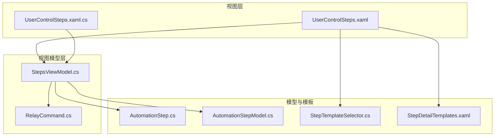
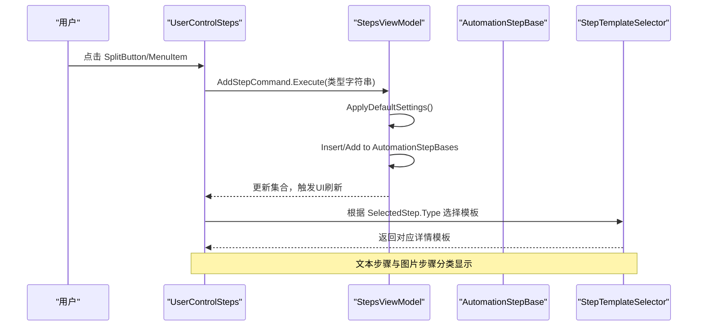
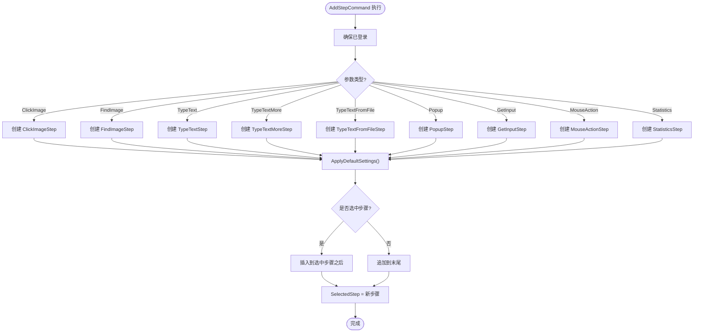
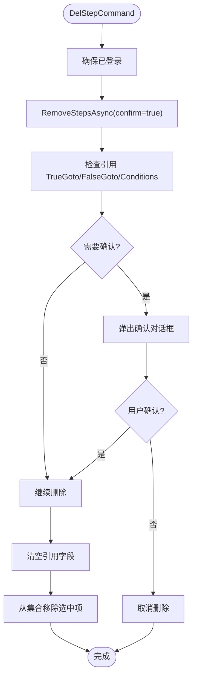
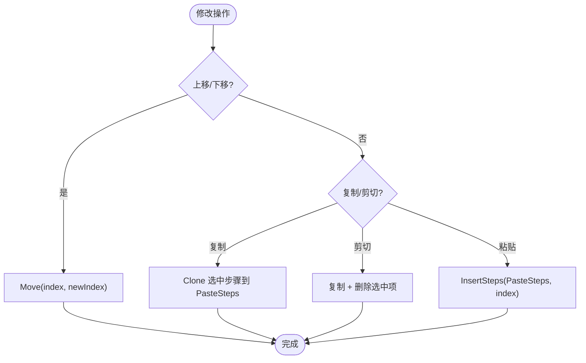
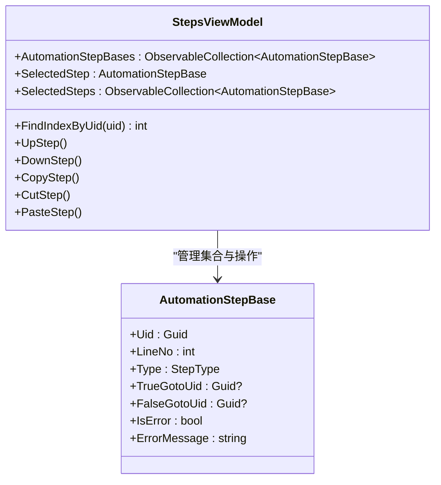
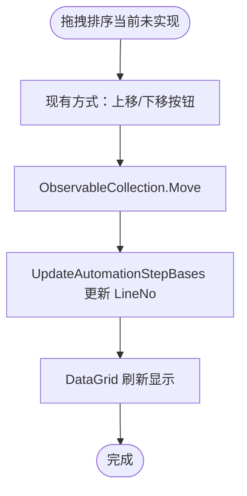
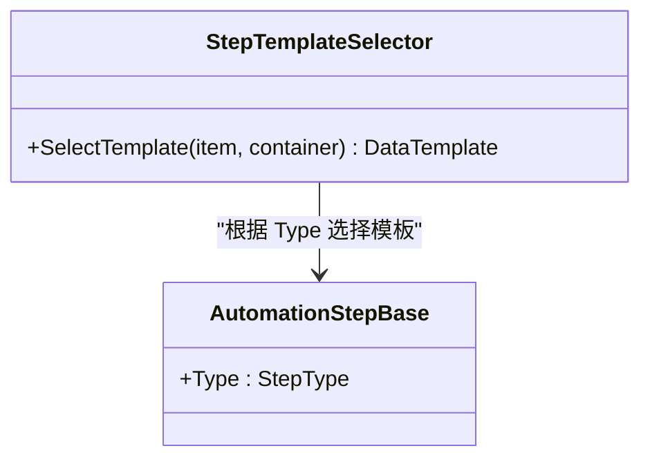
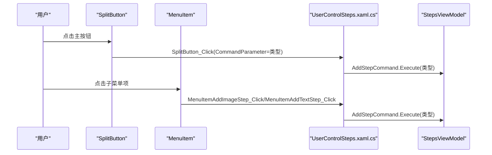
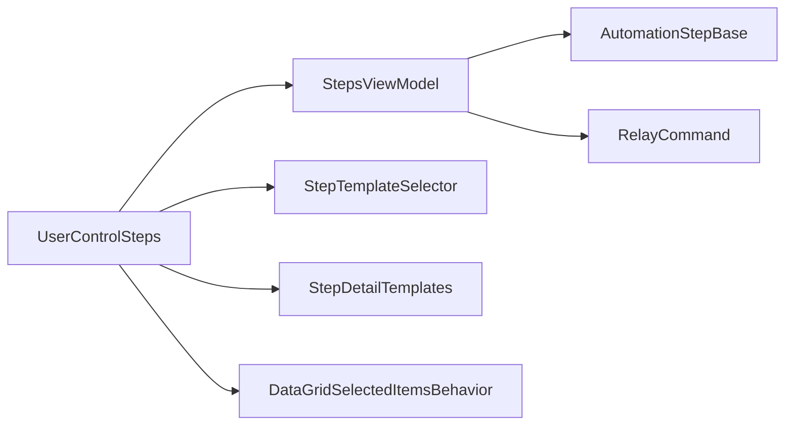

# 步骤列表管理

<cite>
**本文引用的文件**   
- [StepsViewModel.cs](file://ShaoLu/Viewmodels/StepsViewModel.cs)
- [AutomationStep.cs](file://ShaoLu/Viewmodels/AutomationStep.cs)
- [AutomationStepModel.cs](file://ShaoLu/Models/AutomationStepModel.cs)
- [UserControlSteps.xaml](file://ShaoLu/Views/UserControlSteps.xaml)
- [UserControlSteps.xaml.cs](file://ShaoLu/Views/UserControlSteps.xaml.cs)
- [StepTemplateSelector.cs](file://ShaoLu/Converters/StepTemplateSelector.cs)
- [StepDetailTemplates.xaml](file://ShaoLu/Templates/StepDetailTemplates.xaml)
- [RelayCommand.cs](file://ShaoLu/Utils/RelayCommand.cs)
- [DataGridSelectedItemsBehavior.cs](file://ShaoLu/Utils/DataGridSelectedItemsBehavior.cs)
</cite>

## 目录
1. [简介](#简介)
2. [项目结构](#项目结构)
3. [核心组件](#核心组件)
4. [架构总览](#架构总览)
5. [详细组件分析](#详细组件分析)
6. [依赖关系分析](#依赖关系分析)
7. [性能考虑](#性能考虑)
8. [故障排查指南](#故障排查指南)
9. [结论](#结论)

## 简介
本文件面向 ShaoLu 的步骤列表管理功能，围绕“添加、删除、修改、查找”四类操作展开，详细说明拖拽排序的交互逻辑与技术实现（当前以按钮上移/下移为主），解释步骤类型识别与分类显示机制，阐述 SplitButton 与 MenuItem 的事件处理流程，以及 AddStepCommand 的执行路径。同时覆盖步骤状态管理与界面刷新机制的实现细节，帮助读者快速理解并扩展该模块。

## 项目结构
步骤列表管理涉及视图层、视图模型层、模板选择器与通用命令等关键部分：
- 视图层：UserControlSteps 负责 UI 展示与用户交互（工具栏、SplitButton、菜单项、DataGrid）
- 视图模型层：StepsViewModel 集中管理步骤集合、命令与执行流程
- 步骤模型与基类：AutomationStepBase 及其派生类定义步骤类型、属性与执行行为
- 模板选择器：StepTemplateSelector 根据步骤类型选择详情模板
- 命令基础：RelayCommand/RelayParameterCommand 提供可绑定的命令能力
- 辅助行为：DataGridSelectedItemsBehavior 同步 DataGrid 多选到 ViewModel

图表来源 
- [UserControlSteps.xaml:1-192](file://ShaoLu/Views/UserControlSteps.xaml#L1-L192)
- [UserControlSteps.xaml.cs:1-56](file://ShaoLu/Views/UserControlSteps.xaml.cs#L1-L56)
- [StepsViewModel.cs:1-747](file://ShaoLu/Viewmodels/StepsViewModel.cs#L1-L747)
- [AutomationStep.cs:1-1121](file://ShaoLu/Viewmodels/AutomationStep.cs#L1-L1121)
- [AutomationStepModel.cs:1-73](file://ShaoLu/Models/AutomationStepModel.cs#L1-L73)
- [StepTemplateSelector.cs:1-46](file://ShaoLu/Converters/StepTemplateSelector.cs#L1-L46)
- [StepDetailTemplates.xaml:1-782](file://ShaoLu/Templates/StepDetailTemplates.xaml#L1-L782)
- [RelayCommand.cs:1-113](file://ShaoLu/Utils/RelayCommand.cs#L1-L113)

章节来源
- [UserControlSteps.xaml:1-192](file://ShaoLu/Views/UserControlSteps.xaml#L1-L192)
- [UserControlSteps.xaml.cs:1-56](file://ShaoLu/Views/UserControlSteps.xaml.cs#L1-L56)
- [StepsViewModel.cs:1-747](file://ShaoLu/Viewmodels/StepsViewModel.cs#L1-L747)

## 核心组件
- StepsViewModel：维护 AutomationStepBases 集合、选中项 SelectedStep/SelectedSteps、运行控制与步骤增删改查、复制粘贴、上下移动、执行上下文与结果记录
- AutomationStepBase 及派生类：定义步骤类型枚举、跳转 Uid、条件判断、自引用限制、等待时间、日志开关、执行结果等；各具体步骤实现 RunAsync
- StepTemplateSelector：按 Type 映射到不同详情模板，实现文本步骤与图片步骤的分类显示
- RelayCommand/RelayParameterCommand：封装命令执行与 CanExecute 状态更新
- DataGridSelectedItemsBehavior：将 DataGrid 的多选集合同步到 ViewModel

章节来源
- [StepsViewModel.cs:1-747](file://ShaoLu/Viewmodels/StepsViewModel.cs#L1-L747)
- [AutomationStep.cs:1-1121](file://ShaoLu/Viewmodels/AutomationStep.cs#L1-L1121)
- [StepTemplateSelector.cs:1-46](file://ShaoLu/Converters/StepTemplateSelector.cs#L1-L46)
- [RelayCommand.cs:1-113](file://ShaoLu/Utils/RelayCommand.cs#L1-L113)
- [DataGridSelectedItemsBehavior.cs:1-63](file://ShaoLu/Utils/DataGridSelectedItemsBehavior.cs#L1-L63)

## 架构总览
步骤列表管理的整体交互流程如下：
- 用户在 UserControlSteps 中通过 SplitButton/MenuItem/工具栏按钮触发 AddStepCommand
- StepsViewModel.AddStep 根据参数创建对应类型的步骤实例，应用默认设置，插入到集合中并选中
- DataGrid 绑定 AutomationStepBases，行号 LineNo 由集合变更事件统一维护
- 详情面板通过 StepTemplateSelector 根据步骤类型选择模板，实现文本/图片步骤分类显示
- 删除、上移、下移、复制、粘贴等操作均通过命令调用，保证在运行状态下禁用编辑相关命令
- 执行时，Run 方法遍历步骤集合，依次调用每个步骤的 RunAsync，记录结果与错误，支持暂停、停止、条件跳转与自引用限制

图表来源 
- [UserControlSteps.xaml:88-105](file://ShaoLu/Views/UserControlSteps.xaml#L88-L105)
- [UserControlSteps.xaml.cs:26-53](file://ShaoLu/Views/UserControlSteps.xaml.cs#L26-L53)
- [StepsViewModel.cs:186-227](file://ShaoLu/Viewmodels/StepsViewModel.cs#L186-L227)
- [StepTemplateSelector.cs:21-43](file://ShaoLu/Converters/StepTemplateSelector.cs#L21-L43)

章节来源
- [UserControlSteps.xaml:88-105](file://ShaoLu/Views/UserControlSteps.xaml#L88-L105)
- [UserControlSteps.xaml.cs:26-53](file://ShaoLu/Views/UserControlSteps.xaml.cs#L26-L53)
- [StepsViewModel.cs:186-227](file://ShaoLu/Viewmodels/StepsViewModel.cs#L186-L227)
- [StepTemplateSelector.cs:21-43](file://ShaoLu/Converters/StepTemplateSelector.cs#L21-L43)

## 详细组件分析

### 步骤添加（AddStepCommand）
- 入口：UserControlSteps.SplitButton_Click/MenuItem 点击事件调用 AddStepCommand.Execute(类型字符串)
- 处理：StepsViewModel.AddStep 根据参数创建对应步骤实例（如 ClickImage、FindImage、TypeText、TypeTextMore、TypeTextFromFile、Popup、GetInput、MouseAction、Statistics），应用默认设置（等待时间、相似度阈值、超时等），并在选中步骤后插入其后，否则追加到末尾
- 选中：新增步骤自动设为 SelectedStep，以便详情面板立即显示

图表来源 
- [UserControlSteps.xaml.cs:26-53](file://ShaoLu/Views/UserControlSteps.xaml.cs#L26-L53)
- [StepsViewModel.cs:186-227](file://ShaoLu/Viewmodels/StepsViewModel.cs#L186-L227)

章节来源
- [UserControlSteps.xaml.cs:26-53](file://ShaoLu/Views/UserControlSteps.xaml.cs#L26-L53)
- [StepsViewModel.cs:186-227](file://ShaoLu/Viewmodels/StepsViewModel.cs#L186-L227)

### 步骤删除（DelStepCommand）
- 入口：工具栏或右键菜单触发 DelStepCommand
- 处理：RemoveStepsAsync(confirm=true) 弹出确认对话框，检查待删除步骤是否被其他步骤引用（TrueGotoUid/FalseGotoUid/Conditions.StepUid），若存在则提示；确认后清空引用并移除集合中的选中项
- 异常：捕获异常并记录日志

图表来源 
- [StepsViewModel.cs:253-340](file://ShaoLu/Viewmodels/StepsViewModel.cs#L253-L340)

章节来源
- [StepsViewModel.cs:253-340](file://ShaoLu/Viewmodels/StepsViewModel.cs#L253-L340)

### 步骤修改（上移/下移/复制/粘贴）
- 上移/下移：UpStep/DownStep 使用 ObservableCollection.Move 调整顺序，边界检查防止越界
- 复制/剪切/粘贴：CopyStep 克隆选中步骤到 PasteSteps；CutStep 先复制再删除；PasteStep 根据 SelectedStep 位置插入或追加
- 插入：InsertSteps 支持指定 index 插入，避免重复插入同一对象

图表来源 
- [StepsViewModel.cs:342-438](file://ShaoLu/Viewmodels/StepsViewModel.cs#L342-L438)

章节来源
- [StepsViewModel.cs:342-438](file://ShaoLu/Viewmodels/StepsViewModel.cs#L342-L438)

### 步骤查找与显示
- 查找：StepsViewModel.FindIndexByUid 根据 Uid 线性查找索引，用于执行时的跳转定位
- 显示：DataGrid 列包含 IsNeed、LineNo、Type、Name、Description、TrueGotoLineNo、FalseGotoLineNo；行样式根据 IsError 高亮并显示错误信息
- 详情：ContentControl 绑定 SelectedStep，通过 StepTemplateSelector 选择模板

图表来源 
- [StepsViewModel.cs:732-743](file://ShaoLu/Viewmodels/StepsViewModel.cs#L732-L743)
- [AutomationStep.cs:25-296](file://ShaoLu/Viewmodels/AutomationStep.cs#L25-L296)

章节来源
- [StepsViewModel.cs:732-743](file://ShaoLu/Viewmodels/StepsViewModel.cs#L732-L743)
- [AutomationStep.cs:25-296](file://ShaoLu/Viewmodels/AutomationStep.cs#L25-L296)

### 拖拽排序功能的交互逻辑与技术实现
- 当前实现：通过工具栏“上移/下移”按钮与右键菜单实现顺序调整，未实现鼠标拖拽重排
- 技术要点：
  - ObservableCollection.Move 直接调整集合顺序，触发 UI 刷新
  - UpdateAutomationStepBases 在集合变更时重新计算 LineNo，保持行号连续
  - DataGridSelectedItemsBehavior 同步多选集合，便于批量操作
- 扩展建议：如需拖拽排序，可在 DataGrid 上实现 Drag/Drop 事件，结合 Move 与 LineNo 更新

图表来源 
- [StepsViewModel.cs:148-156](file://ShaoLu/Viewmodels/StepsViewModel.cs#L148-L156)
- [DataGridSelectedItemsBehavior.cs:1-63](file://ShaoLu/Utils/DataGridSelectedItemsBehavior.cs#L1-L63)

章节来源
- [StepsViewModel.cs:148-156](file://ShaoLu/Viewmodels/StepsViewModel.cs#L148-L156)
- [DataGridSelectedItemsBehavior.cs:1-63](file://ShaoLu/Utils/DataGridSelectedItemsBehavior.cs#L1-L63)

### 步骤类型识别机制与分类显示
- 类型枚举：StepType 定义 ClickImage、FindImage、TypeText、TypeTextMore、TypeTextFromFile、Popup、GetInput、MouseAction、Statistics 等
- 模板选择：StepTemplateSelector.SelectTemplate 根据 step.Type 返回对应 DataTemplate，实现文本步骤与图片步骤的分类显示
- 详情模板：StepDetailTemplates.xaml 为每种步骤类型定义专属编辑界面（如图片相似度阈值、OCR 区域、输入内容等）

图表来源 
- [StepTemplateSelector.cs:21-43](file://ShaoLu/Converters/StepTemplateSelector.cs#L21-L43)
- [AutomationStepModel.cs:9-24](file://ShaoLu/Models/AutomationStepModel.cs#L9-L24)
- [StepDetailTemplates.xaml:772-782](file://ShaoLu/Templates/StepDetailTemplates.xaml#L772-L782)

章节来源
- [StepTemplateSelector.cs:21-43](file://ShaoLu/Converters/StepTemplateSelector.cs#L21-L43)
- [AutomationStepModel.cs:9-24](file://ShaoLu/Models/AutomationStepModel.cs#L9-L24)
- [StepDetailTemplates.xaml:772-782](file://ShaoLu/Templates/StepDetailTemplates.xaml#L772-L782)

### SplitButton 和 MenuItem 的事件处理机制
- SplitButton 主按钮点击：UserControlSteps.SplitButton_Click 获取 CommandParameter（类型字符串），调用 AddStepCommand.Execute(type)
- MenuItem 子项点击：MenuItemAddImageStep_Click/MenuItemAddTextStep_Click 同样提取 CommandParameter 并执行 AddStepCommand
- 命令执行：StepsViewModel.AddStep 根据参数创建步骤并插入集合

图表来源 
- [UserControlSteps.xaml:88-105](file://ShaoLu/Views/UserControlSteps.xaml#L88-L105)
- [UserControlSteps.xaml.cs:26-53](file://ShaoLu/Views/UserControlSteps.xaml.cs#L26-L53)
- [StepsViewModel.cs:186-227](file://ShaoLu/Viewmodels/StepsViewModel.cs#L186-L227)

章节来源
- [UserControlSteps.xaml:88-105](file://ShaoLu/Views/UserControlSteps.xaml#L88-L105)
- [UserControlSteps.xaml.cs:26-53](file://ShaoLu/Views/UserControlSteps.xaml.cs#L26-L53)
- [StepsViewModel.cs:186-227](file://ShaoLu/Viewmodels/StepsViewModel.cs#L186-L227)

### AddStepCommand 的执行流程
- 参数解析：根据字符串参数匹配具体步骤类型
- 默认设置：ApplyDefaultSettings 应用等待时间、相似度阈值、超时等默认值
- 插入策略：若存在 SelectedStep，则在选中项后插入；否则追加到末尾
- 选中更新：SelectedStep = 新步骤，触发详情面板刷新

章节来源
- [StepsViewModel.cs:186-227](file://ShaoLu/Viewmodels/StepsViewModel.cs#L186-L227)

### 步骤状态管理与界面刷新机制
- 状态属性：IsNeed（是否启用）、IsError（是否错误）、ErrorMessage（错误信息）、LineNo（行号）、TrueGotoLineNo/FalseGotoLineNo（跳转目标行号）
- 集合变更：AutomationStepBases.CollectionChanged 触发 UpdateAutomationStepBases，统一维护 LineNo 并刷新命令 CanExecute 状态
- 执行状态：IsRunning/IsPaused/StopSignal 控制运行、暂停、停止；Run 方法中逐步骤执行并记录 LastResult、ErrorType、IsTrue
- 界面刷新：WPF 数据绑定自动响应属性变化；DataGrid 行样式根据 IsError 高亮；详情面板通过 ContentControl 与 StepTemplateSelector 动态切换

章节来源
- [StepsViewModel.cs:130-156](file://ShaoLu/Viewmodels/StepsViewModel.cs#L130-L156)
- [AutomationStep.cs:25-296](file://ShaoLu/Viewmodels/AutomationStep.cs#L25-L296)
- [UserControlSteps.xaml:121-148](file://ShaoLu/Views/UserControlSteps.xaml#L121-L148)

## 依赖关系分析
- 视图与视图模型：UserControlSteps 绑定 StepsViewModel，命令与属性双向驱动
- 视图模型与模型：StepsViewModel 管理 AutomationStepBase 集合，调用其 RunAsync 执行
- 模板选择器：StepTemplateSelector 依赖 AutomationStepBase.Type 决定详情模板
- 命令基础：RelayCommand/RelayParameterCommand 提供统一的命令接口
- 辅助行为：DataGridSelectedItemsBehavior 同步多选集合

图表来源 
- [UserControlSteps.xaml:1-192](file://ShaoLu/Views/UserControlSteps.xaml#L1-L192)
- [StepsViewModel.cs:1-747](file://ShaoLu/Viewmodels/StepsViewModel.cs#L1-L747)
- [AutomationStep.cs:1-1121](file://ShaoLu/Viewmodels/AutomationStep.cs#L1-L1121)
- [StepTemplateSelector.cs:1-46](file://ShaoLu/Converters/StepTemplateSelector.cs#L1-L46)
- [StepDetailTemplates.xaml:1-782](file://ShaoLu/Templates/StepDetailTemplates.xaml#L1-L782)
- [RelayCommand.cs:1-113](file://ShaoLu/Utils/RelayCommand.cs#L1-L113)
- [DataGridSelectedItemsBehavior.cs:1-63](file://ShaoLu/Utils/DataGridSelectedItemsBehavior.cs#L1-L63)

章节来源
- [UserControlSteps.xaml:1-192](file://ShaoLu/Views/UserControlSteps.xaml#L1-L192)
- [StepsViewModel.cs:1-747](file://ShaoLu/Viewmodels/StepsViewModel.cs#L1-L747)
- [AutomationStep.cs:1-1121](file://ShaoLu/Viewmodels/AutomationStep.cs#L1-L1121)
- [StepTemplateSelector.cs:1-46](file://ShaoLu/Converters/StepTemplateSelector.cs#L1-L46)
- [StepDetailTemplates.xaml:1-782](file://ShaoLu/Templates/StepDetailTemplates.xaml#L1-L782)
- [RelayCommand.cs:1-113](file://ShaoLu/Utils/RelayCommand.cs#L1-L113)
- [DataGridSelectedItemsBehavior.cs:1-63](file://ShaoLu/Utils/DataGridSelectedItemsBehavior.cs#L1-L63)

## 性能考虑
- 集合操作：ObservableCollection 的 Move/Add/Remove 会触发 UI 更新，批量操作时应尽量减少频繁变更
- 执行循环：Run 方法中每步计时与结果记录可能带来开销，建议在大量步骤时优化日志输出频率
- 模板选择：StepTemplateSelector 每次渲染都会根据 Type 选择模板，应避免频繁切换 SelectedStep
- 拖拽排序：若实现拖拽，需合并多次 Move 操作以减少 UI 重绘

[本节为通用指导，不直接分析具体文件]

## 故障排查指南
- 删除失败：检查是否被其他步骤引用（TrueGotoUid/FalseGotoUid/Conditions.StepUid），必要时先解除引用
- 运行异常：查看步骤 IsError 与 ErrorMessage，确认 Timeout、OCR、文件路径等配置是否正确
- 界面不刷新：确认属性变更是否触发 PropertyChanged（SetProperty），集合变更是否触发 CollectionChanged
- 命令不可用：检查 IsRunning 状态，编辑相关命令在运行时禁用

章节来源
- [StepsViewModel.cs:253-340](file://ShaoLu/Viewmodels/StepsViewModel.cs#L253-L340)
- [AutomationStep.cs:25-296](file://ShaoLu/Viewmodels/AutomationStep.cs#L25-L296)

## 结论
ShaoLu 的步骤列表管理功能以 MVVM 模式为核心，通过 StepsViewModel 统一管理步骤集合与命令，结合自动化步骤基类与模板选择器实现灵活的步骤类型与界面展示。当前版本通过按钮实现上移/下移排序，未实现拖拽重排；可通过扩展 DataGrid 拖拽事件完善交互。整体设计清晰、可扩展性强，适合进一步丰富步骤类型与执行逻辑。