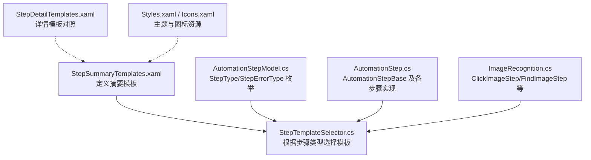
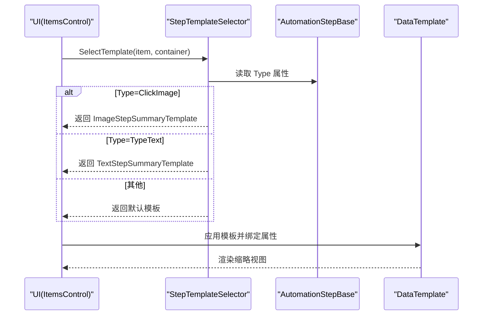
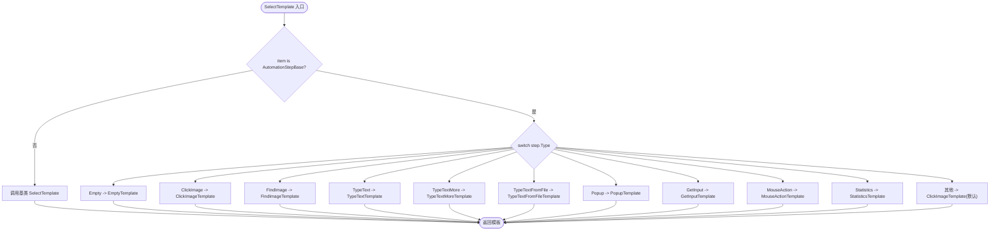
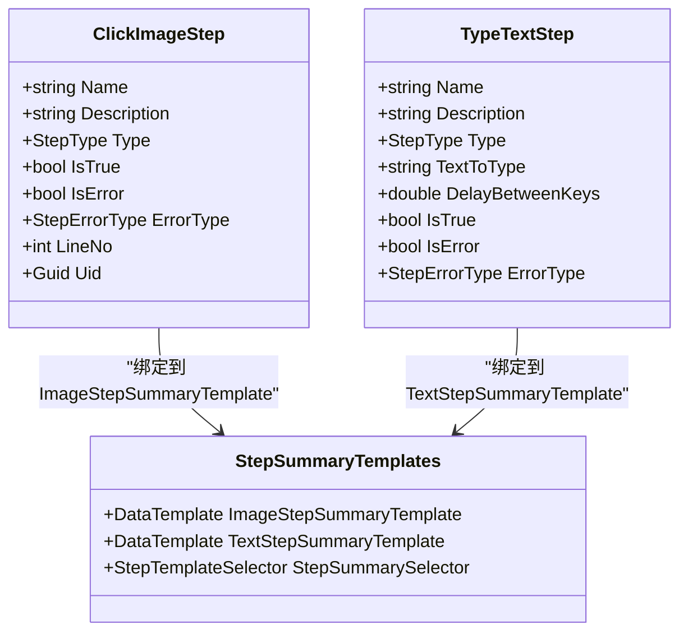
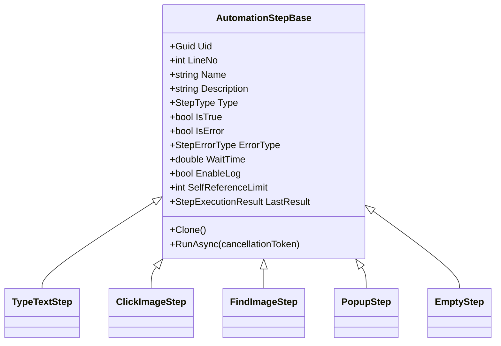
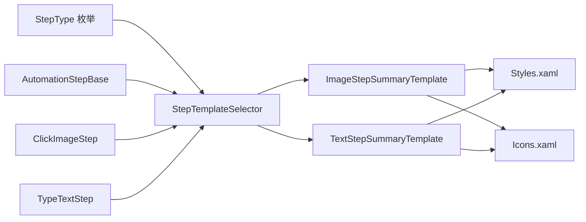

# 步骤摘要模板

<cite>
**本文引用的文件**   
- [StepSummaryTemplates.xaml](file://ShaoLu/Templates/StepSummaryTemplates.xaml)
- [StepTemplateSelector.cs](file://ShaoLu/Converters/StepTemplateSelector.cs)
- [AutomationStepModel.cs](file://ShaoLu/Models/AutomationStepModel.cs)
- [AutomationStep.cs](file://ShaoLu/Viewmodels/AutomationStep.cs)
- [ImageRecognition.cs](file://ShaoLu/Viewmodels/ImageRecognition.cs)
- [StepDetailTemplates.xaml](file://ShaoLu/Templates/StepDetailTemplates.xaml)
- [Styles.xaml](file://ShaoLu/Themes/Styles.xaml)
- [Icons.xaml](file://ShaoLu/Themes/Icons.xaml)
</cite>

## 目录
1. [简介](#简介)
2. [项目结构](#项目结构)
3. [核心组件](#核心组件)
4. [架构总览](#架构总览)
5. [详细组件分析](#详细组件分析)
6. [依赖关系分析](#依赖关系分析)
7. [性能考虑](#性能考虑)
8. [故障排查指南](#故障排查指南)
9. [结论](#结论)
10. [附录：扩展新增步骤类型摘要显示指南](#附录扩展新增步骤类型摘要显示指南)

## 简介
本文件面向 ShaoLu 自动化流程编辑器中的“步骤摘要模板”子系统，重点说明 StepSummaryTemplates.xaml 中步骤缩略显示的模板设计原理与实现方式。文档涵盖：
- 不同步骤类型的摘要信息展示（图标选择、参数简化、状态指示）
- 模板选择器的工作机制与数据绑定模式
- 模板样式定制与主题适配方法
- 新增步骤类型摘要显示的扩展指南

## 项目结构
步骤摘要模板位于资源字典中，配合模板选择器与模型/视图模型完成动态渲染。关键文件组织如下：
- 模板定义：StepSummaryTemplates.xaml
- 模板选择器：StepTemplateSelector.cs
- 步骤类型枚举与错误类型：AutomationStepModel.cs
- 步骤基类与各具体步骤实现：AutomationStep.cs、ImageRecognition.cs
- 详情模板（对比参考）：StepDetailTemplates.xaml
- 主题与图标资源：Styles.xaml、Icons.xaml

图表来源 
- [StepSummaryTemplates.xaml:1-55](file://ShaoLu/Templates/StepSummaryTemplates.xaml#L1-L55)
- [StepTemplateSelector.cs:1-46](file://ShaoLu/Converters/StepTemplateSelector.cs#L1-L46)
- [AutomationStepModel.cs:9-24](file://ShaoLu/Models/AutomationStepModel.cs#L9-L24)
- [AutomationStep.cs:25-296](file://ShaoLu/Viewmodels/AutomationStep.cs#L25-L296)
- [ImageRecognition.cs:329-436](file://ShaoLu/Viewmodels/ImageRecognition.cs#L329-L436)
- [StepDetailTemplates.xaml:772-782](file://ShaoLu/Templates/StepDetailTemplates.xaml#L772-L782)
- [Styles.xaml:1-200](file://ShaoLu/Themes/Styles.xaml#L1-L200)
- [Icons.xaml:1-115](file://ShaoLu/Themes/Icons.xaml#L1-L115)

章节来源
- [StepSummaryTemplates.xaml:1-55](file://ShaoLu/Templates/StepSummaryTemplates.xaml#L1-L55)
- [StepTemplateSelector.cs:1-46](file://ShaoLu/Converters/StepTemplateSelector.cs#L1-L46)
- [AutomationStepModel.cs:9-24](file://ShaoLu/Models/AutomationStepModel.cs#L9-L24)
- [AutomationStep.cs:25-296](file://ShaoLu/Viewmodels/AutomationStep.cs#L25-L296)
- [ImageRecognition.cs:329-436](file://ShaoLu/Viewmodels/ImageRecognition.cs#L329-L436)
- [StepDetailTemplates.xaml:772-782](file://ShaoLu/Templates/StepDetailTemplates.xaml#L772-L782)
- [Styles.xaml:1-200](file://ShaoLu/Themes/Styles.xaml#L1-L200)
- [Icons.xaml:1-115](file://ShaoLu/Themes/Icons.xaml#L1-L115)

## 核心组件
- 步骤类型枚举与错误类型：集中管理所有步骤类型与错误分类，为模板选择器提供决策依据。
- 步骤基类与具体步骤：统一抽象属性（如 Name、Description、Type、IsTrue、IsError、ErrorType），各步骤继承并扩展自身参数。
- 模板选择器：根据步骤实例的 Type 字段返回对应的 DataTemplate，实现“同数据、多视图”。
- 摘要模板：针对 ClickImageStep 与 TypeTextStep 定义了简洁的缩略显示布局，便于在列表或树形结构中快速识别步骤。

章节来源
- [AutomationStepModel.cs:9-43](file://ShaoLu/Models/AutomationStepModel.cs#L9-L43)
- [AutomationStep.cs:25-296](file://ShaoLu/Viewmodels/AutomationStep.cs#L25-L296)
- [StepTemplateSelector.cs:1-46](file://ShaoLu/Converters/StepTemplateSelector.cs#L1-L46)
- [StepSummaryTemplates.xaml:1-55](file://ShaoLu/Templates/StepSummaryTemplates.xaml#L1-L55)

## 架构总览
步骤摘要渲染的关键路径：
- UI 层通过 ItemsControl/ContentPresenter 绑定到 AutomationStepBase 集合
- 模板选择器根据 item.Type 返回对应 DataTemplate
- DataTemplate 内使用双向/单向绑定展示关键属性（如 StepId、StepName、StepDescription、TextToType、DelayBetweenKeys）
- 主题资源（Styles/Icons）为控件外观与图标提供统一风格

图表来源 
- [StepTemplateSelector.cs:21-43](file://ShaoLu/Converters/StepTemplateSelector.cs#L21-L43)
- [StepSummaryTemplates.xaml:19-50](file://ShaoLu/Templates/StepSummaryTemplates.xaml#L19-L50)
- [AutomationStep.cs:25-296](file://ShaoLu/Viewmodels/AutomationStep.cs#L25-L296)

## 详细组件分析

### 模板选择器 StepTemplateSelector
- 职责：根据 AutomationStepBase 的 Type 决定返回哪个 DataTemplate
- 支持类型：Empty、ClickImage、FindImage、TypeText、TypeTextMore、TypeTextFromFile、Popup、GetInput、MouseAction、Statistics 等
- 默认回退：未匹配时返回 ClickImageTemplate，保证界面不空白

图表来源 
- [StepTemplateSelector.cs:21-43](file://ShaoLu/Converters/StepTemplateSelector.cs#L21-L43)

章节来源
- [StepTemplateSelector.cs:1-46](file://ShaoLu/Converters/StepTemplateSelector.cs#L1-L46)

### 摘要模板 StepSummaryTemplates.xaml
- 图像点击步骤摘要（ClickImageStep）：三列布局，分别展示 StepId、StepName、StepDescription，适合快速浏览步骤基本信息
- 输入文字步骤摘要（TypeTextStep）：水平排列两个 TextBox，分别绑定 TextToType 与 DelayBetweenKeys，用于快速编辑与预览
- 模板选择器实例：StepSummarySelector 将 ClickImageTemplate 与 TextTemplate 注入，供 UI 使用

图表来源 
- [StepSummaryTemplates.xaml:19-50](file://ShaoLu/Templates/StepSummaryTemplates.xaml#L19-L50)
- [AutomationStep.cs:300-365](file://ShaoLu/Viewmodels/AutomationStep.cs#L300-L365)

章节来源
- [StepSummaryTemplates.xaml:1-55](file://ShaoLu/Templates/StepSummaryTemplates.xaml#L1-L55)
- [AutomationStep.cs:300-365](file://ShaoLu/Viewmodels/AutomationStep.cs#L300-L365)

### 步骤模型与执行状态
- 基类属性：Name、Description、Type、LineNo、Uid、IsTrue、IsError、ErrorType、WaitTime、EnableLog、SelfReferenceLimit 等
- 执行结果：LastResult 保存最近一次执行结果（运行时，不序列化）
- 跳转与条件：TrueGotoUid、FalseGotoUid、Conditions、ConditionMode 等

图表来源 
- [AutomationStep.cs:25-296](file://ShaoLu/Viewmodels/AutomationStep.cs#L25-L296)
- [ImageRecognition.cs:329-436](file://ShaoLu/Viewmodels/ImageRecognition.cs#L329-L436)

章节来源
- [AutomationStep.cs:25-296](file://ShaoLu/Viewmodels/AutomationStep.cs#L25-L296)
- [ImageRecognition.cs:329-436](file://ShaoLu/Viewmodels/ImageRecognition.cs#L329-L436)

### 详情模板（对比参考）
- StepDetailTemplates.xaml 提供了各类步骤的详细编辑界面，包括图片相似度阈值、等待时间、超时、鼠标动作序列、OCR 区域、弹窗样式等
- 与摘要模板形成“概览 vs 详情”的分层展示，摘要侧重快速识别与轻量编辑，详情侧重完整配置

章节来源
- [StepDetailTemplates.xaml:205-782](file://ShaoLu/Templates/StepDetailTemplates.xaml#L205-L782)

## 依赖关系分析
- 模板选择器依赖步骤类型枚举（StepType）与步骤基类（AutomationStepBase）
- 摘要模板依赖具体步骤类的属性（如 ClickImageStep、TypeTextStep）进行数据绑定
- 主题资源（Styles/Icons）为控件外观与图标提供统一风格，确保在不同主题下保持一致性

图表来源 
- [AutomationStepModel.cs:9-24](file://ShaoLu/Models/AutomationStepModel.cs#L9-L24)
- [StepTemplateSelector.cs:1-46](file://ShaoLu/Converters/StepTemplateSelector.cs#L1-L46)
- [StepSummaryTemplates.xaml:1-55](file://ShaoLu/Templates/StepSummaryTemplates.xaml#L1-L55)
- [Styles.xaml:1-200](file://ShaoLu/Themes/Styles.xaml#L1-L200)
- [Icons.xaml:1-115](file://ShaoLu/Themes/Icons.xaml#L1-L115)

章节来源
- [AutomationStepModel.cs:9-24](file://ShaoLu/Models/AutomationStepModel.cs#L9-L24)
- [StepTemplateSelector.cs:1-46](file://ShaoLu/Converters/StepTemplateSelector.cs#L1-L46)
- [StepSummaryTemplates.xaml:1-55](file://ShaoLu/Templates/StepSummaryTemplates.xaml#L1-L55)
- [Styles.xaml:1-200](file://ShaoLu/Themes/Styles.xaml#L1-L200)
- [Icons.xaml:1-115](file://ShaoLu/Themes/Icons.xaml#L1-L115)

## 性能考虑
- 摘要模板采用轻量级控件（TextBlock、TextBox）与简单布局（Grid/StackPanel），减少渲染开销
- 数据绑定使用 OneWay/TwoWay 按需设置 UpdateSourceTrigger，避免频繁更新
- 模板选择器基于 switch 分支，时间复杂度 O(1)，无额外计算
- 若步骤集合较大，建议在 UI 层启用虚拟化（如 VirtualizingStackPanel）以提升滚动性能

[本节为通用指导，无需特定文件引用]

## 故障排查指南
- 模板未生效：检查 StepTemplateSelector 是否包含对应 StepType 的映射；确认 XAML 中已声明相应 DataTemplate
- 属性绑定失败：确认步骤类中存在对应属性且命名一致；检查 DataContext 是否正确绑定到 AutomationStepBase 实例
- 状态指示异常：查看 IsTrue、IsError、ErrorType 属性是否在 RunAsync 中正确设置；确认 UI 是否绑定这些属性
- 主题不一致：检查 Styles.xaml 与 Icons.xaml 是否被正确加载；必要时覆盖默认样式

章节来源
- [StepTemplateSelector.cs:21-43](file://ShaoLu/Converters/StepTemplateSelector.cs#L21-L43)
- [StepSummaryTemplates.xaml:19-50](file://ShaoLu/Templates/StepSummaryTemplates.xaml#L19-L50)
- [AutomationStep.cs:345-365](file://ShaoLu/Viewmodels/AutomationStep.cs#L345-L365)
- [Styles.xaml:1-200](file://ShaoLu/Themes/Styles.xaml#L1-L200)
- [Icons.xaml:1-115](file://ShaoLu/Themes/Icons.xaml#L1-L115)

## 结论
StepSummaryTemplates.xaml 通过简洁的数据模板与灵活的模板选择器，实现了不同步骤类型的摘要展示。结合统一的步骤基类与枚举，系统具备良好的可扩展性与可维护性。主题资源的引入确保了跨主题的一致性。未来可通过新增步骤类型与模板，进一步丰富摘要展示能力。

[本节为总结，无需特定文件引用]

## 附录：扩展新增步骤类型摘要显示指南
- 步骤类型扩展
  - 在 AutomationStepModel.cs 的 StepType 枚举中添加新类型
  - 在 AutomationStep.cs 中创建新的步骤类，继承 AutomationStepBase，并实现必要属性与 RunAsync
- 模板选择器扩展
  - 在 StepTemplateSelector.cs 的 SelectTemplate 方法中为新类型添加分支映射
  - 可选：为某些类型复用现有模板（如 EmptyTemplate）
- 摘要模板扩展
  - 在 StepSummaryTemplates.xaml 中为新步骤类型定义 DataTemplate
  - 在 StepSummarySelector 中注入新模板
- 主题与图标适配
  - 如需自定义图标，可在 Icons.xaml 中新增 PathGeometry，并在模板中引用
  - 如需调整样式，可在 Styles.xaml 中定义或覆盖样式
- 验证与测试
  - 确保 UI 能正确选择并渲染新模板
  - 验证数据绑定与状态指示（IsTrue、IsError、ErrorType）是否正常

章节来源
- [AutomationStepModel.cs:9-24](file://ShaoLu/Models/AutomationStepModel.cs#L9-L24)
- [AutomationStep.cs:25-296](file://ShaoLu/Viewmodels/AutomationStep.cs#L25-L296)
- [StepTemplateSelector.cs:1-46](file://ShaoLu/Converters/StepTemplateSelector.cs#L1-L46)
- [StepSummaryTemplates.xaml:1-55](file://ShaoLu/Templates/StepSummaryTemplates.xaml#L1-L55)
- [Styles.xaml:1-200](file://ShaoLu/Themes/Styles.xaml#L1-L200)
- [Icons.xaml:1-115](file://ShaoLu/Themes/Icons.xaml#L1-L115)