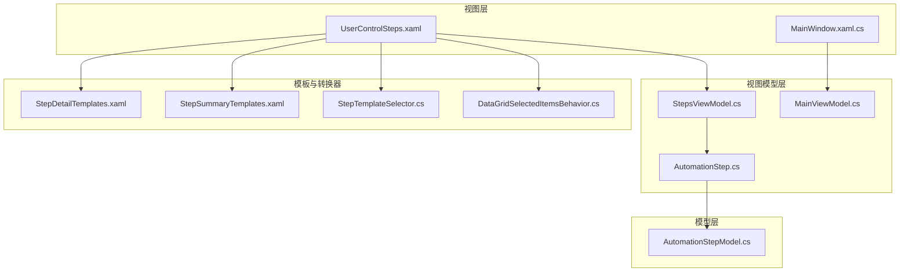
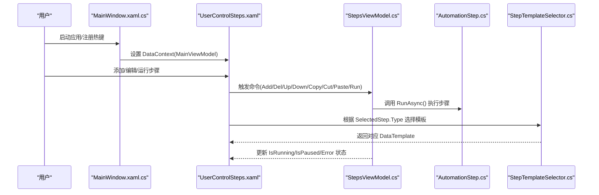
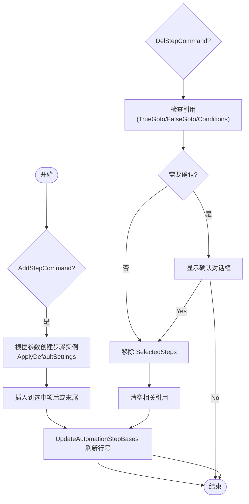
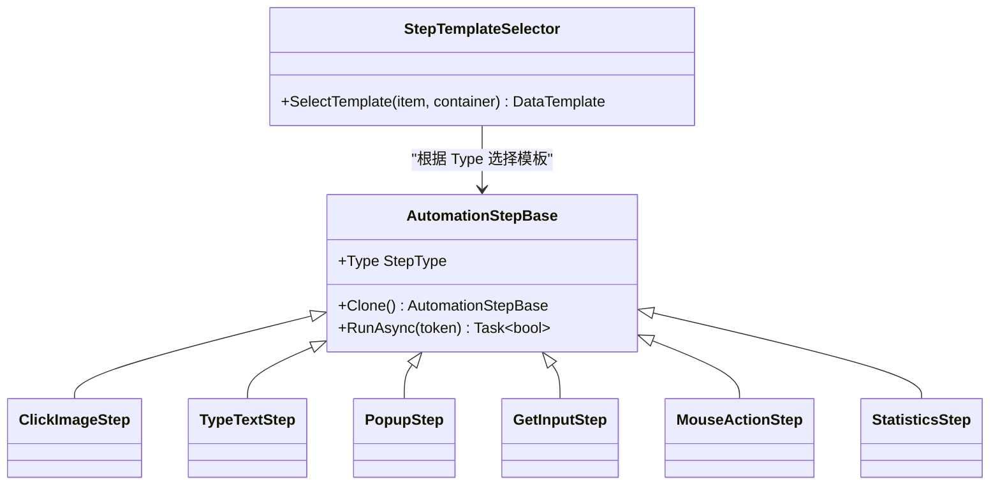
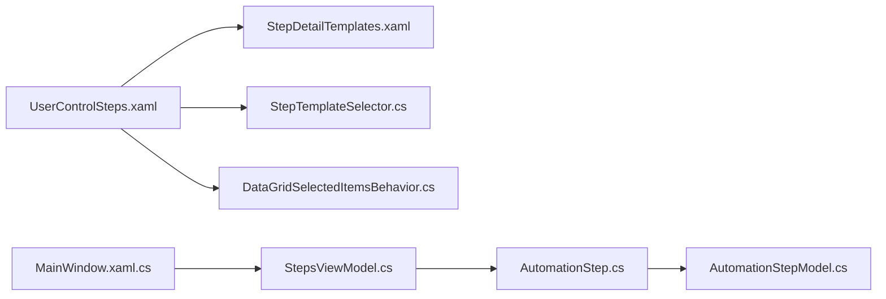

# 步骤编辑器

<cite>
**本文引用的文件**   
- [Readme.md](file://Readme.md)
- [MainWindow.xaml.cs](file://ShaoLu/MainWindow.xaml.cs)
- [StepsViewModel.cs](file://ShaoLu/Viewmodels/StepsViewModel.cs)
- [AutomationStep.cs](file://ShaoLu/Viewmodels/AutomationStep.cs)
- [AutomationStepModel.cs](file://ShaoLu/Models/AutomationStepModel.cs)
- [MainViewModel.cs](file://ShaoLu/Viewmodels/MainViewModel.cs)
- [UserControlSteps.xaml](file://ShaoLu/Views/UserControlSteps.xaml)
- [StepDetailTemplates.xaml](file://ShaoLu/Templates/StepDetailTemplates.xaml)
- [StepSummaryTemplates.xaml](file://ShaoLu/Templates/StepSummaryTemplates.xaml)
- [StepTemplateSelector.cs](file://ShaoLu/Converters/StepTemplateSelector.cs)
- [DataGridSelectedItemsBehavior.cs](file://ShaoLu/Utils/DataGridSelectedItemsBehavior.cs)
</cite>

## 目录
1. [简介](#简介)
2. [项目结构](#项目结构)
3. [核心组件](#核心组件)
4. [架构总览](#架构总览)
5. [详细组件分析](#详细组件分析)
6. [依赖关系分析](#依赖关系分析)
7. [性能考量](#性能考量)
8. [故障排查指南](#故障排查指南)
9. [结论](#结论)
10. [附录](#附录)

## 简介
本文件为 ShaoLu 步骤编辑器的开发文档，面向希望理解或扩展可视化步骤编辑界面的开发者。内容涵盖：
- 可视化步骤编辑界面实现与数据绑定模式
- 步骤列表的增删改查、拖拽排序（当前实现）与实时预览机制
- XAML 模板系统的使用、样式定制方法
- 步骤类型识别、参数验证与错误提示
- 自定义步骤类型的扩展方法与最佳实践

## 项目结构
ShaoLu 采用 WPF + MVVM 架构，UI 层由 XAML 定义，业务逻辑集中在 ViewModels，模型与枚举在 Models 中统一声明，模板与转换器位于 Templates 与 Converters 目录。

图表来源
- [UserControlSteps.xaml:1-192](file://ShaoLu/Views/UserControlSteps.xaml#L1-L192)
- [MainWindow.xaml.cs:1-376](file://ShaoLu/MainWindow.xaml.cs#L1-L376)
- [StepsViewModel.cs:1-747](file://ShaoLu/Viewmodels/StepsViewModel.cs#L1-L747)
- [AutomationStep.cs:1-1121](file://ShaoLu/Viewmodels/AutomationStep.cs#L1-L1121)
- [AutomationStepModel.cs:1-73](file://ShaoLu/Models/AutomationStepModel.cs#L1-L73)
- [StepDetailTemplates.xaml:1-782](file://ShaoLu/Templates/StepDetailTemplates.xaml#L1-L782)
- [StepSummaryTemplates.xaml:1-55](file://ShaoLu/Templates/StepSummaryTemplates.xaml#L1-L55)
- [StepTemplateSelector.cs:1-46](file://ShaoLu/Converters/StepTemplateSelector.cs#L1-L46)
- [DataGridSelectedItemsBehavior.cs:1-63](file://ShaoLu/Utils/DataGridSelectedItemsBehavior.cs#L1-L63)

章节来源
- [UserControlSteps.xaml:1-192](file://ShaoLu/Views/UserControlSteps.xaml#L1-L192)
- [MainWindow.xaml.cs:1-376](file://ShaoLu/MainWindow.xaml.cs#L1-L376)

## 核心组件
- 步骤执行与编排：StepsViewModel 负责步骤集合管理、运行控制、暂停/停止、复制/剪切/粘贴、上下移动、删除确认与引用清理等。
- 步骤模型与执行：AutomationStepBase 及其派生类（点击识图、查找识图、输入文字、多段输入、从文件输入、弹出框、获取输入、鼠标操作、统计等）提供统一的 RunAsync 接口与属性。
- UI 与模板：UserControlSteps 通过 DataGrid 展示步骤列表，右侧 ContentControl 使用 StepTemplateSelector 根据步骤类型动态加载 Detail 模板；Summary 模板用于行内快速编辑。
- 数据绑定与行为：WPF 双向绑定驱动 UI 更新；DataGridSelectedItemsBehavior 将 DataGrid.SelectedItems 同步到 ViewModel 的多选集合。

章节来源
- [StepsViewModel.cs:1-747](file://ShaoLu/Viewmodels/StepsViewModel.cs#L1-L747)
- [AutomationStep.cs:1-1121](file://ShaoLu/Viewmodels/AutomationStep.cs#L1-L1121)
- [UserControlSteps.xaml:1-192](file://ShaoLu/Views/UserControlSteps.xaml#L1-L192)
- [StepDetailTemplates.xaml:1-782](file://ShaoLu/Templates/StepDetailTemplates.xaml#L1-L782)
- [StepSummaryTemplates.xaml:1-55](file://ShaoLu/Templates/StepSummaryTemplates.xaml#L1-L55)
- [StepTemplateSelector.cs:1-46](file://ShaoLu/Converters/StepTemplateSelector.cs#L1-L46)
- [DataGridSelectedItemsBehavior.cs:1-63](file://ShaoLu/Utils/DataGridSelectedItemsBehavior.cs#L1-L63)

## 架构总览
下图展示了主窗口、步骤视图、视图模型与模板选择器之间的交互关系，以及步骤执行流程的关键节点。

图表来源
- [MainWindow.xaml.cs:1-376](file://ShaoLu/MainWindow.xaml.cs#L1-L376)
- [UserControlSteps.xaml:1-192](file://ShaoLu/Views/UserControlSteps.xaml#L1-L192)
- [StepsViewModel.cs:1-747](file://ShaoLu/Viewmodels/StepsViewModel.cs#L1-L747)
- [AutomationStep.cs:1-1121](file://ShaoLu/Viewmodels/AutomationStep.cs#L1-L1121)
- [StepTemplateSelector.cs:1-46](file://ShaoLu/Converters/StepTemplateSelector.cs#L1-L46)

## 详细组件分析

### 步骤列表与增删改查
- 列表展示：DataGrid 绑定 AutomationStepBases，列包含启用开关、行号、类型、名称、描述、跳转目标行号等。
- 新增：AddStepCommand 支持按类型创建不同步骤实例，并应用默认设置；可插入到选中项之后或末尾。
- 删除：DelStepCommand 会检查被删除步骤是否被其他步骤引用（TrueGotoUid/FalseGotoUid/Conditions.StepUid），并在确认后清理引用。
- 上移/下移：UpStep/DownStep 基于 LineNo 索引进行 Move 操作。
- 多选与批量操作：DataGridSelectedItemsBehavior 将 DataGrid.SelectedItems 同步到 SelectedSteps，Copy/Cut/Paste 基于 Clone 实现。
- 保存/打开：MainWindow 处理 .autostep/.json 文件的加载与保存，维护 StepFilePath 与图片工作目录。

图表来源
- [StepsViewModel.cs:186-439](file://ShaoLu/Viewmodels/StepsViewModel.cs#L186-L439)
- [DataGridSelectedItemsBehavior.cs:1-63](file://ShaoLu/Utils/DataGridSelectedItemsBehavior.cs#L1-L63)
- [MainWindow.xaml.cs:197-293](file://ShaoLu/MainWindow.xaml.cs#L197-L293)

章节来源
- [StepsViewModel.cs:158-439](file://ShaoLu/Viewmodels/StepsViewModel.cs#L158-L439)
- [UserControlSteps.xaml:115-148](file://ShaoLu/Views/UserControlSteps.xaml#L115-L148)
- [DataGridSelectedItemsBehavior.cs:1-63](file://ShaoLu/Utils/DataGridSelectedItemsBehavior.cs#L1-L63)
- [MainWindow.xaml.cs:197-293](file://ShaoLu/MainWindow.xaml.cs#L197-L293)

### 拖拽排序与实时预览
- 拖拽排序：当前代码未实现 DataGrid 行间的拖拽重排。可通过附加行为或事件实现 Drag/Drop，结合 ObservableCollection.Move 调整顺序。
- 实时预览：Detail 模板中的控件使用 TwoWay 绑定，修改即反映到 ViewModel；TextStepMore 提供 TextToType 预览文本块，TypeTextFromFile 支持逐行预览。

章节来源
- [StepDetailTemplates.xaml:289-385](file://ShaoLu/Templates/StepDetailTemplates.xaml#L289-L385)
- [AutomationStep.cs:367-516](file://ShaoLu/Viewmodels/AutomationStep.cs#L367-L516)

### XAML 模板系统与数据绑定
- 模板选择器：StepTemplateSelector 根据 AutomationStepBase.Type 返回对应的 DataTemplate，实现“同数据不同视图”的动态渲染。
- 详情模板：StepDetailTemplates.xaml 定义了各步骤的详细配置面板，包括通用跳转面板、条件判断面板、OCR/鼠标动作等专属配置。
- 摘要模板：StepSummaryTemplates.xaml 提供行内快速编辑模板（如点击识图、输入文字）。
- 数据绑定：所有属性均通过 Binding 与 ViewModel 双向绑定，使用 UpdateSourceTrigger=LostFocus/PropertyChanged 控制更新时机。

图表来源
- [StepTemplateSelector.cs:1-46](file://ShaoLu/Converters/StepTemplateSelector.cs#L1-L46)
- [AutomationStep.cs:1-1121](file://ShaoLu/Viewmodels/AutomationStep.cs#L1-L1121)
- [StepDetailTemplates.xaml:1-782](file://ShaoLu/Templates/StepDetailTemplates.xaml#L1-L782)
- [StepSummaryTemplates.xaml:1-55](file://ShaoLu/Templates/StepSummaryTemplates.xaml#L1-L55)

章节来源
- [StepTemplateSelector.cs:1-46](file://ShaoLu/Converters/StepTemplateSelector.cs#L1-L46)
- [StepDetailTemplates.xaml:1-782](file://ShaoLu/Templates/StepDetailTemplates.xaml#L1-L782)
- [StepSummaryTemplates.xaml:1-55](file://ShaoLu/Templates/StepSummaryTemplates.xaml#L1-L55)

### 步骤类型识别、参数验证与错误提示
- 类型识别：StepType 枚举集中管理所有步骤类型，StepTemplateSelector 据此选择模板；StepsViewModel.AddStepCommand 根据字符串参数创建具体步骤。
- 参数验证：
  - 数值输入：使用 NumericBox 限制范围与精度，TextBox 输入拦截非数字字符。
  - 文件路径：TypeTextFromFileStep 支持 txt/csv/xlsx，读取失败抛出异常。
  - OCR/区域：GetInputStep 支持 OCR 区域与屏幕文本点选择。
- 错误提示：
  - StepsViewModel.Run 捕获异常，设置 IsError/ErrorMessage/ErrorType，并根据配置弹出错误对话框。
  - 自引用检测：当步骤跳转到自身时，SelfReferenceCount 计数达到 SelfReferenceLimit 则强制结果为 false 并提示。

章节来源
- [AutomationStepModel.cs:1-73](file://ShaoLu/Models/AutomationStepModel.cs#L1-L73)
- [StepsViewModel.cs:493-694](file://ShaoLu/Viewmodels/StepsViewModel.cs#L493-L694)
- [AutomationStep.cs:518-680](file://ShaoLu/Viewmodels/AutomationStep.cs#L518-L680)
- [MainWindow.xaml.cs:112-143](file://ShaoLu/MainWindow.xaml.cs#L112-L143)

### 实时预览机制
- TextStepMore：前缀/中间/后缀组合生成 TextToType，并提供预览文本块。
- TypeTextFromFile：每次执行输出 Contents[Index] 并递增 Index，支持 ReloadIndex 重置。
- PopupStep：运行时弹出异步弹窗，支持超时自动关闭与到达指定步骤关闭。

章节来源
- [AutomationStep.cs:367-516](file://ShaoLu/Viewmodels/AutomationStep.cs#L367-L516)
- [AutomationStep.cs:518-680](file://ShaoLu/Viewmodels/AutomationStep.cs#L518-L680)
- [AutomationStep.cs:888-1014](file://ShaoLu/Viewmodels/AutomationStep.cs#L888-L1014)

### 自定义步骤类型的扩展方法与最佳实践
- 新增步骤类型：
  1) 在 AutomationStepBase 派生新类，实现 Clone() 与 RunAsync()。
  2) 在 StepType 枚举中添加新值。
  3) 在 StepTemplateSelector 中映射新类型到 DataTemplate。
  4) 在 StepDetailTemplates.xaml 中定义该类型的详细模板。
  5) 在 StepsViewModel.AddStepCommand 中增加字符串参数分支以创建新实例。
- 最佳实践：
  - 保持属性变更通知（继承 ObservableObject）。
  - 使用 RelayCommand/RelayParameterCommand 封装命令。
  - 对耗时操作使用异步与取消令牌，避免阻塞 UI。
  - 合理设置 WaitTime/Timeout，提升稳定性。
  - 使用 JSON 序列化兼容（JsonIgnore/JsonPropertyName）确保配置持久化。

章节来源
- [AutomationStep.cs:1-1121](file://ShaoLu/Viewmodels/AutomationStep.cs#L1-L1121)
- [AutomationStepModel.cs:1-73](file://ShaoLu/Models/AutomationStepModel.cs#L1-L73)
- [StepTemplateSelector.cs:1-46](file://ShaoLu/Converters/StepTemplateSelector.cs#L1-L46)
- [StepDetailTemplates.xaml:1-782](file://ShaoLu/Templates/StepDetailTemplates.xaml#L1-L782)
- [StepsViewModel.cs:186-250](file://ShaoLu/Viewmodels/StepsViewModel.cs#L186-L250)

## 依赖关系分析
- 视图依赖模板与转换器：UserControlSteps 合并 StepDetailTemplates，并使用 StepTemplateSelector 与 NullToVisibilityConverter、BoolToInverseBoolConverter。
- 视图模型依赖服务与工具：StepsViewModel 依赖 SingletonLocator.Settings、Autogui、ExecutionLogService、WindowAsyncPopup 等。
- 模型与枚举：AutomationStepModel 定义 StepType、StepErrorType、PopupCloseMode、PopupWindowStyle 等。

图表来源
- [UserControlSteps.xaml:1-192](file://ShaoLu/Views/UserControlSteps.xaml#L1-L192)
- [StepDetailTemplates.xaml:1-782](file://ShaoLu/Templates/StepDetailTemplates.xaml#L1-L782)
- [StepTemplateSelector.cs:1-46](file://ShaoLu/Converters/StepTemplateSelector.cs#L1-L46)
- [DataGridSelectedItemsBehavior.cs:1-63](file://ShaoLu/Utils/DataGridSelectedItemsBehavior.cs#L1-L63)
- [StepsViewModel.cs:1-747](file://ShaoLu/Viewmodels/StepsViewModel.cs#L1-L747)
- [AutomationStep.cs:1-1121](file://ShaoLu/Viewmodels/AutomationStep.cs#L1-L1121)
- [AutomationStepModel.cs:1-73](file://ShaoLu/Models/AutomationStepModel.cs#L1-L73)
- [MainWindow.xaml.cs:1-376](file://ShaoLu/MainWindow.xaml.cs#L1-L376)

章节来源
- [UserControlSteps.xaml:1-192](file://ShaoLu/Views/UserControlSteps.xaml#L1-L192)
- [StepsViewModel.cs:1-747](file://ShaoLu/Viewmodels/StepsViewModel.cs#L1-L747)
- [AutomationStep.cs:1-1121](file://ShaoLu/Viewmodels/AutomationStep.cs#L1-L1121)
- [AutomationStepModel.cs:1-73](file://ShaoLu/Models/AutomationStepModel.cs#L1-L73)
- [MainWindow.xaml.cs:1-376](file://ShaoLu/MainWindow.xaml.cs#L1-L376)

## 性能考量
- 异步执行：StepsViewModel.Run 使用 CancellationToken 与 Task.Delay，避免阻塞 UI 线程。
- 资源释放：AutomationStepBases.CollectionChanged 中对旧项进行 Dispose，防止内存泄漏。
- 大数据集：TypeTextFromFileStep 的 ListBox 使用 VirtualizingStackPanel 提升大列表性能。
- 日志记录：ExecutionLogService 异步记录执行结果，减少主流程开销。

[本节为通用指导，不直接分析具体文件]

## 故障排查指南
- 打开/保存失败：检查文件路径权限与格式，查看 WindowAsyncPopup 的错误提示。
- 步骤执行异常：查看 IsError/ErrorMessage/ErrorType，定位具体步骤；必要时启用 EnableLog。
- 自引用循环：检查 TrueGotoUid/FalseGotoUid 指向自身的情况，调整 SelfReferenceLimit。
- 弹窗未关闭：确认 CloseMode 与 AutoCloseSeconds 设置；StepReached 模式下确保目标步骤存在。

章节来源
- [MainWindow.xaml.cs:226-293](file://ShaoLu/MainWindow.xaml.cs#L226-L293)
- [StepsViewModel.cs:597-622](file://ShaoLu/Viewmodels/StepsViewModel.cs#L597-L622)
- [AutomationStep.cs:888-1014](file://ShaoLu/Viewmodels/AutomationStep.cs#L888-L1014)

## 结论
ShaoLu 步骤编辑器通过清晰的 MVVM 分层、灵活的 XAML 模板系统与稳健的执行引擎，提供了强大的可视化自动化流程编辑能力。开发者可基于现有架构轻松扩展新的步骤类型与功能模块，同时保证良好的用户体验与性能表现。

[本节为总结性内容，不直接分析具体文件]

## 附录
- 快捷键：Ctrl+Alt+F9 运行；Ctrl+Alt+F10 停止（由 MainWindow 注册全局热键）。
- 语言切换：支持 en-US、zh-CN、zh-TW，通过 LanguageService 动态切换。
- 登录控制：部分编辑操作需登录，未登录时弹出登录窗口。

章节来源
- [MainWindow.xaml.cs:34-76](file://ShaoLu/MainWindow.xaml.cs#L34-L76)
- [MainWindow.xaml.cs:145-173](file://ShaoLu/MainWindow.xaml.cs#L145-L173)
- [MainWindow.xaml.cs:357-373](file://ShaoLu/MainWindow.xaml.cs#L357-L373)