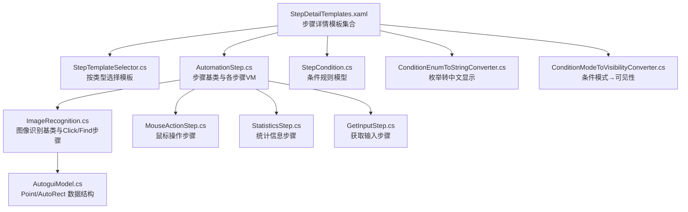
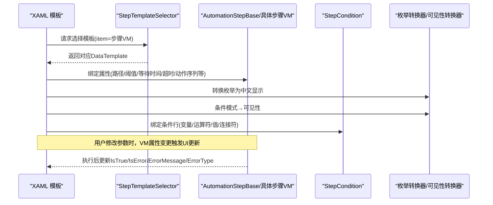
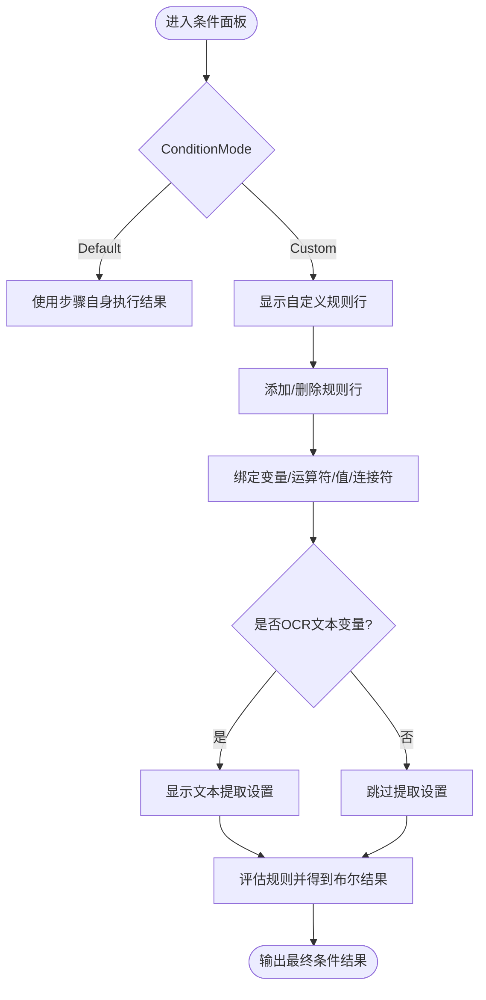
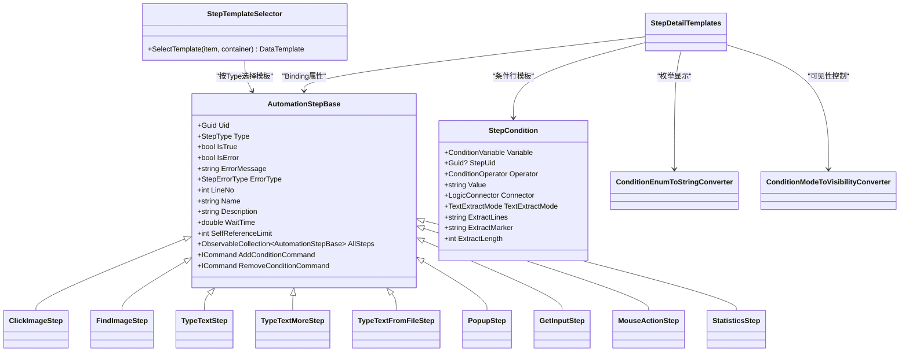

# 步骤详情编辑器

<cite>
**本文引用的文件**   
- [StepDetailTemplates.xaml](file://ShaoLu/Templates/StepDetailTemplates.xaml)
- [StepTemplateSelector.cs](file://ShaoLu/Converters/StepTemplateSelector.cs)
- [AutomationStepModel.cs](file://ShaoLu/Models/AutomationStepModel.cs)
- [AutomationStep.cs](file://ShaoLu/Viewmodels/AutomationStep.cs)
- [StepCondition.cs](file://ShaoLu/Models/StepCondition.cs)
- [ConditionEnumToStringConverter.cs](file://ShaoLu/Converters/ConditionEnumToStringConverter.cs)
- [ConditionModeToVisibilityConverter.cs](file://ShaoLu/Converters/ConditionModeToVisibilityConverter.cs)
- [MouseActionStep.cs](file://ShaoLu/Viewmodels/MouseActionStep.cs)
- [MouseActionItem.cs](file://ShaoLu/Models/MouseActionItem.cs)
- [StatisticsStep.cs](file://ShaoLu/Viewmodels/StatisticsStep.cs)
- [GetInputStep.cs](file://ShaoLu/Viewmodels/GetInputStep.cs)
- [ImageRecognition.cs](file://ShaoLu/Viewmodels/ImageRecognition.cs)
- [AutoguiModel.cs](file://ShaoLu/Models/AutoguiModel.cs)
- [Readme.md](file://Readme.md)
</cite>

## 目录
1. [简介](#简介)
2. [项目结构](#项目结构)
3. [核心组件](#核心组件)
4. [架构总览](#架构总览)
5. [详细组件分析](#详细组件分析)
6. [依赖关系分析](#依赖关系分析)
7. [性能考虑](#性能考虑)
8. [故障排查指南](#故障排查指南)
9. [结论](#结论)
10. [附录](#附录)

## 简介
本开发文档聚焦于 ShaoLu 的“步骤详情编辑器”，围绕 StepDetailTemplates.xaml 中各步骤类型的编辑界面模板设计，系统阐述动态参数绑定机制、数据验证规则、错误提示与用户反馈，并给出自定义步骤类型编辑器的扩展方法与最佳实践。读者可据此快速理解现有模板如何与 ViewModel 属性双向绑定、如何通过转换器实现枚举显示与可见性控制，以及如何扩展新的步骤类型和条件规则。

## 项目结构
- 模板层：StepDetailTemplates.xaml 集中定义各类步骤的 DataTemplate，并通过 StepTemplateSelector 按步骤类型选择对应模板。
- 模型与枚举：AutomationStepModel.cs 定义 StepType、PopupCloseMode、PopupWindowStyle 等；StepCondition.cs 定义条件变量、运算符、连接器与文本提取模式。
- 视图模型：AutomationStep.cs 提供所有步骤基类与具体步骤（点击识图、查找识图、输入文字、弹出框、获取输入、鼠标操作、统计信息）的属性、命令与执行逻辑；MouseActionStep.cs、StatisticsStep.cs、GetInputStep.cs、ImageRecognition.cs 分别承载特定功能。
- 转换器：ConditionEnumToStringConverter.cs 将枚举转换为中文显示；ConditionModeToVisibilityConverter.cs 将条件模式映射为可见性。
- 工具与资源：AutoguiModel.cs 提供坐标与矩形数据结构；Readme.md 提供使用说明与步骤说明。

图表来源
- [StepDetailTemplates.xaml:1-782](file://ShaoLu/Templates/StepDetailTemplates.xaml#L1-L782)
- [StepTemplateSelector.cs:1-46](file://ShaoLu/Converters/StepTemplateSelector.cs#L1-L46)
- [AutomationStep.cs:1-800](file://ShaoLu/Viewmodels/AutomationStep.cs#L1-L800)
- [StepCondition.cs:1-405](file://ShaoLu/Models/StepCondition.cs#L1-L405)
- [ConditionEnumToStringConverter.cs:1-170](file://ShaoLu/Converters/ConditionEnumToStringConverter.cs#L1-L170)
- [ConditionModeToVisibilityConverter.cs:1-28](file://ShaoLu/Converters/ConditionModeToVisibilityConverter.cs#L1-L28)
- [ImageRecognition.cs:1-602](file://ShaoLu/Viewmodels/ImageRecognition.cs#L1-L602)
- [MouseActionStep.cs:1-162](file://ShaoLu/Viewmodels/MouseActionStep.cs#L1-L162)
- [StatisticsStep.cs:1-459](file://ShaoLu/Viewmodels/StatisticsStep.cs#L1-L459)
- [GetInputStep.cs:1-294](file://ShaoLu/Viewmodels/GetInputStep.cs#L1-L294)
- [AutoguiModel.cs:1-145](file://ShaoLu/Models/AutoguiModel.cs#L1-L145)

章节来源
- [Readme.md:1-283](file://Readme.md#L1-L283)

## 核心组件
- 步骤详情模板集合：在 XAML 中为 ClickImage、FindImage、TypeText、TypeTextMore、TypeTextFromFile、Popup、GetInput、MouseAction、Statistics 等步骤定义专属 DataTemplate，统一包含通用跳转面板与条件面板。
- 模板选择器：根据 AutomationStepBase.Type 返回对应模板，确保 UI 与数据模型一致。
- 条件规则系统：支持默认模式与自定义模式，自定义模式下通过多行规则（变量、运算符、值、连接符）组合判断，并可对 OCR 文本进行提取设置。
- 枚举转换器：将条件相关枚举（模式、变量、运算符、连接器、弹窗样式/关闭模式、位置模式、输入模式、文本提取模式）转换为本地化中文显示。
- 可见性转换器：将 ConditionMode 映射为 Visibility，用于显示/隐藏自定义条件区域。

章节来源
- [StepDetailTemplates.xaml:1-782](file://ShaoLu/Templates/StepDetailTemplates.xaml#L1-L782)
- [StepTemplateSelector.cs:1-46](file://ShaoLu/Converters/StepTemplateSelector.cs#L1-L46)
- [StepCondition.cs:1-405](file://ShaoLu/Models/StepCondition.cs#L1-L405)
- [ConditionEnumToStringConverter.cs:1-170](file://ShaoLu/Converters/ConditionEnumToStringConverter.cs#L1-L170)
- [ConditionModeToVisibilityConverter.cs:1-28](file://ShaoLu/Converters/ConditionModeToVisibilityConverter.cs#L1-L28)

## 架构总览
步骤详情编辑器的整体交互流程如下：
- 用户在主界面选择或新增一个步骤，其 Type 由 VM 决定。
- StepTemplateSelector 根据 Type 选择对应的 DataTemplate。
- DataTemplate 中的控件通过 Binding 与 VM 属性双向绑定，实时更新预览与校验状态。
- 条件面板根据 ConditionMode 切换显示，并在 Custom 模式下渲染多行规则。
- 运行时，步骤执行结果影响 IsTrue、IsError、ErrorMessage、ErrorType 等属性，UI 即时反馈。

图表来源
- [StepDetailTemplates.xaml:1-782](file://ShaoLu/Templates/StepDetailTemplates.xaml#L1-L782)
- [StepTemplateSelector.cs:1-46](file://ShaoLu/Converters/StepTemplateSelector.cs#L1-L46)
- [AutomationStep.cs:1-800](file://ShaoLu/Viewmodels/AutomationStep.cs#L1-L800)
- [StepCondition.cs:1-405](file://ShaoLu/Models/StepCondition.cs#L1-L405)
- [ConditionEnumToStringConverter.cs:1-170](file://ShaoLu/Converters/ConditionEnumToStringConverter.cs#L1-L170)
- [ConditionModeToVisibilityConverter.cs:1-28](file://ShaoLu/Converters/ConditionModeToVisibilityConverter.cs#L1-L28)

## 详细组件分析

### 通用跳转面板（GotoPanelTemplate）
- 功能：为真/假分支配置跳转目标步骤 Uid，并提供自引用次数限制。
- 绑定：AllSteps 下拉列表展示所有步骤（含“无跳转”占位项），SelectedValuePath 指向 Uid；SelfReferenceLimit 限制循环自引用次数。
- 验证：当 Uid 为空或无效时，解析行号为 0，避免 UI 显示异常。

章节来源
- [StepDetailTemplates.xaml:16-73](file://ShaoLu/Templates/StepDetailTemplates.xaml#L16-L73)
- [AutomationStep.cs:158-192](file://ShaoLu/Viewmodels/AutomationStep.cs#L158-L192)

### 条件规则行模板（ConditionRowTemplate）与条件面板（ConditionPanelTemplate）
- 功能：支持默认模式（使用步骤自身执行结果）与自定义模式（多行规则）。
- 变量与运算符：Variable 支持常量、当前步骤、引用步骤的多种变量；Operator 支持等于、不等于、大小比较、包含、正则匹配、空检查等；Connector 支持 And/Or。
- 文本提取：当变量为 OCR 文本时，显示 TextExtractMode、ExtractLines、ExtractMarker、ExtractLength 等设置。
- 可见性：通过 ConditionModeToVisibilityConverter 控制自定义条件区域的显示/隐藏。

图表来源
- [StepDetailTemplates.xaml:75-202](file://ShaoLu/Templates/StepDetailTemplates.xaml#L75-L202)
- [StepCondition.cs:103-405](file://ShaoLu/Models/StepCondition.cs#L103-L405)
- [ConditionEnumToStringConverter.cs:1-170](file://ShaoLu/Converters/ConditionEnumToStringConverter.cs#L1-L170)
- [ConditionModeToVisibilityConverter.cs:1-28](file://ShaoLu/Converters/ConditionModeToVisibilityConverter.cs#L1-L28)

章节来源
- [StepDetailTemplates.xaml:75-202](file://ShaoLu/Templates/StepDetailTemplates.xaml#L75-L202)
- [StepCondition.cs:103-405](file://ShaoLu/Models/StepCondition.cs#L103-L405)

### 点击识图步骤（ClickImageStepTemplate）
- 功能：选择目标图片、设置相似度阈值、等待/超时时间、鼠标动作序列（点击/双击/滚动等）、跳转与条件。
- 绑定：ImagePath、SimilarityThreshold（滑块与数值框同步）、WaitTime、Timeout、MouseActions（Add/Remove 命令）。
- 预览与验证：未选择图片或裁剪图为空时，VM 会设置 IsError 与 ErrorMessage；相似度阈值自动钳制到 0~1。

章节来源
- [StepDetailTemplates.xaml:205-249](file://ShaoLu/Templates/StepDetailTemplates.xaml#L205-L249)
- [ImageRecognition.cs:329-436](file://ShaoLu/Viewmodels/ImageRecognition.cs#L329-L436)
- [MouseActionItem.cs:1-57](file://ShaoLu/Models/MouseActionItem.cs#L1-L57)

### 查找识图步骤（FindImageStepTemplate）
- 功能：仅判断是否找到图片，可选启用 OCR 识别指定区域，显示 OCR 区域描述与结果预览。
- 绑定：ImagePath、SimilarityThreshold、WaitTime、GapTime、Timeout、EnableOCR、OCRRegionText。
- 运行：若启用 OCR 且找到图片，计算屏幕区域并进行 OCR，结果写入 LastResult.OCRText 与预览属性。

章节来源
- [StepDetailTemplates.xaml:252-286](file://ShaoLu/Templates/StepDetailTemplates.xaml#L252-L286)
- [ImageRecognition.cs:439-602](file://ShaoLu/Viewmodels/ImageRecognition.cs#L439-L602)

### 输入文字步骤（TextStepTemplate / TextStepMoreTemplate / TextStepFromFileTemplate）
- 单行输入：TextToType、DelayBetweenKeys、WaitTime。
- 多次输入：Prefix/Infix/Suffix 三段组合，支持递增开关，实时预览 TextToType。
- 从文件输入：支持 txt/csv/xlsx，加载内容列表，逐行输入，Index 递增，超出范围时报错。

章节来源
- [StepDetailTemplates.xaml:289-385](file://ShaoLu/Templates/StepDetailTemplates.xaml#L289-L385)
- [AutomationStep.cs:300-680](file://ShaoLu/Viewmodels/AutomationStep.cs#L300-L680)

### 弹出框步骤（PopupStepTemplate）
- 功能：标题、富文本内容、字体/颜色、弹窗类型、按钮列表、窗口样式与位置、透明度、背景色、关闭模式（按钮点击/超时/到达某步骤）。
- 绑定：Title、PopupText、PopupFont、PopupType、PopupButtons、PopupWindowStyle、WindowX/Y、WindowOpacity、BackgroundColor、CloseMode、AutoCloseSeconds、CloseOnStepUid。
- 交互：SelectPositionCommand 打开点选窗口；SelectBackgroundColorCommand 打开颜色选择器；按钮列表支持增删。

章节来源
- [StepDetailTemplates.xaml:388-538](file://ShaoLu/Templates/StepDetailTemplates.xaml#L388-L538)
- [AutomationStep.cs:684-800](file://ShaoLu/Viewmodels/AutomationStep.cs#L684-L800)

### 获取输入步骤（GetInputStepTemplate）
- 功能：OCR 区域识别或屏幕指定位置读取可选择文本；测试 OCR 并预览结果（超过 100 字符截断，点击预览全文）。
- 绑定：InputMode、OCRRegion/OCRRegionText、TextPoint/TextPointText、WaitTime、OCRResultFull/Preview。
- 命令：SelectRegionCommand、TestOCRCommand、SelectTextPointCommand、PreviewResultCommand。

章节来源
- [StepDetailTemplates.xaml:541-600](file://ShaoLu/Templates/StepDetailTemplates.xaml#L541-L600)
- [GetInputStep.cs:1-294](file://ShaoLu/Viewmodels/GetInputStep.cs#L1-L294)

### 鼠标操作步骤（MouseActionStepTemplate）
- 功能：位置模式（绝对坐标/当前鼠标）、目标坐标、鼠标动作序列（点击/双击/滚动等）。
- 绑定：PositionMode、TargetX/Y、MouseActions、WaitTime。
- 运行：Absolute 模式下移动鼠标到目标坐标，然后顺序执行 MouseActions。

章节来源
- [StepDetailTemplates.xaml:603-657](file://ShaoLu/Templates/StepDetailTemplates.xaml#L603-L657)
- [MouseActionStep.cs:1-162](file://ShaoLu/Viewmodels/MouseActionStep.cs#L1-L162)
- [MouseActionItem.cs:1-57](file://ShaoLu/Models/MouseActionItem.cs#L1-L57)

### 统计信息步骤（StatisticsStepTemplate）
- 功能：统计窗口标题、位置、置顶、自动关闭、背景色与透明度；统计项包括总耗时、当前步骤、步骤耗时、步骤计数、步骤结果、条件计数；支持自定义条件。
- 绑定：WindowTitle、WindowX/Y、AlwaysOnTop、AutoCloseSeconds、CloseOnStop、BackgroundColor、BackgroundOpacity、StatisticsItems、CustomConditions。
- 运行：每个步骤执行后调用 UpdateConditionCounts 累计 true/false 次数。

章节来源
- [StepDetailTemplates.xaml:659-770](file://ShaoLu/Templates/StepDetailTemplates.xaml#L659-L770)
- [StatisticsStep.cs:1-459](file://ShaoLu/Viewmodels/StatisticsStep.cs#L1-L459)

### 模板选择器（StepTemplateSelector）
- 功能：根据 AutomationStepBase.Type 返回对应 DataTemplate，缺失类型回退到默认模板。
- 扩展：新增步骤类型时，需在 Selector 中添加映射，并在模板文件中定义相应 DataTemplate。

章节来源
- [StepTemplateSelector.cs:1-46](file://ShaoLu/Converters/StepTemplateSelector.cs#L1-L46)
- [StepDetailTemplates.xaml:772-782](file://ShaoLu/Templates/StepDetailTemplates.xaml#L772-L782)

## 依赖关系分析
- 模板与选择器：StepDetailTemplates.xaml 依赖 StepTemplateSelector 以动态选择模板。
- 模板与 VM：各 DataTemplate 通过 Binding 依赖 AutomationStepBase 及其派生类的属性与命令。
- 条件系统：StepCondition 依赖 SingletonLocator 获取步骤集合，依赖 LanguageService 提供本地化文本。
- 转换器：ConditionEnumToStringConverter 依赖 Models 与 Services.LanguageService；ConditionModeToVisibilityConverter 依赖 Models.ConditionMode。
- 图像识别：ImageRecognitionBase 依赖 MainViewModel、FileServices、Autogui、OCRService 与 Views。

图表来源
- [AutomationStep.cs:1-800](file://ShaoLu/Viewmodels/AutomationStep.cs#L1-L800)
- [StepCondition.cs:1-405](file://ShaoLu/Models/StepCondition.cs#L1-L405)
- [StepTemplateSelector.cs:1-46](file://ShaoLu/Converters/StepTemplateSelector.cs#L1-L46)
- [ConditionEnumToStringConverter.cs:1-170](file://ShaoLu/Converters/ConditionEnumToStringConverter.cs#L1-L170)
- [ConditionModeToVisibilityConverter.cs:1-28](file://ShaoLu/Converters/ConditionModeToVisibilityConverter.cs#L1-L28)
- [StepDetailTemplates.xaml:1-782](file://ShaoLu/Templates/StepDetailTemplates.xaml#L1-L782)

章节来源
- [AutomationStep.cs:1-800](file://ShaoLu/Viewmodels/AutomationStep.cs#L1-L800)
- [StepCondition.cs:1-405](file://ShaoLu/Models/StepCondition.cs#L1-L405)
- [StepTemplateSelector.cs:1-46](file://ShaoLu/Converters/StepTemplateSelector.cs#L1-L46)

## 性能考虑
- 大列表虚拟化：从文件输入步骤的 ListBox 使用 VirtualizingStackPanel 提升大数据量下的渲染性能。
- 图像缓存：ImageRecognitionBase 使用冻结的 BitmapSource 提高跨线程访问与渲染效率。
- 延迟与超时：各步骤通过 WaitTime 与 Timeout 控制执行节奏，避免频繁阻塞 UI 线程。
- 条件评估：条件计数在每次步骤执行后批量更新，减少重复计算。

章节来源
- [StepDetailTemplates.xaml:368-385](file://ShaoLu/Templates/StepDetailTemplates.xaml#L368-L385)
- [ImageRecognition.cs:200-227](file://ShaoLu/Viewmodels/ImageRecognition.cs#L200-L227)
- [StatisticsStep.cs:402-412](file://ShaoLu/Viewmodels/StatisticsStep.cs#L402-L412)

## 故障排查指南
- 图像未选择或裁剪失败：VM 设置 IsError=true 与 ErrorMessage，检查 ImagePath/CroppedImg 是否为空。
- OCR 区域未选择：GetInputStep 在 OCR 模式下检测区域有效性，未选择则报错并提示。
- 文件读取失败：TypeTextFromFileStep 在加载 txt/csv/xlsx 时捕获异常并抛出错误信息。
- 索引越界：TypeTextFromFileStep 在 Index 超出 Contents 长度时抛出异常并重置 Index。
- 弹窗颜色解析失败：PopupStep 的颜色选择器在解析失败时回退默认颜色。

章节来源
- [ImageRecognition.cs:149-195](file://ShaoLu/Viewmodels/ImageRecognition.cs#L149-L195)
- [GetInputStep.cs:166-222](file://ShaoLu/Viewmodels/GetInputStep.cs#L166-L222)
- [AutomationStep.cs:596-648](file://ShaoLu/Viewmodels/AutomationStep.cs#L596-L648)
- [AutomationStep.cs:651-679](file://ShaoLu/Viewmodels/AutomationStep.cs#L651-L679)
- [AutomationStep.cs:772-791](file://ShaoLu/Viewmodels/AutomationStep.cs#L772-L791)

## 结论
StepDetailTemplates.xaml 通过统一的模板结构与丰富的绑定机制，为多种自动化步骤提供了直观、可扩展的编辑界面。结合 StepTemplateSelector、条件系统与转换器，实现了灵活的参数配置、实时预览与健壮的错误反馈。遵循本文档的扩展方法与实践建议，可高效新增自定义步骤类型与条件规则，保持代码与界面的高内聚与低耦合。

## 附录
- 扩展自定义步骤类型编辑器的步骤：
  - 在 AutomationStepBase 派生新步骤类，定义必要属性与命令。
  - 在 StepDetailTemplates.xaml 中新增 DataTemplate，绑定 VM 属性。
  - 在 StepTemplateSelector 中注册新类型映射。
  - 如需条件规则，复用 StepCondition 与转换器；如需 OCR/图像，继承 ImageRecognitionBase。
- 最佳实践：
  - 使用 TwoWay 绑定与 UpdateSourceTrigger=PropertyChanged/LostFocus 平衡响应性与性能。
  - 通过转换器统一枚举显示与可见性控制，避免硬编码字符串。
  - 在 VM 中进行数据校验与错误提示，保持 UI 简洁。
  - 对大列表与图像资源使用虚拟化与缓存策略。

章节来源
- [StepDetailTemplates.xaml:1-782](file://ShaoLu/Templates/StepDetailTemplates.xaml#L1-L782)
- [StepTemplateSelector.cs:1-46](file://ShaoLu/Converters/StepTemplateSelector.cs#L1-L46)
- [AutomationStep.cs:1-800](file://ShaoLu/Viewmodels/AutomationStep.cs#L1-L800)
- [ImageRecognition.cs:1-602](file://ShaoLu/Viewmodels/ImageRecognition.cs#L1-L602)
- [ConditionEnumToStringConverter.cs:1-170](file://ShaoLu/Converters/ConditionEnumToStringConverter.cs#L1-L170)
- [ConditionModeToVisibilityConverter.cs:1-28](file://ShaoLu/Converters/ConditionModeToVisibilityConverter.cs#L1-L28)