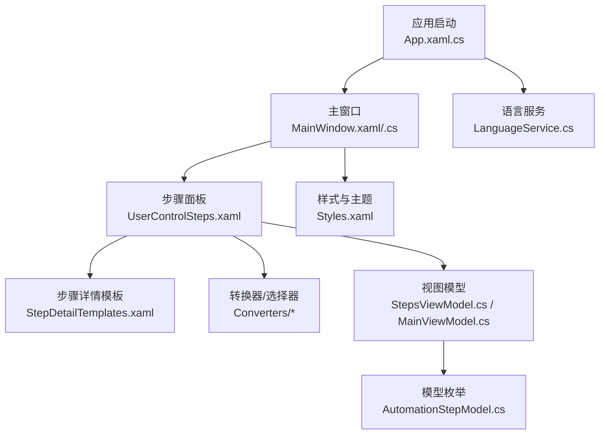
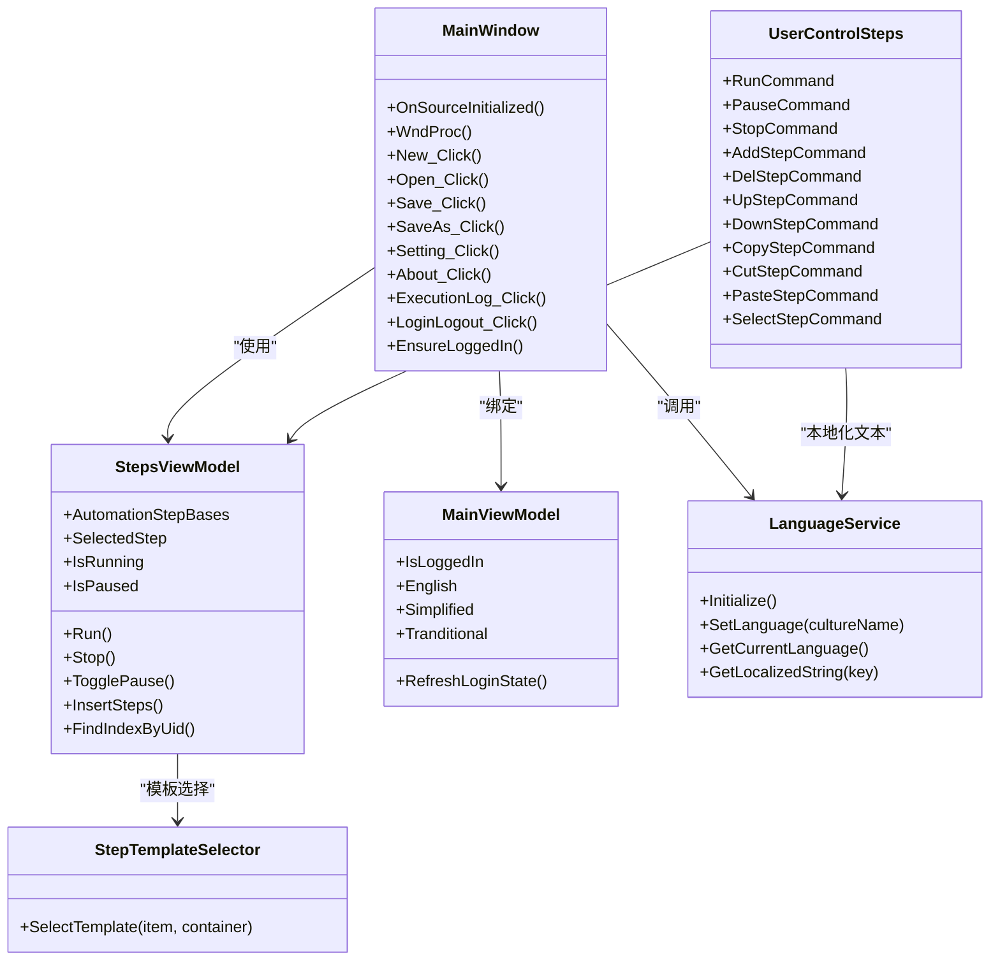
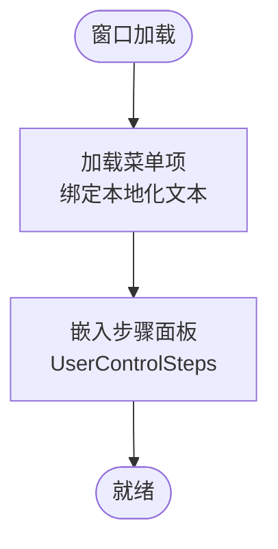
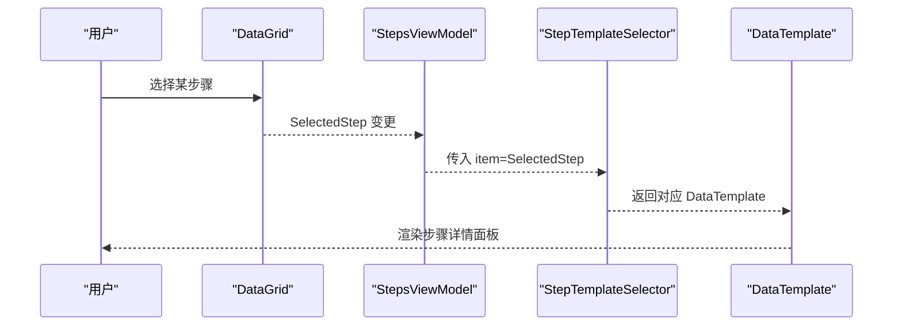
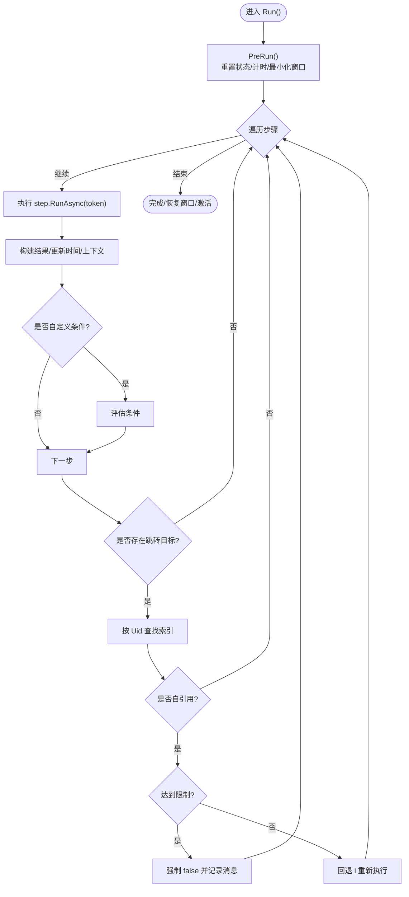
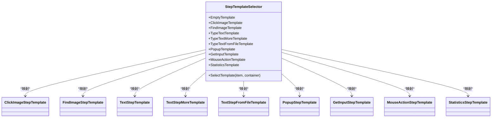
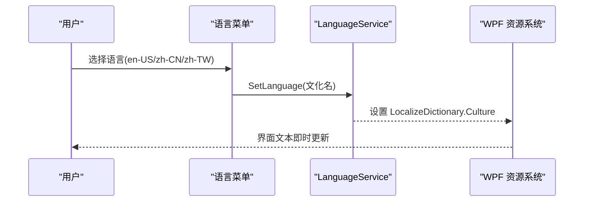
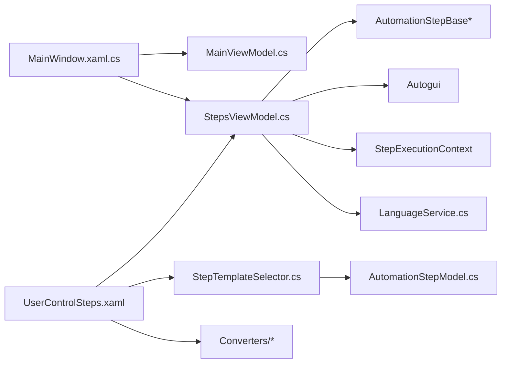

# 用户界面

<cite>
**本文引用的文件**   
- [App.xaml](file://ShaoLu/App.xaml)
- [App.xaml.cs](file://ShaoLu/App.xaml.cs)
- [MainWindow.xaml](file://ShaoLu/MainWindow.xaml)
- [MainWindow.xaml.cs](file://ShaoLu/MainWindow.xaml.cs)
- [UserControlSteps.xaml](file://ShaoLu/Views/UserControlSteps.xaml)
- [StepDetailTemplates.xaml](file://ShaoLu/Templates/StepDetailTemplates.xaml)
- [Styles.xaml](file://ShaoLu/Themes/Styles.xaml)
- [Strings.resx](file://ShaoLu/Resources/Strings.resx)
- [LanguageService.cs](file://ShaoLu/Services/LanguageService.cs)
- [MainViewModel.cs](file://ShaoLu/Viewmodels/MainViewModel.cs)
- [StepsViewModel.cs](file://ShaoLu/Viewmodels/StepsViewModel.cs)
- [AutomationStepModel.cs](file://ShaoLu/Models/AutomationStepModel.cs)
- [StepTemplateSelector.cs](file://ShaoLu/Converters/StepTemplateSelector.cs)
- [NullToVisibilityConverter.cs](file://ShaoLu/Converters/NullToVisibilityConverter.cs)
- [BoolToInverseBoolConverter.cs](file://ShaoLu/Converters/BoolToInverseBoolConverter.cs)
</cite>

## 目录
1. [简介](#简介)
2. [项目结构](#项目结构)
3. [核心组件](#核心组件)
4. [架构总览](#架构总览)
5. [详细组件分析](#详细组件分析)
6. [依赖关系分析](#依赖关系分析)
7. [性能考虑](#性能考虑)
8. [故障排查指南](#故障排查指南)
9. [结论](#结论)
10. [附录](#附录)

## 简介
本文件为 ShaoLu 的用户界面开发文档，聚焦以下目标：
- 主界面布局设计与步骤列表的可视化编辑能力
- 实时状态显示与进度反馈机制
- XAML 模板系统、数据绑定模式与样式定制方法
- 响应式设计与主题切换、国际化支持
- 自定义控件开发与界面扩展最佳实践

## 项目结构
ShaoLu 采用 WPF 技术栈，遵循 MVVM 模式，UI 层由 XAML 定义，逻辑层由 ViewModel 实现，服务层提供语言、执行日志、OCR、设置等能力。关键目录与职责：
- Views：窗口与用户控件（如 MainWindow、UserControlSteps）
- Viewmodels：视图模型（MainViewModel、StepsViewModel 等）
- Templates：XAML DataTemplate 资源（步骤详情模板、设置模板等）
- Converters：值转换器与模板选择器
- Services：语言、执行日志、OCR、设置等服务
- Themes：通用样式与图标资源
- Resources：本地化字符串资源（多语言）

图表来源
- [App.xaml.cs:19-91](file://ShaoLu/App.xaml.cs#L19-L91)
- [MainWindow.xaml:1-50](file://ShaoLu/MainWindow.xaml#L1-L50)
- [UserControlSteps.xaml:1-192](file://ShaoLu/Views/UserControlSteps.xaml#L1-L192)
- [StepDetailTemplates.xaml:1-782](file://ShaoLu/Templates/StepDetailTemplates.xaml#L1-L782)
- [Styles.xaml:1-232](file://ShaoLu/Themes/Styles.xaml#L1-L232)
- [LanguageService.cs:1-67](file://ShaoLu/Services/LanguageService.cs#L1-L67)
- [StepsViewModel.cs:1-747](file://ShaoLu/Viewmodels/StepsViewModel.cs#L1-L747)
- [MainViewModel.cs:1-76](file://ShaoLu/Viewmodels/MainViewModel.cs#L1-L76)
- [AutomationStepModel.cs:1-73](file://ShaoLu/Models/AutomationStepModel.cs#L1-L73)

章节来源
- [App.xaml:1-36](file://ShaoLu/App.xaml#L1-L36)
- [App.xaml.cs:1-112](file://ShaoLu/App.xaml.cs#L1-L112)
- [MainWindow.xaml:1-50](file://ShaoLu/MainWindow.xaml#L1-L50)
- [UserControlSteps.xaml:1-192](file://ShaoLu/Views/UserControlSteps.xaml#L1-L192)
- [StepDetailTemplates.xaml:1-782](file://ShaoLu/Templates/StepDetailTemplates.xaml#L1-L782)
- [Styles.xaml:1-232](file://ShaoLu/Themes/Styles.xaml#L1-L232)
- [Strings.resx:1-800](file://ShaoLu/Resources/Strings.resx#L1-L800)

## 核心组件
- 应用启动与全局异常处理：在应用启动时初始化语言、注册依赖注入容器、清理过期日志、显示主窗口并应用全局字体与 DPI 缓存。
- 主窗口：承载菜单栏、热键（开始/停止）、登录态控制、菜单命令（新建/打开/保存/设置/关于/执行日志/语言切换）。
- 步骤面板（UserControlSteps）：工具栏（运行/暂停/停止、编辑、添加步骤）、DataGrid 步骤列表、右侧步骤详情面板（基于模板选择器动态渲染）。
- 视图模型：MainViewModel（登录态、路径信息、语言选项），StepsViewModel（步骤集合、命令、执行流程、错误处理、统计更新）。
- 模板与样式：StepDetailTemplates 定义各步骤类型的编辑 UI；Styles 提供图标按钮、复选框、单选按钮等样式。
- 国际化：通过 LanguageService 与 ResxLocalizationProvider 实现多语言切换与持久化。

章节来源
- [App.xaml.cs:19-91](file://ShaoLu/App.xaml.cs#L19-L91)
- [MainWindow.xaml:1-50](file://ShaoLu/MainWindow.xaml#L1-L50)
- [MainWindow.xaml.cs:34-100](file://ShaoLu/MainWindow.xaml.cs#L34-L100)
- [UserControlSteps.xaml:1-192](file://ShaoLu/Views/UserControlSteps.xaml#L1-L192)
- [StepsViewModel.cs:1-747](file://ShaoLu/Viewmodels/StepsViewModel.cs#L1-L747)
- [MainViewModel.cs:1-76](file://ShaoLu/Viewmodels/MainViewModel.cs#L1-L76)
- [StepDetailTemplates.xaml:1-782](file://ShaoLu/Templates/StepDetailTemplates.xaml#L1-L782)
- [Styles.xaml:1-232](file://ShaoLu/Themes/Styles.xaml#L1-L232)
- [LanguageService.cs:1-67](file://ShaoLu/Services/LanguageService.cs#L1-L67)

## 架构总览
整体采用 MVVM + 资源字典 + 模板选择器的架构：
- 视图层（XAML）仅负责展示与交互事件转发到命令
- 视图模型暴露属性与命令，驱动 UI 状态变化
- 模板选择器根据步骤类型动态选择 DataTemplate
- 服务层提供跨模块能力（语言、OCR、日志、设置）

图表来源
- [MainWindow.xaml.cs:1-376](file://ShaoLu/MainWindow.xaml.cs#L1-L376)
- [UserControlSteps.xaml:1-192](file://ShaoLu/Views/UserControlSteps.xaml#L1-L192)
- [StepsViewModel.cs:1-747](file://ShaoLu/Viewmodels/StepsViewModel.cs#L1-L747)
- [MainViewModel.cs:1-76](file://ShaoLu/Viewmodels/MainViewModel.cs#L1-L76)
- [StepTemplateSelector.cs:1-46](file://ShaoLu/Converters/StepTemplateSelector.cs#L1-L46)
- [LanguageService.cs:1-67](file://ShaoLu/Services/LanguageService.cs#L1-L67)

## 详细组件分析

### 主界面布局与菜单
- 顶部 Menu 包含“文件”“设置”“编辑”“执行日志”“语言”“关于”“退出”等项，所有标题通过 lex:Loc 绑定本地化资源。
- 主内容区嵌入 UserControlSteps，承载步骤编辑与执行。
- 设计时 DataContext 指向 MainViewModel，便于预览。

章节来源
- [MainWindow.xaml:1-50](file://ShaoLu/MainWindow.xaml#L1-L50)
- [Strings.resx:1-800](file://ShaoLu/Resources/Strings.resx#L1-L800)

### 步骤列表的可视化编辑
- DataGrid 展示步骤集合，支持多选、勾选启用/禁用、行号、类型、名称、描述、跳转目标等列。
- 右键上下文菜单提供增删改查、上移下移、复制剪切粘贴等操作。
- 右侧 ContentControl 通过 StepDetailSelector 根据 SelectedStep.Type 动态渲染对应 DataTemplate。

图表来源
- [UserControlSteps.xaml:116-166](file://ShaoLu/Views/UserControlSteps.xaml#L116-L166)
- [StepDetailTemplates.xaml:772-782](file://ShaoLu/Templates/StepDetailTemplates.xaml#L772-L782)
- [StepTemplateSelector.cs:21-43](file://ShaoLu/Converters/StepTemplateSelector.cs#L21-L43)

章节来源
- [UserControlSteps.xaml:1-192](file://ShaoLu/Views/UserControlSteps.xaml#L1-L192)
- [StepDetailTemplates.xaml:1-782](file://ShaoLu/Templates/StepDetailTemplates.xaml#L1-L782)
- [StepTemplateSelector.cs:1-46](file://ShaoLu/Converters/StepTemplateSelector.cs#L1-L46)

### 实时状态显示与进度反馈
- IsRunning/IsPaused 属性驱动按钮内容与可用性变化。
- 执行过程中记录每个步骤的执行结果、耗时、相似度、OCR 文本，并写入执行上下文与日志服务。
- 错误时标记 IsError、ErrorMessage、ErrorType，并在 UI 中以高亮行与提示显示。

图表来源
- [StepsViewModel.cs:493-694](file://ShaoLu/Viewmodels/StepsViewModel.cs#L493-L694)

章节来源
- [StepsViewModel.cs:1-747](file://ShaoLu/Viewmodels/StepsViewModel.cs#L1-L747)

### XAML 模板系统与数据绑定
- 模板选择器 StepTemplateSelector 根据 AutomationStepBase.Type 映射到具体 DataTemplate。
- 各步骤模板（点击识图、查找识图、输入文字、弹出框、OCR 输入、鼠标操作、统计）均包含通用跳转与条件面板。
- 数据绑定使用 TwoWay 与 UpdateSourceTrigger 控制更新时机，结合转换器进行可见性与布尔反转。

图表来源
- [StepTemplateSelector.cs:1-46](file://ShaoLu/Converters/StepTemplateSelector.cs#L1-L46)
- [StepDetailTemplates.xaml:205-770](file://ShaoLu/Templates/StepDetailTemplates.xaml#L205-L770)

章节来源
- [StepDetailTemplates.xaml:1-782](file://ShaoLu/Templates/StepDetailTemplates.xaml#L1-L782)
- [StepTemplateSelector.cs:1-46](file://ShaoLu/Converters/StepTemplateSelector.cs#L1-L46)

### 样式定制与主题切换
- 应用级资源字典合并了 WPFDevelopers 的 Theme 与 Resources，默认跟随系统主题（Light/Dark），可通过属性手动指定或调整圆角。
- 自定义样式集中在 Styles.xaml，定义了图标按钮、关闭按钮、箭头按钮、图标路径、复选框、单选按钮等，统一视觉风格。
- 可在运行时通过设置服务切换主题色与圆角（若配置项存在）。

章节来源
- [App.xaml:1-36](file://ShaoLu/App.xaml#L1-L36)
- [Styles.xaml:1-232](file://ShaoLu/Themes/Styles.xaml#L1-L232)

### 响应式设计
- 主窗口使用 Grid 与 RowDefinition 自适应高度（Auto/*）。
- 步骤面板使用 Splitter 分隔左右区域，支持拖拽调整宽度。
- 工具栏与按钮在不同分辨率下保持良好布局。

章节来源
- [MainWindow.xaml:18-49](file://ShaoLu/MainWindow.xaml#L18-L49)
- [UserControlSteps.xaml:54-167](file://ShaoLu/Views/UserControlSteps.xaml#L54-L167)

### 国际化支持
- 通过 WPFLocalizeExtension 的 lex:ResxLocalizationProvider 绑定 Strings.resx 中的键值。
- LanguageService 负责读取/设置当前文化，并持久化到文件，提供 GetLocalizedString 方法供代码侧获取文本。
- 主窗口菜单提供语言切换项，点击后更新当前语言并刷新 UI。

图表来源
- [MainWindow.xaml:38-42](file://ShaoLu/MainWindow.xaml#L38-L42)
- [LanguageService.cs:15-40](file://ShaoLu/Services/LanguageService.cs#L15-L40)
- [Strings.resx:1-800](file://ShaoLu/Resources/Strings.resx#L1-L800)

章节来源
- [LanguageService.cs:1-67](file://ShaoLu/Services/LanguageService.cs#L1-L67)
- [Strings.resx:1-800](file://ShaoLu/Resources/Strings.resx#L1-L800)

### 自定义控件与扩展最佳实践
- 自定义控件位于 Controls 与 Tools/ImageEdit/Controls 目录，例如 InkCanvasEx、Loading 控件等。
- 建议将可复用 UI 封装为用户控件，并通过 ResourceDictionary 暴露样式与模板。
- 使用转换器与模板选择器解耦 UI 与数据，避免在代码中硬编码 UI 逻辑。
- 对复杂交互（如截图裁剪、OCR 区域选择）建议使用独立窗口与专用 ViewModel，保证职责单一。

章节来源
- [UserControlSteps.xaml:1-192](file://ShaoLu/Views/UserControlSteps.xaml#L1-L192)
- [StepDetailTemplates.xaml:1-782](file://ShaoLu/Templates/StepDetailTemplates.xaml#L1-L782)

## 依赖关系分析
- MainWindow 依赖 MainViewModel 与 StepsViewModel，通过 SingletonLocator 获取单例。
- StepsViewModel 依赖自动化引擎 Autogui、执行上下文 StepExecutionContext、设置服务 Settings.Step、语言服务 LanguageService。
- 模板选择器依赖模型枚举 StepType，决定渲染模板。
- 转换器用于可见性控制与布尔反转，提升 XAML 表达力。

图表来源
- [MainWindow.xaml.cs:1-376](file://ShaoLu/MainWindow.xaml.cs#L1-L376)
- [StepsViewModel.cs:1-747](file://ShaoLu/Viewmodels/StepsViewModel.cs#L1-L747)
- [StepTemplateSelector.cs:1-46](file://ShaoLu/Converters/StepTemplateSelector.cs#L1-L46)
- [AutomationStepModel.cs:1-73](file://ShaoLu/Models/AutomationStepModel.cs#L1-L73)
- [LanguageService.cs:1-67](file://ShaoLu/Services/LanguageService.cs#L1-L67)

章节来源
- [MainWindow.xaml.cs:1-376](file://ShaoLu/MainWindow.xaml.cs#L1-L376)
- [StepsViewModel.cs:1-747](file://ShaoLu/Viewmodels/StepsViewModel.cs#L1-L747)
- [StepTemplateSelector.cs:1-46](file://ShaoLu/Converters/StepTemplateSelector.cs#L1-L46)
- [AutomationStepModel.cs:1-73](file://ShaoLu/Models/AutomationStepModel.cs#L1-L73)
- [LanguageService.cs:1-67](file://ShaoLu/Services/LanguageService.cs#L1-L67)

## 性能考虑
- 大数据集虚拟化：步骤详情中的 ListBox 使用 VirtualizingStackPanel 与 Recycling 模式，提升滚动性能。
- 异步执行与取消：Run() 使用 CancellationTokenSource，支持用户停止与暂停，避免阻塞 UI。
- 错误隔离：单个步骤异常不影响整体流程，记录错误类型与消息，必要时弹窗提示。
- 资源释放：应用退出时释放图像识别相关资源，提交待删除文件，防止内存泄漏。

章节来源
- [StepDetailTemplates.xaml:368-379](file://ShaoLu/Templates/StepDetailTemplates.xaml#L368-L379)
- [StepsViewModel.cs:493-694](file://ShaoLu/Viewmodels/StepsViewModel.cs#L493-L694)
- [App.xaml.cs:92-112](file://ShaoLu/App.xaml.cs#L92-L112)

## 故障排查指南
- 未处理异常兜底：应用级捕获 DispatcherUnhandledException、AppDomain.UnhandledException、TaskScheduler.UnobservedTaskException，记录日志并提示用户。
- 打开/保存失败：捕获异常并显示友好提示，包含错误信息与本地化标题。
- 步骤执行失败：记录错误类型（文件不存在、超时、索引越界等），可选择弹窗确认是否继续。
- 语言切换无效：检查 Culture 设置与 resx 文件是否存在对应键。

章节来源
- [App.xaml.cs:26-43](file://ShaoLu/App.xaml.cs#L26-L43)
- [MainWindow.xaml.cs:197-235](file://ShaoLu/MainWindow.xaml.cs#L197-L235)
- [StepsViewModel.cs:597-622](file://ShaoLu/Viewmodels/StepsViewModel.cs#L597-L622)
- [LanguageService.cs:27-40](file://ShaoLu/Services/LanguageService.cs#L27-L40)

## 结论
ShaoLu 的用户界面以 MVVM 为核心，借助 XAML 模板系统与转换器实现高度可配置的步骤编辑体验。通过 LanguageService 与 ResxLocalizationProvider 提供完善的国际化支持，配合 WPFDevelopers 主题库实现响应式与主题切换。执行流程具备暂停/停止、错误隔离与统计能力，适合复杂的自动化场景。建议在扩展新步骤类型时，遵循现有模板与选择器模式，确保一致的用户体验与可维护性。

## 附录
- 常用转换器：
  - NullToVisibilityConverter：空值转可见性，支持反向参数
  - BoolToInverseBoolConverter：布尔取反
- 模板选择器：
  - StepTemplateSelector：根据步骤类型选择对应 DataTemplate
- 样式资源：
  - Styles.xaml：图标按钮、复选框、单选按钮等样式

章节来源
- [NullToVisibilityConverter.cs:1-26](file://ShaoLu/Converters/NullToVisibilityConverter.cs#L1-L26)
- [BoolToInverseBoolConverter.cs:1-24](file://ShaoLu/Converters/BoolToInverseBoolConverter.cs#L1-L24)
- [StepTemplateSelector.cs:1-46](file://ShaoLu/Converters/StepTemplateSelector.cs#L1-L46)
- [Styles.xaml:1-232](file://ShaoLu/Themes/Styles.xaml#L1-L232)