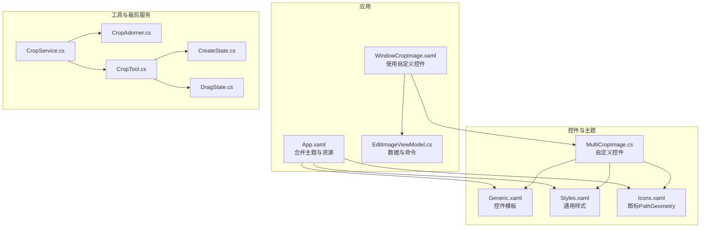
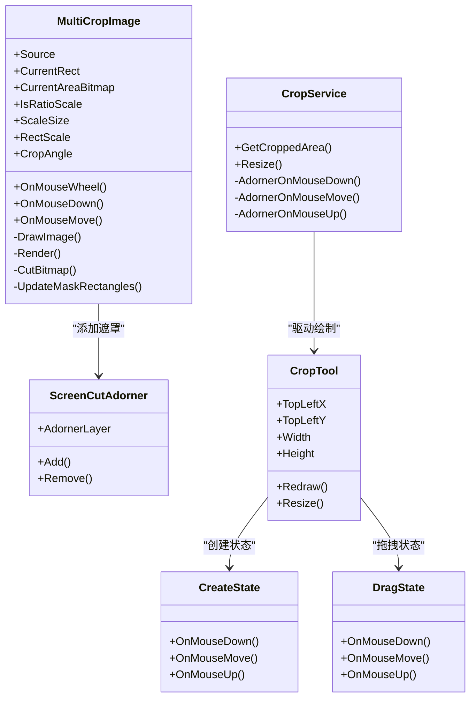
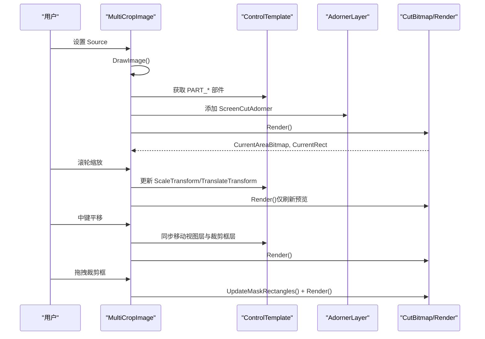
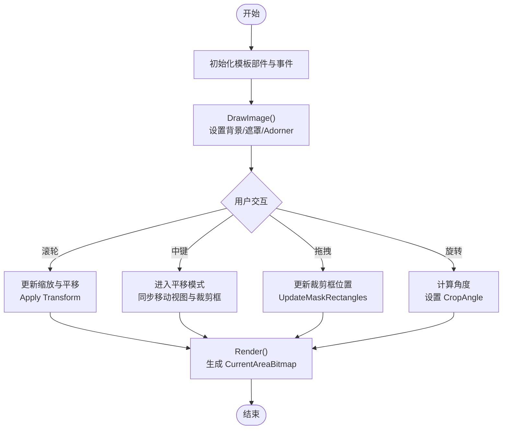
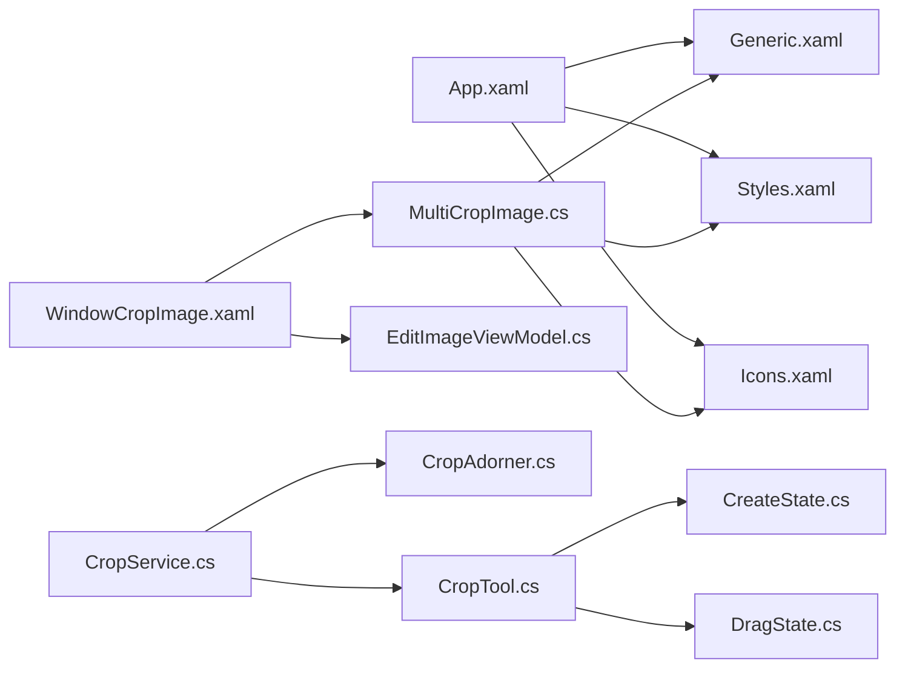

# 自定义控件

<cite>
**本文引用的文件**   
- [MultiCropImage.cs](file://ShaoLu/Controls/MultiCropImage.cs)
- [Generic.xaml](file://ShaoLu/Themes/Generic.xaml)
- [Styles.xaml](file://ShaoLu/Themes/Styles.xaml)
- [Icons.xaml](file://ShaoLu/Themes/Icons.xaml)
- [App.xaml](file://ShaoLu/App.xaml)
- [WindowCropImage.xaml](file://ShaoLu/Views/WindowCropImage.xaml)
- [EditImageViewModel.cs](file://ShaoLu/Viewmodels/EditImageViewModel.cs)
- [CropService.cs](file://ShaoLu/Tools/ImageEdit/Services/CropService.cs)
- [CropAdorner.cs](file://ShaoLu/Tools/ImageEdit/Services/CropAdorner.cs)
- [CropTool.cs](file://ShaoLu/Tools/ImageEdit/Services/Tools/CropTool.cs)
- [CreateState.cs](file://ShaoLu/Tools/ImageEdit/Services/State/CreateState.cs)
- [DragState.cs](file://ShaoLu/Tools/ImageEdit/Services/State/DragState.cs)
</cite>

## 目录
1. [简介](#简介)
2. [项目结构](#项目结构)
3. [核心组件](#核心组件)
4. [架构总览](#架构总览)
5. [详细组件分析](#详细组件分析)
6. [依赖关系分析](#依赖关系分析)
7. [性能考量](#性能考量)
8. [故障排查指南](#故障排查指南)
9. [结论](#结论)
10. [附录](#附录)

## 简介
本文件为 ShaoLu 项目的自定义控件开发文档，重点围绕 MultiCropImage 控件的实现原理、多点裁剪与旋转交互、事件处理机制，以及 WPF 自定义控件的开发模式（依赖属性、样式定制、主题系统、图标资源集成与样式继承）。同时给出可访问性、性能优化与测试的最佳实践建议，帮助开发者快速理解并扩展该控件。

## 项目结构
- 自定义控件位于 Controls 命名空间，模板与样式在 Themes 中集中管理，应用级资源在 App.xaml 合并加载。
- 视图层通过 WindowCropImage 展示控件用法；ViewModel 提供数据绑定与业务逻辑。
- Tools/ImageEdit 下包含一套基于 Adorner 的裁剪服务与状态机，用于辅助复杂裁剪场景。

图表来源
- [App.xaml:1-36](file://ShaoLu/App.xaml#L1-L36)
- [Generic.xaml:1-67](file://ShaoLu/Themes/Generic.xaml#L1-L67)
- [Styles.xaml:1-232](file://ShaoLu/Themes/Styles.xaml#L1-L232)
- [Icons.xaml:1-115](file://ShaoLu/Themes/Icons.xaml#L1-L115)
- [MultiCropImage.cs:1-714](file://ShaoLu/Controls/MultiCropImage.cs#L1-L714)
- [WindowCropImage.xaml:1-64](file://ShaoLu/Views/WindowCropImage.xaml#L1-L64)
- [EditImageViewModel.cs:1-243](file://ShaoLu/Viewmodels/EditImageViewModel.cs#L1-L243)
- [CropService.cs:1-190](file://ShaoLu/Tools/ImageEdit/Services/CropService.cs#L1-L190)
- [CropAdorner.cs:1-32](file://ShaoLu/Tools/ImageEdit/Services/CropAdorner.cs#L1-L32)
- [CropTool.cs:1-74](file://ShaoLu/Tools/ImageEdit/Services/Tools/CropTool.cs#L1-L74)
- [CreateState.cs:1-75](file://ShaoLu/Tools/ImageEdit/Services/State/CreateState.cs#L1-L75)
- [DragState.cs:1-77](file://ShaoLu/Tools/ImageEdit/Services/State/DragState.cs#L1-L77)

章节来源
- [App.xaml:1-36](file://ShaoLu/App.xaml#L1-L36)
- [Generic.xaml:1-67](file://ShaoLu/Themes/Generic.xaml#L1-L67)
- [Styles.xaml:1-232](file://ShaoLu/Themes/Styles.xaml#L1-L232)
- [Icons.xaml:1-115](file://ShaoLu/Themes/Icons.xaml#L1-L115)
- [MultiCropImage.cs:1-714](file://ShaoLu/Controls/MultiCropImage.cs#L1-L714)
- [WindowCropImage.xaml:1-64](file://ShaoLu/Views/WindowCropImage.xaml#L1-L64)
- [EditImageViewModel.cs:1-243](file://ShaoLu/Viewmodels/EditImageViewModel.cs#L1-L243)
- [CropService.cs:1-190](file://ShaoLu/Tools/ImageEdit/Services/CropService.cs#L1-L190)
- [CropAdorner.cs:1-32](file://ShaoLu/Tools/ImageEdit/Services/CropAdorner.cs#L1-L32)
- [CropTool.cs:1-74](file://ShaoLu/Tools/ImageEdit/Services/Tools/CropTool.cs#L1-L74)
- [CreateState.cs:1-75](file://ShaoLu/Tools/ImageEdit/Services/State/CreateState.cs#L1-L75)
- [DragState.cs:1-77](file://ShaoLu/Tools/ImageEdit/Services/State/DragState.cs#L1-L77)

## 核心组件
- MultiCropImage：WPF 自定义控件，支持图片缩放、平移、矩形裁剪框拖拽、比例锁定、旋转裁剪及实时预览输出。
- Generic.xaml：控件默认模板，定义视图变换层、遮罩四矩形、裁剪框与旋转手柄等视觉元素。
- Styles.xaml：通用按钮、复选框、单选按钮等样式，供图像工具界面复用。
- Icons.xaml：图标 PathGeometry 资源，统一风格与尺寸。
- CropService/CropAdorner/CropTool：基于 Adorner 的裁剪服务与状态机，负责创建、拖拽、遮罩与缩略图控制。

章节来源
- [MultiCropImage.cs:1-714](file://ShaoLu/Controls/MultiCropImage.cs#L1-L714)
- [Generic.xaml:1-67](file://ShaoLu/Themes/Generic.xaml#L1-L67)
- [Styles.xaml:1-232](file://ShaoLu/Themes/Styles.xaml#L1-L232)
- [Icons.xaml:1-115](file://ShaoLu/Themes/Icons.xaml#L1-L115)
- [CropService.cs:1-190](file://ShaoLu/Tools/ImageEdit/Services/CropService.cs#L1-L190)
- [CropAdorner.cs:1-32](file://ShaoLu/Tools/ImageEdit/Services/CropAdorner.cs#L1-L32)
- [CropTool.cs:1-74](file://ShaoLu/Tools/ImageEdit/Services/Tools/CropTool.cs#L1-L74)

## 架构总览
MultiCropImage 采用“视图变换层 + 遮罩层 + 裁剪框层”的分层渲染策略：
- 视图变换层：ScaleTransform + TranslateTransform 实现以鼠标为中心的缩放和平移。
- 遮罩层：四个 Rectangle 覆盖非裁剪区域，形成“挖空”效果。
- 裁剪框层：Border 承载裁剪区域，支持独立 RotateTransform 旋转；配合旋转手柄与复位按钮完成角度调整。
- 渲染输出：根据裁剪框位置与角度计算原图像素坐标，无旋转时使用 CroppedBitmap 高效裁剪，有旋转时通过 RenderTargetBitmap 合成输出。

图表来源
- [MultiCropImage.cs:1-714](file://ShaoLu/Controls/MultiCropImage.cs#L1-L714)
- [CropService.cs:1-190](file://ShaoLu/Tools/ImageEdit/Services/CropService.cs#L1-L190)
- [CropTool.cs:1-74](file://ShaoLu/Tools/ImageEdit/Services/Tools/CropTool.cs#L1-L74)
- [CreateState.cs:1-75](file://ShaoLu/Tools/ImageEdit/Services/State/CreateState.cs#L1-L75)
- [DragState.cs:1-77](file://ShaoLu/Tools/ImageEdit/Services/State/DragState.cs#L1-L77)

## 详细组件分析

### MultiCropImage 控件实现原理
- 依赖属性
  - Source：设置源图片，触发 DrawImage 重绘。
  - CurrentRect：当前裁剪矩形（屏幕坐标），随拖拽更新。
  - CurrentAreaBitmap：裁剪后的位图结果，供上层消费。
  - IsRatioScale：是否启用比例锁定，结合 ScaleSize 计算初始裁剪框大小。
  - ScaleSize：目标宽高比，仅在 IsRatioScale 生效。
  - RectScale：裁剪框相对原图的缩放比例。
  - CropAngle：裁剪框旋转角度，驱动 PART_RotateTransform。
- 模板部件
  - PART_CropCanvas：裁剪画布，承载 Border 与旋转手柄。
  - PART_RectangleLeft/Top/Right/Bottom：遮罩四矩形。
  - PART_Border：裁剪框容器，支持旋转。
  - PART_ScaleTransform/PART_TranslateTransform：视图变换。
  - PART_RotateHandle/PART_ResetRotationBtn：旋转交互。
- 事件处理
  - OnMouseWheel：以鼠标为中心缩放，更新 _viewScale 与 _viewTranslate。
  - OnMouseDown：中键切换全局平移模式，捕获鼠标。
  - OnMouseMove：平移模式下同步移动视图层与裁剪框层，调用 Render 刷新预览。
  - Border_MouseDown/Move/Up：裁剪框拖拽边界限制与位置更新。
  - InitializeRotationEvents：旋转手柄拖拽与复位按钮点击更新 CropAngle。
- 渲染流程
  - DrawImage：初始化背景、遮罩、Adorner 层，按 IsRatioScale 与 RectScale 计算边框尺寸与位置。
  - Render：计算裁剪框四角点（考虑旋转），逆变换到原图坐标，生成 CurrentAreaBitmap 与 CurrentRect。
  - CutBitmap：无旋转走 CroppedBitmap 路径，有旋转走 RenderTargetBitmap 合成路径。

图表来源
- [MultiCropImage.cs:1-714](file://ShaoLu/Controls/MultiCropImage.cs#L1-L714)
- [Generic.xaml:1-67](file://ShaoLu/Themes/Generic.xaml#L1-L67)

章节来源
- [MultiCropImage.cs:1-714](file://ShaoLu/Controls/MultiCropImage.cs#L1-L714)
- [Generic.xaml:1-67](file://ShaoLu/Themes/Generic.xaml#L1-L67)

### 多点裁剪与旋转交互
- 多点裁剪：通过四矩形遮罩与 Border 裁剪框组合，支持拖拽定位与边界约束。
- 旋转裁剪：PART_RotateHandle 计算角度并赋值给 CropAngle，驱动 PART_RotateTransform；Reset 按钮归零。
- 视图变换：ScaleTransform 与 TranslateTransform 分离视图与裁剪框，确保缩放以鼠标为中心，平移不影响裁剪框内部布局。

图表来源
- [MultiCropImage.cs:1-714](file://ShaoLu/Controls/MultiCropImage.cs#L1-L714)

章节来源
- [MultiCropImage.cs:1-714](file://ShaoLu/Controls/MultiCropImage.cs#L1-L714)

### WPF 自定义控件开发模式
- 依赖属性：在静态构造函数中注册，提供默认值与变更回调（如 IsRatioScale、RectScale、CropAngle）。
- 模板化：FrameworkElement.DefaultStyleKey 指定默认样式 Key，模板内使用 GetTemplateChild 获取部件。
- 样式定制：在 Generic.xaml 中定义 TargetType 样式，使用 DynamicResource 引用主题色与图标。
- 资源集成：Icons.xaml 提供 PathGeometry，Styles.xaml 提供通用控件样式，App.xaml 合并加载。

章节来源
- [MultiCropImage.cs:1-714](file://ShaoLu/Controls/MultiCropImage.cs#L1-L714)
- [Generic.xaml:1-67](file://ShaoLu/Themes/Generic.xaml#L1-L67)
- [Styles.xaml:1-232](file://ShaoLu/Themes/Styles.xaml#L1-L232)
- [Icons.xaml:1-115](file://ShaoLu/Themes/Icons.xaml#L1-L115)
- [App.xaml:1-36](file://ShaoLu/App.xaml#L1-L36)

### 主题系统与样式继承
- 主题合并：App.xaml 合并 WPFDevelopers Theme 与 Resources，确保控件外观一致。
- 样式继承：IconButton/IconCheckBox/RadioButton 等样式通过 BasedOn 继承基础样式，便于统一主题。
- 动态资源：PrimaryNormalSolidColorBrush 等颜色通过 ResourceDictionary 暴露，模板中使用 DynamicResource 获取。

章节来源
- [App.xaml:1-36](file://ShaoLu/App.xaml#L1-L36)
- [Styles.xaml:1-232](file://ShaoLu/Themes/Styles.xaml#L1-L232)
- [Generic.xaml:1-67](file://ShaoLu/Themes/Generic.xaml#L1-L67)

### 图标资源集成
- Icons.xaml 集中定义 PathGeometry，如关闭、缩放、旋转、裁剪、画笔等图标。
- 模板或样式通过 StaticResource 引用图标，保证矢量缩放与一致性。

章节来源
- [Icons.xaml:1-115](file://ShaoLu/Themes/Icons.xaml#L1-L115)

### 使用示例与数据绑定
- WindowCropImage 演示控件使用：绑定 IsRatioScale、RectScale、ScaleSize，并提供导入与保存按钮。
- EditImageViewModel 提供 ImgSrc/ImgDst、CropRect、OCRRect 等属性，封装保存与拇指标记逻辑。

章节来源
- [WindowCropImage.xaml:1-64](file://ShaoLu/Views/WindowCropImage.xaml#L1-L64)
- [EditImageViewModel.cs:1-243](file://ShaoLu/Viewmodels/EditImageViewModel.cs#L1-L243)

### 基于 Adorner 的裁剪服务与状态机
- CropService：管理 Adorner、Canvas、CropTool，响应鼠标事件并切换状态。
- CropAdorner：在 adornedElement 上叠加 Canvas，用于绘制遮罩与缩略图。
- CropTool：维护裁剪形状、遮罩、缩略图与文本工具，提供 Redraw/Resize。
- CreateState/DragState：实现创建与拖拽两种状态的鼠标行为与边界限制。

章节来源
- [CropService.cs:1-190](file://ShaoLu/Tools/ImageEdit/Services/CropService.cs#L1-L190)
- [CropAdorner.cs:1-32](file://ShaoLu/Tools/ImageEdit/Services/CropAdorner.cs#L1-L32)
- [CropTool.cs:1-74](file://ShaoLu/Tools/ImageEdit/Services/Tools/CropTool.cs#L1-L74)
- [CreateState.cs:1-75](file://ShaoLu/Tools/ImageEdit/Services/State/CreateState.cs#L1-L75)
- [DragState.cs:1-77](file://ShaoLu/Tools/ImageEdit/Services/State/DragState.cs#L1-L77)

## 依赖关系分析
- MultiCropImage 依赖 Generic.xaml 模板与 Styles.xaml 样式，引用 Icons.xaml 图标资源。
- WindowCropImage 依赖 MultiCropImage 控件与 EditImageViewModel 数据上下文。
- CropService 依赖 CropAdorner、CropTool 与状态类，构成独立的裁剪子系统。

图表来源
- [App.xaml:1-36](file://ShaoLu/App.xaml#L1-L36)
- [Generic.xaml:1-67](file://ShaoLu/Themes/Generic.xaml#L1-L67)
- [Styles.xaml:1-232](file://ShaoLu/Themes/Styles.xaml#L1-L232)
- [Icons.xaml:1-115](file://ShaoLu/Themes/Icons.xaml#L1-L115)
- [WindowCropImage.xaml:1-64](file://ShaoLu/Views/WindowCropImage.xaml#L1-L64)
- [MultiCropImage.cs:1-714](file://ShaoLu/Controls/MultiCropImage.cs#L1-L714)
- [EditImageViewModel.cs:1-243](file://ShaoLu/Viewmodels/EditImageViewModel.cs#L1-L243)
- [CropService.cs:1-190](file://ShaoLu/Tools/ImageEdit/Services/CropService.cs#L1-L190)
- [CropAdorner.cs:1-32](file://ShaoLu/Tools/ImageEdit/Services/CropAdorner.cs#L1-L32)
- [CropTool.cs:1-74](file://ShaoLu/Tools/ImageEdit/Services/Tools/CropTool.cs#L1-L74)
- [CreateState.cs:1-75](file://ShaoLu/Tools/ImageEdit/Services/State/CreateState.cs#L1-L75)
- [DragState.cs:1-77](file://ShaoLu/Tools/ImageEdit/Services/State/DragState.cs#L1-L77)

章节来源
- [App.xaml:1-36](file://ShaoLu/App.xaml#L1-L36)
- [Generic.xaml:1-67](file://ShaoLu/Themes/Generic.xaml#L1-L67)
- [Styles.xaml:1-232](file://ShaoLu/Themes/Styles.xaml#L1-L232)
- [Icons.xaml:1-115](file://ShaoLu/Themes/Icons.xaml#L1-L115)
- [WindowCropImage.xaml:1-64](file://ShaoLu/Views/WindowCropImage.xaml#L1-L64)
- [MultiCropImage.cs:1-714](file://ShaoLu/Controls/MultiCropImage.cs#L1-L714)
- [EditImageViewModel.cs:1-243](file://ShaoLu/Viewmodels/EditImageViewModel.cs#L1-L243)
- [CropService.cs:1-190](file://ShaoLu/Tools/ImageEdit/Services/CropService.cs#L1-L190)
- [CropAdorner.cs:1-32](file://ShaoLu/Tools/ImageEdit/Services/CropAdorner.cs#L1-L32)
- [CropTool.cs:1-74](file://ShaoLu/Tools/ImageEdit/Services/Tools/CropTool.cs#L1-L74)
- [CreateState.cs:1-75](file://ShaoLu/Tools/ImageEdit/Services/State/CreateState.cs#L1-L75)
- [DragState.cs:1-77](file://ShaoLu/Tools/ImageEdit/Services/State/DragState.cs#L1-L77)

## 性能考量
- 裁剪路径选择：无旋转时优先使用 CroppedBitmap，避免昂贵的合成操作；有旋转时使用 RenderTargetBitmap 合成，注意 DPI 与像素格式。
- 视图变换分离：缩放与平移作用于视图层，减少裁剪框重排与遮罩重算频率。
- 资源清理：Unloaded 时释放 Adorner、Background ImageBrush、CurrentAreaBitmap，必要时触发 GC 回收。
- 渲染节流：频繁拖拽时尽量批量更新，避免每帧重复创建位图。

章节来源
- [MultiCropImage.cs:1-714](file://ShaoLu/Controls/MultiCropImage.cs#L1-L714)

## 故障排查指南
- 模板部件为空：检查 OnApplyTemplate 是否正确获取 PART_* 部件，确认模板名称一致。
- 缩放异常：确认 ScaleTransform 与 TranslateTransform 的绑定与更新顺序，确保以鼠标为中心计算新缩放。
- 裁剪结果为空：检查 CutBitmap 中的坐标逆变换与边界裁剪逻辑，确保 w/h > 0。
- 内存泄漏：确保 Unloaded 时移除 Adorner、解绑事件、释放位图与 Brush。

章节来源
- [MultiCropImage.cs:1-714](file://ShaoLu/Controls/MultiCropImage.cs#L1-L714)

## 结论
MultiCropImage 通过分层渲染与状态化的事件处理，实现了高性能、可定制的图像裁剪与旋转功能。借助 WPF 的依赖属性与模板系统，开发者可以灵活扩展样式与交互。结合基于 Adorner 的裁剪服务，能够支撑更复杂的裁剪场景。遵循本文的性能与可访问性建议，可获得稳定且易用的用户体验。

## 附录
- 可访问性建议
  - 为交互元素（旋转手柄、复位按钮）提供 ToolTip 与键盘导航。
  - 确保对比度符合 WCAG 标准，遮罩透明度适中。
- 测试最佳实践
  - 单元测试：验证依赖属性变更回调与边界限制逻辑。
  - UI 自动化：模拟滚轮缩放、中键平移、拖拽与旋转，断言 CurrentAreaBitmap 与 CurrentRect 正确性。
  - 性能基准：测量不同图片尺寸与旋转角度下的渲染耗时。