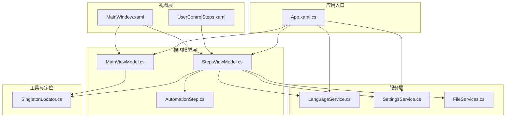
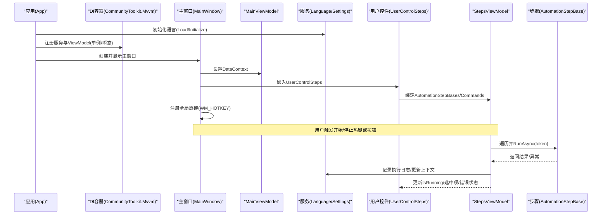
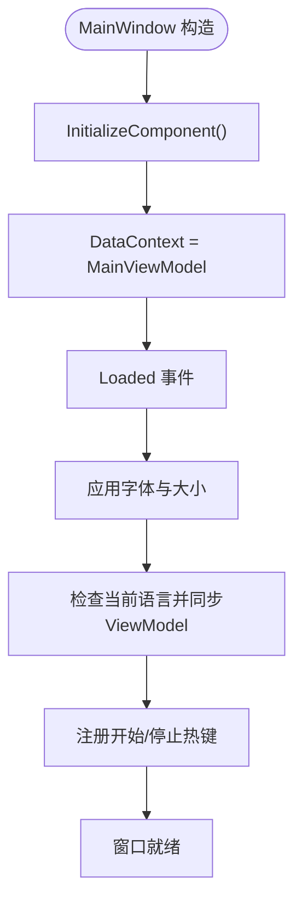
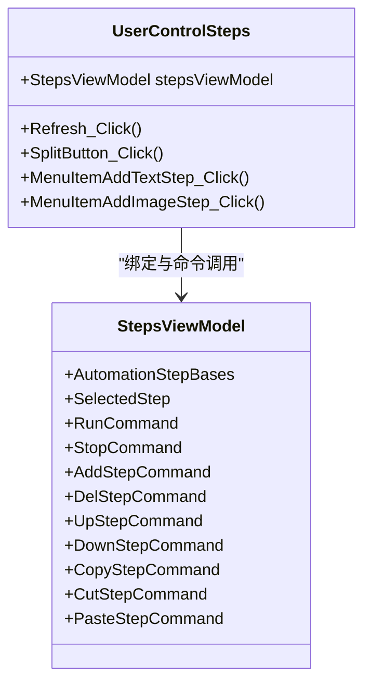
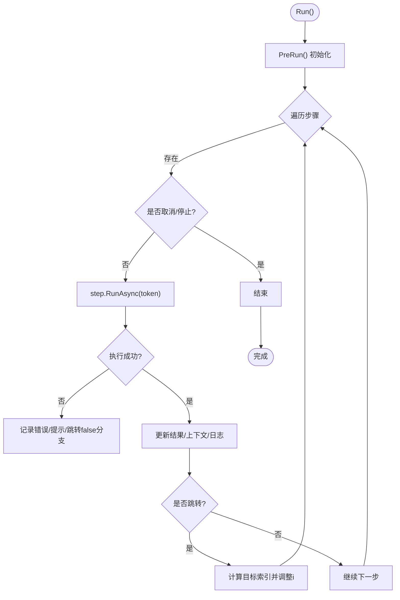
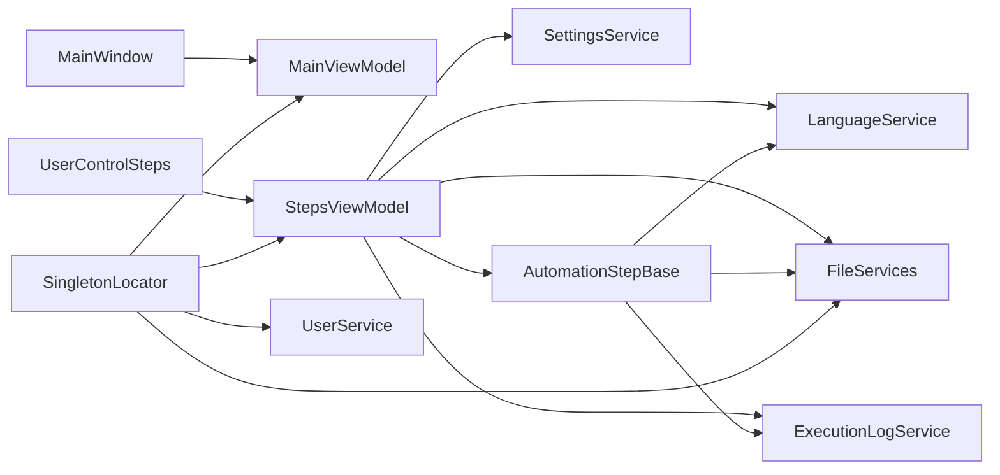

# WPF 架构设计

<cite>
**本文引用的文件**   
- [App.xaml.cs](file://ShaoLu/App.xaml.cs)
- [MainWindow.xaml](file://ShaoLu/MainWindow.xaml)
- [MainWindow.xaml.cs](file://ShaoLu/MainWindow.xaml.cs)
- [Views/UserControlSteps.xaml](file://ShaoLu/Views/UserControlSteps.xaml)
- [Views/UserControlSteps.xaml.cs](file://ShaoLu/Views/UserControlSteps.xaml.cs)
- [Viewmodels/MainViewModel.cs](file://ShaoLu/Viewmodels/MainViewModel.cs)
- [Viewmodels/StepsViewModel.cs](file://ShaoLu/Viewmodels/StepsViewModel.cs)
- [Viewmodels/AutomationStep.cs](file://ShaoLu/Viewmodels/AutomationStep.cs)
- [Utils/SingletonLocator.cs](file://ShaoLu/Utils/SingletonLocator.cs)
- [Services/LanguageService.cs](file://ShaoLu/Services/LanguageService.cs)
- [Services/SettingsService.cs](file://ShaoLu/Services/SettingsService.cs)
- [Models/Settings.cs](file://ShaoLu/Models/Settings.cs)
- [Services/FileServices.cs](file://ShaoLu/Services/FileServices.cs)
</cite>

## 目录
1. [简介](#简介)
2. [项目结构](#项目结构)
3. [核心组件](#核心组件)
4. [架构总览](#架构总览)
5. [详细组件分析](#详细组件分析)
6. [依赖关系分析](#依赖关系分析)
7. [性能与内存优化](#性能与内存优化)
8. [故障排查指南](#故障排查指南)
9. [结论](#结论)

## 简介
本文件面向 ShaoLu WPF 项目的架构设计与实现，重点阐述 MVVM 模式在 WPF 中的落地方式、主窗口布局与控件组织、用户控件 UserControlSteps 的实现与复用机制、XAML 与代码后台的分离原则和数据绑定机制、依赖注入（CommunityToolkit.Mvvm）的应用、应用程序生命周期与资源管理策略，以及界面性能优化、内存管理与异步操作的最佳实践。文档以仓库源码为依据，提供可视化图示与可追溯的来源标注，帮助读者快速理解并扩展系统。

## 项目结构
ShaoLu 采用典型的 WPF 分层与模块化组织：
- Views：UI 层，包含 Window 与 UserControl，负责展示与交互事件转发
- Viewmodels：MVVM 的 ViewModel 层，封装 UI 状态与命令，使用 CommunityToolkit.Mvvm 的 ObservableObject 与 RelayCommand
- Models：数据模型与配置（如 AppSettings）
- Services：业务服务（语言、设置、文件、执行日志等）
- Utils：通用工具（单例定位器、命令基类、自动化辅助等）
- Templates/Themes/Converters：模板、主题与转换器，支撑 XAML 的数据驱动渲染

图表来源 
- [MainWindow.xaml:1-49](file://ShaoLu/MainWindow.xaml#L1-L49)
- [Views/UserControlSteps.xaml:1-166](file://ShaoLu/Views/UserControlSteps.xaml#L1-L166)
- [Viewmodels/MainViewModel.cs:1-76](file://ShaoLu/Viewmodels/MainViewModel.cs#L1-L76)
- [Viewmodels/StepsViewModel.cs:1-588](file://ShaoLu/Viewmodels/StepsViewModel.cs#L1-L588)
- [Viewmodels/AutomationStep.cs:1-800](file://ShaoLu/Viewmodels/AutomationStep.cs#L1-L800)
- [Services/LanguageService.cs:1-67](file://ShaoLu/Services/LanguageService.cs#L1-L67)
- [Services/SettingsService.cs:1-38](file://ShaoLu/Services/SettingsService.cs#L1-L38)
- [Services/FileServices.cs:1-179](file://ShaoLu/Services/FileServices.cs#L1-L179)
- [Utils/SingletonLocator.cs:1-19](file://ShaoLu/Utils/SingletonLocator.cs#L1-L19)
- [App.xaml.cs:1-86](file://ShaoLu/App.xaml.cs#L1-L86)

章节来源
- [App.xaml.cs:18-65](file://ShaoLu/App.xaml.cs#L18-L65)
- [MainWindow.xaml:18-49](file://ShaoLu/MainWindow.xaml#L18-L49)
- [Views/UserControlSteps.xaml:1-166](file://ShaoLu/Views/UserControlSteps.xaml#L1-L166)

## 核心组件
- 应用启动与依赖注入：App.OnStartup 中初始化语言、注册 DI 容器（CommunityToolkit.Mvvm + Microsoft.Extensions.DependencyInjection），构建主窗口并显示；OnExit 清理资源与待删除文件。
- 主窗口 MainWindow：通过 DataContext 绑定 MainViewModel，处理菜单、热键、登录态、子窗口弹出等；Loaded 时应用字体与语言选择。
- 步骤视图 UserControlSteps：绑定 StepsViewModel，提供运行/停止、增删改查步骤、复制粘贴、条件跳转等能力；右侧详情面板通过 ContentTemplateSelector 动态渲染不同步骤类型。
- 步骤模型 AutomationStepBase 及派生类：统一抽象步骤属性、执行接口 RunAsync、克隆、错误处理、自引用限制、条件判断与日志记录。
- 服务与配置：LanguageService 管理本地化；SettingsService 持久化 AppSettings；FileServices 提供路径对话框、文本智能读取、延迟删除提交等。
- 单例定位器 SingletonLocator：基于 Ioc.Default 获取已注册的单例服务与 ViewModel，简化跨层访问。

章节来源
- [App.xaml.cs:18-86](file://ShaoLu/App.xaml.cs#L18-L86)
- [MainWindow.xaml.cs:1-316](file://ShaoLu/MainWindow.xaml.cs#L1-L316)
- [Views/UserControlSteps.xaml.cs:1-56](file://ShaoLu/Views/UserControlSteps.xaml.cs#L1-L56)
- [Viewmodels/StepsViewModel.cs:1-588](file://ShaoLu/Viewmodels/StepsViewModel.cs#L1-L588)
- [Viewmodels/AutomationStep.cs:1-800](file://ShaoLu/Viewmodels/AutomationStep.cs#L1-L800)
- [Services/LanguageService.cs:1-67](file://ShaoLu/Services/LanguageService.cs#L1-L67)
- [Services/SettingsService.cs:1-38](file://ShaoLu/Services/SettingsService.cs#L1-L38)
- [Services/FileServices.cs:1-179](file://ShaoLu/Services/FileServices.cs#L1-L179)
- [Utils/SingletonLocator.cs:1-19](file://ShaoLu/Utils/SingletonLocator.cs#L1-L19)

## 架构总览
下图展示了从应用启动到主窗口加载、再到步骤执行的典型调用链与数据流。

图表来源 
- [App.xaml.cs:18-65](file://ShaoLu/App.xaml.cs#L18-L65)
- [MainWindow.xaml.cs:32-74](file://ShaoLu/MainWindow.xaml.cs#L32-L74)
- [Views/UserControlSteps.xaml:1-166](file://ShaoLu/Views/UserControlSteps.xaml#L1-L166)
- [Viewmodels/StepsViewModel.cs:407-565](file://ShaoLu/Viewmodels/StepsViewModel.cs#L407-L565)
- [Viewmodels/AutomationStep.cs:25-205](file://ShaoLu/Viewmodels/AutomationStep.cs#L25-L205)

## 详细组件分析

### MVVM 分层与数据绑定
- Model：Settings 等纯数据模型，用于配置与持久化
- View：XAML 定义布局与样式，仅做事件转发与简单逻辑
- ViewModel：继承 ObservableObject，暴露属性与命令，使用 SetProperty 通知 UI 更新；通过 RelayCommand/RelayParameterCommand 绑定 UI 动作
- 数据绑定：DataContext 指向 ViewModel；XAML 中使用 {Binding}、{lex:Loc} 进行本地化；DataGrid 绑定集合与选中项；ContentControl 配合 TemplateSelector 动态渲染步骤详情

章节来源
- [Viewmodels/MainViewModel.cs:1-76](file://ShaoLu/Viewmodels/MainViewModel.cs#L1-L76)
- [Viewmodels/StepsViewModel.cs:1-130](file://ShaoLu/Viewmodels/StepsViewModel.cs#L1-L130)
- [Views/UserControlSteps.xaml:1-166](file://ShaoLu/Views/UserControlSteps.xaml#L1-L166)

### 主窗口 MainWindow 布局与控件组织
- 顶部 Menu：文件、编辑、执行日志、语言切换、关于、退出；部分菜单项根据 IsLoggedIn 启用
- 主体区域：嵌入 UserControlSteps，承载步骤列表与详情面板
- 行为：OnSourceInitialized 注册全局热键；Loaded 应用字体与语言；Click 事件打开设置、日志、用户管理等子窗口；EnsureLoggedIn 保证操作权限

图表来源 
- [MainWindow.xaml.cs:77-101](file://ShaoLu/MainWindow.xaml.cs#L77-L101)
- [MainWindow.xaml.cs:32-53](file://ShaoLu/MainWindow.xaml.cs#L32-L53)
- [MainWindow.xaml:18-49](file://ShaoLu/MainWindow.xaml#L18-L49)

章节来源
- [MainWindow.xaml.cs:1-316](file://ShaoLu/MainWindow.xaml.cs#L1-L316)
- [MainWindow.xaml:1-49](file://ShaoLu/MainWindow.xaml#L1-L49)

### 用户控件 UserControlSteps 实现与复用
- 职责：提供步骤的增删改查、排序、复制粘贴、选择、运行/停止；右侧详情面板根据 SelectedStep 动态渲染
- 复用机制：通过 DataTemplate/ContentTemplateSelector 将不同步骤类型映射到对应模板；ContextMenu 与 ToolBar 统一绑定 StepsViewModel 的命令
- 事件处理：SplitButton/MenuItem 点击后调用 AddStepCommand，参数为步骤类型字符串；Refresh 强制重绘

图表来源 
- [Views/UserControlSteps.xaml.cs:1-56](file://ShaoLu/Views/UserControlSteps.xaml.cs#L1-L56)
- [Views/UserControlSteps.xaml:1-166](file://ShaoLu/Views/UserControlSteps.xaml#L1-L166)
- [Viewmodels/StepsViewModel.cs:72-130](file://ShaoLu/Viewmodels/StepsViewModel.cs#L72-L130)

章节来源
- [Views/UserControlSteps.xaml.cs:1-56](file://ShaoLu/Views/UserControlSteps.xaml.cs#L1-L56)
- [Views/UserControlSteps.xaml:1-166](file://ShaoLu/Views/UserControlSteps.xaml#L1-L166)

### 步骤执行流程与异步控制
- 执行入口：StepsViewModel.Run() 异步执行，PreRun 重置状态、初始化引擎、清空上下文
- 循环执行：遍历 AutomationStepBases，调用 step.RunAsync(token)，捕获异常并推断错误类型，支持自定义条件判断与日志记录
- 取消与停止：StopSignal 与 CancellationToken 协同，支持中途停止；弹窗步骤 PopupStep 在取消时关闭 UI 并返回 false
- 跳转与自引用：TrueGoto/FalseGoto 控制流程跳转；SelfReferenceCount 与 SelfReferenceLimit 防止无限循环

图表来源 
- [Viewmodels/StepsViewModel.cs:407-565](file://ShaoLu/Viewmodels/StepsViewModel.cs#L407-L565)
- [Viewmodels/AutomationStep.cs:25-205](file://ShaoLu/Viewmodels/AutomationStep.cs#L25-L205)

章节来源
- [Viewmodels/StepsViewModel.cs:361-583](file://ShaoLu/Viewmodels/StepsViewModel.cs#L361-L583)
- [Viewmodels/AutomationStep.cs:25-205](file://ShaoLu/Viewmodels/AutomationStep.cs#L25-L205)

### 依赖注入与 CommunityToolkit.Mvvm 应用
- 容器注册：App.OnStartup 中 ServiceCollection 注册 MainViewModel、StepsViewModel、FileServices、IUserService 等；Ioc.Default.ConfigureServices 构建容器
- 单例定位：SingletonLocator 通过 Ioc.Default.GetRequiredService 获取服务与 ViewModel，避免硬编码耦合
- 命令与属性：ViewModel 使用 ObservableObject 与 RelayCommand/RelayParameterCommand，减少样板代码

章节来源
- [App.xaml.cs:32-47](file://ShaoLu/App.xaml.cs#L32-L47)
- [Utils/SingletonLocator.cs:1-19](file://ShaoLu/Utils/SingletonLocator.cs#L1-L19)
- [Viewmodels/StepsViewModel.cs:72-130](file://ShaoLu/Viewmodels/StepsViewModel.cs#L72-L130)

### 应用程序生命周期与资源管理
- 启动：初始化语言、注册 DI、清理过期日志、显示主窗口
- 退出：释放图像识别相关资源、提交待删除文件、记录日志
- 窗口关闭：移除 Hook、注销热键，防止资源泄漏

章节来源
- [App.xaml.cs:18-86](file://ShaoLu/App.xaml.cs#L18-L86)
- [MainWindow.xaml.cs:85-91](file://ShaoLu/MainWindow.xaml.cs#L85-L91)

## 依赖关系分析
- 视图与视图模型：MainWindow 绑定 MainViewModel；UserControlSteps 绑定 StepsViewModel
- 视图模型与服务：StepsViewModel 依赖 LanguageService、SettingsService、FileServices、ExecutionLogService（通过 SingletonLocator）
- 步骤模型与服务：各步骤类型在执行时调用 Autogui、FileServices、ExecutionLogService
- 单例定位器：集中提供对 MainViewModel、StepsViewModel、FileServices、UserService 的访问

图表来源 
- [MainWindow.xaml.cs:1-316](file://ShaoLu/MainWindow.xaml.cs#L1-L316)
- [Views/UserControlSteps.xaml.cs:1-56](file://ShaoLu/Views/UserControlSteps.xaml.cs#L1-L56)
- [Viewmodels/StepsViewModel.cs:1-588](file://ShaoLu/Viewmodels/StepsViewModel.cs#L1-L588)
- [Viewmodels/AutomationStep.cs:1-800](file://ShaoLu/Viewmodels/AutomationStep.cs#L1-L800)
- [Utils/SingletonLocator.cs:1-19](file://ShaoLu/Utils/SingletonLocator.cs#L1-L19)

章节来源
- [Viewmodels/StepsViewModel.cs:1-588](file://ShaoLu/Viewmodels/StepsViewModel.cs#L1-L588)
- [Viewmodels/AutomationStep.cs:1-800](file://ShaoLu/Viewmodels/AutomationStep.cs#L1-L800)
- [Utils/SingletonLocator.cs:1-19](file://ShaoLu/Utils/SingletonLocator.cs#L1-L19)

## 性能与内存优化
- 异步与取消：步骤执行使用 async/await 与 CancellationToken，避免阻塞 UI 线程；弹窗步骤支持取消时安全关闭
- 集合变更与通知：ObservableCollection 与 SetProperty 确保 UI 高效更新；集合变更事件中释放 IDisposable 对象
- 资源清理：App.OnExit 与窗口 OnClosed 中释放资源、注销热键、提交待删除文件，防止内存与句柄泄漏
- 输入校验：TextBox 预览输入与粘贴拦截，减少无效操作与异常
- 模板与转换器：使用 DataTemplate/TemplateSelector 按需渲染，降低不必要的 UI 树复杂度

章节来源
- [Viewmodels/StepsViewModel.cs:114-130](file://ShaoLu/Viewmodels/StepsViewModel.cs#L114-L130)
- [Viewmodels/StepsViewModel.cs:407-565](file://ShaoLu/Viewmodels/StepsViewModel.cs#L407-L565)
- [MainWindow.xaml.cs:104-134](file://ShaoLu/MainWindow.xaml.cs#L104-L134)
- [App.xaml.cs:66-86](file://ShaoLu/App.xaml.cs#L66-L86)

## 故障排查指南
- 步骤执行失败：查看 Step.IsError、ErrorMessage、ErrorType；确认 Timeout、WaitTime、相似度阈值等配置；检查文件路径与 OCR 内容
- 流程卡死或循环：检查 TrueGoto/FalseGoto 跳转逻辑与 SelfReferenceLimit；确认 StopSignal 与 CancellationToken 是否正确传播
- 语言与本地化：确认 LanguageService.Initialize 与 SetLanguage 调用；检查 current_language.txt 与 Resx 资源
- 设置加载失败：检查 settings.json 是否存在且格式正确；必要时回退默认配置
- 文件删除延迟：使用 FileServices.MarkForDeletion/UnmarkForDeletion/CommitPendingDeletions 管理临时文件，确保退出时清理

章节来源
- [Viewmodels/StepsViewModel.cs:487-512](file://ShaoLu/Viewmodels/StepsViewModel.cs#L487-L512)
- [Viewmodels/AutomationStep.cs:693-752](file://ShaoLu/Viewmodels/AutomationStep.cs#L693-L752)
- [Services/LanguageService.cs:15-40](file://ShaoLu/Services/LanguageService.cs#L15-L40)
- [Services/SettingsService.cs:20-38](file://ShaoLu/Services/SettingsService.cs#L20-L38)
- [Services/FileServices.cs:84-179](file://ShaoLu/Services/FileServices.cs#L84-L179)

## 结论
ShaoLu 通过清晰的 MVVM 分层、社区库支持的依赖注入与命令体系、完善的步骤模型与执行框架，实现了高内聚、低耦合的自动化流程编排与执行。主窗口与用户控件的职责边界明确，XAML 与代码后台分离良好，数据绑定与模板化渲染提升了可维护性与可扩展性。结合异步与取消机制、严格的资源清理策略，系统在性能与稳定性方面具备良好表现。未来可在测试覆盖、错误恢复与并发控制方面进一步演进。