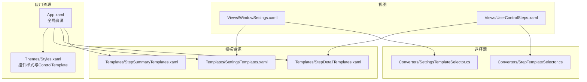
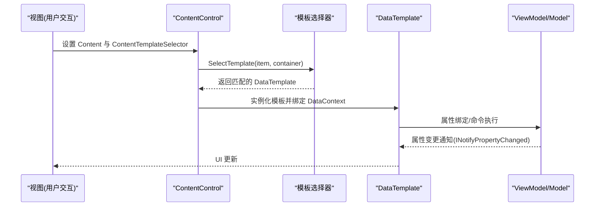
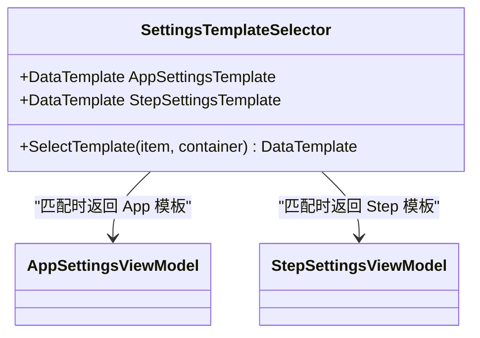
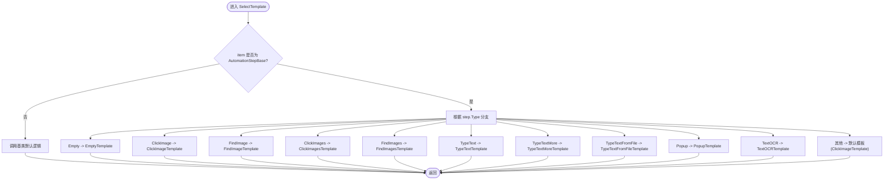
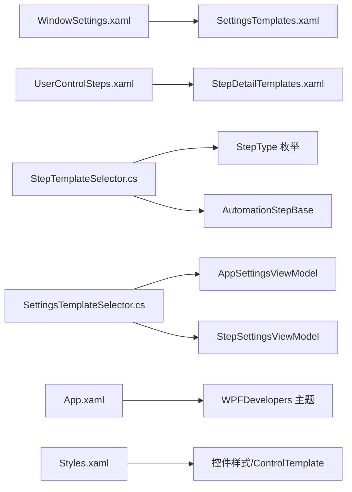

# XAML 模板系统

<cite>
**本文引用的文件**   
- [SettingsTemplateSelector.cs](file://ShaoLu/Converters/SettingsTemplateSelector.cs)
- [StepTemplateSelector.cs](file://ShaoLu/Converters/StepTemplateSelector.cs)
- [SettingsTemplates.xaml](file://ShaoLu/Templates/SettingsTemplates.xaml)
- [StepDetailTemplates.xaml](file://ShaoLu/Templates/StepDetailTemplates.xaml)
- [StepSummaryTemplates.xaml](file://ShaoLu/Templates/StepSummaryTemplates.xaml)
- [AutomationStepModel.cs](file://ShaoLu/Models/AutomationStepModel.cs)
- [AutomationStep.cs](file://ShaoLu/Viewmodels/AutomationStep.cs)
- [Settings.cs](file://ShaoLu/Models/Settings.cs)
- [SettingsViewModel.cs](file://ShaoLu/Viewmodels/SettingsViewModel.cs)
- [UserControlSteps.xaml](file://ShaoLu/Views/UserControlSteps.xaml)
- [WindowSettings.xaml](file://ShaoLu/Views/WindowSettings.xaml)
- [App.xaml](file://ShaoLu/App.xaml)
- [Styles.xaml](file://ShaoLu/Themes/Styles.xaml)
</cite>

## 目录
1. [简介](#简介)
2. [项目结构](#项目结构)
3. [核心组件](#核心组件)
4. [架构总览](#架构总览)
5. [详细组件分析](#详细组件分析)
6. [依赖关系分析](#依赖关系分析)
7. [性能考虑](#性能考虑)
8. [故障排查指南](#故障排查指南)
9. [结论](#结论)
10. [附录](#附录)

## 简介
本文件系统化梳理 ShaoLu 的 XAML 模板体系，重点说明动态 UI 生成机制与 DataTemplate、ControlTemplate 的使用方式；深入解析模板选择器 TemplateSelector（SettingsTemplateSelector、StepTemplateSelector）的工作原理；解释三类模板的职责与使用场景：SettingsTemplates（设置界面）、StepDetailTemplates（步骤详情编辑）、StepSummaryTemplates（步骤摘要展示）。同时覆盖数据绑定、样式定制、响应式布局、性能优化与缓存策略、调试技巧与常见问题，并提供模板开发示例与设计模式建议。

## 项目结构
ShaoLu 将模板资源按用途拆分到独立 XAML 文件中，并通过 ResourceDictionary 在视图层按需合并加载：
- SettingsTemplates.xaml：定义 App 与 Step 两类设置的 DataTemplate，配合 SettingsTemplateSelector 实现动态渲染。
- StepDetailTemplates.xaml：为多种自动化步骤类型提供详细的编辑面板，包含条件判断通用面板、图像识别、文本输入、弹窗、OCR 等。
- StepSummaryTemplates.xaml：为列表或摘要视图提供精简的数据模板。
- Converters 下的两个 Selector：根据数据类型或枚举值返回对应模板。
- View 层通过 ContentControl + ContentTemplateSelector 或 ItemsControl/DataGrid 的 ItemTemplate 使用模板。

图表来源 
- [App.xaml:1-36](file://ShaoLu/App.xaml#L1-L36)
- [Styles.xaml:1-232](file://ShaoLu/Themes/Styles.xaml#L1-L232)
- [SettingsTemplates.xaml:1-143](file://ShaoLu/Templates/SettingsTemplates.xaml#L1-L143)
- [StepDetailTemplates.xaml:1-608](file://ShaoLu/Templates/StepDetailTemplates.xaml#L1-L608)
- [StepSummaryTemplates.xaml:1-55](file://ShaoLu/Templates/StepSummaryTemplates.xaml#L1-L55)
- [SettingsTemplateSelector.cs:1-26](file://ShaoLu/Converters/SettingsTemplateSelector.cs#L1-L26)
- [StepTemplateSelector.cs:1-44](file://ShaoLu/Converters/StepTemplateSelector.cs#L1-L44)
- [WindowSettings.xaml:1-67](file://ShaoLu/Views/WindowSettings.xaml#L1-L67)
- [UserControlSteps.xaml:1-166](file://ShaoLu/Views/UserControlSteps.xaml#L1-L166)

章节来源
- [App.xaml:1-36](file://ShaoLu/App.xaml#L1-L36)
- [Styles.xaml:1-232](file://ShaoLu/Themes/Styles.xaml#L1-L232)
- [SettingsTemplates.xaml:1-143](file://ShaoLu/Templates/SettingsTemplates.xaml#L1-L143)
- [StepDetailTemplates.xaml:1-608](file://ShaoLu/Templates/StepDetailTemplates.xaml#L1-L608)
- [StepSummaryTemplates.xaml:1-55](file://ShaoLu/Templates/StepSummaryTemplates.xaml#L1-L55)
- [SettingsTemplateSelector.cs:1-26](file://ShaoLu/Converters/SettingsTemplateSelector.cs#L1-L26)
- [StepTemplateSelector.cs:1-44](file://ShaoLu/Converters/StepTemplateSelector.cs#L1-L44)
- [WindowSettings.xaml:1-67](file://ShaoLu/Views/WindowSettings.xaml#L1-L67)
- [UserControlSteps.xaml:1-166](file://ShaoLu/Views/UserControlSteps.xaml#L1-L166)

## 核心组件
- 模板选择器
  - SettingsTemplateSelector：根据当前 ViewModel 的类型（AppSettingsViewModel 或 StepSettingsViewModel）返回对应的设置模板。
  - StepTemplateSelector：基于 AutomationStepBase.Type（StepType 枚举）返回不同的步骤详情模板。
- 模板资源
  - SettingsTemplates.xaml：为 App 与 Step 设置提供 DataTemplate，并绑定到相应 ViewModel 的属性。
  - StepDetailTemplates.xaml：为每种步骤类型提供编辑面板，包含通用条件面板、参数输入、命令按钮等。
  - StepSummaryTemplates.xaml：为列表项提供简洁的数据展示模板。
- 视图集成
  - WindowSettings.xaml：通过 ContentControl + 合并资源字典 + 选择器，动态渲染设置面板。
  - UserControlSteps.xaml：通过 DataGrid 展示步骤列表，右侧 ContentControl 使用 StepTemplateSelector 渲染选中步骤的详情。

章节来源
- [SettingsTemplateSelector.cs:1-26](file://ShaoLu/Converters/SettingsTemplateSelector.cs#L1-L26)
- [StepTemplateSelector.cs:1-44](file://ShaoLu/Converters/StepTemplateSelector.cs#L1-L44)
- [SettingsTemplates.xaml:1-143](file://ShaoLu/Templates/SettingsTemplates.xaml#L1-L143)
- [StepDetailTemplates.xaml:1-608](file://ShaoLu/Templates/StepDetailTemplates.xaml#L1-L608)
- [StepSummaryTemplates.xaml:1-55](file://ShaoLu/Templates/StepSummaryTemplates.xaml#L1-L55)
- [WindowSettings.xaml:1-67](file://ShaoLu/Views/WindowSettings.xaml#L1-L67)
- [UserControlSteps.xaml:1-166](file://ShaoLu/Views/UserControlSteps.xaml#L1-L166)

## 架构总览
下图展示了从视图到模板选择器再到具体模板的调用链，以及数据模型与 ViewModel 的绑定关系。

图表来源 
- [UserControlSteps.xaml:138-152](file://ShaoLu/Views/UserControlSteps.xaml#L138-L152)
- [StepTemplateSelector.cs:21-41](file://ShaoLu/Converters/StepTemplateSelector.cs#L21-L41)
- [StepDetailTemplates.xaml:598-608](file://ShaoLu/Templates/StepDetailTemplates.xaml#L598-L608)

章节来源
- [UserControlSteps.xaml:138-152](file://ShaoLu/Views/UserControlSteps.xaml#L138-L152)
- [StepTemplateSelector.cs:21-41](file://ShaoLu/Converters/StepTemplateSelector.cs#L21-L41)
- [StepDetailTemplates.xaml:598-608](file://ShaoLu/Templates/StepDetailTemplates.xaml#L598-L608)

## 详细组件分析

### 模板选择器：SettingsTemplateSelector
- 作用：根据当前绑定的对象类型返回 App 或 Step 的设置模板。
- 关键点：
  - 暴露 AppSettingsTemplate 与 StepSettingsTemplate 两个 DataTemplate 属性。
  - 在 SelectTemplate 中通过类型判断返回对应模板。
- 使用位置：WindowSettings.xaml 的 ContentControl 资源中合并了 SettingsTemplates.xaml，并通过选择器动态渲染。

图表来源 
- [SettingsTemplateSelector.cs:1-26](file://ShaoLu/Converters/SettingsTemplateSelector.cs#L1-L26)
- [SettingsTemplates.xaml:10-68](file://ShaoLu/Templates/SettingsTemplates.xaml#L10-L68)
- [SettingsTemplates.xaml:71-141](file://ShaoLu/Templates/SettingsTemplates.xaml#L71-L141)
- [WindowSettings.xaml:45-55](file://ShaoLu/Views/WindowSettings.xaml#L45-L55)

章节来源
- [SettingsTemplateSelector.cs:1-26](file://ShaoLu/Converters/SettingsTemplateSelector.cs#L1-L26)
- [SettingsTemplates.xaml:10-68](file://ShaoLu/Templates/SettingsTemplates.xaml#L10-L68)
- [SettingsTemplates.xaml:71-141](file://ShaoLu/Templates/SettingsTemplates.xaml#L71-L141)
- [WindowSettings.xaml:45-55](file://ShaoLu/Views/WindowSettings.xaml#L45-L55)

### 模板选择器：StepTemplateSelector
- 作用：根据 AutomationStepBase.Type（StepType 枚举）返回对应的步骤详情模板。
- 关键点：
  - 暴露多个 DataTemplate 属性（如 ClickImageTemplate、TypeTextTemplate、PopupTemplate 等）。
  - 使用 switch 表达式映射 StepType 到模板。
- 使用位置：UserControlSteps.xaml 的右侧详情区域通过 ContentControl 绑定 SelectedStep，并使用 StepDetailSelector。

图表来源 
- [StepTemplateSelector.cs:21-41](file://ShaoLu/Converters/StepTemplateSelector.cs#L21-L41)
- [AutomationStepModel.cs:9-22](file://ShaoLu/Models/AutomationStepModel.cs#L9-L22)
- [StepDetailTemplates.xaml:598-608](file://ShaoLu/Templates/StepDetailTemplates.xaml#L598-L608)
- [UserControlSteps.xaml:143-144](file://ShaoLu/Views/UserControlSteps.xaml#L143-L144)

章节来源
- [StepTemplateSelector.cs:21-41](file://ShaoLu/Converters/StepTemplateSelector.cs#L21-L41)
- [AutomationStepModel.cs:9-22](file://ShaoLu/Models/AutomationStepModel.cs#L9-L22)
- [StepDetailTemplates.xaml:598-608](file://ShaoLu/Templates/StepDetailTemplates.xaml#L598-L608)
- [UserControlSteps.xaml:143-144](file://ShaoLu/Views/UserControlSteps.xaml#L143-L144)

### 模板资源：SettingsTemplates（设置界面）
- 内容：
  - AppSettingsViewModel 模板：主题切换、字体选择、日志保留天数等。
  - StepSettingsViewModel 模板：错误弹窗、运行最小化、确认运行、默认阈值/等待/超时/点击次数等。
- 数据绑定：
  - 使用 TwoWay 绑定与 UpdateSourceTrigger=PropertyChanged/LostFocus 控制更新时机。
  - 使用 WPFDevelopers 的 NumericBox 进行数值输入。
- 国际化：
  - 通过 lex:Loc 获取本地化字符串。

章节来源
- [SettingsTemplates.xaml:10-68](file://ShaoLu/Templates/SettingsTemplates.xaml#L10-L68)
- [SettingsTemplates.xaml:71-141](file://ShaoLu/Templates/SettingsTemplates.xaml#L71-L141)
- [SettingsViewModel.cs:33-81](file://ShaoLu/Viewmodels/SettingsViewModel.cs#L33-L81)
- [SettingsViewModel.cs:84-137](file://ShaoLu/Viewmodels/SettingsViewModel.cs#L84-L137)

### 模板资源：StepDetailTemplates（步骤详情）
- 通用条件面板：
  - 支持“默认/自定义”模式切换，自定义模式下可添加多条条件规则（变量、运算符、值、连接符）。
  - 使用 Converter 将枚举转换为显示文本，Visibility 转换器控制条件面板显隐。
- 各步骤模板：
  - 图像识别（单击/查找/多图）：相似度阈值滑块与数值框联动、点击次数/间隔、等待/超时、可选 OCR 区域。
  - 文本输入（单行/多段/文件）：前缀/中缀/后缀拼接预览、延迟、文件内容列表（虚拟化）。
  - 弹窗：标题、文本、字体颜色、类型图标、按钮集合。
  - OCR：选择区域、测试预览、等待时间。
- 模板选择器注册：
  - 在资源字典末尾声明 StepDetailSelector，并将各模板注入。

章节来源
- [StepDetailTemplates.xaml:16-113](file://ShaoLu/Templates/StepDetailTemplates.xaml#L16-L113)
- [StepDetailTemplates.xaml:116-175](file://ShaoLu/Templates/StepDetailTemplates.xaml#L116-L175)
- [StepDetailTemplates.xaml:177-234](file://ShaoLu/Templates/StepDetailTemplates.xaml#L177-L234)
- [StepDetailTemplates.xaml:237-299](file://ShaoLu/Templates/StepDetailTemplates.xaml#L237-L299)
- [StepDetailTemplates.xaml:301-361](file://ShaoLu/Templates/StepDetailTemplates.xaml#L301-L361)
- [StepDetailTemplates.xaml:364-381](file://ShaoLu/Templates/StepDetailTemplates.xaml#L364-L381)
- [StepDetailTemplates.xaml:383-427](file://ShaoLu/Templates/StepDetailTemplates.xaml#L383-L427)
- [StepDetailTemplates.xaml:429-468](file://ShaoLu/Templates/StepDetailTemplates.xaml#L429-L468)
- [StepDetailTemplates.xaml:470-570](file://ShaoLu/Templates/StepDetailTemplates.xaml#L470-L570)
- [StepDetailTemplates.xaml:572-596](file://ShaoLu/Templates/StepDetailTemplates.xaml#L572-L596)
- [StepDetailTemplates.xaml:598-608](file://ShaoLu/Templates/StepDetailTemplates.xaml#L598-L608)

### 模板资源：StepSummaryTemplates（步骤摘要）
- 内容：
  - ImageStepSummaryTemplate：展示步骤 ID、名称、描述。
  - TextStepSummaryTemplate：展示输入内容与键间隔。
- 模板选择器：
  - StepSummarySelector 仅包含图像与文本两类模板，用于列表摘要视图。

章节来源
- [StepSummaryTemplates.xaml:19-36](file://ShaoLu/Templates/StepSummaryTemplates.xaml#L19-L36)
- [StepSummaryTemplates.xaml:39-50](file://ShaoLu/Templates/StepSummaryTemplates.xaml#L39-L50)
- [StepSummaryTemplates.xaml:52-55](file://ShaoLu/Templates/StepSummaryTemplates.xaml#L52-L55)

### 数据模型与 ViewModel
- 步骤基类与类型：
  - AutomationStepBase：抽象基类，包含通用属性（名称、描述、类型、等待时间、错误信息、条件判断、日志开关等），以及 RunAsync 执行接口。
  - StepType 枚举：定义所有步骤类型（图像、文本、OCR、弹窗等）。
- 具体步骤实现：
  - TypeTextStep、TypeTextMoreStep、TypeTextFromFileStep、PopupStep 等，各自实现业务逻辑与 UI 所需属性。
- 设置相关：
  - AppSettingsModel、StepSettingsModel 定义应用与步骤级默认配置。
  - SettingsViewModel 负责构建设置树、保存回写与应用窗口设置。

章节来源
- [AutomationStep.cs:25-205](file://ShaoLu/Viewmodels/AutomationStep.cs#L25-L205)
- [AutomationStepModel.cs:9-22](file://ShaoLu/Models/AutomationStepModel.cs#L9-L22)
- [Settings.cs:7-33](file://ShaoLu/Models/Settings.cs#L7-L33)
- [Settings.cs:34-68](file://ShaoLu/Models/Settings.cs#L34-L68)
- [SettingsViewModel.cs:140-217](file://ShaoLu/Viewmodels/SettingsViewModel.cs#L140-L217)

## 依赖关系分析
- 视图对模板资源的引用：
  - WindowSettings.xaml 合并 SettingsTemplates.xaml。
  - UserControlSteps.xaml 合并 StepDetailTemplates.xaml。
- 模板选择器对模型/枚举的依赖：
  - StepTemplateSelector 依赖 StepType 枚举与 AutomationStepBase。
  - SettingsTemplateSelector 依赖 AppSettingsViewModel 与 StepSettingsViewModel。
- 样式与主题：
  - App.xaml 合并第三方主题资源。
  - Styles.xaml 定义控件样式与 ControlTemplate（如按钮、复选框、单选按钮等）。

图表来源 
- [WindowSettings.xaml:45-55](file://ShaoLu/Views/WindowSettings.xaml#L45-L55)
- [UserControlSteps.xaml:47-51](file://ShaoLu/Views/UserControlSteps.xaml#L47-L51)
- [StepTemplateSelector.cs:21-41](file://ShaoLu/Converters/StepTemplateSelector.cs#L21-L41)
- [AutomationStepModel.cs:9-22](file://ShaoLu/Models/AutomationStepModel.cs#L9-L22)
- [SettingsTemplateSelector.cs:12-23](file://ShaoLu/Converters/SettingsTemplateSelector.cs#L12-L23)
- [App.xaml:10-27](file://ShaoLu/App.xaml#L10-L27)
- [Styles.xaml:1-232](file://ShaoLu/Themes/Styles.xaml#L1-L232)

章节来源
- [WindowSettings.xaml:45-55](file://ShaoLu/Views/WindowSettings.xaml#L45-L55)
- [UserControlSteps.xaml:47-51](file://ShaoLu/Views/UserControlSteps.xaml#L47-L51)
- [StepTemplateSelector.cs:21-41](file://ShaoLu/Converters/StepTemplateSelector.cs#L21-L41)
- [AutomationStepModel.cs:9-22](file://ShaoLu/Models/AutomationStepModel.cs#L9-L22)
- [SettingsTemplateSelector.cs:12-23](file://ShaoLu/Converters/SettingsTemplateSelector.cs#L12-L23)
- [App.xaml:10-27](file://ShaoLu/App.xaml#L10-L27)
- [Styles.xaml:1-232](file://ShaoLu/Themes/Styles.xaml#L1-L232)

## 性能考虑
- 虚拟化与回收：
  - 大量条目时使用 VirtualizingStackPanel 与 Recycling 模式，减少 UI 元素创建开销（参见文件内容列表模板）。
- 绑定更新策略：
  - 合理选择 UpdateSourceTrigger（PropertyChanged/LostFocus），避免频繁更新导致重绘。
- 模板复用：
  - 将常用 UI 片段封装为 DataTemplate 或 ControlTemplate，通过 StaticResource 引用，减少重复实例化。
- 资源合并范围：
  - 仅在需要的视图中合并资源字典，避免全局加载过多模板。
- 异步与取消：
  - 长耗时操作使用 Task 与 CancellationToken，避免阻塞 UI 线程（参考弹窗步骤的异步处理）。

[本节为通用指导，不直接分析具体文件]

## 故障排查指南
- 模板未生效
  - 检查是否已合并对应资源字典。
  - 确认 ContentTemplateSelector 是否正确赋值。
  - 验证 SelectTemplate 中的类型或枚举分支是否覆盖实际数据。
- 绑定无更新
  - 确保 ViewModel 实现了 INotifyPropertyChanged（CommunityToolkit.Mvvm 的 ObservableObject）。
  - 检查 UpdateSourceTrigger 是否符合预期。
- 条件面板不显示
  - 检查 Visibility 转换器与 ConditionMode 的值。
- 列表项卡顿
  - 启用虚拟化与回收，避免复杂模板在大量项中渲染。
- 弹窗无法关闭
  - 检查异步任务与取消令牌是否正确注册与释放。

章节来源
- [StepDetailTemplates.xaml:16-113](file://ShaoLu/Templates/StepDetailTemplates.xaml#L16-L113)
- [AutomationStep.cs:693-752](file://ShaoLu/Viewmodels/AutomationStep.cs#L693-L752)
- [UserControlSteps.xaml:143-152](file://ShaoLu/Views/UserControlSteps.xaml#L143-L152)

## 结论
ShaoLu 的 XAML 模板系统以 DataTemplate 为核心，结合 TemplateSelector 实现高度可扩展的动态 UI 生成。通过清晰的职责划分（设置模板、详情模板、摘要模板）与良好的资源组织，既保证了 UI 的可维护性，又提升了扩展性与性能。建议在新增步骤类型时，遵循现有模式：扩展枚举、实现 ViewModel、编写模板并在选择器中注册，同时利用虚拟化与合适的绑定策略保障性能。

[本节为总结，不直接分析具体文件]

## 附录
- 模板开发示例与建议
  - 新增步骤类型：
    - 在 StepType 枚举中添加新值。
    - 在 AutomationStepBase 派生类中实现业务逻辑与 UI 所需属性。
    - 在 StepDetailTemplates.xaml 中定义 DataTemplate，并在 StepDetailSelector 中注册。
    - 在 UserControlSteps.xaml 的菜单或工具栏中添加“新增步骤”入口。
  - 设置项扩展：
    - 在 AppSettingsModel/StepSettingsModel 中添加属性。
    - 在 SettingsTemplates.xaml 中增加对应控件与绑定。
    - 在 SettingsViewModel 中完成 ApplyTo 回写与窗口设置应用。
  - 样式定制：
    - 在 Styles.xaml 中定义或修改 ControlTemplate 与 Style，统一外观与交互效果。
  - 响应式设计：
    - 使用 Grid 与自适应列宽，结合 Slider/NumericUpDown 组合提升易用性。
  - 调试技巧：
    - 使用 Visual Studio 的 Live Visual Tree 与 XAML 诊断。
    - 在 SelectTemplate 中加断点，确认返回模板是否符合预期。
    - 通过 ToolTip 与临时 TextBlock 输出中间状态，辅助定位绑定问题。

[本节为概念性内容，不直接分析具体文件]