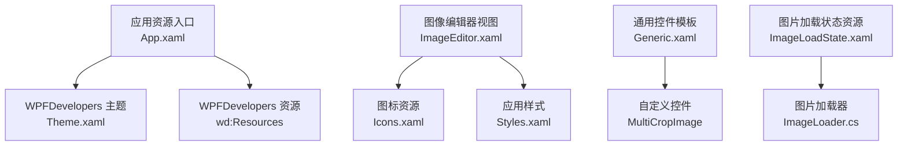
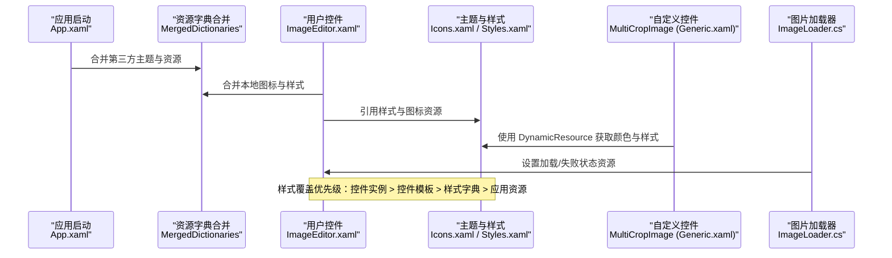
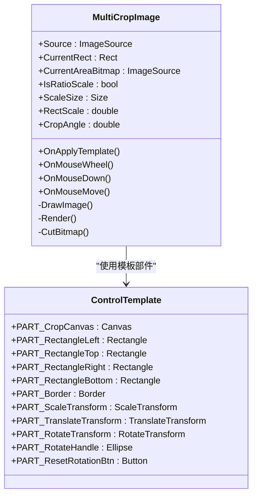
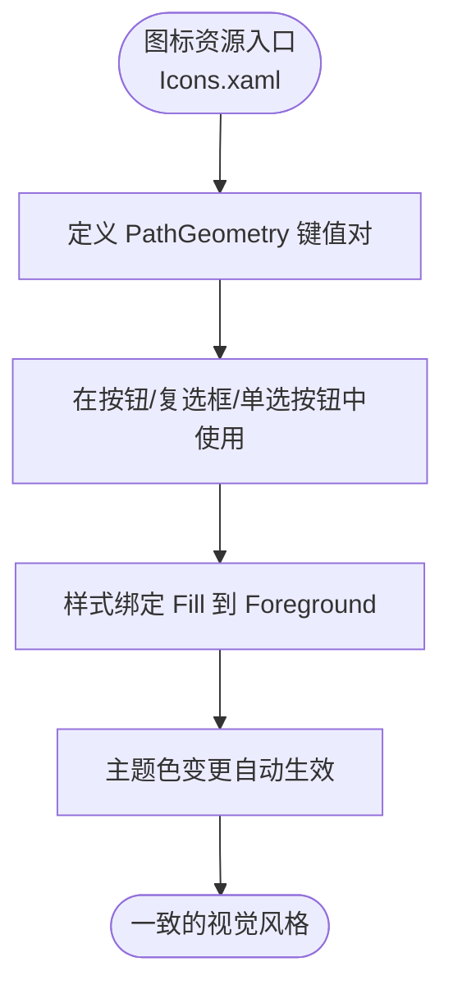
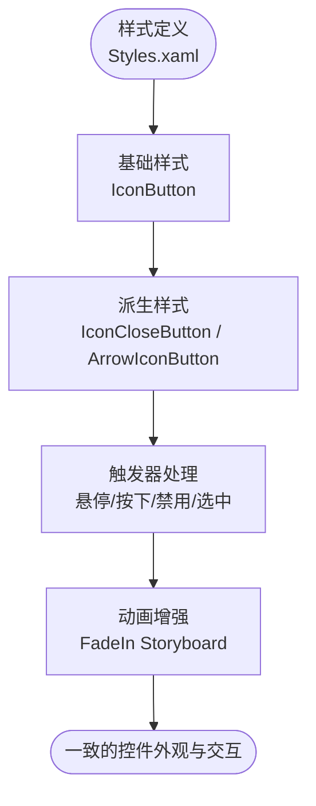
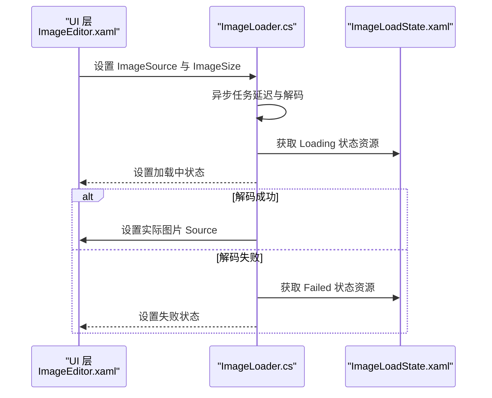
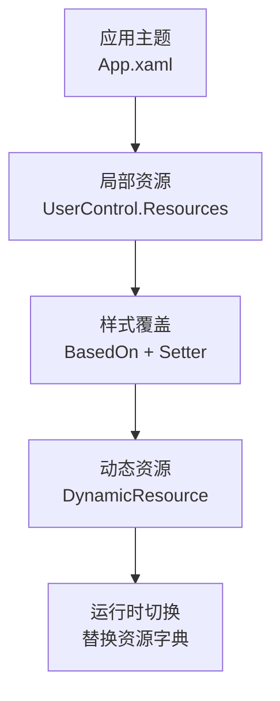
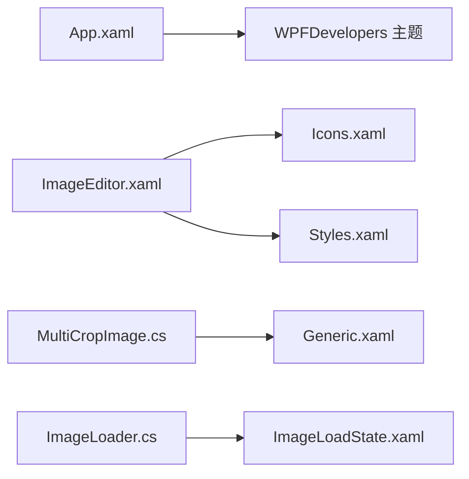

# 主题与样式系统

<cite>
**本文引用的文件**   
- [App.xaml](file://ShaoLu/App.xaml)
- [Generic.xaml](file://ShaoLu/Themes/Generic.xaml)
- [Icons.xaml](file://ShaoLu/Themes/Icons.xaml)
- [Styles.xaml](file://ShaoLu/Themes/Styles.xaml)
- [ImageLoadState.xaml](file://ShaoLu/Resources/ImageLoadState.xaml)
- [MultiCropImage.cs](file://ShaoLu/Controls/MultiCropImage.cs)
- [ImageEditor.xaml](file://ShaoLu/Tools/ImageEdit/ImageEditor.xaml)
- [ImageLoader.cs](file://ShaoLu/Tools/ImageEdit/ImageLoader.cs)
- [Loading.xaml](file://ShaoLu/Tools/ImageEdit/Controls/Loading.xaml)
- [WindowCropImage.xaml](file://ShaoLu/Views/WindowCropImage.xaml)
</cite>

## 目录
1. [简介](#简介)
2. [项目结构](#项目结构)
3. [核心组件](#核心组件)
4. [架构总览](#架构总览)
5. [详细组件分析](#详细组件分析)
6. [依赖关系分析](#依赖关系分析)
7. [性能考量](#性能考量)
8. [故障排查指南](#故障排查指南)
9. [结论](#结论)
10. [附录](#附录)

## 简介
本文件系统性阐述 ShaoLu 的 WPF 主题与样式体系，覆盖 Style、Trigger、ResourceDictionary 的使用方式；主题文件的组织结构（Generic.xaml 定义通用样式，Icons.xaml 管理图标资源，Styles.xaml 集中应用样式）；动态主题切换机制与样式覆盖策略；矢量图标的组织与最佳实践；图片加载状态的资源管理与用户体验优化；以及样式性能优化、资源管理和主题定制方法。同时提供主题开发指南与样式设计规范，帮助开发者快速构建一致、可维护且高性能的界面。

## 项目结构
ShaoLu 的主题与样式主要分布在以下位置：
- 应用级资源入口：App.xaml 中通过 ResourceDictionary.MergedDictionaries 引入第三方主题库与全局资源。
- 主题与样式：
  - Themes/Generic.xaml：自定义控件默认模板与基础样式（如 MultiCropImage 的 ControlTemplate）。
  - Themes/Icons.xaml：集中存放矢量 PathGeometry 图标资源，供 UI 复用。
  - Themes/Styles.xaml：统一按钮、复选框、单选按钮、路径图标等样式与动画 Storyboard。
- 图片加载状态资源：Resources/ImageLoadState.xaml 提供“加载中”和“失败”状态的 DrawingImage 资源。
- 使用示例：
  - Tools/ImageEdit/ImageEditor.xaml：在 UserControl.Resources 中合并 Icons 与 Styles，并基于样式构建工具栏与交互面板。
  - Views/WindowCropImage.xaml：演示如何绑定自定义裁剪控件的属性与第三方控件样式。

**图表来源** 
- [App.xaml:1-36](file://ShaoLu/App.xaml#L1-L36)
- [ImageEditor.xaml:1-362](file://ShaoLu/Tools/ImageEdit/ImageEditor.xaml#L1-L362)
- [Generic.xaml:1-67](file://ShaoLu/Themes/Generic.xaml#L1-L67)
- [Icons.xaml:1-115](file://ShaoLu/Themes/Icons.xaml#L1-L115)
- [Styles.xaml:1-232](file://ShaoLu/Themes/Styles.xaml#L1-L232)
- [ImageLoadState.xaml:1-30](file://ShaoLu/Resources/ImageLoadState.xaml#L1-L30)
- [ImageLoader.cs:1-111](file://ShaoLu/Tools/ImageEdit/ImageLoader.cs#L1-L111)

**章节来源**
- [App.xaml:1-36](file://ShaoLu/App.xaml#L1-L36)
- [ImageEditor.xaml:1-362](file://ShaoLu/Tools/ImageEdit/ImageEditor.xaml#L1-L362)

## 核心组件
- 资源字典与合并机制
  - App.xaml 通过 MergedDictionaries 引入第三方主题与资源，确保全局样式可用。
  - 各 XAML 可在自身 Resources 中再次合并所需字典，实现局部覆盖与按需加载。
- 样式与触发器
  - Styles.xaml 定义了统一的按钮、复选框、单选按钮样式，并通过 Trigger 处理 IsMouseOver、IsPressed、IsEnabled、IsChecked 等状态。
  - Storyboard 用于淡入等轻量动画，提升交互反馈。
- 图标资源
  - Icons.xaml 以 PathGeometry 形式集中管理矢量图标，命名规范为“模块名.图标名”，便于按功能域引用。
- 通用控件模板
  - Generic.xaml 为自定义控件 MultiCropImage 提供 ControlTemplate，包含视图变换层、遮罩层、裁剪框层与旋转手柄等关键元素。
- 图片加载状态
  - ImageLoadState.xaml 提供“加载中”和“失败”两种 DrawingImage 资源，配合 ImageLoader 实现异步加载与状态切换。

**章节来源**
- [Styles.xaml:1-232](file://ShaoLu/Themes/Styles.xaml#L1-L232)
- [Icons.xaml:1-115](file://ShaoLu/Themes/Icons.xaml#L1-L115)
- [Generic.xaml:1-67](file://ShaoLu/Themes/Generic.xaml#L1-L67)
- [ImageLoadState.xaml:1-30](file://ShaoLu/Resources/ImageLoadState.xaml#L1-L30)

## 架构总览
下图展示主题与样式在应用中的加载与使用流程，包括资源合并、样式继承、触发器生效与控件模板渲染。

**图表来源** 
- [App.xaml:1-36](file://ShaoLu/App.xaml#L1-L36)
- [ImageEditor.xaml:1-362](file://ShaoLu/Tools/ImageEdit/ImageEditor.xaml#L1-L362)
- [Generic.xaml:1-67](file://ShaoLu/Themes/Generic.xaml#L1-L67)
- [Icons.xaml:1-115](file://ShaoLu/Themes/Icons.xaml#L1-L115)
- [Styles.xaml:1-232](file://ShaoLu/Themes/Styles.xaml#L1-L232)
- [ImageLoader.cs:1-111](file://ShaoLu/Tools/ImageEdit/ImageLoader.cs#L1-L111)

## 详细组件分析

### 通用控件模板与样式（Generic.xaml）
- 目标：为 MultiCropImage 提供完整的 ControlTemplate，支持缩放、平移、旋转与裁剪预览。
- 关键点：
  - 视图变换层：ScaleTransform + TranslateTransform 组合实现以鼠标为中心的缩放与平移。
  - 遮罩层：四矩形围绕裁剪框，使用 DynamicResource 获取统一填充色。
  - 裁剪框层：Border 承载旋转，Ellipse 作为旋转手柄，Button 复位角度。
  - 资源引用：PrimaryNormalSolidColorBrush 作为边框主色，ScreenCutRectangleStyle 作为遮罩样式。
- 扩展性：可通过覆盖 PrimaryNormalSolidColorBrush 或 ScreenCutRectangleStyle 实现主题化。

**图表来源** 
- [Generic.xaml:1-67](file://ShaoLu/Themes/Generic.xaml#L1-L67)
- [MultiCropImage.cs:1-714](file://ShaoLu/Controls/MultiCropImage.cs#L1-L714)

**章节来源**
- [Generic.xaml:1-67](file://ShaoLu/Themes/Generic.xaml#L1-L67)
- [MultiCropImage.cs:1-714](file://ShaoLu/Controls/MultiCropImage.cs#L1-L714)

### 图标资源组织与最佳实践（Icons.xaml）
- 组织方式：
  - 所有图标以 PathGeometry 形式存储，键名遵循“ImageTool.Icon.<Name>”命名空间约定，便于跨模块引用。
  - 常用图标包括关闭、信息、刷新、设置、缩放、旋转、箭头、裁剪、绘制、保存、剪切、复制、解析、删除、橡皮擦、选择、全选、高亮、压感、颜色、原始尺寸等。
- 最佳实践：
  - 使用矢量 PathGeometry 保证多分辨率清晰度与低内存占用。
  - 通过样式将 Fill 绑定到父级 Foreground，实现主题色自动继承。
  - 保持图标几何简洁，避免过度复杂路径影响渲染性能。

**图表来源** 
- [Icons.xaml:1-115](file://ShaoLu/Themes/Icons.xaml#L1-L115)
- [Styles.xaml:1-232](file://ShaoLu/Themes/Styles.xaml#L1-L232)

**章节来源**
- [Icons.xaml:1-115](file://ShaoLu/Themes/Icons.xaml#L1-L115)
- [Styles.xaml:1-232](file://ShaoLu/Themes/Styles.xaml#L1-L232)

### 应用样式与触发器（Styles.xaml）
- 样式集合：
  - IconButton：透明背景、前景色、悬停高亮、按下背景变化。
  - IconCloseButton：继承 IconButton，关闭态强调红色。
  - ArrowIconButton：侧边导航箭头按钮，带阴影效果。
  - IconPath：统一 Path 尺寸与填充继承。
  - IconCheckBox / IconRadioButton：圆角边框、选中态背景与边框色、禁用态与悬停态。
  - RdoPenSizeStyle：根据 FontSize 显示不同大小的圆点。
- 动画：
  - FadeIn Storyboard 用于淡入效果，时长 0.3s，从透明度 0.3 到 1。
- 触发器策略：
  - 使用 Trigger 响应 IsMouseOver、IsPressed、IsEnabled、IsChecked 等属性变化，确保一致的交互反馈。

**图表来源** 
- [Styles.xaml:1-232](file://ShaoLu/Themes/Styles.xaml#L1-L232)

**章节来源**
- [Styles.xaml:1-232](file://ShaoLu/Themes/Styles.xaml#L1-L232)

### 图片加载状态与用户体验（ImageLoadState.xaml + ImageLoader.cs）
- 资源设计：
  - ImageFailed：灰色错误图标，表示加载失败。
  - ImageLoading：灰色加载图标，表示正在加载。
- 加载流程：
  - ImageLoader 通过附加属性 ImageSource 与 ImageSize 控制加载行为。
  - 异步线程延迟后尝试生成缩略图或原图，成功则设置 Source，失败则切换到失败状态。
  - 加载过程中先设置为 Loading 状态，避免空白闪烁。
- 用户体验优化：
  - 使用 DrawingImage 作为占位符，减少内存占用。
  - 在主线程更新 UI，确保线程安全。
  - 结合 UI 层的 Visibility 绑定，显示“加载中”、“失败”、“无图片”等提示。

**图表来源** 
- [ImageLoader.cs:1-111](file://ShaoLu/Tools/ImageEdit/ImageLoader.cs#L1-L111)
- [ImageLoadState.xaml:1-30](file://ShaoLu/Resources/ImageLoadState.xaml#L1-L30)
- [ImageEditor.xaml:1-362](file://ShaoLu/Tools/ImageEdit/ImageEditor.xaml#L1-L362)

**章节来源**
- [ImageLoader.cs:1-111](file://ShaoLu/Tools/ImageEdit/ImageLoader.cs#L1-L111)
- [ImageLoadState.xaml:1-30](file://ShaoLu/Resources/ImageLoadState.xaml#L1-L30)
- [ImageEditor.xaml:1-362](file://ShaoLu/Tools/ImageEdit/ImageEditor.xaml#L1-L362)

### 动态主题切换与样式覆盖策略
- 应用级主题：
  - App.xaml 引入 WPFDevelopers 主题与资源，支持 Light/Dark 模式与系统跟随。
  - 可通过 Theme 与 Color 属性手动指定主题色与模式。
- 局部覆盖：
  - 在 UserControl.Resources 中合并 Icons 与 Styles，优先于应用级资源。
  - 使用 BasedOn 继承基础样式，再覆盖特定属性（如颜色、尺寸）。
- 动态资源：
  - 使用 DynamicResource 引用颜色与样式，运行时可替换资源字典实现主题切换。
- 建议策略：
  - 将可变主题色集中在资源字典中，避免硬编码。
  - 使用样式继承链减少重复定义。
  - 通过 MergedDictionaries 顺序控制覆盖优先级。

**图表来源** 
- [App.xaml:1-36](file://ShaoLu/App.xaml#L1-L36)
- [ImageEditor.xaml:1-362](file://ShaoLu/Tools/ImageEdit/ImageEditor.xaml#L1-L362)

**章节来源**
- [App.xaml:1-36](file://ShaoLu/App.xaml#L1-L36)
- [ImageEditor.xaml:1-362](file://ShaoLu/Tools/ImageEdit/ImageEditor.xaml#L1-L362)

## 依赖关系分析
- 资源依赖：
  - ImageEditor.xaml 依赖 Icons.xaml 与 Styles.xaml。
  - MultiCropImage 依赖 Generic.xaml 中的 ControlTemplate 与资源。
  - ImageLoader 依赖 ImageLoadState.xaml 的状态资源。
- 样式依赖：
  - 派生样式基于基础样式（如 IconButton），形成清晰的继承链。
  - 触发器依赖控件属性变化，确保状态一致性。
- 外部依赖：
  - WPFDevelopers 主题库提供全局样式与资源。
  - HandyControl 可作为备选主题库（注释中可见）。

**图表来源** 
- [App.xaml:1-36](file://ShaoLu/App.xaml#L1-L36)
- [ImageEditor.xaml:1-362](file://ShaoLu/Tools/ImageEdit/ImageEditor.xaml#L1-L362)
- [MultiCropImage.cs:1-714](file://ShaoLu/Controls/MultiCropImage.cs#L1-L714)
- [Generic.xaml:1-67](file://ShaoLu/Themes/Generic.xaml#L1-L67)
- [ImageLoader.cs:1-111](file://ShaoLu/Tools/ImageEdit/ImageLoader.cs#L1-L111)
- [ImageLoadState.xaml:1-30](file://ShaoLu/Resources/ImageLoadState.xaml#L1-L30)

**章节来源**
- [App.xaml:1-36](file://ShaoLu/App.xaml#L1-L36)
- [ImageEditor.xaml:1-362](file://ShaoLu/Tools/ImageEdit/ImageEditor.xaml#L1-L362)
- [MultiCropImage.cs:1-714](file://ShaoLu/Controls/MultiCropImage.cs#L1-L714)
- [Generic.xaml:1-67](file://ShaoLu/Themes/Generic.xaml#L1-L67)
- [ImageLoader.cs:1-111](file://ShaoLu/Tools/ImageEdit/ImageLoader.cs#L1-L111)
- [ImageLoadState.xaml:1-30](file://ShaoLu/Resources/ImageLoadState.xaml#L1-L30)

## 性能考量
- 资源加载：
  - 使用静态 ResourceDictionary 缓存状态资源，避免重复创建。
  - 异步加载图片，减少 UI 线程阻塞。
- 渲染优化：
  - 使用 Vector PathGeometry 替代位图图标，降低内存占用。
  - 合理设置 BitmapScalingMode 与 UseLayoutRounding，提升清晰度与性能。
- 样式性能：
  - 避免过深的样式继承链，减少查找开销。
  - 使用 StaticResource 代替 DynamicResource，当资源不运行时改变时。
- 事件与重绘：
  - 在 MultiCropImage 中谨慎调用 Render，仅在必要时更新裁剪预览。
  - 使用 AdornerLayer 管理装饰器，避免频繁重建。

[本节为通用指导，无需具体文件引用]

## 故障排查指南
- 样式未生效：
  - 检查 MergedDictionaries 顺序，确保依赖资源先加载。
  - 确认 Key 名称与命名空间正确。
- 图标显示异常：
  - 验证 PathGeometry 数据完整，无语法错误。
  - 检查 Fill 绑定是否正确继承 Foreground。
- 图片加载失败：
  - 查看 ImageLoader 的异常日志输出。
  - 确认资源路径与权限正确。
- 主题切换无效：
  - 确保使用 DynamicResource 引用可变资源。
  - 检查资源字典是否被正确替换。

**章节来源**
- [ImageLoader.cs:1-111](file://ShaoLu/Tools/ImageEdit/ImageLoader.cs#L1-L111)
- [ImageLoadState.xaml:1-30](file://ShaoLu/Resources/ImageLoadState.xaml#L1-L30)
- [App.xaml:1-36](file://ShaoLu/App.xaml#L1-L36)

## 结论
ShaoLu 的主题与样式系统通过清晰的资源组织、样式继承与触发器机制，实现了高度可定制与一致的界面体验。矢量图标与状态资源的分离设计提升了可维护性与性能。动态主题切换与样式覆盖策略为多主题支持提供了坚实基础。遵循本文档的设计规范与实践建议，开发者可高效构建可扩展、易维护且高性能的 WPF 界面。

[本节为总结性内容，无需具体文件引用]

## 附录
- 主题开发指南：
  - 新建主题资源字典，定义颜色、字体、控件样式。
  - 使用 BasedOn 继承基础样式，覆盖差异属性。
  - 通过 MergedDictionaries 顺序控制覆盖优先级。
- 样式设计规范：
  - 统一命名约定（如 ImageTool.*）。
  - 使用触发器表达状态变化，避免代码隐藏逻辑。
  - 保持样式粒度适中，避免过度拆分或聚合。
- 资源管理最佳实践：
  - 集中管理常量与资源，避免硬编码。
  - 使用 StaticResource 提升性能，DynamicResource 用于运行时切换。
  - 定期清理未使用资源，减少内存占用。

[本节为补充指导，无需具体文件引用]