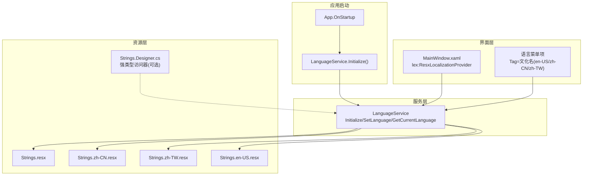
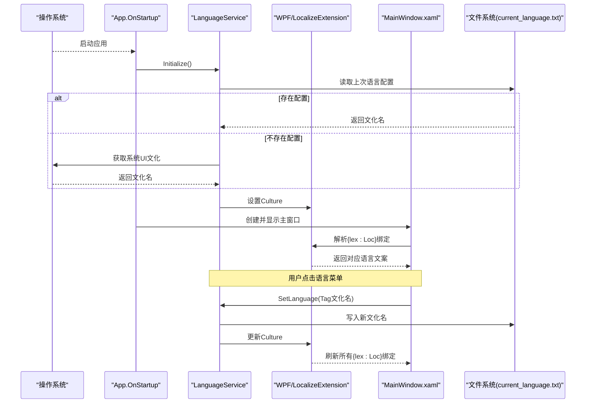
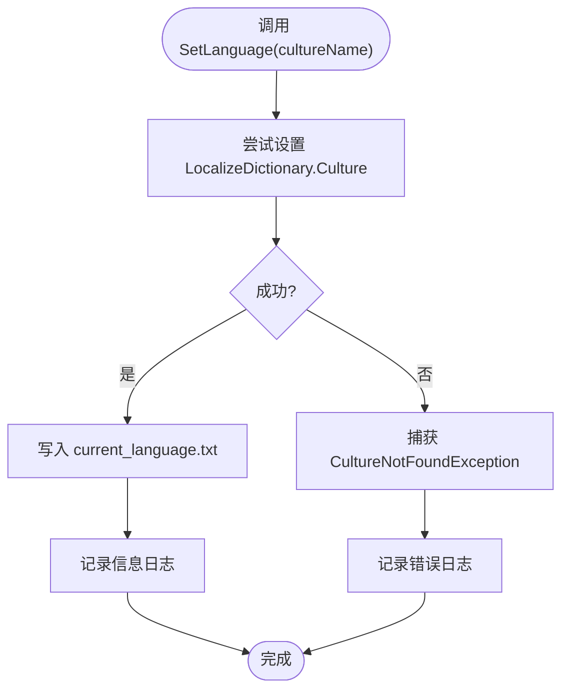
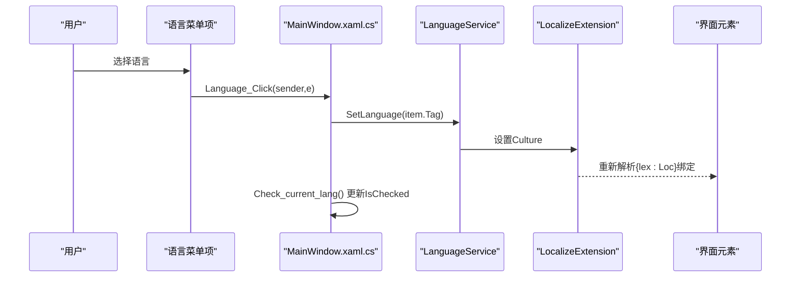
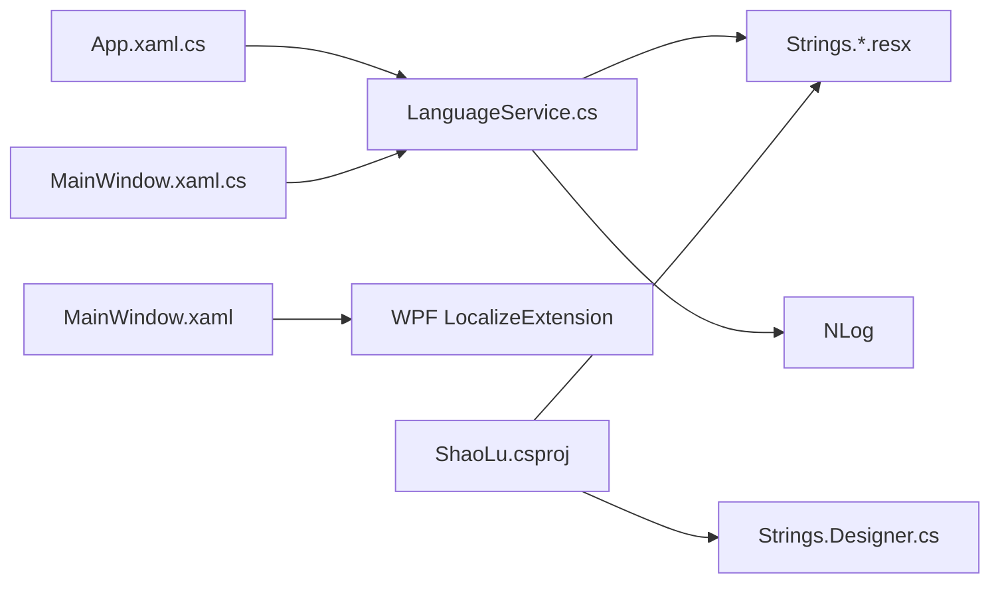

# 多语言支持

<cite>
**本文引用的文件**   
- [App.xaml.cs](file://ShaoLu/App.xaml.cs)
- [MainWindow.xaml](file://ShaoLu/MainWindow.xaml)
- [MainWindow.xaml.cs](file://ShaoLu/MainWindow.xaml.cs)
- [LanguageService.cs](file://ShaoLu/Services/LanguageService.cs)
- [Strings.resx](file://ShaoLu/Resources/Strings.resx)
- [Strings.zh-CN.resx](file://ShaoLu/Resources/Strings.zh-CN.resx)
- [Strings.zh-TW.resx](file://ShaoLu/Resources/Strings.zh-TW.resx)
- [Strings.en-US.resx](file://ShaoLu/Resources/Strings.en-US.resx)
- [Strings.Designer.cs](file://ShaoLu/Resources/Strings.Designer.cs)
- [ShaoLu.csproj](file://ShaoLu/ShaoLu.csproj)
</cite>

## 目录
1. [简介](#简介)
2. [项目结构](#项目结构)
3. [核心组件](#核心组件)
4. [架构总览](#架构总览)
5. [详细组件分析](#详细组件分析)
6. [依赖关系分析](#依赖关系分析)
7. [性能考虑](#性能考虑)
8. [故障排查指南](#故障排查指南)
9. [结论](#结论)
10. [附录](#附录)

## 简介
本文件系统性说明 ShaoLu 的多语言支持实现，涵盖 .NET 本地化机制、.resx 资源文件组织与使用、LanguageService 服务（语言检测、切换、持久化）、XAML 中的本地化绑定语法与运行时切换流程、资源文件的编译打包部署策略，以及新增语言的工作流与质量保证方法。目标是帮助开发者快速理解并高效维护多语言功能。

## 项目结构
- 资源文件位于 Resources 目录，采用标准 .resx 命名约定：
  - Strings.resx（默认语言）
  - Strings.zh-CN.resx（简体中文）
  - Strings.zh-TW.resx（繁体中文）
  - Strings.en-US.resx（英文）
- 代码通过 WPF Localize Extension（lex:Loc）在 XAML 中直接绑定资源键，并在运行期根据当前 Culture 动态解析。
- LanguageService 负责初始化语言、设置语言、读取当前语言并持久化到本地文本文件。

图表来源
- [App.xaml.cs](file://ShaoLu/App.xaml.cs)
- [MainWindow.xaml](file://ShaoLu/MainWindow.xaml)
- [LanguageService.cs](file://ShaoLu/Services/LanguageService.cs)
- [Strings.resx](file://ShaoLu/Resources/Strings.resx)
- [Strings.zh-CN.resx](file://ShaoLu/Resources/Strings.zh-CN.resx)
- [Strings.zh-TW.resx](file://ShaoLu/Resources/Strings.zh-TW.resx)
- [Strings.en-US.resx](file://ShaoLu/Resources/Strings.en-US.resx)
- [Strings.Designer.cs](file://ShaoLu/Resources/Strings.Designer.cs)

章节来源
- [App.xaml.cs](file://ShaoLu/App.xaml.cs)
- [MainWindow.xaml](file://ShaoLu/MainWindow.xaml)
- [LanguageService.cs](file://ShaoLu/Services/LanguageService.cs)
- [Strings.resx](file://ShaoLu/Resources/Strings.resx)
- [Strings.zh-CN.resx](file://ShaoLu/Resources/Strings.zh-CN.resx)
- [Strings.zh-TW.resx](file://ShaoLu/Resources/Strings.zh-TW.resx)
- [Strings.en-US.resx](file://ShaoLu/Resources/Strings.en-US.resx)
- [Strings.Designer.cs](file://ShaoLu/Resources/Strings.Designer.cs)

## 核心组件
- 资源文件（.resx）
  - 以“键-值”对形式存储 UI 文案，按文化名区分不同语言版本。
  - 默认回退顺序：精确文化 → 区域文化 → 中性文化 → 程序集默认资源（无后缀 resx）。
- LanguageService
  - Initialize：启动时优先读取上次保存的语言文件，否则使用系统当前 UI 文化。
  - SetLanguage：设置当前 Culture 并写入本地配置文件，记录日志。
  - GetCurrentLanguage：返回当前 Culture 名称。
  - GetLocalizedString：通过 WPF LocalizeExtension 的 LocalizeDictionary 获取字符串，未找到时返回 key 或默认值。
- XAML 本地化
  - 通过 lex:ResxLocalizationProvider 指定程序集与字典名。
  - 使用 {lex:Loc Key} 进行绑定，如 Title="{lex:Loc AppTitle}"。
  - 语言菜单项 Tag 携带文化名，点击后调用 LanguageService.SetLanguage 切换。

章节来源
- [LanguageService.cs](file://ShaoLu/Services/LanguageService.cs)
- [MainWindow.xaml](file://ShaoLu/MainWindow.xaml)
- [Strings.resx](file://ShaoLu/Resources/Strings.resx)

## 架构总览
下图展示从应用启动到界面显示、再到用户切换语言的完整流程。

图表来源
- [App.xaml.cs](file://ShaoLu/App.xaml.cs)
- [LanguageService.cs](file://ShaoLu/Services/LanguageService.cs)
- [MainWindow.xaml](file://ShaoLu/MainWindow.xaml)
- [MainWindow.xaml.cs](file://ShaoLu/MainWindow.xaml.cs)

## 详细组件分析

### 资源文件组织与使用
- 文件命名规范
  - 默认：Strings.resx
  - 简体中文：Strings.zh-CN.resx
  - 繁体中文：Strings.zh-TW.resx
  - 英文：Strings.en-US.resx
- 键命名建议
  - 语义化、前缀分组（如 Settings_、OCR_、Menu_ 等），便于管理与翻译一致性。
- 使用方式
  - XAML：{lex:Loc Key}
  - C#：LanguageService.GetLocalizedString(Key) 或 LanguageService.GetLocalizedString(Key, defaultValue)
  - 强类型（可选）：Strings.Designer.cs 提供属性访问（适用于非运行时动态场景）

章节来源
- [Strings.resx](file://ShaoLu/Resources/Strings.resx)
- [Strings.zh-CN.resx](file://ShaoLu/Resources/Strings.zh-CN.resx)
- [Strings.zh-TW.resx](file://ShaoLu/Resources/Strings.zh-TW.resx)
- [Strings.en-US.resx](file://ShaoLu/Resources/Strings.en-US.resx)
- [Strings.Designer.cs](file://ShaoLu/Resources/Strings.Designer.cs)

### LanguageService 服务实现
职责
- 初始化语言：优先读取本地配置文件，否则使用系统 UI 文化。
- 设置语言：设置当前 Culture 并持久化到 current_language.txt。
- 获取当前语言：返回当前 Culture.Name。
- 获取本地化字符串：基于 WPF LocalizeExtension 的 LocalizeDictionary 获取，缺失时回退为 key 或默认值。

异常处理
- 捕获无效文化名异常，记录错误日志，避免崩溃。

图表来源
- [LanguageService.cs](file://ShaoLu/Services/LanguageService.cs)

章节来源
- [LanguageService.cs](file://ShaoLu/Services/LanguageService.cs)

### XAML 本地化绑定与运行时切换
- 绑定语法
  - 在 Window/Control 根节点声明 lex:ResxLocalizationProvider.DefaultAssembly 与 DefaultDictionary。
  - 使用 {lex:Loc Key} 绑定标题、按钮文本、提示等。
- 运行时切换
  - 语言菜单项 Tag 携带文化名（en-US/zh-CN/zh-TW）。
  - 点击事件调用 LanguageService.SetLanguage 并刷新 UI 选中状态。
  - WPF LocalizeExtension 监听 Culture 变化，自动刷新所有绑定。

图表来源
- [MainWindow.xaml](file://ShaoLu/MainWindow.xaml)
- [MainWindow.xaml.cs](file://ShaoLu/MainWindow.xaml.cs)
- [LanguageService.cs](file://ShaoLu/Services/LanguageService.cs)

章节来源
- [MainWindow.xaml](file://ShaoLu/MainWindow.xaml)
- [MainWindow.xaml.cs](file://ShaoLu/MainWindow.xaml.cs)

### 应用启动与语言初始化
- App.OnStartup 中首先调用 LanguageService.Initialize()，确保后续界面加载时使用正确语言。
- 随后构建依赖注入容器、清理过期日志、显示主窗口。

章节来源
- [App.xaml.cs](file://ShaoLu/App.xaml.cs)

## 依赖关系分析
- 运行时依赖
  - WPF LocalizeExtension（Lex）：提供 {lex:Loc} 与 LocalizeDictionary 能力。
  - NLog：用于记录语言设置与错误日志。
- 资源依赖
  - 各文化下的 Strings.*.resx 文件必须包含一致的键集合，缺失将回退至默认资源或返回 key。
- 构建依赖
  - MSBuild 会在编译时生成对应的 *.Designer.cs 文件（若启用强类型资源访问）。

图表来源
- [App.xaml.cs](file://ShaoLu/App.xaml.cs)
- [MainWindow.xaml](file://ShaoLu/MainWindow.xaml)
- [MainWindow.xaml.cs](file://ShaoLu/MainWindow.xaml.cs)
- [LanguageService.cs](file://ShaoLu/Services/LanguageService.cs)
- [ShaoLu.csproj](file://ShaoLu/ShaoLu.csproj)

章节来源
- [ShaoLu.csproj](file://ShaoLu/ShaoLu.csproj)

## 性能考虑
- 资源加载
  - .resx 由 ResourceManager 缓存，首次访问后开销较低。
- 切换成本
  - 切换语言仅更新 Culture，WPF LocalizeExtension 按需刷新绑定，整体开销小。
- 日志
  - 语言设置与异常均记录日志，生产环境建议控制日志级别以减少 I/O。

[本节为通用指导，不直接分析具体文件]

## 故障排查指南
- 现象：切换语言后部分文案未更新
  - 检查 XAML 是否正确使用 {lex:Loc Key}。
  - 确认目标文化下的 Strings.*.resx 包含该键。
- 现象：切换语言报错
  - 检查传入的文化名是否正确（如 en-US、zh-CN、zh-TW）。
  - 查看 LanguageService 的错误日志。
- 现象：重启后语言恢复默认
  - 检查 current_language.txt 是否存在且可写。
  - 确认应用有权限写入该文件路径。

章节来源
- [LanguageService.cs](file://ShaoLu/Services/LanguageService.cs)
- [MainWindow.xaml.cs](file://ShaoLu/MainWindow.xaml.cs)

## 结论
ShaoLu 的多语言方案基于 .resx + WPF LocalizeExtension，结合 LanguageService 实现了简洁可靠的语言检测、切换与持久化。通过统一的键命名与完善的资源文件组织，开发团队可以高效扩展新语言并保持 UI 一致性。建议在新增语言时遵循既定工作流与质量保障流程，确保用户体验稳定可靠。

[本节为总结性内容，不直接分析具体文件]

## 附录

### 新增语言流程
- 步骤
  1. 复制默认 Strings.resx 为新语言文件，如 Strings.fr-FR.resx。
  2. 翻译所有键值，保持键名一致。
  3. 在语言菜单中添加对应菜单项，Tag 设置为 fr-FR。
  4. 测试切换与回退逻辑，验证所有界面文案。
  5. 提交代码并纳入发布包。

[本节为流程说明，不直接分析具体文件]

### 翻译工作流程与质量保证
- 建议
  - 使用统一术语表，确保跨模块一致性。
  - 引入翻译评审环节，至少双人校对关键文案。
  - 自动化校验：对比各语言 resx 的键集合，发现缺失键。
  - 回归测试：覆盖主要页面与弹窗，确保切换后无遗漏。

[本节为流程说明，不直接分析具体文件]

### 资源文件编译、打包与部署策略
- 编译
  - MSBuild 自动识别 *.resx 并生成对应卫星程序集或嵌入资源（取决于项目配置）。
- 打包
  - 确保所有 Strings.*.resx 随应用一起发布。
  - 如需强类型访问，保留生成的 *.Designer.cs 文件。
- 部署
  - 保证运行环境具备写入 current_language.txt 的权限。
  - 发布前验证各语言菜单项与文化名映射正确。

章节来源
- [ShaoLu.csproj](file://ShaoLu/ShaoLu.csproj)