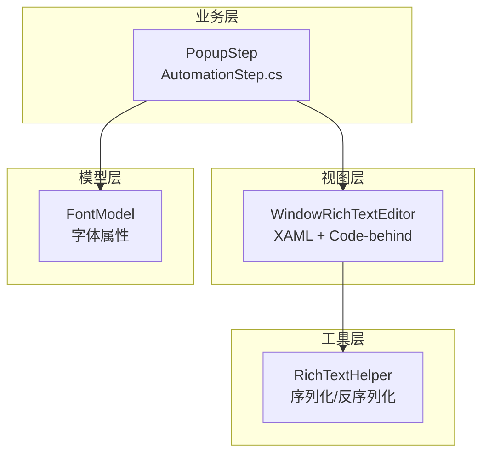
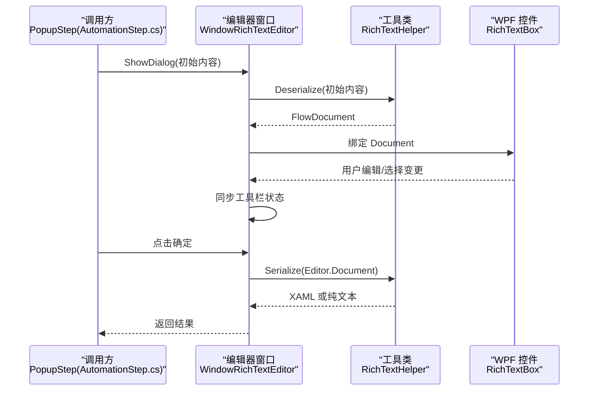
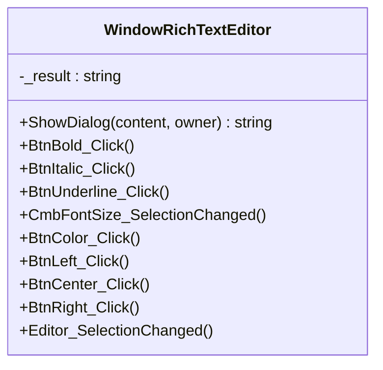
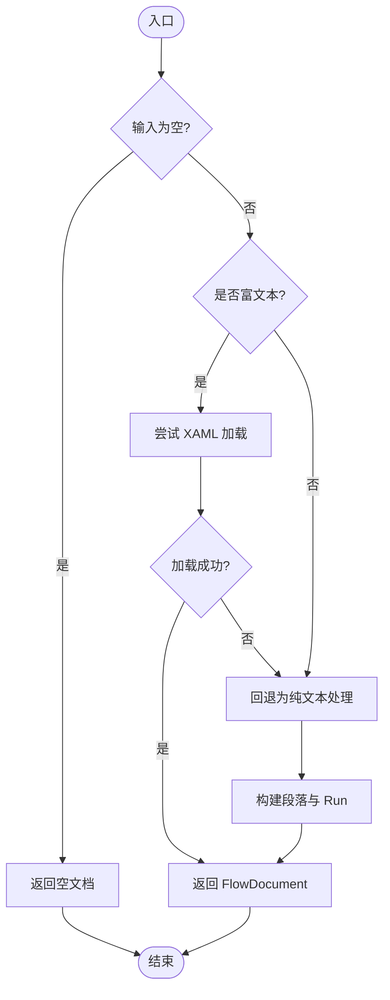
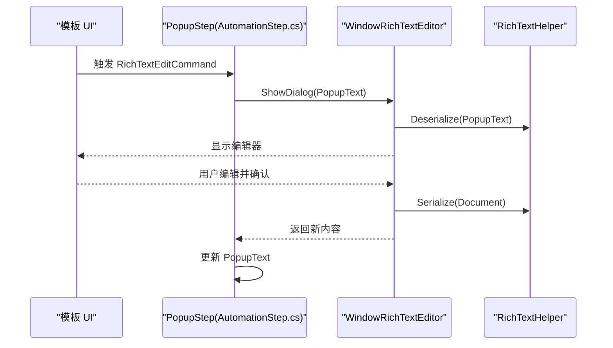
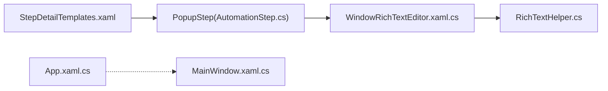

# 富文本编辑器

<cite>
**本文引用的文件**   
- [WindowRichTextEditor.xaml](file://ShaoLu/Views/WindowRichTextEditor.xaml)
- [WindowRichTextEditor.xaml.cs](file://ShaoLu/Views/WindowRichTextEditor.xaml.cs)
- [RichTextHelper.cs](file://ShaoLu/Utils/RichTextHelper.cs)
- [AutomationStep.cs](file://ShaoLu/Viewmodels/AutomationStep.cs)
- [StepDetailTemplates.xaml](file://ShaoLu/Templates/StepDetailTemplates.xaml)
- [FontModel.cs](file://ShaoLu/Models/FontModel.cs)
- [App.xaml.cs](file://ShaoLu/App.xaml.cs)
- [MainWindow.xaml.cs](file://ShaoLu/MainWindow.xaml.cs)
- [MainViewModel.cs](file://ShaoLu/Viewmodels/MainViewModel.cs)
</cite>

## 目录
1. [简介](#简介)
2. [项目结构](#项目结构)
3. [核心组件](#核心组件)
4. [架构总览](#架构总览)
5. [详细组件分析](#详细组件分析)
6. [依赖关系分析](#依赖关系分析)
7. [性能考量](#性能考量)
8. [故障排查指南](#故障排查指南)
9. [结论](#结论)
10. [附录](#附录)

## 简介
本仓库包含一个基于 WPF 的桌面自动化工具，其中“富文本编辑器”作为弹窗式编辑窗口，用于在自动化流程的弹出框步骤中编辑富文本内容。该编辑器支持加粗、斜体、下划线、字号、颜色与对齐等常用格式，并通过 XAML FlowDocument 进行序列化与反序列化，兼容纯文本存储。

## 项目结构
富文本编辑器相关代码主要分布在以下位置：
- Views：UI 定义与交互逻辑（XAML + Code-behind）
- Utils：富文本序列化/反序列化工具类
- Viewmodels：调用方（弹出框步骤）触发编辑器并保存结果
- Models：字体模型（供弹出框样式使用）
- App/MainWindow：应用启动与全局设置（与编辑器无直接耦合，但影响整体 UI 行为）

图表来源 
- [WindowRichTextEditor.xaml.cs:1-129](file://ShaoLu/Views/WindowRichTextEditor.xaml.cs#L1-L129)
- [RichTextHelper.cs:1-127](file://ShaoLu/Utils/RichTextHelper.cs#L1-L127)
- [AutomationStep.cs:750-949](file://ShaoLu/Viewmodels/AutomationStep.cs#L750-L949)
- [FontModel.cs:1-46](file://ShaoLu/Models/FontModel.cs#L1-L46)

章节来源
- [WindowRichTextEditor.xaml:1-55](file://ShaoLu/Views/WindowRichTextEditor.xaml#L1-L55)
- [WindowRichTextEditor.xaml.cs:1-129](file://ShaoLu/Views/WindowRichTextEditor.xaml.cs#L1-L129)
- [RichTextHelper.cs:1-127](file://ShaoLu/Utils/RichTextHelper.cs#L1-L127)
- [AutomationStep.cs:750-949](file://ShaoLu/Viewmodels/AutomationStep.cs#L750-L949)
- [StepDetailTemplates.xaml:530-695](file://ShaoLu/Templates/StepDetailTemplates.xaml#L530-L695)
- [FontModel.cs:1-46](file://ShaoLu/Models/FontModel.cs#L1-L46)

## 核心组件
- 富文本编辑器窗口（WindowRichTextEditor）
  - 提供工具栏按钮（加粗、斜体、下划线、字号、颜色、左/中/右对齐）
  - 通过 RichTextBox 承载编辑内容，SelectionChanged 同步工具栏状态
  - 提供静态 ShowDialog(content, owner) 方法，便于调用方打开并获取结果
- 富文本辅助类（RichTextHelper）
  - IsRichText：判断是否为 XAML FlowDocument
  - Serialize/Deserialize：FlowDocument 与字符串互转，纯文本时回退为简单段落
  - GetPlainText：提取纯文本
  - IsPlainTextOnly：判断是否仅含纯文本（无格式），以便优化存储体积
- 调用方（PopupStep）
  - 在模板中暴露“富文本编辑”命令
  - 调用 WindowRichTextEditor.ShowDialog(PopupText) 获取编辑后的 XAML 或纯文本

章节来源
- [WindowRichTextEditor.xaml:1-55](file://ShaoLu/Views/WindowRichTextEditor.xaml#L1-L55)
- [WindowRichTextEditor.xaml.cs:1-129](file://ShaoLu/Views/WindowRichTextEditor.xaml.cs#L1-L129)
- [RichTextHelper.cs:1-127](file://ShaoLu/Utils/RichTextHelper.cs#L1-L127)
- [StepDetailTemplates.xaml:530-695](file://ShaoLu/Templates/StepDetailTemplates.xaml#L530-L695)
- [AutomationStep.cs:750-949](file://ShaoLu/Viewmodels/AutomationStep.cs#L750-L949)

## 架构总览
富文本编辑器的数据流遵循“调用方 → 编辑器 → 工具类 → 返回结果”的单向路径，确保 UI 与持久化格式解耦。

图表来源 
- [AutomationStep.cs:750-949](file://ShaoLu/Viewmodels/AutomationStep.cs#L750-L949)
- [WindowRichTextEditor.xaml.cs:1-129](file://ShaoLu/Views/WindowRichTextEditor.xaml.cs#L1-L129)
- [RichTextHelper.cs:1-127](file://ShaoLu/Utils/RichTextHelper.cs#L1-L127)

## 详细组件分析

### 富文本编辑器窗口（WindowRichTextEditor）
- 界面布局
  - 顶部工具栏：加粗、斜体、下划线、字号下拉、颜色选择器、对齐按钮
  - 底部按钮：确定、取消
  - 中央编辑区：RichTextBox，启用换行与滚动条
- 交互逻辑
  - SelectionChanged：根据当前选区的属性更新工具栏按钮状态
  - 各按钮事件：对选区应用对应属性（字体粗细、样式、装饰、字号、前景色、对齐）
  - 确定/取消：序列化文档并返回；取消则返回 null
- 关键实现要点
  - 使用 TextRange.ApplyPropertyValue 批量应用属性
  - 使用 System.Windows.Forms.ColorDialog 选择颜色并转换为 WPF SolidColorBrush

图表来源 
- [WindowRichTextEditor.xaml.cs:1-129](file://ShaoLu/Views/WindowRichTextEditor.xaml.cs#L1-L129)

章节来源
- [WindowRichTextEditor.xaml:1-55](file://ShaoLu/Views/WindowRichTextEditor.xaml#L1-L55)
- [WindowRichTextEditor.xaml.cs:1-129](file://ShaoLu/Views/WindowRichTextEditor.xaml.cs#L1-L129)

### 富文本辅助类（RichTextHelper）
- 功能职责
  - 判断输入是否为富文本（XAML FlowDocument）
  - 将 FlowDocument 序列化为 XAML 字符串，若仅为纯文本则直接返回文本
  - 将字符串反序列化为 FlowDocument，兼容纯文本（按换行生成段落）
  - 提取纯文本与判断是否仅含纯文本（无格式）
- 复杂度与性能
  - 序列化/反序列化基于 XamlWriter/XamlReader，时间复杂度与文档节点数量线性相关
  - 纯文本检测避免不必要的 XAML 包装，降低存储与传输开销

图表来源 
- [RichTextHelper.cs:1-127](file://ShaoLu/Utils/RichTextHelper.cs#L1-L127)

章节来源
- [RichTextHelper.cs:1-127](file://ShaoLu/Utils/RichTextHelper.cs#L1-L127)

### 调用方（PopupStep）
- 集成点
  - 模板中提供“富文本编辑”按钮，绑定到 RichTextEditCommand
  - 执行时调用 WindowRichTextEditor.ShowDialog(PopupText)，将结果写回 PopupText
- 运行期行为
  - 弹出异步弹窗（非富文本编辑器），由 PopupStep 控制关闭模式与返回值
  - 富文本编辑器仅用于编辑 PopupText 的内容（XAML 或纯文本）

图表来源 
- [AutomationStep.cs:750-949](file://ShaoLu/Viewmodels/AutomationStep.cs#L750-L949)
- [WindowRichTextEditor.xaml.cs:1-129](file://ShaoLu/Views/WindowRichTextEditor.xaml.cs#L1-L129)
- [RichTextHelper.cs:1-127](file://ShaoLu/Utils/RichTextHelper.cs#L1-L127)

章节来源
- [StepDetailTemplates.xaml:530-695](file://ShaoLu/Templates/StepDetailTemplates.xaml#L530-L695)
- [AutomationStep.cs:750-949](file://ShaoLu/Viewmodels/AutomationStep.cs#L750-L949)

### 字体模型（FontModel）
- 作用
  - 封装字体族、大小、粗细、样式、单位及颜色等属性
  - 提供 Clone 方法用于复制对象
  - 默认值取自系统字体，保证一致性
- 与编辑器的关系
  - 富文本编辑器不直接使用 FontModel，但弹出框步骤的字体设置会用到该模型

章节来源
- [FontModel.cs:1-46](file://ShaoLu/Models/FontModel.cs#L1-L46)

## 依赖关系分析
- 编辑器窗口依赖 RichTextHelper 进行内容序列化/反序列化
- 调用方（PopupStep）通过静态方法打开编辑器并接收结果
- 模板通过命令绑定触发编辑流程
- 应用启动与主窗口负责全局设置与生命周期管理，与编辑器无直接耦合

图表来源 
- [StepDetailTemplates.xaml:530-695](file://ShaoLu/Templates/StepDetailTemplates.xaml#L530-L695)
- [AutomationStep.cs:750-949](file://ShaoLu/Viewmodels/AutomationStep.cs#L750-L949)
- [WindowRichTextEditor.xaml.cs:1-129](file://ShaoLu/Views/WindowRichTextEditor.xaml.cs#L1-L129)
- [RichTextHelper.cs:1-127](file://ShaoLu/Utils/RichTextHelper.cs#L1-L127)
- [App.xaml.cs:1-92](file://ShaoLu/App.xaml.cs#L1-L92)
- [MainWindow.xaml.cs:1-316](file://ShaoLu/MainWindow.xaml.cs#L1-L316)

章节来源
- [App.xaml.cs:1-92](file://ShaoLu/App.xaml.cs#L1-L92)
- [MainWindow.xaml.cs:1-316](file://ShaoLu/MainWindow.xaml.cs#L1-L316)
- [MainViewModel.cs:1-76](file://ShaoLu/Viewmodels/MainViewModel.cs#L1-L76)

## 性能考量
- 序列化/反序列化
  - 大文档时 XAML 转换可能带来一定开销，建议合理控制文档规模
  - 纯文本优先策略减少不必要的 XAML 包装
- UI 交互
  - SelectionChanged 频繁触发，注意避免在回调中进行昂贵操作
- 资源释放
  - 编辑器窗口为模态对话框，关闭后自动释放；确保不在外部持有引用导致内存泄漏

[本节为通用指导，不直接分析具体文件]

## 故障排查指南
- 无法打开编辑器或内容为空
  - 检查传入的初始内容是否为空或非法格式
  - 查看 RichTextHelper.Deserialize 的异常分支与回退逻辑
- 编辑后保存失败
  - 确认 Serialize 输出是否为预期格式（XAML 或纯文本）
  - 检查调用方是否正确接收并赋值给 PopupText
- 工具栏状态不同步
  - 确认 SelectionChanged 是否正确读取当前选区属性
  - 检查按钮 Click 事件是否正确应用属性并聚焦编辑器

章节来源
- [RichTextHelper.cs:1-127](file://ShaoLu/Utils/RichTextHelper.cs#L1-L127)
- [WindowRichTextEditor.xaml.cs:1-129](file://ShaoLu/Views/WindowRichTextEditor.xaml.cs#L1-L129)
- [AutomationStep.cs:750-949](file://ShaoLu/Viewmodels/AutomationStep.cs#L750-L949)

## 结论
富文本编辑器以简洁清晰的架构实现了 WPF 中的富文本编辑能力，并与自动化流程中的弹出框步骤无缝集成。通过 RichTextHelper 的纯文本优先策略，既保证了兼容性，又优化了存储与传输效率。建议在后续迭代中继续完善错误提示与性能监控，以提升用户体验与稳定性。

[本节为总结性内容，不直接分析具体文件]

## 附录
- 使用建议
  - 对于短文本且无复杂格式的场景，尽量保持纯文本以减少序列化开销
  - 合理使用字号与颜色，避免过多格式导致文档膨胀
  - 在模板中为“富文本编辑”按钮提供明确的提示信息，引导用户正确使用

[本节为补充说明，不直接分析具体文件]