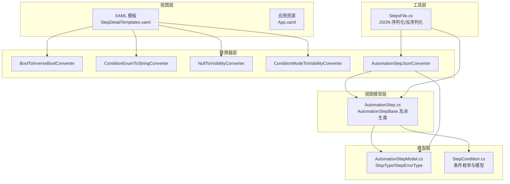
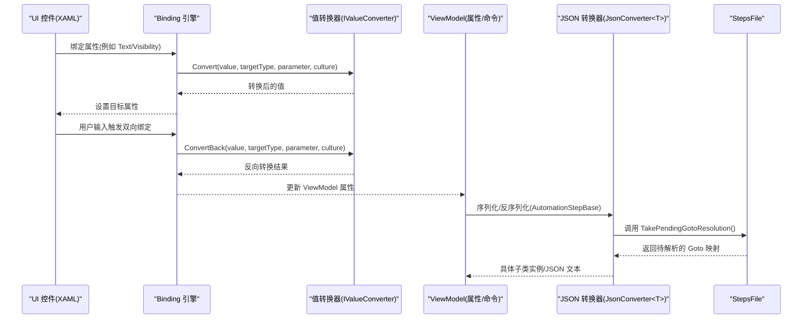
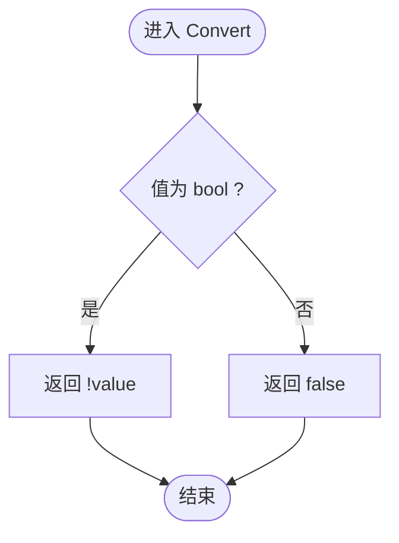
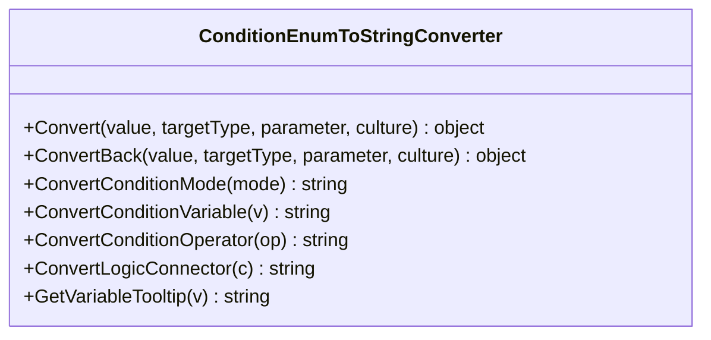
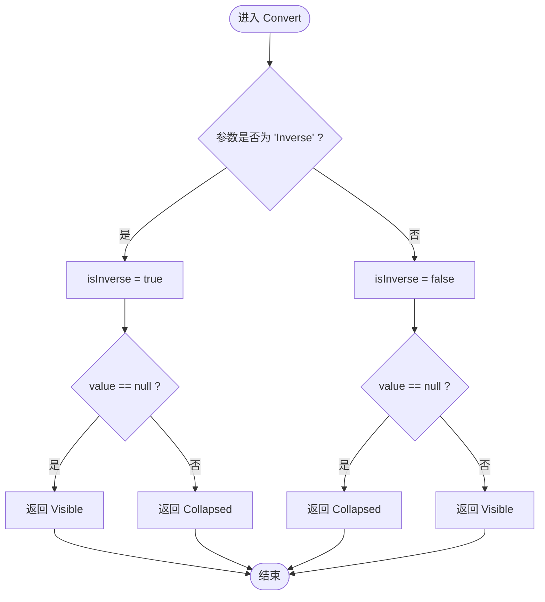
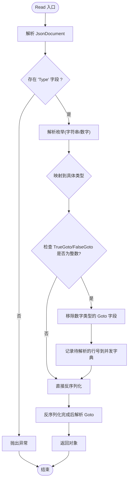
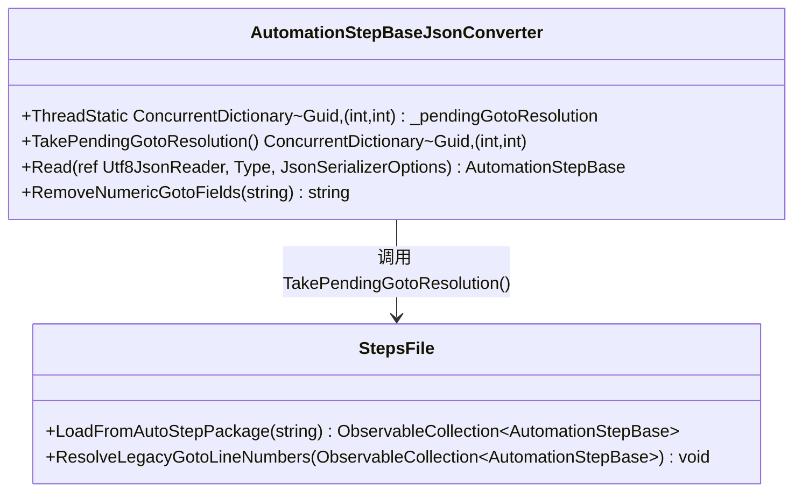
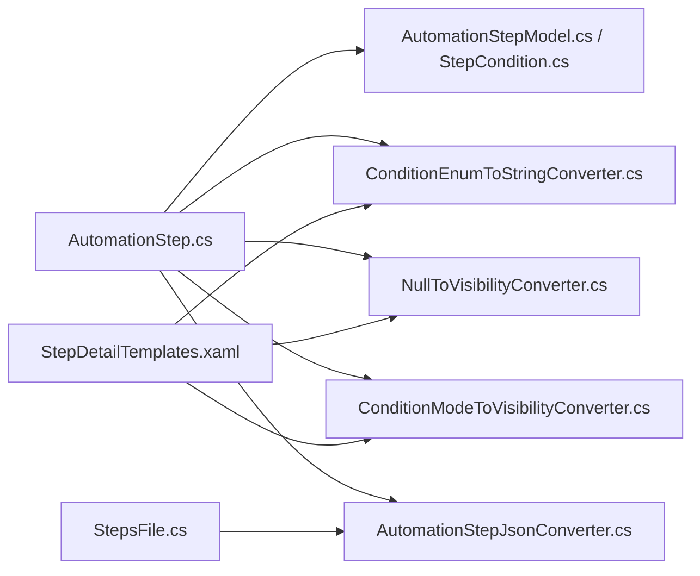

# 数据绑定与转换器

<cite>
**本文引用的文件**   
- [AutomationStepJsonConverter.cs](file://ShaoLu/Converters/AutomationStepJsonConverter.cs)
- [BoolToInverseBoolConverter.cs](file://ShaoLu/Converters/BoolToInverseBoolConverter.cs)
- [ConditionEnumToStringConverter.cs](file://ShaoLu/Converters/ConditionEnumToStringConverter.cs)
- [NullToVisibilityConverter.cs](file://ShaoLu/Converters/NullToVisibilityConverter.cs)
- [ConditionModeToVisibilityConverter.cs](file://ShaoLu/Converters/ConditionModeToVisibilityConverter.cs)
- [AutomationStepModel.cs](file://ShaoLu/Models/AutomationStepModel.cs)
- [StepCondition.cs](file://ShaoLu/Models/StepCondition.cs)
- [AutomationStep.cs](file://ShaoLu/Viewmodels/AutomationStep.cs)
- [StepsFile.cs](file://ShaoLu/Utils/StepsFile.cs)
- [StepDetailTemplates.xaml](file://ShaoLu/Templates/StepDetailTemplates.xaml)
- [App.xaml](file://ShaoLu/App.xaml)
- [ConverterTests.cs](file://NUnitTest/ConverterTests.cs)
</cite>

## 更新摘要
**所做更改**   
- 更新了 AutomationStepJsonConverter 组件分析，详细说明向后兼容性和 Goto 值迁移功能
- 新增 Goto 值迁移机制的详细技术说明
- 更新了 JSON 转换器架构图，包含并发字典和线程安全特性
- 增强了故障排查指南，包含向后兼容性相关的问题解决方案

## 目录
1. [简介](#简介)
2. [项目结构](#项目结构)
3. [核心组件](#核心组件)
4. [架构总览](#架构总览)
5. [详细组件分析](#详细组件分析)
6. [依赖关系分析](#依赖关系分析)
7. [性能考虑](#性能考虑)
8. [故障排查指南](#故障排查指南)
9. [结论](#结论)
10. [附录](#附录)

## 简介
本文件围绕 ShaoLu 的 WPF 数据绑定与转换器机制展开，系统性说明双向绑定、命令绑定与验证规则的实现方式，并重点解析以下转换器的设计与用法：
- AutomationStepJsonConverter：用于自动化步骤的多态 JSON 序列化/反序列化，支持向后兼容性和 Goto 值自动迁移
- BoolToInverseBoolConverter：布尔值反转
- ConditionEnumToStringConverter：条件相关枚举到中文显示文本
- NullToVisibilityConverter：空值到可见性的转换
- ConditionModeToVisibilityConverter：条件模式到可见性的转换

同时涵盖 IValueConverter 接口的使用、自定义转换器开发方法、数据验证与错误处理、格式化显示实现，以及性能优化技巧与常见问题解决方案。

## 项目结构
ShaoLu 采用分层组织：
- Converters：WPF 值转换器与模板选择器
- Models：领域模型与枚举定义（如 StepType、StepErrorType、条件相关枚举）
- Viewmodels：MVVM 视图模型与步骤基类及派生类
- Templates：XAML 模板，集中声明资源与转换器实例
- Utils：工具类，包括 StepsFile 用于文件操作和 JSON 序列化
- App.xaml：应用级资源字典合并

图表来源
- [StepDetailTemplates.xaml:1-200](file://ShaoLu/Templates/StepDetailTemplates.xaml#L1-L200)
- [App.xaml:1-36](file://ShaoLu/App.xaml#L1-L36)
- [AutomationStepJsonConverter.cs:1-183](file://ShaoLu/Converters/AutomationStepJsonConverter.cs#L1-L183)
- [BoolToInverseBoolConverter.cs:1-24](file://ShaoLu/Converters/BoolToInverseBoolConverter.cs#L1-L24)
- [ConditionEnumToStringConverter.cs:1-102](file://ShaoLu/Converters/ConditionEnumToStringConverter.cs#L1-L102)
- [NullToVisibilityConverter.cs:1-26](file://ShaoLu/Converters/NullToVisibilityConverter.cs#L1-L26)
- [ConditionModeToVisibilityConverter.cs:1-28](file://ShaoLu/Converters/ConditionModeToVisibilityConverter.cs#L1-L28)
- [AutomationStepModel.cs:1-47](file://ShaoLu/Models/AutomationStepModel.cs#L1-L47)
- [StepCondition.cs:1-122](file://ShaoLu/Models/StepCondition.cs#L1-L122)
- [AutomationStep.cs:1-800](file://ShaoLu/Viewmodels/AutomationStep.cs#L1-L800)
- [StepsFile.cs:1-244](file://ShaoLu/Utils/StepsFile.cs#L1-L244)

章节来源
- [StepDetailTemplates.xaml:1-200](file://ShaoLu/Templates/StepDetailTemplates.xaml#L1-L200)
- [App.xaml:1-36](file://ShaoLu/App.xaml#L1-L36)

## 核心组件
- 值转换器（IValueConverter）：将源属性值转换为 UI 所需类型或格式，支持双向转换（可选）。
- 模板选择器（DataTemplateSelector）：根据数据类型动态选择 DataTemplate。
- JSON 转换器（JsonConverter<T>）：对复杂对象进行多态序列化/反序列化，支持向后兼容性。
- 视图模型（ObservableObject + RelayCommand）：提供可绑定属性与命令，驱动 UI 更新与交互。
- 文件处理工具（StepsFile）：负责 JSON 文件的序列化和反序列化，包含向后兼容性处理。

章节来源
- [AutomationStep.cs:1-800](file://ShaoLu/Viewmodels/AutomationStep.cs#L1-L800)
- [AutomationStepModel.cs:1-47](file://ShaoLu/Models/AutomationStepModel.cs#L1-L47)
- [StepCondition.cs:1-122](file://ShaoLu/Models/StepCondition.cs#L1-L122)
- [StepsFile.cs:1-244](file://ShaoLu/Utils/StepsFile.cs#L1-L244)

## 架构总览
WPF 数据绑定在 XAML 中通过 Binding 表达式连接 UI 控件与 ViewModel 属性；转换器在绑定链中执行值转换；JSON 转换器在持久化时负责多态对象的序列化和反序列化，并支持向后兼容性处理。

图表来源
- [StepDetailTemplates.xaml:1-200](file://ShaoLu/Templates/StepDetailTemplates.xaml#L1-L200)
- [AutomationStepJsonConverter.cs:1-183](file://ShaoLu/Converters/AutomationStepJsonConverter.cs#L1-L183)
- [StepsFile.cs:1-244](file://ShaoLu/Utils/StepsFile.cs#L1-L244)

## 详细组件分析

### 值转换器：BoolToInverseBoolConverter
- 功能：将布尔值取反，常用于"启用/禁用"、"显示/隐藏"等场景。
- 关键点：
  - Convert/ConvertBack 均返回逻辑非，保证双向一致性。
  - 非 bool 输入安全回退为 false，避免绑定异常。
- 典型用法：在 XAML 中将 CheckBox.IsChecked 与某属性绑定后，用此转换器控制按钮可用性。

图表来源
- [BoolToInverseBoolConverter.cs:1-24](file://ShaoLu/Converters/BoolToInverseBoolConverter.cs#L1-L24)

章节来源
- [BoolToInverseBoolConverter.cs:1-24](file://ShaoLu/Converters/BoolToInverseBoolConverter.cs#L1-L24)
- [ConverterTests.cs:1-316](file://NUnitTest/ConverterTests.cs#L1-L316)

### 值转换器：ConditionEnumToStringConverter
- 功能：将条件相关枚举（ConditionMode、ConditionVariable、ConditionOperator、LogicConnector）转换为中文显示文本，并提供 Tooltip 辅助说明。
- 关键点：
  - Convert 分支判断不同枚举类型，调用对应静态映射方法。
  - ConvertBack 未实现（只读显示），符合 UI 展示需求。
  - GetVariableTooltip 提供变量含义提示，提升用户体验。
- 典型用法：ComboBox 的 ItemTemplate 中使用该转换器显示可读文本。

图表来源
- [ConditionEnumToStringConverter.cs:1-102](file://ShaoLu/Converters/ConditionEnumToStringConverter.cs#L1-L102)

章节来源
- [ConditionEnumToStringConverter.cs:1-102](file://ShaoLu/Converters/ConditionEnumToStringConverter.cs#L1-L102)
- [StepDetailTemplates.xaml:1-200](file://ShaoLu/Templates/StepDetailTemplates.xaml#L1-L200)
- [ConverterTests.cs:1-316](file://NUnitTest/ConverterTests.cs#L1-L316)

### 值转换器：NullToVisibilityConverter
- 功能：将 null 值映射为 Visibility.Collapsed，非 null 映射为 Visible；支持参数"Inverse"反转行为。
- 关键点：
  - 仅实现 Convert，ConvertBack 抛出 NotImplementedException，适用于单向绑定。
  - 参数控制反转逻辑，便于复用同一转换器实现"有值显示/无值显示"两种场景。
- 典型用法：当某个字段为空时隐藏编辑区，非空时显示。

图表来源
- [NullToVisibilityConverter.cs:1-26](file://ShaoLu/Converters/NullToVisibilityConverter.cs#L1-L26)

章节来源
- [NullToVisibilityConverter.cs:1-26](file://ShaoLu/Converters/NullToVisibilityConverter.cs#L1-L26)
- [ConverterTests.cs:1-316](file://NUnitTest/ConverterTests.cs#L1-L316)

### 值转换器：ConditionModeToVisibilityConverter
- 功能：将 ConditionMode 转换为 Visibility，Custom => Visible，Default => Collapsed。
- 关键点：
  - 仅实现 Convert，ConvertBack 未实现，适合只读显示。
  - 简化条件面板的显隐逻辑，提高模板可读性。
- 典型用法：在条件面板根容器上绑定 ConditionMode，自动显示/隐藏规则行。

章节来源
- [ConditionModeToVisibilityConverter.cs:1-28](file://ShaoLu/Converters/ConditionModeToVisibilityConverter.cs#L1-L28)
- [StepDetailTemplates.xaml:1-200](file://ShaoLu/Templates/StepDetailTemplates.xaml#L1-L200)
- [ConverterTests.cs:1-316](file://NUnitTest/ConverterTests.cs#L1-L316)

### JSON 转换器：AutomationStepJsonConverter

**更新** 增强了向后兼容性，支持旧版整数 Goto 值与新版 GUID 引用的自动迁移

- 功能：对 AutomationStepBase 及其派生类进行多态 JSON 序列化/反序列化，支持向后兼容性。
- 关键特性：
  - **向后兼容性**：支持字符串与数字形式的枚举值，增强兼容性。
  - **Goto 值迁移**：自动检测旧版整数格式的 TrueGoto/FalseGoto 值，并在反序列化后转换为新的 GUID 引用。
  - **线程安全**：使用 ThreadStatic 并发字典存储反序列化期间的待解析 Goto 引用。
  - **智能解析**：Read 方法从 JSON 读取 Type 字段，解析字符串或数字枚举，映射到具体子类类型。
  - **Write 方法**：获取运行时实际类型，直接序列化具体对象以保留派生类属性。

#### Goto 值迁移机制

**图表来源**
- [AutomationStepJsonConverter.cs:1-183](file://ShaoLu/Converters/AutomationStepJsonConverter.cs#L1-L183)
- [StepsFile.cs:226-242](file://ShaoLu/Utils/StepsFile.cs#L226-L242)

#### 并发字典管理

**图表来源**
- [AutomationStepJsonConverter.cs:20-31](file://ShaoLu/Converters/AutomationStepJsonConverter.cs#L20-L31)
- [StepsFile.cs:226-242](file://ShaoLu/Utils/StepsFile.cs#L226-L242)

章节来源
- [AutomationStepJsonConverter.cs:1-183](file://ShaoLu/Converters/AutomationStepJsonConverter.cs#L1-L183)
- [StepsFile.cs:1-244](file://ShaoLu/Utils/StepsFile.cs#L1-L244)
- [AutomationStepModel.cs:1-47](file://ShaoLu/Models/AutomationStepModel.cs#L1-L47)
- [AutomationStep.cs:1-800](file://ShaoLu/Viewmodels/AutomationStep.cs#L1-L800)

### 数据绑定与命令绑定
- 双向绑定：通过 Mode=TwoWay 与 UpdateSourceTrigger 控制更新时机，例如 NumericBox 与 Slider 同步更新阈值。
- 命令绑定：ViewModel 暴露 ICommand（如 AddConditionCommand、RemoveConditionCommand），在 XAML 中通过 Command 属性绑定，解耦 UI 与业务逻辑。
- 验证与错误：
  - 属性 setter 中进行基本校验（如 Name 非空），结合 IsError/ErrorMessage 反馈。
  - 运行期错误类型（StepErrorType）用于区分失败原因，便于 UI 呈现与日志记录。

章节来源
- [StepDetailTemplates.xaml:1-200](file://ShaoLu/Templates/StepDetailTemplates.xaml#L1-L200)
- [AutomationStep.cs:1-800](file://ShaoLu/Viewmodels/AutomationStep.cs#L1-L800)
- [AutomationStepModel.cs:1-47](file://ShaoLu/Models/AutomationStepModel.cs#L1-L47)

### 数据验证、错误处理与格式化显示
- 验证策略：
  - 输入校验：在属性 setter 中检查必填项与范围，必要时设置 IsError 与 ErrorMessage。
  - 运行时校验：在执行步骤过程中捕获异常，设置 ErrorType 并记录日志。
- 错误处理：
  - 弹窗步骤（PopupStep）支持取消操作，确保长时间任务可中断。
  - 文件读取/OCR 等操作失败时，统一设置错误类型并提示用户。
- 格式化显示：
  - 使用 ConditionEnumToStringConverter 将枚举转为友好文本。
  - 使用 NullToVisibilityConverter 控制空值的显示/隐藏。

章节来源
- [AutomationStep.cs:1-800](file://ShaoLu/Viewmodels/AutomationStep.cs#L1-L800)
- [ConditionEnumToStringConverter.cs:1-102](file://ShaoLu/Converters/ConditionEnumToStringConverter.cs#L1-L102)
- [NullToVisibilityConverter.cs:1-26](file://ShaoLu/Converters/NullToVisibilityConverter.cs#L1-L26)

## 依赖关系分析
- 转换器与模型：
  - ConditionEnumToStringConverter 依赖 StepCondition 中的枚举类型。
  - AutomationStepJsonConverter 依赖 AutomationStepBase 及其派生类与 StepType 枚举。
- 转换器与视图：
  - StepDetailTemplates.xaml 中注册并使用多个转换器，形成 UI 与转换器的松耦合。
- 视图模型与转换器：
  - 视图模型通过属性与命令驱动 UI，转换器在绑定链中完成值转换。
- 文件处理与转换器：
  - StepsFile 使用 AutomationStepJsonConverter 进行 JSON 序列化/反序列化。
  - StepsFile 调用 TakePendingGotoResolution() 获取待解析的 Goto 引用。

**图表来源**
- [AutomationStep.cs:1-800](file://ShaoLu/Viewmodels/AutomationStep.cs#L1-L800)
- [AutomationStepModel.cs:1-47](file://ShaoLu/Models/AutomationStepModel.cs#L1-L47)
- [StepCondition.cs:1-122](file://ShaoLu/Models/StepCondition.cs#L1-L122)
- [ConditionEnumToStringConverter.cs:1-102](file://ShaoLu/Converters/ConditionEnumToStringConverter.cs#L1-L102)
- [NullToVisibilityConverter.cs:1-26](file://ShaoLu/Converters/NullToVisibilityConverter.cs#L1-L26)
- [ConditionModeToVisibilityConverter.cs:1-28](file://ShaoLu/Converters/ConditionModeToVisibilityConverter.cs#L1-L28)
- [AutomationStepJsonConverter.cs:1-183](file://ShaoLu/Converters/AutomationStepJsonConverter.cs#L1-L183)
- [StepsFile.cs:1-244](file://ShaoLu/Utils/StepsFile.cs#L1-L244)
- [StepDetailTemplates.xaml:1-200](file://ShaoLu/Templates/StepDetailTemplates.xaml#L1-L200)

章节来源
- [AutomationStep.cs:1-800](file://ShaoLu/Viewmodels/AutomationStep.cs#L1-L800)
- [StepDetailTemplates.xaml:1-200](file://ShaoLu/Templates/StepDetailTemplates.xaml#L1-L200)

## 性能考虑
- 转换器性能：
  - 保持 Convert/ConvertBack 轻量，避免耗时计算；复杂逻辑应下沉至 ViewModel 或缓存结果。
  - 合理使用参数减少重复逻辑，提高复用率。
- 绑定性能：
  - 使用 UpdateSourceTrigger=PropertyChanged 或 LostFocus 平衡响应性与性能。
  - 大数据集合建议使用虚拟化与分页。
- JSON 序列化：
  - 多态序列化需明确类型映射，避免反射开销过大；必要时缓存类型映射表。
  - 大对象序列化建议流式写入与按需加载。
  - **向后兼容性处理**：Goto 值迁移使用并发字典避免锁竞争，提高多线程环境下的性能。
  - **内存管理**：TakePendingGotoResolution() 方法在获取后清空字典，防止内存泄漏。

## 故障排查指南
- 常见绑定问题：
  - 转换器返回类型与目标类型不匹配导致绑定失败。
  - 双向绑定时 ConvertBack 未实现或抛出异常。
- 调试建议：
  - 使用单元测试覆盖转换器边界情况（如 null、非期望类型）。
  - 在 XAML 中启用绑定诊断输出，定位转换失败点。
- 错误处理：
  - 在 ViewModel 中设置 IsError/ErrorMessage，并在 UI 中展示。
  - 对于外部操作（文件、OCR），捕获异常并设置 StepErrorType。
- **向后兼容性问题**：
  - 如果旧版 JSON 文件无法正确加载，检查 TrueGoto/FalseGoto 字段是否为整数格式。
  - 确认 StepsFile.ResolveLegacyGotoLineNumbers() 方法被正确调用。
  - 验证并发字典 `_pendingGotoResolution` 是否正确初始化和管理。
  - 检查 Uid 字段是否存在且格式正确，确保 Goto 值能正确映射到目标步骤。

章节来源
- [ConverterTests.cs:1-316](file://NUnitTest/ConverterTests.cs#L1-L316)
- [AutomationStep.cs:1-800](file://ShaoLu/Viewmodels/AutomationStep.cs#L1-L800)
- [AutomationStepJsonConverter.cs:1-183](file://ShaoLu/Converters/AutomationStepJsonConverter.cs#L1-L183)
- [StepsFile.cs:226-242](file://ShaoLu/Utils/StepsFile.cs#L226-L242)

## 结论
ShaoLu 的数据绑定与转换器体系清晰、职责分明：
- 值转换器专注于 UI 展示与简单逻辑转换，保持轻量与可测试性。
- JSON 转换器解决多态对象的持久化问题，确保扩展性，并支持向后兼容性。
- 视图模型通过属性与命令驱动 UI，结合验证与错误处理提升健壮性。
- **增强的向后兼容性**：AutomationStepJsonConverter 能够自动迁移旧版整数 Goto 值到新版 GUID 引用，确保系统升级时的平滑过渡。
- **线程安全设计**：使用并发字典管理反序列化期间的状态，支持多线程环境下的稳定运行。

遵循本文的最佳实践与性能建议，可在保证用户体验的同时维持良好的系统性能与可维护性。

## 附录
- 最佳实践建议：
  - 转换器只做纯函数式转换，避免副作用。
  - 在 XAML 中集中声明转换器实例，便于管理与复用。
  - 对关键路径（如 JSON 序列化、OCR）添加单元测试与性能基准。
  - **向后兼容性**：在设计新数据结构时，考虑旧版本的兼容处理，提供平滑的迁移路径。
- 参考示例：
  - 在 StepDetailTemplates.xaml 中查看转换器在 ComboBox、ItemsControl 中的使用方式。
  - 在 ConverterTests.cs 中查看各转换器的单元测试用例。
  - 在 StepsFile.cs 中查看 Goto 值迁移的具体实现。

章节来源
- [StepDetailTemplates.xaml:1-200](file://ShaoLu/Templates/StepDetailTemplates.xaml#L1-L200)
- [ConverterTests.cs:1-316](file://NUnitTest/ConverterTests.cs#L1-L316)
- [StepsFile.cs:1-244](file://ShaoLu/Utils/StepsFile.cs#L1-L244)