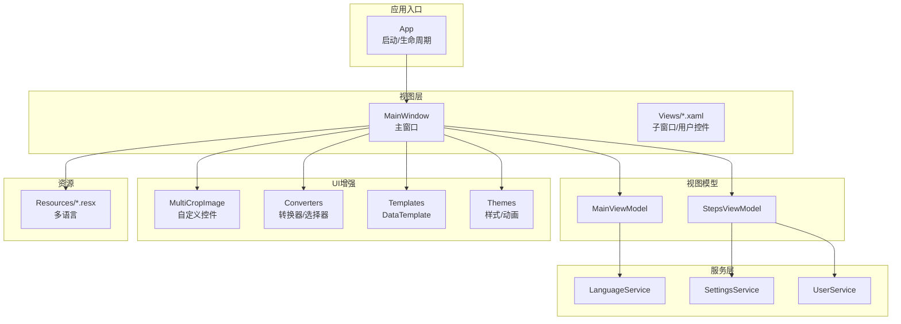
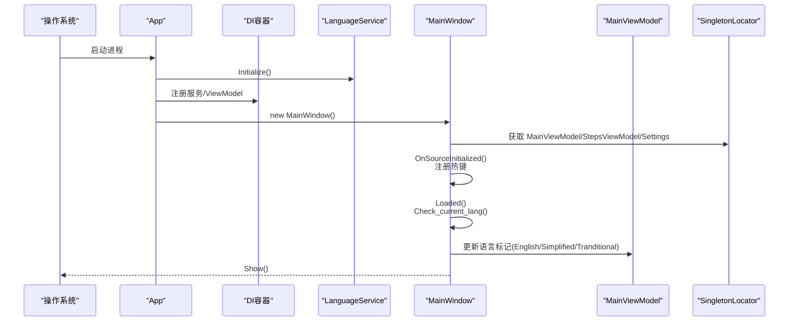
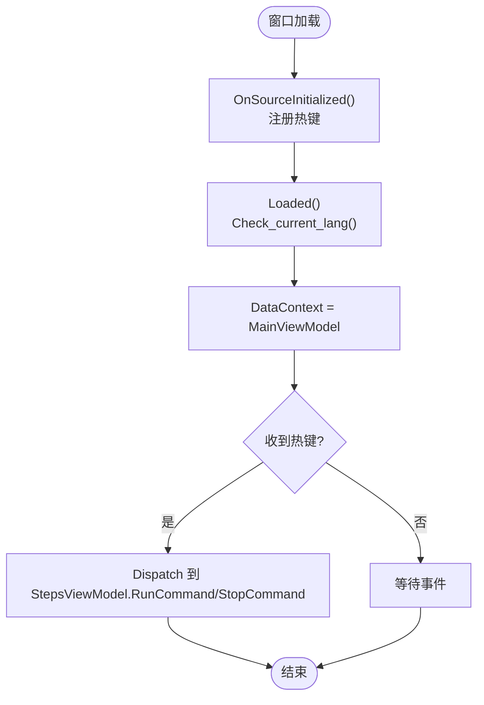
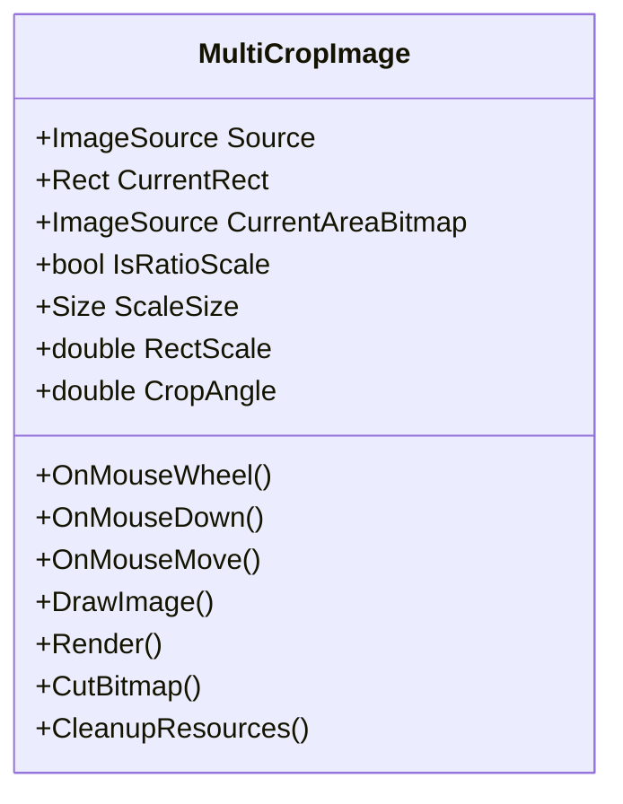
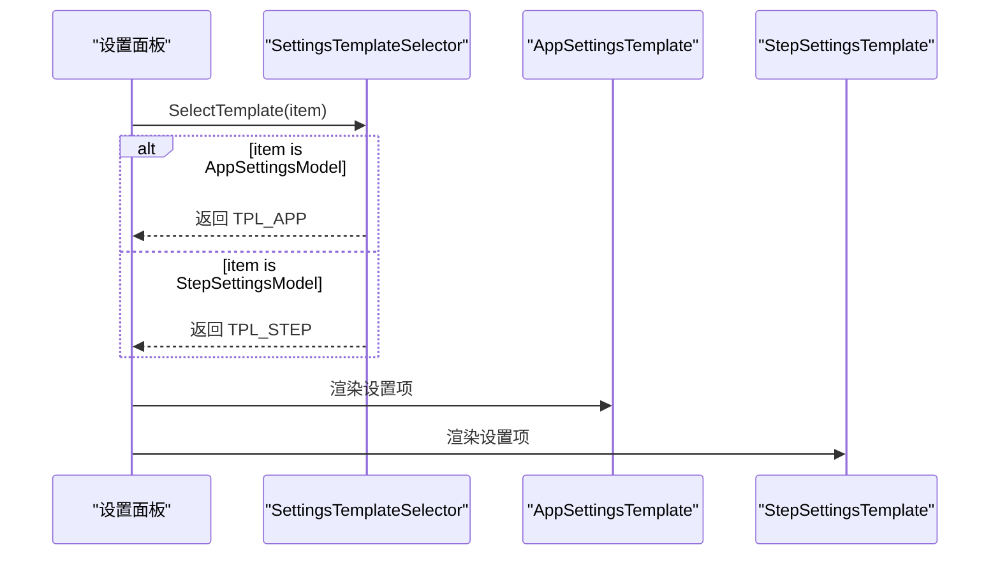
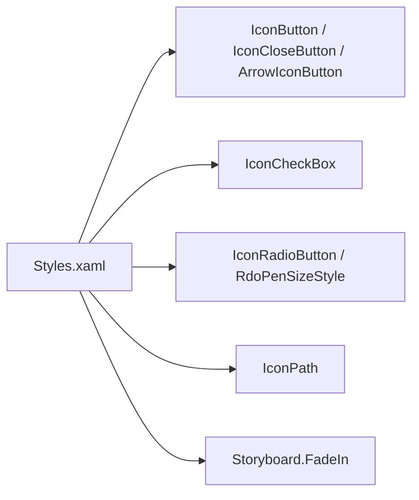
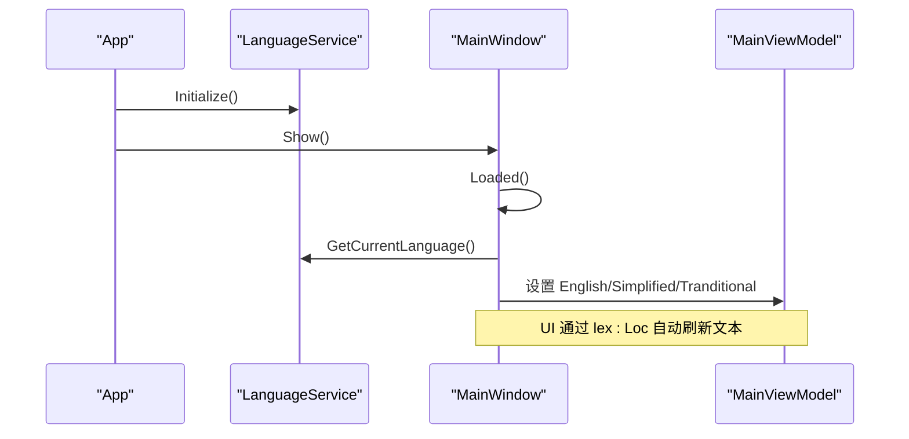
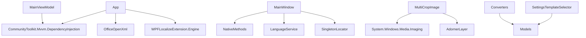

# 用户界面系统

<cite>
**本文引用的文件**   
- [App.xaml.cs](file://ShaoLu/App.xaml.cs)
- [MainWindow.xaml.cs](file://ShaoLu/MainWindow.xaml.cs)
- [MainViewModel.cs](file://ShaoLu/Viewmodels/MainViewModel.cs)
- [LanguageService.cs](file://ShaoLu/Services/LanguageService.cs)
- [MultiCropImage.cs](file://ShaoLu/Controls/MultiCropImage.cs)
- [BoolToInverseBoolConverter.cs](file://ShaoLu/Converters/BoolToInverseBoolConverter.cs)
- [ConditionModeToVisibilityConverter.cs](file://ShaoLu/Converters/ConditionModeToVisibilityConverter.cs)
- [NullToVisibilityConverter.cs](file://ShaoLu/Converters/NullToVisibilityConverter.cs)
- [SettingsTemplateSelector.cs](file://ShaoLu/Converters/SettingsTemplateSelector.cs)
- [Styles.xaml](file://ShaoLu/Themes/Styles.xaml)
- [SettingsTemplates.xaml](file://ShaoLu/Templates/SettingsTemplates.xaml)
- [Strings.resx](file://ShaoLu/Resources/Strings.resx)
- [SingletonLocator.cs](file://ShaoLu/Utils/SingletonLocator.cs)
</cite>

## 目录
1. [简介](#简介)
2. [项目结构](#项目结构)
3. [核心组件](#核心组件)
4. [架构总览](#架构总览)
5. [详细组件分析](#详细组件分析)
6. [依赖关系分析](#依赖关系分析)
7. [性能考量](#性能考量)
8. [故障排查指南](#故障排查指南)
9. [结论](#结论)
10. [附录](#附录)

## 简介
本文件为 ShaoLu WPF 用户界面系统的权威技术文档，面向开发者与使用者，系统性阐述以下主题：
- WPF 界面架构设计：主窗口布局、控件组织与数据绑定机制
- 自定义控件实现：MultiCropImage 的功能、交互与使用方式
- 转换器（Converters）：布尔值转换、可见性控制、枚举转字符串等常用场景
- XAML 模板系统与动态 UI 生成：DataTemplate 与 DataTemplateSelector 的应用
- 主题样式系统：资源字典组织与样式定制方法
- 多语言支持：资源文件组织结构与本地化流程
- 响应式设计与动画效果：用户体验优化最佳实践

## 项目结构
ShaoLu 采用典型的 WPF MVVM 分层组织：
- App 层：应用启动、依赖注入容器初始化、全局服务配置
- View 层：WPF Window/UserControl 与 XAML 布局
- ViewModel 层：业务状态与命令，通过 CommunityToolkit.Mvvm 的 ObservableObject 提供属性变更通知
- Services 层：跨模块能力（如语言、设置、OCR、执行日志等）
- Controls 层：可复用自定义控件（如 MultiCropImage）
- Converters 层：IValueConverter/DataTemplateSelector 等
- Templates 层：按功能域划分的 DataTemplate
- Themes 层：样式与动画 Storyboard
- Resources 层：多语言资源（resx）



图表来源
- [App.xaml.cs:18-58](file://ShaoLu/App.xaml.cs#L18-L58)
- [MainWindow.xaml.cs:77-101](file://ShaoLu/MainWindow.xaml.cs#L77-L101)

章节来源
- [App.xaml.cs:18-58](file://ShaoLu/App.xaml.cs#L18-L58)
- [MainWindow.xaml.cs:77-101](file://ShaoLu/MainWindow.xaml.cs#L77-L101)

## 核心组件
- 应用启动与依赖注入：在应用启动阶段完成语言初始化、DI 容器构建、主窗口创建与显示。
- 主窗口与热键：注册全局热键用于“开始/停止”自动化步骤；维护登录态与菜单文案。
- 视图模型：MainViewModel 暴露语言切换、登录态、路径等状态；StepsViewModel 管理步骤集合与运行命令。
- 语言服务：基于 WPFLocalizeExtension 的 LocalizeDictionary 进行运行时语言切换与持久化。
- 自定义控件：MultiCropImage 提供图像缩放、平移、旋转裁剪与实时预览。
- 转换器：布尔取反、可见性映射、空值可见性等通用转换逻辑。
- 模板系统：SettingsTemplates 定义不同设置项的 DataTemplate，配合 SettingsTemplateSelector 动态渲染。
- 主题样式：Styles.xaml 集中定义按钮、复选框、单选按钮等样式与动画 Storyboard。
- 多语言资源：Strings.resx 及其区域化文件承载界面文案。

章节来源
- [App.xaml.cs:18-58](file://ShaoLu/App.xaml.cs#L18-L58)
- [MainWindow.xaml.cs:32-74](file://ShaoLu/MainWindow.xaml.cs#L32-L74)
- [MainViewModel.cs:14-54](file://ShaoLu/Viewmodels/MainViewModel.cs#L14-L54)
- [LanguageService.cs:15-40](file://ShaoLu/Services/LanguageService.cs#L15-L40)
- [MultiCropImage.cs:49-124](file://ShaoLu/Controls/MultiCropImage.cs#L49-L124)
- [BoolToInverseBoolConverter.cs:7-22](file://ShaoLu/Converters/BoolToInverseBoolConverter.cs#L7-L22)
- [ConditionModeToVisibilityConverter.cs:13-26](file://ShaoLu/Converters/ConditionModeToVisibilityConverter.cs#L13-L26)
- [NullToVisibilityConverter.cs:8-24](file://ShaoLu/Converters/NullToVisibilityConverter.cs#L8-L24)
- [SettingsTemplateSelector.cs:7-24](file://ShaoLu/Converters/SettingsTemplateSelector.cs#L7-L24)
- [Styles.xaml:1-38](file://ShaoLu/Themes/Styles.xaml#L1-L38)
- [SettingsTemplates.xaml:10-68](file://ShaoLu/Templates/SettingsTemplates.xaml#L10-L68)
- [Strings.resx:120-185](file://ShaoLu/Resources/Strings.resx#L120-L185)

## 架构总览
下图展示从应用启动到主窗口加载的关键调用链，以及语言、热键、登录态等关键流程。



图表来源
- [App.xaml.cs:18-58](file://ShaoLu/App.xaml.cs#L18-L58)
- [MainWindow.xaml.cs:32-74](file://ShaoLu/MainWindow.xaml.cs#L32-L74)
- [MainWindow.xaml.cs:93-101](file://ShaoLu/MainWindow.xaml.cs#L93-L101)
- [SingletonLocator.cs:8-16](file://ShaoLu/Utils/SingletonLocator.cs#L8-L16)

章节来源
- [App.xaml.cs:18-58](file://ShaoLu/App.xaml.cs#L18-L58)
- [MainWindow.xaml.cs:32-74](file://ShaoLu/MainWindow.xaml.cs#L32-L74)
- [SingletonLocator.cs:8-16](file://ShaoLu/Utils/SingletonLocator.cs#L8-L16)

## 详细组件分析

### 主窗口与数据绑定
- 职责：负责全局热键注册、输入校验、语言切换、文件操作、登录态管理与子窗口导航。
- 数据绑定：DataContext 指向 MainViewModel；通过 SingletonLocator 访问 StepsViewModel、Settings 与 UserService。
- 热键处理：通过 HwndSource Hook 拦截 WM_HOTKEY，转发到 StepsViewModel 的命令。
- 语言切换：根据当前 Culture 同步 ViewModel 中的布尔标记，驱动 UI 文本刷新。



图表来源
- [MainWindow.xaml.cs:32-74](file://ShaoLu/MainWindow.xaml.cs#L32-L74)
- [MainWindow.xaml.cs:93-101](file://ShaoLu/MainWindow.xaml.cs#L93-L101)

章节来源
- [MainWindow.xaml.cs:77-101](file://ShaoLu/MainWindow.xaml.cs#L77-L101)
- [MainWindow.xaml.cs:136-164](file://ShaoLu/MainWindow.xaml.cs#L136-L164)
- [SingletonLocator.cs:8-16](file://ShaoLu/Utils/SingletonLocator.cs#L8-L16)

### 自定义控件：MultiCropImage
- 功能要点：
  - 依赖属性：Source、CurrentRect、CurrentAreaBitmap、IsRatioScale、ScaleSize、RectScale、CropAngle
  - 交互：鼠标滚轮缩放（以光标为中心）、中键平移模式、拖拽裁剪框、旋转手柄与重置
  - 渲染：AdornerLayer 叠加遮罩矩形，WriteableBitmap/CroppedBitmap 高效裁剪，支持旋转裁剪
  - 资源管理：Loaded/Unloaded 生命周期内初始化与清理，避免内存泄漏
- 使用建议：
  - 绑定 Source 为 ImageSource
  - 通过 CurrentRect 与 CurrentAreaBitmap 获取裁剪结果
  - IsRatioScale + ScaleSize 控制等比裁剪框初始尺寸
  - CropAngle 驱动旋转，结合 Render 刷新预览



图表来源
- [MultiCropImage.cs:49-124](file://ShaoLu/Controls/MultiCropImage.cs#L49-L124)
- [MultiCropImage.cs:246-255](file://ShaoLu/Controls/MultiCropImage.cs#L246-L255)
- [MultiCropImage.cs:265-338](file://ShaoLu/Controls/MultiCropImage.cs#L265-L338)
- [MultiCropImage.cs:495-574](file://ShaoLu/Controls/MultiCropImage.cs#L495-L574)
- [MultiCropImage.cs:611-711](file://ShaoLu/Controls/MultiCropImage.cs#L611-L711)

章节来源
- [MultiCropImage.cs:49-124](file://ShaoLu/Controls/MultiCropImage.cs#L49-L124)
- [MultiCropImage.cs:246-255](file://ShaoLu/Controls/MultiCropImage.cs#L246-L255)
- [MultiCropImage.cs:265-338](file://ShaoLu/Controls/MultiCropImage.cs#L265-L338)
- [MultiCropImage.cs:495-574](file://ShaoLu/Controls/MultiCropImage.cs#L495-L574)
- [MultiCropImage.cs:611-711](file://ShaoLu/Controls/MultiCropImage.cs#L611-L711)

### 转换器（Converters）
- BoolToInverseBoolConverter：布尔值取反，常用于反向勾选或禁用状态。
- ConditionModeToVisibilityConverter：将枚举 ConditionMode 转换为 Visibility（Custom→Visible，Default→Collapsed）。
- NullToVisibilityConverter：将 null 与非 null 映射为 Collapsed/Visible，支持 Inverse 参数反转行为。

```mermaid
flowchart TD
A["输入值"] --> B{"类型判断"}
B --> |bool| C["取反返回"]
B --> |ConditionMode| D{"是否 Custom?"}
D --> |是| E["返回 Visible"]
D --> |否| F["返回 Collapsed"]
B --> |object|null?| G{"是否为 null?"}
G --> |是| H["根据参数决定 Visible/Collapsed"]
G --> |否| I["根据参数决定 Visible/Collapsed"]
```

图表来源
- [BoolToInverseBoolConverter.cs:7-22](file://ShaoLu/Converters/BoolToInverseBoolConverter.cs#L7-L22)
- [ConditionModeToVisibilityConverter.cs:13-26](file://ShaoLu/Converters/ConditionModeToVisibilityConverter.cs#L13-L26)
- [NullToVisibilityConverter.cs:8-24](file://ShaoLu/Converters/NullToVisibilityConverter.cs#L8-L24)

章节来源
- [BoolToInverseBoolConverter.cs:7-22](file://ShaoLu/Converters/BoolToInverseBoolConverter.cs#L7-L22)
- [ConditionModeToVisibilityConverter.cs:13-26](file://ShaoLu/Converters/ConditionModeToVisibilityConverter.cs#L13-L26)
- [NullToVisibilityConverter.cs:8-24](file://ShaoLu/Converters/NullToVisibilityConverter.cs#L8-L24)

### XAML 模板系统与动态 UI 生成
- SettingsTemplates.xaml：为 AppSettings 与 StepSettings 两类设置项分别定义 DataTemplate，包含字体、保留天数、相似度阈值、等待时间、超时、点击次数等字段的双向绑定。
- SettingsTemplateSelector：根据 item 的具体类型（AppSettingsModel/StepSettingsModel）返回对应 DataTemplate，实现动态 UI 渲染。



图表来源
- [SettingsTemplates.xaml:10-68](file://ShaoLu/Templates/SettingsTemplates.xaml#L10-L68)
- [SettingsTemplates.xaml:71-141](file://ShaoLu/Templates/SettingsTemplates.xaml#L71-L141)
- [SettingsTemplateSelector.cs:7-24](file://ShaoLu/Converters/SettingsTemplateSelector.cs#L7-L24)

章节来源
- [SettingsTemplates.xaml:10-68](file://ShaoLu/Templates/SettingsTemplates.xaml#L10-L68)
- [SettingsTemplates.xaml:71-141](file://ShaoLu/Templates/SettingsTemplates.xaml#L71-L141)
- [SettingsTemplateSelector.cs:7-24](file://ShaoLu/Converters/SettingsTemplateSelector.cs#L7-L24)

### 主题样式系统
- Styles.xaml：集中定义图标按钮、关闭按钮、箭头按钮、图标 Path、CheckBox/RadioButton 等样式，并提供淡入动画 Storyboard。
- 使用方式：通过 x:Key 引用样式，或在 ControlTemplate.Triggers 中定义交互反馈（悬停、按下、禁用）。



图表来源
- [Styles.xaml:1-38](file://ShaoLu/Themes/Styles.xaml#L1-L38)
- [Styles.xaml:105-145](file://ShaoLu/Themes/Styles.xaml#L105-L145)
- [Styles.xaml:147-187](file://ShaoLu/Themes/Styles.xaml#L147-L187)
- [Styles.xaml:189-230](file://ShaoLu/Themes/Styles.xaml#L189-L230)

章节来源
- [Styles.xaml:1-38](file://ShaoLu/Themes/Styles.xaml#L1-L38)
- [Styles.xaml:105-145](file://ShaoLu/Themes/Styles.xaml#L105-L145)
- [Styles.xaml:147-187](file://ShaoLu/Themes/Styles.xaml#L147-L187)
- [Styles.xaml:189-230](file://ShaoLu/Themes/Styles.xaml#L189-L230)

### 多语言支持
- 资源文件：Strings.resx 及区域化文件（en-US、zh-CN、zh-TW），通过 lex:Loc 在 XAML 中引用。
- LanguageService：Initialize 读取上次保存的语言或系统语言；SetLanguage 设置并持久化；GetLocalizedString 提供回退默认值。
- 主窗口：Check_current_lang 同步 ViewModel 中的语言标记，确保 UI 元素（如菜单项）正确反映当前语言。



图表来源
- [LanguageService.cs:15-40](file://ShaoLu/Services/LanguageService.cs#L15-L40)
- [MainWindow.xaml.cs:136-155](file://ShaoLu/MainWindow.xaml.cs#L136-L155)
- [Strings.resx:120-185](file://ShaoLu/Resources/Strings.resx#L120-L185)

章节来源
- [LanguageService.cs:15-40](file://ShaoLu/Services/LanguageService.cs#L15-L40)
- [MainWindow.xaml.cs:136-155](file://ShaoLu/MainWindow.xaml.cs#L136-L155)
- [Strings.resx:120-185](file://ShaoLu/Resources/Strings.resx#L120-L185)

## 依赖关系分析
- 启动依赖：App 依赖 NLog、EPPlus、CommunityToolkit.Mvvm.DependencyInjection、WPFLocalizeExtension。
- 主窗口依赖：NativeMethods（Win32 热键）、WindowInteropHelper、LanguageService、SingletonLocator。
- 视图模型依赖：CommunityToolkit.Mvvm 的 ObservableObject、SingletonLocator。
- 自定义控件依赖：WPFDevelopers.Controls、System.Windows.Media.Imaging、AdornerLayer。
- 转换器依赖：Models 中的枚举（ConditionMode）。
- 模板选择器依赖：Models 中的设置模型类型。



图表来源
- [App.xaml.cs:1-8](file://ShaoLu/App.xaml.cs#L1-L8)
- [MainWindow.xaml.cs:1-16](file://ShaoLu/MainWindow.xaml.cs#L1-L16)
- [MultiCropImage.cs:1-11](file://ShaoLu/Controls/MultiCropImage.cs#L1-L11)
- [SettingsTemplateSelector.cs:1-6](file://ShaoLu/Converters/SettingsTemplateSelector.cs#L1-L6)

章节来源
- [App.xaml.cs:1-8](file://ShaoLu/App.xaml.cs#L1-L8)
- [MainWindow.xaml.cs:1-16](file://ShaoLu/MainWindow.xaml.cs#L1-L16)
- [MultiCropImage.cs:1-11](file://ShaoLu/Controls/MultiCropImage.cs#L1-L11)
- [SettingsTemplateSelector.cs:1-6](file://ShaoLu/Converters/SettingsTemplateSelector.cs#L1-L6)

## 性能考量
- 图像裁剪与渲染：
  - 优先使用 CroppedBitmap 进行无旋转裁剪，减少 CPU/GPU 压力。
  - 有旋转时采用 RenderTargetBitmap 输出，注意 DPI 一致性与像素格式（Pbgra32）。
  - 及时释放 WriteableBitmap/RenderTargetBitmap，避免内存堆积。
- 资源清理：
  - Unloaded 事件中移除 Adorner、解绑事件、清空 Background 与 BitmapFrame，必要时触发 GC。
- 视图变换：
  - 缩放与平移使用 ScaleTransform/TranslateTransform，避免重绘整个 Canvas。
- 数据绑定：
  - 使用 UpdateSourceTrigger=PropertyChanged 提升输入响应速度。
  - 大量列表项建议使用虚拟化（DataGrid/DataVirtualizingStackPanel）。

[本节为通用指导，不直接分析具体文件]

## 故障排查指南
- 语言切换无效：
  - 检查 LanguageService.SetLanguage 是否正确写入 current_language.txt 并设置 LocalizeDictionary.Culture。
  - 确认 XAML 中使用 lex:Loc 且资源文件名与命名空间正确。
- 热键冲突或未生效：
  - 确认窗口句柄有效，HwndSource.AddHook 已注册，WM_HOTKEY 消息处理分支正确。
  - 退出时务必注销热键，防止残留。
- 图像裁剪异常：
  - 检查 Source 是否为 BitmapImage；确保 Border 尺寸与 Canvas 尺寸合理。
  - 旋转角度过大可能导致裁剪区域越界，需做边界限制。
- 模板未渲染：
  - 确认 SettingsTemplateSelector 的 SelectTemplate 能匹配到正确的 DataTemplate。
  - 检查 DataType 声明与 ViewModel 类型一致。

章节来源
- [LanguageService.cs:27-40](file://ShaoLu/Services/LanguageService.cs#L27-L40)
- [MainWindow.xaml.cs:32-74](file://ShaoLu/MainWindow.xaml.cs#L32-L74)
- [MultiCropImage.cs:495-574](file://ShaoLu/Controls/MultiCropImage.cs#L495-L574)
- [SettingsTemplateSelector.cs:12-24](file://ShaoLu/Converters/SettingsTemplateSelector.cs#L12-L24)

## 结论
ShaoLu 的用户界面系统以 MVVM 为核心，结合 WPF 强大的模板与样式体系，实现了高内聚、低耦合的可扩展架构。通过自定义控件 MultiCropImage 与丰富的转换器，提升了图像处理与 UI 表达的效率；借助 LanguageService 与 resx 资源，实现了灵活的多语言支持。整体设计兼顾了性能与用户体验，适合持续迭代与功能扩展。

[本节为总结性内容，不直接分析具体文件]

## 附录
- 最佳实践建议：
  - 统一样式与动画集中在 Themes，便于主题切换与维护。
  - 将复杂 UI 逻辑下沉至自定义控件，保持 XAML 简洁。
  - 使用 Converter/DataTemplateSelector 分离显示逻辑与业务逻辑。
  - 对大对象（图像、位图）做好生命周期管理，避免内存泄漏。
  - 多语言文案集中管理，避免硬编码字符串。

[本节为通用指导，不直接分析具体文件]