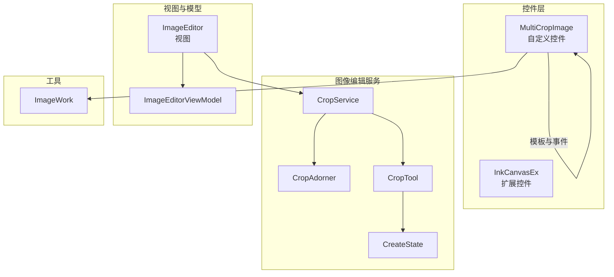
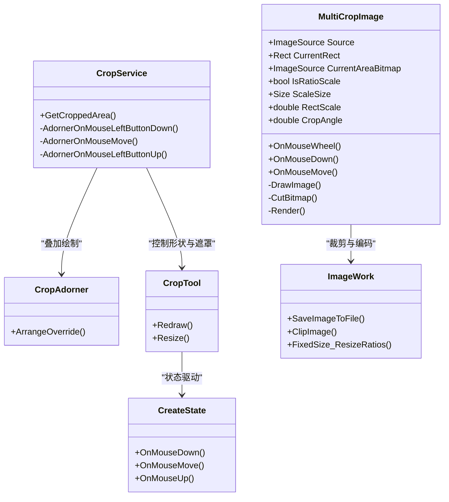
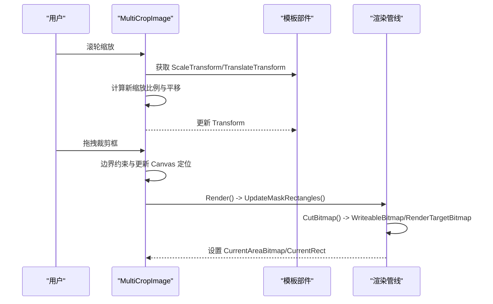
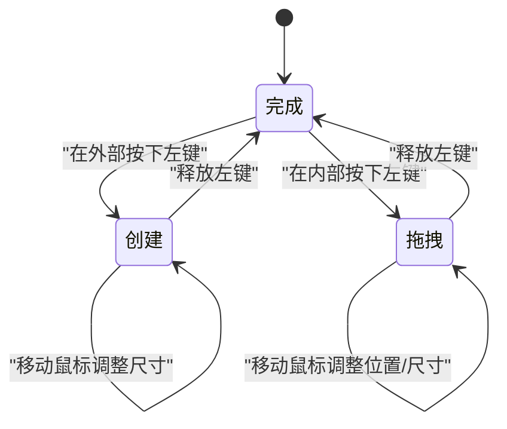
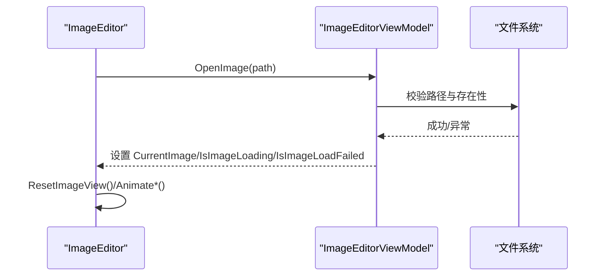
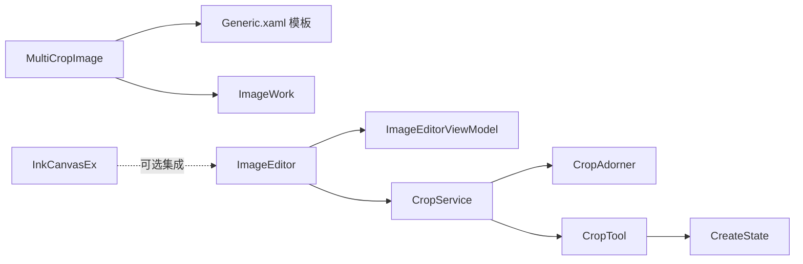

# 自定义控件开发

<cite>
**本文引用的文件**   
- [MultiCropImage.cs](file://ShaoLu/Controls/MultiCropImage.cs)
- [Generic.xaml](file://ShaoLu/Themes/Generic.xaml)
- [InkCanvasEx.cs](file://ShaoLu/Tools/ImageEdit/Controls/InkCanvasEx.cs)
- [ImageEditor.xaml.cs](file://ShaoLu/Tools/ImageEdit/ImageEditor.xaml.cs)
- [ImageEditorViewModel.cs](file://ShaoLu/Tools/ImageEdit/ImageEditorViewModel.cs)
- [CropService.cs](file://ShaoLu/Tools/ImageEdit/services/CropService.cs)
- [CropAdorner.cs](file://ShaoLu/Tools/ImageEdit/services/CropAdorner.cs)
- [CropTool.cs](file://ShaoLu/Tools/ImageEdit/services/Tools/CropTool.cs)
- [CreateState.cs](file://ShaoLu/Tools/ImageEdit/services/State/CreateState.cs)
- [ImageWork.cs](file://ShaoLu/Tools/ImageEdit/Utils/ImageWork.cs)
</cite>

## 目录
1. [简介](#简介)
2. [项目结构](#项目结构)
3. [核心组件](#核心组件)
4. [架构总览](#架构总览)
5. [详细组件分析](#详细组件分析)
6. [依赖关系分析](#依赖关系分析)
7. [性能考量](#性能考量)
8. [故障排查指南](#故障排查指南)
9. [结论](#结论)
10. [附录](#附录)

## 简介
本文件面向 ShaoLu 项目的自定义控件开发，重点解析 MultiCropImage 多区域裁剪控件与 InkCanvasEx 扩展控件的实现原理、交互逻辑与可定制性。文档同时总结 WPF 自定义控件的开发模式（继承、重写、依赖属性）、样式模板化与主题适配、可访问性与国际化支持、测试策略与性能优化技巧，并提供完整的最佳实践示例路径，帮助读者快速掌握并复用这些能力。

## 项目结构
- Controls：包含 MultiCropImage 自定义控件及其默认样式定义在 Themes/Generic.xaml。
- Tools/ImageEdit：图像编辑子系统，包含 InkCanvasEx、CropService、CropAdorner、CropTool、状态机 CreateState 等，以及 ImageEditor 视图与 ViewModel。
- Utils：图像处理工具类 ImageWork，提供位图转换、编码保存、缩放裁剪等能力。
- Viewmodels：ImageEditorViewModel 管理当前图片、加载状态与列表展示。

图表来源
- [MultiCropImage.cs:1-714](file://ShaoLu/Controls/MultiCropImage.cs#L1-L714)
- [Generic.xaml:1-67](file://ShaoLu/Themes/Generic.xaml#L1-L67)
- [ImageEditor.xaml.cs:1-800](file://ShaoLu/Tools/ImageEdit/ImageEditor.xaml.cs#L1-L800)
- [CropService.cs:1-190](file://ShaoLu/Tools/ImageEdit/services/CropService.cs#L1-L190)
- [CropAdorner.cs:1-32](file://ShaoLu/Tools/ImageEdit/services/CropAdorner.cs#L1-L32)
- [CropTool.cs:1-74](file://ShaoLu/Tools/ImageEdit/services/Tools/CropTool.cs#L1-L74)
- [CreateState.cs:1-75](file://ShaoLu/Tools/ImageEdit/services/State/CreateState.cs#L1-L75)
- [ImageWork.cs:1-296](file://ShaoLu/Tools/ImageEdit/Utils/ImageWork.cs#L1-L296)

章节来源
- [MultiCropImage.cs:1-714](file://ShaoLu/Controls/MultiCropImage.cs#L1-L714)
- [Generic.xaml:1-67](file://ShaoLu/Themes/Generic.xaml#L1-L67)

## 核心组件
- MultiCropImage：基于 Control 的自定义控件，通过模板定义裁剪画布、遮罩矩形、旋转手柄与复位按钮；支持缩放、平移、旋转与实时裁剪预览。
- InkCanvasEx：对 InkCanvas 的轻量扩展，维护 Stroke 撤销栈，提供 Undo 方法。
- CropService/CropAdorner/CropTool：基于 Adorner 的裁剪服务，使用状态机管理创建、拖拽与完成流程，配合遮罩与缩略图手柄实现交互。
- ImageEditor：承载图像查看、变换（平移/缩放/旋转）与业务操作（打开/保存/导航）的 UserControl。
- ImageWork：位图与 BitmapSource 互转、编码器选择与保存、高质量裁剪与缩放工具。

章节来源
- [MultiCropImage.cs:1-714](file://ShaoLu/Controls/MultiCropImage.cs#L1-L714)
- [InkCanvasEx.cs:1-36](file://ShaoLu/Tools/ImageEdit/Controls/InkCanvasEx.cs#L1-L36)
- [CropService.cs:1-190](file://ShaoLu/Tools/ImageEdit/services/CropService.cs#L1-L190)
- [CropAdorner.cs:1-32](file://ShaoLu/Tools/ImageEdit/services/CropAdorner.cs#L1-L32)
- [CropTool.cs:1-74](file://ShaoLu/Tools/ImageEdit/services/Tools/CropTool.cs#L1-L74)
- [ImageEditor.xaml.cs:1-800](file://ShaoLu/Tools/ImageEdit/ImageEditor.xaml.cs#L1-L800)
- [ImageWork.cs:1-296](file://ShaoLu/Tools/ImageEdit/Utils/ImageWork.cs#L1-L296)

## 架构总览
MultiCropImage 通过模板将“视图变换层”和“裁剪框层”分离：
- 视图变换层：ScaleTransform + TranslateTransform 负责整体缩放和平移，鼠标滚轮以指针为中心缩放，中键切换平移模式。
- 裁剪框层：Border 作为可旋转的裁剪框，四角/边吸附与拖拽由 Adorner 或内部事件处理；旋转通过 RotateTransform 与手柄联动。
- 渲染输出：根据裁剪框位置与角度计算原图像素坐标，无旋转时使用 CroppedBitmap 高效裁剪，有旋转时通过 RenderTargetBitmap 合成结果。

图表来源
- [MultiCropImage.cs:1-714](file://ShaoLu/Controls/MultiCropImage.cs#L1-L714)
- [CropService.cs:1-190](file://ShaoLu/Tools/ImageEdit/services/CropService.cs#L1-L190)
- [CropAdorner.cs:1-32](file://ShaoLu/Tools/ImageEdit/services/CropAdorner.cs#L1-L32)
- [CropTool.cs:1-74](file://ShaoLu/Tools/ImageEdit/services/Tools/CropTool.cs#L1-L74)
- [CreateState.cs:1-75](file://ShaoLu/Tools/ImageEdit/services/State/CreateState.cs#L1-L75)
- [ImageWork.cs:1-296](file://ShaoLu/Tools/ImageEdit/Utils/ImageWork.cs#L1-L296)

## 详细组件分析

### MultiCropImage 控件
- 模板与部件：
  - 根网格、视图变换 Canvas（含 ScaleTransform/TranslateTransform）、四遮罩矩形、裁剪画布与 Border、旋转手柄与复位按钮。
- 依赖属性：
  - Source、CurrentRect、CurrentAreaBitmap、IsRatioScale、ScaleSize、RectScale、CropAngle。
- 交互逻辑：
  - 滚轮缩放：以鼠标位置为中心更新 ScaleTransform，限制缩放范围。
  - 中键平移：切换平移模式，移动视图层与裁剪画布同步偏移。
  - 拖拽裁剪框：边界约束与实时 Render 更新。
  - 旋转：RotateTransform Angle 绑定 CropAngle，手柄拖动与复位按钮联动。
- 图像处理：
  - DrawImage 初始化背景与裁剪框尺寸，按 IsRatioScale 与 ScaleSize 计算初始大小。
  - CutBitmap 计算屏幕坐标到原图像素坐标的逆变换矩阵，无旋转走 CroppedBitmap 路径，有旋转走 RenderTargetBitmap 合成。
  - Render 更新遮罩矩形与输出 CurrentAreaBitmap、CurrentRect。

图表来源
- [MultiCropImage.cs:265-338](file://ShaoLu/Controls/MultiCropImage.cs#L265-L338)
- [MultiCropImage.cs:495-574](file://ShaoLu/Controls/MultiCropImage.cs#L495-L574)
- [MultiCropImage.cs:611-711](file://ShaoLu/Controls/MultiCropImage.cs#L611-L711)

章节来源
- [MultiCropImage.cs:1-714](file://ShaoLu/Controls/MultiCropImage.cs#L1-L714)
- [Generic.xaml:1-67](file://ShaoLu/Themes/Generic.xaml#L1-L67)

### InkCanvasEx 扩展控件
- 功能：继承 InkCanvas，监听 StrokesChanged 事件，将新增 Stroke 压入栈，提供 Undo 移除最近一次笔迹。
- 适用场景：简单绘图工具的撤销能力，适合与图像编辑器结合进行标注或批注。

图表来源
- [InkCanvasEx.cs:1-36](file://ShaoLu/Tools/ImageEdit/Controls/InkCanvasEx.cs#L1-L36)

章节来源
- [InkCanvasEx.cs:1-36](file://ShaoLu/Tools/ImageEdit/Controls/InkCanvasEx.cs#L1-L36)

### CropService 与状态机
- CropService：封装 Adorner 与 Canvas，管理 CropTool 与三种状态（创建、拖拽、完成），响应鼠标事件驱动状态切换。
- CropAdorner：在目标元素上叠加一个 Canvas，用于绘制裁剪遮罩与手柄。
- CropTool：管理裁剪形状、遮罩覆盖、缩略图手柄与文本标注的布局与重绘。
- CreateState：处理从空白区域拖拽创建裁剪框的边界限制与尺寸计算。

图表来源
- [CropService.cs:120-188](file://ShaoLu/Tools/ImageEdit/services/CropService.cs#L120-L188)
- [CreateState.cs:21-73](file://ShaoLu/Tools/ImageEdit/services/State/CreateState.cs#L21-L73)

章节来源
- [CropService.cs:1-190](file://ShaoLu/Tools/ImageEdit/services/CropService.cs#L1-L190)
- [CropAdorner.cs:1-32](file://ShaoLu/Tools/ImageEdit/services/CropAdorner.cs#L1-L32)
- [CropTool.cs:1-74](file://ShaoLu/Tools/ImageEdit/services/Tools/CropTool.cs#L1-L74)
- [CreateState.cs:1-75](file://ShaoLu/Tools/ImageEdit/services/State/CreateState.cs#L1-L75)

### ImageEditor 视图与 ViewModel
- ImageEditor：承载 ImageViewer 与变换组（平移/缩放/旋转），提供打开/保存/导航、拖放、键盘快捷键、右键菜单等功能。
- ImageEditorViewModel：管理当前图片、文件夹列表、加载状态与失败标志，通知 UI 更新。

图表来源
- [ImageEditor.xaml.cs:264-315](file://ShaoLu/Tools/ImageEdit/ImageEditor.xaml.cs#L264-L315)
- [ImageEditorViewModel.cs:1-116](file://ShaoLu/Tools/ImageEdit/ImageEditorViewModel.cs#L1-L116)

章节来源
- [ImageEditor.xaml.cs:1-800](file://ShaoLu/Tools/ImageEdit/ImageEditor.xaml.cs#L1-L800)
- [ImageEditorViewModel.cs:1-116](file://ShaoLu/Tools/ImageEdit/ImageEditorViewModel.cs#L1-L116)

### 图像处理工具 ImageWork
- 提供位图与 WPF 图像源互转、高质量裁剪与缩放、编码器选择与保存等方法，支撑截图、导出与预览。

章节来源
- [ImageWork.cs:1-296](file://ShaoLu/Tools/ImageEdit/Utils/ImageWork.cs#L1-L296)

## 依赖关系分析
- MultiCropImage 依赖 Generic.xaml 模板中的命名部件，运行时通过 GetTemplateChild 获取并进行事件绑定与渲染。
- CropService 依赖 CropAdorner 与 CropTool，状态机 CreateState 驱动裁剪框的创建与调整。
- ImageEditor 依赖 ImageEditorViewModel 进行数据绑定与状态管理，并通过 ImageWork 进行图像编解码。
- InkCanvasEx 独立扩展 InkCanvas，不与其他模块强耦合，便于复用。

图表来源
- [MultiCropImage.cs:1-714](file://ShaoLu/Controls/MultiCropImage.cs#L1-L714)
- [Generic.xaml:1-67](file://ShaoLu/Themes/Generic.xaml#L1-L67)
- [ImageEditor.xaml.cs:1-800](file://ShaoLu/Tools/ImageEdit/ImageEditor.xaml.cs#L1-L800)
- [CropService.cs:1-190](file://ShaoLu/Tools/ImageEdit/services/CropService.cs#L1-L190)
- [CropAdorner.cs:1-32](file://ShaoLu/Tools/ImageEdit/services/CropAdorner.cs#L1-L32)
- [CropTool.cs:1-74](file://ShaoLu/Tools/ImageEdit/services/Tools/CropTool.cs#L1-L74)
- [CreateState.cs:1-75](file://ShaoLu/Tools/ImageEdit/services/State/CreateState.cs#L1-L75)
- [InkCanvasEx.cs:1-36](file://ShaoLu/Tools/ImageEdit/Controls/InkCanvasEx.cs#L1-L36)

章节来源
- [MultiCropImage.cs:1-714](file://ShaoLu/Controls/MultiCropImage.cs#L1-L714)
- [CropService.cs:1-190](file://ShaoLu/Tools/ImageEdit/services/CropService.cs#L1-L190)

## 性能考量
- 裁剪路径选择：无旋转时使用 CroppedBitmap 避免额外合成，提升性能；有旋转时使用 RenderTargetBitmap 保证分辨率与 DPI 一致。
- 缩放与平移：通过 TransformGroup 直接修改 ScaleTransform/TranslateTransform，避免重建视觉树。
- 资源清理：在 Unloaded 与 OnApplyTemplate 中释放 Adorner、Background 与位图引用，必要时触发 GC 回收。
- 高质量渲染：设置 BitmapScalingMode 为 HighQuality，减少缩放失真。
- 动画与节流：平移与缩放动画使用缓动函数，避免频繁重绘导致卡顿。

章节来源
- [MultiCropImage.cs:229-244](file://ShaoLu/Controls/MultiCropImage.cs#L229-L244)
- [MultiCropImage.cs:425-467](file://ShaoLu/Controls/MultiCropImage.cs#L425-L467)
- [ImageEditor.xaml.cs:173-192](file://ShaoLu/Tools/ImageEdit/ImageEditor.xaml.cs#L173-L192)

## 故障排查指南
- 模板部件未找到：检查 OnApplyTemplate 是否成功获取 PART_* 名称的控件，确保模板与代码一致。
- 裁剪结果为空：确认 CutBitmap 的坐标逆变换与边界约束是否正确，检查 _bitmapFrame 是否为空。
- 旋转后裁剪异常：验证 RotateTransform 的角度与中心点，确保屏幕坐标到原图坐标的逆变换矩阵正确。
- 内存泄漏：确保在 Unloaded 中解绑事件、移除 Adorner、清空 Background 引用。
- 图像加载失败：检查 ImageEditor 的 ImageFailed 事件与 ViewModel 的 IsImageLoadFailed 标志。

章节来源
- [MultiCropImage.cs:386-406](file://ShaoLu/Controls/MultiCropImage.cs#L386-L406)
- [MultiCropImage.cs:611-711](file://ShaoLu/Controls/MultiCropImage.cs#L611-L711)
- [ImageEditor.xaml.cs:353-362](file://ShaoLu/Tools/ImageEdit/ImageEditor.xaml.cs#L353-L362)

## 结论
MultiCropImage 与 InkCanvasEx 展示了 WPF 自定义控件的典型实现方式：通过模板化 UI、依赖属性暴露配置、事件驱动交互与高效的图像处理管线。结合 CropService 的状态机与 Adorner 体系，可实现灵活的裁剪体验；ImageEditor 则提供了完善的视图与模型协作范式。遵循本文档的最佳实践，可在项目中快速构建高性能、可定制且易维护的图像相关控件。

## 附录
- 自定义控件开发模式
  - 继承 Control 或现有控件（如 InkCanvasEx 继承 InkCanvas）。
  - 定义依赖属性（Source、CurrentRect、CropAngle 等）并在 PropertyMetadata 中注册回调。
  - 重写生命周期方法（OnApplyTemplate、Loaded/Unloaded、OnMouseWheel/Down/Move）。
  - 使用 TemplatePart 声明模板部件名称，运行时通过 GetTemplateChild 获取。
- 样式与模板化
  - 在 Themes/Generic.xaml 中定义默认 Style 与 ControlTemplate，使用 DynamicResource 与 x:Name 绑定。
  - 通过 RelativeSource 与 Binding 将模板内元素与控件属性关联。
- 主题适配
  - 使用 SolidColorBrush 与颜色资源统一风格，支持动态切换主题。
- 可访问性与国际化
  - 使用 ToolTip 与 lex:Loc 标记提供多语言提示。
  - 为交互元素设置合适的 Cursor 与焦点行为，提升可访问性。
- 测试策略
  - 单元测试：针对 ImageWork 的裁剪与编码方法进行输入输出断言。
  - 集成测试：模拟鼠标事件与滚轮缩放，验证 CurrentRect 与 CurrentAreaBitmap 的正确性。
  - 可视化测试：录制关键交互流程，对比渲染结果。
- 最佳实践
  - 优先使用 CroppedBitmap 进行无旋转裁剪，减少合成开销。
  - 使用 TransformGroup 组合变换，避免多次重建视觉树。
  - 及时释放资源与解绑事件，防止内存泄漏。
  - 使用高质量缩放与动画缓动，提升用户体验。