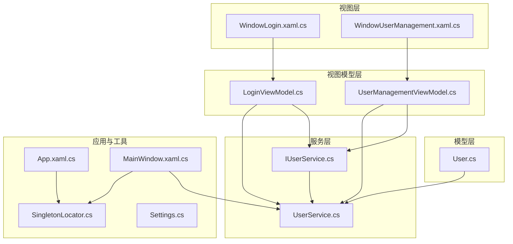
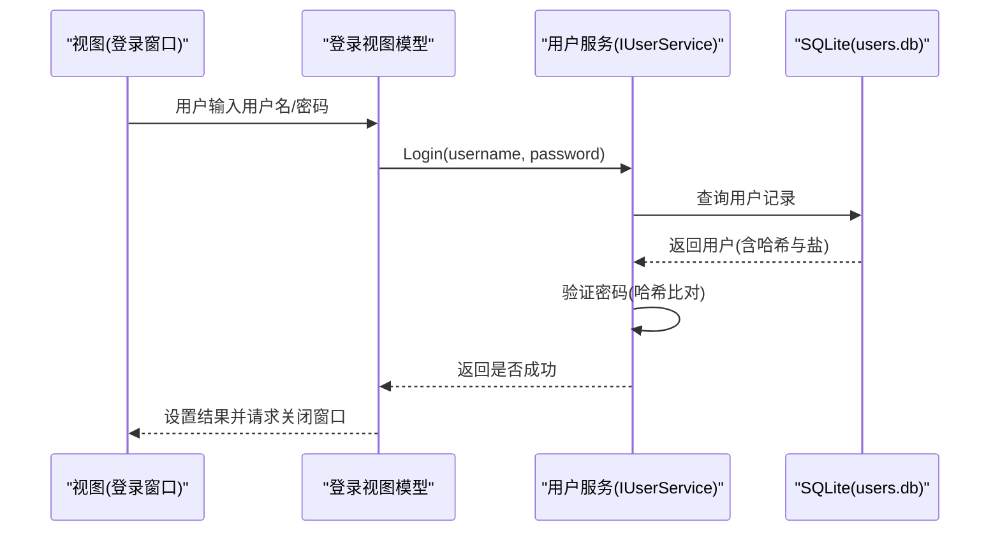
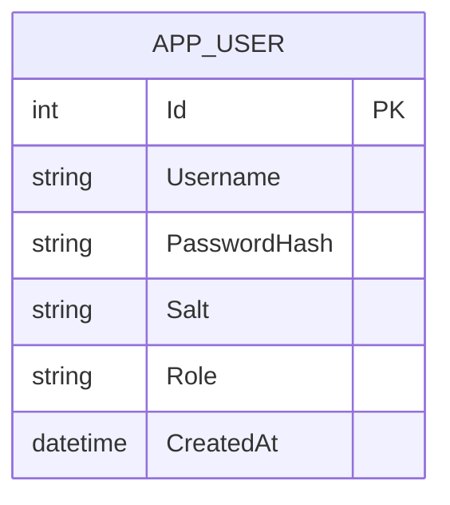
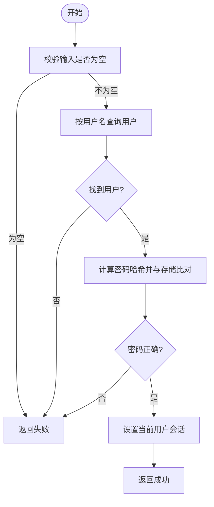
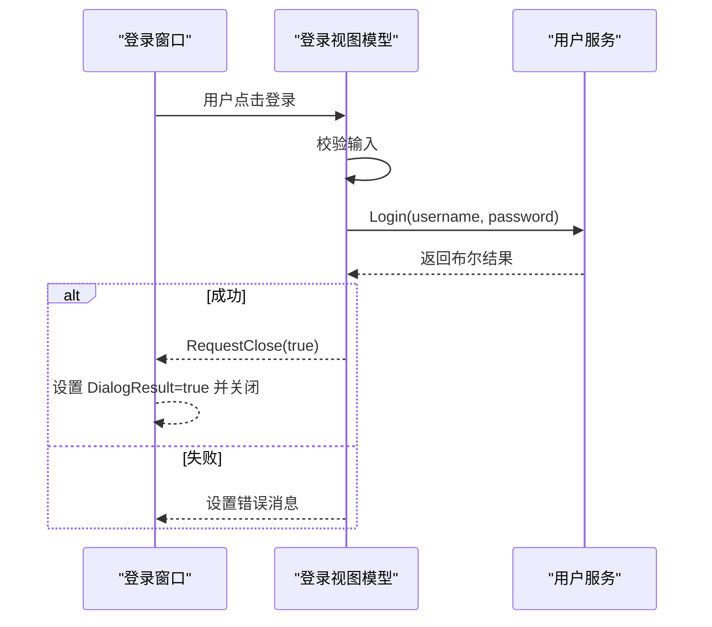
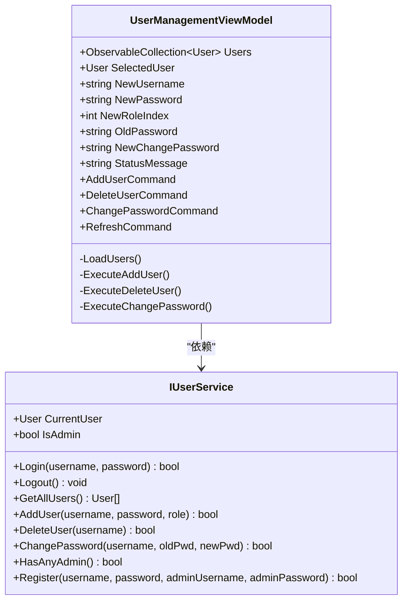
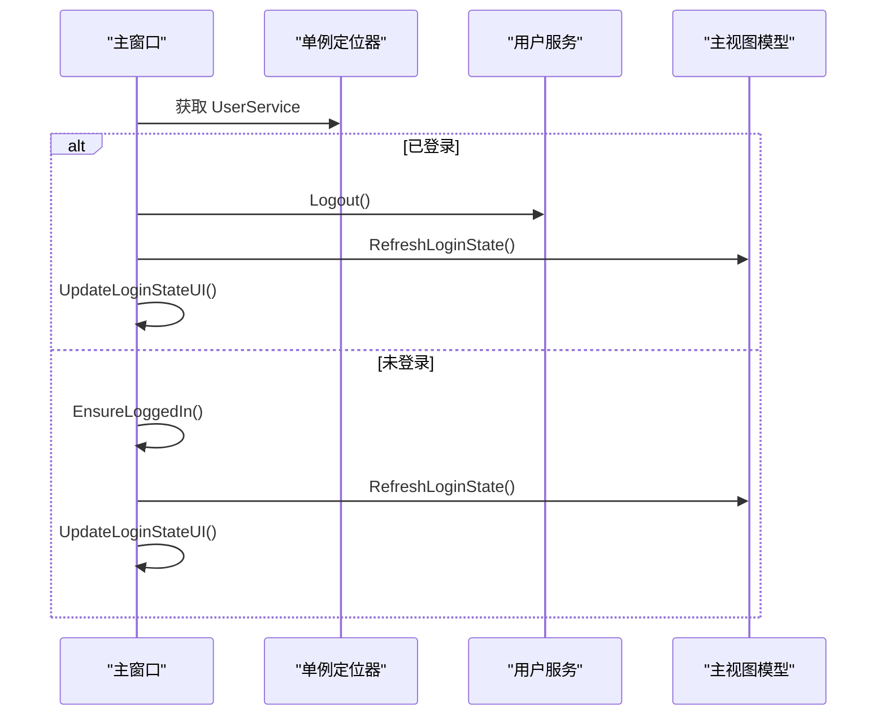
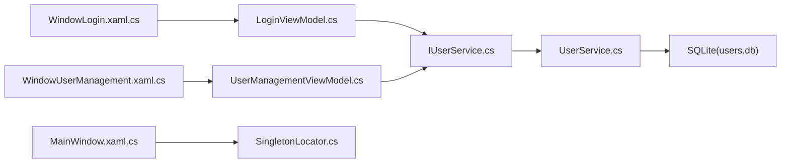

# 用户管理系统

<cite>
**本文引用的文件**   
- [User.cs](file://ShaoLu/Models/User.cs)
- [IUserService.cs](file://ShaoLu/Services/IUserService.cs)
- [UserService.cs](file://ShaoLu/Services/UserService.cs)
- [LoginViewModel.cs](file://ShaoLu/Viewmodels/LoginViewModel.cs)
- [WindowLogin.xaml.cs](file://ShaoLu/Views/WindowLogin.xaml.cs)
- [UserManagementViewModel.cs](file://ShaoLu/Viewmodels/UserManagementViewModel.cs)
- [WindowUserManagement.xaml.cs](file://ShaoLu/Views/WindowUserManagement.xaml.cs)
- [MainWindow.xaml.cs](file://ShaoLu/MainWindow.xaml.cs)
- [App.xaml.cs](file://ShaoLu/App.xaml.cs)
- [SingletonLocator.cs](file://ShaoLu/Utils/SingletonLocator.cs)
- [Settings.cs](file://ShaoLu/Models/Settings.cs)
</cite>

## 目录
1. [简介](#简介)
2. [项目结构](#项目结构)
3. [核心组件](#核心组件)
4. [架构总览](#架构总览)
5. [详细组件分析](#详细组件分析)
6. [依赖关系分析](#依赖关系分析)
7. [性能考虑](#性能考虑)
8. [故障排查指南](#故障排查指南)
9. [结论](#结论)
10. [附录](#附录)

## 简介
本文件为 ShaoLu 用户管理系统的技术文档，聚焦以下目标：
- 用户认证流程：登录验证、权限检查与会话管理
- 角色与权限控制：管理员与普通用户的访问差异
- 数据存储与管理：SQLite 表结构与数据操作
- 用户界面功能：用户列表管理、权限分配、状态监控
- 系统设置集成：用户配置持久化
- 安全考虑：密码加密、会话管理与防暴力破解建议
- 最佳实践与常见问题解决方案

## 项目结构
用户管理相关代码主要分布在 Models、Services、Viewmodels、Views 四个层次：
- Models：用户模型与角色枚举
- Services：用户服务（认证、CRUD、注册）
- Viewmodels：登录与用户管理的视图模型
- Views：登录窗口与用户管理窗口的交互逻辑
- 入口与全局：应用启动、依赖注入、单例定位器

图表来源
- [User.cs:1-33](file://ShaoLu/Models/User.cs#L1-L33)
- [IUserService.cs:1-20](file://ShaoLu/Services/IUserService.cs#L1-L20)
- [UserService.cs:1-239](file://ShaoLu/Services/UserService.cs#L1-L239)
- [LoginViewModel.cs:1-251](file://ShaoLu/Viewmodels/LoginViewModel.cs#L1-L251)
- [UserManagementViewModel.cs:1-194](file://ShaoLu/Viewmodels/UserManagementViewModel.cs#L1-L194)
- [WindowLogin.xaml.cs:1-87](file://ShaoLu/Views/WindowLogin.xaml.cs#L1-L87)
- [WindowUserManagement.xaml.cs:1-33](file://ShaoLu/Views/WindowUserManagement.xaml.cs#L1-L33)
- [App.xaml.cs:1-86](file://ShaoLu/App.xaml.cs#L1-L86)
- [MainWindow.xaml.cs:1-316](file://ShaoLu/MainWindow.xaml.cs#L1-L316)
- [SingletonLocator.cs:1-19](file://ShaoLu/Utils/SingletonLocator.cs#L1-L19)
- [Settings.cs:1-76](file://ShaoLu/Models/Settings.cs#L1-L76)

章节来源
- [App.xaml.cs:1-86](file://ShaoLu/App.xaml.cs#L1-L86)
- [MainWindow.xaml.cs:1-316](file://ShaoLu/MainWindow.xaml.cs#L1-L316)
- [SingletonLocator.cs:1-19](file://ShaoLu/Utils/SingletonLocator.cs#L1-L19)

## 核心组件
- 用户模型与角色
  - 用户实体包含标识、用户名、密码哈希、盐值、角色与创建时间
  - 角色枚举包含管理员与普通用户两类
- 用户服务接口与实现
  - 提供登录、注销、用户查询、新增、删除、修改密码、注册、管理员存在性检查等能力
  - 使用 FreeSql + SQLite 进行数据持久化，自动建表
- 登录视图模型
  - 处理登录与注册表单校验、错误消息、切换模式、调用服务完成认证与注册
- 用户管理视图模型
  - 维护用户集合、选择项、新增/删除/改密操作的状态与命令
- 视图窗口
  - 登录窗口负责绑定 PasswordBox 到 ViewModel、键盘事件、关闭回调
  - 用户管理窗口负责将密码框输入同步到 ViewModel

章节来源
- [User.cs:1-33](file://ShaoLu/Models/User.cs#L1-L33)
- [IUserService.cs:1-20](file://ShaoLu/Services/IUserService.cs#L1-L20)
- [UserService.cs:1-239](file://ShaoLu/Services/UserService.cs#L1-L239)
- [LoginViewModel.cs:1-251](file://ShaoLu/Viewmodels/LoginViewModel.cs#L1-L251)
- [UserManagementViewModel.cs:1-194](file://ShaoLu/Viewmodels/UserManagementViewModel.cs#L1-L194)
- [WindowLogin.xaml.cs:1-87](file://ShaoLu/Views/WindowLogin.xaml.cs#L1-L87)
- [WindowUserManagement.xaml.cs:1-33](file://ShaoLu/Views/WindowUserManagement.xaml.cs#L1-L33)

## 架构总览
整体采用 MVVM 分层与依赖注入：
- 视图层通过 XAML 与 Code-behind 绑定 ViewModel
- ViewModel 通过 Ioc 容器获取 IUserService 实例
- UserService 封装 FreeSql + SQLite 的数据访问
- 主窗口在需要时弹出登录或用户管理窗口，并基于当前用户状态更新 UI

图表来源
- [WindowLogin.xaml.cs:1-87](file://ShaoLu/Views/WindowLogin.xaml.cs#L1-L87)
- [LoginViewModel.cs:1-251](file://ShaoLu/Viewmodels/LoginViewModel.cs#L1-L251)
- [UserService.cs:1-239](file://ShaoLu/Services/UserService.cs#L1-L239)

章节来源
- [App.xaml.cs:1-86](file://ShaoLu/App.xaml.cs#L1-L86)
- [MainWindow.xaml.cs:1-316](file://ShaoLu/MainWindow.xaml.cs#L1-L316)

## 详细组件分析

### 用户模型与数据库表结构
- 表名：app_user
- 字段：
  - Id：自增主键
  - Username：用户名（非空，长度限制）
  - PasswordHash：密码哈希（Base64 存储）
  - Salt：随机盐（Base64 存储）
  - Role：角色（映射为字符串）
  - CreatedAt：创建时间

图表来源
- [User.cs:1-33](file://ShaoLu/Models/User.cs#L1-L33)

章节来源
- [User.cs:1-33](file://ShaoLu/Models/User.cs#L1-L33)

### 用户服务（认证、权限、CRUD、注册）
- 认证流程
  - 查找用户 → 校验密码哈希（PBKDF2-SHA256 + 盐）→ 设置 CurrentUser → 返回成功
  - 常量时间比较防止时序攻击
- 权限检查
  - IsAdmin 属性基于 CurrentUser.Role 判断
- 会话管理
  - CurrentUser 作为进程内会话；Logout 清空会话
- 用户管理
  - GetAllUsers、AddUser、DeleteUser、ChangePassword
  - DeleteUser 保护最后一个管理员不被删除
- 注册流程
  - 若系统中已有管理员，则需管理员审批（用户名+密码校验）
  - 新用户默认赋予管理员角色（便于首次初始化）

图表来源
- [UserService.cs:1-239](file://ShaoLu/Services/UserService.cs#L1-L239)

章节来源
- [UserService.cs:1-239](file://ShaoLu/Services/UserService.cs#L1-L239)

### 登录视图模型与窗口交互
- 登录模式
  - 校验用户名/密码非空 → 调用服务登录 → 成功后触发 RequestClose(true)
  - 失败时设置错误消息
- 注册模式
  - 支持切换到注册模式，根据是否存在管理员决定是否要求管理员审批
  - 校验用户名、密码、确认密码、最小长度、管理员凭据（如需要）
  - 调用服务注册后，预填用户名并切换回登录模式
- 窗口交互
  - PasswordBox 的 PasswordChanged 事件同步到 ViewModel
  - Enter/Esc 快捷键触发登录/取消
  - 通过 RequestClose 事件控制窗口关闭与返回值

图表来源
- [LoginViewModel.cs:1-251](file://ShaoLu/Viewmodels/LoginViewModel.cs#L1-L251)
- [WindowLogin.xaml.cs:1-87](file://ShaoLu/Views/WindowLogin.xaml.cs#L1-L87)

章节来源
- [LoginViewModel.cs:1-251](file://ShaoLu/Viewmodels/LoginViewModel.cs#L1-L251)
- [WindowLogin.xaml.cs:1-87](file://ShaoLu/Views/WindowLogin.xaml.cs#L1-L87)

### 用户管理视图模型与窗口
- 用户列表
  - 加载所有用户到 ObservableCollection，用于数据绑定展示
- 新增用户
  - 校验用户名与密码 → 选择角色（管理员/普通用户）→ 调用服务添加 → 刷新列表
- 删除用户
  - 禁止删除自身 → 二次确认 → 调用服务删除 → 刷新列表
- 修改密码
  - 选择用户 → 校验旧密码与新密码 → 调用服务修改 → 提示结果

图表来源
- [UserManagementViewModel.cs:1-194](file://ShaoLu/Viewmodels/UserManagementViewModel.cs#L1-L194)
- [IUserService.cs:1-20](file://ShaoLu/Services/IUserService.cs#L1-L20)

章节来源
- [UserManagementViewModel.cs:1-194](file://ShaoLu/Viewmodels/UserManagementViewModel.cs#L1-L194)
- [WindowUserManagement.xaml.cs:1-33](file://ShaoLu/Views/WindowUserManagement.xaml.cs#L1-L33)

### 主窗口与会话集成
- 登录/注销菜单
  - 已登录显示“注销”并携带用户名；未登录显示“登录”
- 确保登录
  - 关键操作前调用 EnsureLoggedIn，未登录弹出登录窗口
  - 登录成功后刷新主视图模型的用户状态并更新菜单文本
- 用户管理入口
  - 从 Ioc 容器解析 UserManagementViewModel，打开用户管理窗口

图表来源
- [MainWindow.xaml.cs:1-316](file://ShaoLu/MainWindow.xaml.cs#L1-L316)
- [SingletonLocator.cs:1-19](file://ShaoLu/Utils/SingletonLocator.cs#L1-L19)

章节来源
- [MainWindow.xaml.cs:1-316](file://ShaoLu/MainWindow.xaml.cs#L1-L316)
- [SingletonLocator.cs:1-19](file://ShaoLu/Utils/SingletonLocator.cs#L1-L19)

### 应用启动与依赖注入
- 语言服务初始化
- 依赖注入容器注册
  - 单例：MainViewModel、StepsViewModel、FileServices、IUserService
  - 瞬态：LoginViewModel、UserManagementViewModel
- 构建 Ioc 容器并暴露给全局 Ioc.Default
- 启动主窗口

章节来源
- [App.xaml.cs:1-86](file://ShaoLu/App.xaml.cs#L1-L86)

### 系统设置与用户配置持久化
- AppSettings 包含应用、步骤、用户设置等
- UserSettingsModel 支持记住用户与上次用户名
- SettingsService 负责加载/保存（由 SingletonLocator.Settings 获取）

章节来源
- [Settings.cs:1-76](file://ShaoLu/Models/Settings.cs#L1-L76)
- [SingletonLocator.cs:1-19](file://ShaoLu/Utils/SingletonLocator.cs#L1-L19)

## 依赖关系分析
- 视图层依赖 ViewModel（XAML 绑定与 Code-behind 事件）
- ViewModel 依赖 IUserService（通过 Ioc 容器解析）
- UserService 依赖 FreeSql + SQLite（users.db）
- 主窗口通过 SingletonLocator.UserService 访问当前会话

图表来源
- [WindowLogin.xaml.cs:1-87](file://ShaoLu/Views/WindowLogin.xaml.cs#L1-L87)
- [WindowUserManagement.xaml.cs:1-33](file://ShaoLu/Views/WindowUserManagement.xaml.cs#L1-L33)
- [MainWindow.xaml.cs:1-316](file://ShaoLu/MainWindow.xaml.cs#L1-L316)
- [SingletonLocator.cs:1-19](file://ShaoLu/Utils/SingletonLocator.cs#L1-L19)
- [IUserService.cs:1-20](file://ShaoLu/Services/IUserService.cs#L1-L20)
- [UserService.cs:1-239](file://ShaoLu/Services/UserService.cs#L1-L239)

章节来源
- [App.xaml.cs:1-86](file://ShaoLu/App.xaml.cs#L1-L86)
- [SingletonLocator.cs:1-19](file://ShaoLu/Utils/SingletonLocator.cs#L1-L19)

## 性能考虑
- 数据库连接
  - 使用 Lazy 初始化 FreeSql，避免重复创建连接
  - 自动建表减少手动迁移成本
- 密码哈希
  - PBKDF2-SHA256 迭代次数为 10000，兼顾安全与性能
- 内存与 UI
  - 用户列表使用 ObservableCollection，适合 WPF 数据绑定
  - 频繁刷新场景下注意批量更新与去抖（当前实现简单直接）
- 建议优化
  - 对大量用户分页加载
  - 异步化耗时操作（如注册、改密）避免阻塞 UI
  - 增加数据库索引（Username、Role）提升查询效率

[本节为通用指导，不直接分析具体文件]

## 故障排查指南
- 登录失败
  - 检查用户名是否存在、密码是否正确
  - 查看服务返回的错误消息（ViewModel 中 ErrorMessage）
- 注册失败
  - 当系统已有管理员时，需提供管理员用户名与密码
  - 检查密码长度与一致性校验
- 删除用户失败
  - 不能删除最后一个管理员账户
  - 不能删除当前登录用户
- 会话异常
  - 注销后 CurrentUser 被清空，再次操作会触发登录弹窗
- 数据库问题
  - 确认 users.db 路径可写（ApplicationData/AutoShaoLu）
  - 检查 FreeSql 自动建表是否生效

章节来源
- [LoginViewModel.cs:1-251](file://ShaoLu/Viewmodels/LoginViewModel.cs#L1-L251)
- [UserService.cs:1-239](file://ShaoLu/Services/UserService.cs#L1-L239)
- [UserManagementViewModel.cs:1-194](file://ShaoLu/Viewmodels/UserManagementViewModel.cs#L1-L194)

## 结论
ShaoLu 用户管理系统以清晰的 MVVM 分层与依赖注入为基础，结合 FreeSql + SQLite 实现了安全的用户认证与基础权限控制。通过登录/注册流程、管理员审批机制与进程内会话管理，满足桌面应用的常见需求。建议在后续版本中引入异步化、分页与更细粒度的权限策略，以提升可扩展性与用户体验。

[本节为总结性内容，不直接分析具体文件]

## 附录

### 安全最佳实践
- 密码加密
  - 使用 PBKDF2-SHA256 + 随机盐，避免明文存储
  - 常量时间比较防止时序攻击
- 会话管理
  - 进程内 CurrentUser 作为会话载体，注销即清空
  - 敏感操作前检查 IsAdmin 或登录状态
- 防暴力破解建议
  - 增加登录失败计数与锁定策略（当前未实现）
  - 限制单位时间内重试次数（可在 ViewModel 或服务层扩展）
  - 审计日志记录登录尝试（可扩展日志服务）

章节来源
- [UserService.cs:1-239](file://ShaoLu/Services/UserService.cs#L1-L239)
- [LoginViewModel.cs:1-251](file://ShaoLu/Viewmodels/LoginViewModel.cs#L1-L251)

### 常见问题解决方案
- 无法打开用户管理窗口
  - 确保已登录；EnsureLoggedIn 会自动弹出登录窗口
- 注册后无法登录
  - 检查注册是否成功，必要时重新输入用户名与密码
- 修改密码失败
  - 确认旧密码正确；若失败请重试或重置密码（管理员操作）
- 界面语言不一致
  - 检查 LanguageService 初始化与当前语言设置

章节来源
- [MainWindow.xaml.cs:1-316](file://ShaoLu/MainWindow.xaml.cs#L1-L316)
- [LoginViewModel.cs:1-251](file://ShaoLu/Viewmodels/LoginViewModel.cs#L1-L251)
- [UserManagementViewModel.cs:1-194](file://ShaoLu/Viewmodels/UserManagementViewModel.cs#L1-L194)