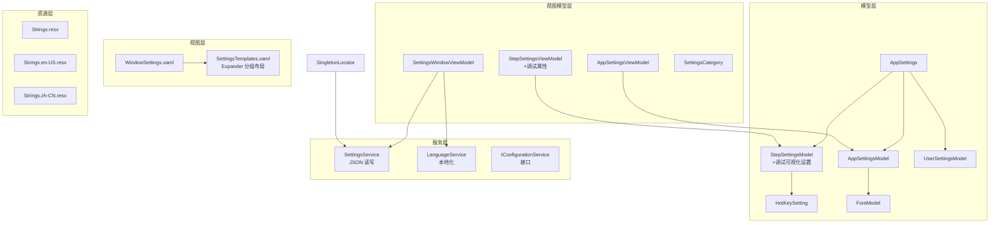
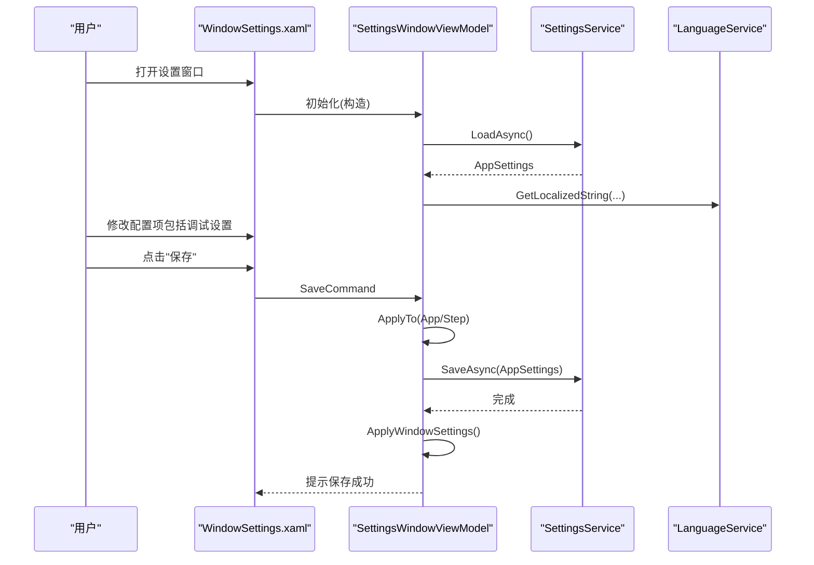
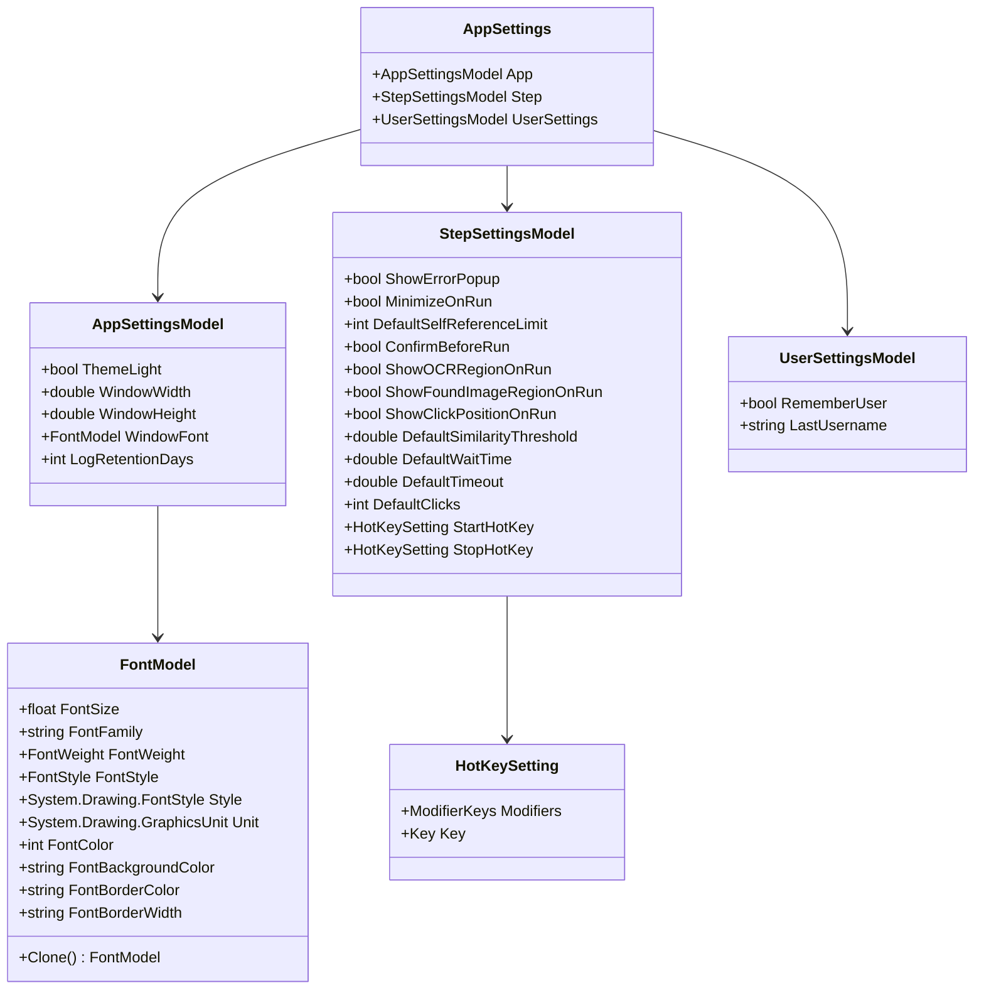
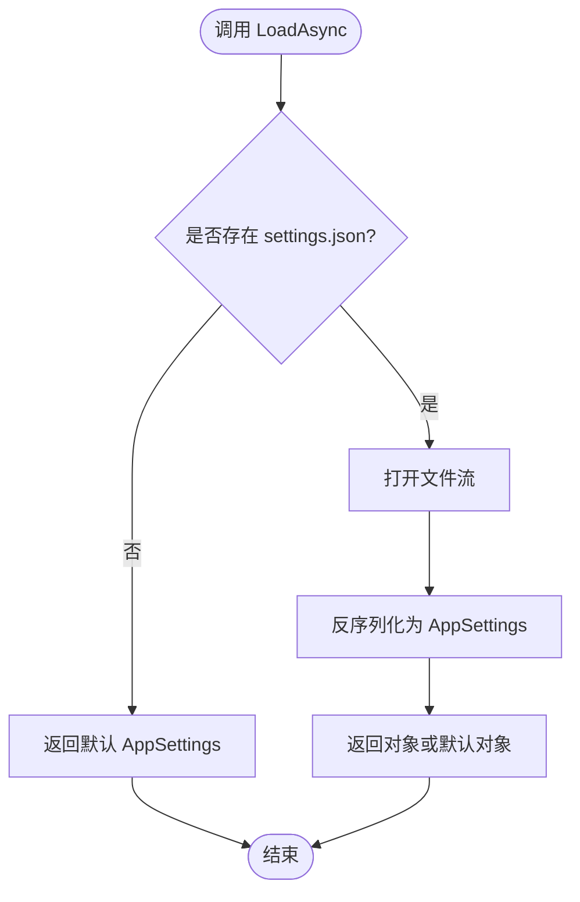
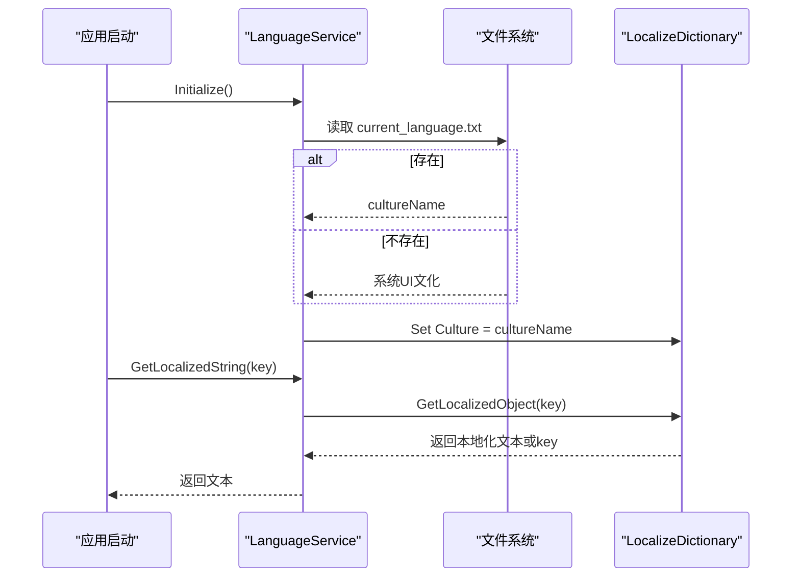
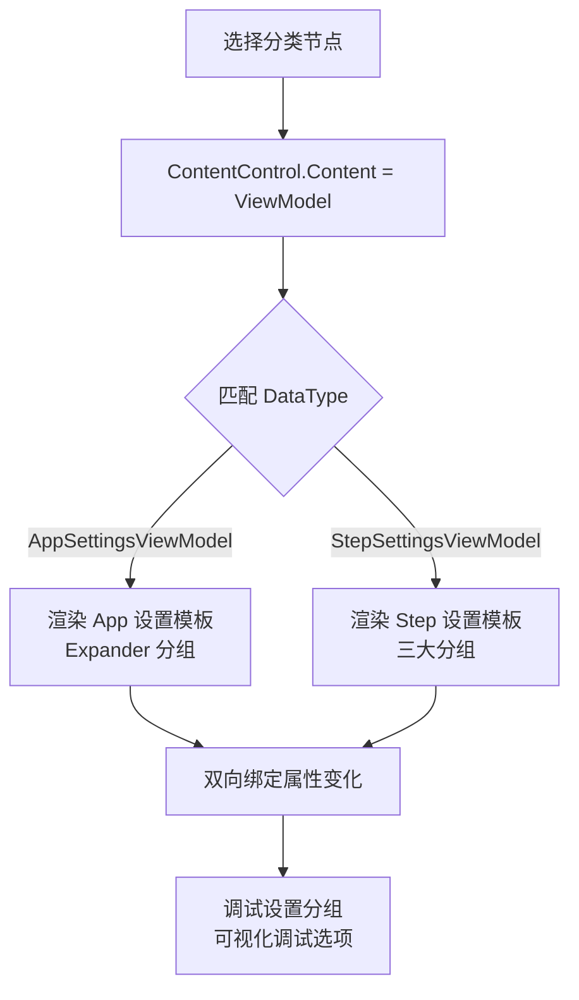
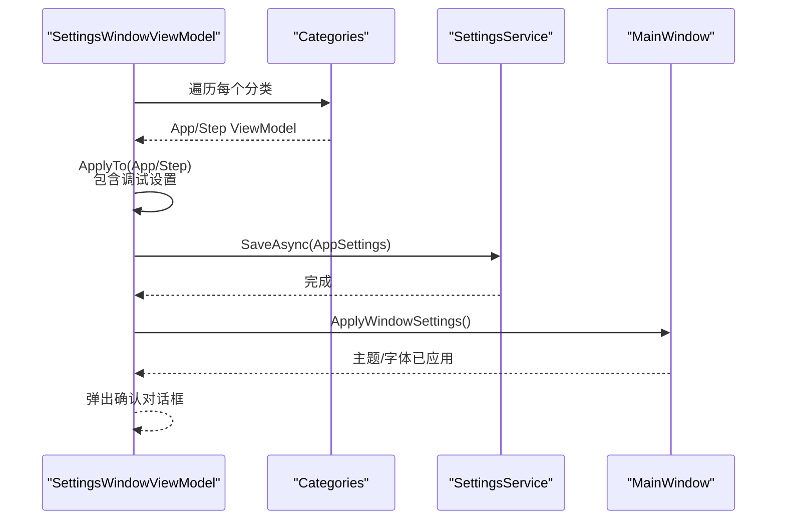
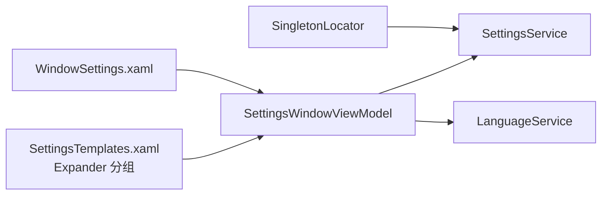

# 系统设置管理

<cite>
**本文引用的文件**   
- [Settings.cs](file://ShaoLu/Models/Settings.cs)
- [FontModel.cs](file://ShaoLu/Models/FontModel.cs)
- [SettingsService.cs](file://ShaoLu/Services/SettingsService.cs)
- [LanguageService.cs](file://ShaoLu/Services/LanguageService.cs)
- [SettingsViewModel.cs](file://ShaoLu/Viewmodels/SettingsViewModel.cs)
- [WindowSettings.xaml](file://ShaoLu/Views/WindowSettings.xaml)
- [SettingsTemplates.xaml](file://ShaoLu/Templates/SettingsTemplates.xaml)
- [Strings.resx](file://ShaoLu/Resources/Strings.resx)
- [Strings.en-US.resx](file://ShaoLu/Resources/Strings.en-US.resx)
- [Strings.zh-CN.resx](file://ShaoLu/Resources/Strings.zh-CN.resx)
- [SingletonLocator.cs](file://ShaoLu/Utils/SingletonLocator.cs)
- [IConfigurationService.cs](file://ShaoLu/Services/IConfigurationService.cs)
</cite>

## 更新摘要
**所做更改**   
- 新增调试可视化设置功能（ShowOCRRegionOnRun、ShowFoundImageRegionOnRun、ShowClickPositionOnRun）
- 重构设置模板布局，从扁平结构改为基于 Expander 的可折叠分组组织
- 新增"调试设置"分类，提供运行时可视化调试选项
- 完善多语言支持，为所有新设置项添加中英文本地化文本

## 目录
1. [简介](#简介)
2. [项目结构](#项目结构)
3. [核心组件](#核心组件)
4. [架构总览](#架构总览)
5. [详细组件分析](#详细组件分析)
6. [依赖关系分析](#依赖关系分析)
7. [性能考虑](#性能考虑)
8. [故障排查指南](#故障排查指南)
9. [结论](#结论)
10. [附录](#附录)

## 简介
本文件为 ShaoLu 系统设置管理系统的技术文档，聚焦以下方面：
- 设置数据的存储机制与 JSON 文件格式、配置项结构
- 多语言支持实现与 LanguageService 的工作原理、资源文件管理
- 设置界面功能：各类配置项的编辑与验证
- 主题切换机制、动态样式加载与界面刷新
- 设置项默认值、验证规则与迁移机制
- 配置备份与恢复、导入导出操作
- 自定义设置项扩展方法与最佳实践

## 项目结构
设置相关代码主要分布在 Models、Services、Viewmodels、Views、Templates、Resources 等目录：
- Models：定义 AppSettings、AppSettingsModel、StepSettingsModel、UserSettingsModel、HotKeySetting、FontModel 等数据结构
- Services：SettingsService（JSON 持久化）、LanguageService（本地化）
- Viewmodels：SettingsWindowViewModel、AppSettingsViewModel、StepSettingsViewModel、SettingsCategory
- Views：WindowSettings（设置窗口 UI）
- Templates：SettingsTemplates.xaml（按 ViewModel 类型动态渲染设置面板）
- Resources：Strings.*.resx（多语言文本）
- Utils：SingletonLocator（全局单例访问，含 Settings）

**图表来源**
- [Settings.cs:1-94](file://ShaoLu/Models/Settings.cs#L1-L94)
- [FontModel.cs:1-46](file://ShaoLu/Models/FontModel.cs#L1-L46)
- [SettingsService.cs:1-38](file://ShaoLu/Services/SettingsService.cs#L1-L38)
- [LanguageService.cs:1-67](file://ShaoLu/Services/LanguageService.cs#L1-L67)
- [SettingsViewModel.cs:1-258](file://ShaoLu/Viewmodels/SettingsViewModel.cs#L1-L258)
- [WindowSettings.xaml:1-67](file://ShaoLu/Views/WindowSettings.xaml#L1-L67)
- [SettingsTemplates.xaml:1-183](file://ShaoLu/Templates/SettingsTemplates.xaml#L1-L183)
- [Strings.resx:1-828](file://ShaoLu/Resources/Strings.resx#L1-L828)
- [Strings.en-US.resx:1-828](file://ShaoLu/Resources/Strings.en-US.resx#L1-L828)
- [Strings.zh-CN.resx:1-834](file://ShaoLu/Resources/Strings.zh-CN.resx#L1-L834)
- [SingletonLocator.cs:1-19](file://ShaoLu/Utils/SingletonLocator.cs#L1-L19)
- [IConfigurationService.cs:1-12](file://ShaoLu/Services/IConfigurationService.cs#L1-L12)

**章节来源**
- [Settings.cs:1-94](file://ShaoLu/Models/Settings.cs#L1-L94)
- [SettingsService.cs:1-38](file://ShaoLu/Services/SettingsService.cs#L1-L38)
- [LanguageService.cs:1-67](file://ShaoLu/Services/LanguageService.cs#L1-L67)
- [SettingsViewModel.cs:1-258](file://ShaoLu/Viewmodels/SettingsViewModel.cs#L1-L258)
- [WindowSettings.xaml:1-67](file://ShaoLu/Views/WindowSettings.xaml#L1-L67)
- [SettingsTemplates.xaml:1-183](file://ShaoLu/Templates/SettingsTemplates.xaml#L1-L183)
- [Strings.resx:1-828](file://ShaoLu/Resources/Strings.resx#L1-L828)
- [Strings.en-US.resx:1-828](file://ShaoLu/Resources/Strings.en-US.resx#L1-L828)
- [Strings.zh-CN.resx:1-834](file://ShaoLu/Resources/Strings.zh-CN.resx#L1-L834)
- [SingletonLocator.cs:1-19](file://ShaoLu/Utils/SingletonLocator.cs#L1-L19)
- [IConfigurationService.cs:1-12](file://ShaoLu/Services/IConfigurationService.cs#L1-L12)

## 核心组件
- 数据模型
  - AppSettings：顶层容器，包含 App、Step、UserSettings 三个子配置段
  - AppSettingsModel：应用级设置（主题、窗口尺寸、字体、日志保留天数）
  - StepSettingsModel：步骤运行参数（错误弹窗、最小化、确认运行、默认阈值/等待/超时/点击次数、热键）**新增调试可视化设置**
  - UserSettingsModel：用户偏好（记住用户名、上次用户名）
  - HotKeySetting：修饰键 + 主键
  - FontModel：字体族、字号、粗细、样式、单位、颜色等
- 服务
  - SettingsService：settings.json 的异步读取与保存
  - LanguageService：当前语言初始化、设置与持久化、字符串获取
- 视图模型
  - SettingsWindowViewModel：构建分类树、保存命令、应用窗口设置
  - AppSettingsViewModel：绑定 App 设置并回写
  - StepSettingsViewModel：绑定 Step 设置并回写，**包含调试可视化属性**
  - SettingsCategory：树节点（标题、子节点、展开状态、对应 ViewModel）
- 视图与模板
  - WindowSettings.xaml：左侧 TreeView，右侧 ContentControl 动态加载 DataTemplate
  - SettingsTemplates.xaml：**重构为 Expander 分组布局**，按功能模块组织设置项
- 资源
  - Strings.*.resx：多语言文案，通过 WPFLocalizeExtension 在 XAML 中使用 lex:Loc

**章节来源**
- [Settings.cs:1-94](file://ShaoLu/Models/Settings.cs#L1-L94)
- [FontModel.cs:1-46](file://ShaoLu/Models/FontModel.cs#L1-L46)
- [SettingsService.cs:1-38](file://ShaoLu/Services/SettingsService.cs#L1-L38)
- [LanguageService.cs:1-67](file://ShaoLu/Services/LanguageService.cs#L1-L67)
- [SettingsViewModel.cs:1-258](file://ShaoLu/Viewmodels/SettingsViewModel.cs#L1-L258)
- [WindowSettings.xaml:1-67](file://ShaoLu/Views/WindowSettings.xaml#L1-L67)
- [SettingsTemplates.xaml:1-183](file://ShaoLu/Templates/SettingsTemplates.xaml#L1-L183)
- [Strings.resx:1-828](file://ShaoLu/Resources/Strings.resx#L1-L828)
- [Strings.en-US.resx:1-828](file://ShaoLu/Resources/Strings.en-US.resx#L1-L828)
- [Strings.zh-CN.resx:1-834](file://ShaoLu/Resources/Strings.zh-CN.resx#L1-L834)

## 架构总览
设置系统采用 MVVM 分层：
- 模型层：纯数据对象，定义默认值与结构
- 服务层：负责 I/O（JSON 文件、语言文件）
- 视图模型层：承载交互逻辑、命令、数据回写
- 视图层：XAML 绑定到 ViewModel，模板根据类型动态渲染
- 资源层：多语言文案，运行时由 LanguageService 切换

**图表来源**
- [SettingsViewModel.cs:208-233](file://ShaoLu/Viewmodels/SettingsViewModel.cs#L208-L233)
- [SettingsService.cs:1-38](file://ShaoLu/Services/SettingsService.cs#L1-L38)
- [LanguageService.cs:1-67](file://ShaoLu/Services/LanguageService.cs#L1-L67)
- [WindowSettings.xaml:1-67](file://ShaoLu/Views/WindowSettings.xaml#L1-L67)

## 详细组件分析

### 数据模型与默认值
- AppSettingsModel
  - ThemeLight：布尔，默认亮色主题
  - WindowWidth/Height：窗口尺寸默认值
  - WindowFont：字体模型，默认使用系统消息字体
  - LogRetentionDays：日志保留天数，0 表示永不清理
- StepSettingsModel
  - ShowErrorPopup、MinimizeOnRun、ConfirmBeforeRun：行为开关
  - DefaultSelfReferenceLimit：自引用上限
  - **ShowOCRRegionOnRun**：运行时显示 OCR 识别区域覆盖层（默认 true）
  - **ShowFoundImageRegionOnRun**：找到图像时显示匹配区域覆盖层（默认 false）
  - **ShowClickPositionOnRun**：点击时显示点击位置覆盖层（默认 false）
  - DefaultSimilarityThreshold：图像相似度阈值默认值
  - DefaultWaitTime/DefaultTimeout：默认等待/超时时间
  - DefaultClicks：默认点击次数
  - StartHotKey/StopHotKey：启动/停止快捷键
- UserSettingsModel
  - RememberUser、LastUsername：记住用户信息
- HotKeySetting
  - Modifiers、Key：组合键与主键
- FontModel
  - 字体族、字号、粗细、样式、单位、颜色等；提供 Clone 方法

**图表来源**
- [Settings.cs:1-94](file://ShaoLu/Models/Settings.cs#L1-L94)
- [FontModel.cs:1-46](file://ShaoLu/Models/FontModel.cs#L1-L46)

**章节来源**
- [Settings.cs:1-94](file://ShaoLu/Models/Settings.cs#L1-L94)
- [FontModel.cs:1-46](file://ShaoLu/Models/FontModel.cs#L1-L46)

### 设置持久化（JSON）
- 路径：应用程序根目录下的 settings.json
- 序列化选项：WriteIndented=true，便于人工编辑
- 加载：不存在则返回默认 AppSettings；存在则反序列化为对象
- 保存：覆盖写入当前文件

**图表来源**
- [SettingsService.cs:1-38](file://ShaoLu/Services/SettingsService.cs#L1-L38)

**章节来源**
- [SettingsService.cs:1-38](file://ShaoLu/Services/SettingsService.cs#L1-L38)

### 多语言支持（LanguageService 与 ResX）
- 初始化：优先读取 current_language.txt，否则使用系统 UI 文化
- 设置语言：设置 LocalizeDictionary.Culture，并持久化到 current_language.txt
- 获取字符串：通过 LocalizeDictionary.GetLocalizedObject，找不到时返回 key 或默认值
- 资源文件：Strings.resx（默认）、Strings.en-US.resx、Strings.zh-CN.resx、Strings.zh-TW.resx
- XAML 使用：lex:Loc 标记扩展绑定文案
- **新增调试设置多语言支持**：所有调试可视化选项均提供中英文本地化文本

**图表来源**
- [LanguageService.cs:1-67](file://ShaoLu/Services/LanguageService.cs#L1-L67)
- [Strings.resx:805-828](file://ShaoLu/Resources/Strings.resx#L805-L828)
- [Strings.en-US.resx:805-828](file://ShaoLu/Resources/Strings.en-US.resx#L805-L828)
- [Strings.zh-CN.resx:810-834](file://ShaoLu/Resources/Strings.zh-CN.resx#L810-L834)

**章节来源**
- [LanguageService.cs:1-67](file://ShaoLu/Services/LanguageService.cs#L1-L67)
- [Strings.resx:805-828](file://ShaoLu/Resources/Strings.resx#L805-L828)
- [Strings.en-US.resx:805-828](file://ShaoLu/Resources/Strings.en-US.resx#L805-L828)
- [Strings.zh-CN.resx:810-834](file://ShaoLu/Resources/Strings.zh-CN.resx#L810-L834)

### 设置界面与模板
- WindowSettings.xaml
  - 左侧 TreeView 绑定 Categories，选中项变更触发右侧内容更新
  - 右侧 ContentControl 绑定 SelectedCategory.ViewModel，并通过 ResourceDictionary 合并 SettingsTemplates.xaml
- SettingsTemplates.xaml
  - **重构为 Expander 分组布局**：将扁平的 StackPanel 结构改为可折叠的分组组织
  - **App 设置分组**：主题、字体、日志保留天数分别独立分组
  - **Step 设置分组**：运行行为、默认参数、调试设置三大分类
  - **调试设置分组**：新增 ShowOCRRegionOnRun、ShowFoundImageRegionOnRun、ShowClickPositionOnRun 三个可视化调试选项
  - 针对 AppSettingsViewModel 和 StepSettingsViewModel 分别定义 DataTemplate
  - 使用 wd:NumericBox、TextBox、CheckBox、ToggleButton 等控件进行双向绑定
  - 所有文案通过 lex:Loc 绑定多语言资源

**图表来源**
- [WindowSettings.xaml:1-67](file://ShaoLu/Views/WindowSettings.xaml#L1-L67)
- [SettingsTemplates.xaml:1-183](file://ShaoLu/Templates/SettingsTemplates.xaml#L1-L183)

**章节来源**
- [WindowSettings.xaml:1-67](file://ShaoLu/Views/WindowSettings.xaml#L1-L67)
- [SettingsTemplates.xaml:1-183](file://ShaoLu/Templates/SettingsTemplates.xaml#L1-L183)

### 保存流程与窗口设置应用
- 保存命令
  - 遍历 Categories，将 ViewModel 的值 ApplyTo 到对应的 AppSettingsModel/StepSettingsModel
  - 调用 SettingsService.SaveAsync 持久化
  - 调用 ApplyWindowSettings 应用主题与字体
  - 弹出确认对话框（语言化），可选择关闭窗口
- 窗口设置应用
  - 通过 ThemeManager.Instance.SetTheme 切换主题
  - 设置 Application.Current.MainWindow 的字体族与字号

**图表来源**
- [SettingsViewModel.cs:208-233](file://ShaoLu/Viewmodels/SettingsViewModel.cs#L208-L233)
- [SettingsService.cs:1-38](file://ShaoLu/Services/SettingsService.cs#L1-L38)

**章节来源**
- [SettingsViewModel.cs:208-233](file://ShaoLu/Viewmodels/SettingsViewModel.cs#L208-L233)

### 默认值、验证与输入约束
- 默认值
  - 各模型类字段均提供合理默认值（如主题亮色、窗口尺寸、阈值、时间、点击次数等）
  - **调试可视化设置默认值**：ShowOCRRegionOnRun=true，其他两个默认为 false
- 验证与约束
  - NumericBox 控件设置 Minimum/Maximum/Precision/Interval，限制数值范围与精度
  - 布尔开关直接反映用户意图
  - 字体选择通过系统 FontDialog 确保有效性
- 迁移机制
  - 当前未实现显式版本迁移；新增字段建议保持向后兼容（可空或默认值）
  - 建议在 SettingsService.LoadAsync 中增加旧格式兼容处理（例如缺失字段赋默认值）

**章节来源**
- [Settings.cs:1-94](file://ShaoLu/Models/Settings.cs#L1-L94)
- [SettingsTemplates.xaml:1-183](file://ShaoLu/Templates/SettingsTemplates.xaml#L1-L183)
- [SettingsService.cs:1-38](file://ShaoLu/Services/SettingsService.cs#L1-L38)

### 主题切换与动态样式
- 主题切换
  - 通过 ThemeManager.Instance.SetTheme 切换 Light/Dark
- 动态样式
  - 设置模板通过 ResourceDictionary.MergedDictionaries 动态加载
  - 字体更改即时应用到 MainWindow
- 注意
  - 若需更细粒度样式控制，可在 Themes/Styles.xaml 中集中管理资源

**章节来源**
- [SettingsViewModel.cs:235-239](file://ShaoLu/Viewmodels/SettingsViewModel.cs#L235-L239)
- [SettingsTemplates.xaml:48-54](file://ShaoLu/Templates/SettingsTemplates.xaml#L48-L54)

### 配置备份与恢复、导入导出
- 现状
  - 未内置备份/恢复/导入导出功能
- 建议实现
  - 备份：复制 settings.json 到带时间戳的文件名
  - 恢复：选择备份文件覆盖 settings.json
  - 导入：解析外部 JSON，校验结构后合并到现有设置
  - 导出：将当前设置序列化为 JSON 供分享
- 参考接口
  - IConfigurationService 定义了通用配置存取接口，可用于扩展

**章节来源**
- [IConfigurationService.cs:1-12](file://ShaoLu/Services/IConfigurationService.cs#L1-L12)

### 自定义设置项扩展方法与最佳实践
- 扩展步骤
  - 在 Models/Settings.cs 中添加新配置项（保持默认值）
  - 在 Viewmodels/SettingsViewModel.cs 中创建新的 ViewModel（继承 ObservableObject，暴露属性与 ApplyTo）
  - 在 Templates/SettingsTemplates.xaml 中新增 DataTemplate，绑定新 ViewModel
  - 在 WindowSettings.xaml 的 BuildTree 中注册新分类节点
  - 在 Resources/Strings.*.resx 中添加对应文案
- 最佳实践
  - 使用 wpflocalizeextension 的 lex:Loc 绑定文案
  - 使用 NumericBox/CheckBox/ComboBox 等控件进行强类型输入约束
  - 对复杂对象提供 Validate/ApplyTo 方法，保证一致性
  - 对新增字段做向后兼容处理，避免破坏旧配置
  - **推荐使用 Expander 分组组织相关设置项，提升用户体验**

**章节来源**
- [Settings.cs:1-94](file://ShaoLu/Models/Settings.cs#L1-L94)
- [SettingsViewModel.cs:1-258](file://ShaoLu/Viewmodels/SettingsViewModel.cs#L1-L258)
- [SettingsTemplates.xaml:1-183](file://ShaoLu/Templates/SettingsTemplates.xaml#L1-L183)
- [Strings.resx:1-828](file://ShaoLu/Resources/Strings.resx#L1-L828)

## 依赖关系分析
- SingletonLocator.Settings 在应用启动时同步加载 AppSettings，供设置窗口直接使用
- SettingsWindowViewModel 依赖 SettingsService 与 LanguageService
- 视图通过 XAML 绑定 ViewModel，模板按类型选择渲染

**图表来源**
- [SingletonLocator.cs:1-19](file://ShaoLu/Utils/SingletonLocator.cs#L1-L19)
- [SettingsViewModel.cs:172-206](file://ShaoLu/Viewmodels/SettingsViewModel.cs#L172-L206)
- [SettingsService.cs:1-38](file://ShaoLu/Services/SettingsService.cs#L1-L38)
- [LanguageService.cs:1-67](file://ShaoLu/Services/LanguageService.cs#L1-L67)
- [WindowSettings.xaml:1-67](file://ShaoLu/Views/WindowSettings.xaml#L1-L67)
- [SettingsTemplates.xaml:1-183](file://ShaoLu/Templates/SettingsTemplates.xaml#L1-L183)

**章节来源**
- [SingletonLocator.cs:1-19](file://ShaoLu/Utils/SingletonLocator.cs#L1-L19)
- [SettingsViewModel.cs:172-206](file://ShaoLu/Viewmodels/SettingsViewModel.cs#L172-L206)

## 性能考虑
- JSON 读写
  - 小文件读写开销低；WriteIndented 提升可读性但略增体积
- 语言切换
  - 仅设置 Culture 一次，字符串按需获取，无额外 IO
- 界面刷新
  - 主题与字体应用为一次性操作，避免频繁重绘
- 建议
  - 如需批量导入/导出，建议使用流式读写与增量合并策略

## 故障排查指南
- 设置无法保存
  - 检查 settings.json 路径权限与磁盘空间
  - 确认 SettingsService.SaveAsync 是否被调用
- 语言不生效
  - 检查 current_language.txt 是否存在且内容为有效文化名
  - 确认 LocalizeDictionary.Culture 已设置
- 模板未渲染
  - 检查 SettingsTemplates.xaml 是否正确合并
  - 确认 ViewModel 类型与 DataTemplate DataType 一致
- 主题/字体未应用
  - 检查 ApplyWindowSettings 是否执行
  - 确认 ThemeManager 可用
- **调试设置不生效**
  - 检查 ShowOCRRegionOnRun、ShowFoundImageRegionOnRun、ShowClickPositionOnRun 属性是否正确绑定
  - 确认相关可视化功能在自动化步骤中正确读取这些设置值

**章节来源**
- [SettingsService.cs:1-38](file://ShaoLu/Services/SettingsService.cs#L1-L38)
- [LanguageService.cs:1-67](file://ShaoLu/Services/LanguageService.cs#L1-L67)
- [SettingsViewModel.cs:235-239](file://ShaoLu/Viewmodels/SettingsViewModel.cs#L235-L239)
- [SettingsTemplates.xaml:48-54](file://ShaoLu/Templates/SettingsTemplates.xaml#L48-L54)

## 结论
ShaoLu 的设置系统以清晰的 MVVM 分层与 JSON 持久化为核心，结合 WPFLocalizeExtension 实现了完善的多语言支持。**最新的更新引入了调试可视化设置功能**，允许用户在运行时显示 OCR 识别区域、找到的图像区域和点击位置的视觉反馈，大大提升了调试体验。通过**重构的 Expander 分组布局**，设置界面更加直观易用，用户可以快速定位和管理相关配置项。当前未内置备份/恢复与导入导出功能，可通过扩展 IConfigurationService 或独立模块实现。遵循本文档的扩展方法与最佳实践，可安全地添加新的设置项并保持向后兼容。

## 附录
- 关键路径与入口
  - 设置窗口：WindowSettings.xaml
  - 设置模板：SettingsTemplates.xaml
  - 设置服务：SettingsService.cs
  - 语言服务：LanguageService.cs
  - 模型定义：Settings.cs、FontModel.cs
  - 全局访问：SingletonLocator.cs
- **新增调试设置项**
  - ShowOCRRegionOnRun：运行时显示 OCR 识别区域覆盖层
  - ShowFoundImageRegionOnRun：找到图像时显示匹配区域覆盖层  
  - ShowClickPositionOnRun：点击时显示点击位置覆盖层
- **界面布局改进**
  - 使用 Expander 组件实现可折叠分组
  - 按功能模块组织设置项，提升用户体验
  - 新增"调试设置"分类，专门管理可视化调试选项