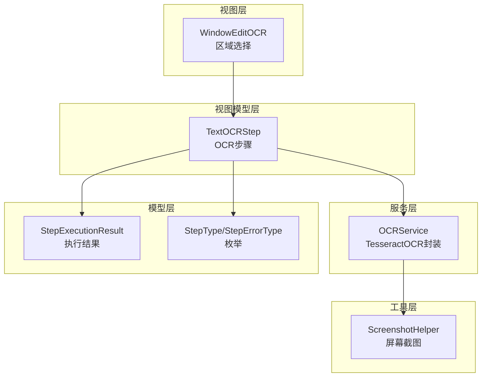
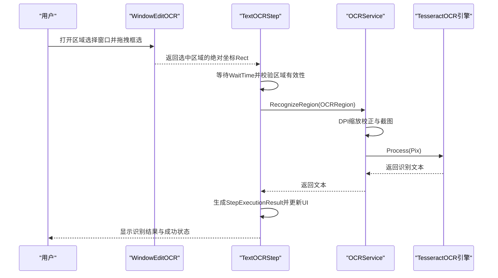
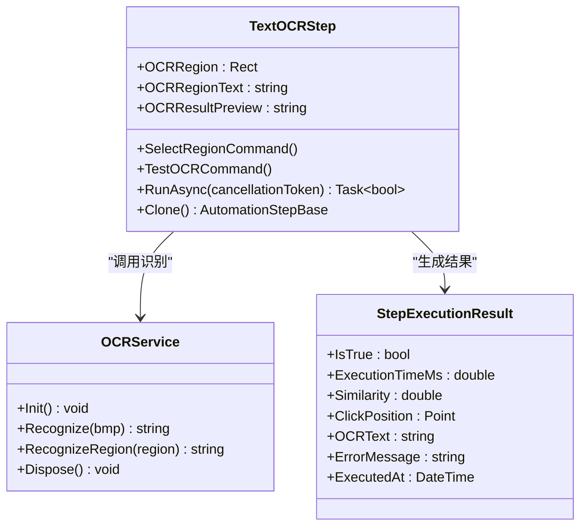
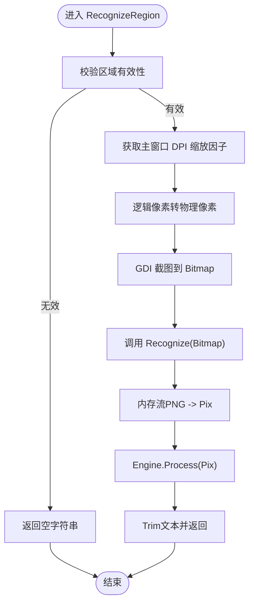
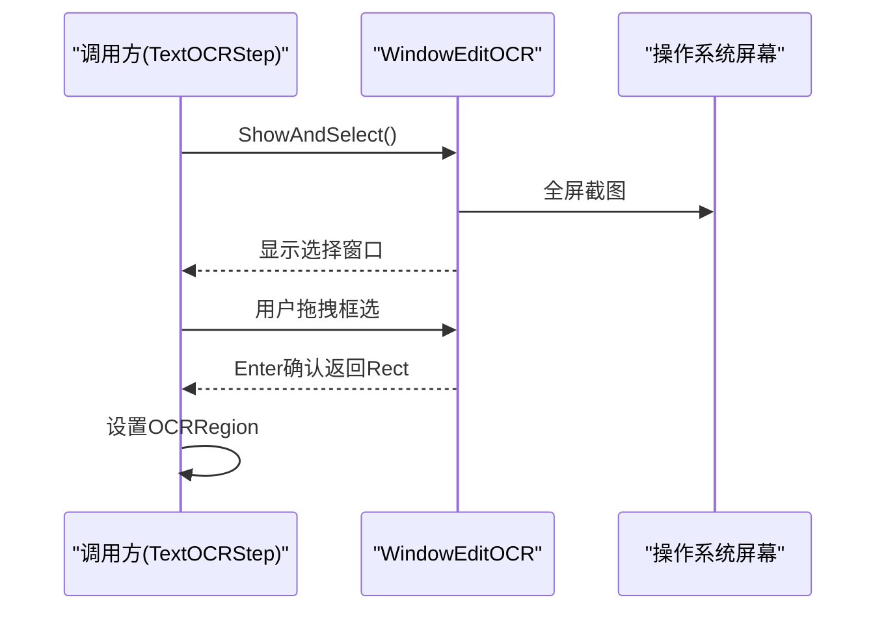
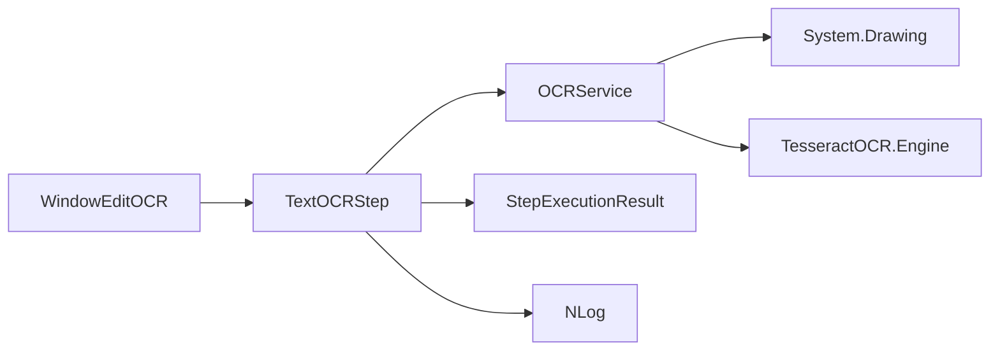

# OCR文字识别步骤

<cite>
**本文引用的文件**   
- [TextOCRStep.cs](file://ShaoLu/Viewmodels/TextOCRStep.cs)
- [OCRService.cs](file://ShaoLu/Services/OCRService.cs)
- [WindowEditOCR.xaml.cs](file://ShaoLu/Views/WindowEditOCR.xaml.cs)
- [AutomationStepModel.cs](file://ShaoLu/Models/AutomationStepModel.cs)
- [StepExecutionResult.cs](file://ShaoLu/Models/StepExecutionResult.cs)
- [ScreenshotHelper.cs](file://ShaoLu/Tools/ImageEdit/Helpers/ScreenshotHelper.cs)
- [Strings.zh-CN.resx](file://ShaoLu/Resources/Strings.zh-CN.resx)
- [Strings.en-US.resx](file://ShaoLu/Resources/Strings.en-US.resx)
- [Readme.md](file://Readme.md)
</cite>

## 目录
1. [简介](#简介)
2. [项目结构](#项目结构)
3. [核心组件](#核心组件)
4. [架构总览](#架构总览)
5. [详细组件分析](#详细组件分析)
6. [依赖关系分析](#依赖关系分析)
7. [性能考虑](#性能考虑)
8. [故障排查指南](#故障排查指南)
9. [结论](#结论)
10. [附录](#附录)

## 简介
本文件面向“OCR 文字识别步骤”的使用与实现，重点说明 TextOCRStep 类的功能与配置、OCR 引擎集成原理（TesseractOCR）、多语言支持、区域截图获取、图像预处理与文字提取流程，以及结果后处理与常见问题解决方案。目标是帮助使用者快速上手并优化识别效果，同时为开发者提供清晰的扩展与维护指引。

## 项目结构
本项目基于 WPF，采用 MVVM 分层：
- Viewmodels：自动化步骤的视图模型，包含 TextOCRStep
- Services：OCR 服务封装，调用 TesseractOCR
- Views：OCR 区域选择窗口 WindowEditOCR
- Models：步骤类型枚举、执行结果等数据模型
- Tools/ImageEdit：截图与图像处理工具集

图表来源
- [WindowEditOCR.xaml.cs:57-107](file://ShaoLu/Views/WindowEditOCR.xaml.cs#L57-L107)
- [TextOCRStep.cs:102-142](file://ShaoLu/Viewmodels/TextOCRStep.cs#L102-L142)
- [OCRService.cs:21-43](file://ShaoLu/Services/OCRService.cs#L21-L43)
- [ScreenshotHelper.cs:93-121](file://ShaoLu/Tools/ImageEdit/Helpers/ScreenshotHelper.cs#L93-L121)
- [StepExecutionResult.cs:8-44](file://ShaoLu/Models/StepExecutionResult.cs#L8-L44)
- [AutomationStepModel.cs:9-41](file://ShaoLu/Models/AutomationStepModel.cs#L9-L41)

章节来源
- [Readme.md:1-20](file://Readme.md#L1-L20)

## 核心组件
- TextOCRStep：定义 OCR 步骤的行为，包括区域选择、测试识别、异步执行、结果记录与日志。
- OCRService：封装 TesseractOCR 引擎初始化、区域截图、识别与异常处理。
- WindowEditOCR：全屏截图 + 拖拽框选区域，返回绝对坐标矩形。
- StepExecutionResult：结构化存储每次执行的布尔结果、耗时、相似度、点击位置、OCR文本、错误信息、时间戳。
- 枚举 StepType/StepErrorType：用于区分步骤类型与错误类型（含 OCRError）。

章节来源
- [TextOCRStep.cs:17-100](file://ShaoLu/Viewmodels/TextOCRStep.cs#L17-L100)
- [OCRService.cs:12-43](file://ShaoLu/Services/OCRService.cs#L12-L43)
- [WindowEditOCR.xaml.cs:28-107](file://ShaoLu/Views/WindowEditOCR.xaml.cs#L28-L107)
- [StepExecutionResult.cs:8-44](file://ShaoLu/Models/StepExecutionResult.cs#L8-L44)
- [AutomationStepModel.cs:9-41](file://ShaoLu/Models/AutomationStepModel.cs#L9-L41)

## 架构总览
OCR 识别的整体流程如下：
- 用户在 UI 中通过 WindowEditOCR 选择屏幕区域，得到绝对坐标矩形。
- TextOCRStep 在运行前等待指定时间，校验区域有效性。
- 调用 OCRService.RecognizeRegion(region) 进行截图与识别。
- OCRService 内部使用 GDI 截图、DPI 缩放校正、TesseractOCR 引擎识别。
- 结果写入 StepExecutionResult，并根据是否非空设置 IsTrue。
- 可选记录执行日志。

图表来源
- [WindowEditOCR.xaml.cs:57-107](file://ShaoLu/Views/WindowEditOCR.xaml.cs#L57-L107)
- [TextOCRStep.cs:102-142](file://ShaoLu/Viewmodels/TextOCRStep.cs#L102-L142)
- [OCRService.cs:82-118](file://ShaoLu/Services/OCRService.cs#L82-L118)

## 详细组件分析

### TextOCRStep 类分析
- 属性
  - OCRRegion：OCR 屏幕区域（绝对坐标）
  - OCRRegionText：区域描述文本（用于 UI 显示）
  - OCRResultPreview：运行时识别结果预览
- 命令
  - SelectRegionCommand：打开 WindowEditOCR 选择区域
  - TestOCRCommand：对当前区域执行一次识别测试
- 执行逻辑 RunAsync
  - 等待 WaitTime（秒）
  - 校验区域是否为空或无效
  - 调用 OCRService.RecognizeRegion 异步识别
  - 保存 LastResult（StepExecutionResult），设置 IsTrue 为文本非空
  - 可选记录日志
- 克隆与构造
  - 支持名称、描述、条件跳转、等待时间等通用属性的复制

图表来源
- [TextOCRStep.cs:17-142](file://ShaoLu/Viewmodels/TextOCRStep.cs#L17-L142)
- [StepExecutionResult.cs:8-44](file://ShaoLu/Models/StepExecutionResult.cs#L8-L44)
- [OCRService.cs:21-131](file://ShaoLu/Services/OCRService.cs#L21-L131)

章节来源
- [TextOCRStep.cs:17-142](file://ShaoLu/Viewmodels/TextOCRStep.cs#L17-L142)

### OCRService 与 TesseractOCR 集成
- 引擎初始化
  - 懒加载单例模式，首次调用时创建 Engine，路径指向程序目录下的 tessdata，默认语言包为 chi_sim+eng（简体中文+英文）
  - 使用 NLog 记录初始化成功或失败
- 识别方法
  - Recognize(Bitmap)：将 Bitmap 转为内存流 PNG，再加载为 Pix，调用 Engine.Process 获取文本
  - RecognizeRegion(Rect)：根据 WPF 逻辑像素计算物理像素（考虑 DPI 缩放），使用 GDI CopyFromScreen 截取屏幕区域，再调用 Recognize
- 资源释放
  - Dispose：释放引擎实例

图表来源
- [OCRService.cs:82-118](file://ShaoLu/Services/OCRService.cs#L82-L118)
- [OCRService.cs:49-75](file://ShaoLu/Services/OCRService.cs#L49-L75)

章节来源
- [OCRService.cs:21-131](file://ShaoLu/Services/OCRService.cs#L21-L131)

### 区域截图与选择（WindowEditOCR）
- ShowAndSelect 静态方法
  - 隐藏主窗口，获取工作区尺寸，全屏截图并转换为 WPF BitmapSource
  - 显示选择窗口，用户拖拽框选区域，Enter 确认，Esc/右键取消
  - 返回绝对坐标矩形（叠加屏幕偏移）
- 交互细节
  - 强制前台焦点，避免被系统锁定
  - 实时遮罩与尺寸提示，确保选择区域最小尺寸限制

图表来源
- [WindowEditOCR.xaml.cs:57-107](file://ShaoLu/Views/WindowEditOCR.xaml.cs#L57-L107)

章节来源
- [WindowEditOCR.xaml.cs:57-107](file://ShaoLu/Views/WindowEditOCR.xaml.cs#L57-L107)

### 多语言支持与配置
- 默认语言包
  - 初始化时指定语言包为 chi_sim+eng（简体中文+英文）
- 多语言界面
  - 资源文件 Strings.zh-CN.resx、Strings.en-US.resx 提供本地化文案
- 扩展建议
  - 如需繁体中文或其他语言，可在 Engine 初始化时追加语言包（例如 chi_tra+eng），并确保 tessdata 目录下存在对应 .traineddata 文件

章节来源
- [OCRService.cs:21-43](file://ShaoLu/Services/OCRService.cs#L21-L43)
- [Strings.zh-CN.resx:753-765](file://ShaoLu/Resources/Strings.zh-CN.resx#L753-L765)
- [Strings.en-US.resx:753-774](file://ShaoLu/Resources/Strings.en-US.resx#L753-L774)

### 识别结果的后处理
- 文本清洗
  - 识别结果会进行 Trim 去除首尾空白
- 格式化与验证
  - 若结果为空，则 IsTrue=false；否则 IsTrue=true
  - 可结合业务规则进一步过滤（如正则匹配、长度限制、字符集校验）
- 结果记录
  - StepExecutionResult 保存 OCRText、执行时间、错误信息等

章节来源
- [OCRService.cs:49-75](file://ShaoLu/Services/OCRService.cs#L49-L75)
- [StepExecutionResult.cs:8-44](file://ShaoLu/Models/StepExecutionResult.cs#L8-L44)
- [TextOCRStep.cs:120-142](file://ShaoLu/Viewmodels/TextOCRStep.cs#L120-L142)

## 依赖关系分析
- TextOCRStep 依赖 OCRService 完成识别
- OCRService 依赖 System.Drawing 进行截图与图像转换，依赖 TesseractOCR 引擎
- WindowEditOCR 依赖 WPF 与 GDI 进行全屏截图与交互
- 日志记录使用 NLog

图表来源
- [TextOCRStep.cs:102-142](file://ShaoLu/Viewmodels/TextOCRStep.cs#L102-L142)
- [OCRService.cs:21-131](file://ShaoLu/Services/OCRService.cs#L21-L131)
- [StepExecutionResult.cs:8-44](file://ShaoLu/Models/StepExecutionResult.cs#L8-L44)

章节来源
- [AutomationStepModel.cs:9-41](file://ShaoLu/Models/AutomationStepModel.cs#L9-L41)

## 性能考虑
- 区域大小
  - 尽量缩小识别区域，减少截图与识别开销
- DPI 缩放
  - 正确换算逻辑像素与物理像素，避免模糊或错位
- 引擎初始化
  - 懒加载避免重复初始化，提升启动速度
- 线程与异步
  - 识别过程在后台线程执行，不阻塞 UI
- 日志级别
  - 生产环境降低日志频率，减少 I/O 开销

[本节为通用指导，无需引用具体文件]

## 故障排查指南
- 识别率低
  - 检查区域是否过小或过大，适当调整
  - 提高图像质量（避免模糊、低对比度）
  - 增加或切换语言包（如加入 chi_tra、eng）
- 乱码或识别为空
  - 确认 tessdata 目录存在且语言包完整
  - 检查 DPI 缩放是否正确
  - 查看 OCRService 日志输出定位异常
- 性能问题
  - 减少识别区域面积
  - 避免频繁初始化引擎
  - 关闭不必要的日志输出
- 区域选择失败
  - 确保窗口能正常置顶与获取焦点
  - 检查 Enter/Esc/右键事件处理是否正常

章节来源
- [OCRService.cs:21-43](file://ShaoLu/Services/OCRService.cs#L21-L43)
- [WindowEditOCR.xaml.cs:112-127](file://ShaoLu/Views/WindowEditOCR.xaml.cs#L112-L127)
- [TextOCRStep.cs:156-176](file://ShaoLu/Viewmodels/TextOCRStep.cs#L156-L176)

## 结论
TextOCRStep 提供了直观的 OCR 步骤能力，配合 WindowEditOCR 的区域选择与 OCRService 的 TesseractOCR 封装，实现了从屏幕区域截图、预处理到文字识别与结果后处理的完整流程。通过合理配置语言包、优化识别区域与 DPI 处理，可以显著提升识别准确率与性能。建议在复杂场景下结合业务规则进行结果验证与清洗，以获得更稳定的自动化效果。

## 附录
- 常用快捷键
  - Ctrl+Alt+F9：运行自动化流程
  - Ctrl+Alt+F10：停止运行
- 相关步骤类型
  - ClickImage、FindImage、TypeText、Popup 等，详见项目 README

章节来源
- [Readme.md:1-20](file://Readme.md#L1-L20)