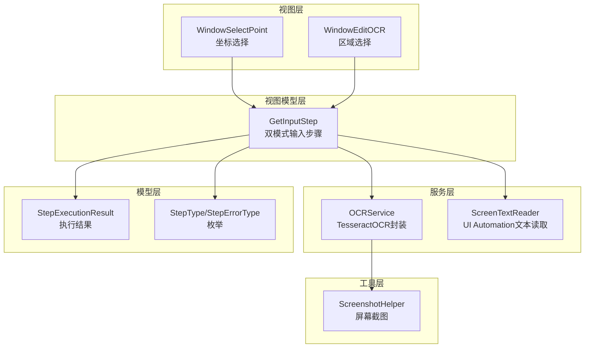
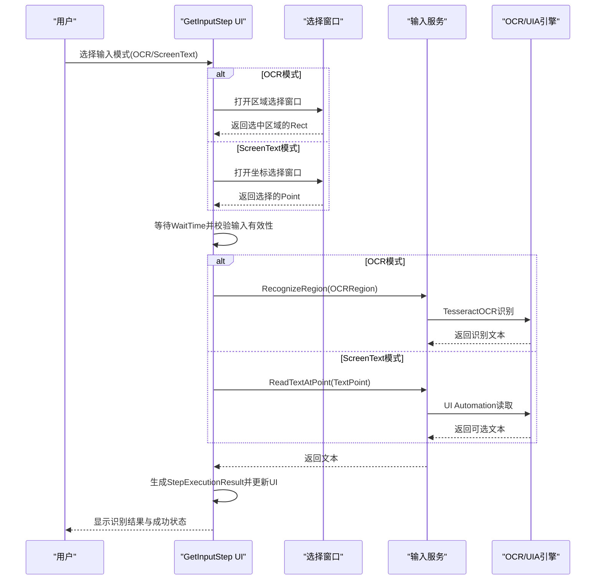
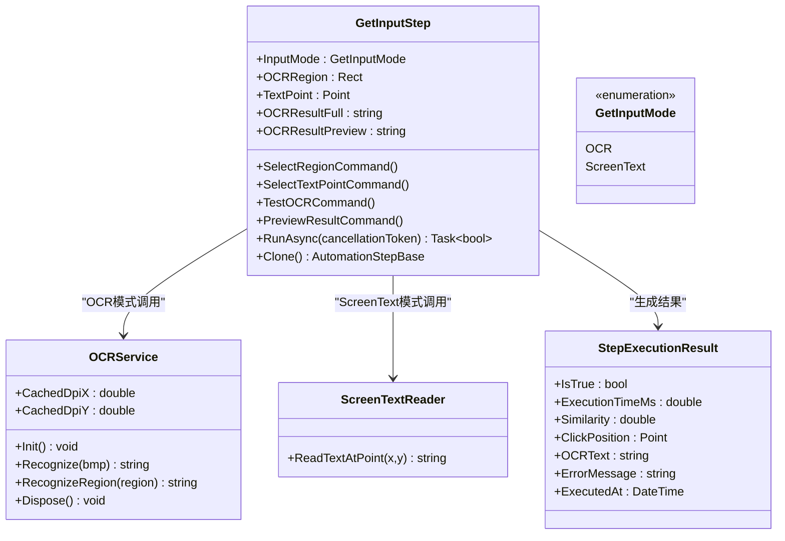
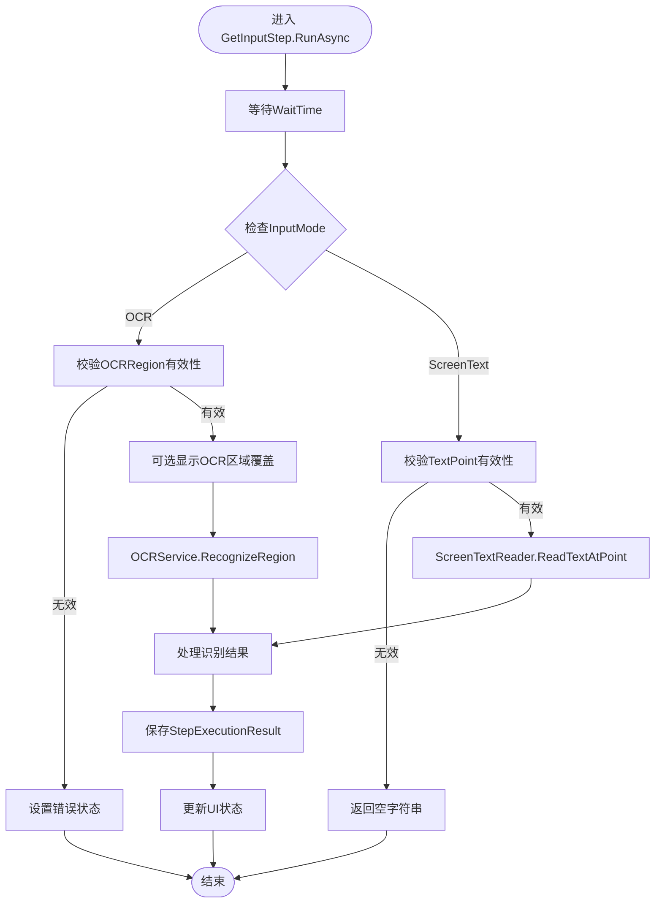
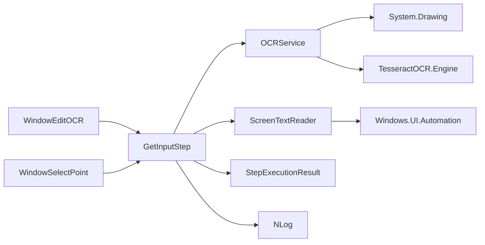

# OCR文字识别步骤

<cite>
**本文引用的文件**   
- [GetInputStep.cs](file://ShaoLu/Viewmodels/GetInputStep.cs)
- [ScreenTextReader.cs](file://ShaoLu/Utils/ScreenTextReader.cs)
- [OCRService.cs](file://ShaoLu/Services/OCRService.cs)
- [WindowSelectPoint.xaml.cs](file://ShaoLu/Views/WindowSelectPoint.xaml.cs)
- [AutomationStepModel.cs](file://ShaoLu/Models/AutomationStepModel.cs)
- [StepDetailTemplates.xaml](file://ShaoLu/Templates/StepDetailTemplates.xaml)
- [Strings.zh-CN.resx](file://ShaoLu/Resources/Strings.zh-CN.resx)
- [Strings.en-US.resx](file://ShaoLu/Resources/Strings.en-US.resx)
</cite>

## 更新摘要
**所做更改**   
- 将 TextOCRStep 类完全替换为 GetInputStep 双模式输入系统
- 新增 ScreenText 模式支持通过 UI Automation 读取屏幕文本
- 更新 OCRService 以支持 DPI 缓存和更好的性能
- 添加 WindowSelectPoint 用于点选坐标功能
- 重构模板和资源文件以支持新的双模式界面

## 目录
1. [简介](#简介)
2. [项目结构](#项目结构)
3. [核心组件](#核心组件)
4. [架构总览](#架构总览)
5. [详细组件分析](#详细组件分析)
6. [依赖关系分析](#依赖关系分析)
7. [性能考虑](#性能考虑)
8. [故障排查指南](#故障排查指南)
9. [结论](#结论)
10. [附录](#附录)

## 简介
本文档介绍 ShaoLu 自动化框架中的双模式输入步骤，重点说明 GetInputStep 类的功能和配置选项。该步骤支持两种输入方式：OCR 文字识别和屏幕可选文本读取（UI Automation）。文档详细说明两种模式的配置方法、识别原理、多语言支持、区域选择与坐标选取流程，以及结果后处理与常见问题解决方案。目标是帮助用户快速上手并优化识别效果，同时为开发者提供清晰的扩展与维护指引。

## 项目结构
本项目基于 WPF，采用 MVVM 分层架构：
- Viewmodels：自动化步骤的视图模型，包含 GetInputStep
- Services：OCR 服务封装，调用 TesseractOCR
- Utils：屏幕文本读取工具，使用 UI Automation
- Views：区域选择和坐标选择窗口
- Models：步骤类型枚举、执行结果等数据模型
- Templates：XAML 模板定义用户界面

图表来源
- [GetInputStep.cs:165-221](file://ShaoLu/Viewmodels/GetInputStep.cs#L165-L221)
- [ScreenTextReader.cs:18-76](file://ShaoLu/Utils/ScreenTextReader.cs#L18-L76)
- [OCRService.cs:114-144](file://ShaoLu/Services/OCRService.cs#L114-L144)
- [WindowSelectPoint.xaml.cs:26-31](file://ShaoLu/Views/WindowSelectPoint.xaml.cs#L26-L31)

章节来源
- [AutomationStepModel.cs:9-24](file://ShaoLu/Models/AutomationStepModel.cs#L9-L24)

## 核心组件
- **GetInputStep**：定义双模式输入步骤的行为，包括 OCR 模式和 ScreenText 模式的选择、区域选择、坐标选择、测试识别、异步执行、结果记录与日志。
- **OCRService**：封装 TesseractOCR 引擎初始化、区域截图、识别与异常处理，支持 DPI 缓存优化。
- **ScreenTextReader**：通过 UI Automation 读取屏幕上指定位置的可选择文本，支持多种控件类型。
- **WindowSelectPoint**：全屏点选窗口，用户单击屏幕选取一个坐标点。
- **WindowEditOCR**：全屏截图 + 拖拽框选区域，返回绝对坐标矩形。
- **StepExecutionResult**：结构化存储每次执行的布尔结果、耗时、相似度、点击位置、OCR文本、错误信息、时间戳。

章节来源
- [GetInputStep.cs:29-163](file://ShaoLu/Viewmodels/GetInputStep.cs#L29-L163)
- [OCRService.cs:12-75](file://ShaoLu/Services/OCRService.cs#L12-L75)
- [ScreenTextReader.cs:9-76](file://ShaoLu/Utils/ScreenTextReader.cs#L9-L76)
- [WindowSelectPoint.xaml.cs:11-31](file://ShaoLu/Views/WindowSelectPoint.xaml.cs#L11-L31)

## 架构总览
双模式输入的整体流程如下：
- 用户在 UI 中通过 GetInputStep 选择输入模式（OCR 或 ScreenText）
- **OCR 模式**：通过 WindowEditOCR 选择屏幕区域，得到绝对坐标矩形
- **ScreenText 模式**：通过 WindowSelectPoint 选择屏幕坐标点
- GetInputStep 在运行前等待指定时间，校验输入有效性
- 根据模式调用相应的服务进行文本获取
- OCR 模式：调用 OCRService.RecognizeRegion(region) 进行截图与识别
- ScreenText 模式：调用 ScreenTextReader.ReadTextAtPoint(point) 读取文本
- 结果写入 StepExecutionResult，并根据是否非空设置 IsTrue

图表来源
- [GetInputStep.cs:165-221](file://ShaoLu/Viewmodels/GetInputStep.cs#L165-L221)
- [OCRService.cs:114-144](file://ShaoLu/Services/OCRService.cs#L114-L144)
- [ScreenTextReader.cs:18-76](file://ShaoLu/Utils/ScreenTextReader.cs#L18-L76)

## 详细组件分析

### GetInputStep 类分析
**更新** GetInputStep 完全替代了原来的 TextOCRStep，提供双模式输入功能

- **属性**
  - InputMode：输入模式枚举（OCR 或 ScreenText）
  - OCRRegion：OCR 屏幕区域（绝对坐标）
  - TextPoint：ScreenText 模式下的目标位置（逻辑像素）
  - OCRResultFull：运行时识别结果完整文本
  - OCRResultPreview：运行时识别结果预览（超过100字符时截断）
- **命令**
  - SelectRegionCommand：打开 WindowEditOCR 选择区域（OCR 模式）
  - SelectTextPointCommand：打开 WindowSelectPoint 选择坐标（ScreenText 模式）
  - TestOCRCommand：对当前输入执行一次识别测试
  - PreviewResultCommand：点击截断的结果文本时预览完整内容
- **执行逻辑 RunAsync**
  - 等待 WaitTime（秒）
  - 根据 InputMode 选择不同的文本获取方式
  - OCR 模式：校验区域有效性，调用 OCRService.RecognizeRegion
  - ScreenText 模式：调用 ScreenTextReader.ReadTextAtPoint
  - 保存 LastResult（StepExecutionResult），设置 IsTrue 为文本非空
  - 可选记录执行日志

图表来源
- [GetInputStep.cs:29-163](file://ShaoLu/Viewmodels/GetInputStep.cs#L29-L163)
- [StepExecutionResult.cs:8-44](file://ShaoLu/Models/StepExecutionResult.cs#L8-L44)
- [OCRService.cs:12-75](file://ShaoLu/Services/OCRService.cs#L12-L75)
- [ScreenTextReader.cs:9-76](file://ShaoLu/Utils/ScreenTextReader.cs#L9-L76)

章节来源
- [GetInputStep.cs:29-293](file://ShaoLu/Viewmodels/GetInputStep.cs#L29-L293)

### 双模式输入系统详解

#### OCR 模式
- **区域选择**：通过 WindowEditOCR 全屏截图 + 拖拽框选
- **识别流程**：GDI 截图 → DPI 缩放校正 → TesseractOCR 引擎识别
- **结果处理**：文本清洗、格式化、验证

#### ScreenText 模式
- **坐标选择**：通过 WindowSelectPoint 全屏点选
- **读取流程**：UI Automation → TextPattern/ValuePattern → 父元素遍历
- **兼容性**：支持 TextBox、文档、大多数输入/显示控件

图表来源
- [GetInputStep.cs:165-221](file://ShaoLu/Viewmodels/GetInputStep.cs#L165-L221)
- [ScreenTextReader.cs:18-76](file://ShaoLu/Utils/ScreenTextReader.cs#L18-L76)

章节来源
- [GetInputStep.cs:165-221](file://ShaoLu/Viewmodels/GetInputStep.cs#L165-L221)

### OCRService 与 TesseractOCR 集成
**更新** OCRService 现在支持 DPI 缓存以提高性能

- **引擎初始化**
  - 懒加载单例模式，首次调用时创建 Engine
  - 路径指向程序目录下的 tessdata，默认语言包为 chi_sim+eng（简体中文+英文）
  - 使用 NLog 记录初始化成功或失败
- **DPI 缓存机制**
  - CachedDpiX/CachedDpiY 静态属性缓存 DPI 缩放因子
  - UpdateDpi() 方法在主线程更新缓存，避免后台线程访问 WPF 对象
- **识别方法**
  - Recognize(Bitmap)：将 Bitmap 转为内存流 PNG，再加载为 Pix，调用 Engine.Process 获取文本
  - RecognizeRegion(Rect)：使用缓存的 DPI 缩放因子转换逻辑像素为物理像素，使用 GDI CopyFromScreen 截取屏幕区域
- **资源释放**
  - Dispose：释放引擎实例

章节来源
- [OCRService.cs:12-159](file://ShaoLu/Services/OCRService.cs#L12-L159)

### ScreenTextReader 与 UI Automation 集成
**新增** ScreenTextReader 提供屏幕可选文本读取功能

- **读取策略**
  - 优先尝试 TextPattern（支持文本选择的控件，如 TextBox、文档）
  - 其次尝试 ValuePattern（大多数输入/显示控件）
  - 最后向上遍历父元素，尝试获取 Name 或 ValuePattern
- **坐标处理**
  - 接受物理像素坐标参数
  - 内部转换为 WPF Point 进行 UI Automation 操作
- **异常处理**
  - 捕获所有异常，返回空字符串而非抛出异常
  - 确保在 UI Automation 不可用时也能正常运行

章节来源
- [ScreenTextReader.cs:9-76](file://ShaoLu/Utils/ScreenTextReader.cs#L9-L76)

### 区域截图与选择（WindowEditOCR 和 WindowSelectPoint）
**更新** 新增 WindowSelectPoint 用于 ScreenText 模式的坐标选择

- **WindowEditOCR.ShowAndSelect 静态方法**
  - 隐藏主窗口，获取工作区尺寸，全屏截图并转换为 WPF BitmapSource
  - 显示选择窗口，用户拖拽框选区域，Enter 确认，Esc/右键取消
  - 返回绝对坐标矩形（叠加屏幕偏移）
- **WindowSelectPoint.ShowAndSelect 静态方法**
  - 显示全屏点选窗口，用户单击屏幕选取坐标点
  - 实时显示十字准星和坐标提示
  - 返回逻辑像素坐标点，取消返回 null
- **交互细节**
  - 强制前台焦点，避免被系统锁定
  - 实时遮罩与尺寸提示，确保选择区域最小尺寸限制

章节来源
- [WindowSelectPoint.xaml.cs:26-31](file://ShaoLu/Views/WindowSelectPoint.xaml.cs#L26-L31)

### 多语言支持与配置
- **默认语言包**
  - 初始化时指定语言包为 chi_sim+eng（简体中文+英文）
- **多语言界面**
  - 资源文件 Strings.zh-CN.resx、Strings.en-US.resx 提供本地化文案
  - 新增 GetInput 相关资源：AddGetInputStep、InputMode、InputMode_OCR、InputMode_ScreenText 等
- **扩展建议**
  - 如需繁体中文或其他语言，可在 Engine 初始化时追加语言包（例如 chi_tra+eng）
  - 确保 tessdata 目录下存在对应 .traineddata 文件

章节来源
- [OCRService.cs:53-75](file://ShaoLu/Services/OCRService.cs#L53-L75)
- [Strings.zh-CN.resx:705-716](file://ShaoLu/Resources/Strings.zh-CN.resx#L705-L716)
- [Strings.en-US.resx:705-716](file://ShaoLu/Resources/Strings.en-US.resx#L705-L716)

### 识别结果的后处理
- **文本清洗**
  - 识别结果会进行 Trim 去除首尾空白
  - ScreenText 模式自动处理各种控件类型的文本格式
- **格式化与验证**
  - 若结果为空，则 IsTrue=false；否则 IsTrue=true
  - 可结合业务规则进一步过滤（如正则匹配、长度限制、字符集校验）
- **结果记录**
  - StepExecutionResult 保存 OCRText、执行时间、错误信息等
  - OCRResultFull 存储完整文本，OCRResultPreview 提供截断预览

章节来源
- [GetInputStep.cs:207-221](file://ShaoLu/Viewmodels/GetInputStep.cs#L207-L221)
- [ScreenTextReader.cs:25-69](file://ShaoLu/Utils/ScreenTextReader.cs#L25-L69)

### XAML 模板与用户界面
**更新** 新增 GetInputStepTemplate 支持双模式界面

- **动态界面切换**
  - 根据 InputMode 动态显示 OCR 或 ScreenText 配置面板
  - DataTrigger 控制不同模式的可见性
- **OCR 模式界面**
  - 区域选择按钮和区域信息显示
  - OCR 测试按钮和结果预览
- **ScreenText 模式界面**
  - 坐标选择按钮和坐标信息显示
  - 相同的测试和预览功能
- **通用功能**
  - 等待时间设置
  - 跳转设置面板
  - 条件判断面板

章节来源
- [StepDetailTemplates.xaml:469-528](file://ShaoLu/Templates/StepDetailTemplates.xaml#L469-L528)

## 依赖关系分析
- GetInputStep 依赖 OCRService 完成 OCR 识别
- GetInputStep 依赖 ScreenTextReader 完成 UI Automation 文本读取
- OCRService 依赖 System.Drawing 进行截图与图像转换，依赖 TesseractOCR 引擎
- WindowEditOCR 和 WindowSelectPoint 依赖 WPF 与 GDI 进行全屏截图与交互
- 日志记录使用 NLog

图表来源
- [GetInputStep.cs:165-221](file://ShaoLu/Viewmodels/GetInputStep.cs#L165-L221)
- [OCRService.cs:12-159](file://ShaoLu/Services/OCRService.cs#L12-L159)
- [ScreenTextReader.cs:1-76](file://ShaoLu/Utils/ScreenTextReader.cs#L1-76)

章节来源
- [AutomationStepModel.cs:9-43](file://ShaoLu/Models/AutomationStepModel.cs#L9-L43)

## 性能考虑
- **区域大小**
  - 尽量缩小 OCR 识别区域，减少截图与识别开销
- **DPI 缩放**
  - OCRService 使用缓存的 DPI 缩放因子，避免重复计算
  - 正确换算逻辑像素与物理像素，避免模糊或错位
- **引擎初始化**
  - 懒加载避免重复初始化，提升启动速度
  - DPI 缓存避免频繁访问 WPF 对象
- **线程与异步**
  - 识别过程在后台线程执行，不阻塞 UI
  - UI Automation 操作也采用异步方式
- **日志级别**
  - 生产环境降低日志频率，减少 I/O 开销
- **内存管理**
  - 及时释放 Bitmap 和 Pix 对象
  - 避免长时间持有大对象引用

## 故障排查指南
- **OCR 识别率低**
  - 检查区域是否过小或过大，适当调整
  - 提高图像质量（避免模糊、低对比度）
  - 增加或切换语言包（如加入 chi_tra、eng）
  - 确认 DPI 缓存是否正确更新
- **ScreenText 读取失败**
  - 确认目标控件支持 UI Automation
  - 检查坐标是否正确（逻辑像素 vs 物理像素）
  - 查看控件是否支持 TextPattern 或 ValuePattern
- **乱码或识别为空**
  - 确认 tessdata 目录存在且语言包完整
  - 检查 DPI 缩放是否正确
  - 查看 OCRService 日志输出定位异常
- **性能问题**
  - 减少识别区域面积
  - 避免频繁初始化引擎
  - 关闭不必要的日志输出
  - 使用 DPI 缓存避免重复计算
- **区域选择失败**
  - 确保窗口能正常置顶与获取焦点
  - 检查 Enter/Esc/右键事件处理是否正常
  - 确认全屏截图权限未被阻止

章节来源
- [OCRService.cs:53-75](file://ShaoLu/Services/OCRService.cs#L53-L75)
- [ScreenTextReader.cs:18-76](file://ShaoLu/Utils/ScreenTextReader.cs#L18-L76)
- [WindowSelectPoint.xaml.cs:61-87](file://ShaoLu/Views/WindowSelectPoint.xaml.cs#L61-L87)
- [GetInputStep.cs:250-288](file://ShaoLu/Viewmodels/GetInputStep.cs#L250-L288)

## 结论
GetInputStep 提供了强大的双模式输入能力，通过统一的接口支持 OCR 文字识别和屏幕可选文本读取两种不同的输入方式。相比原来的 TextOCRStep，新设计具有以下优势：

- **灵活性**：用户可以根据应用场景选择合适的输入模式
- **兼容性**：ScreenText 模式支持更多类型的控件和应用程序
- **性能**：DPI 缓存和优化的内存管理提升整体性能
- **易用性**：统一的界面设计和操作流程

通过合理配置语言包、优化识别区域与坐标选择、正确处理 DPI 缩放，可以显著提升识别准确率与性能。建议在复杂场景下结合业务规则进行结果验证与清洗，以获得更稳定的自动化效果。

## 附录
- **常用快捷键**
  - Ctrl+Alt+F9：运行自动化流程
  - Ctrl+Alt+F10：停止运行
- **相关步骤类型**
  - ClickImage、FindImage、TypeText、Popup、MouseAction、Statistics 等
- **支持的控件类型**
  - TextBox、RichTextBox、文档控件、Button、Label 等支持 UI Automation 的控件
- **语言包支持**
  - 简体中文（chi_sim）、英文（eng）、繁体中文（chi_tra）等

章节来源
- [AutomationStepModel.cs:9-24](file://ShaoLu/Models/AutomationStepModel.cs#L9-L24)
- [ScreenTextReader.cs:25-69](file://ShaoLu/Utils/ScreenTextReader.cs#L25-L69)