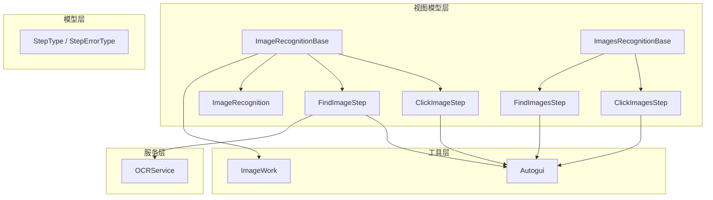
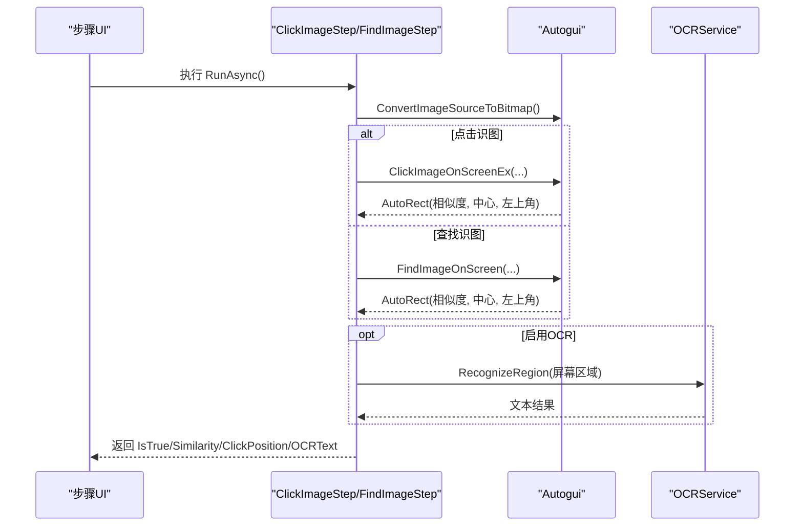
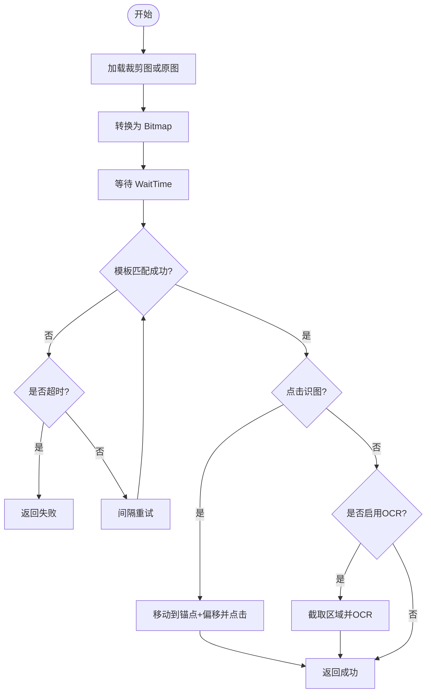
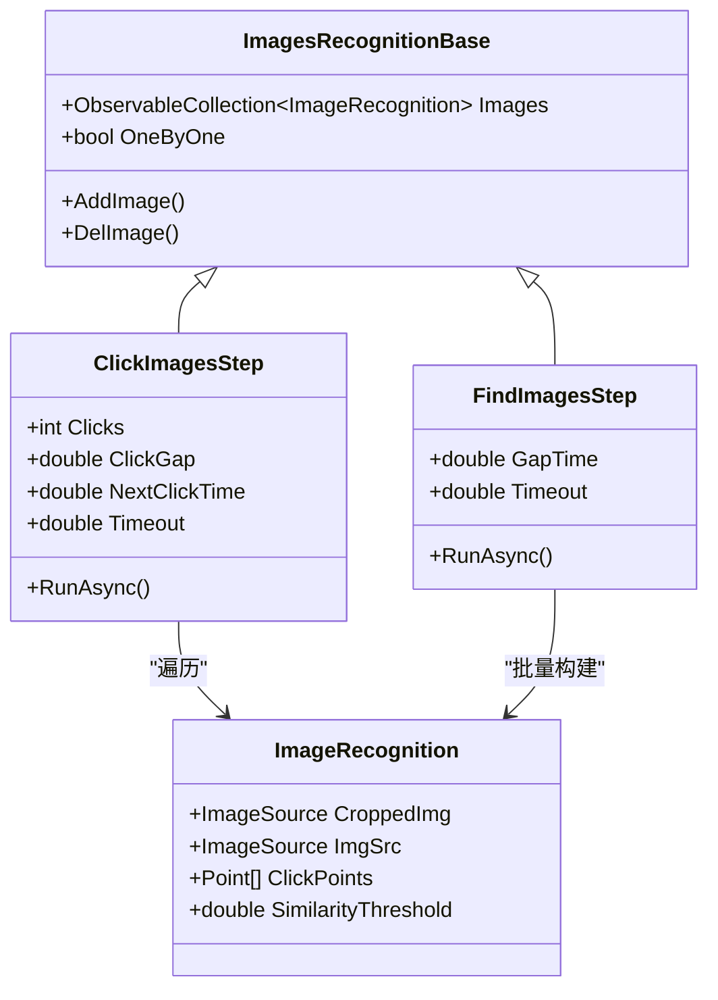
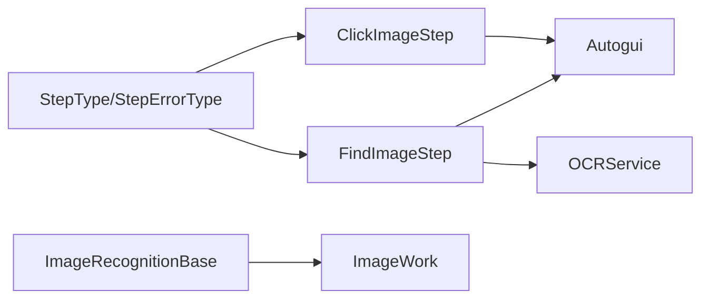

# 图像识别步骤

<cite>
**本文引用的文件**   
- [ImageRecognition.cs](file://ShaoLu/Viewmodels/ImageRecognition.cs)
- [ImagesRecognition.cs](file://ShaoLu/Viewmodels/ImagesRecognition.cs)
- [Autogui.cs](file://ShaoLu/Utils/Autogui.cs)
- [OCRService.cs](file://ShaoLu/Services/OCRService.cs)
- [AutomationStepModel.cs](file://ShaoLu/Models/AutomationStepModel.cs)
- [Readme.md](file://Readme.md)
- [ImageWork.cs](file://ShaoLu/Tools/ImageEdit/Utils/ImageWork.cs)
</cite>

## 目录
1. [简介](#简介)
2. [项目结构](#项目结构)
3. [核心组件](#核心组件)
4. [架构总览](#架构总览)
5. [详细组件分析](#详细组件分析)
6. [依赖关系分析](#依赖关系分析)
7. [性能与优化](#性能与优化)
8. [故障排查与调试](#故障排查与调试)
9. [结论](#结论)
10. [附录：参数与阈值建议](#附录参数与阈值建议)

## 简介
本文件面向“烧录（ShaoLu）”自动化流程中的图像识别能力，系统性说明以下要点：
- ClickImage（点击识图）与 FindImage（查找识图）的功能差异、适用场景与执行流程。
- ImagesRecognition 类提供的多图处理能力：ClickImages（多图点击）、FindImages（多图查找）的配置方法与执行逻辑。
- 图像相似度阈值设置、匹配算法参数与性能优化选项。
- 图像预处理（裁剪、缩放、灰度化）对识别精度与速度的影响。
- 坐标计算、点击位置偏移与区域选择工具的使用方法。
- 图像识别失败的处理策略与调试技巧。

## 项目结构
图像识别相关代码主要分布在 Viewmodels、Utils、Services、Models 与 Tools 子目录中：
- Viewmodels：定义单图与多图的识别步骤（ClickImageStep、FindImageStep、ClickImagesStep、FindImagesStep）。
- Utils：封装屏幕截图、模板匹配、鼠标模拟与图像转换等底层能力（Autogui）。
- Services：OCR 服务封装（OCRService），用于在找到图片后对指定区域进行文字识别。
- Models：步骤类型枚举与错误类型枚举（StepType、StepErrorType）。
- Tools/ImageEdit：图像处理工具（裁剪、缩放、格式转换等）。

图表来源
- [ImageRecognition.cs:21-326](file://ShaoLu/Viewmodels/ImageRecognition.cs#L21-L326)
- [ImagesRecognition.cs:15-228](file://ShaoLu/Viewmodels/ImagesRecognition.cs#L15-L228)
- [Autogui.cs:18-351](file://ShaoLu/Utils/Autogui.cs#L18-L351)
- [OCRService.cs:12-133](file://ShaoLu/Services/OCRService.cs#L12-L133)
- [AutomationStepModel.cs:9-41](file://ShaoLu/Models/AutomationStepModel.cs#L9-L41)
- [ImageWork.cs:17-296](file://ShaoLu/Tools/ImageEdit/Utils/ImageWork.cs#L17-L296)

章节来源
- [Readme.md:1-283](file://Readme.md#L1-L283)

## 核心组件
- ImageRecognitionBase：单图识别的基类，提供图片加载、裁剪保存、相似度阈值、点击点集合等通用能力。
- ClickImageStep：点击识图步骤，找到目标图后按配置的点击点执行点击。
- FindImageStep：查找识图步骤，仅判断是否找到目标图；可选启用 OCR 对指定区域进行文字识别。
- ImagesRecognitionBase：多图识别的基类，维护图片列表与批量操作开关。
- ClickImagesStep：多图点击，按顺序逐一查找并点击。
- FindImagesStep：多图查找，同时查找多张图，返回整体匹配结果。

章节来源
- [ImageRecognition.cs:21-326](file://ShaoLu/Viewmodels/ImageRecognition.cs#L21-L326)
- [ImageRecognition.cs:329-417](file://ShaoLu/Viewmodels/ImageRecognition.cs#L329-L417)
- [ImageRecognition.cs:420-566](file://ShaoLu/Viewmodels/ImageRecognition.cs#L420-L566)
- [ImagesRecognition.cs:15-69](file://ShaoLu/Viewmodels/ImagesRecognition.cs#L15-L69)
- [ImagesRecognition.cs:71-153](file://ShaoLu/Viewmodels/ImagesRecognition.cs#L71-L153)
- [ImagesRecognition.cs:155-225](file://ShaoLu/Viewmodels/ImagesRecognition.cs#L155-L225)

## 架构总览
下图展示从 UI 步骤到图像识别与输入模拟的核心调用链：

图表来源
- [ImageRecognition.cs:382-416](file://ShaoLu/Viewmodels/ImageRecognition.cs#L382-L416)
- [ImageRecognition.cs:515-565](file://ShaoLu/Viewmodels/ImageRecognition.cs#L515-L565)
- [Autogui.cs:256-306](file://ShaoLu/Utils/Autogui.cs#L256-L306)
- [Autogui.cs:59-122](file://ShaoLu/Utils/Autogui.cs#L59-L122)
- [OCRService.cs:82-118](file://ShaoLu/Services/OCRService.cs#L82-L118)

## 详细组件分析

### 单图识别：ClickImage 与 FindImage
- ClickImage（点击识图）
  - 功能：在屏幕上查找目标图，找到后根据配置的点击点执行点击。
  - 关键参数：相似度阈值、点击次数、点击间隔、下一次点击等待时间、超时时间。
  - 默认行为：若未设置点击点，则使用图像中心作为默认点击位置。
  - 执行流程：等待 WaitTime → 模板匹配 → 移动鼠标到锚点+偏移 → 循环点击 → 返回匹配结果。
- FindImage（查找识图）
  - 功能：在屏幕上查找目标图，仅判断是否找到（不点击），常用于条件分支。
  - 关键参数：相似度阈值、查找间隔、超时时间。
  - OCR 能力：可启用 OCR，在找到图片后对指定区域进行文字识别，支持 DPI 缩放校正。

图表来源
- [ImageRecognition.cs:382-416](file://ShaoLu/Viewmodels/ImageRecognition.cs#L382-L416)
- [ImageRecognition.cs:515-565](file://ShaoLu/Viewmodels/ImageRecognition.cs#L515-L565)
- [Autogui.cs:256-306](file://ShaoLu/Utils/Autogui.cs#L256-L306)
- [Autogui.cs:59-122](file://ShaoLu/Utils/Autogui.cs#L59-L122)
- [OCRService.cs:82-118](file://ShaoLu/Services/OCRService.cs#L82-L118)

章节来源
- [ImageRecognition.cs:329-417](file://ShaoLu/Viewmodels/ImageRecognition.cs#L329-L417)
- [ImageRecognition.cs:420-566](file://ShaoLu/Viewmodels/ImageRecognition.cs#L420-L566)
- [Readme.md:19-61](file://Readme.md#L19-L61)

### 多图识别：ClickImages 与 FindImages
- ClickImages（多图点击）
  - 功能：依次查找多张目标图，按列表顺序逐一查找并点击。
  - 配置方法：通过 + 添加多个 ImageRecognition 条目，每个条目独立设置相似度阈值与点击点。
  - 执行逻辑：遍历图片列表，逐个执行 ClickImageOnScreenEx，记录最后一次相似度与点击位置。
- FindImages（多图查找）
  - 功能：同时在屏幕上查找多张目标图，判断是否全部找到（不点击）。
  - 配置方法：添加多张图片，每张图片可独立设置阈值。
  - 执行逻辑：构造 AutoguiImage 列表，调用 FindImagesOnScreen，返回所有匹配结果，整体结果为第一个匹配项是否为空。

图表来源
- [ImagesRecognition.cs:47-69](file://ShaoLu/Viewmodels/ImagesRecognition.cs#L47-L69)
- [ImagesRecognition.cs:71-153](file://ShaoLu/Viewmodels/ImagesRecognition.cs#L71-L153)
- [ImagesRecognition.cs:155-225](file://ShaoLu/Viewmodels/ImagesRecognition.cs#L155-L225)
- [ImagesRecognition.cs:15-45](file://ShaoLu/Viewmodels/ImagesRecognition.cs#L15-L45)

章节来源
- [ImagesRecognition.cs:71-153](file://ShaoLu/Viewmodels/ImagesRecognition.cs#L71-L153)
- [ImagesRecognition.cs:155-225](file://ShaoLu/Viewmodels/ImagesRecognition.cs#L155-L225)
- [Readme.md:64-102](file://Readme.md#L64-L102)

### 图像预处理与编辑工具
- 裁剪与保存
  - 基类提供 SaveCroppedImageToDisk，将裁剪后的图片保存到工作目录 images/{Uid}.png，并根据原图扩展名自动选择编码器。
- 缩放与剪切
  - ImageWork 提供 ClipImage 与 FixedSize_ResizeRatios，支持高质量双三次插值缩放与比例修正。
- 灰度化
  - 模板匹配前会将模板与屏幕截图转为灰度图，减少颜色干扰并提升匹配速度。

章节来源
- [ImageRecognition.cs:234-293](file://ShaoLu/Viewmodels/ImageRecognition.cs#L234-L293)
- [ImageWork.cs:211-250](file://ShaoLu/Tools/ImageEdit/Utils/ImageWork.cs#L211-L250)
- [ImageWork.cs:264-293](file://ShaoLu/Tools/ImageEdit/Utils/ImageWork.cs#L264-L293)
- [Autogui.cs:74-86](file://ShaoLu/Utils/Autogui.cs#L74-L86)

### 坐标计算、点击位置偏移与区域选择
- 锚点与偏移
  - Autogui.Position 支持 Center/LeftTop/RightTop/LeftDown/RightDown 五种锚点。
  - MoveMouseTo(AutoRect, Position, Point?) 支持基于锚点的像素偏移，实现精确点击定位。
- 点击点管理
  - ClickImageStep 默认使用图像中心作为点击点；用户可在编辑窗口中添加多个点击点，运行时按顺序点击。
- 区域选择工具
  - 编辑窗口支持裁剪框拖动、点击点标记、OCR 区域设置；保存时同步更新 CroppedImg、CroppedRect、ClickThumbs 与 OCRRect。

章节来源
- [Autogui.cs:33-40](file://ShaoLu/Utils/Autogui.cs#L33-L40)
- [Autogui.cs:204-254](file://ShaoLu/Utils/Autogui.cs#L204-L254)
- [ImageRecognition.cs:148-195](file://ShaoLu/Viewmodels/ImageRecognition.cs#L148-L195)
- [ImageRecognition.cs:388-396](file://ShaoLu/Viewmodels/ImageRecognition.cs#L388-L396)

### OCR 集成与区域计算
- 启用方式：FindImageStep 的 EnableOCR 属性控制是否启用 OCR。
- 区域计算：OCRRect 为相对于原图的坐标，需减去 CroppedRect 偏移得到相对于裁剪图的坐标，再结合找到的图片在屏幕上的左上角坐标，计算屏幕绝对区域。
- DPI 校正：OCRService.RecognizeRegion 会获取主窗口的 DPI 缩放因子，将 WPF 逻辑像素转换为物理像素，确保截屏区域准确。

章节来源
- [ImageRecognition.cs:430-468](file://ShaoLu/Viewmodels/ImageRecognition.cs#L430-L468)
- [ImageRecognition.cs:529-544](file://ShaoLu/Viewmodels/ImageRecognition.cs#L529-L544)
- [OCRService.cs:82-118](file://ShaoLu/Services/OCRService.cs#L82-L118)

## 依赖关系分析
- 步骤模型依赖 Autogui 完成图像匹配与鼠标模拟。
- FindImageStep 依赖 OCRService 进行文字识别。
- ImageRecognitionBase 依赖 ImageWork 进行图像编码与保存。
- 步骤类型与错误类型由 Models 统一枚举管理。

图表来源
- [ImageRecognition.cs:329-417](file://ShaoLu/Viewmodels/ImageRecognition.cs#L329-L417)
- [ImageRecognition.cs:420-566](file://ShaoLu/Viewmodels/ImageRecognition.cs#L420-L566)
- [Autogui.cs:59-122](file://ShaoLu/Utils/Autogui.cs#L59-L122)
- [OCRService.cs:12-133](file://ShaoLu/Services/OCRService.cs#L12-L133)
- [AutomationStepModel.cs:9-41](file://ShaoLu/Models/AutomationStepModel.cs#L9-L41)

章节来源
- [ImageRecognition.cs:21-326](file://ShaoLu/Viewmodels/ImageRecognition.cs#L21-L326)
- [ImagesRecognition.cs:15-228](file://ShaoLu/Viewmodels/ImagesRecognition.cs#L15-L228)
- [Autogui.cs:18-351](file://ShaoLu/Utils/Autogui.cs#L18-L351)
- [OCRService.cs:12-133](file://ShaoLu/Services/OCRService.cs#L12-L133)
- [AutomationStepModel.cs:9-41](file://ShaoLu/Models/AutomationStepModel.cs#L9-L41)

## 性能与优化
- 模板匹配算法
  - 使用 CCoeffNormed 归一化相关系数匹配，抗光照变化能力强，但计算量较大。
  - 模板与屏幕截图均转换为灰度图，降低通道数，提升匹配速度。
- 超时与间隔
  - 合理设置 GapTime 与 Timeout，避免频繁轮询导致 CPU 占用过高。
  - 大图匹配耗时较长，建议裁剪出最小有效区域以提升速度。
- 图像尺寸与质量
  - 过大的模板会导致匹配变慢；过小可能丢失特征。建议保持与原界面一致的分辨率。
  - 高质量缩放（双三次插值）可减少失真，但会增加处理时间。
- 多线程与资源释放
  - 图像转换与匹配在后台线程执行，避免阻塞 UI。
  - 注意及时释放 Bitmap/Mat 对象，防止内存泄漏。

章节来源
- [Autogui.cs:74-86](file://ShaoLu/Utils/Autogui.cs#L74-L86)
- [Autogui.cs:59-122](file://ShaoLu/Utils/Autogui.cs#L59-L122)
- [ImageWork.cs:211-250](file://ShaoLu/Tools/ImageEdit/Utils/ImageWork.cs#L211-L250)

## 故障排查与调试
- 常见错误类型
  - ImageNotFound：未找到目标图（相似度低于阈值或超时）。
  - ImageLoadFailed：图片加载失败（路径错误或文件损坏）。
  - ImageMatchFailed：模板匹配失败（模板质量差或区域过大）。
  - ExecutionTimeout：执行超时（等待时间过长或系统卡顿）。
  - OCRError：OCR 引擎初始化失败或语言包缺失。
- 排查建议
  - 检查图片路径与工作目录是否正确，确认 CroppedImageName 与 CroppedImageFullPath 一致。
  - 调整相似度阈值（建议 0.8~0.95），观察 LastResult.Similarity 是否接近阈值。
  - 缩小裁剪区域，提高特征显著性；避免包含过多背景噪声。
  - 检查 DPI 缩放设置，确保 OCR 区域坐标换算正确。
  - 查看日志输出，定位具体异常堆栈与失败原因。

章节来源
- [AutomationStepModel.cs:24-41](file://ShaoLu/Models/AutomationStepModel.cs#L24-L41)
- [ImageRecognition.cs:218-227](file://ShaoLu/Viewmodels/ImageRecognition.cs#L218-L227)
- [ImageRecognition.cs:556-562](file://ShaoLu/Viewmodels/ImageRecognition.cs#L556-L562)
- [OCRService.cs:30-42](file://ShaoLu/Services/OCRService.cs#L30-L42)

## 结论
- ClickImage 适用于“找到即点击”的操作场景，FindImage 适用于“条件判断”的场景。
- 多图能力通过 ImagesRecognitionBase 统一管理，ClickImages 顺序点击，FindImages 批量查找。
- 相似度阈值与模板质量直接影响识别成功率与速度；合理的裁剪与缩放是关键。
- OCR 能力为 FindImage 提供增强，支持在找到图片后对指定区域进行文字识别。
- 通过日志与错误类型枚举，可快速定位问题并进行调优。

## 附录：参数与阈值建议
- 相似度阈值
  - 推荐范围 0.8~0.95；界面元素稳定时可用较高值，动态内容较多时适当降低。
- 模板大小
  - 尽量裁剪到最小有效区域，避免包含无关背景。
- 超时与间隔
  - Timeout 建议 2~5 秒；GapTime 建议 0.1~0.3 秒，平衡速度与稳定性。
- 点击间隔
  - ClickGap 与 NextClickTime 根据目标应用响应速度调整，避免过快导致点击失效。
- OCR 区域
  - 确保 OCRRect 覆盖目标文字区域，避免包含按钮或其他干扰元素。

章节来源
- [Readme.md:19-61](file://Readme.md#L19-L61)
- [Readme.md:64-102](file://Readme.md#L64-L102)
- [ImageRecognition.cs:124-141](file://ShaoLu/Viewmodels/ImageRecognition.cs#L124-L141)