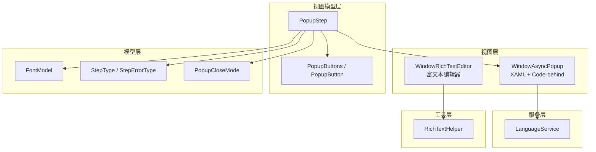
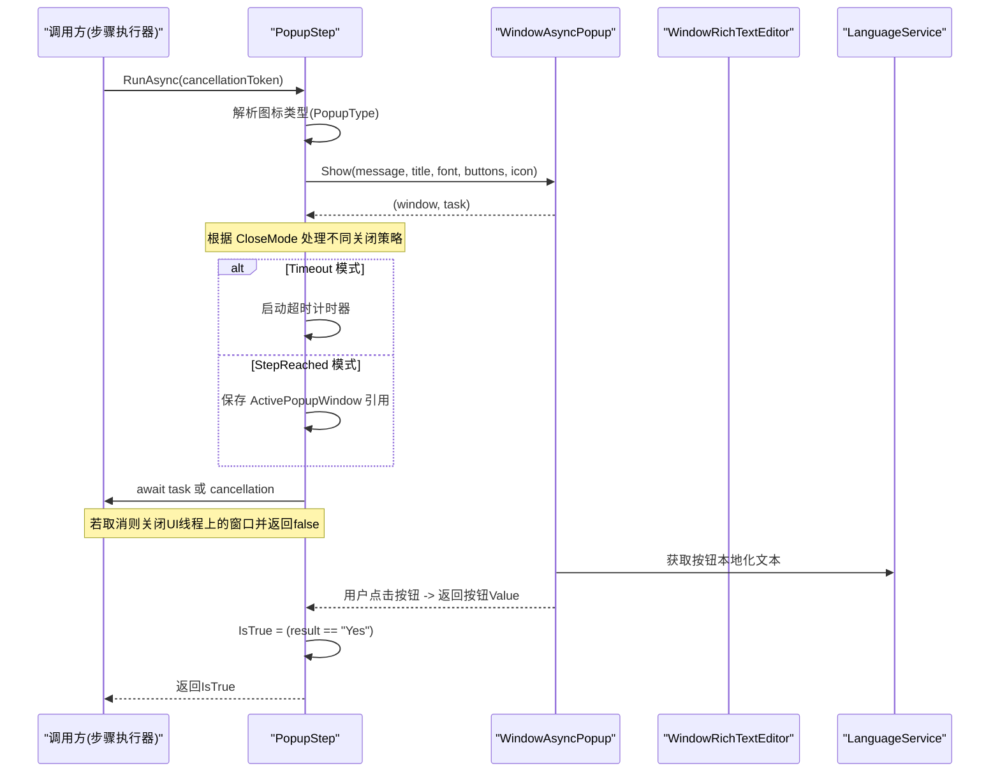
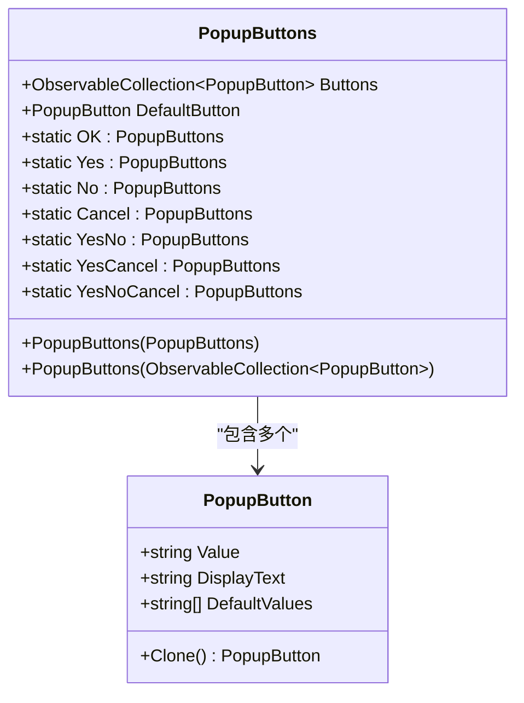
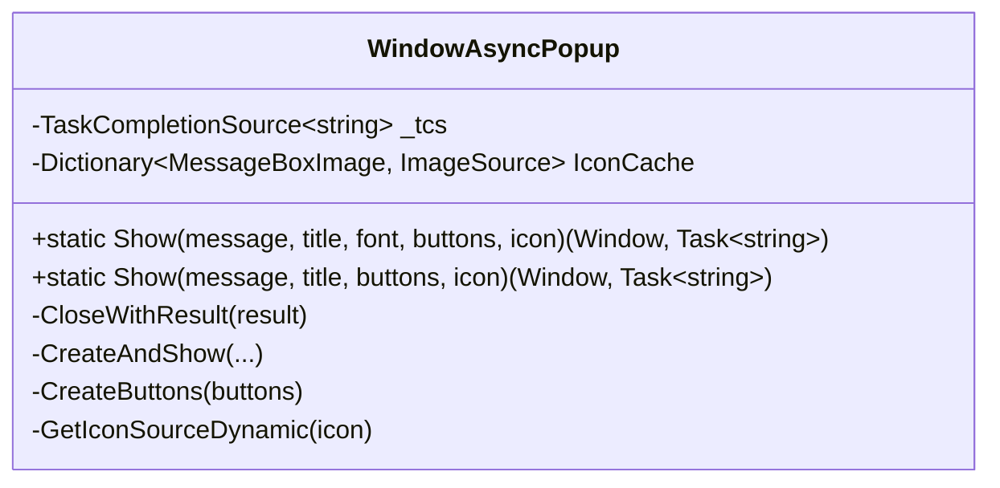
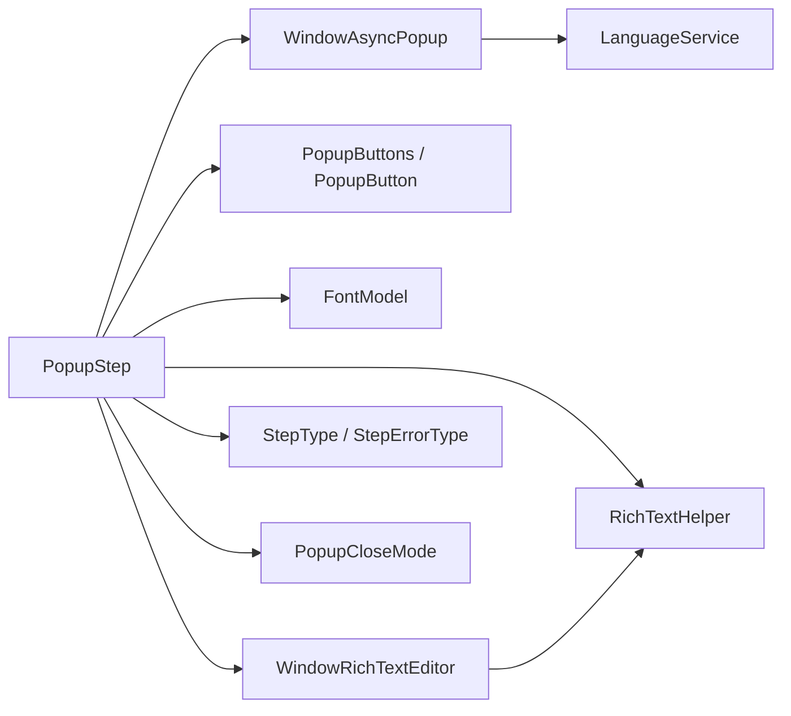

# 弹出框步骤

<cite>
**本文引用的文件**   
- [AutomationStep.cs](file://ShaoLu/Viewmodels/AutomationStep.cs)
- [PopupButton.cs](file://ShaoLu/Viewmodels/PopupButton.cs)
- [FontModel.cs](file://ShaoLu/Models/FontModel.cs)
- [WindowAsyncPopup.xaml](file://ShaoLu/Views/WindowAsyncPopup.xaml)
- [WindowAsyncPopup.xaml.cs](file://ShaoLu/Views/WindowAsyncPopup.xaml.cs)
- [AutomationStepModel.cs](file://ShaoLu/Models/AutomationStepModel.cs)
- [LanguageService.cs](file://ShaoLu/Services/LanguageService.cs)
- [WindowRichTextEditor.xaml](file://ShaoLu/Views/WindowRichTextEditor.xaml)
- [WindowRichTextEditor.xaml.cs](file://ShaoLu/Views/WindowRichTextEditor.xaml.cs)
- [RichTextHelper.cs](file://ShaoLu/Utils/RichTextHelper.cs)
</cite>

## 更新摘要
**所做更改**   
- 新增 PopupCloseMode 枚举支持三种弹窗关闭模式：ButtonClick、Timeout、StepReached
- 添加 RichTextEditCommand 用于富文本内容编辑
- 改进 PopupButton 内存管理，提供工厂方法和深拷贝机制
- 增强弹窗生命周期管理和线程安全处理

## 目录
1. [简介](#简介)
2. [项目结构](#项目结构)
3. [核心组件](#核心组件)
4. [架构总览](#架构总览)
5. [详细组件分析](#详细组件分析)
6. [依赖关系分析](#依赖关系分析)
7. [性能考虑](#性能考虑)
8. [故障排查指南](#故障排查指南)
9. [结论](#结论)
10. [附录：用户体验与样式定制建议](#附录用户界面与样式定制建议)

## 简介
本文件围绕"弹出框步骤"展开，系统性说明 PopupStep 的用户交互能力、图标与语义、按钮配置系统、异步弹窗机制（WindowAsyncPopup）、任务取消与线程安全处理、以及用户选择结果的返回逻辑。同时给出字体样式定制（FontModel）与用户体验优化建议，帮助读者快速理解并正确使用该功能。

**更新** 新增弹窗关闭模式系统，支持点击按钮关闭、超时自动关闭和到达指定步骤时关闭三种模式，并提供富文本编辑器支持复杂格式的消息内容。

## 项目结构
弹出框相关代码分布在 Viewmodels、Models、Views 与 Services 四个层次：
- Viewmodels：定义步骤模型与行为（PopupStep、PopupButtons、PopupButton）。
- Models：定义字体样式数据模型（FontModel）、步骤类型枚举（StepType）和弹窗关闭模式（PopupCloseMode）。
- Views：实现非模态异步弹窗窗口（WindowAsyncPopup）和富文本编辑器（WindowRichTextEditor）。
- Services：提供本地化字符串支持（LanguageService）。
- Utils：提供富文本序列化/反序列化辅助类（RichTextHelper）。



**图表来源**   
- [AutomationStep.cs:672-952](file://ShaoLu/Viewmodels/AutomationStep.cs#L672-L952)
- [PopupButton.cs:1-113](file://ShaoLu/Viewmodels/PopupButton.cs#L1-L113)
- [FontModel.cs:1-46](file://ShaoLu/Models/FontModel.cs#L1-L46)
- [WindowAsyncPopup.xaml.cs:1-233](file://ShaoLu/Views/WindowAsyncPopup.xaml.cs#L1-L233)
- [WindowRichTextEditor.xaml.cs:1-129](file://ShaoLu/Views/WindowRichTextEditor.xaml.cs#L1-L129)
- [AutomationStepModel.cs:1-60](file://ShaoLu/Models/AutomationStepModel.cs#L1-L60)
- [LanguageService.cs:53-64](file://ShaoLu/Services/LanguageService.cs#L53-L64)
- [RichTextHelper.cs:1-127](file://ShaoLu/Utils/RichTextHelper.cs#L1-L127)

## 核心组件
- **PopupStep**：封装弹出框步骤的配置与执行流程，包括标题、消息内容、字体样式、图标类型、按钮集合等；负责启动异步弹窗、等待结果、处理取消与异常，并设置 IsTrue 以驱动后续流程分支。
- **PopupButtons / PopupButton**：管理按钮集合与默认按钮，内置常用按钮（OK、Yes、No、Cancel），支持动态添加与删除，提供工厂方法和深拷贝机制避免内存问题。
- **FontModel**：承载字体族、字号、粗细、斜体、颜色等样式属性，并提供克隆方法。
- **WindowAsyncPopup**：非模态异步弹窗窗口，负责显示图标、消息文本、动态生成按钮，并通过 TaskCompletionSource 返回用户选择结果。
- **WindowRichTextEditor**：富文本编辑器窗口，支持格式化文本输入和编辑。
- **LanguageService**：提供本地化字符串解析，用于按钮显示文本的国际化。
- **RichTextHelper**：富文本序列化/反序列化辅助类，支持 XAML FlowDocument 格式。

**章节来源**   
- [AutomationStep.cs:672-952](file://ShaoLu/Viewmodels/AutomationStep.cs#L672-L952)
- [PopupButton.cs:1-113](file://ShaoLu/Viewmodels/PopupButton.cs#L1-L113)
- [FontModel.cs:1-46](file://ShaoLu/Models/FontModel.cs#L1-L46)
- [WindowAsyncPopup.xaml.cs:1-233](file://ShaoLu/Views/WindowAsyncPopup.xaml.cs#L1-L233)
- [WindowRichTextEditor.xaml.cs:1-129](file://ShaoLu/Views/WindowRichTextEditor.xaml.cs#L1-L129)
- [LanguageService.cs:53-64](file://ShaoLu/Services/LanguageService.cs#L53-L64)
- [RichTextHelper.cs:1-127](file://ShaoLu/Utils/RichTextHelper.cs#L1-L127)

## 架构总览
PopupStep 在执行时通过 WindowAsyncPopup.Show 创建并显示非模态弹窗，返回窗口实例与一个 Task<string>。调用方使用 CancellationToken 注册取消回调，并在 UI 线程安全地关闭窗口。用户点击按钮后，WindowAsyncPopup 通过 TaskCompletionSource 设置结果，PopupStep 根据返回值更新 IsTrue，从而控制后续流程跳转。

**更新** 新增弹窗关闭模式系统，支持三种不同的关闭策略：用户点击按钮关闭、超时自动关闭、到达指定步骤时关闭。



**图表来源**   
- [AutomationStep.cs:797-897](file://ShaoLu/Viewmodels/AutomationStep.cs#L797-L897)
- [WindowAsyncPopup.xaml.cs:41-136](file://ShaoLu/Views/WindowAsyncPopup.xaml.cs#L41-L136)
- [LanguageService.cs:53-64](file://ShaoLu/Services/LanguageService.cs#L53-L64)

## 详细组件分析

### PopupStep 类：用户交互与执行流程
- **标题与消息**
  - Title：弹窗标题。
  - PopupText：弹窗消息内容，支持纯文本和富文本格式。
- **字体样式定制（FontModel）**
  - PopupFont：包含字体族、字号、粗细、斜体、颜色等属性，支持通过 FontSelectCommand 和 ColorSelectCommand 打开系统对话框进行设置。
- **图标类型与语义**
  - PopupType：支持 Information、Warning、Error、Question 四种类型，分别映射到 MessageBoxImage 对应图标，体现不同语义（信息、警告、错误、询问）。
- **按钮配置系统（PopupButtons）**
  - PopupButtons.Buttons：可观察集合，支持 AddButtonCommand 与 DelButtonCommand 动态增删按钮。
  - 内置静态按钮集：OK、Yes、No、Cancel、YesNo、YesCancel、YesNoCancel。
- **弹窗关闭模式系统**
  - CloseMode：支持 ButtonClick（点击按钮关闭）、Timeout（超时自动关闭）、StepReached（到达指定步骤关闭）三种模式。
  - AutoCloseSeconds：Timeout 模式下自动关闭的时间（秒）。
  - CloseOnStepUid：StepReached 模式下触发关闭的目标步骤 UID。
  - ActivePopupWindow：运行时引用当前活跃的弹窗实例，供 StepReached 模式使用。
- **富文本编辑功能**
  - RichTextEditCommand：打开富文本编辑器编辑 PopupText 内容。
  - 支持格式化文本、粗体、斜体、下划线、字体大小、颜色和对齐方式。
- **异步弹窗机制**
  - 调用 WindowAsyncPopup.Show 返回 (Window, Task<string>)。
  - 使用 CancellationToken 注册取消回调，在 UI 线程上安全关闭窗口。
  - 使用 Task.WhenAny 等待弹窗完成或取消，确保响应停止操作。
- **用户交互结果返回**
  - 当用户点击按钮，WindowAsyncPopup 通过 TaskCompletionSource 设置结果（按钮 Value）。
  - PopupStep 将 IsTrue 设置为 result == "Yes"，从而驱动真/假分支。

**更新** 新增弹窗关闭模式系统和富文本编辑功能，提供更灵活的弹窗控制能力和丰富的文本格式支持。

```mermaid
flowchart TD
Start(["RunAsync 入口"]) --> ParseIcon["解析 PopupType -> MessageBoxImage"]
ParseIcon --> ShowPopup["调用 WindowAsyncPopup.Show(...)"]
ShowPopup --> SetActive["保存 ActivePopupWindow 引用"]
SetActive --> CheckMode{"检查 CloseMode"}
CheckMode --> |ButtonClick| AwaitUser["等待用户点击"]
CheckMode --> |Timeout| StartTimer["启动超时计时器"]
CheckMode --> |StepReached| WaitStep["等待目标步骤到达"]
AwaitUser --> GetResult["获取按钮Value"]
StartTimer --> TimeoutCheck{"是否超时?"}
TimeoutCheck --> |是| AutoClose["自动关闭并返回默认值"]
TimeoutCheck --> |否| AwaitUser
WaitStep --> StepReachedCheck{"是否到达目标步骤?"}
StepReachedCheck --> |是| ManualClose["手动关闭弹窗"]
StepReachedCheck --> |否| WaitStep
GetResult --> SetTrue["IsTrue = (Value==\"Yes\")"]
AutoClose --> SetTrue
ManualClose --> SetTrue
SetTrue --> ReturnTrue["返回IsTrue"]
```

**图表来源**   
- [AutomationStep.cs:797-897](file://ShaoLu/Viewmodels/AutomationStep.cs#L797-L897)

**章节来源**   
- [AutomationStep.cs:672-952](file://ShaoLu/Viewmodels/AutomationStep.cs#L672-L952)

### PopupButtons 与 PopupButton：按钮集合管理与内存优化
- **PopupButton**
  - Value：按钮值（如 "Yes"、"No"、"OK"、"Cancel"）。
  - DisplayText：显示文本，若 Value 属于默认值集合，则通过 LanguageService.GetLocalizedString 获取本地化文本。
  - DefaultValues：默认值集合 ["OK", "Yes", "No", "Cancel"]。
  - Clone()：深拷贝方法，创建新的 PopupButton 实例避免共享对象污染。
- **PopupButtons**
  - Buttons：ObservableCollection<PopupButton>，支持动态增删。
  - DefaultButton：默认按钮（Enter 键触发）。
  - 工厂属性：OK、Yes、No、Cancel、YesNo、YesCancel、YesNoCancel，每次访问返回新实例。
  - 构造函数重载：支持从现有集合复制与设置默认按钮，所有复制都进行深拷贝。
  - 内部工厂构造：根据 Value 列表创建按钮，每个按钮都是独立实例。

**更新** 改进了内存管理，通过工厂方法和深拷贝机制避免共享对象被污染的问题。



**图表来源**   
- [PopupButton.cs:1-113](file://ShaoLu/Viewmodels/PopupButton.cs#L1-L113)

**章节来源**   
- [PopupButton.cs:1-113](file://ShaoLu/Viewmodels/PopupButton.cs#L1-L113)

### FontModel：字体样式定制
- **属性**
  - FontFamily、FontSize、FontWeight、FontStyle：WPF 字体属性。
  - Style、Unit：System.Drawing 字体风格与单位。
  - FontColor、FontBackgroundColor、FontBorderColor、FontBorderWidth：颜色与边框样式。
- **行为**
  - Clone()：深拷贝当前字体模型。
  - 构造：默认使用系统消息字体族、大小、样式与粗细。

**章节来源**   
- [FontModel.cs:1-46](file://ShaoLu/Models/FontModel.cs#L1-L46)

### WindowAsyncPopup：异步弹窗窗口
- **显示与初始化**
  - Show(...)：静态方法，确保在 UI 线程创建窗口，返回 (Window, Task<string>)。
  - CreateAndShow(...)：统一处理消息文本、字体应用、图标设置、按钮生成、事件绑定与非模态显示。
- **图标缓存**
  - IconCache：预加载常见系统图标（Error、Warning、Question、Information、None），避免重复转换提升性能。
- **按钮生成**
  - CreateButtons(buttons)：遍历按钮集合，为每个按钮创建 Button 控件，设置内容与默认状态；点击时通过 _tcs.TrySetResult(result) 返回按钮 Value 并关闭窗口。
- **线程安全与生命周期**
  - Closed 事件：若任务未完成，设置空结果并清理引用，防止挂起。
  - Dispatcher 检查：在非 UI 线程调用 Show 时自动切换到 UI 线程创建窗口。
- **外部控制接口**
  - CloseWithResult(string result)：从外部触发关闭弹窗并设置结果，供超时/步骤到达模式使用。

**更新** 新增 CloseWithResult 方法支持外部控制弹窗关闭，增强弹窗生命周期管理。



**图表来源**   
- [WindowAsyncPopup.xaml.cs:1-233](file://ShaoLu/Views/WindowAsyncPopup.xaml.cs#L1-L233)
- [WindowAsyncPopup.xaml:1-44](file://ShaoLu/Views/WindowAsyncPopup.xaml#L1-L44)

**章节来源**   
- [WindowAsyncPopup.xaml.cs:1-233](file://ShaoLu/Views/WindowAsyncPopup.xaml.cs#L1-L233)
- [WindowAsyncPopup.xaml:1-44](file://ShaoLu/Views/WindowAsyncPopup.xaml#L1-L44)

### WindowRichTextEditor：富文本编辑器
- **功能特性**
  - 支持粗体、斜体、下划线文本格式。
  - 支持多种字体大小选择（10-48号）。
  - 支持文本颜色设置。
  - 支持左对齐、居中对齐、右对齐。
  - 支持多行文本输入。
- **技术实现**
  - 基于 WPF RichTextBox 控件。
  - 使用 RichTextHelper 进行序列化和反序列化。
  - 支持 XAML FlowDocument 格式存储。
- **用户界面**
  - 工具栏提供格式化选项。
  - 底部按钮区域包含确认和取消操作。
  - 主编辑区支持富文本编辑。

**新增** 富文本编辑器功能，支持复杂的文本格式编辑。

**章节来源**   
- [WindowRichTextEditor.xaml.cs:1-129](file://ShaoLu/Views/WindowRichTextEditor.xaml.cs#L1-L129)
- [WindowRichTextEditor.xaml:1-55](file://ShaoLu/Views/WindowRichTextEditor.xaml#L1-L55)

### RichTextHelper：富文本处理工具
- **核心功能**
  - Serialize(FlowDocument)：将 FlowDocument 序列化为 XAML 字符串。
  - Deserialize(string)：将字符串反序列化为 FlowDocument，兼容纯文本。
  - IsRichText(string)：判断字符串是否为富文本格式。
  - GetPlainText(FlowDocument)：从 FlowDocument 提取纯文本。
- **格式支持**
  - 支持 XAML FlowDocument 格式。
  - 兼容纯文本格式。
  - 智能检测纯文本与富文本。

**新增** 富文本处理工具类，支持文本格式的序列化和反序列化。

**章节来源**   
- [RichTextHelper.cs:1-127](file://ShaoLu/Utils/RichTextHelper.cs#L1-L127)

### 步骤类型与错误类型
- **StepType.Popup**：弹出框步骤的类型标识。
- **StepErrorType**：包含多种错误类型，如 IndexOutOfRange、CancelledByUser、PopupError 等，便于日志与调试。
- **PopupCloseMode**：新增的弹窗关闭模式枚举，支持 ButtonClick、Timeout、StepReached 三种模式。

**更新** 新增 PopupCloseMode 枚举定义弹窗关闭模式。

**章节来源**   
- [AutomationStepModel.cs:1-60](file://ShaoLu/Models/AutomationStepModel.cs#L1-L60)

## 依赖关系分析
- **PopupStep 依赖**：
  - WindowAsyncPopup：显示弹窗并返回用户选择。
  - FontModel：字体样式配置。
  - PopupButtons / PopupButton：按钮集合与默认按钮。
  - LanguageService：按钮本地化文本。
  - StepType / StepErrorType：步骤与错误类型枚举。
  - WindowRichTextEditor：富文本编辑器。
  - RichTextHelper：富文本处理工具。
- **WindowAsyncPopup 依赖**：
  - LanguageService：按钮显示文本本地化。
  - SystemIcons：系统图标资源。
  - WPF 框架：Dispatcher、TaskCompletionSource、UI 元素。
- **WindowRichTextEditor 依赖**：
  - RichTextHelper：富文本序列化/反序列化。
  - WPF 框架：RichTextBox、各种 UI 控件。

**更新** 新增对富文本编辑器和相关工具的依赖关系。



**图表来源**   
- [AutomationStep.cs:672-952](file://ShaoLu/Viewmodels/AutomationStep.cs#L672-L952)
- [WindowAsyncPopup.xaml.cs:1-233](file://ShaoLu/Views/WindowAsyncPopup.xaml.cs#L1-L233)
- [PopupButton.cs:1-113](file://ShaoLu/Viewmodels/PopupButton.cs#L1-L113)
- [FontModel.cs:1-46](file://ShaoLu/Models/FontModel.cs#L1-L46)
- [AutomationStepModel.cs:1-60](file://ShaoLu/Models/AutomationStepModel.cs#L1-L60)
- [LanguageService.cs:53-64](file://ShaoLu/Services/LanguageService.cs#L53-L64)
- [WindowRichTextEditor.xaml.cs:1-129](file://ShaoLu/Views/WindowRichTextEditor.xaml.cs#L1-L129)
- [RichTextHelper.cs:1-127](file://ShaoLu/Utils/RichTextHelper.cs#L1-L127)

**章节来源**   
- [AutomationStep.cs:672-952](file://ShaoLu/Viewmodels/AutomationStep.cs#L672-L952)
- [WindowAsyncPopup.xaml.cs:1-233](file://ShaoLu/Views/WindowAsyncPopup.xaml.cs#L1-L233)
- [PopupButton.cs:1-113](file://ShaoLu/Viewmodels/PopupButton.cs#L1-L113)
- [FontModel.cs:1-46](file://ShaoLu/Models/FontModel.cs#L1-L46)
- [AutomationStepModel.cs:1-60](file://ShaoLu/Models/AutomationStepModel.cs#L1-L60)
- [LanguageService.cs:53-64](file://ShaoLu/Services/LanguageService.cs#L53-L64)
- [WindowRichTextEditor.xaml.cs:1-129](file://ShaoLu/Views/WindowRichTextEditor.xaml.cs#L1-L129)
- [RichTextHelper.cs:1-127](file://ShaoLu/Utils/RichTextHelper.cs#L1-L127)

## 性能考虑
- **图标缓存**：WindowAsyncPopup 静态构造中预加载常用系统图标，避免重复 GDI+ 到 WPF 的转换开销。
- **非模态显示**：弹窗不阻塞主线程，允许主窗口继续响应其他事件（如停止按钮）。
- **线程安全**：所有 UI 操作通过 Dispatcher 调度，避免跨线程访问导致的异常。
- **任务取消**：使用 CancellationToken 与 Task.WhenAny 高效等待，减少不必要的资源占用。
- **内存管理**：PopupButton 和 PopupButtons 使用工厂方法和深拷贝机制，避免共享对象污染。
- **富文本优化**：RichTextHelper 智能检测纯文本与富文本，纯文本直接存储为字符串节省空间。

**更新** 新增内存管理和富文本优化的性能考虑。

## 故障排查指南
- **弹窗未显示或卡住**
  - 检查是否在 UI 线程创建窗口（Show 内部已处理，但外部调用需确保上下文正确）。
  - 确认 Closed 事件是否被触发，TaskCompletionSource 是否被设置结果。
- **按钮点击无响应**
  - 检查按钮集合是否正确生成，DefaultButton 是否设置。
  - 确认 LanguageService 是否能获取本地化文本。
- **取消无效**
  - 确认 CancellationToken 已正确注册到 Task，并在 UI 线程调用 Close。
- **字体样式未生效**
  - 检查 FontModel 属性是否正确赋值，颜色格式是否为 ARGB。
- **富文本编辑问题**
  - 确认 RichTextHelper 能正确序列化和反序列化内容。
  - 检查 XAML 格式是否有效。
- **弹窗关闭模式异常**
  - 检查 CloseMode 设置是否正确。
  - 确认 Timeout 模式下 AutoCloseSeconds 值合理。
  - 验证 StepReached 模式下 CloseOnStepUid 指向有效的步骤。

**更新** 新增富文本编辑和弹窗关闭模式的故障排查指导。

**章节来源**   
- [WindowAsyncPopup.xaml.cs:117-136](file://ShaoLu/Views/WindowAsyncPopup.xaml.cs#L117-L136)
- [WindowAsyncPopup.xaml.cs:138-181](file://ShaoLu/Views/WindowAsyncPopup.xaml.cs#L138-L181)
- [LanguageService.cs:53-64](file://ShaoLu/Services/LanguageService.cs#L53-L64)
- [RichTextHelper.cs:48-83](file://ShaoLu/Utils/RichTextHelper.cs#L48-L83)

## 结论
PopupStep 提供了完整的弹出框交互能力，涵盖标题与消息配置、字体样式定制、图标语义区分、按钮集合管理与自定义、异步弹窗机制与任务取消、以及用户选择结果返回。结合 WindowAsyncPopup 的非模态设计与线程安全处理，能够在复杂自动化流程中提供稳定且友好的用户交互体验。

**更新** 新增的弹窗关闭模式系统和富文本编辑功能进一步增强了系统的灵活性和用户体验，使弹窗能够适应更多样化的使用场景。

## 附录：用户体验与样式定制建议
- **图标语义**
  - Information：一般提示信息。
  - Warning：需要用户注意但不阻止流程。
  - Error：严重错误，通常应中止或提示修复。
  - Question：需要用户明确选择（Yes/No）以继续。
- **按钮设计**
  - 使用预设按钮集（YesNo、YesCancel、YesNoCancel）提高一致性。
  - 设置 DefaultButton 以提升键盘操作效率。
  - 利用工厂方法创建独立的按钮实例避免内存问题。
- **字体与颜色**
  - 使用系统默认字体族与大小保证可读性。
  - 颜色对比度要足够，避免影响阅读。
- **交互反馈**
  - 弹窗置顶（Topmost）确保可见性。
  - 支持 Enter 键触发默认按钮，ESC 关闭弹窗。
  - 合理使用弹窗关闭模式提升用户体验。
- **国际化**
  - 通过 LanguageService 获取本地化文本，确保多语言环境下的按钮显示一致。
- **富文本编辑**
  - 使用 RichTextEditCommand 编辑复杂格式的内容。
  - 合理运用粗体、斜体、颜色等格式突出重要信息。
  - 保持文本的可读性和美观性。

**更新** 新增富文本编辑和弹窗关闭模式的使用建议。