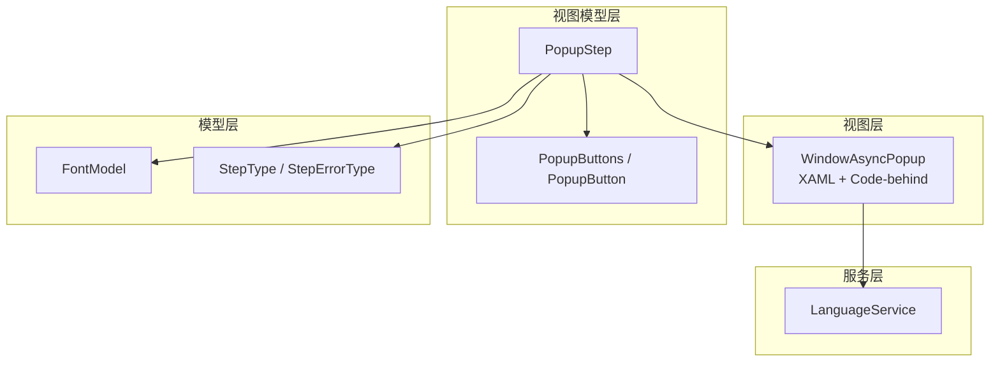
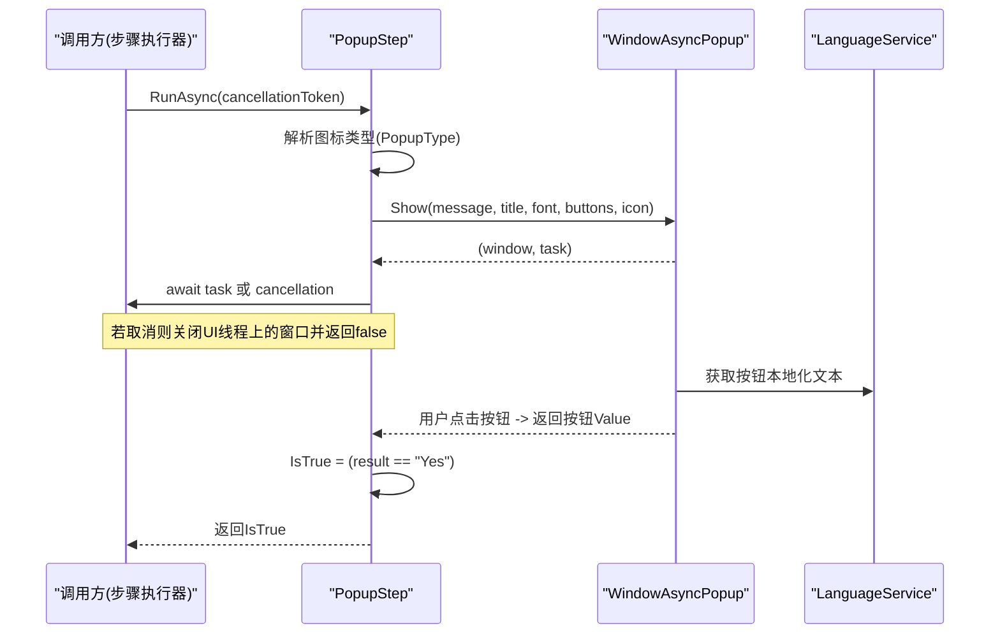
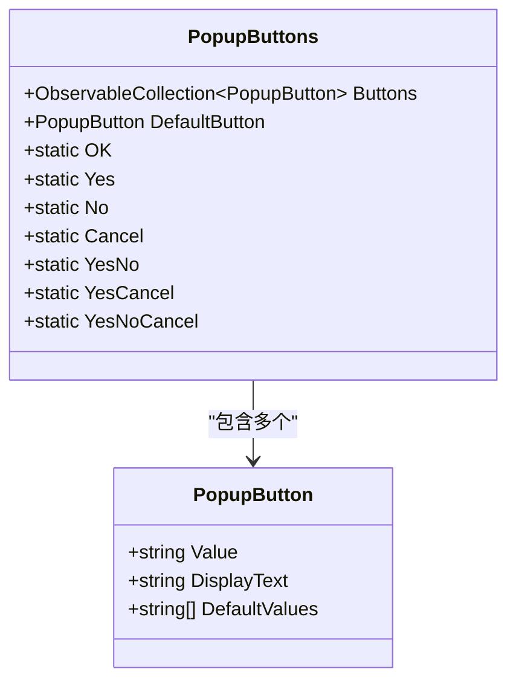
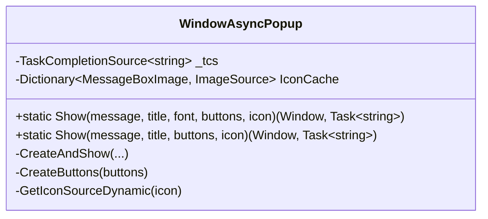
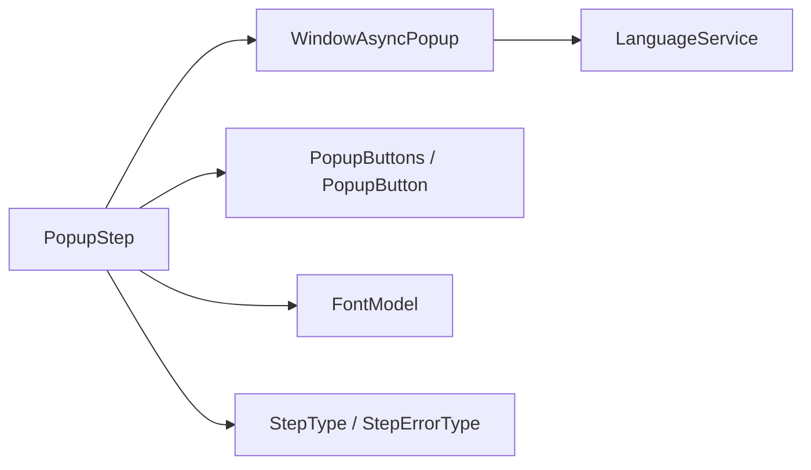

# 弹出框步骤

<cite>
**本文引用的文件**   
- [AutomationStep.cs](file://ShaoLu/Viewmodels/AutomationStep.cs)
- [PopupButton.cs](file://ShaoLu/Viewmodels/PopupButton.cs)
- [FontModel.cs](file://ShaoLu/Models/FontModel.cs)
- [WindowAsyncPopup.xaml](file://ShaoLu/Views/WindowAsyncPopup.xaml)
- [WindowAsyncPopup.xaml.cs](file://ShaoLu/Views/WindowAsyncPopup.xaml.cs)
- [AutomationStepModel.cs](file://ShaoLu/Models/AutomationStepModel.cs)
- [LanguageService.cs](file://ShaoLu/Services/LanguageService.cs)
</cite>

## 目录
1. [简介](#简介)
2. [项目结构](#项目结构)
3. [核心组件](#核心组件)
4. [架构总览](#架构总览)
5. [详细组件分析](#详细组件分析)
6. [依赖关系分析](#依赖关系分析)
7. [性能考虑](#性能考虑)
8. [故障排查指南](#故障排查指南)
9. [结论](#结论)
10. [附录：用户体验与样式定制建议](#附录用户界面与样式定制建议)

## 简介
本文件围绕“弹出框步骤”展开，系统性说明 PopupStep 的用户交互能力、图标与语义、按钮配置系统、异步弹窗机制（WindowAsyncPopup）、任务取消与线程安全处理、以及用户选择结果的返回逻辑。同时给出字体样式定制（FontModel）与用户体验优化建议，帮助读者快速理解并正确使用该功能。

## 项目结构
弹出框相关代码分布在 Viewmodels、Models、Views 与 Services 四个层次：
- Viewmodels：定义步骤模型与行为（PopupStep、PopupButtons、PopupButton）。
- Models：定义字体样式数据模型（FontModel）与步骤类型枚举（StepType）。
- Views：实现非模态异步弹窗窗口（WindowAsyncPopup）。
- Services：提供本地化字符串支持（LanguageService）。



图表来源
- [AutomationStep.cs:606-807](file://ShaoLu/Viewmodels/AutomationStep.cs#L606-L807)
- [PopupButton.cs:1-74](file://ShaoLu/Viewmodels/PopupButton.cs#L1-L74)
- [FontModel.cs:1-46](file://ShaoLu/Models/FontModel.cs#L1-L46)
- [WindowAsyncPopup.xaml.cs:1-213](file://ShaoLu/Views/WindowAsyncPopup.xaml.cs#L1-L213)
- [AutomationStepModel.cs:9-41](file://ShaoLu/Models/AutomationStepModel.cs#L9-L41)
- [LanguageService.cs:53-64](file://ShaoLu/Services/LanguageService.cs#L53-L64)

章节来源
- [AutomationStep.cs:606-807](file://ShaoLu/Viewmodels/AutomationStep.cs#L606-L807)
- [PopupButton.cs:1-74](file://ShaoLu/Viewmodels/PopupButton.cs#L1-L74)
- [FontModel.cs:1-46](file://ShaoLu/Models/FontModel.cs#L1-L46)
- [WindowAsyncPopup.xaml.cs:1-213](file://ShaoLu/Views/WindowAsyncPopup.xaml.cs#L1-L213)
- [AutomationStepModel.cs:9-41](file://ShaoLu/Models/AutomationStepModel.cs#L9-L41)
- [LanguageService.cs:53-64](file://ShaoLu/Services/LanguageService.cs#L53-L64)

## 核心组件
- PopupStep：封装弹出框步骤的配置与执行流程，包括标题、消息内容、字体样式、图标类型、按钮集合等；负责启动异步弹窗、等待结果、处理取消与异常，并设置 IsTrue 以驱动后续流程分支。
- PopupButtons / PopupButton：管理按钮集合与默认按钮，内置常用按钮（OK、Yes、No、Cancel），支持动态添加与删除。
- FontModel：承载字体族、字号、粗细、斜体、颜色等样式属性，并提供克隆方法。
- WindowAsyncPopup：非模态异步弹窗窗口，负责显示图标、消息文本、动态生成按钮，并通过 TaskCompletionSource 返回用户选择结果。
- LanguageService：提供本地化字符串解析，用于按钮显示文本的国际化。

章节来源
- [AutomationStep.cs:606-807](file://ShaoLu/Viewmodels/AutomationStep.cs#L606-L807)
- [PopupButton.cs:1-74](file://ShaoLu/Viewmodels/PopupButton.cs#L1-L74)
- [FontModel.cs:1-46](file://ShaoLu/Models/FontModel.cs#L1-L46)
- [WindowAsyncPopup.xaml.cs:1-213](file://ShaoLu/Views/WindowAsyncPopup.xaml.cs#L1-L213)
- [LanguageService.cs:53-64](file://ShaoLu/Services/LanguageService.cs#L53-L64)

## 架构总览
PopupStep 在执行时通过 WindowAsyncPopup.Show 创建并显示非模态弹窗，返回窗口实例与一个 Task<string>。调用方使用 CancellationToken 注册取消回调，并在 UI 线程安全地关闭窗口。用户点击按钮后，WindowAsyncPopup 通过 TaskCompletionSource 设置结果，PopupStep 根据返回值更新 IsTrue，从而控制后续流程跳转。



图表来源
- [AutomationStep.cs:693-752](file://ShaoLu/Viewmodels/AutomationStep.cs#L693-L752)
- [WindowAsyncPopup.xaml.cs:41-134](file://ShaoLu/Views/WindowAsyncPopup.xaml.cs#L41-L134)
- [LanguageService.cs:53-64](file://ShaoLu/Services/LanguageService.cs#L53-L64)

## 详细组件分析

### PopupStep 类：用户交互与执行流程
- 标题与消息
  - Title：弹窗标题。
  - PopupText：弹窗消息内容。
- 字体样式定制（FontModel）
  - PopupFont：包含字体族、字号、粗细、斜体、颜色等属性，支持通过 FontSelectCommand 和 ColorSelectCommand 打开系统对话框进行设置。
- 图标类型与语义
  - PopupType：支持 Information、Warning、Error、Question 四种类型，分别映射到 MessageBoxImage 对应图标，体现不同语义（信息、警告、错误、询问）。
- 按钮配置系统（PopupButtons）
  - PopupButtons.Buttons：可观察集合，支持 AddButtonCommand 与 DelButtonCommand 动态增删按钮。
  - 内置静态按钮集：OK、Yes、No、Cancel、YesNo、YesCancel、YesNoCancel。
- 异步弹窗机制
  - 调用 WindowAsyncPopup.Show 返回 (Window, Task<string>)。
  - 使用 CancellationToken 注册取消回调，在 UI 线程上安全关闭窗口。
  - 使用 Task.WhenAny 等待弹窗完成或取消，确保响应停止操作。
- 用户交互结果返回
  - 当用户点击按钮，WindowAsyncPopup 通过 TaskCompletionSource 设置结果（按钮 Value）。
  - PopupStep 将 IsTrue 设置为 result == "Yes"，从而驱动真/假分支。

```mermaid
flowchart TD
Start(["RunAsync 入口"]) --> ParseIcon["解析 PopupType -> MessageBoxImage"]
ParseIcon --> ShowPopup["调用 WindowAsyncPopup.Show(...)"]
ShowPopup --> AwaitOrCancel{"await 弹窗任务 或 取消?"}
AwaitOrCancel --> |取消| CloseUI["UI线程关闭弹窗"]
CloseUI --> ReturnFalse["IsFalse=false; 返回false"]
AwaitOrCancel --> |完成| GetResult["获取按钮Value"]
GetResult --> SetTrue["IsTrue = (Value==\"Yes\")"]
SetTrue --> ReturnTrue["返回IsTrue"]
```

图表来源
- [AutomationStep.cs:693-752](file://ShaoLu/Viewmodels/AutomationStep.cs#L693-L752)

章节来源
- [AutomationStep.cs:606-807](file://ShaoLu/Viewmodels/AutomationStep.cs#L606-L807)

### PopupButtons 与 PopupButton：按钮集合管理
- PopupButton
  - Value：按钮值（如 "Yes"、"No"、"OK"、"Cancel"）。
  - DisplayText：显示文本，若 Value 属于默认值集合，则通过 LanguageService.GetLocalizedString 获取本地化文本。
  - DefaultValues：默认值集合 ["OK", "Yes", "No", "Cancel"]。
- PopupButtons
  - Buttons：ObservableCollection<PopupButton>，支持动态增删。
  - DefaultButton：默认按钮（Enter 键触发）。
  - 静态预设：OK、Yes、No、Cancel、YesNo、YesCancel、YesNoCancel。
  - 构造函数重载：支持从现有集合复制与设置默认按钮。



图表来源
- [PopupButton.cs:1-74](file://ShaoLu/Viewmodels/PopupButton.cs#L1-L74)

章节来源
- [PopupButton.cs:1-74](file://ShaoLu/Viewmodels/PopupButton.cs#L1-L74)

### FontModel：字体样式定制
- 属性
  - FontFamily、FontSize、FontWeight、FontStyle：WPF 字体属性。
  - Style、Unit：System.Drawing 字体风格与单位。
  - FontColor、FontBackgroundColor、FontBorderColor、FontBorderWidth：颜色与边框样式。
- 行为
  - Clone()：深拷贝当前字体模型。
  - 构造：默认使用系统消息字体族、大小、样式与粗细。

章节来源
- [FontModel.cs:1-46](file://ShaoLu/Models/FontModel.cs#L1-L46)

### WindowAsyncPopup：异步弹窗窗口
- 显示与初始化
  - Show(...)：静态方法，确保在 UI 线程创建窗口，返回 (Window, Task<string>)。
  - CreateAndShow(...)：统一处理消息文本、字体应用、图标设置、按钮生成、事件绑定与非模态显示。
- 图标缓存
  - IconCache：预加载常见系统图标（Error、Warning、Question、Information、None），避免重复转换提升性能。
- 按钮生成
  - CreateButtons(buttons)：遍历按钮集合，为每个按钮创建 Button 控件，设置内容与默认状态；点击时通过 _tcs.TrySetResult(result) 返回按钮 Value 并关闭窗口。
- 线程安全与生命周期
  - Closed 事件：若任务未完成，设置空结果并清理引用，防止挂起。
  - Dispatcher 检查：在非 UI 线程调用 Show 时自动切换到 UI 线程创建窗口。



图表来源
- [WindowAsyncPopup.xaml.cs:1-213](file://ShaoLu/Views/WindowAsyncPopup.xaml.cs#L1-L213)
- [WindowAsyncPopup.xaml:1-44](file://ShaoLu/Views/WindowAsyncPopup.xaml#L1-L44)

章节来源
- [WindowAsyncPopup.xaml.cs:1-213](file://ShaoLu/Views/WindowAsyncPopup.xaml.cs#L1-L213)
- [WindowAsyncPopup.xaml:1-44](file://ShaoLu/Views/WindowAsyncPopup.xaml#L1-L44)

### 步骤类型与错误类型
- StepType.Popup：弹出框步骤的类型标识。
- StepErrorType：包含多种错误类型，如 IndexOutOfRange、CancelledByUser、PopupError 等，便于日志与调试。

章节来源
- [AutomationStepModel.cs:9-41](file://ShaoLu/Models/AutomationStepModel.cs#L9-L41)

## 依赖关系分析
- PopupStep 依赖：
  - WindowAsyncPopup：显示弹窗并返回用户选择。
  - FontModel：字体样式配置。
  - PopupButtons / PopupButton：按钮集合与默认按钮。
  - LanguageService：按钮本地化文本。
  - StepType / StepErrorType：步骤与错误类型枚举。
- WindowAsyncPopup 依赖：
  - LanguageService：按钮显示文本本地化。
  - SystemIcons：系统图标资源。
  - WPF 框架：Dispatcher、TaskCompletionSource、UI 元素。



图表来源
- [AutomationStep.cs:606-807](file://ShaoLu/Viewmodels/AutomationStep.cs#L606-L807)
- [WindowAsyncPopup.xaml.cs:1-213](file://ShaoLu/Views/WindowAsyncPopup.xaml.cs#L1-L213)
- [PopupButton.cs:1-74](file://ShaoLu/Viewmodels/PopupButton.cs#L1-L74)
- [FontModel.cs:1-46](file://ShaoLu/Models/FontModel.cs#L1-L46)
- [AutomationStepModel.cs:9-41](file://ShaoLu/Models/AutomationStepModel.cs#L9-L41)
- [LanguageService.cs:53-64](file://ShaoLu/Services/LanguageService.cs#L53-L64)

章节来源
- [AutomationStep.cs:606-807](file://ShaoLu/Viewmodels/AutomationStep.cs#L606-L807)
- [WindowAsyncPopup.xaml.cs:1-213](file://ShaoLu/Views/WindowAsyncPopup.xaml.cs#L1-L213)
- [PopupButton.cs:1-74](file://ShaoLu/Viewmodels/PopupButton.cs#L1-L74)
- [FontModel.cs:1-46](file://ShaoLu/Models/FontModel.cs#L1-L46)
- [AutomationStepModel.cs:9-41](file://ShaoLu/Models/AutomationStepModel.cs#L9-L41)
- [LanguageService.cs:53-64](file://ShaoLu/Services/LanguageService.cs#L53-L64)

## 性能考虑
- 图标缓存：WindowAsyncPopup 静态构造中预加载常用系统图标，避免重复 GDI+ 到 WPF 的转换开销。
- 非模态显示：弹窗不阻塞主线程，允许主窗口继续响应其他事件（如停止按钮）。
- 线程安全：所有 UI 操作通过 Dispatcher 调度，避免跨线程访问导致的异常。
- 任务取消：使用 CancellationToken 与 Task.WhenAny 高效等待，减少不必要的资源占用。

[本节为通用性能建议，无需特定文件引用]

## 故障排查指南
- 弹窗未显示或卡住
  - 检查是否在 UI 线程创建窗口（Show 内部已处理，但外部调用需确保上下文正确）。
  - 确认 Closed 事件是否被触发，TaskCompletionSource 是否被设置结果。
- 按钮点击无响应
  - 检查按钮集合是否正确生成，DefaultButton 是否设置。
  - 确认 LanguageService 是否能获取本地化文本。
- 取消无效
  - 确认 CancellationToken 已正确注册到 Task，并在 UI 线程调用 Close。
- 字体样式未生效
  - 检查 FontModel 属性是否正确赋值，颜色格式是否为 ARGB。

章节来源
- [WindowAsyncPopup.xaml.cs:117-134](file://ShaoLu/Views/WindowAsyncPopup.xaml.cs#L117-L134)
- [WindowAsyncPopup.xaml.cs:136-179](file://ShaoLu/Views/WindowAsyncPopup.xaml.cs#L136-L179)
- [LanguageService.cs:53-64](file://ShaoLu/Services/LanguageService.cs#L53-L64)

## 结论
PopupStep 提供了完整的弹出框交互能力，涵盖标题与消息配置、字体样式定制、图标语义区分、按钮集合管理与自定义、异步弹窗机制与任务取消、以及用户选择结果返回。结合 WindowAsyncPopup 的非模态设计与线程安全处理，能够在复杂自动化流程中提供稳定且友好的用户交互体验。

[本节为总结性内容，无需特定文件引用]

## 附录：用户体验与样式定制建议
- 图标语义
  - Information：一般提示信息。
  - Warning：需要用户注意但不阻止流程。
  - Error：严重错误，通常应中止或提示修复。
  - Question：需要用户明确选择（Yes/No）以继续。
- 按钮设计
  - 使用预设按钮集（YesNo、YesCancel、YesNoCancel）提高一致性。
  - 设置 DefaultButton 以提升键盘操作效率。
- 字体与颜色
  - 使用系统默认字体族与大小保证可读性。
  - 颜色对比度要足够，避免影响阅读。
- 交互反馈
  - 弹窗置顶（Topmost）确保可见性。
  - 支持 Enter 键触发默认按钮，ESC 关闭弹窗。
- 国际化
  - 通过 LanguageService 获取本地化文本，确保多语言环境下的按钮显示一致。

[本节为概念性建议，无需特定文件引用]