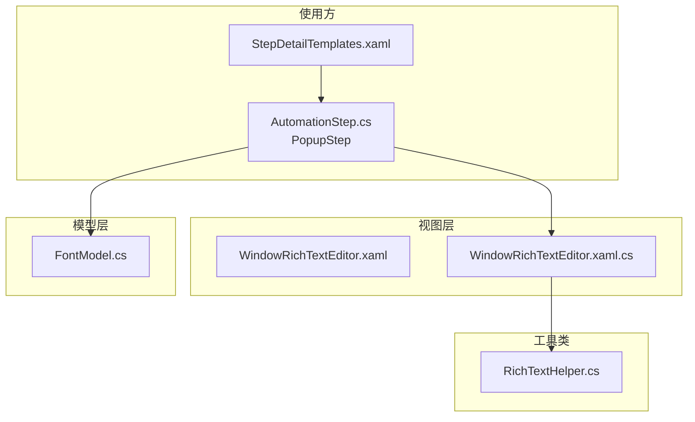
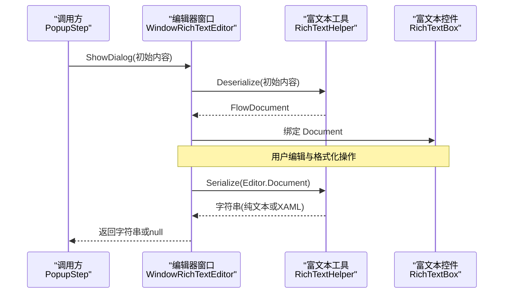
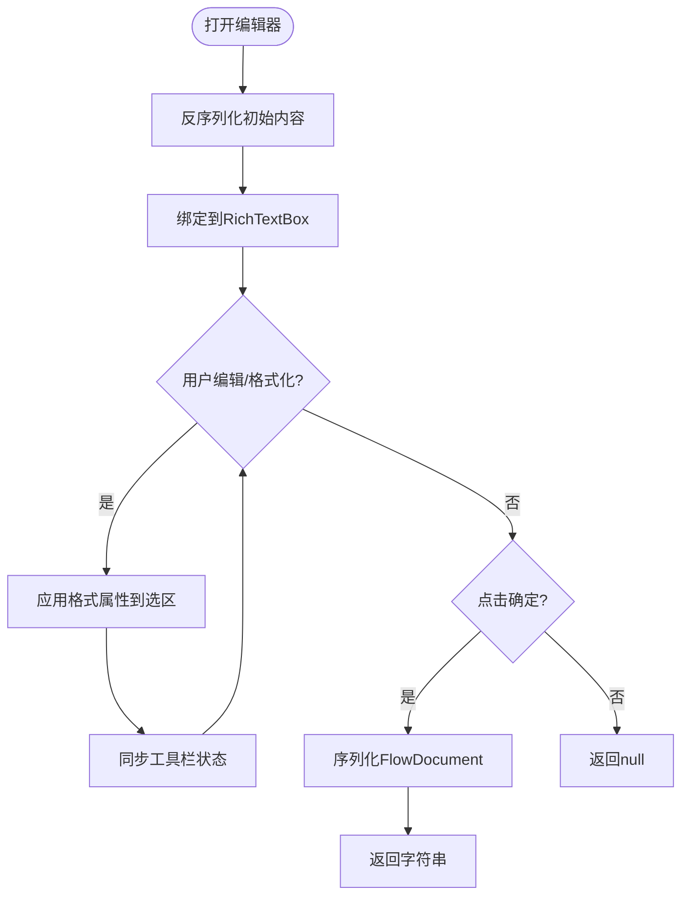
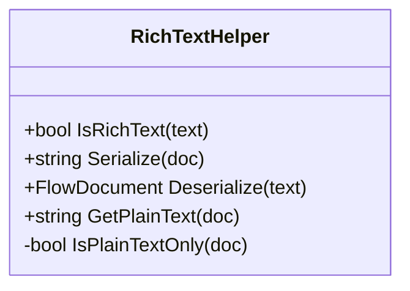
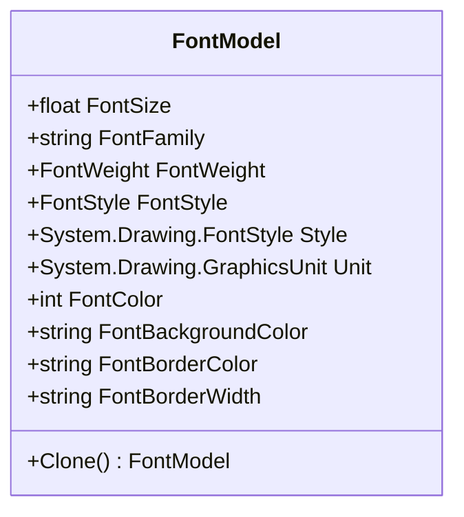
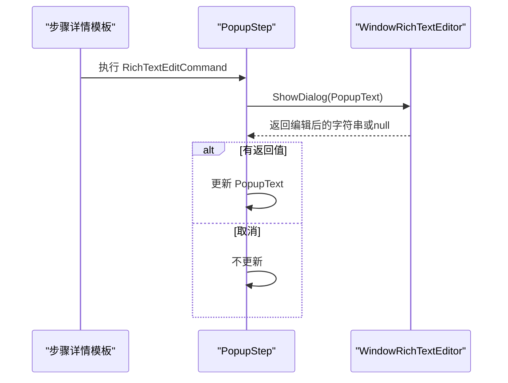

# 富文本编辑器

<cite>
**本文引用的文件**   
- [WindowRichTextEditor.xaml](file://ShaoLu/Views/WindowRichTextEditor.xaml)
- [WindowRichTextEditor.xaml.cs](file://ShaoLu/Views/WindowRichTextEditor.xaml.cs)
- [RichTextHelper.cs](file://ShaoLu/Utils/RichTextHelper.cs)
- [AutomationStep.cs](file://ShaoLu/Viewmodels/AutomationStep.cs)
- [StepDetailTemplates.xaml](file://ShaoLu/Templates/StepDetailTemplates.xaml)
- [FontModel.cs](file://ShaoLu/Models/FontModel.cs)
</cite>

## 目录
1. [简介](#简介)
2. [项目结构](#项目结构)
3. [核心组件](#核心组件)
4. [架构总览](#架构总览)
5. [详细组件分析](#详细组件分析)
6. [依赖关系分析](#依赖关系分析)
7. [性能考虑](#性能考虑)
8. [故障排查指南](#故障排查指南)
9. [结论](#结论)
10. [附录](#附录)

## 简介
本文件聚焦于“富文本编辑器”功能，该功能在项目中以 WPF 对话框形式提供，用于编辑弹窗消息等富文本内容。编辑器支持加粗、斜体、下划线、字号选择、字体颜色设置以及左/中/右对齐；内部通过 XAML FlowDocument 进行序列化与反序列化，兼容纯文本与富文本格式，便于持久化存储与跨步骤复用。

## 项目结构
富文本编辑器相关代码分布在视图层、工具类与模型层：
- 视图层：窗口 XAML 与后台逻辑
- 工具类：富文本序列化/反序列化工具
- 模型层：字体属性模型
- 使用方：弹出框步骤的 ViewModel 调用编辑器

**图表来源** 
- [WindowRichTextEditor.xaml:1-55](file://ShaoLu/Views/WindowRichTextEditor.xaml#L1-L55)
- [WindowRichTextEditor.xaml.cs:1-129](file://ShaoLu/Views/WindowRichTextEditor.xaml.cs#L1-L129)
- [RichTextHelper.cs:1-127](file://ShaoLu/Utils/RichTextHelper.cs#L1-L127)
- [FontModel.cs:1-46](file://ShaoLu/Models/FontModel.cs#L1-L46)
- [AutomationStep.cs:675-735](file://ShaoLu/Viewmodels/AutomationStep.cs#L675-L735)
- [StepDetailTemplates.xaml:545-567](file://ShaoLu/Templates/StepDetailTemplates.xaml#L545-L567)

**章节来源**
- [WindowRichTextEditor.xaml:1-55](file://ShaoLu/Views/WindowRichTextEditor.xaml#L1-L55)
- [WindowRichTextEditor.xaml.cs:1-129](file://ShaoLu/Views/WindowRichTextEditor.xaml.cs#L1-L129)
- [RichTextHelper.cs:1-127](file://ShaoLu/Utils/RichTextHelper.cs#L1-L127)
- [FontModel.cs:1-46](file://ShaoLu/Models/FontModel.cs#L1-L46)
- [AutomationStep.cs:675-735](file://ShaoLu/Viewmodels/AutomationStep.cs#L675-L735)
- [StepDetailTemplates.xaml:545-567](file://ShaoLu/Templates/StepDetailTemplates.xaml#L545-L567)

## 核心组件
- 富文本编辑器窗口（视图）：提供 RichTextBox 编辑区与工具栏（加粗、斜体、下划线、字号、颜色、对齐），并维护选中状态同步。
- 富文本辅助类：实现 FlowDocument 与字符串之间的序列化/反序列化，自动判断纯文本与富文本，保证向后兼容。
- 字体模型：封装字体族、大小、粗细、样式、颜色等属性，供弹窗显示与编辑器使用。
- 使用方集成：弹出框步骤的 ViewModel 通过命令打开编辑器，编辑完成后将结果写回 PopupText。

**章节来源**
- [WindowRichTextEditor.xaml:1-55](file://ShaoLu/Views/WindowRichTextEditor.xaml#L1-L55)
- [WindowRichTextEditor.xaml.cs:1-129](file://ShaoLu/Views/WindowRichTextEditor.xaml.cs#L1-L129)
- [RichTextHelper.cs:1-127](file://ShaoLu/Utils/RichTextHelper.cs#L1-L127)
- [FontModel.cs:1-46](file://ShaoLu/Models/FontModel.cs#L1-L46)
- [AutomationStep.cs:720-735](file://ShaoLu/Viewmodels/AutomationStep.cs#L720-L735)
- [StepDetailTemplates.xaml:545-567](file://ShaoLu/Templates/StepDetailTemplates.xaml#L545-L567)

## 架构总览
富文本编辑器的数据流围绕“字符串 ↔ FlowDocument”转换展开，UI 操作通过 TextRange 应用格式，最终由工具类统一序列化输出。

**图表来源** 
- [WindowRichTextEditor.xaml.cs:27-45](file://ShaoLu/Views/WindowRichTextEditor.xaml.cs#L27-L45)
- [RichTextHelper.cs:28-83](file://ShaoLu/Utils/RichTextHelper.cs#L28-L83)
- [AutomationStep.cs:730-735](file://ShaoLu/Viewmodels/AutomationStep.cs#L730-L735)

## 详细组件分析

### 富文本编辑器窗口（视图）
- 界面布局：顶部工具栏包含加粗、斜体、下划线、字号下拉、颜色按钮、对齐按钮；底部为确认/取消；中间为 RichTextBox。
- 交互逻辑：
  - 打开时通过工具类反序列化初始内容到 FlowDocument 并绑定到编辑器。
  - 工具栏按钮对当前选中文本应用相应格式属性，并在 SelectionChanged 时同步工具栏状态。
  - 点击确定时序列化文档为字符串并返回；取消则返回 null。
- 关键点：
  - 使用 TextRange 对选区应用 FontWeight、FontStyle、TextDecorations、FontSize、Foreground、TextAlignment 等属性。
  - 颜色选择通过系统颜色对话框获取并转换为 SolidColorBrush。

**图表来源** 
- [WindowRichTextEditor.xaml:1-55](file://ShaoLu/Views/WindowRichTextEditor.xaml#L1-L55)
- [WindowRichTextEditor.xaml.cs:41-127](file://ShaoLu/Views/WindowRichTextEditor.xaml.cs#L41-L127)

**章节来源**
- [WindowRichTextEditor.xaml:1-55](file://ShaoLu/Views/WindowRichTextEditor.xaml#L1-L55)
- [WindowRichTextEditor.xaml.cs:1-129](file://ShaoLu/Views/WindowRichTextEditor.xaml.cs#L1-L129)

### 富文本辅助类（序列化/反序列化）
- 功能职责：
  - IsRichText：判断是否为 XAML FlowDocument 片段。
  - Serialize：将 FlowDocument 转为字符串；若仅为纯文本则直接返回纯文本，避免不必要的 XAML 开销。
  - Deserialize：将字符串解析为 FlowDocument；若解析失败或为纯文本，则按行构建段落。
  - GetPlainText：从 FlowDocument 提取纯文本。
  - IsPlainTextOnly：判断是否仅包含无格式的 Run 和换行。
- 复杂度与性能：
  - 序列化使用 XamlWriter，时间复杂度与文档节点数量线性相关。
  - 纯文本路径跳过 XAML 生成，提升性能与兼容性。

**图表来源** 
- [RichTextHelper.cs:14-127](file://ShaoLu/Utils/RichTextHelper.cs#L14-L127)

**章节来源**
- [RichTextHelper.cs:1-127](file://ShaoLu/Utils/RichTextHelper.cs#L1-L127)

### 字体模型（FontModel）
- 字段说明：
  - FontFamily、FontSize、FontWeight、FontStyle、Style、Unit、FontColor 等。
  - 提供 Clone() 方法用于复制对象。
- 用途：
  - 弹窗显示时的字体配置，与编辑器颜色、字号等配合形成一致的视觉体验。

**图表来源** 
- [FontModel.cs:1-46](file://ShaoLu/Models/FontModel.cs#L1-L46)

**章节来源**
- [FontModel.cs:1-46](file://ShaoLu/Models/FontModel.cs#L1-L46)

### 使用方集成（PopupStep）
- 入口点：
  - PopupStep 的 RichTextEditCommand 触发 RichTextEdit 方法，调用 WindowRichTextEditor.ShowDialog(PopupText)。
  - 若返回非空字符串，则更新 PopupText。
- UI 模板：
  - StepDetailTemplates 中为 Popup 步骤提供“富文本编辑”按钮，绑定到 RichTextEditCommand。

**图表来源** 
- [AutomationStep.cs:720-735](file://ShaoLu/Viewmodels/AutomationStep.cs#L720-L735)
- [StepDetailTemplates.xaml:545-567](file://ShaoLu/Templates/StepDetailTemplates.xaml#L545-L567)

**章节来源**
- [AutomationStep.cs:675-735](file://ShaoLu/Viewmodels/AutomationStep.cs#L675-L735)
- [StepDetailTemplates.xaml:545-567](file://ShaoLu/Templates/StepDetailTemplates.xaml#L545-L567)

## 依赖关系分析
- 编辑器窗口依赖富文本辅助类进行数据转换。
- 使用方（PopupStep）依赖编辑器窗口与字体模型。
- 模板层通过命令绑定驱动编辑器调用。

**图表来源** 
- [AutomationStep.cs:720-735](file://ShaoLu/Viewmodels/AutomationStep.cs#L720-L735)
- [WindowRichTextEditor.xaml.cs:1-129](file://ShaoLu/Views/WindowRichTextEditor.xaml.cs#L1-L129)
- [RichTextHelper.cs:1-127](file://ShaoLu/Utils/RichTextHelper.cs#L1-L127)
- [FontModel.cs:1-46](file://ShaoLu/Models/FontModel.cs#L1-L46)
- [StepDetailTemplates.xaml:545-567](file://ShaoLu/Templates/StepDetailTemplates.xaml#L545-L567)

**章节来源**
- [AutomationStep.cs:720-735](file://ShaoLu/Viewmodels/AutomationStep.cs#L720-L735)
- [WindowRichTextEditor.xaml.cs:1-129](file://ShaoLu/Views/WindowRichTextEditor.xaml.cs#L1-L129)
- [RichTextHelper.cs:1-127](file://ShaoLu/Utils/RichTextHelper.cs#L1-L127)
- [FontModel.cs:1-46](file://ShaoLu/Models/FontModel.cs#L1-L46)
- [StepDetailTemplates.xaml:545-567](file://ShaoLu/Templates/StepDetailTemplates.xaml#L545-L567)

## 性能考虑
- 纯文本优先：当文档仅包含无格式文本时，Serialize 直接返回纯文本，避免 XAML 序列化开销。
- 选区操作局部性：格式应用基于 TextRange，仅影响选区，减少重绘范围。
- 资源释放：编辑器为模态对话框，关闭后自动释放资源；无需额外 Dispose。

[本节为通用指导，不涉及具体文件分析]

## 故障排查指南
- 无法加载富文本：
  - 检查输入字符串是否为有效 XAML FlowDocument；若解析失败，工具类会降级为纯文本处理。
- 格式未生效：
  - 确认存在选区；SelectionChanged 事件需正确触发以同步工具栏状态。
- 颜色不显示：
  - 确保颜色值已转换为 SolidColorBrush 并应用到 Foreground 属性。
- 编辑器返回 null：
  - 用户点击了取消按钮；调用方应判空处理。

**章节来源**
- [RichTextHelper.cs:48-83](file://ShaoLu/Utils/RichTextHelper.cs#L48-L83)
- [WindowRichTextEditor.xaml.cs:41-127](file://ShaoLu/Views/WindowRichTextEditor.xaml.cs#L41-L127)

## 结论
富文本编辑器以简洁的 WPF 对话框实现，结合 XAML FlowDocument 的序列化能力，既支持富文本编辑又兼容纯文本场景。通过清晰的职责划分（视图、工具类、模型、使用方），实现了良好的可维护性与扩展性。建议在后续迭代中继续优化纯文本路径的性能，并完善错误提示与边界条件处理。

[本节为总结性内容，不涉及具体文件分析]

## 附录
- 常用快捷键（编辑器内）：
  - 加粗：Ctrl+B
  - 斜体：Ctrl+I
  - 下划线：Ctrl+U
- 支持的格式属性：
  - 字体粗细、样式、装饰、字号、前景色、段落对齐方式。

[本节为补充信息，不涉及具体文件分析]