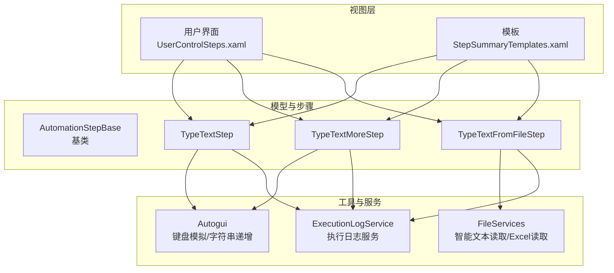
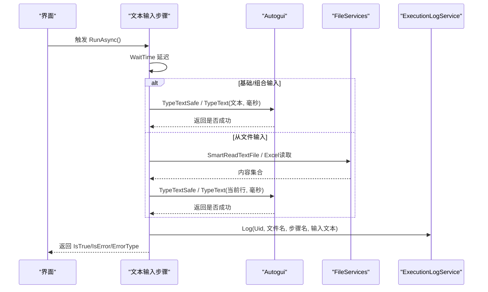
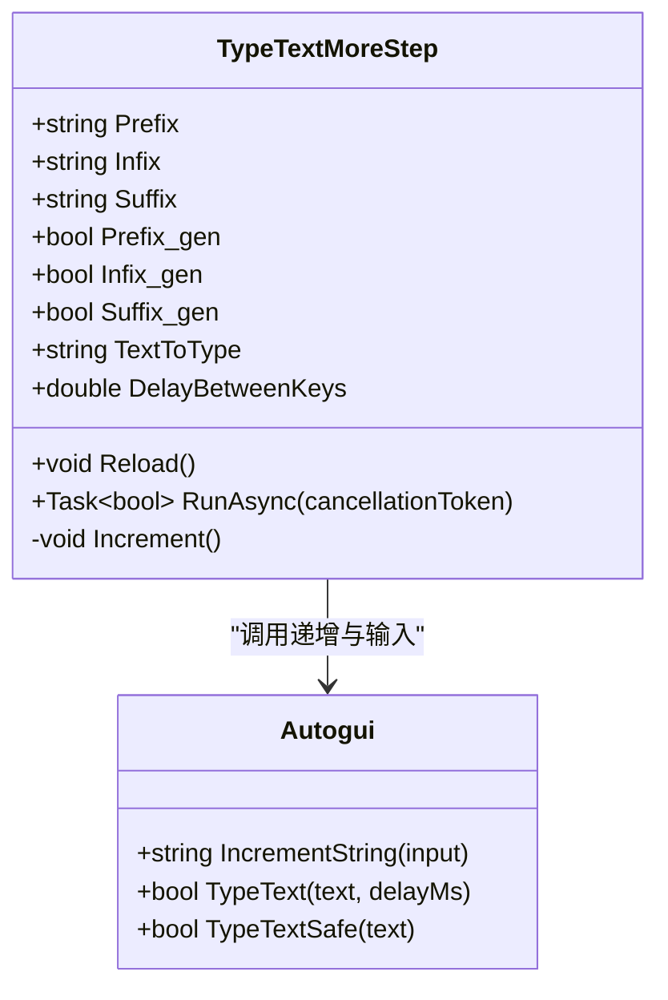
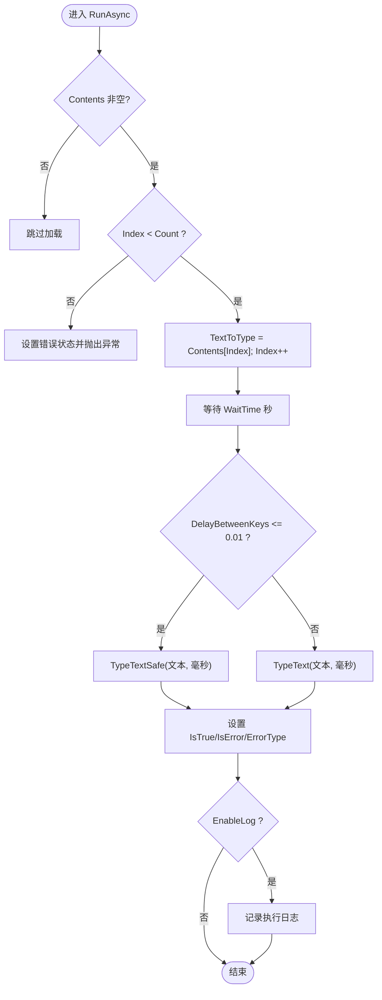
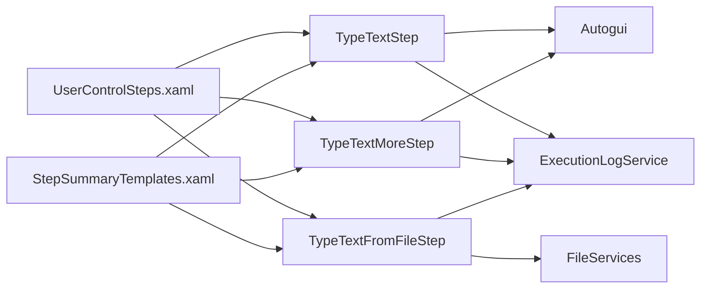

# 文本输入步骤

<cite>
**本文引用的文件**   
- [AutomationStep.cs](file://ShaoLu/Viewmodels/AutomationStep.cs)
- [Autogui.cs](file://ShaoLu/Utils/Autogui.cs)
- [Services.cs](file://ShaoLu/Services/Services.cs)
- [ExecutionLogService.cs](file://ShaoLu/Services/ExecutionLogService.cs)
- [StepExecutionLog.cs](file://ShaoLu/Models/StepExecutionLog.cs)
- [StepsViewModel.cs](file://ShaoLu/Viewmodels/StepsViewModel.cs)
- [Strings.resx](file://ShaoLu/Resources/Strings.resx)
- [StepSummaryTemplates.xaml](file://ShaoLu/Templates/StepSummaryTemplates.xaml)
- [UserControlSteps.xaml](file://ShaoLu/Views/UserControlSteps.xaml)
- [App.xaml.cs](file://ShaoLu/App.xaml.cs)
</cite>

## 目录
1. [简介](#简介)
2. [项目结构](#项目结构)
3. [核心组件](#核心组件)
4. [架构总览](#架构总览)
5. [详细组件分析](#详细组件分析)
6. [依赖关系分析](#依赖关系分析)
7. [性能考虑](#性能考虑)
8. [故障排查指南](#故障排查指南)
9. [结论](#结论)
10. [附录](#附录)

## 简介
本章节面向“文本输入”相关自动化步骤，系统性说明以下三类步骤的功能、参数与执行流程：
- TypeTextStep（基础文本输入）：支持配置待输入文本与按键间隔延迟。
- TypeTextMoreStep（多次输入）：支持前缀/中间/后缀组合生成、自动递增模式（_gen 属性）以及数据递增功能。
- TypeTextFromFileStep（从文件输入）：支持 .txt、.csv、.xlsx 文件格式、分隔符配置、内容索引管理与批量逐行处理。

文档同时覆盖每个步骤的执行流程、参数校验、错误处理与日志记录机制，并提供实际使用场景与最佳实践建议。

## 项目结构
文本输入步骤的实现集中在 Viewmodels/AutomationStep.cs 中，底层键盘模拟与字符串递增逻辑在 Utils/Autogui.cs；文件读取与编码识别在 Services/Services.cs；执行日志通过 Services/ExecutionLogService.cs 持久化到 SQLite；UI 模板与入口按钮位于 Templates 与 Views 目录；应用启动时注册 Excel 库许可与服务单例。

**图表来源** 
- [UserControlSteps.xaml:85-104](file://ShaoLu/Views/UserControlSteps.xaml#L85-L104)
- [StepSummaryTemplates.xaml:38-55](file://ShaoLu/Templates/StepSummaryTemplates.xaml#L38-L55)
- [AutomationStep.cs:209-602](file://ShaoLu/Viewmodels/AutomationStep.cs#L209-L602)
- [Autogui.cs:355-549](file://ShaoLu/Utils/Autogui.cs#L355-L549)
- [Services.cs:83-179](file://ShaoLu/Services/Services.cs#L83-L179)
- [ExecutionLogService.cs:1-177](file://ShaoLu/Services/ExecutionLogService.cs#L1-L177)

**章节来源**
- [UserControlSteps.xaml:85-104](file://ShaoLu/Views/UserControlSteps.xaml#L85-L104)
- [StepSummaryTemplates.xaml:38-55](file://ShaoLu/Templates/StepSummaryTemplates.xaml#L38-L55)
- [AutomationStep.cs:209-602](file://ShaoLu/Viewmodels/AutomationStep.cs#L209-L602)
- [Autogui.cs:355-549](file://ShaoLu/Utils/Autogui.cs#L355-L549)
- [Services.cs:83-179](file://ShaoLu/Services/Services.cs#L83-L179)
- [ExecutionLogService.cs:1-177](file://ShaoLu/Services/ExecutionLogService.cs#L1-L177)

## 核心组件
- 基类 AutomationStepBase：提供通用属性（名称、描述、类型、等待时间、条件、日志开关、执行结果等）与抽象 RunAsync 接口。
- TypeTextStep：基础文本输入，支持 TextToType 与 DelayBetweenKeys。
- TypeTextMoreStep：组合输入，支持 Prefix/Infix/Suffix 与 _gen 自动递增，Run 后自动递增并更新 TextToType。
- TypeTextFromFileStep：从文件读取内容列表，支持 .txt/.csv/.xlsx，内置 Delimiter 分割与 Index 索引管理，支持 ResetIndex。

**章节来源**
- [AutomationStep.cs:25-205](file://ShaoLu/Viewmodels/AutomationStep.cs#L25-L205)
- [AutomationStep.cs:209-279](file://ShaoLu/Viewmodels/AutomationStep.cs#L209-L279)
- [AutomationStep.cs:281-435](file://ShaoLu/Viewmodels/AutomationStep.cs#L281-L435)
- [AutomationStep.cs:437-602](file://ShaoLu/Viewmodels/AutomationStep.cs#L437-L602)

## 架构总览
文本输入步骤的调用链遵循“UI → Step.RunAsync → Autogui/FileServices → ExecutionLogService”的标准路径。所有步骤均继承自 AutomationStepBase，统一了等待时间、日志开关与执行结果状态。

**图表来源** 
- [AutomationStep.cs:253-278](file://ShaoLu/Viewmodels/AutomationStep.cs#L253-L278)
- [AutomationStep.cs:412-434](file://ShaoLu/Viewmodels/AutomationStep.cs#L412-L434)
- [AutomationStep.cs:567-601](file://ShaoLu/Viewmodels/AutomationStep.cs#L567-L601)
- [Autogui.cs:497-549](file://ShaoLu/Utils/Autogui.cs#L497-L549)
- [Services.cs:142-175](file://ShaoLu/Services/Services.cs#L142-L175)
- [ExecutionLogService.cs:36-55](file://ShaoLu/Services/ExecutionLogService.cs#L36-L55)

## 详细组件分析

### TypeTextStep（基础文本输入）
- 关键属性
  - TextToType：要输入的文本。
  - DelayBetweenKeys：按键间隔（秒），小于阈值时使用安全粘贴模式。
- 执行流程
  - 等待 WaitTime 秒。
  - 根据 DelayBetweenKeys 选择 TypeTextSafe 或 TypeText。
  - 成功后可选记录执行日志。
- 参数验证与错误处理
  - 空文本由底层 Autogui.TypeText 抛出异常（需上层捕获）。
  - 设置 IsTrue/IsError/ErrorType 以反映执行结果。
- 日志记录
  - EnableLog 为真时，记录 Uid、文件名、步骤名与输入文本。

**图表来源** 
- [AutomationStep.cs:253-278](file://ShaoLu/Viewmodels/AutomationStep.cs#L253-L278)
- [Autogui.cs:497-549](file://ShaoLu/Utils/Autogui.cs#L497-L549)
- [ExecutionLogService.cs:36-55](file://ShaoLu/Services/ExecutionLogService.cs#L36-L55)

**章节来源**
- [AutomationStep.cs:209-279](file://ShaoLu/Viewmodels/AutomationStep.cs#L209-L279)
- [Autogui.cs:497-549](file://ShaoLu/Utils/Autogui.cs#L497-L549)
- [ExecutionLogService.cs:36-55](file://ShaoLu/Services/ExecutionLogService.cs#L36-L55)

### TypeTextMoreStep（多次输入）
- 关键属性
  - Prefix/Infix/Suffix：三段文本片段。
  - Prefix_gen/Infix_gen/Suffix_gen：对应片段是否启用自动递增。
  - ReloadText：用于重置内部片段缓存。
  - TextToType：最终拼接后的输入文本。
  - DelayBetweenKeys：按键间隔（秒）。
- 组合与递增
  - 每次运行后调用 Increment()，按 _gen 标记对相应片段进行递增（数字/字母固定位数循环）。
  - Reload() 将外部属性同步回内部缓存并重新拼接 TextToType。
- 执行流程
  - 等待 WaitTime 秒。
  - 根据 DelayBetweenKeys 选择 TypeTextSafe 或 TypeText。
  - 成功后可选记录执行日志。
  - 执行完成后执行 Increment() 并更新 TextToType。

**图表来源** 
- [AutomationStep.cs:281-435](file://ShaoLu/Viewmodels/AutomationStep.cs#L281-L435)
- [Autogui.cs:355-495](file://ShaoLu/Utils/Autogui.cs#L355-L495)

**章节来源**
- [AutomationStep.cs:281-435](file://ShaoLu/Viewmodels/AutomationStep.cs#L281-L435)
- [Autogui.cs:355-495](file://ShaoLu/Utils/Autogui.cs#L355-L495)

### TypeTextFromFileStep（从文件输入）
- 关键属性
  - FilePath：文件路径。
  - Contents：ObservableCollection<string> 存储读取到的内容行。
  - Index：当前输入的行索引，逐次递增。
  - Delimiter：默认包含换行、制表符、逗号、分号、竖线等。
  - DelayBetweenKeys：按键间隔（秒）。
  - ReloadIndex：用于重置索引（配合 ResetIndex 命令）。
- 文件读取
  - .txt/.csv：通过 FileServices.SmartReadTextFile 智能识别编码并读取，再按 Delimiter 分割成行。
  - .xlsx：使用 EPPlus 读取第一个工作表第一列的所有行。
  - 不支持的文件扩展名会抛出异常。
- 执行流程
  - 若 Contents 非空且 Index 越界，则设置错误状态并抛出异常提示“内容已用完”。
  - 否则取 Contents[Index] 作为 TextToType，随后 Index++。
  - 等待 WaitTime 秒后调用 TypeTextSafe/TypeText。
  - 成功后可选记录执行日志。

**图表来源** 
- [AutomationStep.cs:539-601](file://ShaoLu/Viewmodels/AutomationStep.cs#L539-L601)
- [Services.cs:142-175](file://ShaoLu/Services/Services.cs#L142-L175)
- [ExecutionLogService.cs:36-55](file://ShaoLu/Services/ExecutionLogService.cs#L36-L55)

**章节来源**
- [AutomationStep.cs:437-602](file://ShaoLu/Viewmodels/AutomationStep.cs#L437-L602)
- [Services.cs:142-175](file://ShaoLu/Services/Services.cs#L142-L175)
- [ExecutionLogService.cs:36-55](file://ShaoLu/Services/ExecutionLogService.cs#L36-L55)

## 依赖关系分析
- 步骤与 Autogui 的耦合：所有文本输入都依赖 Autogui 的 TypeText/TypeTextSafe 与 IncrementString。
- 步骤与 FileServices 的耦合：TypeTextFromFileStep 依赖 FileServices 的智能文本读取与 EPPlus 的 Excel 解析。
- 日志服务：三个步骤在 EnableLog 为真时都会调用 ExecutionLogService.Log，写入 SQLite。
- UI 绑定：StepSummaryTemplates 提供 TextToType 与 DelayBetweenKeys 的绑定；UserControlSteps 提供添加步骤的菜单项。

**图表来源** 
- [AutomationStep.cs:209-602](file://ShaoLu/Viewmodels/AutomationStep.cs#L209-L602)
- [Autogui.cs:355-549](file://ShaoLu/Utils/Autogui.cs#L355-L549)
- [Services.cs:142-175](file://ShaoLu/Services/Services.cs#L142-L175)
- [ExecutionLogService.cs:36-55](file://ShaoLu/Services/ExecutionLogService.cs#L36-L55)
- [UserControlSteps.xaml:85-104](file://ShaoLu/Views/UserControlSteps.xaml#L85-L104)
- [StepSummaryTemplates.xaml:38-55](file://ShaoLu/Templates/StepSummaryTemplates.xaml#L38-L55)

**章节来源**
- [AutomationStep.cs:209-602](file://ShaoLu/Viewmodels/AutomationStep.cs#L209-L602)
- [Autogui.cs:355-549](file://ShaoLu/Utils/Autogui.cs#L355-L549)
- [Services.cs:142-175](file://ShaoLu/Services/Services.cs#L142-L175)
- [ExecutionLogService.cs:36-55](file://ShaoLu/Services/ExecutionLogService.cs#L36-L55)
- [UserControlSteps.xaml:85-104](file://ShaoLu/Views/UserControlSteps.xaml#L85-L104)
- [StepSummaryTemplates.xaml:38-55](file://ShaoLu/Templates/StepSummaryTemplates.xaml#L38-L55)

## 性能考虑
- 按键间隔与输入速度：DelayBetweenKeys 越大，输入越慢但更稳定；过小可能触发系统防抖或目标应用限制。
- 安全粘贴模式：当 DelayBetweenKeys 小于阈值时采用 TypeTextSafe（剪贴板+Ctrl+V），适合长文本快速输入，但需注意剪贴板备份与恢复开销。
- 文件读取：.xlsx 读取首列全量数据，大文件可能导致内存占用上升；建议在 UI 层控制文件大小与行数。
- 日志写入：频繁写入 SQLite 会带来 I/O 开销，建议仅在需要审计时开启 EnableLog。

[本节为通用指导，不直接分析具体文件]

## 故障排查指南
- 常见错误类型
  - 文件未找到：FileNotFoundException → StepErrorType.FileNotFound。
  - 用户取消：OperationCanceledException → StepErrorType.CancelledByUser。
  - 索引越界：IndexOutOfRangeException → StepErrorType.IndexOutOfRange（TypeTextFromFileStep 在内容耗尽时抛出 InvalidOperationException 并设置 IndexOutOfRange）。
  - 超时：TimeoutException → StepErrorType.ExecutionTimeout。
- 定位方法
  - 检查 StepsViewModel 中的异常推断逻辑与日志输出。
  - 查看 ExecutionLogService 的日志记录是否成功。
  - 确认文件路径与扩展名是否正确，.xlsx 是否包含有效数据。
- 处理建议
  - 对于 TypeTextFromFileStep，确保 Contents 非空且 Index 未越界；必要时调用 ResetIndex。
  - 对于 TypeTextMoreStep，确认 _gen 标志与初始值合理，避免无限递增导致不可预期行为。
  - 对于 TypeTextStep，确保 TextToType 非空，避免底层抛出异常。

**章节来源**
- [StepsViewModel.cs:559-587](file://ShaoLu/Viewmodels/StepsViewModel.cs#L559-L587)
- [AutomationStep.cs:567-601](file://ShaoLu/Viewmodels/AutomationStep.cs#L567-L601)
- [ExecutionLogService.cs:36-55](file://ShaoLu/Services/ExecutionLogService.cs#L36-L55)

## 结论
文本输入步骤提供了灵活而强大的自动化能力：基础输入满足简单场景，组合输入支持动态生成与递增，文件输入支持多格式与批量处理。通过统一的基类与日志服务，步骤具备一致的执行体验与可观测性。在实际使用中，应合理配置按键间隔、文件内容与递增策略，并结合日志与错误类型进行排障与优化。

[本节为总结，不直接分析具体文件]

## 附录

### 使用场景与最佳实践
- 基础文本输入（TypeTextStep）
  - 适用：固定文本或变量替换后的短文本输入。
  - 建议：DelayBetweenKeys 设置为 0.01~0.05 秒之间，平衡速度与稳定性。
- 组合输入（TypeTextMoreStep）
  - 适用：用户名、邮箱、订单号等带编号或前后缀的场景。
  - 建议：仅对需要递增的部分启用 _gen，避免不必要的计算；必要时调用 Reload() 重置内部缓存。
- 文件输入（TypeTextFromFileStep）
  - 适用：大批量数据驱动测试，如账号列表、地址簿等。
  - 建议：使用 .txt/.csv 时注意分隔符匹配；.xlsx 只读取首列，保持数据结构清晰；大文件分批处理或分页加载。

**章节来源**
- [AutomationStep.cs:209-602](file://ShaoLu/Viewmodels/AutomationStep.cs#L209-L602)
- [Autogui.cs:355-549](file://ShaoLu/Utils/Autogui.cs#L355-L549)
- [Services.cs:142-175](file://ShaoLu/Services/Services.cs#L142-L175)
- [ExecutionLogService.cs:36-55](file://ShaoLu/Services/ExecutionLogService.cs#L36-L55)

### 参数参考
- TypeTextStep
  - TextToType：输入文本。
  - DelayBetweenKeys：按键间隔（秒）。
- TypeTextMoreStep
  - Prefix/Infix/Suffix：三段文本片段。
  - Prefix_gen/Infix_gen/Suffix_gen：是否自动递增。
  - ReloadText：重置内部缓存。
  - DelayBetweenKeys：按键间隔（秒）。
- TypeTextFromFileStep
  - FilePath：文件路径。
  - Contents：内容集合。
  - Index：当前行索引。
  - Delimiter：分隔符数组。
  - DelayBetweenKeys：按键间隔（秒）。

**章节来源**
- [AutomationStep.cs:209-602](file://ShaoLu/Viewmodels/AutomationStep.cs#L209-L602)
- [Strings.resx:397-486](file://ShaoLu/Resources/Strings.resx#L397-L486)

### 应用初始化与依赖注入
- App.xaml.cs 中注册 FileServices 与 IUserService，并设置 EPPlus 许可证。
- SingletonLocator 提供 Main、Steps、FileServices、UserService 的单例访问。

**章节来源**
- [App.xaml.cs:38-69](file://ShaoLu/App.xaml.cs#L38-L69)
- [SingletonLocator.cs:1-18](file://ShaoLu/Utils/SingletonLocator.cs#L1-L18)