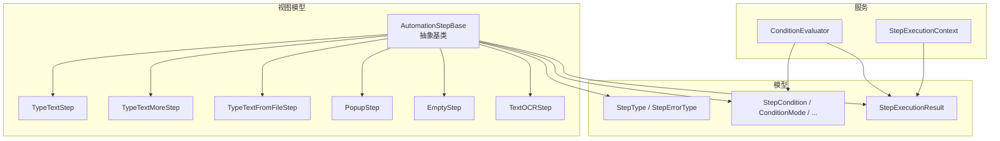
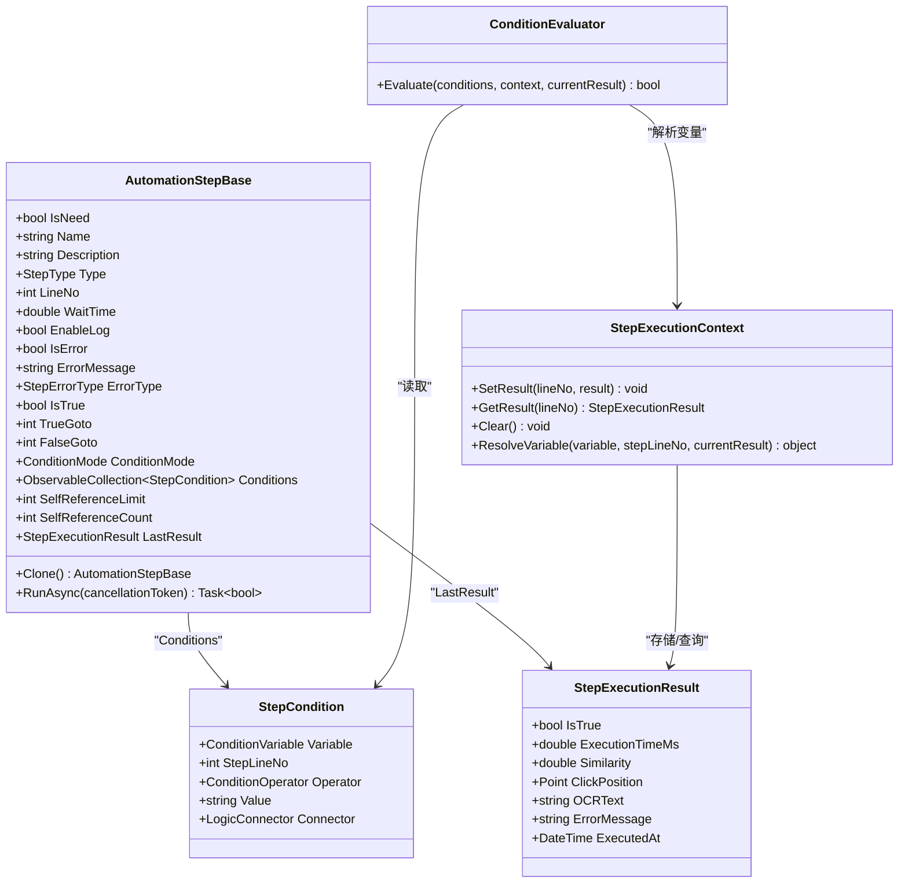
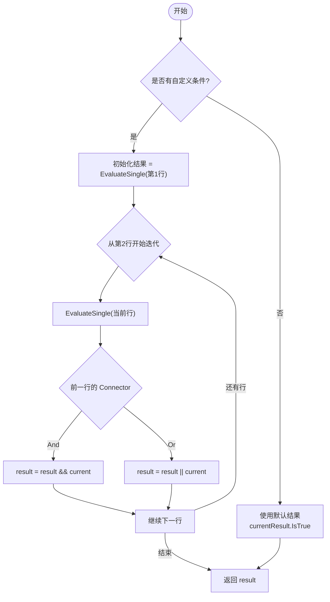
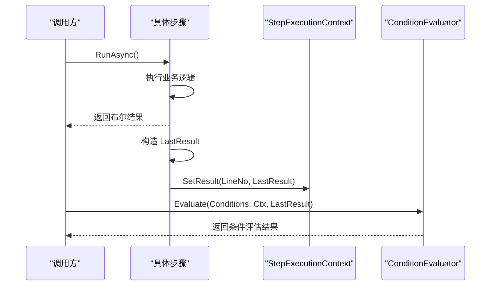
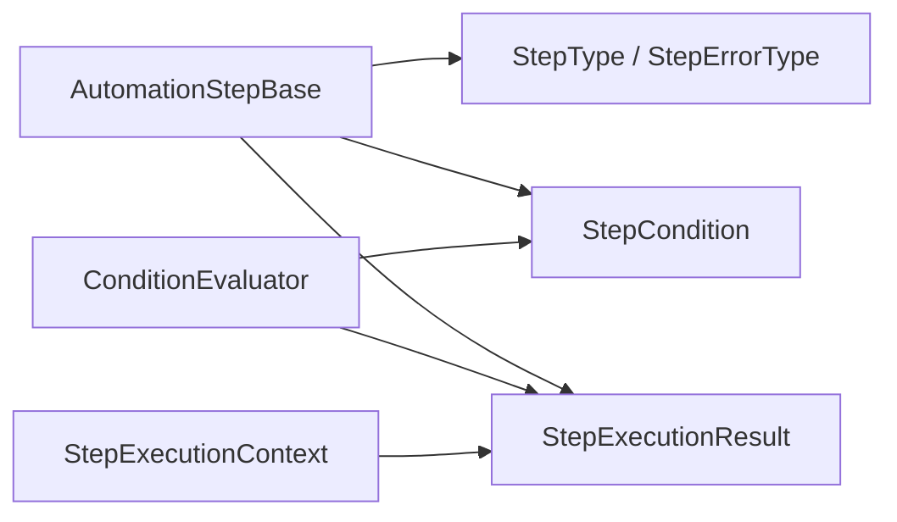

# 步骤基类与通用属性

<cite>
**本文引用的文件**   
- [AutomationStep.cs](file://ShaoLu/Viewmodels/AutomationStep.cs)
- [AutomationStepModel.cs](file://ShaoLu/Models/AutomationStepModel.cs)
- [StepCondition.cs](file://ShaoLu/Models/StepCondition.cs)
- [ConditionEvaluator.cs](file://ShaoLu/Services/ConditionEvaluator.cs)
- [StepExecutionContext.cs](file://ShaoLu/Services/StepExecutionContext.cs)
- [StepExecutionResult.cs](file://ShaoLu/Models/StepExecutionResult.cs)
- [TextOCRStep.cs](file://ShaoLu/Viewmodels/TextOCRStep.cs)
- [AutomationStepTests.cs](file://NUnitTest/AutomationStepTests.cs)
- [ConditionEvaluatorTests.cs](file://NUnitTest/ConditionEvaluatorTests.cs)
</cite>

## 目录
1. [简介](#简介)
2. [项目结构](#项目结构)
3. [核心组件](#核心组件)
4. [架构总览](#架构总览)
5. [详细组件分析](#详细组件分析)
6. [依赖关系分析](#依赖关系分析)
7. [性能考量](#性能考量)
8. [故障排查指南](#故障排查指南)
9. [结论](#结论)
10. [附录：自定义步骤开发指南](#附录自定义步骤开发指南)

## 简介
本文件聚焦于自动化流程中的“步骤”抽象基类及其通用能力，系统性说明 AutomationStepBase 的设计理念、通用属性、条件判断机制、错误处理、执行结果管理、克隆与自引用限制等关键特性，并给出如何继承该基类实现自定义步骤的实践指导。目标是帮助开发者快速理解并扩展步骤体系，构建稳定、可配置、可观测的自动化流程。

## 项目结构
围绕步骤基类的代码分布在 Viewmodels、Models、Services 三个层次：
- Viewmodels：定义步骤基类与具体步骤类型（如文本输入、弹窗、OCR 等）
- Models：定义枚举、数据模型（步骤类型、错误类型、条件变量、执行结果等）
- Services：提供条件评估器与执行上下文服务

图表来源
- [AutomationStep.cs:25-205](file://ShaoLu/Viewmodels/AutomationStep.cs#L25-L205)
- [AutomationStepModel.cs:9-41](file://ShaoLu/Models/AutomationStepModel.cs#L9-L41)
- [StepCondition.cs:8-121](file://ShaoLu/Models/StepCondition.cs#L8-L121)
- [ConditionEvaluator.cs:10-50](file://ShaoLu/Services/ConditionEvaluator.cs#L10-L50)
- [StepExecutionContext.cs:9-36](file://ShaoLu/Services/StepExecutionContext.cs#L9-L36)
- [StepExecutionResult.cs:8-44](file://ShaoLu/Models/StepExecutionResult.cs#L8-L44)

章节来源
- [AutomationStep.cs:25-205](file://ShaoLu/Viewmodels/AutomationStep.cs#L25-L205)
- [AutomationStepModel.cs:9-41](file://ShaoLu/Models/AutomationStepModel.cs#L9-L41)
- [StepCondition.cs:8-121](file://ShaoLu/Models/StepCondition.cs#L8-L121)
- [ConditionEvaluator.cs:10-50](file://ShaoLu/Services/ConditionEvaluator.cs#L10-L50)
- [StepExecutionContext.cs:9-36](file://ShaoLu/Services/StepExecutionContext.cs#L9-L36)
- [StepExecutionResult.cs:8-44](file://ShaoLu/Models/StepExecutionResult.cs#L8-L44)

## 核心组件
- AutomationStepBase：所有步骤的抽象基类，提供通用属性、条件判断、日志开关、执行结果、克隆接口等
- StepCondition：单条条件规则行，包含变量、运算符、值、连接器
- ConditionEvaluator：根据条件列表与上下文计算最终布尔结果
- StepExecutionContext：维护各步骤执行结果的运行时上下文，支持按行号引用其他步骤的结果
- StepExecutionResult：单次执行的标准化结果对象
- 具体步骤类型：TypeTextStep、TypeTextMoreStep、TypeTextFromFileStep、PopupStep、EmptyStep、TextOCRStep 等

章节来源
- [AutomationStep.cs:25-205](file://ShaoLu/Viewmodels/AutomationStep.cs#L25-L205)
- [StepCondition.cs:76-121](file://ShaoLu/Models/StepCondition.cs#L76-L121)
- [ConditionEvaluator.cs:10-50](file://ShaoLu/Services/ConditionEvaluator.cs#L10-L50)
- [StepExecutionContext.cs:9-36](file://ShaoLu/Services/StepExecutionContext.cs#L9-L36)
- [StepExecutionResult.cs:8-44](file://ShaoLu/Models/StepExecutionResult.cs#L8-L44)

## 架构总览
下图展示步骤基类与相关服务、模型的交互关系，以及典型执行流程中条件评估与结果记录的位置。

图表来源
- [AutomationStep.cs:25-205](file://ShaoLu/Viewmodels/AutomationStep.cs#L25-L205)
- [StepCondition.cs:76-121](file://ShaoLu/Models/StepCondition.cs#L76-L121)
- [ConditionEvaluator.cs:10-50](file://ShaoLu/Services/ConditionEvaluator.cs#L10-L50)
- [StepExecutionContext.cs:9-36](file://ShaoLu/Services/StepExecutionContext.cs#L9-L36)
- [StepExecutionResult.cs:8-44](file://ShaoLu/Models/StepExecutionResult.cs#L8-L44)

## 详细组件分析

### AutomationStepBase 抽象基类
- 设计理念
  - 通过抽象基类统一封装步骤的通用元数据、执行生命周期、条件判断、错误处理、日志开关、执行结果与克隆能力，使具体步骤只需关注业务逻辑。
  - 使用 MVVM 工具库的属性变更通知，便于 UI 绑定与状态同步。
- 通用属性与作用
  - IsNeed：启用状态，控制是否参与执行
  - Name：步骤名称（非空校验，避免绑定崩溃）
  - Description：步骤描述
  - Type：步骤类型（枚举），用于区分不同行为
  - LineNo：行号，由集合或 UI 统一维护，便于条件引用与其他步骤定位
  - WaitTime：等待时间（秒），在执行前延时
  - EnableLog：是否记录执行日志
  - IsError/ErrorMessage/ErrorType：错误标志、错误信息、错误类型（枚举）
  - IsTrue：执行结果布尔值
  - TrueGoto/FalseGoto：条件为真/假时的跳转目标行号
  - ConditionMode：条件模式（默认/自定义）
  - Conditions：自定义条件规则行集合
  - SelfReferenceLimit/SelfReferenceCount：自引用上限与计数器，防止循环引用
  - LastResult：最近一次执行结果（运行时，不序列化）
  - Uid：唯一标识（Guid）
- 执行接口
  - RunAsync：异步执行入口，子类必须实现；Run 是同步包装
  - Clone：深拷贝接口，子类需实现以复制自身属性与集合
- 条件命令
  - AddConditionCommand/RemoveConditionCommand：便捷添加/删除条件行

章节来源
- [AutomationStep.cs:25-205](file://ShaoLu/Viewmodels/AutomationStep.cs#L25-L205)
- [AutomationStep.cs:209-279](file://ShaoLu/Viewmodels/AutomationStep.cs#L209-L279)
- [AutomationStep.cs:281-435](file://ShaoLu/Viewmodels/AutomationStep.cs#L281-L435)
- [AutomationStep.cs:437-602](file://ShaoLu/Viewmodels/AutomationStep.cs#L437-L602)
- [AutomationStep.cs:606-807](file://ShaoLu/Viewmodels/AutomationStep.cs#L606-L807)
- [AutomationStep.cs:809-849](file://ShaoLu/Viewmodels/AutomationStep.cs#L809-L849)

### 条件判断机制：ConditionMode 与 Conditions
- 条件模式
  - Default：使用步骤自身的执行结果（IsTrue）作为条件
  - Custom：使用用户配置的 Conditions 列表进行复杂判断
- 条件规则行（StepCondition）
  - Variable：条件变量（常量、当前步骤自身、引用其他步骤）
  - StepLineNo：当引用其他步骤时指定行号
  - Operator：比较运算符（等于、不等于、大于、小于、包含、是否为空等）
  - Value：比较值（字符串形式，运行时解析）
  - Connector：与下一行的逻辑连接方式（And/Or）
- 评估流程
  - 无条件或空条件：返回当前结果的 IsTrue
  - 多行条件：逐行评估，前一行的 Connector 决定与当前行的组合方式
  - 变量解析：通过 StepExecutionContext.ResolveVariable 获取实际值
  - 比较逻辑：支持布尔、数字、字符串比较，含大小写不敏感与数值容差

图表来源
- [ConditionEvaluator.cs:22-50](file://ShaoLu/Services/ConditionEvaluator.cs#L22-L50)
- [ConditionEvaluator.cs:55-76](file://ShaoLu/Services/ConditionEvaluator.cs#L55-L76)
- [StepExecutionContext.cs:44-85](file://ShaoLu/Services/StepExecutionContext.cs#L44-L85)

章节来源
- [StepCondition.cs:8-121](file://ShaoLu/Models/StepCondition.cs#L8-L121)
- [ConditionEvaluator.cs:10-187](file://ShaoLu/Services/ConditionEvaluator.cs#L10-L187)
- [StepExecutionContext.cs:9-85](file://ShaoLu/Services/StepExecutionContext.cs#L9-L85)

### 错误处理属性：IsError、ErrorMessage、ErrorType
- IsError：标记步骤是否发生错误
- ErrorMessage：错误消息（可由语言服务提供本地化文本）
- ErrorType：错误类型枚举，涵盖图像、文件、OCR、超时、取消、索引越界等多种场景
- 使用示例
  - TextOCRStep 在未选择区域时设置错误类型与消息
  - 具体步骤在异常路径上设置 IsError 与 ErrorType，并在日志中输出

章节来源
- [AutomationStepModel.cs:24-41](file://ShaoLu/Models/AutomationStepModel.cs#L24-L41)
- [TextOCRStep.cs:106-113](file://ShaoLu/Viewmodels/TextOCRStep.cs#L106-L113)
- [AutomationStep.cs:33-108](file://ShaoLu/Viewmodels/AutomationStep.cs#L33-L108)

### 执行结果管理：LastResult 与执行状态跟踪
- LastResult：保存最近一次执行的 StepExecutionResult，包含成功与否、耗时、相似度、点击位置、OCR 文本、错误信息与执行时间
- 执行状态跟踪
  - IsTrue：布尔结果
  - IsError/ErrorType/ErrorMessage：错误信息
  - 日志：EnableLog 开启时记录执行内容
- 上下文共享
  - StepExecutionContext 维护各步骤的执行结果，供条件评估引用其他步骤的值

图表来源
- [StepExecutionResult.cs:8-44](file://ShaoLu/Models/StepExecutionResult.cs#L8-L44)
- [StepExecutionContext.cs:16-27](file://ShaoLu/Services/StepExecutionContext.cs#L16-L27)
- [ConditionEvaluator.cs:22-50](file://ShaoLu/Services/ConditionEvaluator.cs#L22-L50)

章节来源
- [StepExecutionResult.cs:8-44](file://ShaoLu/Models/StepExecutionResult.cs#L8-L44)
- [StepExecutionContext.cs:9-36](file://ShaoLu/Services/StepExecutionContext.cs#L9-L36)
- [TextOCRStep.cs:122-142](file://ShaoLu/Viewmodels/TextOCRStep.cs#L122-L142)

### 克隆机制与 SelfReferenceLimit 循环控制
- 克隆机制
  - 每个具体步骤需实现 Clone()，复制自身属性与集合，确保修改克隆不影响原实例
  - 测试覆盖验证克隆独立性与属性一致性
- 自引用限制
  - SelfReferenceLimit：允许的最大自引用次数（可配置）
  - SelfReferenceCount：运行时自引用计数器（不序列化）
  - 目的：防止递归/循环引用导致的栈溢出或死循环

章节来源
- [AutomationStep.cs:238-250](file://ShaoLu/Viewmodels/AutomationStep.cs#L238-L250)
- [AutomationStep.cs:365-384](file://ShaoLu/Viewmodels/AutomationStep.cs#L365-L384)
- [AutomationStep.cs:493-508](file://ShaoLu/Viewmodels/AutomationStep.cs#L493-L508)
- [AutomationStep.cs:676-691](file://ShaoLu/Viewmodels/AutomationStep.cs#L676-L691)
- [AutomationStep.cs:830-839](file://ShaoLu/Viewmodels/AutomationStep.cs#L830-L839)
- [AutomationStep.cs:111-116](file://ShaoLu/Viewmodels/AutomationStep.cs#L111-L116)
- [AutomationStepTests.cs:59-100](file://NUnitTest/AutomationStepTests.cs#L59-L100)

## 依赖关系分析
- 低耦合设计
  - 基类仅依赖模型与服务接口，不直接耦合 UI 与外部系统
  - 条件评估与上下文解耦，便于扩展新的变量与比较逻辑
- 主要依赖链
  - 具体步骤 → AutomationStepBase（继承）
  - 条件评估 → StepCondition + StepExecutionContext + StepExecutionResult
  - 执行上下文 → StepExecutionResult（字典缓存）

图表来源
- [AutomationStep.cs:25-205](file://ShaoLu/Viewmodels/AutomationStep.cs#L25-L205)
- [AutomationStepModel.cs:9-41](file://ShaoLu/Models/AutomationStepModel.cs#L9-L41)
- [StepCondition.cs:76-121](file://ShaoLu/Models/StepCondition.cs#L76-L121)
- [StepExecutionResult.cs:8-44](file://ShaoLu/Models/StepExecutionResult.cs#L8-L44)
- [ConditionEvaluator.cs:10-50](file://ShaoLu/Services/ConditionEvaluator.cs#L10-L50)
- [StepExecutionContext.cs:9-36](file://ShaoLu/Services/StepExecutionContext.cs#L9-L36)

章节来源
- [AutomationStep.cs:25-205](file://ShaoLu/Viewmodels/AutomationStep.cs#L25-L205)
- [ConditionEvaluator.cs:10-187](file://ShaoLu/Services/ConditionEvaluator.cs#L10-L187)
- [StepExecutionContext.cs:9-85](file://ShaoLu/Services/StepExecutionContext.cs#L9-L85)

## 性能考量
- 等待时间：WaitTime 以毫秒级延时影响整体执行节奏，建议合理设置以避免阻塞
- 异步执行：RunAsync 使用 Task 与 CancellationToken，支持取消与并发控制
- 条件评估：多行条件按顺序评估，应避免过多复杂表达式导致评估开销
- 日志记录：EnableLog 开启会写入日志，频繁执行时应权衡性能与可观测性
- 结果缓存：StepExecutionContext 使用字典缓存结果，注意每次运行前 Clear

[本节为通用指导，不涉及具体文件分析]

## 故障排查指南
- 常见问题
  - 未选择 OCR 区域：检查 OCRRegion 是否为空，查看错误类型为 OCRError
  - 文件读取失败：确认文件路径与权限，错误类型可能为 FileNotFound/FileReadError
  - 索引越界：TypeTextFromFileStep 读取 Contents 时 Index 超出范围，错误类型为 IndexOutOfRange
  - 条件评估失败：检查变量解析与运算符匹配，必要时增加日志
- 调试建议
  - 启用 EnableLog 观察执行轨迹
  - 检查 LastResult 与 StepExecutionContext 中的结果
  - 使用单元测试验证条件评估与克隆行为

章节来源
- [TextOCRStep.cs:106-113](file://ShaoLu/Viewmodels/TextOCRStep.cs#L106-L113)
- [AutomationStep.cs:567-601](file://ShaoLu/Viewmodels/AutomationStep.cs#L567-L601)
- [ConditionEvaluator.cs:71-76](file://ShaoLu/Services/ConditionEvaluator.cs#L71-L76)
- [AutomationStepTests.cs:305-367](file://NUnitTest/AutomationStepTests.cs#L305-L367)

## 结论
AutomationStepBase 提供了统一的步骤抽象与通用能力，结合条件评估与执行上下文，实现了灵活、可扩展且可观测的自动化流程框架。通过清晰的错误处理、结果管理与克隆机制，开发者可以专注于业务逻辑的实现，同时保证系统的稳定性与可维护性。

[本节为总结，不涉及具体文件分析]

## 附录：自定义步骤开发指南
- 继承基类
  - 创建新类继承 AutomationStepBase，设置 Type 与必要属性
- 实现方法
  - Clone()：复制所有属性与集合，确保独立性
  - RunAsync(CancellationToken)：实现异步执行逻辑，设置 IsTrue/IsError/ErrorType/ErrorMessage，更新 LastResult
- 条件与日志
  - 根据需要启用 EnableLog，记录关键信息
  - 使用 Conditions 与 ConditionMode 配置复杂条件
- 最佳实践
  - 保持属性不可为空（Name 已做防御性校验）
  - 合理使用 WaitTime 与异步取消
  - 在异常路径设置错误类型与信息，便于诊断
  - 编写单元测试覆盖构造、克隆、默认属性与执行路径

章节来源
- [AutomationStep.cs:25-205](file://ShaoLu/Viewmodels/AutomationStep.cs#L25-L205)
- [TextOCRStep.cs:87-142](file://ShaoLu/Viewmodels/TextOCRStep.cs#L87-L142)
- [AutomationStepTests.cs:19-116](file://NUnitTest/AutomationStepTests.cs#L19-L116)
- [ConditionEvaluatorTests.cs:32-52](file://NUnitTest/ConditionEvaluatorTests.cs#L32-L52)