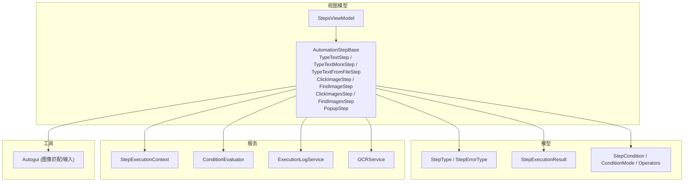
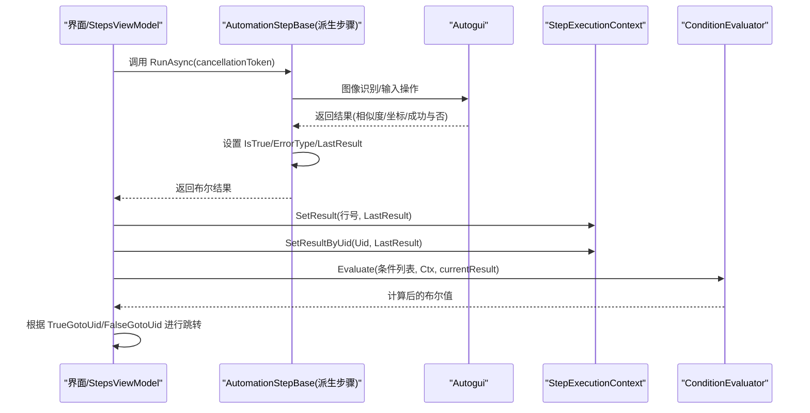
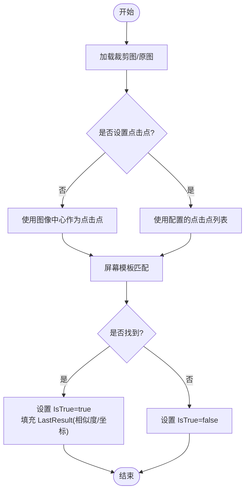
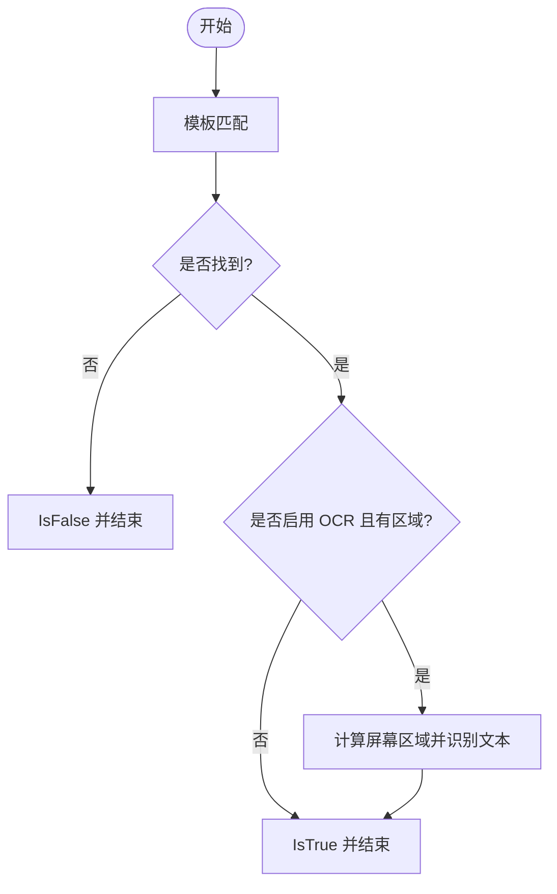

# 自动化步骤系统

<cite>
**本文引用的文件**   
- [Readme.md](file://Readme.md)
- [AutomationStepModel.cs](file://ShaoLu/Models/AutomationStepModel.cs)
- [AutomationStep.cs](file://ShaoLu/Viewmodels/AutomationStep.cs)
- [ImageRecognition.cs](file://ShaoLu/Viewmodels/ImageRecognition.cs)
- [ImagesRecognition.cs](file://ShaoLu/Viewmodels/ImagesRecognition.cs)
- [StepExecutionResult.cs](file://ShaoLu/Models/StepExecutionResult.cs)
- [StepCondition.cs](file://ShaoLu/Models/StepCondition.cs)
- [StepExecutionContext.cs](file://ShaoLu/Services/StepExecutionContext.cs)
- [ConditionEvaluator.cs](file://ShaoLu/Services/ConditionEvaluator.cs)
- [Autogui.cs](file://ShaoLu/Utils/Autogui.cs)
- [ExecutionLogService.cs](file://ShaoLu/Services/ExecutionLogService.cs)
- [StepExecutionLog.cs](file://ShaoLu/Models/StepExecutionLog.cs)
- [PopupButton.cs](file://ShaoLu/Viewmodels/PopupButton.cs)
- [StepsViewModel.cs](file://ShaoLu/Viewmodels/StepsViewModel.cs)
</cite>

## 更新摘要
**所做更改**   
- 增强了条件步骤逻辑，新增ParentStepUid属性用于维护父子关系
- 改进了ResolveStepType()方法，当未选择步骤时使用父步骤类型进行解析
- 提升了步骤类型解析的可靠性，支持更好的回退机制
- 完善了弹出框结果变量的支持，包括Self_PopupResult和Step_PopupResult
- 优化了GUID引用系统的性能和稳定性

## 目录
1. [简介](#简介)
2. [项目结构](#项目结构)
3. [核心组件](#核心组件)
4. [架构总览](#架构总览)
5. [详细组件分析](#详细组件分析)
6. [依赖关系分析](#依赖关系分析)
7. [性能考量](#性能考量)
8. [故障排查指南](#故障排查指南)
9. [结论](#结论)
10. [附录：自定义步骤开发指南](#附录自定义步骤开发指南)

## 简介
本文件为 ShaoLu 自动化步骤系统的全面技术文档。内容覆盖所有内置步骤类型（点击识图、查找识图、多图点击、多图查找、输入文字、多次输入、从文件输入、弹出框等），详细说明每个步骤的参数配置、使用场景与执行逻辑；阐述通用属性（启用状态、名称、描述、等待时间、条件跳转等）；解释步骤执行流程、错误处理机制与日志记录；说明条件分支控制与循环执行的实现原理；并提供自定义步骤开发的完整指南（继承基类、实现必要接口与方法）。

**重要更新**：系统已从基于行号的引用机制迁移到基于GUID的唯一标识系统，提供更稳定和可靠的步骤引用方式。同时新增了弹出框结果变量的支持，允许在条件逻辑中使用弹出框的用户选择结果。**最新改进**包括增强的条件步骤逻辑，通过ParentStepUid属性维护父子关系，改进了步骤类型解析的可靠性。

## 项目结构
ShaoLu 采用 WPF + MVVM 架构，步骤模型与视图模型分离，服务层提供条件评估、执行上下文、OCR、日志等功能，工具层封装图像识别与模拟输入能力。

**图表来源** 
- [AutomationStep.cs](file://ShaoLu/Viewmodels/AutomationStep.cs)
- [ImageRecognition.cs](file://ShaoLu/Viewmodels/ImageRecognition.cs)
- [ImagesRecognition.cs](file://ShaoLu/Viewmodels/ImagesRecognition.cs)
- [StepExecutionResult.cs](file://ShaoLu/Models/StepExecutionResult.cs)
- [StepCondition.cs](file://ShaoLu/Models/StepCondition.cs)
- [StepExecutionContext.cs](file://ShaoLu/Services/StepExecutionContext.cs)
- [ConditionEvaluator.cs](file://ShaoLu/Services/ConditionEvaluator.cs)
- [Autogui.cs](file://ShaoLu/Utils/Autogui.cs)
- [ExecutionLogService.cs](file://ShaoLu/Services/ExecutionLogService.cs)

**章节来源**
- [Readme.md](file://Readme.md)
- [AutomationStepModel.cs](file://ShaoLu/Models/AutomationStepModel.cs)

## 核心组件
- 步骤基类与枚举
  - 步骤类型枚举定义了 ClickImage、FindImage、ClickImages、FindImages、TypeText、TypeTextMore、TypeTextFromFile、Popup 等。
  - 错误类型枚举涵盖图片未找到、超时、索引越界、OCR 错误等。
- 步骤基类
  - 提供通用属性：启用状态、名称、描述、等待时间、条件跳转（如果真/如果假）、自引用限制、条件模式与规则列表、是否记录日志、最近一次执行结果等。
  - **重要更新**：现在使用GUID作为步骤的唯一标识符（Uid属性），替代了传统的行号引用方式。
  - 定义抽象方法 Clone() 与 RunAsync(CancellationToken)，所有具体步骤需实现。
- 执行结果模型
  - 包含 IsTrue、ExecutionTimeMs、Similarity、ClickPosition、OCRText、**PopupResult**、ErrorMessage、ExecutedAt。
  - **新增**：PopupResult属性用于存储弹出框的用户选择结果。
- 条件系统与上下文
  - StepCondition 支持变量（当前步骤或引用其他步骤的GUID）、运算符（等于/不等于/包含/为空/比较等）、连接器（AND/OR）。
  - **重要更新**：StepLineNo已替换为StepUid，用于通过GUID引用其他步骤。
  - **新增特性**：ParentStepUid属性用于维护条件规则的父子关系，提升步骤类型解析的可靠性。
  - StepExecutionContext 维护各步骤执行结果，供条件解析，支持按行号和GUID两种方式存储。
  - ConditionEvaluator 负责多行条件的 AND/OR 组合与值比较。

**章节来源**
- [AutomationStepModel.cs](file://ShaoLu/Models/AutomationStepModel.cs)
- [AutomationStep.cs](file://ShaoLu/Viewmodels/AutomationStep.cs)
- [StepExecutionResult.cs](file://ShaoLu/Models/StepExecutionResult.cs)
- [StepCondition.cs](file://ShaoLu/Models/StepCondition.cs)
- [StepExecutionContext.cs](file://ShaoLu/Services/StepExecutionContext.cs)
- [ConditionEvaluator.cs](file://ShaoLu/Services/ConditionEvaluator.cs)

## 架构总览
下图展示步骤执行的核心调用链：UI 触发运行 → 步骤基类调度 → 具体步骤 RunAsync → 底层 Autogui 完成图像识别/输入 → 设置执行结果 → 条件评估器根据上下文决定跳转。

**图表来源** 
- [AutomationStep.cs](file://ShaoLu/Viewmodels/AutomationStep.cs)
- [Autogui.cs](file://ShaoLu/Utils/Autogui.cs)
- [StepExecutionContext.cs](file://ShaoLu/Services/StepExecutionContext.cs)
- [ConditionEvaluator.cs](file://ShaoLu/Services/ConditionEvaluator.cs)
- [StepsViewModel.cs](file://ShaoLu/Viewmodels/StepsViewModel.cs)

## 详细组件分析

### 点击识图（ClickImage）
- 功能：在屏幕上查找目标图片，找到后按配置的点击点依次点击，支持多次点击与间隔。
- 关键参数：目标图片、相似度阈值、点击次数、点击间隔、等待时间、超时时间、点击点列表。
- 执行逻辑：
  - 加载裁剪图或原图，转换为位图。
  - 若未设置点击点，默认使用图像中心点。
  - 调用底层图像匹配并返回匹配区域与相似度。
  - 设置 IsTrue、LastResult（含相似度与点击位置）。
- 使用场景：定位按钮/图标并点击，适合需要精确定位的交互。

**图表来源** 
- [ImageRecognition.cs](file://ShaoLu/Viewmodels/ImageRecognition.cs)
- [Autogui.cs](file://ShaoLu/Utils/Autogui.cs)

**章节来源**
- [ImageRecognition.cs](file://ShaoLu/Viewmodels/ImageRecognition.cs)
- [Autogui.cs](file://ShaoLu/Utils/Autogui.cs)

### 查找识图（FindImage）
- 功能：仅判断是否在屏幕上找到目标图片，不执行点击；可启用 OCR 对指定区域进行文字识别。
- 关键参数：目标图片、相似度阈值、查找间隔、超时时间、OCR 开关与区域。
- 执行逻辑：
  - 模板匹配获取位置与相似度。
  - 若启用 OCR 且找到图片，计算 OCR 区域在屏幕上的绝对坐标，调用 OCR 服务识别文本。
  - 设置 IsTrue、LastResult（含 OCR 文本）。
- 使用场景：条件判断、状态检测、配合"如果真/如果假"实现分支。

**图表来源** 
- [ImageRecognition.cs](file://ShaoLu/Viewmodels/ImageRecognition.cs)
- [Autogui.cs](file://ShaoLu/Utils/Autogui.cs)

**章节来源**
- [ImageRecognition.cs](file://ShaoLu/Viewmodels/ImageRecognition.cs)

### 多图点击（ClickImages）
- 功能：按列表顺序依次查找多张目标图片并点击，每张图片可独立设置相似度与点击点。
- 关键参数：图片列表、点击次数、点击间隔、等待时间、超时时间。
- 执行逻辑：
  - 遍历图片列表，逐一进行模板匹配与点击。
  - 记录最后一次匹配的相似度与点击位置。
- 使用场景：批量点击多个元素（如菜单项、列表项）。

**章节来源**
- [ImagesRecognition.cs](file://ShaoLu/Viewmodels/ImagesRecognition.cs)

### 多图查找（FindImages）
- 功能：同时查找多张目标图片，判断是否全部找到（不点击），用于条件判断。
- 关键参数：图片列表、查找间隔、超时时间。
- 执行逻辑：
  - 将多张图片转换为 AutoguiImage 列表，调用批量查找。
  - 以第一张的结果作为整体 IsTrue。
- 使用场景：复杂页面元素存在性校验。

**章节来源**
- [ImagesRecognition.cs](file://ShaoLu/Viewmodels/ImagesRecognition.cs)

### 输入文字（TypeText）
- 功能：模拟键盘输入一段文字。
- 关键参数：等待时间、输入内容、按键间隔（设为 0 使用安全快速模式）。
- 执行逻辑：
  - 等待 WaitTime 秒。
  - 根据 DelayBetweenKeys 选择 TypeTextSafe 或 TypeText。
  - 成功后记录日志（若启用）。
- 使用场景：表单填写、搜索框输入等。

**章节来源**
- [AutomationStep.cs](file://ShaoLu/Viewmodels/AutomationStep.cs)

### 多次输入（TypeTextMore）
- 功能：按前缀+中间+后缀组合批量循环输入，每次执行后自动递增标记了"递增"的片段。
- 关键参数：等待时间、按键间隔、前缀/中间/后缀及其递增开关。
- 执行逻辑：
  - 拼接 TextToType = Prefix + Infix + Suffix。
  - 输入完成后调用 Increment() 对勾选的部分进行字符串递增。
  - 记录日志（若启用）。
- 使用场景：批量生成用户名、邮箱、编号等。

**章节来源**
- [AutomationStep.cs](file://ShaoLu/Viewmodels/AutomationStep.cs)

### 从文件输入（TypeTextFromFile）
- 功能：从 txt/csv/xlsx 读取内容列表，每次执行输入一行，逐行递增。
- 关键参数：等待时间、按键间隔、文件路径、内容集合、索引。
- 执行逻辑：
  - 加载文件：txt/csv 按多种分隔符拆分；xlsx 读取第一个工作表第一列。
  - 按 Index 取内容输入，Index++；当 Index 超出范围时报错并重置 Index。
  - 记录日志（若启用）。
- 使用场景：数据驱动测试、批量录入。

**章节来源**
- [AutomationStep.cs](file://ShaoLu/Viewmodels/AutomationStep.cs)

### 弹出框（Popup）
- 功能：弹出自定义消息框，等待用户点击按钮，根据返回值 true/false 控制流程。
- 关键参数：标题、弹出文字、字体、颜色、弹窗类型、按钮集合。
- 执行逻辑：
  - 异步显示窗口，支持取消令牌（停止时关闭弹窗）。
  - 用户点击按钮后返回对应值，映射为 IsTrue。
  - **重要更新**：现在会设置 PopupResult 属性，存储用户选择的按钮值，可用于条件判断。
- 使用场景：人工确认、流程干预。

**章节来源**
- [AutomationStep.cs](file://ShaoLu/Viewmodels/AutomationStep.cs)
- [PopupButton.cs](file://ShaoLu/Viewmodels/PopupButton.cs)

### 通用属性与条件跳转
- 通用属性：启用、名称、描述、等待时间、如果真跳转、如果假跳转、自引用限制、条件模式与规则列表、是否记录日志。
- **重要更新**：TrueGoto/FalseGoto 现在使用 Guid? 类型的 TrueGotoUid/FalseGotoUid，指向步骤的唯一标识符而非行号。
- 条件模式：
  - Default：直接使用步骤自身执行结果。
  - Custom：通过 StepCondition 列表进行复杂条件判断（支持常量、当前步骤变量、引用其他步骤变量，运算符包括等于/不等于/包含/为空/数值比较等）。
- **新增变量支持**：
  - Self_PopupResult：当前步骤的弹出框结果
  - Step_PopupResult：引用步骤的弹出框结果
  - 这些变量可以通过 StepUid 属性引用特定的步骤
- **增强特性**：ParentStepUid属性用于维护条件规则的父子关系，当未选择具体步骤时，系统会自动使用父步骤的类型来解析可用的条件变量，提升了条件面板的智能化程度。

**章节来源**
- [AutomationStep.cs](file://ShaoLu/Viewmodels/AutomationStep.cs)
- [StepCondition.cs](file://ShaoLu/Models/StepCondition.cs)
- [StepExecutionContext.cs](file://ShaoLu/Services/StepExecutionContext.cs)
- [ConditionEvaluator.cs](file://ShaoLu/Services/ConditionEvaluator.cs)

## 依赖关系分析
- 步骤模型依赖 Autogui 完成图像匹配与输入。
- 条件评估依赖 StepExecutionContext 提供的历史执行结果。
- 日志记录通过 ExecutionLogService 写入 SQLite。
- OCR 由 OCRService 提供，FindImageStep 可选启用。

```mermaid
classDiagram
class AutomationStepBase {
+bool IsNeed
+string Name
+string Description
+double WaitTime
+Guid? TrueGotoUid
+Guid? FalseGotoUid
+Guid Uid
+bool EnableLog
+Clone()
+RunAsync(cancellationToken)
}
class ImageRecognitionBase {
+string ImagePath
+string CroppedImageName
+double SimilarityThreshold
+ClickThumb[] ClickThumbs
+SaveCroppedImageToDisk(imageSource)
}
class ClickImageStep
class FindImageStep
class ClickImagesStep
class FindImagesStep
class TypeTextStep
class TypeTextMoreStep
class TypeTextFromFileStep
class PopupStep
class Autogui {
+FindImageOnScreen(...)
+FindImagesOnScreen(...)
+TypeText(...)
+TypeTextSafe(...)
}
class StepExecutionContext {
+SetResult(lineNo, result)
+GetResult(lineNo)
+SetResultByUid(uid, result)
+GetResultByUid(uid)
+ResolveVariable(variable, stepUid, currentResult)
}
class ConditionEvaluator {
+Evaluate(conditions, context, currentResult) bool
}
class ExecutionLogService {
+Log(stepUid, stepFileName, stepName, inputText, ocrText)
}
class StepCondition {
+Guid ParentStepUid
+Guid? StepUid
+List AvailableVariables
+ResolveStepType()
}
AutomationStepBase <|-- ImageRecognitionBase
ImageRecognitionBase <|-- ClickImageStep
ImageRecognitionBase <|-- FindImageStep
AutomationStepBase <|-- ClickImagesStep
AutomationStepBase <|-- FindImagesStep
AutomationStepBase <|-- TypeTextStep
AutomationStepBase <|-- TypeTextMoreStep
AutomationStepBase <|-- TypeTextFromFileStep
AutomationStepBase <|-- PopupStep
ClickImageStep --> Autogui : "调用图像匹配/输入"
FindImageStep --> Autogui
ClickImagesStep --> Autogui
FindImagesStep --> Autogui
TypeTextStep --> Autogui
TypeTextMoreStep --> Autogui
TypeTextFromFileStep --> Autogui
PopupStep --> ExecutionLogService : "可选记录"
ConditionEvaluator --> StepExecutionContext : "读取历史结果"
StepCondition --> AutomationStepBase : "通过ParentStepUid引用"
```

**图表来源** 
- [AutomationStep.cs](file://ShaoLu/Viewmodels/AutomationStep.cs)
- [ImageRecognition.cs](file://ShaoLu/Viewmodels/ImageRecognition.cs)
- [ImagesRecognition.cs](file://ShaoLu/Viewmodels/ImagesRecognition.cs)
- [Autogui.cs](file://ShaoLu/Utils/Autogui.cs)
- [StepExecutionContext.cs](file://ShaoLu/Services/StepExecutionContext.cs)
- [ConditionEvaluator.cs](file://ShaoLu/Services/ConditionEvaluator.cs)
- [ExecutionLogService.cs](file://ShaoLu/Services/ExecutionLogService.cs)
- [StepCondition.cs](file://ShaoLu/Models/StepCondition.cs)

**章节来源**
- [AutomationStep.cs](file://ShaoLu/Viewmodels/AutomationStep.cs)
- [ImageRecognition.cs](file://ShaoLu/Viewmodels/ImageRecognition.cs)
- [ImagesRecognition.cs](file://ShaoLu/Viewmodels/ImagesRecognition.cs)
- [Autogui.cs](file://ShaoLu/Utils/Autogui.cs)
- [StepExecutionContext.cs](file://ShaoLu/Services/StepExecutionContext.cs)
- [ConditionEvaluator.cs](file://ShaoLu/Services/ConditionEvaluator.cs)
- [ExecutionLogService.cs](file://ShaoLu/Services/ExecutionLogService.cs)

## 性能考量
- 图像匹配：
  - 模板匹配在每次循环中截取全屏并进行灰度转换，建议合理设置超时与间隔，避免频繁截图。
  - 裁剪区域越小、特征越明显，匹配速度与准确率越高。
- 输入操作：
  - 按键间隔过小可能影响稳定性，中文输入建议不低于 0.05s；英文数字可适当减小。
- 日志与 OCR：
  - 日志写入为异步 I/O，但大量写入仍可能影响性能，可按需开启。
  - OCR 仅在 FindImageStep 启用且找到图片时执行，避免不必要的开销。
- 内存管理：
  - 图像资源使用后及时释放（Autogui 内部已做 Dispose），避免内存泄漏。
- **GUID性能优化**：
  - GUID查找比行号查找更高效，特别是在大型步骤集合中。
  - 双字典存储（行号和GUID）确保向后兼容性和最佳性能。
- **条件解析优化**：
  - ParentStepUid属性的引入减少了重复的步骤类型解析操作。
  - ResolveStepType()方法的改进提供了更智能的回退机制，避免了不必要的异常处理。

## 故障排查指南
- 常见问题与处理：
  - 图片未找到：检查目标图片是否正确裁剪、相似度阈值是否过高、超时是否过短。
  - 输入失败：检查按键间隔是否过小、目标焦点是否正确、输入法状态。
  - 文件读取错误：确认文件格式（txt/csv/xlsx）与路径有效，分隔符配置正确。
  - 弹出框无响应：检查取消令牌是否被触发（停止按钮），确保 UI 线程可用。
  - **GUID引用问题**：检查StepUid是否正确设置，确保引用的步骤存在且未被删除。
  - **条件解析问题**：如果条件面板显示异常，检查ParentStepUid是否正确设置，确保父步骤存在。
- 错误类型与日志：
  - StepErrorType 涵盖 ImageNotFound、FileNotFound、IndexOutOfRange、OCRError 等。
  - ExecutionLogService 记录输入内容与 OCR 结果，便于回溯问题。
  - **新增**：PopupResult可用于调试弹出框的用户选择行为。
- 调试建议：
  - 启用 EnableLog 并在执行日志窗口查看记录。
  - 使用条件评估器输出中间变量值，验证条件逻辑。
  - **新特性**：利用Self_PopupResult和Step_PopupResult变量进行弹出框结果的调试。
  - **增强调试**：检查StepCondition的AvailableVariables属性，确认条件变量列表是否正确生成。

**章节来源**
- [AutomationStepModel.cs](file://ShaoLu/Models/AutomationStepModel.cs)
- [ExecutionLogService.cs](file://ShaoLu/Services/ExecutionLogService.cs)
- [StepExecutionLog.cs](file://ShaoLu/Models/StepExecutionLog.cs)
- [StepCondition.cs](file://ShaoLu/Models/StepCondition.cs)

## 结论
ShaoLu 自动化步骤系统通过清晰的层次结构与可扩展的步骤基类，提供了丰富的图像识别与输入能力，并结合条件评估与执行上下文实现了灵活的流程控制。**最新改进**包括从行号引用迁移到GUID唯一标识系统，提高了步骤引用的稳定性和可靠性；新增的弹出框结果变量支持使得条件判断更加灵活；**最重要的增强**是通过ParentStepUid属性和改进的ResolveStepType()方法，显著提升了条件步骤的逻辑可靠性和用户体验。用户可通过内置步骤快速构建自动化流程，也可基于基类扩展自定义步骤以满足特定需求。

## 附录：自定义步骤开发指南
- 继承基类：
  - 新建类继承 AutomationStepBase，设置 Type 为新的 StepType。
  - 实现 Clone() 以支持复制粘贴。
  - 实现 RunAsync(CancellationToken) 完成业务逻辑。
- 常用模式：
  - 等待与延时：await Task.Delay((int)WaitTime * 1000, cancellationToken)。
  - 调用 Autogui：图像匹配、输入等操作。
  - 设置结果：IsTrue、IsError、ErrorType、LastResult。
  - **新增**：对于弹出框步骤，设置 PopupResult 属性以支持条件判断。
  - 可选日志：if (EnableLog) ExecutionLogService.Log(...)。
- **GUID相关注意事项**：
  - 每个步骤实例会自动获得唯一的Uid属性。
  - 跳转属性使用TrueGotoUid和FalseGotoUid（Guid?类型）。
  - 在条件判断中通过StepUid属性引用其他步骤。
- **条件规则开发**：
  - 如果需要创建复杂的条件规则，确保正确设置ParentStepUid属性。
  - 利用AvailableVariables属性获取当前步骤类型对应的可用条件变量。
  - 参考StepCondition类的实现，理解ResolveStepType()方法的工作机制。
- 示例要点：
  - 参考 TypeTextStep、ClickImageStep、FindImageStep 的实现方式。
  - 如需图像处理，参考 ImageRecognitionBase 的裁剪图保存与加载。
  - 条件判断可使用 StepCondition 与 ConditionEvaluator。
  - **弹出框集成**：参考 PopupStep 的 PopupResult 设置方式。

**章节来源**
- [AutomationStep.cs](file://ShaoLu/Viewmodels/AutomationStep.cs)
- [ImageRecognition.cs](file://ShaoLu/Viewmodels/ImageRecognition.cs)
- [ImagesRecognition.cs](file://ShaoLu/Viewmodels/ImagesRecognition.cs)
- [Autogui.cs](file://ShaoLu/Utils/Autogui.cs)
- [ExecutionLogService.cs](file://ShaoLu/Services/ExecutionLogService.cs)
- [StepCondition.cs](file://ShaoLu/Models/StepCondition.cs)
- [StepExecutionContext.cs](file://ShaoLu/Services/StepExecutionContext.cs)