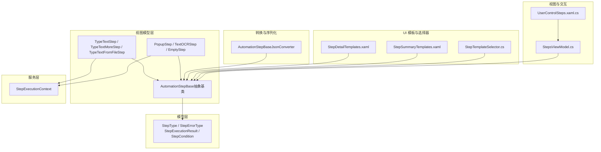
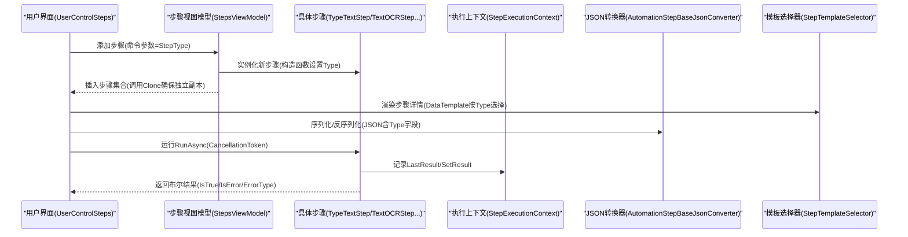
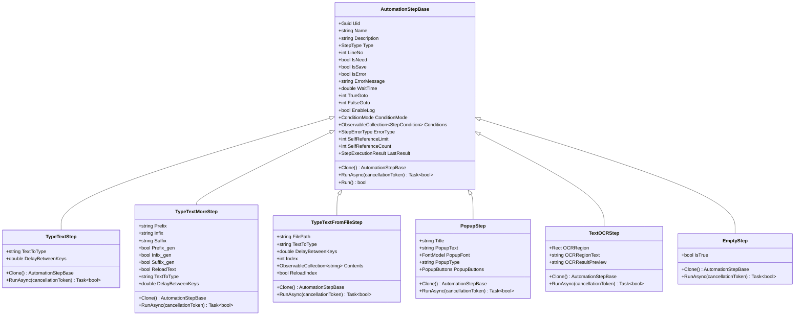
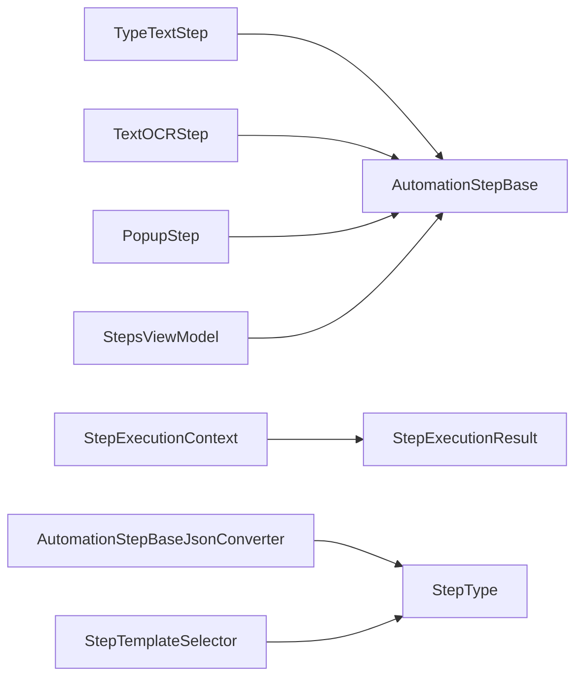
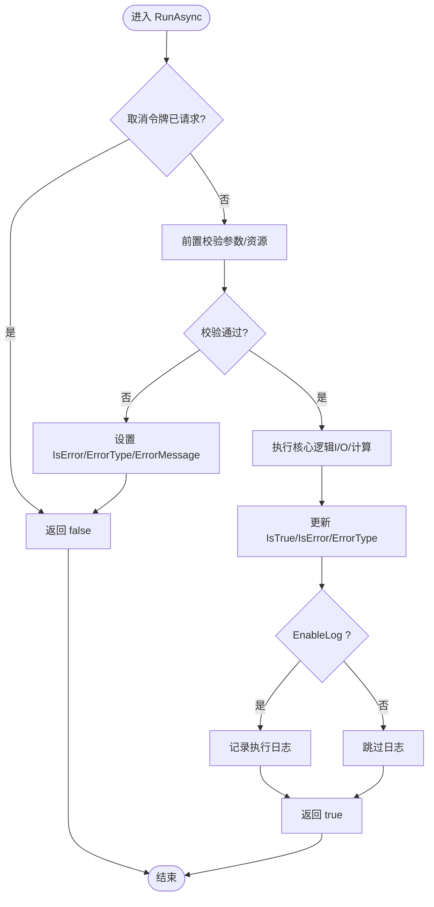

# 自定义步骤开发

<cite>
**本文引用的文件**   
- [AutomationStep.cs](file://ShaoLu/Viewmodels/AutomationStep.cs)
- [AutomationStepModel.cs](file://ShaoLu/Models/AutomationStepModel.cs)
- [StepExecutionContext.cs](file://ShaoLu/Services/StepExecutionContext.cs)
- [AutomationStepJsonConverter.cs](file://ShaoLu/Converters/AutomationStepJsonConverter.cs)
- [StepDetailTemplates.xaml](file://ShaoLu/Templates/StepDetailTemplates.xaml)
- [StepSummaryTemplates.xaml](file://ShaoLu/Templates/StepSummaryTemplates.xaml)
- [StepTemplateSelector.cs](file://ShaoLu/Converters/StepTemplateSelector.cs)
- [StepsViewModel.cs](file://ShaoLu/Viewmodels/StepsViewModel.cs)
- [UserControlSteps.xaml.cs](file://ShaoLu/Views/UserControlSteps.xaml.cs)
- [TextOCRStep.cs](file://ShaoLu/Viewmodels/TextOCRStep.cs)
- [StepExecutionResult.cs](file://ShaoLu/Models/StepExecutionResult.cs)
- [StepCondition.cs](file://ShaoLu/Models/StepCondition.cs)
- [AutomationStepTests.cs](file://NUnitTest/AutomationStepTests.cs)
- [StepExecutionContextTests.cs](file://NUnitTest/StepExecutionContextTests.cs)
</cite>

## 目录
1. [简介](#简介)
2. [项目结构](#项目结构)
3. [核心组件](#核心组件)
4. [架构总览](#架构总览)
5. [详细组件分析](#详细组件分析)
6. [依赖关系分析](#依赖关系分析)
7. [性能考虑](#性能考虑)
8. [故障排查指南](#故障排查指南)
9. [结论](#结论)
10. [附录：完整开发示例与最佳实践](#附录完整开发示例与最佳实践)

## 简介
本指南面向希望扩展自动化流程系统的开发者，详细说明如何基于 AutomationStepBase 基类创建自定义步骤类型。内容涵盖：
- 必需实现的属性与方法、构造函数设计模式
- RunAsync 异步执行模式（CancellationToken 支持、异常处理、返回值约定）
- Clone 深拷贝实现要点（对象属性复制与依赖关系处理）
- 步骤注册机制（StepType 枚举扩展、工厂模式集成、UI 模板绑定）
- 从简单到复杂的完整开发示例
- 调试技巧、测试策略与性能优化建议
- 与现有系统集成的方式与最佳实践

## 项目结构
本项目采用分层组织：模型层定义枚举与数据结构；视图模型层实现具体步骤逻辑；服务层提供执行上下文与工具能力；转换器负责多态序列化；模板与选择器负责 UI 展示。

图表来源
- [AutomationStep.cs:25-205](file://ShaoLu/Viewmodels/AutomationStep.cs#L25-L205)
- [AutomationStepModel.cs:9-41](file://ShaoLu/Models/AutomationStepModel.cs#L9-L41)
- [StepExecutionContext.cs:9-86](file://ShaoLu/Services/StepExecutionContext.cs#L9-L86)
- [AutomationStepJsonConverter.cs:13-118](file://ShaoLu/Converters/AutomationStepJsonConverter.cs#L13-L118)
- [StepDetailTemplates.xaml:116-608](file://ShaoLu/Templates/StepDetailTemplates.xaml#L116-L608)
- [StepSummaryTemplates.xaml:10-55](file://ShaoLu/Templates/StepSummaryTemplates.xaml#L10-L55)
- [StepTemplateSelector.cs:8-43](file://ShaoLu/Converters/StepTemplateSelector.cs#L8-L43)
- [StepsViewModel.cs:291-322](file://ShaoLu/Viewmodels/StepsViewModel.cs#L291-L322)
- [UserControlSteps.xaml.cs:26-43](file://ShaoLu/Views/UserControlSteps.xaml.cs#L26-L43)

章节来源
- [AutomationStep.cs:25-205](file://ShaoLu/Viewmodels/AutomationStep.cs#L25-L205)
- [AutomationStepModel.cs:9-41](file://ShaoLu/Models/AutomationStepModel.cs#L9-L41)
- [StepExecutionContext.cs:9-86](file://ShaoLu/Services/StepExecutionContext.cs#L9-L86)
- [AutomationStepJsonConverter.cs:13-118](file://ShaoLu/Converters/AutomationStepJsonConverter.cs#L13-L118)
- [StepDetailTemplates.xaml:116-608](file://ShaoLu/Templates/StepDetailTemplates.xaml#L116-L608)
- [StepSummaryTemplates.xaml:10-55](file://ShaoLu/Templates/StepSummaryTemplates.xaml#L10-L55)
- [StepTemplateSelector.cs:8-43](file://ShaoLu/Converters/StepTemplateSelector.cs#L8-L43)
- [StepsViewModel.cs:291-322](file://ShaoLu/Viewmodels/StepsViewModel.cs#L291-L322)
- [UserControlSteps.xaml.cs:26-43](file://ShaoLu/Views/UserControlSteps.xaml.cs#L26-L43)

## 核心组件
- AutomationStepBase：所有步骤的抽象基类，定义通用属性（名称、描述、类型、等待时间、条件、日志开关等）、抽象方法 Clone() 与 RunAsync(CancellationToken)，并提供同步 Run() 包装。
- StepType / StepErrorType：步骤类型与错误类型的枚举，用于序列化、UI 选择与错误分类。
- StepExecutionResult：步骤执行结果的数据载体，包含是否成功、耗时、相似度、点击位置、OCR 文本、错误信息、执行时间。
- StepExecutionContext：保存各步骤执行结果，并解析条件变量（当前步骤或引用其他步骤）。
- AutomationStepBaseJsonConverter：基于 JSON 中 Type 字段的多态反序列化转换器，将字符串或数字枚举映射为具体步骤类型。
- StepTemplateSelector：根据步骤 Type 返回对应的 DataTemplate，实现 UI 模板的动态绑定。
- StepsViewModel：管理步骤集合、插入/复制/剪切等操作，使用 Clone 保证数据独立性。
- UserControlSteps：用户界面入口，通过命令参数触发添加步骤。

章节来源
- [AutomationStep.cs:25-205](file://ShaoLu/Viewmodels/AutomationStep.cs#L25-L205)
- [AutomationStepModel.cs:9-41](file://ShaoLu/Models/AutomationStepModel.cs#L9-L41)
- [StepExecutionResult.cs:8-44](file://ShaoLu/Models/StepExecutionResult.cs#L8-L44)
- [StepExecutionContext.cs:9-86](file://ShaoLu/Services/StepExecutionContext.cs#L9-L86)
- [AutomationStepJsonConverter.cs:13-118](file://ShaoLu/Converters/AutomationStepJsonConverter.cs#L13-L118)
- [StepTemplateSelector.cs:8-43](file://ShaoLu/Converters/StepTemplateSelector.cs#L8-L43)
- [StepsViewModel.cs:291-322](file://ShaoLu/Viewmodels/StepsViewModel.cs#L291-L322)
- [UserControlSteps.xaml.cs:26-43](file://ShaoLu/Views/UserControlSteps.xaml.cs#L26-L43)

## 架构总览
下图展示了自定义步骤从创建、配置、序列化到执行与 UI 绑定的整体流程。

图表来源
- [UserControlSteps.xaml.cs:26-43](file://ShaoLu/Views/UserControlSteps.xaml.cs#L26-L43)
- [StepsViewModel.cs:291-322](file://ShaoLu/Viewmodels/StepsViewModel.cs#L291-L322)
- [AutomationStep.cs:25-205](file://ShaoLu/Viewmodels/AutomationStep.cs#L25-L205)
- [StepExecutionContext.cs:9-86](file://ShaoLu/Services/StepExecutionContext.cs#L9-L86)
- [AutomationStepJsonConverter.cs:13-118](file://ShaoLu/Converters/AutomationStepJsonConverter.cs#L13-L118)
- [StepTemplateSelector.cs:8-43](file://ShaoLu/Converters/StepTemplateSelector.cs#L8-L43)

## 详细组件分析

### 基类与抽象契约：AutomationStepBase
- 必需属性
  - 标识与元数据：Uid、Name、Description、Type、LineNo
  - 执行控制：WaitTime、TrueGoto、FalseGoto、EnableLog
  - 条件判断：ConditionMode、Conditions（ObservableCollection）
  - 运行时状态：IsNeed、IsSave、IsError、ErrorMessage、ErrorType、SelfReferenceLimit、SelfReferenceCount、LastResult
- 必需方法
  - Clone()：返回同类型的新实例，完成深拷贝
  - RunAsync(CancellationToken)：异步执行主体，返回 bool 表示是否成功
  - Run()：同步包装，内部调用 RunAsync(CancellationToken.None)
- 构造函数设计模式
  - 无参构造：初始化默认值（如 LineNo=0、Name=""、Description=""）
  - 带参构造：便于测试与快速初始化，设置 Name 与 Type
- 注意事项
  - Name 赋值需进行空值防御，避免绑定崩溃
  - SelfReferenceCount 不序列化，仅运行时使用
  - LastResult 不序列化，仅运行时使用

章节来源
- [AutomationStep.cs:25-205](file://ShaoLu/Viewmodels/AutomationStep.cs#L25-L205)

### 异步执行模式：RunAsync
- 取消令牌支持
  - 所有阻塞操作应接受 CancellationToken，并在 Task.Delay 或 I/O 操作中传递
  - 弹窗步骤需在取消时关闭 UI 窗口，确保线程安全（Dispatcher.InvokeAsync）
- 异常处理
  - 捕获异常并设置 IsError、ErrorType、ErrorMessage，返回 false
  - 对资源访问（文件、OCR）进行 try/catch，避免进程崩溃
- 返回值约定
  - true：步骤执行成功（例如输入成功、识别到文本）
  - false：失败或被取消（例如索引越界、OCR 区域为空）
- 执行结果
  - 更新 IsTrue、IsError、ErrorType
  - 可选记录 LastResult（供条件判断与日志）

章节来源
- [AutomationStep.cs:253-278](file://ShaoLu/Viewmodels/AutomationStep.cs#L253-L278)
- [AutomationStep.cs:693-752](file://ShaoLu/Viewmodels/AutomationStep.cs#L693-L752)
- [TextOCRStep.cs:102-142](file://ShaoLu/Viewmodels/TextOCRStep.cs#L102-L142)

### 深拷贝实现：Clone
- 原则
  - 新建同类型实例，复制所有可序列化属性
  - 对于复杂对象（如 ObservableCollection），需创建新集合或克隆元素
  - 对于不可变值类型（double、int、string），直接赋值即可
- 依赖关系处理
  - 若步骤持有外部服务引用（如 SingletonLocator），不应在 Clone 中复制引用，而是保持共享
  - 对于 UI 相关对象（如 FontModel），需调用其 Clone 方法
- 示例参考
  - TypeTextStep.Clone：复制基础属性与业务属性
  - TypeTextMoreStep.Clone：复制前缀/中缀/后缀及生成标志
  - PopupStep.Clone：复制按钮集合与字体对象
  - TextOCRStep.Clone：复制 OCRRegion（Rect）与 Conditions 集合

章节来源
- [AutomationStep.cs:238-250](file://ShaoLu/Viewmodels/AutomationStep.cs#L238-L250)
- [AutomationStep.cs:365-384](file://ShaoLu/Viewmodels/AutomationStep.cs#L365-L384)
- [AutomationStep.cs:676-691](file://ShaoLu/Viewmodels/AutomationStep.cs#L676-L691)
- [TextOCRStep.cs:87-100](file://ShaoLu/Viewmodels/TextOCRStep.cs#L87-L100)

### 步骤注册机制：StepType 枚举扩展与工厂集成
- 扩展 StepType 枚举
  - 在 StepType 中添加新的步骤类型（如 ClickImage、TypeText、Popup、TextOCR 等）
- 工厂模式集成
  - 在 AutomationStepBaseJsonConverter 的 switch 映射中新增类型到具体类的映射
  - 确保 JSON 中的 Type 字段与枚举一致（支持字符串与数字两种格式）
- UI 模板绑定
  - 在 StepTemplateSelector 中为新类型添加 DataTemplate 分支
  - 在 StepDetailTemplates.xaml 中定义对应步骤的 DataTemplate
  - 在 StepSummaryTemplates.xaml 中定义摘要模板（可选）
- 视图交互
  - UserControlSteps 通过命令参数触发添加步骤
  - StepsViewModel.InsertSteps 使用 Clone 确保插入的是独立副本

章节来源
- [AutomationStepModel.cs:9-22](file://ShaoLu/Models/AutomationStepModel.cs#L9-L22)
- [AutomationStepJsonConverter.cs:70-85](file://ShaoLu/Converters/AutomationStepJsonConverter.cs#L70-L85)
- [StepTemplateSelector.cs:21-41](file://ShaoLu/Converters/StepTemplateSelector.cs#L21-L41)
- [StepDetailTemplates.xaml:598-608](file://ShaoLu/Templates/StepDetailTemplates.xaml#L598-L608)
- [StepSummaryTemplates.xaml:10-16](file://ShaoLu/Templates/StepSummaryTemplates.xaml#L10-L16)
- [UserControlSteps.xaml.cs:26-43](file://ShaoLu/Views/UserControlSteps.xaml.cs#L26-L43)
- [StepsViewModel.cs:291-322](file://ShaoLu/Viewmodels/StepsViewModel.cs#L291-L322)

### 执行上下文与条件判断
- StepExecutionContext
  - SetResult/GetResult：按行号存储与获取执行结果
  - Clear：每次运行前清空结果
  - ResolveVariable：解析条件变量（常量、当前步骤、引用其他步骤）
- StepCondition
  - Variable：条件变量（Self_* 或 Step_*）
  - Operator：比较运算符（等于、包含、是否为空等）
  - Value：比较值（字符串形式，运行时解析）
  - Connector：逻辑连接符（And/Or）
- 使用场景
  - 步骤执行后设置 LastResult
  - 条件面板允许用户配置规则行，运行时由上下文解析

章节来源
- [StepExecutionContext.cs:9-86](file://ShaoLu/Services/StepExecutionContext.cs#L9-L86)
- [StepCondition.cs:76-120](file://ShaoLu/Models/StepCondition.cs#L76-L120)
- [StepExecutionResult.cs:8-44](file://ShaoLu/Models/StepExecutionResult.cs#L8-L44)

### 类图：步骤继承与关系

图表来源
- [AutomationStep.cs:25-205](file://ShaoLu/Viewmodels/AutomationStep.cs#L25-L205)
- [AutomationStep.cs:209-278](file://ShaoLu/Viewmodels/AutomationStep.cs#L209-L278)
- [AutomationStep.cs:281-435](file://ShaoLu/Viewmodels/AutomationStep.cs#L281-L435)
- [AutomationStep.cs:437-602](file://ShaoLu/Viewmodels/AutomationStep.cs#L437-L602)
- [AutomationStep.cs:606-752](file://ShaoLu/Viewmodels/AutomationStep.cs#L606-L752)
- [TextOCRStep.cs:17-142](file://ShaoLu/Viewmodels/TextOCRStep.cs#L17-L142)
- [AutomationStep.cs:823-846](file://ShaoLu/Viewmodels/AutomationStep.cs#L823-L846)

## 依赖关系分析
- 低耦合高内聚
  - 步骤类仅依赖基类与必要服务（如 SingletonLocator、OCRService）
  - 执行上下文独立于具体步骤，仅依赖结果模型
- 序列化与 UI 解耦
  - JSON 转换器与模板选择器通过枚举与类型名映射，新增步骤无需修改核心逻辑
- 潜在循环依赖
  - 避免步骤间直接相互引用，通过 StepExecutionContext 间接引用执行结果

图表来源
- [AutomationStep.cs:25-205](file://ShaoLu/Viewmodels/AutomationStep.cs#L25-L205)
- [StepExecutionContext.cs:9-86](file://ShaoLu/Services/StepExecutionContext.cs#L9-L86)
- [AutomationStepJsonConverter.cs:13-118](file://ShaoLu/Converters/AutomationStepJsonConverter.cs#L13-L118)
- [StepTemplateSelector.cs:8-43](file://ShaoLu/Converters/StepTemplateSelector.cs#L8-L43)
- [StepsViewModel.cs:291-322](file://ShaoLu/Viewmodels/StepsViewModel.cs#L291-L322)

章节来源
- [AutomationStep.cs:25-205](file://ShaoLu/Viewmodels/AutomationStep.cs#L25-L205)
- [StepExecutionContext.cs:9-86](file://ShaoLu/Services/StepExecutionContext.cs#L9-L86)
- [AutomationStepJsonConverter.cs:13-118](file://ShaoLu/Converters/AutomationStepJsonConverter.cs#L13-L118)
- [StepTemplateSelector.cs:8-43](file://ShaoLu/Converters/StepTemplateSelector.cs#L8-L43)
- [StepsViewModel.cs:291-322](file://ShaoLu/Viewmodels/StepsViewModel.cs#L291-L322)

## 性能考虑
- 异步与取消
  - 所有 I/O 与长时间任务使用 Task.Run 与 CancellationToken，避免阻塞 UI 线程
- 集合虚拟化
  - 大量条目时使用 VirtualizingStackPanel，提升 UI 性能
- 深拷贝成本
  - Clone 仅复制必要属性，避免复制大型对象或重复计算
- 日志开关
  - 通过 EnableLog 控制日志输出，减少 I/O 开销

[本节为通用指导，不直接分析具体文件]

## 故障排查指南
- 常见问题
  - Name 为空导致绑定崩溃：检查属性 setter 的空值防御
  - Clone 未复制集合导致共享状态：确保 ObservableCollection 新建实例
  - RunAsync 未处理取消令牌：在 Task.Delay 与 I/O 中传递 cancellationToken
  - JSON 反序列化失败：确认 StepType 映射与枚举值一致
- 调试技巧
  - 使用 NLog 记录关键路径与异常
  - 在单元测试中验证构造函数、Clone、默认属性
  - 使用 StepExecutionContext 打印执行结果，辅助定位条件判断问题

章节来源
- [AutomationStep.cs:75-82](file://ShaoLu/Viewmodels/AutomationStep.cs#L75-L82)
- [AutomationStep.cs:238-250](file://ShaoLu/Viewmodels/AutomationStep.cs#L238-L250)
- [AutomationStep.cs:253-278](file://ShaoLu/Viewmodels/AutomationStep.cs#L253-L278)
- [AutomationStepJsonConverter.cs:70-85](file://ShaoLu/Converters/AutomationStepJsonConverter.cs#L70-L85)
- [AutomationStepTests.cs:19-116](file://NUnitTest/AutomationStepTests.cs#L19-L116)
- [StepExecutionContextTests.cs:24-48](file://NUnitTest/StepExecutionContextTests.cs#L24-L48)

## 结论
通过继承 AutomationStepBase，开发者可以以统一契约扩展自动化步骤。关键在于：
- 正确实现 Clone 与 RunAsync
- 遵循异步与取消模式
- 完善 StepType 映射与 UI 模板绑定
- 利用 StepExecutionContext 进行条件判断与结果共享
- 编写单元测试保障质量

## 附录：完整开发示例与最佳实践

### 示例一：简单步骤（EmptyStep）
- 目标：创建一个空步骤，仅等待指定时间并返回预设布尔值
- 步骤
  - 继承 AutomationStepBase
  - 构造函数设置 Type = StepType.Empty
  - 实现 Clone：复制 WaitTime、TrueGoto、FalseGoto、IsNeed
  - 实现 RunAsync：Task.Delay(WaitTime) 后返回 IsTrue
- 参考路径
  - [AutomationStep.cs:823-846](file://ShaoLu/Viewmodels/AutomationStep.cs#L823-L846)

章节来源
- [AutomationStep.cs:823-846](file://ShaoLu/Viewmodels/AutomationStep.cs#L823-L846)

### 示例二：复杂业务逻辑（TextOCRStep）
- 目标：从屏幕指定区域执行 OCR 识别，返回识别文本
- 步骤
  - 继承 AutomationStepBase
  - 构造函数设置 Type = StepType.TextOCR
  - 属性：OCRRegion、OCRRegionText、OCRResultPreview
  - 命令：SelectRegionCommand、TestOCRCommand
  - Clone：复制 OCRRegion（Rect）、Conditions 集合
  - RunAsync：校验区域有效性，调用 OCRService.RecognizeRegion，设置 LastResult 与 IsTrue
- 参考路径
  - [TextOCRStep.cs:17-142](file://ShaoLu/Viewmodels/TextOCRStep.cs#L17-L142)

章节来源
- [TextOCRStep.cs:17-142](file://ShaoLu/Viewmodels/TextOCRStep.cs#L17-L142)

### 示例三：集成与测试
- 集成
  - 扩展 StepType 枚举
  - 在 AutomationStepJsonConverter 中添加类型映射
  - 在 StepTemplateSelector 中添加 DataTemplate 分支
  - 在 StepDetailTemplates.xaml 中定义 UI 模板
- 测试
  - 验证构造函数设置 Type
  - 验证 Clone 创建独立副本
  - 验证默认属性值
  - 验证 RunAsync 的异常处理与返回值
- 参考路径
  - [AutomationStepModel.cs:9-22](file://ShaoLu/Models/AutomationStepModel.cs#L9-L22)
  - [AutomationStepJsonConverter.cs:70-85](file://ShaoLu/Converters/AutomationStepJsonConverter.cs#L70-L85)
  - [StepTemplateSelector.cs:21-41](file://ShaoLu/Converters/StepTemplateSelector.cs#L21-L41)
  - [StepDetailTemplates.xaml:598-608](file://ShaoLu/Templates/StepDetailTemplates.xaml#L598-L608)
  - [AutomationStepTests.cs:19-116](file://NUnitTest/AutomationStepTests.cs#L19-L116)

章节来源
- [AutomationStepModel.cs:9-22](file://ShaoLu/Models/AutomationStepModel.cs#L9-L22)
- [AutomationStepJsonConverter.cs:70-85](file://ShaoLu/Converters/AutomationStepJsonConverter.cs#L70-L85)
- [StepTemplateSelector.cs:21-41](file://ShaoLu/Converters/StepTemplateSelector.cs#L21-L41)
- [StepDetailTemplates.xaml:598-608](file://ShaoLu/Templates/StepDetailTemplates.xaml#L598-L608)
- [AutomationStepTests.cs:19-116](file://NUnitTest/AutomationStepTests.cs#L19-L116)

### 流程图：RunAsync 执行流程

图表来源
- [AutomationStep.cs:253-278](file://ShaoLu/Viewmodels/AutomationStep.cs#L253-L278)
- [TextOCRStep.cs:102-142](file://ShaoLu/Viewmodels/TextOCRStep.cs#L102-L142)