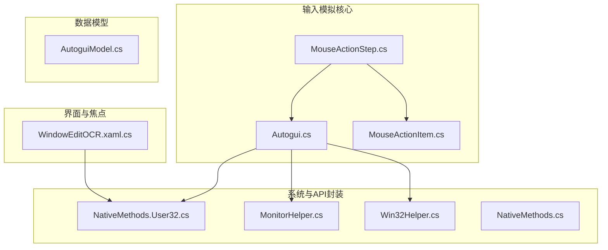
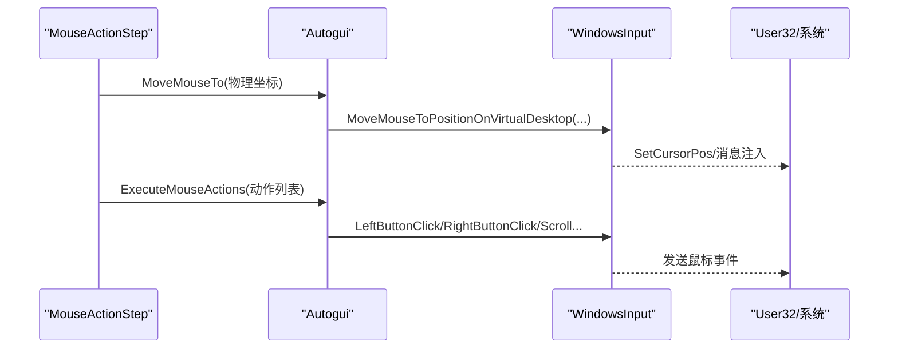
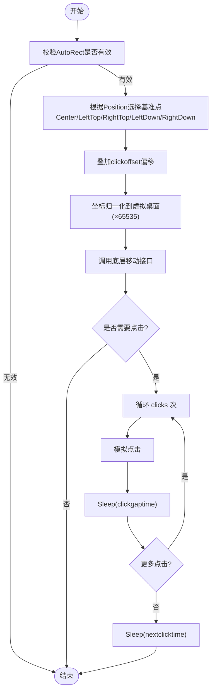
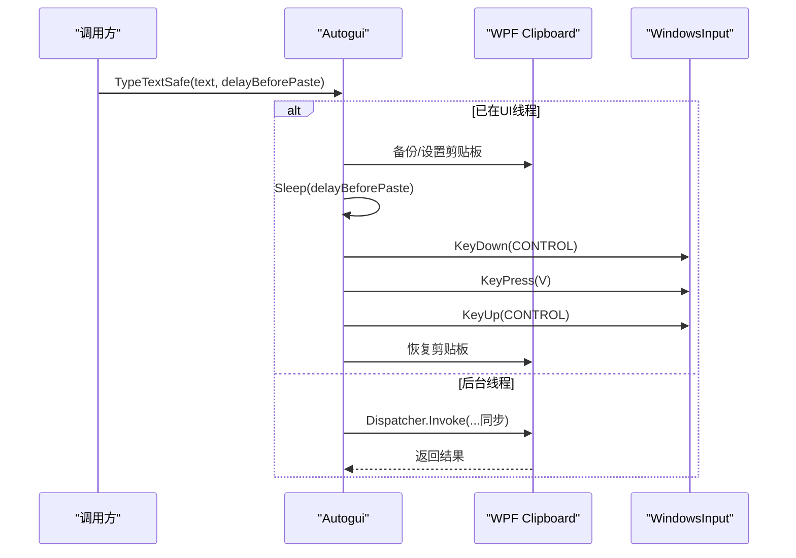
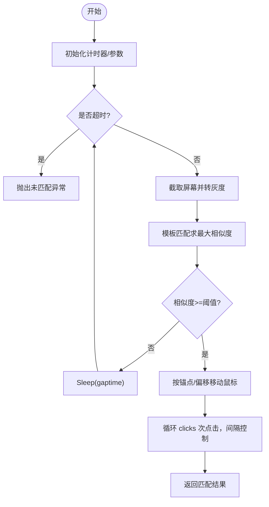
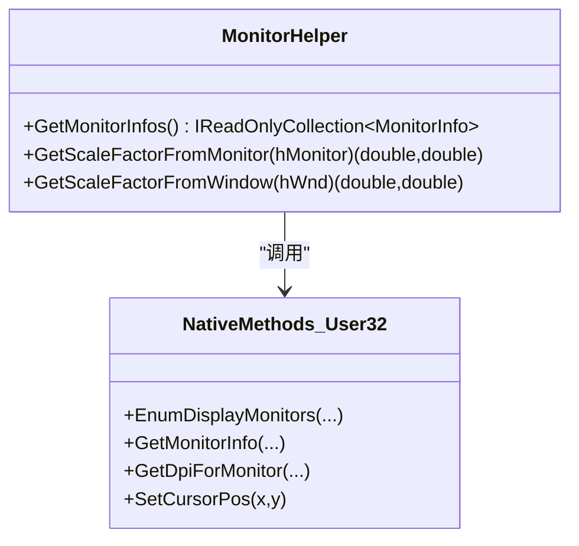
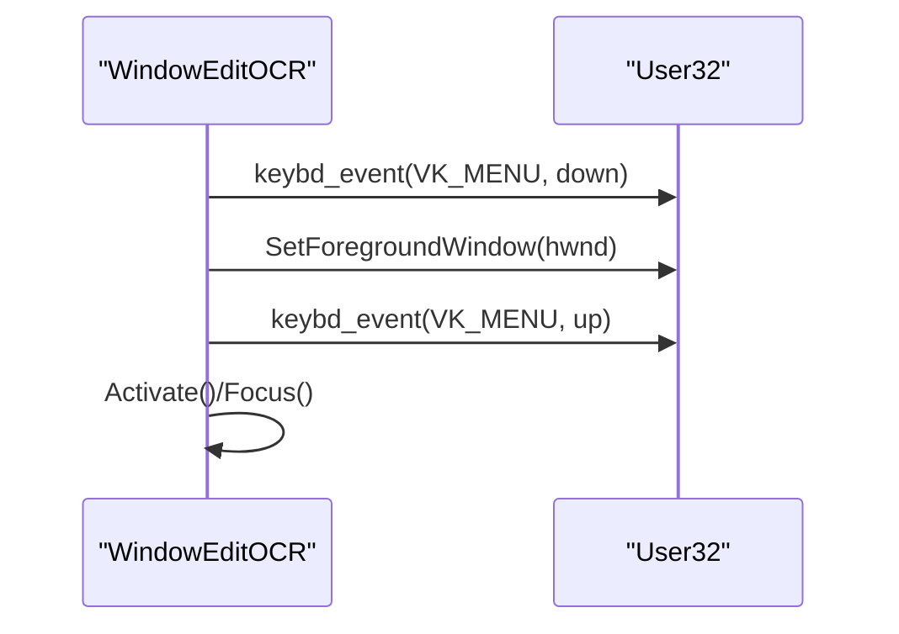
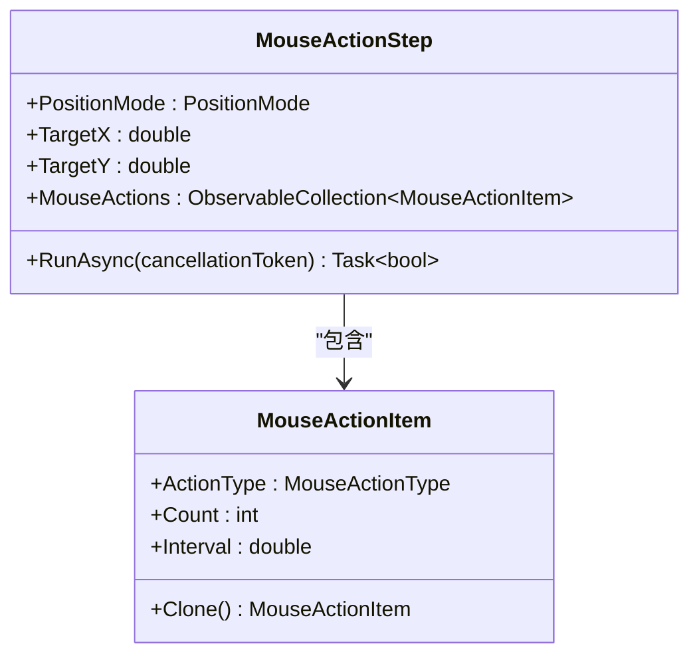
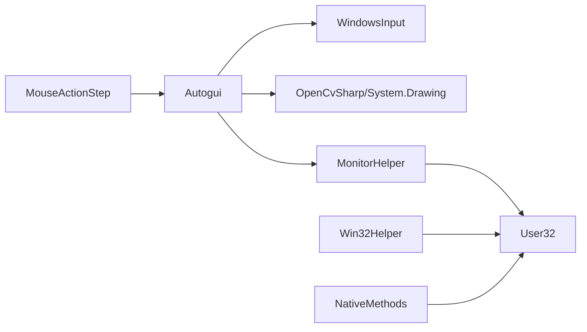

# 输入模拟模块

<cite>
**本文引用的文件**   
- [Autogui.cs](file://ShaoLu/Utils/Autogui.cs)
- [NativeMethods.cs](file://ShaoLu/Utils/NativeMethods.cs)
- [NativeMethods.User32.cs](file://ShaoLu/Tools/ImageEdit/Interop/NativeMethods.User32.cs)
- [MonitorHelper.cs](file://ShaoLu/Tools/ImageEdit/Helpers/MonitorHelper.cs)
- [Win32Helper.cs](file://ShaoLu/Tools/ImageEdit/Helpers/Win32Helper.cs)
- [MouseActionItem.cs](file://ShaoLu/Models/MouseActionItem.cs)
- [MouseActionStep.cs](file://ShaoLu/Viewmodels/MouseActionStep.cs)
- [AutoguiModel.cs](file://ShaoLu/Models/AutoguiModel.cs)
- [WindowEditOCR.xaml.cs](file://ShaoLu/Views/WindowEditOCR.xaml.cs)
</cite>

## 目录
1. [简介](#简介)
2. [项目结构](#项目结构)
3. [核心组件](#核心组件)
4. [架构总览](#架构总览)
5. [详细组件分析](#详细组件分析)
6. [依赖关系分析](#依赖关系分析)
7. [性能考量](#性能考量)
8. [故障排查指南](#故障排查指南)
9. [结论](#结论)
10. [附录](#附录)

## 简介
本技术文档聚焦 ShaoLu 的输入模拟模块，系统阐述鼠标与键盘输入模拟的实现原理、多显示器坐标转换、窗口焦点控制与应用间通信机制。重点覆盖：
- 鼠标操作模拟：Windows API 调用、虚拟桌面坐标归一化、多显示器支持
- 键盘输入模拟：安全模式与非安全模式的差异、按键间隔控制、中文输入法兼容性
- 图像识别驱动点击：模板匹配、超时与重试策略
- 窗口操作与焦点管理：前台激活、Alt 绕过策略
- 性能优化建议与常见问题解决方案

## 项目结构
输入模拟相关代码主要分布在以下位置：
- Utils/Autogui.cs：输入模拟核心（鼠标移动、点击、滚动、文本输入）
- Models/MouseActionItem.cs：鼠标动作项定义（类型、次数、间隔）
- Viewmodels/MouseActionStep.cs：鼠标操作步骤执行器（绝对坐标/当前鼠标位置）
- Tools/ImageEdit/Interop/NativeMethods.User32.cs：User32 原生方法声明（钩子、显示器枚举、光标位置等）
- Tools/ImageEdit/Helpers/MonitorHelper.cs：多显示器 DPI/缩放因子获取
- Tools/ImageEdit/Helpers/Win32Helper.cs：低级鼠标钩子订阅与物理光标读取
- Utils/NativeMethods.cs：全局热键注册/注销
- Views/WindowEditOCR.xaml.cs：窗口前台激活与焦点管理示例

图表来源
- [Autogui.cs:1-656](file://ShaoLu/Utils/Autogui.cs#L1-L656)
- [NativeMethods.User32.cs:1-190](file://ShaoLu/Tools/ImageEdit/Interop/NativeMethods.User32.cs#L1-L190)
- [MonitorHelper.cs:1-71](file://ShaoLu/Tools/ImageEdit/Helpers/MonitorHelper.cs#L1-L71)
- [Win32Helper.cs:1-52](file://ShaoLu/Tools/ImageEdit/Helpers/Win32Helper.cs#L1-L52)
- [NativeMethods.cs:1-19](file://ShaoLu/Utils/NativeMethods.cs#L1-L19)
- [MouseActionItem.cs:1-57](file://ShaoLu/Models/MouseActionItem.cs#L1-L57)
- [MouseActionStep.cs:1-162](file://ShaoLu/Viewmodels/MouseActionStep.cs#L1-L162)
- [AutoguiModel.cs:1-145](file://ShaoLu/Models/AutoguiModel.cs#L1-L145)
- [WindowEditOCR.xaml.cs:107-186](file://ShaoLu/Views/WindowEditOCR.xaml.cs#L107-L186)

章节来源
- [Autogui.cs:1-656](file://ShaoLu/Utils/Autogui.cs#L1-L656)
- [MouseActionItem.cs:1-57](file://ShaoLu/Models/MouseActionItem.cs#L1-L57)
- [MouseActionStep.cs:1-162](file://ShaoLu/Viewmodels/MouseActionStep.cs#L1-L162)
- [NativeMethods.User32.cs:1-190](file://ShaoLu/Tools/ImageEdit/Interop/NativeMethods.User32.cs#L1-L190)
- [MonitorHelper.cs:1-71](file://ShaoLu/Tools/ImageEdit/Helpers/MonitorHelper.cs#L1-L71)
- [Win32Helper.cs:1-52](file://ShaoLu/Tools/ImageEdit/Helpers/Win32Helper.cs#L1-L52)
- [NativeMethods.cs:1-19](file://ShaoLu/Utils/NativeMethods.cs#L1-L19)
- [AutoguiModel.cs:1-145](file://ShaoLu/Models/AutoguiModel.cs#L1-L145)
- [WindowEditOCR.xaml.cs:107-186](file://ShaoLu/Views/WindowEditOCR.xaml.cs#L107-L186)

## 核心组件
- Autogui：提供屏幕截图、图像模板匹配、鼠标移动/点击/滚动、文本输入（安全/非安全模式）、动作序列执行等能力
- MouseActionItem：描述单次鼠标动作的类型、执行次数与间隔
- MouseActionStep：将逻辑像素坐标转换为物理像素并驱动 Autogui 执行；支持“绝对坐标”和“当前鼠标位置”两种模式
- NativeMethods.User32 / MonitorHelper / Win32Helper：封装 User32 API、枚举显示器与 DPI、设置低级别鼠标钩子、读取物理光标位置
- NativeMethods：全局热键注册/注销
- WindowEditOCR：演示通过 Alt 键绕过前台锁定以激活窗口

章节来源
- [Autogui.cs:1-656](file://ShaoLu/Utils/Autogui.cs#L1-L656)
- [MouseActionItem.cs:1-57](file://ShaoLu/Models/MouseActionItem.cs#L1-L57)
- [MouseActionStep.cs:1-162](file://ShaoLu/Viewmodels/MouseActionStep.cs#L1-L162)
- [NativeMethods.User32.cs:1-190](file://ShaoLu/Tools/ImageEdit/Interop/NativeMethods.User32.cs#L1-L190)
- [MonitorHelper.cs:1-71](file://ShaoLu/Tools/ImageEdit/Helpers/MonitorHelper.cs#L1-L71)
- [Win32Helper.cs:1-52](file://ShaoLu/Tools/ImageEdit/Helpers/Win32Helper.cs#L1-L52)
- [NativeMethods.cs:1-19](file://ShaoLu/Utils/NativeMethods.cs#L1-L19)
- [WindowEditOCR.xaml.cs:107-186](file://ShaoLu/Views/WindowEditOCR.xaml.cs#L107-L186)

## 架构总览
输入模拟模块采用分层设计：
- 应用层（步骤/视图模型）：定义自动化步骤与交互配置
- 业务层（Autogui）：封装输入模拟、图像识别、剪贴板粘贴等
- 系统层（User32/DPI/钩子）：通过 P/Invoke 调用 Windows API 完成底层输入与显示信息获取

图表来源
- [MouseActionStep.cs:112-144](file://ShaoLu/Viewmodels/MouseActionStep.cs#L112-L144)
- [Autogui.cs:193-254](file://ShaoLu/Utils/Autogui.cs#L193-L254)
- [Autogui.cs:311-339](file://ShaoLu/Utils/Autogui.cs#L311-L339)

## 详细组件分析

### 鼠标移动与点击（含多显示器与虚拟桌面）
- 坐标转换：Autogui.MoveMouseTo 将逻辑像素坐标映射到虚拟桌面坐标系，使用 65535 归一化值进行跨显示器/缩放一致性
- 锚点定位：MoveMouseTo(AutoRect, Position) 支持中心/四角锚点与偏移量，便于精确点击图标或按钮区域
- 点击流程：ClickImageOnScreenEx 先模板匹配定位目标，再按锚点与偏移移动到目标，循环执行指定次数点击，并控制点击间隔与下一次点击等待时间
- 动作序列：ExecuteMouseActions 顺序执行左/右键单击、双击、滚轮上/下，每次动作后按配置的间隔休眠

图表来源
- [Autogui.cs:204-254](file://ShaoLu/Utils/Autogui.cs#L204-L254)
- [Autogui.cs:265-306](file://ShaoLu/Utils/Autogui.cs#L265-L306)
- [Autogui.cs:311-339](file://ShaoLu/Utils/Autogui.cs#L311-L339)

章节来源
- [Autogui.cs:193-254](file://ShaoLu/Utils/Autogui.cs#L193-L254)
- [Autogui.cs:265-306](file://ShaoLu/Utils/Autogui.cs#L265-L306)
- [Autogui.cs:311-339](file://ShaoLu/Utils/Autogui.cs#L311-L339)
- [AutoguiModel.cs:89-144](file://ShaoLu/Models/AutoguiModel.cs#L89-L144)

### 键盘输入模拟（安全/非安全模式与输入法兼容）
- 非安全模式 TypeText：逐字符调用 TextEntry，适合英文或不需要输入法处理的场景；通过 delayBetweenKeys 控制按键间隔
- 安全模式 TypeTextSafe：通过剪贴板 + Ctrl+V 粘贴方式输入，避免输入法干扰；自动在 STA/UI 线程执行剪贴板操作，失败时恢复原剪贴板内容
- 中文输入法兼容：安全模式可规避 IME 组合键问题，提高中文输入稳定性；建议在需要完整字符串粘贴时使用安全模式

图表来源
- [Autogui.cs:569-583](file://ShaoLu/Utils/Autogui.cs#L569-L583)
- [Autogui.cs:585-621](file://ShaoLu/Utils/Autogui.cs#L585-L621)
- [Autogui.cs:623-651](file://ShaoLu/Utils/Autogui.cs#L623-L651)

章节来源
- [Autogui.cs:569-583](file://ShaoLu/Utils/Autogui.cs#L569-L583)
- [Autogui.cs:585-621](file://ShaoLu/Utils/Autogui.cs#L585-L621)
- [Autogui.cs:623-651](file://ShaoLu/Utils/Autogui.cs#L623-L651)

### 图像识别驱动点击（模板匹配与超时重试）
- FindImageOnScreen：对全屏截图进行灰度化与模板匹配，计算最大相似度与中心坐标；支持阈值、间隔与超时参数
- ClickImageOnScreenEx：在超时内循环查找目标，找到后按锚点与偏移移动并执行点击；支持多次点击与点击间隔控制
- 错误处理：未找到目标抛出异常（包含本地化提示），确保调用方可捕获并处理

图表来源
- [Autogui.cs:59-122](file://ShaoLu/Utils/Autogui.cs#L59-L122)
- [Autogui.cs:265-306](file://ShaoLu/Utils/Autogui.cs#L265-L306)

章节来源
- [Autogui.cs:59-122](file://ShaoLu/Utils/Autogui.cs#L59-L122)
- [Autogui.cs:265-306](file://ShaoLu/Utils/Autogui.cs#L265-L306)

### 多显示器支持与 DPI/缩放
- 显示器枚举：EnumDisplayMonitors + GetMonitorInfo 获取各显示器工作区与边界
- DPI 缩放：GetDpiForMonitor 或 DeviceCaps 获取 DPI，计算缩放比例（默认 96 DPI）
- 坐标归一化：将逻辑像素乘以缩放比例得到物理像素，再通过 65535 归一化到虚拟桌面，保证跨显示器一致

图表来源
- [MonitorHelper.cs:16-68](file://ShaoLu/Tools/ImageEdit/Helpers/MonitorHelper.cs#L16-L68)
- [NativeMethods.User32.cs:49-84](file://ShaoLu/Tools/ImageEdit/Interop/NativeMethods.User32.cs#L49-L84)

章节来源
- [MonitorHelper.cs:16-68](file://ShaoLu/Tools/ImageEdit/Helpers/MonitorHelper.cs#L16-L68)
- [NativeMethods.User32.cs:49-84](file://ShaoLu/Tools/ImageEdit/Interop/NativeMethods.User32.cs#L49-L84)

### 窗口操作与焦点管理
- 前台激活：通过 SetForegroundWindow 激活窗口；为绕过 Windows 前台锁定，先模拟按下并释放 Alt 键
- 焦点设置：Activate/Focus 确保窗口获得输入焦点
- 应用场景：OCR 选区窗口、弹窗提示等需要强制前置的场景

图表来源
- [WindowEditOCR.xaml.cs:127-138](file://ShaoLu/Views/WindowEditOCR.xaml.cs#L127-L138)

章节来源
- [WindowEditOCR.xaml.cs:127-138](file://ShaoLu/Views/WindowEditOCR.xaml.cs#L127-L138)

### 鼠标动作序列与执行器
- MouseActionItem：定义动作类型（左/右键、双击、滚轮）、执行次数与间隔
- MouseActionStep：根据位置模式（绝对坐标/当前鼠标）决定移动策略；在后台任务中调用 Autogui 执行动作序列，支持等待时间与取消令牌

图表来源
- [MouseActionItem.cs:1-57](file://ShaoLu/Models/MouseActionItem.cs#L1-L57)
- [MouseActionStep.cs:112-144](file://ShaoLu/Viewmodels/MouseActionStep.cs#L112-L144)

章节来源
- [MouseActionItem.cs:1-57](file://ShaoLu/Models/MouseActionItem.cs#L1-L57)
- [MouseActionStep.cs:112-144](file://ShaoLu/Viewmodels/MouseActionStep.cs#L112-L144)

## 依赖关系分析
- Autogui 依赖 WindowsInput 库进行输入事件注入，并通过 System.Drawing/OpenCvSharp 进行截图与模板匹配
- 多显示器与 DPI 由 MonitorHelper 封装，依赖 User32 API
- 鼠标钩子与物理光标读取由 Win32Helper 提供，用于高级监控与调试
- 全局热键由 NativeMethods 封装 user32.dll

图表来源
- [Autogui.cs:1-656](file://ShaoLu/Utils/Autogui.cs#L1-L656)
- [MonitorHelper.cs:1-71](file://ShaoLu/Tools/ImageEdit/Helpers/MonitorHelper.cs#L1-L71)
- [Win32Helper.cs:1-52](file://ShaoLu/Tools/ImageEdit/Helpers/Win32Helper.cs#L1-L52)
- [NativeMethods.cs:1-19](file://ShaoLu/Utils/NativeMethods.cs#L1-L19)

章节来源
- [Autogui.cs:1-656](file://ShaoLu/Utils/Autogui.cs#L1-L656)
- [MonitorHelper.cs:1-71](file://ShaoLu/Tools/ImageEdit/Helpers/MonitorHelper.cs#L1-L71)
- [Win32Helper.cs:1-52](file://ShaoLu/Tools/ImageEdit/Helpers/Win32Helper.cs#L1-L52)
- [NativeMethods.cs:1-19](file://ShaoLu/Utils/NativeMethods.cs#L1-L19)

## 性能考量
- 图像匹配开销：频繁截图与模板匹配会消耗 CPU/GPU，建议合理设置 gaptime 与 timeout，减少循环频率
- 线程与调度：键盘/鼠标模拟应在 UI 线程或合适的上下文执行，避免阻塞主线程；后台任务中使用 CancellationToken 及时退出
- DPI/缩放缓存：DPI 值可缓存以减少重复查询；坐标转换尽量批量处理
- 剪贴板操作：安全模式需备份/恢复剪贴板，注意异常路径与线程切换开销
- 动作间隔：过短的间隔可能导致目标程序来不及响应，应根据目标应用特性调优

[本节为通用指导，不直接分析具体文件]

## 故障排查指南
- 未找到图像：检查阈值、模板质量、超时与间隔；确认截图分辨率与 DPI 缩放是否正确
- 点击无效：确认坐标已正确归一化到虚拟桌面；检查目标窗口是否在前台且可接收输入
- 中文输入乱码：优先使用 TypeTextSafe 安全模式；确保在 STA 线程执行剪贴板操作
- 前台激活失败：确认已模拟 Alt 键绕过限制；必要时调用 Activate/Focus
- 多显示器错位：核对 MonitorHelper 计算的缩放比例；验证逻辑像素到物理像素转换

章节来源
- [Autogui.cs:59-122](file://ShaoLu/Utils/Autogui.cs#L59-L122)
- [Autogui.cs:265-306](file://ShaoLu/Utils/Autogui.cs#L265-L306)
- [Autogui.cs:585-621](file://ShaoLu/Utils/Autogui.cs#L585-L621)
- [WindowEditOCR.xaml.cs:127-138](file://ShaoLu/Views/WindowEditOCR.xaml.cs#L127-L138)
- [MonitorHelper.cs:38-68](file://ShaoLu/Tools/ImageEdit/Helpers/MonitorHelper.cs#L38-L68)

## 结论
ShaoLu 的输入模拟模块通过 Autogui 统一封装了鼠标与键盘输入、图像识别与剪贴板粘贴等能力，结合 User32 API 与 DPI/缩放工具实现跨显示器与高 DPI 环境下的稳定操作。安全模式提升了中文输入的可靠性，动作序列与超时重试增强了鲁棒性。建议在实际使用中合理配置间隔与阈值，并结合日志与诊断工具持续优化性能与稳定性。

[本节为总结，不直接分析具体文件]

## 附录
- 关键类与方法路径参考：
  - 鼠标移动与点击：[Autogui.cs:193-254](file://ShaoLu/Utils/Autogui.cs#L193-L254)、[Autogui.cs:265-306](file://ShaoLu/Utils/Autogui.cs#L265-L306)
  - 键盘输入（安全/非安全）：[Autogui.cs:569-583](file://ShaoLu/Utils/Autogui.cs#L569-L583)、[Autogui.cs:585-621](file://ShaoLu/Utils/Autogui.cs#L585-L621)、[Autogui.cs:623-651](file://ShaoLu/Utils/Autogui.cs#L623-L651)
  - 多显示器与 DPI：[MonitorHelper.cs:16-68](file://ShaoLu/Tools/ImageEdit/Helpers/MonitorHelper.cs#L16-L68)
  - 窗口前台激活：[WindowEditOCR.xaml.cs:127-138](file://ShaoLu/Views/WindowEditOCR.xaml.cs#L127-L138)
  - 动作项与执行器：[MouseActionItem.cs:1-57](file://ShaoLu/Models/MouseActionItem.cs#L1-L57)、[MouseActionStep.cs:112-144](file://ShaoLu/Viewmodels/MouseActionStep.cs#L112-L144)

[本节为参考索引，不直接分析具体文件]