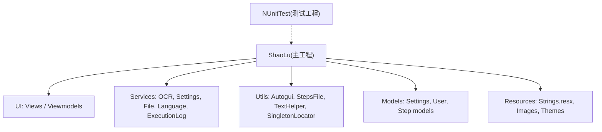
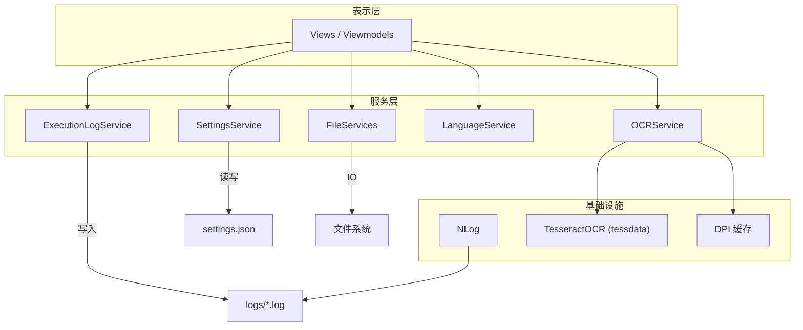
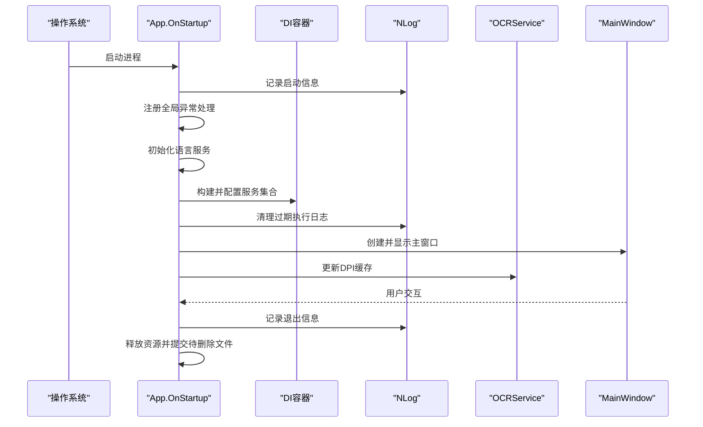
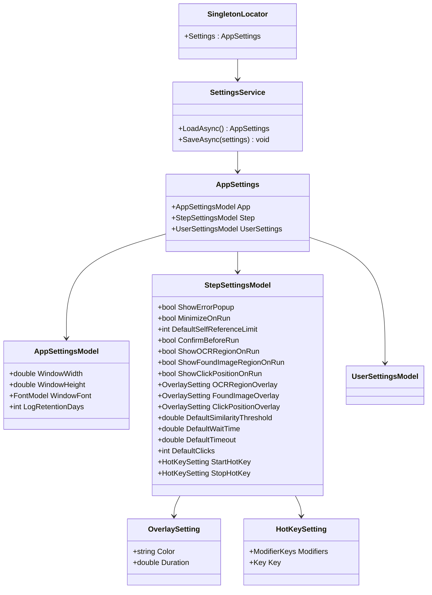
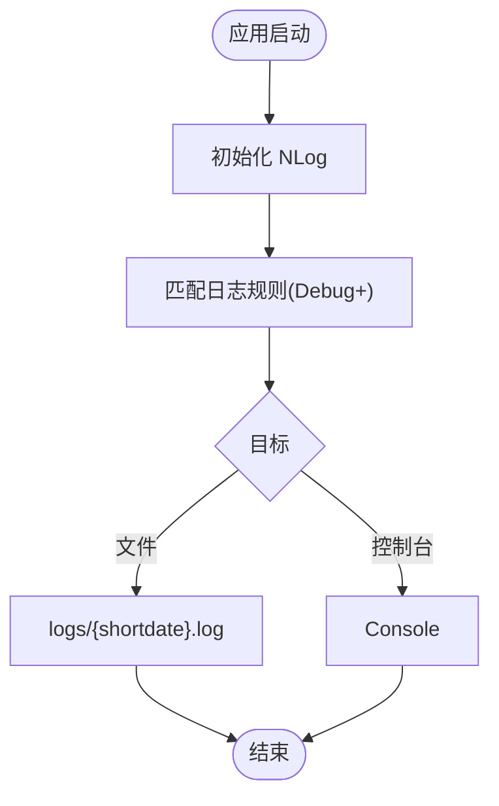
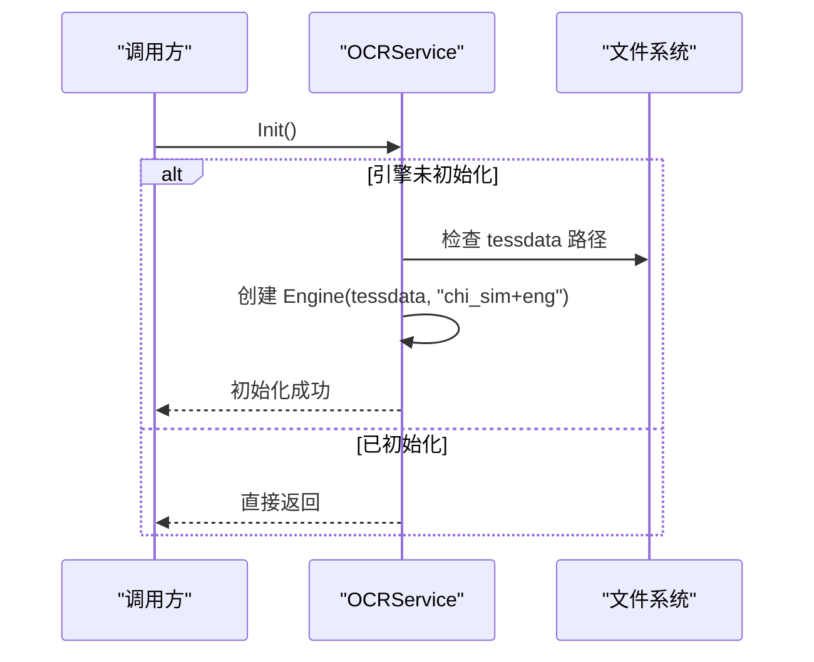
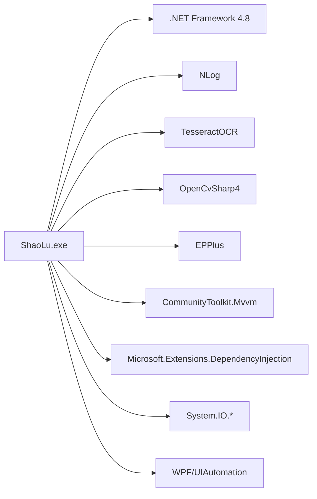

# 部署和配置

<cite>
**本文引用的文件**   
- [Readme.md](file://Readme.md)
- [ShaoLu.csproj](file://ShaoLu/ShaoLu.csproj)
- [App.config](file://ShaoLu/App.config)
- [NLog.config](file://ShaoLu/NLog.config)
- [Settings.cs](file://ShaoLu/Models/Settings.cs)
- [SettingsService.cs](file://ShaoLu/Services/SettingsService.cs)
- [IConfigurationService.cs](file://ShaoLu/Services/IConfigurationService.cs)
- [App.xaml.cs](file://ShaoLu/App.xaml.cs)
- [SingletonLocator.cs](file://ShaoLu/Utils/SingletonLocator.cs)
- [OCRService.cs](file://ShaoLu/services/OCRService.cs)
- [Services.cs](file://ShaoLu/Services/Services.cs)
- [ShaoLu.slnx](file://ShaoLu.slnx)
</cite>

## 目录
1. [简介](#简介)
2. [项目结构](#项目结构)
3. [核心组件](#核心组件)
4. [架构总览](#架构总览)
5. [详细组件分析](#详细组件分析)
6. [依赖关系分析](#依赖关系分析)
7. [性能考虑](#性能考虑)
8. [故障排除指南](#故障排除指南)
9. [结论](#结论)
10. [附录：部署与配置示例](#附录部署与配置示例)

## 简介
本文件面向 ShaoLu（烧录）桌面自动化应用的运维与发布人员，提供完整的环境要求、依赖安装、配置文件管理、运行时参数设置、打包发布流程、安装程序制作、版本管理策略、生产环境部署方案、配置分发与更新机制、故障排除、性能调优与监控建议，以及不同部署场景的配置示例。内容严格基于仓库中的源代码与构建配置进行说明，确保可落地执行。

## 项目结构
ShaoLu 为 WPF 桌面应用，采用 .NET Framework 4.8，使用 MSBuild 构建，支持 ClickOnce 发布与自动更新。关键目录与职责：
- ShaoLu/：主应用代码，包含 UI、业务逻辑、服务层、工具类与资源
- NUnitTest/：单元测试工程
- Reference/：第三方 DLL 引用（如 WPFDevelopers.dll）
- 根级 Readme.md：使用说明与步骤类型说明
- ShaoLu.slnx：解决方案配置（平台与项目路径）

图表来源 
- [ShaoLu.csproj:1-491](file://ShaoLu/ShaoLu.csproj#L1-L491)
- [ShaoLu.slnx:1-11](file://ShaoLu.slnx#L1-L11)

章节来源
- [ShaoLu.csproj:1-491](file://ShaoLu/ShaoLu.csproj#L1-L491)
- [ShaoLu.slnx:1-11](file://ShaoLu.slnx#L1-L11)

## 核心组件
- 应用启动与异常处理：在 App.xaml.cs 中完成全局异常捕获、依赖注入容器初始化、语言服务初始化、日志清理、主窗口显示与 DPI 缓存更新
- 配置系统：SettingsService 负责 settings.json 的读写；Settings.cs 定义配置模型；SingletonLocator 暴露全局 Settings 实例
- 日志系统：NLog 异步输出到 logs 目录下的按日命名日志文件与控制台
- OCR 引擎：OCRService 懒加载 TesseractOCR 引擎，读取 tessdata 目录中的语言包
- 文件与路径服务：PathServices/FileServices 提供对话框、相对路径计算、文本智能编码识别与延迟删除提交

章节来源
- [App.xaml.cs:1-112](file://ShaoLu/App.xaml.cs#L1-L112)
- [SettingsService.cs:1-38](file://ShaoLu/Services/SettingsService.cs#L1-L38)
- [Settings.cs:1-117](file://ShaoLu/Models/Settings.cs#L1-L117)
- [SingletonLocator.cs:1-19](file://ShaoLu/Utils/SingletonLocator.cs#L1-L19)
- [NLog.config:1-20](file://ShaoLu/NLog.config#L1-L20)
- [OCRService.cs:1-69](file://ShaoLu/services/OCRService.cs#L1-L69)
- [Services.cs:1-179](file://ShaoLu/Services/Services.cs#L1-L179)

## 架构总览
ShaoLu 采用分层架构与依赖注入模式：
- 表示层：WPF 视图与 ViewModel
- 服务层：OCR、设置、文件、语言、执行日志等
- 数据访问：本地 JSON 配置、Excel/CSV/TXT 文件读取、SQLite（通过 FreeSql）
- 基础设施：NLog 日志、TesseractOCR 引擎、DPI 缩放适配

图表来源 
- [App.xaml.cs:1-112](file://ShaoLu/App.xaml.cs#L1-L112)
- [OCRService.cs:1-69](file://ShaoLu/services/OCRService.cs#L1-L69)
- [SettingsService.cs:1-38](file://ShaoLu/Services/SettingsService.cs#L1-L38)
- [Services.cs:1-179](file://ShaoLu/Services/Services.cs#L1-L179)
- [NLog.config:1-20](file://ShaoLu/NLog.config#L1-L20)

## 详细组件分析

### 应用启动与生命周期
- OnStartup：注册全局异常处理器、初始化语言服务、构建 DI 容器、注册单例与瞬态服务、设置 Excel 许可、清理过期日志、显示主窗口、应用全局字体、更新 DPI 缓存
- OnExit：释放图像识别相关资源、提交待删除文件、记录退出日志

图表来源 
- [App.xaml.cs:1-112](file://ShaoLu/App.xaml.cs#L1-L112)
- [NLog.config:1-20](file://ShaoLu/NLog.config#L1-L20)
- [OCRService.cs:1-69](file://ShaoLu/services/OCRService.cs#L1-L69)

章节来源
- [App.xaml.cs:1-112](file://ShaoLu/App.xaml.cs#L1-L112)

### 配置系统与运行时参数
- 配置文件位置：应用程序基目录下 settings.json
- 配置模型：AppSettings（含 App、Step、UserSettings 子项），支持窗口尺寸、字体、日志保留天数、运行行为、覆盖层颜色与时长、默认相似度阈值、快捷键等
- 读写方式：SettingsService 使用 System.Text.Json 异步序列化/反序列化
- 全局访问：SingletonLocator.Settings 提供静态访问入口

图表来源 
- [Settings.cs:1-117](file://ShaoLu/Models/Settings.cs#L1-L117)
- [SettingsService.cs:1-38](file://ShaoLu/Services/SettingsService.cs#L1-L38)
- [SingletonLocator.cs:1-19](file://ShaoLu/Utils/SingletonLocator.cs#L1-L19)

章节来源
- [Settings.cs:1-117](file://ShaoLu/Models/Settings.cs#L1-L117)
- [SettingsService.cs:1-38](file://ShaoLu/Services/SettingsService.cs#L1-L38)
- [SingletonLocator.cs:1-19](file://ShaoLu/Utils/SingletonLocator.cs#L1-L19)

### 日志系统与错误追踪
- NLog 配置：异步目标，输出到 logs 目录下的按日期命名日志文件与控制台
- 规则：记录 Debug 及以上级别
- 应用内异常：App.xaml.cs 中统一捕获 UI 未处理异常、AppDomain 未处理异常、Task 未观察异常，均记录日志

图表来源 
- [NLog.config:1-20](file://ShaoLu/NLog.config#L1-L20)
- [App.xaml.cs:1-112](file://ShaoLu/App.xaml.cs#L1-L112)

章节来源
- [NLog.config:1-20](file://ShaoLu/NLog.config#L1-L20)
- [App.xaml.cs:1-112](file://ShaoLu/App.xaml.cs#L1-L112)

### OCR 引擎与语言包
- OCRService 懒加载 TesseractOCR 引擎，首次调用时初始化
- 语言包路径：应用程序基目录下的 tessdata 文件夹，包含 chi_sim、eng、jpn 等训练数据
- DPI 缓存：在 UI 线程更新一次，供后台线程安全读取

图表来源 
- [OCRService.cs:1-69](file://ShaoLu/services/OCRService.cs#L1-L69)

章节来源
- [OCRService.cs:1-69](file://ShaoLu/services/OCRService.cs#L1-L69)

### 文件与路径服务
- PathServices：打开/保存文件对话框、相对路径计算、空字符串判断
- FileServices：标记待删除文件、取消标记、提交删除、智能读取文本文件（UTF-8/UTF-16/BOM 检测与启发式编码识别）

章节来源
- [Services.cs:1-179](file://ShaoLu/Services/Services.cs#L1-L179)

## 依赖关系分析
- 框架与运行时：.NET Framework 4.8（App.config 指定）、Windows x64
- 第三方库：NLog、TesseractOCR、OpenCvSharp4、EPPlus、CommunityToolkit.Mvvm、Microsoft.Extensions.DependencyInjection、System.Reactive、WPFLocalizeExtension、InputSimulator、Utf.Unknown、FreeSql.Provider.Sqlite
- 构建与发布：MSBuild、ClickOnce（PublishUrl/UpdateUrl/ApplicationVersion）

图表来源 
- [ShaoLu.csproj:1-491](file://ShaoLu/ShaoLu.csproj#L1-L491)
- [App.config:1-6](file://ShaoLu/App.config#L1-L6)

章节来源
- [ShaoLu.csproj:1-491](file://ShaoLu/ShaoLu.csproj#L1-L491)
- [App.config:1-6](file://ShaoLu/App.config#L1-L6)

## 性能考虑
- 日志写入：NLog 异步目标减少 I/O 阻塞；生产环境可按需调整最小级别与轮转策略
- OCR 初始化：懒加载避免冷启动开销；DPI 缓存避免重复查询
- 图片识别：合理裁剪识别区域、控制相似度阈值与超时时间，降低误匹配与 CPU 占用
- 文件操作：批量延迟删除在退出时统一提交，减少频繁 I/O
- 内存与资源：退出时释放图像识别相关对象，避免内存泄漏

[本节为通用指导，不直接分析具体文件]

## 故障排除指南
- 启动失败或崩溃
  - 检查 .NET Framework 4.8 是否安装（App.config 指定）
  - 查看 NLog 日志文件 logs/*.log 中的 Fatal/Error 条目
  - 确认 tessdata 目录存在且包含所需语言包
- OCR 无法识别
  - 确认 tessdata 路径正确（应用程序基目录）
  - 检查 DPI 缓存是否正确更新（App.xaml.cs 启动阶段）
  - 调整相似度阈值与识别区域裁剪精度
- 配置未生效
  - 检查 settings.json 是否存在于应用程序基目录
  - 确认 JSON 格式正确，字段名与大小写一致
- 文件读取乱码
  - FileServices.SmartReadTextFile 会尝试多种编码；若仍失败，检查源文件编码与 BOM
- 自动更新失败
  - 校验 PublishUrl/UpdateUrl 可达性与权限
  - 检查 ApplicationVersion 递增是否符合 ClickOnce 规则

章节来源
- [App.xaml.cs:1-112](file://ShaoLu/App.xaml.cs#L1-L112)
- [NLog.config:1-20](file://ShaoLu/NLog.config#L1-L20)
- [OCRService.cs:1-69](file://ShaoLu/services/OCRService.cs#L1-L69)
- [SettingsService.cs:1-38](file://ShaoLu/Services/SettingsService.cs#L1-L38)
- [Services.cs:1-179](file://ShaoLu/Services/Services.cs#L1-L179)
- [ShaoLu.csproj:1-491](file://ShaoLu/ShaoLu.csproj#L1-L491)

## 结论
ShaoLu 以 WPF + .NET Framework 4.8 为基础，结合 ClickOnce 发布与自动更新能力，配合 NLog 日志与 TesseractOCR 引擎，形成一套完整的桌面自动化解决方案。通过清晰的配置模型与服务分层，便于在生产环境中稳定部署与运维。遵循本文的部署与配置指引，可实现快速上线、可靠更新与高效排障。

[本节为总结性内容，不直接分析具体文件]

## 附录：部署与配置示例

### 环境要求与依赖安装
- 操作系统：Windows x64
- 运行时：.NET Framework 4.8（x86 与 x64）
- 可选：Office 组件（用于 EPPlus 许可证设置）
- 语言包：tessdata 目录中包含 chi_sim、eng、jpn 等训练数据

章节来源
- [App.config:1-6](file://ShaoLu/App.config#L1-L6)
- [ShaoLu.csproj:447-457](file://ShaoLu/ShaoLu.csproj#L447-L457)

### 应用程序配置文件管理与运行时参数
- 配置文件：settings.json（位于应用程序基目录）
- 关键参数：
  - App.LogRetentionDays：执行日志保留天数（0=永不清理）
  - Step.ShowErrorPopup、Step.MinimizeOnRun、Step.ConfirmBeforeRun：运行行为
  - Step.DefaultSimilarityThreshold、DefaultWaitTime、DefaultTimeout、DefaultClicks：默认步骤参数
  - Step.StartHotKey/StopHotKey：快捷键设置
  - OverlaySetting.Color/Duration：调试覆盖层颜色与显示时长
- 修改方式：编辑 settings.json 后重启应用生效

章节来源
- [Settings.cs:1-117](file://ShaoLu/Models/Settings.cs#L1-L117)
- [SettingsService.cs:1-38](file://ShaoLu/Services/SettingsService.cs#L1-L38)

### 打包发布流程与安装程序制作
- 构建：使用 MSBuild 构建 Release|x64 输出
- ClickOnce 发布：
  - PublishUrl/UpdateUrl：设置为网络共享或 Web 服务器地址
  - ApplicationVersion：按语义化版本递增（例如 0.6.1.%2a）
  - UpdateInterval/UpdateMode：配置更新周期与模式
- 安装包：启用 BootstrapperPackage（.NET Framework 4.8）

章节来源
- [ShaoLu.csproj:1-491](file://ShaoLu/ShaoLu.csproj#L1-L491)

### 版本管理策略
- 版本号：ApplicationVersion 使用主.次.修订.%2a 形式，%2a 由发布工具替换为增量号
- 更新策略：Background 模式，定期检查更新；可根据需要开启强制更新
- 建议：每次发布前更新 ApplicationRevision 与应用名称，确保客户端可见变更

章节来源
- [ShaoLu.csproj:1-491](file://ShaoLu/ShaoLu.csproj#L1-L491)

### 生产环境部署方案
- 部署目标：将 PublishUrl 指向稳定的网络共享或 Web 服务器
- 客户端安装：通过 ClickOnce 安装器自动下载并安装最新版本
- 配置分发：将默认 settings.json 模板随安装包一起分发，或由管理员集中推送至各客户端
- 更新机制：客户端按 UpdateInterval 检查更新，后台静默更新或提示用户

章节来源
- [ShaoLu.csproj:1-491](file://ShaoLu/ShaoLu.csproj#L1-L491)

### 配置文件分发与更新机制
- 默认配置：提供 settings.json 模板，包含常用默认值
- 动态更新：应用运行期间可通过 SettingsService.SaveAsync 持久化用户自定义配置
- 集中管理：可将 settings.json 放置于固定路径并通过脚本同步到各客户端

章节来源
- [SettingsService.cs:1-38](file://ShaoLu/Services/SettingsService.cs#L1-L38)

### 故障排除与监控方案
- 日志采集：NLog 输出到 logs/*.log，建议集中收集与分析
- 健康检查：监控应用进程存活与日志增长情况
- 性能指标：关注 OCR 初始化耗时、图片识别成功率与超时率
- 告警策略：对 Fatal/Error 日志设置告警阈值

章节来源
- [NLog.config:1-20](file://ShaoLu/NLog.config#L1-L20)
- [App.xaml.cs:1-112](file://ShaoLu/App.xaml.cs#L1-L112)

### 不同部署场景的具体配置示例
- 局域网共享发布
  - PublishUrl/UpdateUrl：\\server\share\AutoShaoLu\Publish\
  - 权限：确保客户端有读取权限
- Web 服务器发布
  - PublishUrl/UpdateUrl：https://cdn.example.com/AutoShaoLu/Publish/
  - HTTPS：建议使用有效证书与 HTTPS 协议
- 单机试用版
  - 禁用自动更新（UpdateRequired=false）
  - 手动分发 settings.json 与 tessdata

章节来源
- [ShaoLu.csproj:1-491](file://ShaoLu/ShaoLu.csproj#L1-L491)