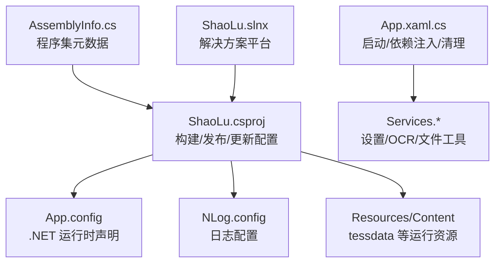
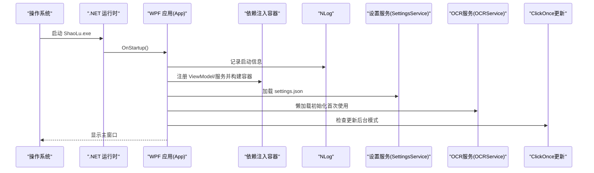
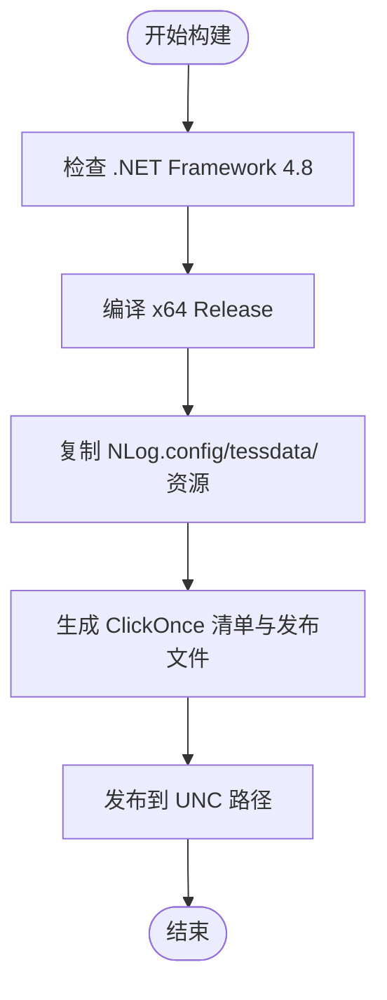
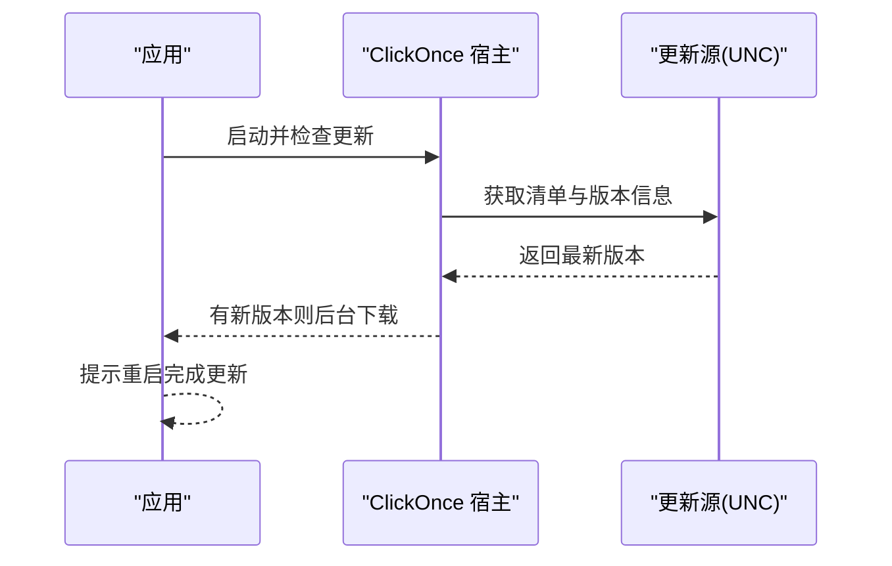
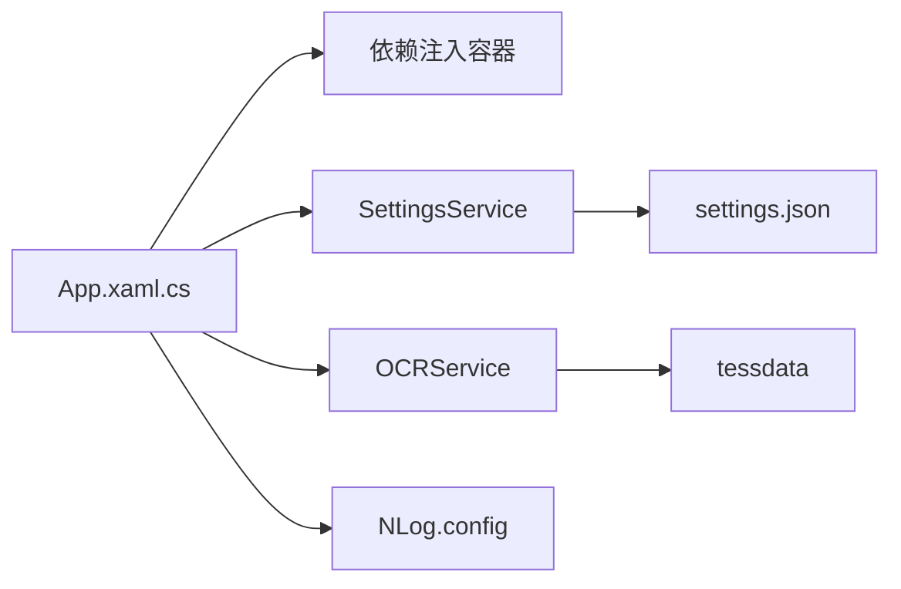

# 部署指南

<cite>
**本文引用的文件**   
- [ShaoLu.csproj](file://ShaoLu/ShaoLu.csproj)
- [App.config](file://ShaoLu/App.config)
- [NLog.config](file://ShaoLu/NLog.config)
- [App.xaml.cs](file://ShaoLu/App.xaml.cs)
- [AssemblyInfo.cs](file://ShaoLu/Properties/AssemblyInfo.cs)
- [SettingsService.cs](file://ShaoLu/Services/SettingsService.cs)
- [OCRService.cs](file://ShaoLu/Services/OCRService.cs)
- [Services.cs](file://ShaoLu/Services/Services.cs)
- [ShaoLu.slnx](file://ShaoLu.slnx)
</cite>

## 目录
1. [简介](#简介)
2. [项目结构](#项目结构)
3. [核心组件](#核心组件)
4. [架构总览](#架构总览)
5. [详细组件分析](#详细组件分析)
6. [依赖关系分析](#依赖关系分析)
7. [性能考虑](#性能考虑)
8. [故障排查指南](#故障排查指南)
9. [结论](#结论)
10. [附录](#附录)

## 简介
本指南面向 ShaoLu（基于 WPF 的桌面自动化工具）的部署与发布，覆盖以下内容：
- 应用程序打包配置：.NET Framework 依赖、第三方库集成、配置文件处理
- 安装程序创建、安装包制作与分发方式
- 配置文件管理：App.config 与 NLog.config 的设置项说明
- 更新机制：版本检查与自动更新流程
- 部署环境准备：目标机器系统要求与依赖项检查
- 生产环境最佳实践：性能调优、日志配置与安全设置

## 项目结构
ShaoLu 为 .NET Framework 4.8 的 WPF 应用，采用 MSBuild + NuGet 包管理，支持 ClickOnce 发布与后台更新。关键结构与职责：
- ShaoLu.csproj：构建、发布、更新、资源与内容文件复制规则
- App.config：运行时框架声明
- NLog.config：日志输出目标与规则
- App.xaml.cs：应用启动、服务注册、初始化与清理
- Services.*：设置持久化、OCR 引擎、文件与路径工具等
- Properties/AssemblyInfo.cs：程序集元数据与版本信息
- ShaoLu.slnx：解决方案平台配置（AnyCPU/x64）

图表来源
- [ShaoLu.csproj:1-120](file://ShaoLu/ShaoLu.csproj#L1-L120)
- [App.config:1-6](file://ShaoLu/App.config#L1-L6)
- [NLog.config:1-20](file://ShaoLu/NLog.config#L1-L20)
- [App.xaml.cs:1-86](file://ShaoLu/App.xaml.cs#L1-L86)
- [AssemblyInfo.cs:1-53](file://ShaoLu/Properties/AssemblyInfo.cs#L1-L53)
- [ShaoLu.slnx:1-11](file://ShaoLu.slnx#L1-L11)

章节来源
- [ShaoLu.csproj:1-120](file://ShaoLu/ShaoLu.csproj#L1-L120)
- [App.config:1-6](file://ShaoLu/App.config#L1-L6)
- [NLog.config:1-20](file://ShaoLu/NLog.config#L1-L20)
- [App.xaml.cs:1-86](file://ShaoLu/App.xaml.cs#L1-L86)
- [AssemblyInfo.cs:1-53](file://ShaoLu/Properties/AssemblyInfo.cs#L1-L53)
- [ShaoLu.slnx:1-11](file://ShaoLu.slnx#L1-L11)

## 核心组件
- 构建与发布（ClickOnce）
  - 目标框架：.NET Framework 4.8
  - 平台：x64（RuntimeIdentifiers=win-x64）
  - 输出类型：WinExe
  - 自动重定向绑定：启用
  - 清单生成：启用；签名：关闭（可开启以增强安全）
  - 引导程序：启用，包含 .NET Framework 4.8 引导包
  - 更新：启用，后台模式，按天检查
  - 发布位置与更新地址：UNC 路径（示例为内部共享路径）
- 运行时依赖
  - OpenCvSharp4（含 runtime.win.slim）
  - TesseractOCR（语言包 tessdata 需随应用发布）
  - EPPlus、FreeSql.Provider.Sqlite、InputSimulator、NLog、System.Drawing.Common、WPFLocalizeExtension 等
- 配置文件
  - App.config：声明支持的运行时版本
  - NLog.config：异步文件与控制台日志，按日期命名
- 设置与数据
  - settings.json：用户与应用设置（由 SettingsService 读写）
  - OCR 引擎：懒加载，首次调用初始化，读取 tessdata 目录

章节来源
- [ShaoLu.csproj:27-120](file://ShaoLu/ShaoLu.csproj#L27-L120)
- [ShaoLu.csproj:358-413](file://ShaoLu/ShaoLu.csproj#L358-L413)
- [ShaoLu.csproj:420-433](file://ShaoLu/ShaoLu.csproj#L420-L433)
- [App.config:1-6](file://ShaoLu/App.config#L1-L6)
- [NLog.config:1-20](file://ShaoLu/NLog.config#L1-L20)
- [SettingsService.cs:1-38](file://ShaoLu/Services/SettingsService.cs#L1-L38)
- [OCRService.cs:1-38](file://ShaoLu/Services/OCRService.cs#L1-L38)

## 架构总览
下图展示从应用启动到服务初始化、日志与设置加载的关键流程，以及 ClickOnce 更新检查点。

图表来源
- [App.xaml.cs:18-65](file://ShaoLu/App.xaml.cs#L18-L65)
- [SettingsService.cs:20-37](file://ShaoLu/Services/SettingsService.cs#L20-L37)
- [OCRService.cs:21-38](file://ShaoLu/Services/OCRService.cs#L21-L38)
- [ShaoLu.csproj:9-17](file://ShaoLu/ShaoLu.csproj#L9-L17)

## 详细组件分析

### 构建与发布配置（ShaoLu.csproj）
- 框架与平台
  - TargetFrameworkVersion=v4.8
  - RuntimeIdentifiers=win-x64，PlatformTarget=x64（Release/Debug）
- 发布与更新
  - PublishUrl/UpdateUrl：UNC 共享路径（用于发布与更新源）
  - UpdateEnabled=true，UpdateMode=Background，UpdateInterval=7 Days
  - ApplicationVersion 使用通配修订号，AssemblyVersion 固定
- 资源与内容
  - tessdata/** 复制到输出目录（OCR 语言包）
  - NLog.config 复制到输出目录
  - 图标与文件关联（.autostep）
- 依赖项
  - NuGet 包引用（OpenCvSharp4.runtime.win.slim、TesseractOCR、EPPlus、NLog 等）
  - BootstrapperPackage 包含 .NET Framework 4.8

图表来源
- [ShaoLu.csproj:27-120](file://ShaoLu/ShaoLu.csproj#L27-L120)
- [ShaoLu.csproj:358-413](file://ShaoLu/ShaoLu.csproj#L358-L413)
- [ShaoLu.csproj:420-433](file://ShaoLu/ShaoLu.csproj#L420-L433)

章节来源
- [ShaoLu.csproj:27-120](file://ShaoLu/ShaoLu.csproj#L27-L120)
- [ShaoLu.csproj:358-413](file://ShaoLu/ShaoLu.csproj#L358-L413)
- [ShaoLu.csproj:420-433](file://ShaoLu/ShaoLu.csproj#L420-L433)

### 运行时依赖与第三方库集成
- .NET Framework 4.8：通过 App.config 声明，Bootstrapper 自动安装
- OpenCvSharp4：runtime.win.slim 提供原生依赖，无需额外安装
- TesseractOCR：需 tessdata 目录（中文+英文），由项目内容复制到输出目录
- EPPlus：Excel 操作，需在启动时设置许可（已在 App.xaml.cs 中设置）
- NLog：异步文件与控制台输出，按日期滚动
- System.Drawing.Common：GDI+ 功能（Windows 专用）

章节来源
- [App.config:1-6](file://ShaoLu/App.config#L1-L6)
- [ShaoLu.csproj:358-413](file://ShaoLu/ShaoLu.csproj#L358-L413)
- [OCRService.cs:21-38](file://ShaoLu/Services/OCRService.cs#L21-L38)
- [App.xaml.cs:49-52](file://ShaoLu/App.xaml.cs#L49-L52)

### 配置文件管理（App.config 与 NLog.config）
- App.config
  - supportedRuntime：指定 v4.0/.NET Framework 4.8
- NLog.config
  - autoReload=true：热重载配置
  - targets：异步 File（按短日期命名）与 Console
  - rules：最低级别 Debug，写入 logfile 与 logconsole

章节来源
- [App.config:1-6](file://ShaoLu/App.config#L1-L6)
- [NLog.config:1-20](file://ShaoLu/NLog.config#L1-L20)

### 设置与数据持久化（settings.json）
- 存储位置：应用根目录下的 settings.json
- 读写接口：SettingsService.LoadAsync/SaveAsync
- 数据结构：AppSettings（App/Step/UserSettings）

章节来源
- [SettingsService.cs:1-38](file://ShaoLu/Services/SettingsService.cs#L1-L38)
- [Services.cs:83-140](file://ShaoLu/Services/Services.cs#L83-L140)

### 更新机制（ClickOnce 自动更新）
- 配置项
  - UpdateEnabled=true
  - UpdateMode=Background（后台检查）
  - UpdateInterval=7 Days
  - UpdateUrl：UNC 共享路径
- 行为
  - 应用启动后按周期检查新版本
  - 发现新版本后在后台下载并提示重启更新

图表来源
- [ShaoLu.csproj:9-17](file://ShaoLu/ShaoLu.csproj#L9-L17)

章节来源
- [ShaoLu.csproj:9-17](file://ShaoLu/ShaoLu.csproj#L9-L17)

### 安装程序与安装包制作
- 使用 Visual Studio 内置 ClickOnce 发布
- 引导程序：包含 .NET Framework 4.8 安装器
- 发布目标：UNC 共享路径（便于内部分发）
- 桌面快捷方式：启用
- 清单签名：当前关闭，建议生产环境启用以增强可信度

章节来源
- [ShaoLu.csproj:23-26](file://ShaoLu/ShaoLu.csproj#L23-L26)
- [ShaoLu.csproj:84-94](file://ShaoLu/ShaoLu.csproj#L84-L94)
- [ShaoLu.csproj:403-413](file://ShaoLu/ShaoLu.csproj#L403-L413)

### 部署环境准备与依赖检查
- 操作系统：Windows（x64）
- 运行时：.NET Framework 4.8（可通过引导程序安装）
- 必需文件：
  - ShaoLu.exe 及依赖 DLL
  - NLog.config
  - tessdata（OCR 语言包）
  - settings.json（首次运行自动生成）
- 权限：
  - 对应用目录具有读写权限（用于 logs、settings.json、执行日志）
  - 屏幕截图与输入模拟需要前台交互权限

章节来源
- [ShaoLu.csproj:420-433](file://ShaoLu/ShaoLu.csproj#L420-L433)
- [NLog.config:1-20](file://ShaoLu/NLog.config#L1-L20)
- [SettingsService.cs:1-38](file://ShaoLu/Services/SettingsService.cs#L1-L38)

### 生产环境最佳实践
- 性能调优
  - 使用 Release|x64 构建，优化已启用
  - 控制 OCR 区域大小以减少识别耗时
  - 合理设置步骤等待时间与超时参数
- 日志配置
  - 生产环境可将 NLog 最低级别调整为 Info/Warn，减少磁盘 IO
  - 定期清理过期日志（通过设置中的保留天数）
- 安全设置
  - 启用清单签名（SignManifests=true）并使用受信任证书
  - 限制 UNC 更新源的访问权限，仅允许只读
  - 最小化应用目录写权限，避免被恶意篡改

章节来源
- [ShaoLu.csproj:53-82](file://ShaoLu/ShaoLu.csproj#L53-L82)
- [NLog.config:1-20](file://ShaoLu/NLog.config#L1-L20)
- [SettingsService.cs:20-37](file://ShaoLu/Services/SettingsService.cs#L20-L37)
- [ShaoLu.csproj:84-94](file://ShaoLu/ShaoLu.csproj#L84-L94)

## 依赖关系分析
- 外部依赖
  - .NET Framework 4.8（运行时）
  - OpenCvSharp4（含原生运行时）
  - TesseractOCR（语言包 tessdata）
  - EPPlus、NLog、System.Drawing.Common 等
- 内部模块
  - App.xaml.cs：启动、依赖注入、清理
  - Services.SettingsService：设置持久化
  - Services.OCRService：OCR 引擎初始化与调用
  - Services.Services：文件与路径工具

图表来源
- [App.xaml.cs:18-65](file://ShaoLu/App.xaml.cs#L18-L65)
- [SettingsService.cs:20-37](file://ShaoLu/Services/SettingsService.cs#L20-L37)
- [OCRService.cs:21-38](file://ShaoLu/Services/OCRService.cs#L21-L38)
- [NLog.config:1-20](file://ShaoLu/NLog.config#L1-L20)

章节来源
- [App.xaml.cs:18-65](file://ShaoLu/App.xaml.cs#L18-L65)
- [SettingsService.cs:20-37](file://ShaoLu/Services/SettingsService.cs#L20-L37)
- [OCRService.cs:21-38](file://ShaoLu/Services/OCRService.cs#L21-L38)
- [NLog.config:1-20](file://ShaoLu/NLog.config#L1-L20)

## 性能考虑
- 构建优化：Release 模式已启用优化，确保使用 x64 平台
- OCR 性能：裁剪区域越小越快；必要时禁用非必要的 OCR 步骤
- 日志 IO：生产环境降低日志级别或调整异步写入策略
- 内存管理：退出时释放图像识别相关资源（已在 OnExit 中实现）

章节来源
- [ShaoLu.csproj:53-82](file://ShaoLu/ShaoLu.csproj#L53-L82)
- [App.xaml.cs:66-83](file://ShaoLu/App.xaml.cs#L66-L83)

## 故障排查指南
- 无法启动
  - 检查是否安装 .NET Framework 4.8
  - 查看 NLog 日志（logs 目录下按日期命名的文件）
- OCR 失败
  - 确认 tessdata 目录存在且包含 chi_sim+eng 语言包
  - 检查 OCRService 初始化异常日志
- 设置未保存
  - 确认应用目录有写权限
  - 检查 settings.json 是否存在与可读
- 更新失败
  - 检查 UNC 更新源可达性与权限
  - 查看 ClickOnce 更新日志与应用事件日志

章节来源
- [NLog.config:1-20](file://ShaoLu/NLog.config#L1-L20)
- [OCRService.cs:21-38](file://ShaoLu/Services/OCRService.cs#L21-L38)
- [SettingsService.cs:20-37](file://ShaoLu/Services/SettingsService.cs#L20-L37)
- [ShaoLu.csproj:9-17](file://ShaoLu/ShaoLu.csproj#L9-L17)

## 结论
ShaoLu 采用成熟的 .NET Framework 4.8 + WPF 技术栈，结合 ClickOnce 发布与后台更新机制，配合 NLog 与 settings.json 实现灵活的日志与配置管理。生产部署需确保运行时与依赖完整、权限正确，并通过清单签名与最小权限原则提升安全性。通过合理的性能调优与日志策略，可在稳定运行的同时获得良好的用户体验。

## 附录
- 解决方案平台：AnyCPU 与 x64（默认使用 x64）
- 程序集版本：AssemblyVersion 固定，ApplicationVersion 使用通配修订号
- 文件关联：.autostep 步骤文件关联至应用图标

章节来源
- [ShaoLu.slnx:1-11](file://ShaoLu.slnx#L1-L11)
- [AssemblyInfo.cs:44-53](file://ShaoLu/Properties/AssemblyInfo.cs#L44-L53)
- [ShaoLu.csproj:425-433](file://ShaoLu/ShaoLu.csproj#L425-L433)