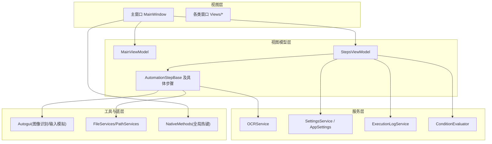
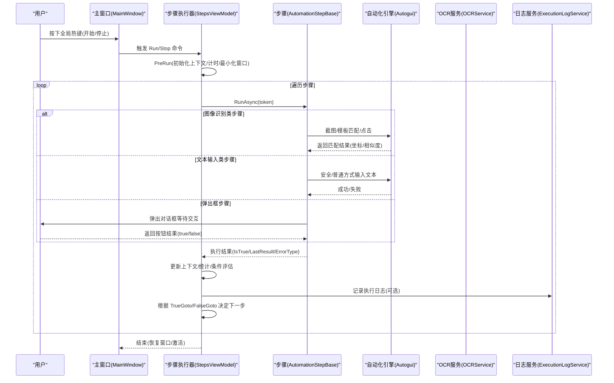
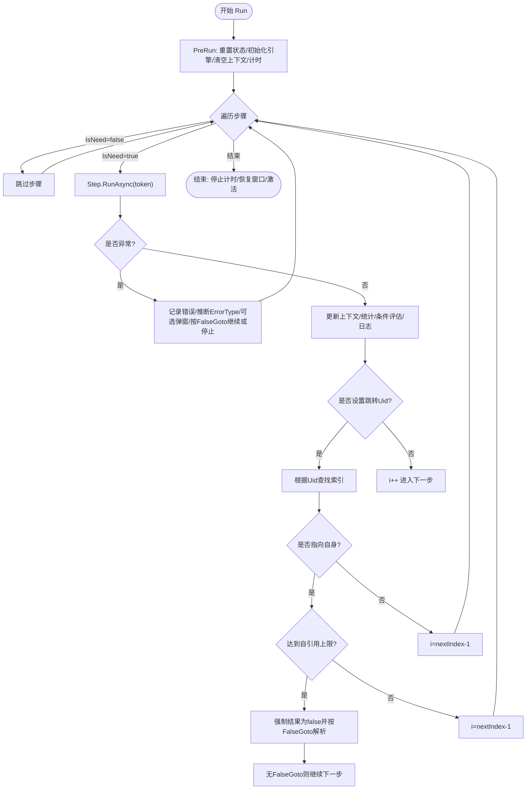
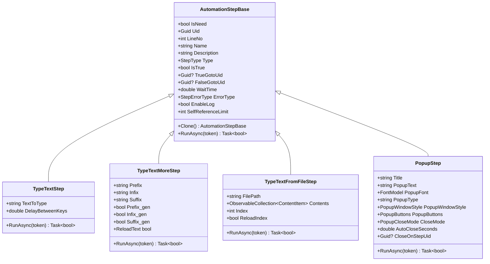
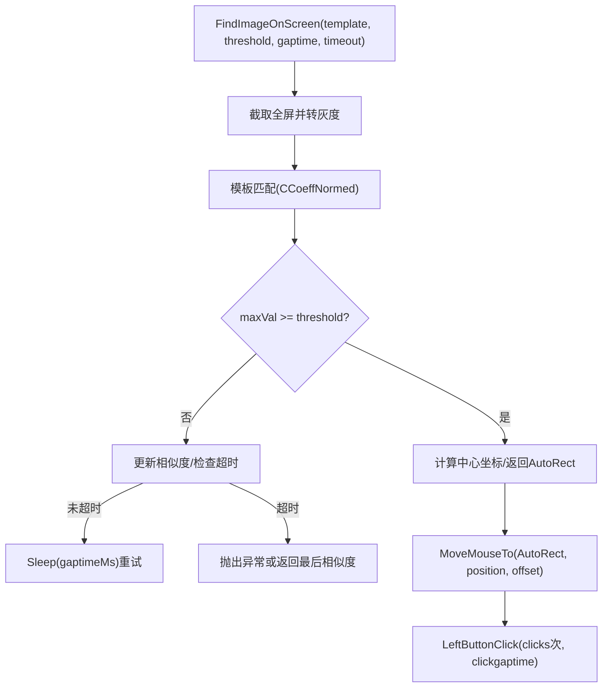
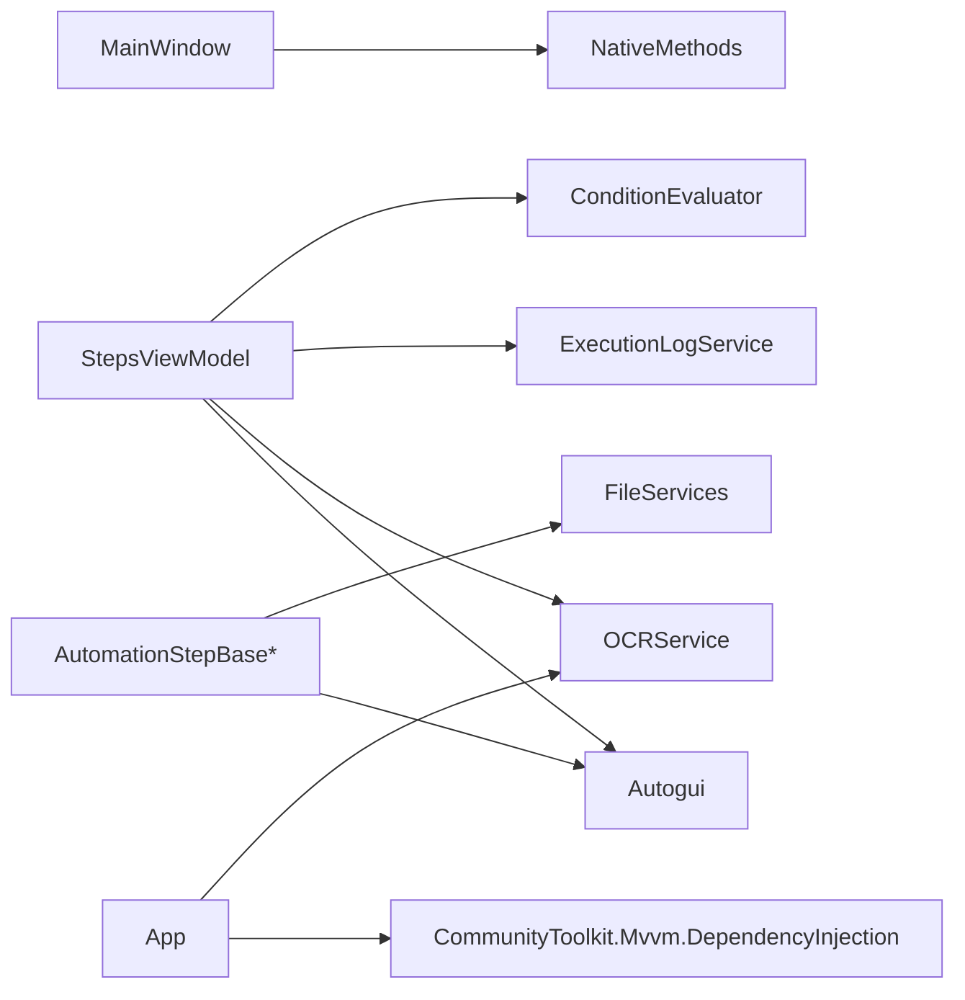

# 项目概述

<cite>
**本文引用的文件**   
- [Readme.md](file://Readme.md)
- [App.xaml.cs](file://ShaoLu/App.xaml.cs)
- [MainWindow.xaml.cs](file://ShaoLu/MainWindow.xaml.cs)
- [StepsViewModel.cs](file://ShaoLu/Viewmodels/StepsViewModel.cs)
- [AutomationStep.cs](file://ShaoLu/Viewmodels/AutomationStep.cs)
- [Autogui.cs](file://ShaoLu/Utils/Autogui.cs)
- [OCRService.cs](file://ShaoLu/services/OCRService.cs)
- [Settings.cs](file://ShaoLu/Models/Settings.cs)
- [Services.cs](file://ShaoLu/Services/Services.cs)
- [ShaoLu.csproj](file://ShaoLu/ShaoLu.csproj)
</cite>

## 目录
1. [简介](#简介)
2. [项目结构](#项目结构)
3. [核心组件](#核心组件)
4. [架构总览](#架构总览)
5. [详细组件分析](#详细组件分析)
6. [依赖关系分析](#依赖关系分析)
7. [性能考量](#性能考量)
8. [故障排查指南](#故障排查指南)
9. [结论](#结论)
10. [附录：快速开始](#附录快速开始)

## 简介
ShaoLu（烧录）是一款基于 WPF 的桌面自动化工具，通过图像识别与模拟输入实现 GUI 自动化操作。其核心价值在于“可视化编排 + 图像识别 + 流程控制”，让非专业用户也能快速搭建稳定的桌面自动化流程，同时为开发者提供可扩展的步骤模型与服务接口。

- 核心目标
  - 以“步骤”为单位编排自动化流程，支持条件跳转、循环与人工干预。
  - 通过模板匹配进行屏幕图像识别，定位并点击目标元素。
  - 提供 OCR 能力，辅助文本识别与校验。
  - 提供统一的执行上下文、日志与统计，便于排错与监控。

- 适用场景
  - 重复性高、界面相对稳定的桌面应用或系统操作的自动化。
  - 需要人机协同确认的半自动化流程（弹窗交互）。
  - 批量数据录入、报表生成、跨窗口联动等任务。

- 设计理念
  - 低门槛：图形化步骤编辑与参数配置，开箱即用。
  - 强扩展：步骤类型可插拔，服务层解耦，便于二次开发。
  - 稳健性：完善的异常处理、超时控制、自引用限制与执行上下文。

**章节来源**
- [Readme.md:1-283](file://Readme.md#L1-L283)

## 项目结构
ShaoLu 采用典型的 WPF 分层组织：
- 视图层（Views）：各类窗口与用户控件，承载 UI 交互。
- 视图模型（Viewmodels）：MVVM 的数据与命令绑定，协调业务逻辑。
- 服务层（Services）：OCR、语言、设置、执行日志、条件评估等通用服务。
- 工具与底层（Utils/Tools）：屏幕截图、鼠标键盘模拟、图像处理、OCR 封装、热键注册等。
- 模型（Models）：步骤类型枚举、错误类型、设置项、执行结果等数据结构。
- 资源与主题（Resources/Themes/Templates）：多语言、样式、模板。

**图表来源**
- [MainWindow.xaml.cs:1-376](file://ShaoLu/MainWindow.xaml.cs#L1-L376)
- [StepsViewModel.cs:1-747](file://ShaoLu/Viewmodels/StepsViewModel.cs#L1-L747)
- [AutomationStep.cs:1-800](file://ShaoLu/Viewmodels/AutomationStep.cs#L1-L800)
- [Autogui.cs:1-656](file://ShaoLu/Utils/Autogui.cs#L1-L656)
- [OCRService.cs:1-159](file://ShaoLu/services/OCRService.cs#L1-L159)
- [Settings.cs:1-117](file://ShaoLu/Models/Settings.cs#L1-L117)
- [Services.cs:1-179](file://ShaoLu/Services/Services.cs#L1-L179)

**章节来源**
- [ShaoLu.csproj:1-491](file://ShaoLu/ShaoLu.csproj#L1-L491)

## 核心组件
- 启动与生命周期（App）
  - 初始化语言、依赖注入容器、清理过期日志、缓存 DPI、显示主窗口。
  - 全局异常兜底，确保程序健壮性。
- 主窗口（MainWindow）
  - 注册全局热键（开始/停止），处理打开/保存步骤包、登录状态、设置与日志窗口。
- 步骤执行器（StepsViewModel）
  - 维护步骤集合、运行/暂停/停止、条件跳转、自引用检测、执行上下文与统计。
- 步骤模型（AutomationStepBase 及派生类）
  - 统一抽象 RunAsync、Clone、条件判断、日志开关、错误类型等；派生类实现具体行为（如图片识别、文字输入、弹出框等）。
- 自动化引擎（Autogui）
  - 屏幕截图、模板匹配、鼠标移动与点击、文本输入（安全模式）、字符串递增算法。
- OCR 服务（OCRService）
  - Tesseract 引擎懒加载、DPI 缓存、区域截图识别。
- 设置与文件服务（Settings/Services）
  - 应用与步骤默认参数、覆盖层配置、路径对话框、智能文本编码读取、延迟删除提交。

**章节来源**
- [App.xaml.cs:1-112](file://ShaoLu/App.xaml.cs#L1-L112)
- [MainWindow.xaml.cs:1-376](file://ShaoLu/MainWindow.xaml.cs#L1-L376)
- [StepsViewModel.cs:1-747](file://ShaoLu/Viewmodels/StepsViewModel.cs#L1-L747)
- [AutomationStep.cs:1-800](file://ShaoLu/Viewmodels/AutomationStep.cs#L1-L800)
- [Autogui.cs:1-656](file://ShaoLu/Utils/Autogui.cs#L1-L656)
- [OCRService.cs:1-159](file://ShaoLu/services/OCRService.cs#L1-L159)
- [Settings.cs:1-117](file://ShaoLu/Models/Settings.cs#L1-L117)
- [Services.cs:1-179](file://ShaoLu/Services/Services.cs#L1-L179)

## 架构总览
ShaoLu 采用 MVVM + 依赖注入 + 服务解耦的分层架构：
- 视图层仅负责展示与用户交互，业务逻辑下沉至 ViewModel。
- 步骤模型作为最小执行单元，通过统一接口被调度器驱动。
- 服务层提供 OCR、日志、设置、条件评估等横切能力。
- 工具层屏蔽平台差异（Win32、GDI+、OpenCV、Tesseract）。

**图表来源**
- [MainWindow.xaml.cs:1-376](file://ShaoLu/MainWindow.xaml.cs#L1-L376)
- [StepsViewModel.cs:1-747](file://ShaoLu/Viewmodels/StepsViewModel.cs#L1-L747)
- [AutomationStep.cs:1-800](file://ShaoLu/Viewmodels/AutomationStep.cs#L1-L800)
- [Autogui.cs:1-656](file://ShaoLu/Utils/Autogui.cs#L1-L656)
- [OCRService.cs:1-159](file://ShaoLu/services/OCRService.cs#L1-L159)

## 详细组件分析

### 步骤执行器（StepsViewModel）
- 职责
  - 管理步骤集合与选中项，提供增删改查、复制粘贴、排序。
  - 驱动执行循环，支持暂停/停止、取消令牌、超时控制。
  - 维护执行上下文（当前步骤、结果映射、计时器），统计条件计数。
  - 处理自定义条件评估与自引用限制，避免死循环。
- 关键流程
  - Run：PreRun → 循环执行 → 捕获异常 → 计算下一步索引 → 结束收尾。
  - Stop：置位停止信号并取消任务。
  - CheckAndCloseStepReachedPopups：到达指定步骤时关闭活跃弹窗。

**图表来源**
- [StepsViewModel.cs:1-747](file://ShaoLu/Viewmodels/StepsViewModel.cs#L1-L747)

**章节来源**
- [StepsViewModel.cs:1-747](file://ShaoLu/Viewmodels/StepsViewModel.cs#L1-L747)

### 步骤模型（AutomationStepBase 及派生类）
- 基类特性
  - 统一属性：名称、描述、行号、启用、等待时间、跳转Uid、错误类型、日志开关、自引用限制等。
  - 统一接口：Clone、RunAsync、Run。
  - 条件判断：支持默认与自定义规则，结合执行上下文与上一步结果。
- 典型派生类
  - TypeTextStep：按键间隔控制，支持安全模式（剪贴板粘贴）。
  - TypeTextMoreStep：前缀/中间/后缀组合，支持递增算法。
  - TypeTextFromFileStep：从 txt/csv/xlsx 逐行读取并输入。
  - PopupStep：多种关闭模式（按钮/超时/到达步骤），支持位置与背景色配置。
  - 图像识别类（ClickImage/FindImage/ClickImages/FindImages）：由 Autogui 完成匹配与点击。

**图表来源**
- [AutomationStep.cs:1-800](file://ShaoLu/Viewmodels/AutomationStep.cs#L1-L800)

**章节来源**
- [AutomationStep.cs:1-800](file://ShaoLu/Viewmodels/AutomationStep.cs#L1-L800)

### 自动化引擎（Autogui）
- 功能要点
  - 屏幕截图与灰度转换，模板匹配（CCoeffNormed），返回中心点与相似度。
  - 鼠标移动与点击，支持锚点（中心/四角）与偏移量。
  - 文本输入：普通模式与剪贴板安全模式（兼容不同焦点控件）。
  - 字符串递增：数字/字母后缀递增，固定位数回绕。
- 性能与安全
  - 使用 Stopwatch 精确计时，避免频繁对象创建。
  - 剪贴板操作在 STA 线程执行，异常保护与恢复原始内容。

**图表来源**
- [Autogui.cs:1-656](file://ShaoLu/Utils/Autogui.cs#L1-L656)

**章节来源**
- [Autogui.cs:1-656](file://ShaoLu/Utils/Autogui.cs#L1-L656)

### OCR 服务（OCRService）
- 功能要点
  - 懒加载 Tesseract 引擎，支持多语言训练数据。
  - 缓存 DPI 缩放因子，避免后台线程访问 WPF 对象。
  - 区域截图识别，返回文本。
- 使用建议
  - 首次调用 Init 会加载 tessdata，确保输出目录包含对应语言包。
  - RecognizeRegion 传入 WPF Rect，内部转换为物理像素。

**章节来源**
- [OCRService.cs:1-159](file://ShaoLu/services/OCRService.cs#L1-L159)

### 设置与文件服务（Settings/Services）
- 设置项
  - 窗口尺寸、字体、日志保留天数、步骤默认参数、覆盖层颜色与时长、全局热键。
- 文件服务
  - 路径对话框、相对路径计算、智能文本编码读取（BOM优先，否则启发式检测）。
  - 延迟删除标记与提交，避免文件占用导致删除失败。

**章节来源**
- [Settings.cs:1-117](file://ShaoLu/Models/Settings.cs#L1-L117)
- [Services.cs:1-179](file://ShaoLu/Services/Services.cs#L1-L179)

## 依赖关系分析
- 外部库
  - OpenCvSharp：图像模板匹配与处理。
  - TesseractOCR：OCR 识别。
  - WindowsInput：鼠标键盘模拟。
  - EPPlus：Excel 读写。
  - NLog：日志记录。
  - CommunityToolkit.Mvvm：MVVM 基础与 DI。
- 内部依赖
  - MainWindow 依赖 NativeMethods 注册全局热键。
  - StepsViewModel 依赖 Autogui、OCRService、ExecutionLogService、ConditionEvaluator、SingletonLocator。
  - 各步骤依赖 Autogui 与 FileServices。

**图表来源**
- [MainWindow.xaml.cs:1-376](file://ShaoLu/MainWindow.xaml.cs#L1-L376)
- [StepsViewModel.cs:1-747](file://ShaoLu/Viewmodels/StepsViewModel.cs#L1-L747)
- [AutomationStep.cs:1-800](file://ShaoLu/Viewmodels/AutomationStep.cs#L1-L800)
- [Autogui.cs:1-656](file://ShaoLu/Utils/Autogui.cs#L1-L656)
- [OCRService.cs:1-159](file://ShaoLu/services/OCRService.cs#L1-L159)
- [App.xaml.cs:1-112](file://ShaoLu/App.xaml.cs#L1-L112)

**章节来源**
- [ShaoLu.csproj:1-491](file://ShaoLu/ShaoLu.csproj#L1-L491)

## 性能考量
- 图像识别
  - 模板匹配在每帧进行，建议裁剪识别区域以提高速度与准确率。
  - 合理设置阈值与超时，避免长时间轮询。
- 文本输入
  - 安全模式（剪贴板）兼容性更好但较慢，纯英文/数字可适当降低间隔提升速度。
- 资源管理
  - OCR 引擎懒加载，避免启动开销；DPI 缓存减少重复计算。
  - 文件延迟删除，避免占用冲突。
- 执行控制
  - 暂停/停止与取消令牌保证响应性；自引用限制防止死循环。

[本节为通用指导，不直接分析具体文件]

## 故障排查指南
- 常见问题
  - 图像未找到：检查模板图片质量、相似度阈值、超时设置与屏幕分辨率/DPI。
  - 文本输入失败：切换安全模式、调整按键间隔、确认焦点控件支持粘贴。
  - 弹窗未关闭：检查 CloseMode 与 CloseOnStepUid 配置，确保到达步骤正确。
  - 自引用死循环：调整 SelfReferenceLimit，确保 FalseGoto 分支有效。
- 日志与诊断
  - 开启步骤日志，查看执行时间与相似度。
  - 使用覆盖层可视化识别区域与点击位置，辅助定位问题。
  - 查看 ExecutionLog 窗口与 NLog 输出，定位异常堆栈。

**章节来源**
- [StepsViewModel.cs:1-747](file://ShaoLu/Viewmodels/StepsViewModel.cs#L1-L747)
- [Autogui.cs:1-656](file://ShaoLu/Utils/Autogui.cs#L1-L656)
- [OCRService.cs:1-159](file://ShaoLu/services/OCRService.cs#L1-L159)

## 结论
ShaoLu 将“步骤化编排 + 图像识别 + OCR + 输入模拟”整合为易用的桌面自动化工具。其清晰的 MVVM 架构与解耦的服务层，既满足非专业用户的快速上手需求，也为开发者提供了良好的扩展点。通过合理的参数调优与覆盖层调试，可在复杂场景中稳定运行。

[本节为总结，不直接分析具体文件]

## 附录：快速开始
- 安装与启动
  - 确保 .NET Framework 4.8 已安装，运行 ShaoLu.exe。
  - 首次启动会自动初始化语言、依赖注入与 DPI 缓存。
- 创建第一个自动化流程
  - 在主界面添加步骤（如 ClickImage/FindImage/TypeText）。
  - 为图像步骤选择模板图片，必要时打开“图片编辑窗口”裁剪识别区域与设置点击点。
  - 配置等待时间、相似度阈值、超时与跳转规则。
- 运行与调试
  - 使用全局热键 Ctrl+Alt+F9 开始，Ctrl+Alt+F10 停止。
  - 开启覆盖层与日志，观察识别区域与点击位置，逐步优化参数。
- 保存与分享
  - 保存为 .autostep 包（含图片工作目录），便于团队协作与版本管理。

**章节来源**
- [Readme.md:1-283](file://Readme.md#L1-L283)
- [MainWindow.xaml.cs:1-376](file://ShaoLu/MainWindow.xaml.cs#L1-L376)
- [StepsViewModel.cs:1-747](file://ShaoLu/Viewmodels/StepsViewModel.cs#L1-L747)