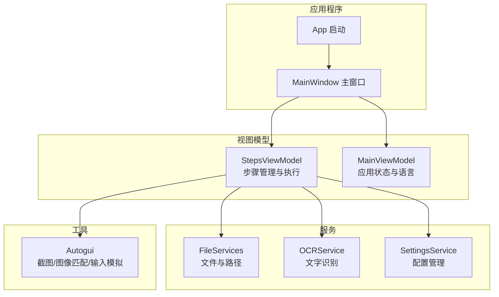
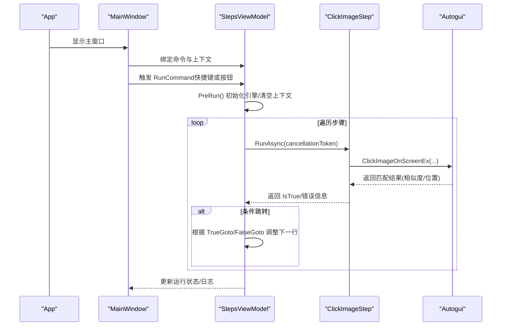
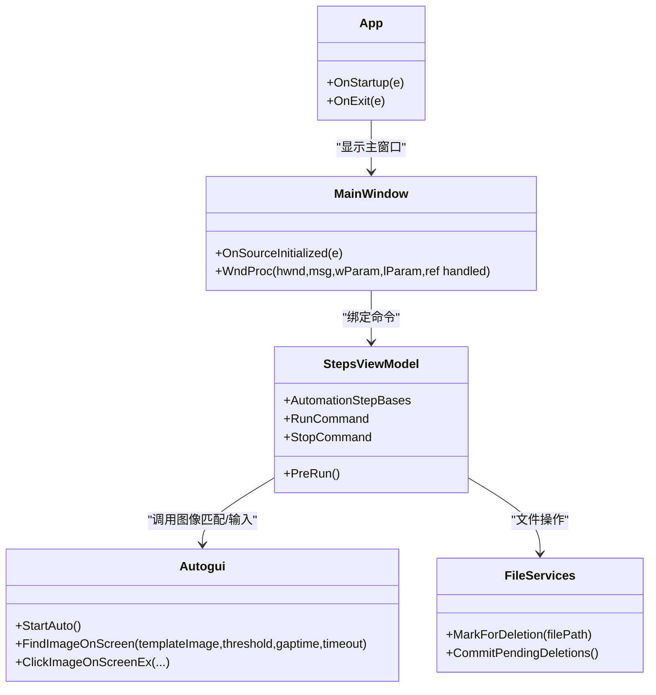

# 快速开始

<cite>
**本文引用的文件**   
- [Readme.md](file://Readme.md)
- [ShaoLu.csproj](file://ShaoLu/ShaoLu.csproj)
- [App.config](file://ShaoLu/App.config)
- [App.xaml.cs](file://ShaoLu/App.xaml.cs)
- [MainWindow.xaml.cs](file://ShaoLu/MainWindow.xaml.cs)
- [StepsViewModel.cs](file://ShaoLu/Viewmodels/StepsViewModel.cs)
- [Autogui.cs](file://ShaoLu/Utils/Autogui.cs)
- [ImageRecognition.cs](file://ShaoLu/Viewmodels/ImageRecognition.cs)
- [ImagesRecognition.cs](file://ShaoLu/Viewmodels/ImagesRecognition.cs)
- [Settings.cs](file://ShaoLu/Models/Settings.cs)
- [Services.cs](file://ShaoLu/Services/Services.cs)
</cite>

## 目录
1. [简介](#简介)
2. [项目结构](#项目结构)
3. [核心组件](#核心组件)
4. [架构总览](#架构总览)
5. [详细组件分析](#详细组件分析)
6. [依赖关系分析](#依赖关系分析)
7. [性能注意事项](#性能注意事项)
8. [故障排除指南](#故障排除指南)
9. [结论](#结论)
10. [附录](#附录)

## 简介
本快速开始指南面向首次使用 ShaoLu（烧录）的读者，帮助你在 5 分钟内完成环境搭建、项目克隆与编译，并创建第一个自动化流程。ShaoLu 是一款基于 WPF 的桌面自动化工具，通过图像识别和模拟输入实现 GUI 自动化操作。

## 项目结构
ShaoLu 采用 WPF + MVVM 架构，核心模块包括：
- 视图层（Views）：主窗口、设置、登录、执行日志等界面
- 视图模型（Viewmodels）：步骤管理、图像识别、OCR、用户管理等业务逻辑
- 服务（Services）：路径与文件、OCR、语言、设置、执行日志等
- 工具（Utils）：屏幕截图、图像匹配、鼠标键盘模拟、原生方法封装
- 模型（Models）：应用设置、步骤模型、执行结果、用户等数据实体
- 资源与主题（Resources/Themes/Templates）：多语言、样式、模板

图表来源
- [App.xaml.cs:18-58](file://ShaoLu/App.xaml.cs#L18-L58)
- [MainWindow.xaml.cs:77-101](file://ShaoLu/MainWindow.xaml.cs#L77-L101)
- [StepsViewModel.cs:114-140](file://ShaoLu/Viewmodels/StepsViewModel.cs#L114-L140)
- [Autogui.cs:43-46](file://ShaoLu/Utils/Autogui.cs#L43-L46)
- [Services.cs:83-140](file://ShaoLu/Services/Services.cs#L83-L140)

章节来源
- [ShaoLu.csproj:32-41](file://ShaoLu/ShaoLu.csproj#L32-L41)
- [App.config:1-6](file://ShaoLu/App.config#L1-L6)

## 核心组件
- 应用启动与依赖注入：在应用启动时初始化语言、注册 ViewModel 与服务、清理过期日志，并显示主窗口
- 主窗口与热键：注册全局快捷键用于运行/停止自动化流程；支持打开/保存步骤包与设置
- 步骤管理与执行：维护步骤集合、行号、执行上下文；提供运行/停止命令与条件跳转
- 图像识别与输入模拟：基于 OpenCV 进行模板匹配，结合 WindowsInput 模拟鼠标/键盘输入
- 文件与路径服务：统一文件对话框、相对路径计算、文本编码智能检测与待删除文件提交

章节来源
- [App.xaml.cs:18-58](file://ShaoLu/App.xaml.cs#L18-L58)
- [MainWindow.xaml.cs:28-74](file://ShaoLu/MainWindow.xaml.cs#L28-L74)
- [StepsViewModel.cs:170-200](file://ShaoLu/Viewmodels/StepsViewModel.cs#L170-L200)
- [Autogui.cs:59-122](file://ShaoLu/Utils/Autogui.cs#L59-L122)
- [Services.cs:11-36](file://ShaoLu/Services/Services.cs#L11-L36)

## 架构总览
下图展示了从启动到执行一个“点击识图”步骤的关键调用链：

图表来源
- [App.xaml.cs:54-58](file://ShaoLu/App.xaml.cs#L54-L58)
- [MainWindow.xaml.cs:44-53](file://ShaoLu/MainWindow.xaml.cs#L44-L53)
- [StepsViewModel.cs:363-388](file://ShaoLu/Viewmodels/StepsViewModel.cs#L363-L388)
- [ImageRecognition.cs:395-416](file://ShaoLu/Viewmodels/ImageRecognition.cs#L395-L416)
- [Autogui.cs:262-289](file://ShaoLu/Utils/Autogui.cs#L262-L289)

## 详细组件分析

### 环境搭建与系统要求
- 操作系统：Windows（WPF 应用）
- .NET Framework：4.8（x86 与 x64）
- Visual Studio：建议安装最新稳定版，确保包含 .NET 桌面开发工作负载
- 目标平台：x64（项目默认输出为 x64）
- 关键依赖库：OpenCvSharp4、TesseractOCR、EPPlus、InputSimulator、NLog、CommunityToolkit.Mvvm 等

章节来源
- [ShaoLu.csproj:34-41](file://ShaoLu/ShaoLu.csproj#L34-L41)
- [ShaoLu.csproj:358-401](file://ShaoLu/ShaoLu.csproj#L358-L401)
- [App.config:3-5](file://ShaoLu/App.config#L3-L5)

### 安装与配置步骤
- 安装 .NET Framework 4.8（x86 与 x64）
- 安装 Visual Studio 并启用 .NET 桌面开发
- 克隆仓库后，用 Visual Studio 打开解决方案
- 恢复 NuGet 包（构建前自动下载）
- 选择 Release|x64 或 Debug|x64 配置进行编译

章节来源
- [ShaoLu.csproj:403-412](file://ShaoLu/ShaoLu.csproj#L403-L412)
- [ShaoLu.csproj:358-401](file://ShaoLu/ShaoLu.csproj#L358-L401)

### 项目克隆与编译
- 使用 Git 克隆仓库
- 在 Visual Studio 中打开解决方案
- 首次构建会自动还原 NuGet 包
- 生成输出位于 bin\x64\Release 或 bin\x64\Debug

章节来源
- [ShaoLu.csproj:42-82](file://ShaoLu/ShaoLu.csproj#L42-L82)

### 基本使用教程（5 分钟上手）
- 启动程序后，在主界面通过步骤列表添加自动化步骤
- 每个步骤可设置名称、描述、启用/禁用、等待时间、条件跳转等通用属性
- 点击步骤旁的「编辑」按钮可展开详细参数配置
- 配置完成后点击「运行」开始执行自动化流程
- 快捷键：Ctrl+Alt+F9 运行；Ctrl+Alt+F10 停止

章节来源
- [Readme.md:7-13](file://Readme.md#L7-L13)
- [Settings.cs:66-68](file://ShaoLu/Models/Settings.cs#L66-L68)

### 创建第一个自动化流程（示例）
- 新建一个「点击识图」步骤，选择一张目标图片（如按钮截图）
- 点击「编辑」裁剪识别区域并设置点击点
- 设置相似度阈值（建议 0.8~0.95）、点击次数与间隔
- 保存步骤包（.autostep），运行验证是否成功点击

章节来源
- [Readme.md:19-40](file://Readme.md#L19-L40)
- [ImageRecognition.cs:395-416](file://ShaoLu/Viewmodels/ImageRecognition.cs#L395-L416)

### 添加图像识别步骤
- 支持单图查找与多图查找，支持点击与仅判断
- 可通过「如果真/如果假」跳转实现条件分支
- 支持 OCR 识别（在找到图片后对指定区域进行文字识别）

章节来源
- [Readme.md:42-103](file://Readme.md#L42-L103)
- [ImagesRecognition.cs:155-211](file://ShaoLu/Viewmodels/ImagesRecognition.cs#L155-L211)
- [ImageRecognition.cs:420-504](file://ShaoLu/Viewmodels/ImageRecognition.cs#L420-L504)

### 执行自动化任务
- 使用快捷键或按钮触发运行
- 运行前可选择最小化主窗口
- 执行过程中可随时停止
- 查看执行日志定位问题

章节来源
- [StepsViewModel.cs:363-388](file://ShaoLu/Viewmodels/StepsViewModel.cs#L363-L388)
- [MainWindow.xaml.cs:55-74](file://ShaoLu/MainWindow.xaml.cs#L55-L74)

## 依赖关系分析
- 应用启动阶段：初始化语言、注册依赖注入容器、清理过期日志、显示主窗口
- 主窗口阶段：注册全局热键、加载语言与字体、处理登录状态
- 步骤执行阶段：StepsViewModel 协调 Autogui 进行图像匹配与输入模拟，记录执行结果与日志

图表来源
- [App.xaml.cs:18-58](file://ShaoLu/App.xaml.cs#L18-L58)
- [MainWindow.xaml.cs:32-53](file://ShaoLu/MainWindow.xaml.cs#L32-L53)
- [StepsViewModel.cs:114-140](file://ShaoLu/Viewmodels/StepsViewModel.cs#L114-L140)
- [Autogui.cs:43-46](file://ShaoLu/Utils/Autogui.cs#L43-L46)
- [Services.cs:83-140](file://ShaoLu/Services/Services.cs#L83-L140)

章节来源
- [ShaoLu.csproj:101-129](file://ShaoLu/ShaoLu.csproj#L101-L129)

## 性能注意事项
- 图像匹配使用 OpenCV 模板匹配，建议在裁剪区域尽量精确以减少误匹配与耗时
- 超时与间隔参数需合理设置，避免频繁轮询导致 CPU 占用过高
- 批量多图查找时，注意顺序与阈值，必要时分步执行
- 输入模拟建议使用安全模式（按键间隔设为 0）提高兼容性，但速度可能较慢

章节来源
- [Autogui.cs:59-122](file://ShaoLu/Utils/Autogui.cs#L59-L122)
- [Readme.md:117-123](file://Readme.md#L117-L123)

## 故障排除指南
- 无法启动或运行时崩溃
  - 确认已安装 .NET Framework 4.8（x86 与 x64）
  - 检查 Visual Studio 是否安装了 .NET 桌面开发工作负载
  - 查看 NLog 日志定位异常堆栈
- 图像识别失败
  - 检查目标图片裁剪是否精确
  - 调整相似度阈值（建议 0.8~0.95）
  - 增加超时时间与查找间隔
- 输入无效或乱码
  - 检查输入焦点是否正确
  - 调整按键间隔或使用安全输入模式
  - 确认文本文件编码（UTF-8/BOM）
- 文件保存/打开失败
  - 检查路径权限与磁盘空间
  - 使用内置路径对话框避免路径错误

章节来源
- [App.xaml.cs:60-65](file://ShaoLu/App.xaml.cs#L60-L65)
- [Services.cs:142-175](file://ShaoLu/Services/Services.cs#L142-L175)
- [Readme.md:19-40](file://Readme.md#L19-L40)

## 结论
通过本快速开始指南，你应已完成 ShaoLu 的环境搭建、项目编译与第一个自动化流程的创建。建议进一步探索 OCR、条件跳转与批量输入等功能，以构建更复杂的自动化场景。遇到问题时，优先检查图像裁剪与阈值设置，并结合日志与提示信息进行排查。

## 附录
- 快捷键说明：Ctrl+Alt+F9 运行；Ctrl+Alt+F10 停止
- 步骤类型：点击识图、查找识图、多图点击、多图查找、输入文字、多次输入、从文件输入、弹出框、文本 OCR
- 通用属性：启用、名称、描述、等待时间、如果真、如果假

章节来源
- [Readme.md:7-13](file://Readme.md#L7-L13)
- [Readme.md:17-202](file://Readme.md#L17-L202)
- [Settings.cs:66-68](file://ShaoLu/Models/Settings.cs#L66-L68)