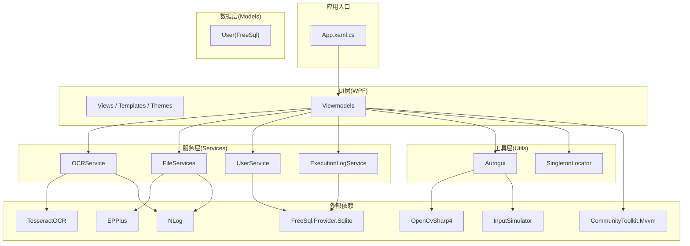
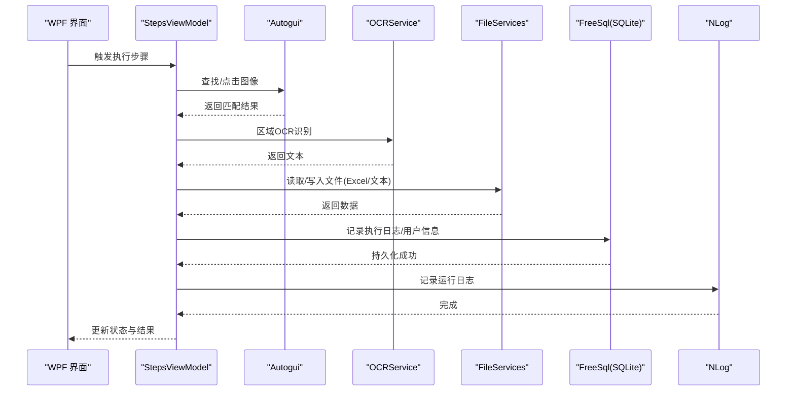
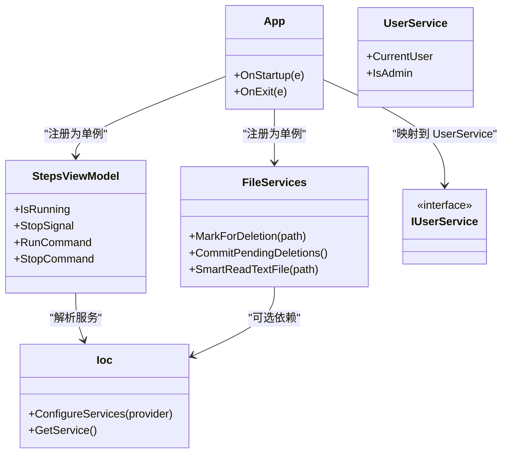
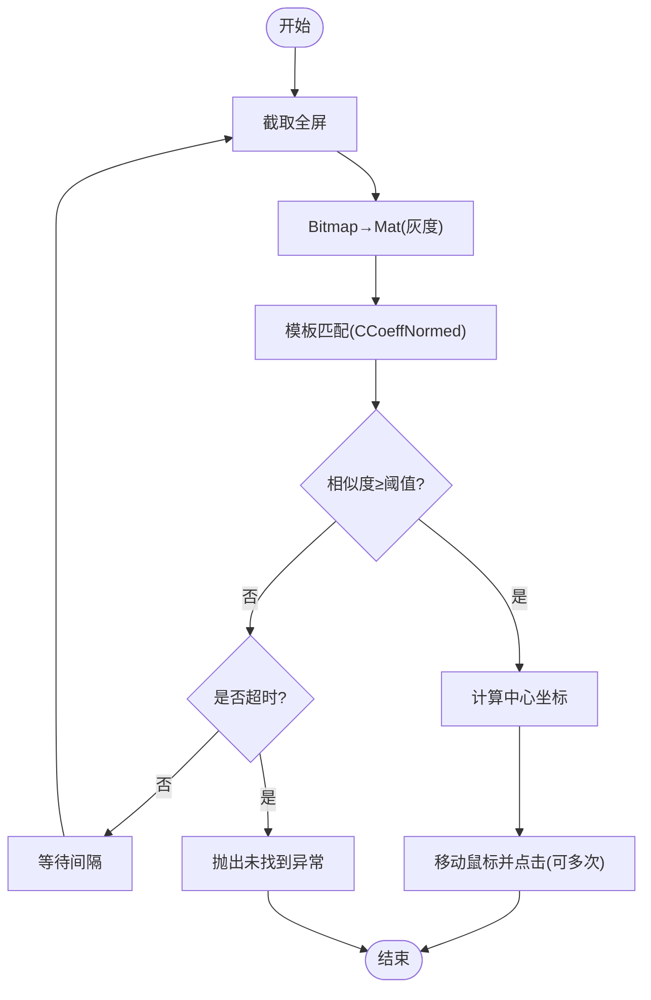
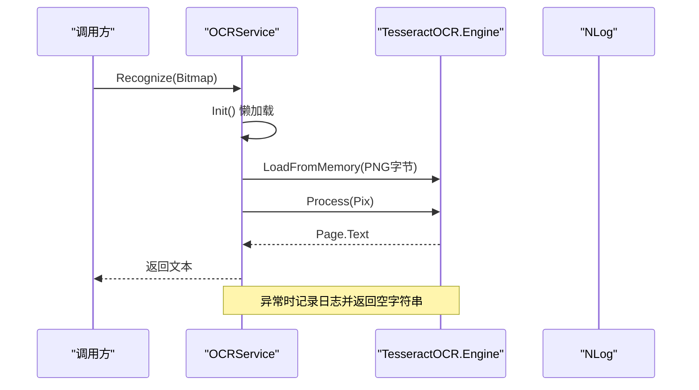
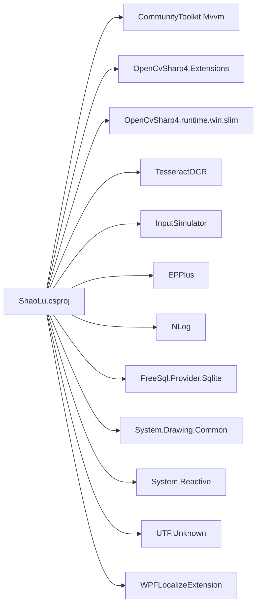

# 技术栈

<cite>
**本文引用的文件**   
- [ShaoLu.csproj](file://ShaoLu/ShaoLu.csproj)
- [App.config](file://ShaoLu/App.config)
- [App.xaml.cs](file://ShaoLu/App.xaml.cs)
- [NLog.config](file://ShaoLu/NLog.config)
- [Autogui.cs](file://ShaoLu/Utils/Autogui.cs)
- [OCRService.cs](file://ShaoLu/services/OCRService.cs)
- [Services.cs](file://ShaoLu/Services/Services.cs)
- [UserService.cs](file://ShaoLu/Services/UserService.cs)
- [ExecutionLogService.cs](file://ShaoLu/Services/ExecutionLogService.cs)
- [User.cs](file://ShaoLu/Models/User.cs)
- [SingletonLocator.cs](file://ShaoLu/Utils/SingletonLocator.cs)
- [AutomationStep.cs](file://ShaoLu/Viewmodels/AutomationStep.cs)
- [StepsViewModel.cs](file://ShaoLu/Viewmodels/StepsViewModel.cs)
- [SettingsViewModel.cs](file://ShaoLu/Viewmodels/SettingsViewModel.cs)
- [Readme.md](file://Readme.md)
</cite>

## 目录
1. [简介](#简介)
2. [项目结构](#项目结构)
3. [核心组件](#核心组件)
4. [架构总览](#架构总览)
5. [详细组件分析](#详细组件分析)
6. [依赖关系分析](#依赖关系分析)
7. [性能考量](#性能考量)
8. [故障排查指南](#故障排查指南)
9. [结论](#结论)
10. [附录：版本与环境要求](#附录版本与环境要求)

## 简介
本技术栈文档面向 ShaoLu（自动化烧录）项目的开发者与使用者，系统梳理并解释本项目所采用的核心技术、关键第三方库及其用途，说明依赖注入框架 CommunityToolkit.Mvvm 的使用方式，阐述技术选型的原因与优势，并给出版本兼容性与环境依赖要求。通过分层讲解与可视化图示，帮助读者快速理解项目的技术基础与扩展可能性。

## 项目结构
ShaoLu 是一个基于 .NET Framework 4.8 的 WPF 桌面应用，采用 MVVM 模式组织代码，核心目录包括：
- Viewmodels：MVVM 视图模型层，承载业务交互逻辑
- Services：服务层，封装 OCR、日志、用户、设置等能力
- Utils：工具类，如 Autogui（图像识别与输入模拟）、单例定位器等
- Models：数据模型与实体（含 FreeSql 映射）
- Views/Templates/Themes：WPF 界面与样式资源
- NLog.config：日志配置
- App.config/.csproj：运行时与包依赖声明

图表来源 
- [App.xaml.cs:1-86](file://ShaoLu/App.xaml.cs#L1-L86)
- [Autogui.cs:1-584](file://ShaoLu/Utils/Autogui.cs#L1-L584)
- [OCRService.cs:1-133](file://ShaoLu/services/OCRService.cs#L1-L133)
- [Services.cs:1-179](file://ShaoLu/Services/Services.cs#L1-L179)
- [UserService.cs:1-43](file://ShaoLu/Services/UserService.cs#L1-L43)
- [ExecutionLogService.cs:1-41](file://ShaoLu/Services/ExecutionLogService.cs#L1-L41)
- [User.cs:1-32](file://ShaoLu/Models/User.cs#L1-L32)
- [SingletonLocator.cs:1-18](file://ShaoLu/Utils/SingletonLocator.cs#L1-L18)
- [AutomationStep.cs:1-47](file://ShaoLu/Viewmodels/AutomationStep.cs#L1-L47)
- [StepsViewModel.cs:1-41](file://ShaoLu/Viewmodels/StepsViewModel.cs#L1-L41)
- [SettingsViewModel.cs:1-39](file://ShaoLu/Viewmodels/SettingsViewModel.cs#L1-L39)

章节来源
- [ShaoLu.csproj:1-433](file://ShaoLu/ShaoLu.csproj#L1-L433)
- [Readme.md:1-283](file://Readme.md#L1-L283)

## 核心组件
- 运行平台与语言
  - .NET Framework 4.8 + WPF + C#（预览语言特性）
- 依赖注入与 MVVM
  - CommunityToolkit.Mvvm：提供 ObservableObject、RelayCommand、Ioc 容器集成
- 图像处理与屏幕操作
  - OpenCvSharp4：模板匹配、截图、颜色空间转换
  - InputSimulator：鼠标键盘模拟
- 文字识别
  - TesseractOCR：OCR 引擎封装，支持多语言
- Excel 处理
  - EPPlus：读取 xlsx/csv/txt 数据源
- 日志记录
  - NLog：异步文件与控制台输出
- 数据库 ORM
  - FreeSql.Provider.Sqlite：SQLite 自动建表与 CRUD

章节来源
- [ShaoLu.csproj:358-401](file://ShaoLu/ShaoLu.csproj#L358-L401)
- [App.xaml.cs:33-46](file://ShaoLu/App.xaml.cs#L33-L46)
- [Autogui.cs:1-120](file://ShaoLu/Utils/Autogui.cs#L1-L120)
- [OCRService.cs:1-43](file://ShaoLu/services/OCRService.cs#L1-L43)
- [Services.cs:142-175](file://ShaoLu/Services/Services.cs#L142-L175)
- [UserService.cs:12-26](file://ShaoLu/Services/UserService.cs#L12-L26)
- [ExecutionLogService.cs:14-25](file://ShaoLu/Services/ExecutionLogService.cs#L14-L25)
- [NLog.config:1-20](file://ShaoLu/NLog.config#L1-L20)

## 架构总览
ShaoLu 采用“UI(Views) → ViewModel → Service/Util → 第三方库”的分层架构。App 启动时完成语言初始化、DI 容器注册、Excel 许可设置与日志清理，随后显示主窗口。ViewModel 通过 Ioc 获取服务与工具，调用 Autogui 进行图像识别与输入模拟，使用 OCRService 进行文本识别，并通过 FileServices/ExecutionLogService/UserService 读写数据与持久化。

图表来源 
- [StepsViewModel.cs:1-41](file://ShaoLu/Viewmodels/StepsViewModel.cs#L1-L41)
- [Autogui.cs:59-122](file://ShaoLu/Utils/Autogui.cs#L59-L122)
- [OCRService.cs:45-75](file://ShaoLu/services/OCRService.cs#L45-L75)
- [Services.cs:142-175](file://ShaoLu/Services/Services.cs#L142-L175)
- [ExecutionLogService.cs:34-41](file://ShaoLu/Services/ExecutionLogService.cs#L34-L41)
- [UserService.cs:12-26](file://ShaoLu/Services/UserService.cs#L12-L26)
- [NLog.config:7-19](file://ShaoLu/NLog.config#L7-L19)

## 详细组件分析

### 依赖注入与 MVVM（CommunityToolkit.Mvvm）
- 容器注册与生命周期
  - App 启动时通过 ServiceCollection 注册 MainViewModel、StepsViewModel、FileServices、IUserService 等，构建 ServiceProvider 并注入到 Ioc.Default
  - 单例与瞬态服务按需分配，便于测试与解耦
- ViewModel 基类与命令
  - 使用 ObservableObject 实现属性变更通知；RelayCommand 简化命令绑定
- 全局访问
  - SingletonLocator 暴露常用服务与设置的静态访问点，降低耦合

图表来源 
- [App.xaml.cs:33-46](file://ShaoLu/App.xaml.cs#L33-L46)
- [StepsViewModel.cs:1-41](file://ShaoLu/Viewmodels/StepsViewModel.cs#L1-L41)
- [Services.cs:83-140](file://ShaoLu/Services/Services.cs#L83-L140)
- [UserService.cs:10-37](file://ShaoLu/Services/UserService.cs#L10-L37)
- [SingletonLocator.cs:1-18](file://ShaoLu/Utils/SingletonLocator.cs#L1-L18)

章节来源
- [App.xaml.cs:17-52](file://ShaoLu/App.xaml.cs#L17-L52)
- [SingletonLocator.cs:1-18](file://ShaoLu/Utils/SingletonLocator.cs#L1-L18)
- [SettingsViewModel.cs:1-39](file://ShaoLu/Viewmodels/SettingsViewModel.cs#L1-L39)

### 图像识别与输入模拟（OpenCvSharp4 + InputSimulator）
- 屏幕截图与模板匹配
  - Autogui 将 Bitmap 转为 Mat，灰度化后执行 CCoeffNormed 模板匹配，计算相似度与中心坐标
  - 支持超时与间隔重试，失败抛出本地化异常
- 鼠标移动与点击
  - 根据锚点位置（中心/四角）与偏移量计算目标坐标，使用 InputSimulator 发送虚拟按键/鼠标事件
- 多图查找
  - 按列表顺序循环查找，支持单次或全部匹配模式

图表来源 
- [Autogui.cs:59-122](file://ShaoLu/Utils/Autogui.cs#L59-L122)
- [Autogui.cs:256-306](file://ShaoLu/Utils/Autogui.cs#L256-L306)

章节来源
- [Autogui.cs:1-120](file://ShaoLu/Utils/Autogui.cs#L1-L120)
- [Autogui.cs:256-306](file://ShaoLu/Utils/Autogui.cs#L256-L306)

### 文字识别（TesseractOCR）
- 懒加载初始化
  - 首次调用时从 tessdata 目录加载 chi_sim+eng 模型，记录日志
- 识别流程
  - 将 Bitmap 保存为 PNG 字节流，构造 Pix 对象，调用 Engine.Process 提取文本
- 区域识别
  - 根据 DPI 缩放因子将 WPF 逻辑像素转换为物理像素，再截取屏幕区域识别

图表来源 
- [OCRService.cs:21-43](file://ShaoLu/services/OCRService.cs#L21-L43)
- [OCRService.cs:45-75](file://ShaoLu/services/OCRService.cs#L45-L75)
- [OCRService.cs:82-118](file://ShaoLu/services/OCRService.cs#L82-L118)

章节来源
- [OCRService.cs:1-133](file://ShaoLu/services/OCRService.cs#L1-L133)

### Excel 与文本数据处理（EPPlus + UtfUnknown）
- SmartReadTextFile
  - 优先检测 BOM，否则使用 UtfUnknown 启发式编码检测，置信度阈值 0.5
- EPPlus
  - 在 App 启动时设置非商业个人许可，用于读取 xlsx 数据

章节来源
- [Services.cs:142-175](file://ShaoLu/Services/Services.cs#L142-L175)
- [App.xaml.cs:49-52](file://ShaoLu/App.xaml.cs#L49-L52)

### 日志记录（NLog）
- 配置要点
  - 异步输出到文件与控制台，文件名按日期命名，包含时间、级别、日志器名、消息与异常
- 使用方式
  - 各服务通过 LogManager.GetCurrentClassLogger() 获取实例，记录 Info/Warn/Error/Fatal

章节来源
- [NLog.config:1-20](file://ShaoLu/NLog.config#L1-L20)
- [AutomationStep.cs:25-28](file://ShaoLu/Viewmodels/AutomationStep.cs#L25-L28)
- [OCRService.cs:14-16](file://ShaoLu/services/OCRService.cs#L14-L16)

### 数据库与ORM（FreeSql + SQLite）
- 用户管理
  - User 实体使用 FreeSql.DataAnnotations 标注表与列，密码哈希加盐存储
- 执行日志
  - ExecutionLogService 自动创建 application data 目录下的 SQLite 数据库，记录步骤执行历史
- 连接构建
  - 使用 FreeSqlBuilder 指定 Data Source，启用自动同步结构

章节来源
- [User.cs:1-32](file://ShaoLu/Models/User.cs#L1-L32)
- [UserService.cs:12-26](file://ShaoLu/Services/UserService.cs#L12-L26)
- [ExecutionLogService.cs:14-25](file://ShaoLu/Services/ExecutionLogService.cs#L14-L25)

## 依赖关系分析
- 运行时与框架
  - .NET Framework 4.8（App.config 指定），x64 平台目标
- 关键 NuGet 包
  - CommunityToolkit.Mvvm 8.4.2：MVVM 与 DI
  - OpenCvSharp4.Extensions 4.13.0.20260627 + runtime.win.slim：图像处理
  - TesseractOCR 5.5.2：OCR 引擎（仅引用编译期，运行时需 tessdata）
  - InputSimulator 1.0.4：输入模拟
  - EPPlus 8.6.3：Excel 处理
  - NLog 6.1.4 + Schema：日志
  - FreeSql.Provider.Sqlite 3.5.310：SQLite ORM
  - System.Drawing.Common 10.0.10：GDI+ 图像操作
  - System.Reactive 7.0.0：响应式编程（图片编辑模块）
  - UTF.Unknown 2.6.0：文本编码检测
  - WPFLocalizeExtension 3.10.0：WPF 本地化

图表来源 
- [ShaoLu.csproj:358-401](file://ShaoLu/ShaoLu.csproj#L358-L401)

章节来源
- [ShaoLu.csproj:358-401](file://ShaoLu/ShaoLu.csproj#L358-L401)

## 性能考量
- 图像识别
  - 模板匹配在每次循环中重新截图与转换，建议合理设置超时与间隔，避免频繁 CPU 占用
  - 裁剪识别区域越小，匹配越快且误匹配越少
- OCR 初始化
  - 懒加载避免启动开销；tessdata 路径必须正确，否则影响识别速度
- 输入模拟
  - TypeTextSafe 模式通过剪贴板粘贴，兼容性更好但可能较慢；TypeText 直接按键更快但兼容性略差
- 日志
  - NLog 异步写入，减少 IO 阻塞；建议控制日志级别与保留天数
- 数据库
  - FreeSql 自动建表与 SQLite 轻量级适合桌面端；大量写入时可批量提交

[本节为通用指导，不直接分析具体文件]

## 故障排查指南
- 启动失败
  - 检查 .NET Framework 4.8 是否安装；确认 App.config 支持的运行时版本
- OCR 识别失败
  - 确认 tessdata 目录存在且包含 chi_sim+eng 模型；查看 NLog 错误日志
- 图像匹配失败
  - 调整相似度阈值与超时参数；确保裁剪区域精确
- 输入无效
  - 切换 TypeTextSafe 模式；检查焦点窗口与权限
- Excel 读取异常
  - 确认 EPPlus 许可已设置；检查文件格式与编码
- 数据库问题
  - 检查 application data 目录权限；查看 FreeSql 连接字符串与自动同步设置

章节来源
- [App.config:1-6](file://ShaoLu/App.config#L1-L6)
- [OCRService.cs:21-43](file://ShaoLu/services/OCRService.cs#L21-L43)
- [Autogui.cs:59-122](file://ShaoLu/Utils/Autogui.cs#L59-L122)
- [Services.cs:142-175](file://ShaoLu/Services/Services.cs#L142-L175)
- [UserService.cs:12-26](file://ShaoLu/Services/UserService.cs#L12-L26)
- [ExecutionLogService.cs:14-25](file://ShaoLu/Services/ExecutionLogService.cs#L14-L25)

## 结论
ShaoLu 以 .NET Framework 4.8 + WPF + C# 为基础，结合 OpenCvSharp4、TesseractOCR、InputSimulator、EPPlus、NLog、FreeSql 等成熟库，构建了稳定高效的 GUI 自动化解决方案。通过 CommunityToolkit.Mvvm 的 MVVM 与 DI，项目具备良好的可维护性与扩展性。建议在后续迭代中持续优化图像识别参数、日志策略与数据库写入性能，并根据需要引入更多 UI 组件与国际化能力。

[本节为总结，不直接分析具体文件]

## 附录：版本与环境要求
- 运行时
  - .NET Framework 4.8（x64）
- 关键依赖版本
  - CommunityToolkit.Mvvm 8.4.2
  - OpenCvSharp4.Extensions 4.13.0.20260627 + runtime.win.slim 4.13.0.20260627
  - TesseractOCR 5.5.2（需 tessdata 语言包）
  - InputSimulator 1.0.4
  - EPPlus 8.6.3
  - NLog 6.1.4 + Schema 6.1.4
  - FreeSql.Provider.Sqlite 3.5.310
  - System.Drawing.Common 10.0.10
  - System.Reactive 7.0.0
  - UTF.Unknown 2.6.0
  - WPFLocalizeExtension 3.10.0
- 部署注意
  - 确保 tessdata 目录随程序分发
  - 首次运行需在 App 中设置 EPPlus 许可
  - 日志目录 logs 需具备写入权限

章节来源
- [ShaoLu.csproj:358-401](file://ShaoLu/ShaoLu.csproj#L358-L401)
- [App.xaml.cs:49-52](file://ShaoLu/App.xaml.cs#L49-L52)
- [NLog.config:1-20](file://ShaoLu/NLog.config#L1-L20)
- [Readme.md:1-20](file://Readme.md#L1-L20)