# 架构概览

<cite>
**本文引用的文件**   
- [Readme.md](file://Readme.md)
- [App.xaml.cs](file://ShaoLu/App.xaml.cs)
- [MainWindow.xaml.cs](file://ShaoLu/MainWindow.xaml.cs)
- [MainViewModel.cs](file://ShaoLu/Viewmodels/MainViewModel.cs)
- [StepsViewModel.cs](file://ShaoLu/Viewmodels/StepsViewModel.cs)
- [AutomationStep.cs](file://ShaoLu/Viewmodels/AutomationStep.cs)
- [AutomationStepModel.cs](file://ShaoLu/Models/AutomationStepModel.cs)
- [Settings.cs](file://ShaoLu/Models/Settings.cs)
- [SettingsService.cs](file://ShaoLu/Services/SettingsService.cs)
- [SingletonLocator.cs](file://ShaoLu/Utils/SingletonLocator.cs)
- [LanguageService.cs](file://ShaoLu/Services/LanguageService.cs)
- [UserService.cs](file://ShaoLu/Services/UserService.cs)
- [Services.cs](file://ShaoLu/Services/Services.cs)
- [LoginViewModel.cs](file://ShaoLu/Viewmodels/LoginViewModel.cs)
- [SettingsTemplateSelector.cs](file://ShaoLu/Converters/SettingsTemplateSelector.cs)
</cite>

## 目录
1. [简介](#简介)
2. [项目结构](#项目结构)
3. [核心组件](#核心组件)
4. [架构总览](#架构总览)
5. [详细组件分析](#详细组件分析)
6. [依赖关系分析](#依赖关系分析)
7. [性能考量](#性能考量)
8. [故障排查指南](#故障排查指南)
9. [结论](#结论)
10. [附录](#附录)

## 简介
本架构概览面向 ShaoLu（烧录）项目的 MVVM 分层设计与模块化组织，重点阐述 Model-View-ViewModel 的职责分离、依赖注入与服务注册、插件化扩展思路、数据流向与组件交互模式。文档通过架构图与流程图帮助开发者快速建立整体认知，并为后续深入学习各模块奠定基础。

## 项目结构
ShaoLu 采用 WPF + MVVM 的桌面应用结构，按职责划分：
- Views：WPF 窗口与用户控件，负责 UI 展示与用户交互
- ViewModels：业务编排、命令与数据绑定，协调服务与模型
- Models：数据实体与枚举定义
- Services：横切能力（语言、设置、用户、OCR、执行日志等）
- Utils：通用工具与定位器（单例/容器访问）
- Converters/Templates/Themes：UI 模板与转换器
- Tools/ImageEdit：图像编辑子模块（独立功能域）

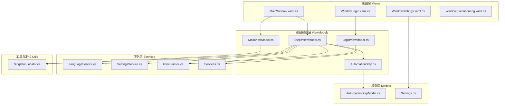

**图表来源** 
- [App.xaml.cs:18-65](file://ShaoLu/App.xaml.cs#L18-L65)
- [MainWindow.xaml.cs:1-120](file://ShaoLu/MainWindow.xaml.cs#L1-L120)
- [StepsViewModel.cs:1-120](file://ShaoLu/Viewmodels/StepsViewModel.cs#L1-L120)
- [AutomationStep.cs:1-120](file://ShaoLu/Viewmodels/AutomationStep.cs#L1-L120)
- [AutomationStepModel.cs:1-47](file://ShaoLu/Models/AutomationStepModel.cs#L1-L47)
- [Settings.cs:1-76](file://ShaoLu/Models/Settings.cs#L1-L76)
- [SettingsService.cs:1-38](file://ShaoLu/Services/SettingsService.cs#L1-L38)
- [LanguageService.cs:1-67](file://ShaoLu/Services/LanguageService.cs#L1-L67)
- [UserService.cs:1-60](file://ShaoLu/Services/UserService.cs#L1-L60)
- [Services.cs:1-82](file://ShaoLu/Services/Services.cs#L1-L82)
- [SingletonLocator.cs:1-19](file://ShaoLu/Utils/SingletonLocator.cs#L1-L19)

**章节来源**
- [Readme.md:1-283](file://Readme.md#L1-L283)
- [App.xaml.cs:18-65](file://ShaoLu/App.xaml.cs#L18-L65)
- [MainWindow.xaml.cs:1-120](file://ShaoLu/MainWindow.xaml.cs#L1-L120)

## 核心组件
- 启动与依赖注入：App 在 OnStartup 中初始化语言、构建 DI 容器并注册 ViewModel 与服务，随后创建主窗口。
- 主窗口与热键：MainWindow 注册全局热键，驱动 StepsViewModel 的运行与停止；维护登录状态与多语言切换。
- 步骤编排：StepsViewModel 管理自动化步骤集合、执行流程、错误处理、条件跳转与上下文。
- 步骤基类与实现：AutomationStepBase 提供通用属性与抽象 RunAsync，具体步骤（文本输入、图片识别、弹窗等）继承实现。
- 设置与持久化：SettingsService 负责 AppSettings 的加载与保存；SingletonLocator 暴露统一访问点。
- 国际化：LanguageService 负责当前语言设置与本地化字符串获取。
- 用户服务：UserService 基于 SQLite 实现用户认证、注册与管理。

**章节来源**
- [App.xaml.cs:18-65](file://ShaoLu/App.xaml.cs#L18-L65)
- [MainWindow.xaml.cs:32-91](file://ShaoLu/MainWindow.xaml.cs#L32-L91)
- [StepsViewModel.cs:1-120](file://ShaoLu/Viewmodels/StepsViewModel.cs#L1-L120)
- [AutomationStep.cs:24-205](file://ShaoLu/Viewmodels/AutomationStep.cs#L24-L205)
- [SettingsService.cs:1-38](file://ShaoLu/Services/SettingsService.cs#L1-L38)
- [LanguageService.cs:1-67](file://ShaoLu/Services/LanguageService.cs#L1-L67)
- [UserService.cs:1-60](file://ShaoLu/Services/UserService.cs#L1-L60)

## 架构总览
下图展示了 MVVM 分层与关键交互路径：Views 通过 DataContext 绑定到 ViewModels；ViewModels 调用 Services 与 Models；DI 容器贯穿生命周期，SingletonLocator 提供便捷访问。

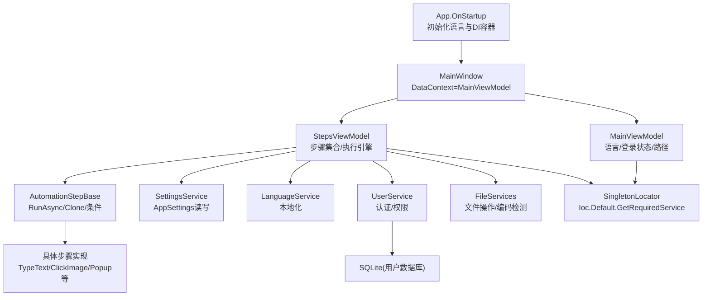

**图表来源** 
- [App.xaml.cs:18-65](file://ShaoLu/App.xaml.cs#L18-L65)
- [MainWindow.xaml.cs:77-101](file://ShaoLu/MainWindow.xaml.cs#L77-L101)
- [MainViewModel.cs:1-76](file://ShaoLu/Viewmodels/MainViewModel.cs#L1-L76)
- [StepsViewModel.cs:1-120](file://ShaoLu/Viewmodels/StepsViewModel.cs#L1-L120)
- [AutomationStep.cs:24-205](file://ShaoLu/Viewmodels/AutomationStep.cs#L24-L205)
- [SettingsService.cs:1-38](file://ShaoLu/Services/SettingsService.cs#L1-L38)
- [LanguageService.cs:1-67](file://ShaoLu/Services/LanguageService.cs#L1-L67)
- [UserService.cs:1-60](file://ShaoLu/Services/UserService.cs#L1-L60)
- [Services.cs:83-179](file://ShaoLu/Services/Services.cs#L83-L179)
- [SingletonLocator.cs:1-19](file://ShaoLu/Utils/SingletonLocator.cs#L1-L19)

## 详细组件分析

### 启动与依赖注入（App）
- 初始化语言：读取上次语言或系统语言，设置 LocalizeDictionary。
- 构建 ServiceCollection：注册 MainViewModel、StepsViewModel、FileServices、IUserService 等。
- 配置 Ioc.Default：将 Microsoft.Extensions.DependencyInjection 的结果接入 CommunityToolkit.Mvvm 的 Ioc。
- 清理过期日志：根据设置清理历史执行日志。
- 显示主窗口：直接创建 MainWindow 并 Show。

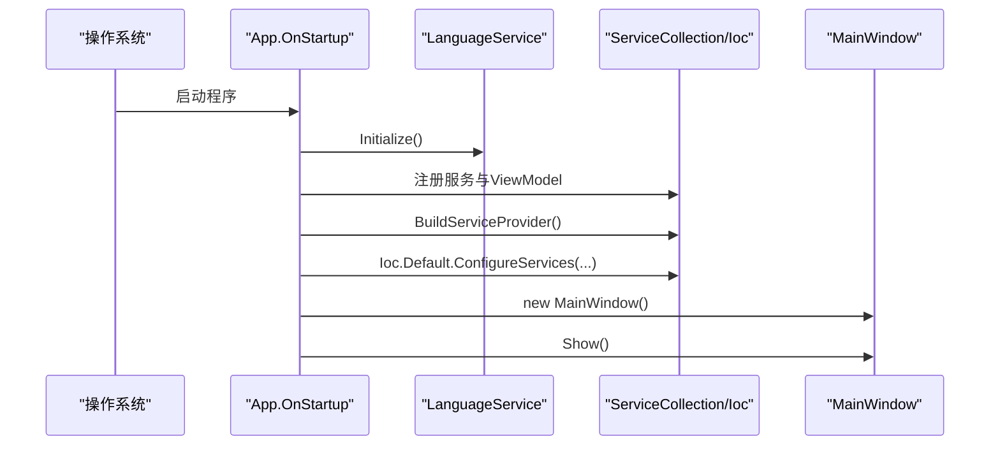

**图表来源** 
- [App.xaml.cs:18-65](file://ShaoLu/App.xaml.cs#L18-L65)
- [LanguageService.cs:15-22](file://ShaoLu/Services/LanguageService.cs#L15-L22)

**章节来源**
- [App.xaml.cs:18-65](file://ShaoLu/App.xaml.cs#L18-L65)

### 主窗口与热键（MainWindow）
- 注册 WM_HOTKEY 钩子，映射 Ctrl+Alt+F9/F10 为开始/停止。
- 通过 SingletonLocator 获取 MainViewModel 与 StepsViewModel。
- 打开/保存 .autostep 包或兼容 JSON 格式，加载步骤集合并更新工作目录。
- 弹出设置、关于、执行日志、用户管理等窗口。
- 登录态检查：未登录时弹出登录窗口，成功后刷新 UI。

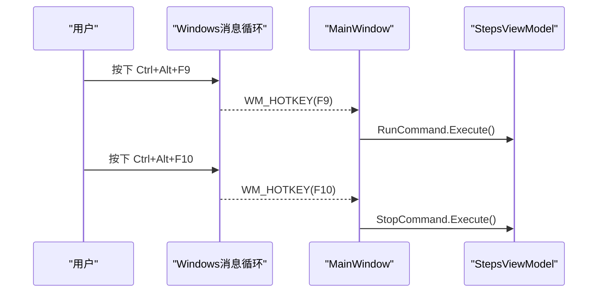

**图表来源** 
- [MainWindow.xaml.cs:32-74](file://ShaoLu/MainWindow.xaml.cs#L32-L74)
- [StepsViewModel.cs:363-368](file://ShaoLu/Viewmodels/StepsViewModel.cs#L363-L368)

**章节来源**
- [MainWindow.xaml.cs:32-101](file://ShaoLu/MainWindow.xaml.cs#L32-L101)
- [MainWindow.xaml.cs:185-233](file://ShaoLu/MainWindow.xaml.cs#L185-L233)
- [MainWindow.xaml.cs:253-313](file://ShaoLu/MainWindow.xaml.cs#L253-L313)

### 步骤执行引擎（StepsViewModel）
- 管理 AutomationStepBases 集合，增删改排序、复制粘贴、选择。
- 运行前准备：重置停止信号、初始化 Autogui、清空执行上下文、最小化窗口、重置自引用计数。
- 执行循环：逐条执行 Step.RunAsync，计时、记录结果、写入执行上下文、自定义条件评估、日志输出。
- 错误处理：捕获异常、推断错误类型、可选弹窗提示、根据 FalseGoto 决定是否继续。
- 跳转逻辑：TrueGoto/FalseGoto 支持分支与循环，含自引用上限保护。

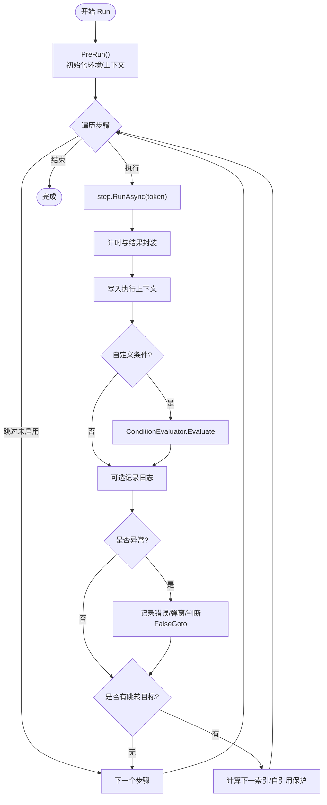

**图表来源** 
- [StepsViewModel.cs:375-565](file://ShaoLu/Viewmodels/StepsViewModel.cs#L375-L565)

**章节来源**
- [StepsViewModel.cs:114-140](file://ShaoLu/Viewmodels/StepsViewModel.cs#L114-L140)
- [StepsViewModel.cs:363-565](file://ShaoLu/Viewmodels/StepsViewModel.cs#L363-L565)

### 步骤基类与具体步骤（AutomationStep）
- 基类 AutomationStepBase：定义通用属性（名称、描述、行号、等待时间、跳转、错误类型、条件规则、日志开关）、克隆与异步执行接口。
- 具体步骤：
  - TypeTextStep：按键间隔控制，安全/快速输入模式。
  - TypeTextMoreStep：前缀/中间/后缀组合与递增。
  - TypeTextFromFileStep：从 txt/csv/xlsx 读取内容列表，逐行输入。
  - PopupStep：异步弹窗，支持取消与按钮返回值。
  - 图像识别相关步骤（点击/查找/多图）：由 ImageRecognitionBase 派生（在 AutomationStep.cs 中可见）。

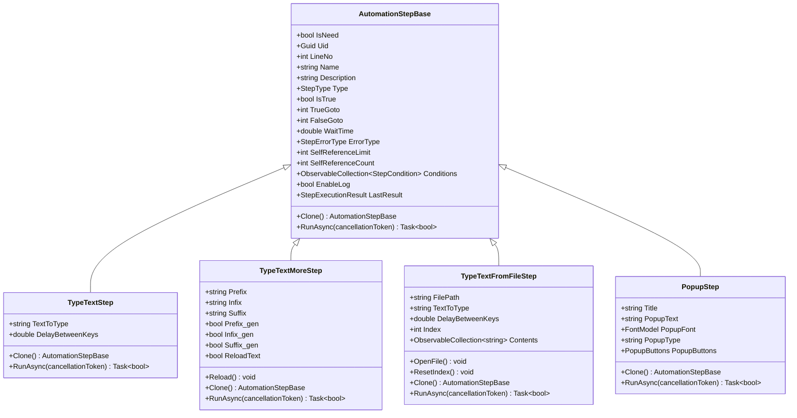

**图表来源** 
- [AutomationStep.cs:24-205](file://ShaoLu/Viewmodels/AutomationStep.cs#L24-L205)
- [AutomationStep.cs:209-279](file://ShaoLu/Viewmodels/AutomationStep.cs#L209-L279)
- [AutomationStep.cs:281-435](file://ShaoLu/Viewmodels/AutomationStep.cs#L281-L435)
- [AutomationStep.cs:437-602](file://ShaoLu/Viewmodels/AutomationStep.cs#L437-L602)
- [AutomationStep.cs:606-752](file://ShaoLu/Viewmodels/AutomationStep.cs#L606-L752)

**章节来源**
- [AutomationStep.cs:24-205](file://ShaoLu/Viewmodels/AutomationStep.cs#L24-L205)
- [AutomationStep.cs:209-752](file://ShaoLu/Viewmodels/AutomationStep.cs#L209-L752)

### 设置与持久化（SettingsService + Settings）
- SettingsService：以 settings.json 持久化 AppSettings，支持异步加载与保存。
- Settings：包含 App、Step、UserSettings 等配置项，如主题、窗口尺寸、字体、保留天数、默认相似度/超时/点击次数、热键等。

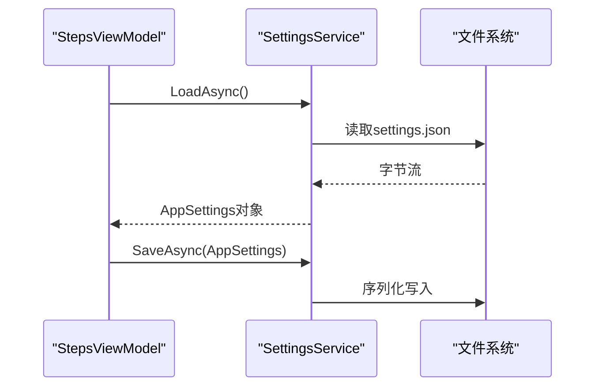

**图表来源** 
- [SettingsService.cs:1-38](file://ShaoLu/Services/SettingsService.cs#L1-L38)
- [Settings.cs:1-76](file://ShaoLu/Models/Settings.cs#L1-L76)

**章节来源**
- [SettingsService.cs:1-38](file://ShaoLu/Services/SettingsService.cs#L1-L38)
- [Settings.cs:1-76](file://ShaoLu/Models/Settings.cs#L1-L76)

### 国际化（LanguageService）
- 初始化：读取 current_language.txt 或系统语言，设置 LocalizeDictionary。
- 设置语言：写入配置文件，记录日志。
- 获取本地化字符串：失败回退到 key 或默认值。

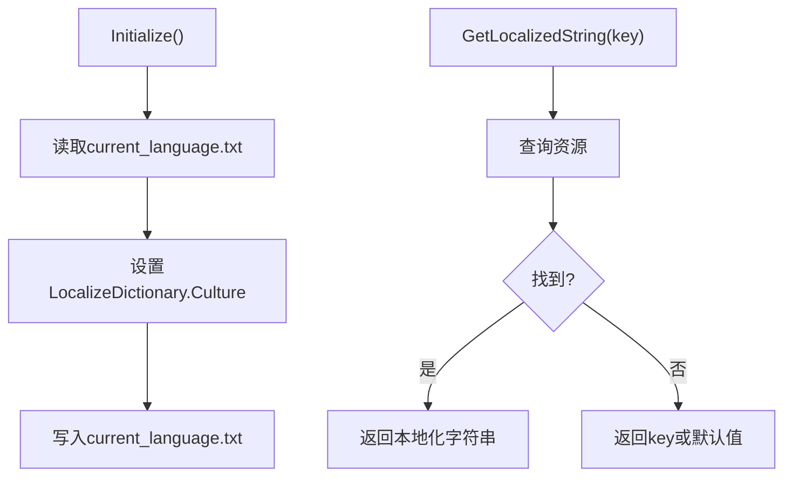

**图表来源** 
- [LanguageService.cs:15-64](file://ShaoLu/Services/LanguageService.cs#L15-L64)

**章节来源**
- [LanguageService.cs:1-67](file://ShaoLu/Services/LanguageService.cs#L1-L67)

### 用户服务（UserService）
- 基于 FreeSql + SQLite 的用户表自动建库。
- 密码加盐与哈希（PBKDF2-SHA256），常量时间比较防时序攻击。
- 登录/注销、用户增删改、注册（管理员审批逻辑）。

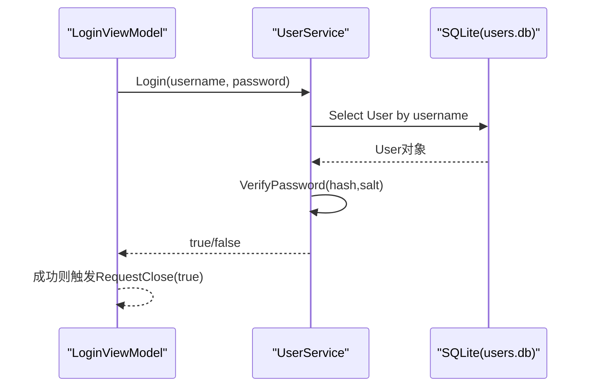

**图表来源** 
- [UserService.cs:12-37](file://ShaoLu/Services/UserService.cs#L12-L37)
- [UserService.cs:76-93](file://ShaoLu/Services/UserService.cs#L76-L93)
- [LoginViewModel.cs:49-75](file://ShaoLu/Viewmodels/LoginViewModel.cs#L49-L75)

**章节来源**
- [UserService.cs:1-239](file://ShaoLu/Services/UserService.cs#L1-L239)
- [LoginViewModel.cs:1-251](file://ShaoLu/Viewmodels/LoginViewModel.cs#L1-L251)

### 文件与路径服务（FileServices + PathServices）
- PathServices：打开/保存对话框、相对路径计算、空串判断。
- FileServices：延迟删除标记、提交删除、智能文本编码检测（BOM优先，UtfUnknown启发式）。

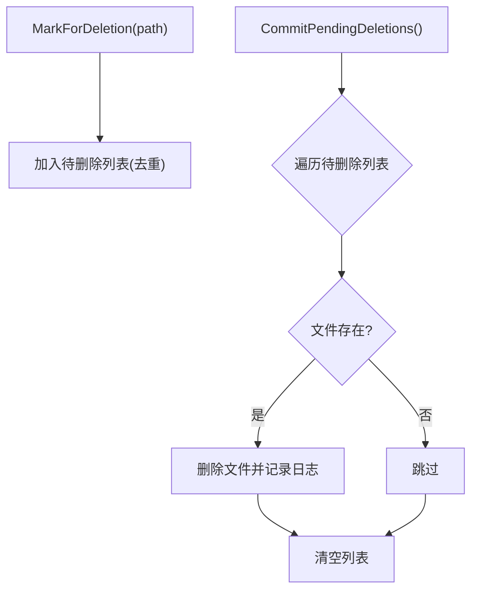

**图表来源** 
- [Services.cs:83-179](file://ShaoLu/Services/Services.cs#L83-L179)

**章节来源**
- [Services.cs:1-179](file://ShaoLu/Services/Services.cs#L1-L179)

### 登录流程（LoginViewModel）
- 登录：校验用户名/密码，调用 UserService.Login，成功则触发 RequestClose(true)。
- 注册：支持管理员审批模式，校验长度与一致性，成功后切换到登录并预填用户名。

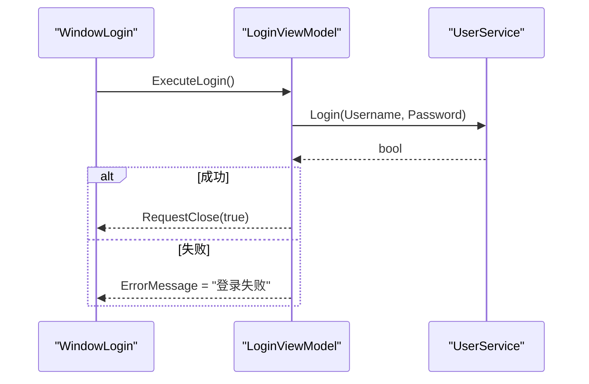

**图表来源** 
- [LoginViewModel.cs:49-75](file://ShaoLu/Viewmodels/LoginViewModel.cs#L49-L75)
- [UserService.cs:76-93](file://ShaoLu/Services/UserService.cs#L76-L93)

**章节来源**
- [LoginViewModel.cs:1-251](file://ShaoLu/Viewmodels/LoginViewModel.cs#L1-L251)

### 设置模板选择器（SettingsTemplateSelector）
- 根据数据类型选择不同 DataTemplate，用于动态渲染 AppSettingsModel 与 StepSettingsModel 的设置界面。

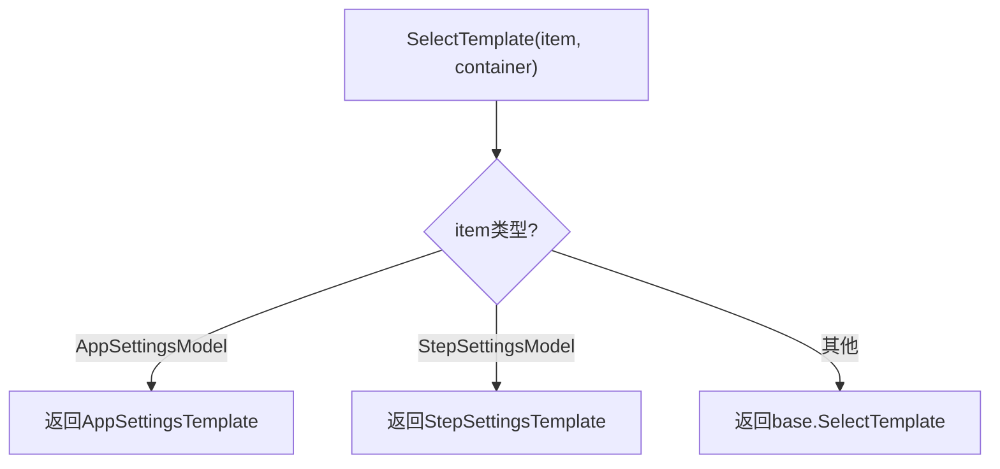

**图表来源** 
- [SettingsTemplateSelector.cs:1-26](file://ShaoLu/Converters/SettingsTemplateSelector.cs#L1-L26)

**章节来源**
- [SettingsTemplateSelector.cs:1-26](file://ShaoLu/Converters/SettingsTemplateSelector.cs#L1-L26)

## 依赖关系分析
- 低耦合：ViewModels 通过接口 IUserService 与 Services 交互，避免紧耦合。
- 单例定位：SingletonLocator 封装 Ioc.Default 调用，简化跨层访问。
- 模块化：Tools/ImageEdit 作为独立功能域，内部包含 Controls、Helpers、Interop、Services、ViewModels 等，便于扩展与维护。
- 外部依赖：NLog 日志、CommunityToolkit.Mvvm 框架、Microsoft.Extensions.DependencyInjection、OfficeOpenXml、FreeSql、UtfUnknown、WPFLocalizeExtension。

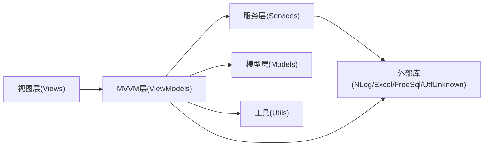

**图表来源** 
- [SingletonLocator.cs:1-19](file://ShaoLu/Utils/SingletonLocator.cs#L1-L19)
- [App.xaml.cs:33-46](file://ShaoLu/App.xaml.cs#L33-L46)

**章节来源**
- [SingletonLocator.cs:1-19](file://ShaoLu/Utils/SingletonLocator.cs#L1-L19)
- [App.xaml.cs:33-46](file://ShaoLu/App.xaml.cs#L33-L46)

## 性能考量
- 异步执行：步骤执行使用 async/await 与 CancellationToken，避免阻塞 UI 线程。
- 批量操作：步骤集合变更事件集中更新行号与命令 CanExecute，减少频繁 UI 刷新。
- 文件 IO：延迟删除与批量提交降低频繁磁盘操作开销；智能编码检测避免重复解析。
- 资源释放：App.OnExit 中释放图像识别资源并提交待删除文件，防止内存泄漏。

[本节为通用指导，不直接分析具体文件]

## 故障排查指南
- 启动失败：检查 App.OnStartup 中的语言初始化与 DI 容器配置；查看 NLog 日志。
- 热键无效：确认 MainWindow 已正确注册 WM_HOTKEY，并在关闭时注销。
- 步骤执行异常：查看 StepsViewModel 的错误推断与日志输出；检查 FalseGoto 与自引用限制。
- 登录失败：验证 UserService 的密码哈希与 Salt；检查 users.db 是否存在与权限。
- 文件读取乱码：确认 FileServices.SmartReadTextFile 的编码检测逻辑与 UtfUnknown 置信度阈值。

**章节来源**
- [App.xaml.cs:60-65](file://ShaoLu/App.xaml.cs#L60-L65)
- [MainWindow.xaml.cs:85-91](file://ShaoLu/MainWindow.xaml.cs#L85-L91)
- [StepsViewModel.cs:487-512](file://ShaoLu/Viewmodels/StepsViewModel.cs#L487-L512)
- [UserService.cs:49-74](file://ShaoLu/Services/UserService.cs#L49-L74)
- [Services.cs:142-175](file://ShaoLu/Services/Services.cs#L142-L175)

## 结论
ShaoLu 通过清晰的 MVVM 分层、稳健的依赖注入与模块化设计，实现了高内聚、低耦合的自动化 GUI 工具。步骤引擎具备完善的错误处理与条件跳转能力，配合国际化、设置持久化与用户认证，形成完整的桌面应用生态。建议后续在以下方面持续优化：
- 进一步抽象步骤工厂与插件机制，提升可扩展性
- 引入更细粒度的单元测试与集成测试
- 增强并发控制与资源池化管理
- 完善可观测性与诊断信息（指标、追踪）

[本节为总结性内容，不直接分析具体文件]

## 附录
- 快速开始与步骤说明参考：[Readme.md:1-283](file://Readme.md#L1-L283)
- 主要入口与生命周期：[App.xaml.cs:18-86](file://ShaoLu/App.xaml.cs#L18-L86)、[MainWindow.xaml.cs:1-316](file://ShaoLu/MainWindow.xaml.cs#L1-L316)
- 核心业务编排：[StepsViewModel.cs:1-588](file://ShaoLu/Viewmodels/StepsViewModel.cs#L1-L588)
- 步骤模型与实现：[AutomationStep.cs:1-849](file://ShaoLu/Viewmodels/AutomationStep.cs#L1-L849)
- 设置与持久化：[SettingsService.cs:1-38](file://ShaoLu/Services/SettingsService.cs#L1-L38)、[Settings.cs:1-76](file://ShaoLu/Models/Settings.cs#L1-L76)
- 国际化与用户服务：[LanguageService.cs:1-67](file://ShaoLu/Services/LanguageService.cs#L1-L67)、[UserService.cs:1-239](file://ShaoLu/Services/UserService.cs#L1-L239)
- 工具与定位器：[Services.cs:1-179](file://ShaoLu/Services/Services.cs#L1-L179)、[SingletonLocator.cs:1-19](file://ShaoLu/Utils/SingletonLocator.cs#L1-L19)