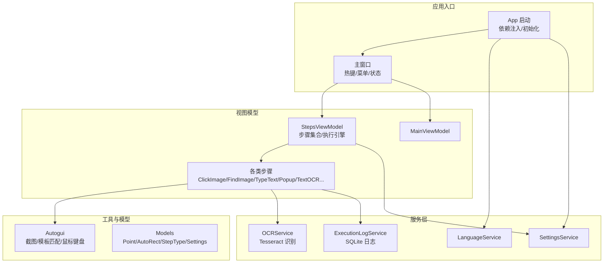
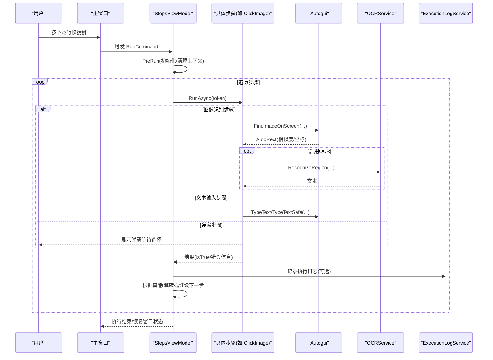
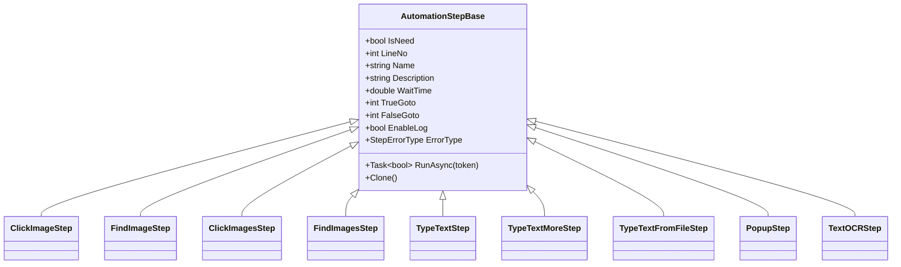
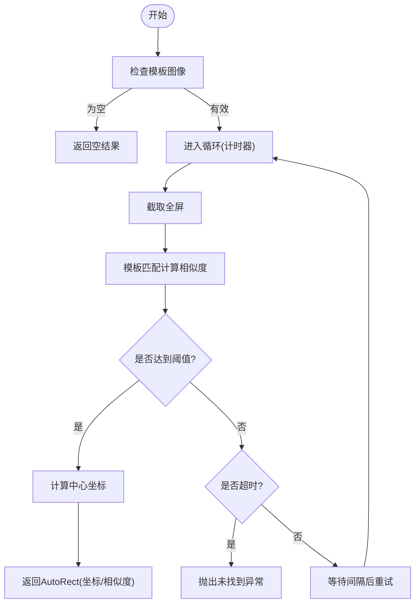
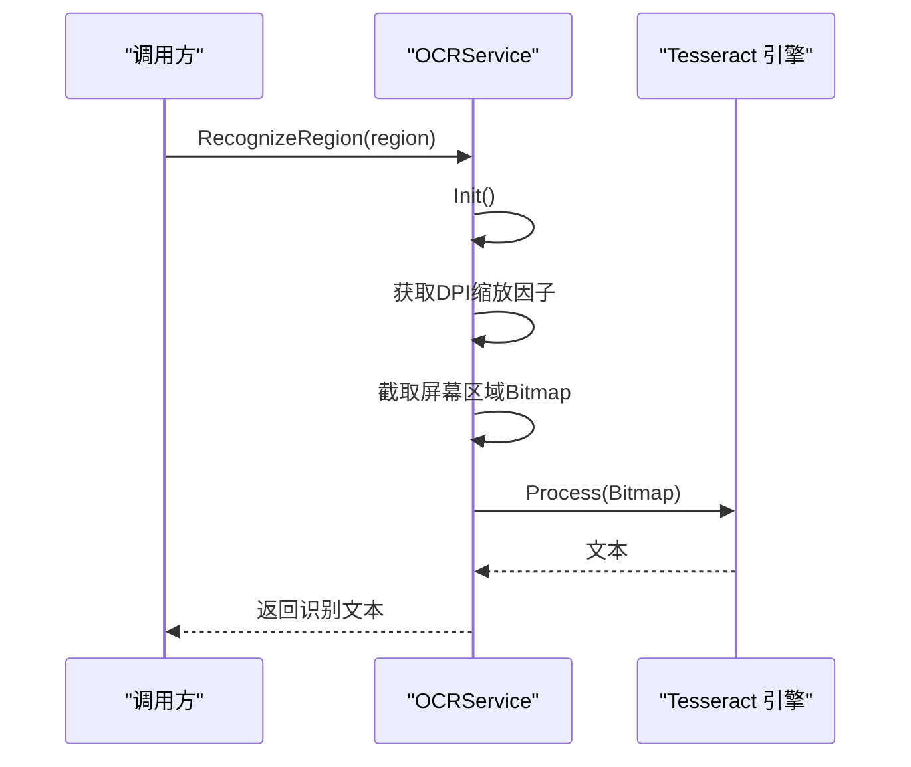
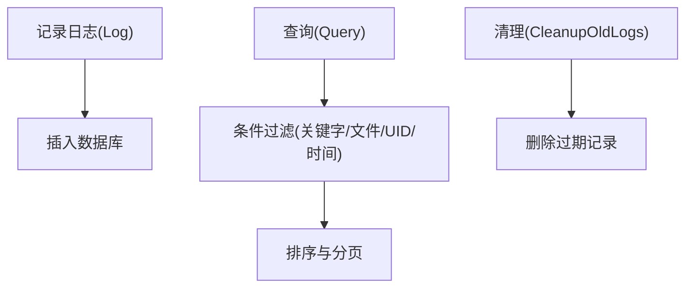
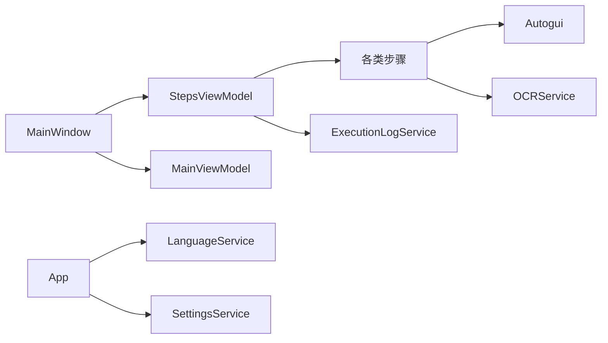

# 项目介绍

<cite>
**本文引用的文件**   
- [Readme.md](file://Readme.md)
- [App.xaml.cs](file://ShaoLu/App.xaml.cs)
- [MainWindow.xaml.cs](file://ShaoLu/MainWindow.xaml.cs)
- [AutoguiModel.cs](file://ShaoLu/Models/AutoguiModel.cs)
- [MainViewModel.cs](file://ShaoLu/Viewmodels/MainViewModel.cs)
- [OCRService.cs](file://ShaoLu/Services/OCRService.cs)
- [Autogui.cs](file://ShaoLu/Utils/Autogui.cs)
- [AutomationStepModel.cs](file://ShaoLu/Models/AutomationStepModel.cs)
- [AutomationStep.cs](file://ShaoLu/Viewmodels/AutomationStep.cs)
- [ExecutionLogService.cs](file://ShaoLu/Services/ExecutionLogService.cs)
- [Settings.cs](file://ShaoLu/Models/Settings.cs)
- [StepsViewModel.cs](file://ShaoLu/Viewmodels/StepsViewModel.cs)
- [ImageRecognition.cs](file://ShaoLu/Viewmodels/ImageRecognition.cs)
- [TextOCRStep.cs](file://ShaoLu/Viewmodels/TextOCRStep.cs)
</cite>

## 目录
1. [简介](#简介)
2. [项目结构](#项目结构)
3. [核心组件](#核心组件)
4. [架构总览](#架构总览)
5. [详细组件分析](#详细组件分析)
6. [依赖关系分析](#依赖关系分析)
7. [性能考量](#性能考量)
8. [故障排查指南](#故障排查指南)
9. [结论](#结论)
10. [附录](#附录)

## 简介
ShaoLu（烧录）是一款基于图像识别的 Windows 桌面自动化工具，采用 WPF 构建图形界面，通过“可视化步骤编排 + 图像匹配 + OCR 文字识别 + 模拟输入”的方式，帮助用户将重复性、规则化的桌面操作自动化。其核心价值在于：
- 以“步骤”为最小单元组织自动化流程，无需编程即可搭建可复用的自动化脚本
- 通过模板匹配与 OCR 增强对 UI 元素的感知能力，降低对控件树或 API 的依赖
- 提供弹窗交互、条件跳转、循环控制等流程编排能力，覆盖复杂业务场景
- 支持多语言、快捷键运行/停止、执行日志与结果回溯，便于调试与审计

典型应用场景包括：
- 重复性任务自动化：批量数据录入、报表导出、系统巡检
- UI 测试与回归：跨应用界面的点击、输入、断言
- 人机协同流程：关键节点弹出确认框，人工确认后继续执行

目标用户群体：
- 非技术背景的办公人员与业务分析师
- 测试工程师与运维人员
- 需要快速实现桌面端 RPA 的团队或个人开发者

设计理念与技术优势：
- 低代码/无代码：可视化步骤编辑器，所见即所得
- 高兼容：基于屏幕截图与图像识别，适配多种老旧或第三方软件界面
- 可扩展：步骤类型可插拔扩展，服务层解耦，便于集成新能力
- 健壮性：超时控制、自引用限制、错误分类与恢复策略

## 项目结构
ShaoLu 采用分层与模块化组织方式，主要目录职责如下：
- ShaoLu/Models：领域模型（步骤类型枚举、点与矩形、设置项、执行日志实体等）
- ShaoLu/Viewmodels：MVVM 视图模型（主界面、步骤集合、登录、设置、图片识别等）
- ShaoLu/Views：WPF 窗口与用户控件（主窗口、设置、编辑图片、执行日志等）
- ShaoLu/Services：服务层（OCR、执行日志、语言、用户、配置等）
- ShaoLu/Utils：工具类（Autogui 图像与输入、单例定位器等）
- ShaoLu/Tools/ImageEdit：图像裁剪与编辑工具（截图、裁剪、点击点标注、OCR 区域设置）
- ShaoLu/Resources：本地化资源（中英文/繁中）
- NUnitTest：单元测试套件

图表来源
- [App.xaml.cs:18-65](file://ShaoLu/App.xaml.cs#L18-L65)
- [MainWindow.xaml.cs:32-91](file://ShaoLu/MainWindow.xaml.cs#L32-L91)
- [StepsViewModel.cs:361-588](file://ShaoLu/Viewmodels/StepsViewModel.cs#L361-L588)
- [AutomationStep.cs:25-205](file://ShaoLu/Viewmodels/AutomationStep.cs#L25-L205)
- [Autogui.cs:26-122](file://ShaoLu/Utils/Autogui.cs#L26-L122)
- [OCRService.cs:12-43](file://ShaoLu/Services/OCRService.cs#L12-L43)
- [ExecutionLogService.cs:12-55](file://ShaoLu/Services/ExecutionLogService.cs#L12-L55)
- [Settings.cs:7-76](file://ShaoLu/Models/Settings.cs#L7-L76)

章节来源
- [Readme.md:1-283](file://Readme.md#L1-L283)
- [App.xaml.cs:18-65](file://ShaoLu/App.xaml.cs#L18-L65)
- [MainWindow.xaml.cs:32-91](file://ShaoLu/MainWindow.xaml.cs#L32-L91)

## 核心组件
- 步骤系统与执行引擎
  - 抽象基类定义通用属性（名称、描述、等待时间、真/假跳转、错误类型、日志开关等），各具体步骤继承并实现 RunAsync
  - StepsViewModel 维护步骤集合、执行上下文、取消令牌、自引用计数与跳转逻辑，负责顺序执行与异常处理
- 图像识别与输入输出
  - Autogui 封装屏幕截图、模板匹配、鼠标移动与点击、文本输入（含安全粘贴模式）
  - OCRService 基于 Tesseract 提供区域 OCR 识别，支持 DPI 缩放与线程安全
- 可视化编排与辅助工具
  - 图像编辑工具用于裁剪识别区域、设置点击点与 OCR 区域
  - 弹窗步骤支持自定义按钮与返回布尔值，配合条件跳转实现人机协同
- 配置与国际化
  - 统一设置项（默认阈值、超时、点击次数、快捷键、日志保留天数等）
  - 多语言资源与运行时切换

章节来源
- [AutomationStep.cs:25-205](file://ShaoLu/Viewmodels/AutomationStep.cs#L25-L205)
- [StepsViewModel.cs:361-588](file://ShaoLu/Viewmodels/StepsViewModel.cs#L361-L588)
- [Autogui.cs:26-122](file://ShaoLu/Utils/Autogui.cs#L26-L122)
- [OCRService.cs:12-43](file://ShaoLu/Services/OCRService.cs#L12-L43)
- [Settings.cs:7-76](file://ShaoLu/Models/Settings.cs#L7-L76)

## 架构总览
整体采用 MVVM + 服务层 + 工具库的分层架构：
- 视图层（WPF 窗口/控件）仅负责展示与交互
- 视图模型承载业务状态与命令，协调服务调用
- 服务层提供 OCR、日志、语言、用户、配置等横切能力
- 工具层屏蔽底层平台差异（截图、输入、图像处理）

图表来源
- [MainWindow.xaml.cs:55-74](file://ShaoLu/MainWindow.xaml.cs#L55-L74)
- [StepsViewModel.cs:407-565](file://ShaoLu/Viewmodels/StepsViewModel.cs#L407-L565)
- [Autogui.cs:59-122](file://ShaoLu/Utils/Autogui.cs#L59-L122)
- [OCRService.cs:82-118](file://ShaoLu/Services/OCRService.cs#L82-L118)
- [ExecutionLogService.cs:36-55](file://ShaoLu/Services/ExecutionLogService.cs#L36-L55)

## 详细组件分析

### 步骤系统与执行引擎
- 抽象基类 AutomationStepBase
  - 提供通用属性：行号、名称、描述、等待时间、真/假跳转、错误类型、日志开关、自引用限制与计数
  - 定义 RunAsync 接口，供具体步骤实现异步执行
- 具体步骤类型
  - ClickImage/FindImage/ClickImages/FindImages：图像识别与点击/查找
  - TypeText/TypeTextMore/TypeTextFromFile：文本输入（含递增与文件读取）
  - Popup：弹窗交互，返回布尔值驱动流程分支
  - TextOCR：直接对屏幕指定区域进行 OCR 识别
- 执行引擎 StepsViewModel
  - 管理步骤集合、选中项、复制/剪切/粘贴、上移/下移
  - 执行循环：按序执行、支持取消、错误捕获与分类、条件跳转、自引用保护
  - 执行上下文：保存每步结果，供自定义条件评估使用

图表来源
- [AutomationStep.cs:25-205](file://ShaoLu/Viewmodels/AutomationStep.cs#L25-L205)
- [AutomationStep.cs:209-279](file://ShaoLu/Viewmodels/AutomationStep.cs#L209-L279)
- [AutomationStep.cs:281-435](file://ShaoLu/Viewmodels/AutomationStep.cs#L281-L435)
- [AutomationStep.cs:437-602](file://ShaoLu/Viewmodels/AutomationStep.cs#L437-L602)
- [AutomationStep.cs:606-753](file://ShaoLu/Viewmodels/AutomationStep.cs#L606-L753)
- [TextOCRStep.cs:1-44](file://ShaoLu/Viewmodels/TextOCRStep.cs#L1-L44)

章节来源
- [AutomationStep.cs:25-205](file://ShaoLu/Viewmodels/AutomationStep.cs#L25-L205)
- [StepsViewModel.cs:361-588](file://ShaoLu/Viewmodels/StepsViewModel.cs#L361-L588)

### 图像识别与输入输出（Autogui）
- 屏幕截图与模板匹配
  - 使用 OpenCV 进行灰度转换与归一化相关系数匹配，返回匹配位置与相似度
  - 支持超时与间隔重试，避免频繁扫描导致性能问题
- 鼠标与键盘模拟
  - 基于虚拟桌面坐标映射，支持中心/四角锚点与偏移量
  - 文本输入支持逐键输入与安全粘贴模式（剪贴板+Ctrl+V）
- 字符串递增算法
  - 支持数字与字母后缀递增，固定位数回绕与进位策略

图表来源
- [Autogui.cs:59-122](file://ShaoLu/Utils/Autogui.cs#L59-L122)
- [Autogui.cs:177-186](file://ShaoLu/Utils/Autogui.cs#L177-L186)
- [Autogui.cs:193-254](file://ShaoLu/Utils/Autogui.cs#L193-L254)
- [Autogui.cs:497-579](file://ShaoLu/Utils/Autogui.cs#L497-L579)
- [Autogui.cs:355-495](file://ShaoLu/Utils/Autogui.cs#L355-L495)

章节来源
- [Autogui.cs:26-122](file://ShaoLu/Utils/Autogui.cs#L26-L122)
- [Autogui.cs:177-186](file://ShaoLu/Utils/Autogui.cs#L177-L186)
- [Autogui.cs:193-254](file://ShaoLu/Utils/Autogui.cs#L193-L254)
- [Autogui.cs:355-495](file://ShaoLu/Utils/Autogui.cs#L355-L495)
- [Autogui.cs:497-579](file://ShaoLu/Utils/Autogui.cs#L497-L579)

### OCR 文字识别（OCRService）
- 懒加载初始化 Tesseract 引擎，支持中文与英文混合识别
- 提供 Bitmap 识别与屏幕区域识别两种接口
- 内部处理 DPI 缩放，确保在不同分辨率下识别准确

图表来源
- [OCRService.cs:21-43](file://ShaoLu/Services/OCRService.cs#L21-L43)
- [OCRService.cs:82-118](file://ShaoLu/Services/OCRService.cs#L82-L118)

章节来源
- [OCRService.cs:12-43](file://ShaoLu/Services/OCRService.cs#L12-L43)
- [OCRService.cs:82-118](file://ShaoLu/Services/OCRService.cs#L82-L118)

### 执行日志与持久化（ExecutionLogService）
- 基于 FreeSql + SQLite 存储执行历史
- 支持关键字搜索、按文件/UID/时间范围筛选、分页与排序
- 提供旧日志清理功能，按配置保留天数自动删除

图表来源
- [ExecutionLogService.cs:36-55](file://ShaoLu/Services/ExecutionLogService.cs#L36-L55)
- [ExecutionLogService.cs:60-107](file://ShaoLu/Services/ExecutionLogService.cs#L60-L107)
- [ExecutionLogService.cs:161-176](file://ShaoLu/Services/ExecutionLogService.cs#L161-L176)

章节来源
- [ExecutionLogService.cs:12-55](file://ShaoLu/Services/ExecutionLogService.cs#L12-L55)
- [ExecutionLogService.cs:60-107](file://ShaoLu/Services/ExecutionLogService.cs#L60-L107)
- [ExecutionLogService.cs:161-176](file://ShaoLu/Services/ExecutionLogService.cs#L161-L176)

### 主窗口与热键控制（MainWindow）
- 注册全局热键（开始/停止），拦截消息并触发 ViewModel 命令
- 打开/保存步骤包（.autostep）与兼容 JSON 格式
- 语言切换、设置、关于、执行日志、用户管理等入口

章节来源
- [MainWindow.xaml.cs:32-91](file://ShaoLu/MainWindow.xaml.cs#L32-L91)
- [MainWindow.xaml.cs:179-251](file://ShaoLu/MainWindow.xaml.cs#L179-L251)

### 应用启动与依赖注入（App）
- 初始化语言服务、注册 ViewModel 与服务到容器
- 清理过期执行日志、显示主窗口
- 退出时释放图像识别资源与待删除文件

章节来源
- [App.xaml.cs:18-65](file://ShaoLu/App.xaml.cs#L18-L65)
- [App.xaml.cs:66-83](file://ShaoLu/App.xaml.cs#L66-L83)

## 依赖关系分析
- 视图模型依赖服务层（OCR、日志、语言、用户、设置）
- 步骤实现依赖工具层（Autogui）与 OCR 服务
- 主窗口依赖 ViewModel 与本地化服务
- 应用启动阶段完成依赖注入与资源初始化

图表来源
- [StepsViewModel.cs:361-588](file://ShaoLu/Viewmodels/StepsViewModel.cs#L361-L588)
- [AutomationStep.cs:25-205](file://ShaoLu/Viewmodels/AutomationStep.cs#L25-L205)
- [Autogui.cs:26-122](file://ShaoLu/Utils/Autogui.cs#L26-L122)
- [OCRService.cs:12-43](file://ShaoLu/Services/OCRService.cs#L12-L43)
- [ExecutionLogService.cs:12-55](file://ShaoLu/Services/ExecutionLogService.cs#L12-L55)
- [App.xaml.cs:18-65](file://ShaoLu/App.xaml.cs#L18-L65)

章节来源
- [StepsViewModel.cs:361-588](file://ShaoLu/Viewmodels/StepsViewModel.cs#L361-L588)
- [AutomationStep.cs:25-205](file://ShaoLu/Viewmodels/AutomationStep.cs#L25-L205)
- [Autogui.cs:26-122](file://ShaoLu/Utils/Autogui.cs#L26-L122)
- [OCRService.cs:12-43](file://ShaoLu/Services/OCRService.cs#L12-L43)
- [ExecutionLogService.cs:12-55](file://ShaoLu/Services/ExecutionLogService.cs#L12-L55)
- [App.xaml.cs:18-65](file://ShaoLu/App.xaml.cs#L18-L65)

## 性能考量
- 图像匹配频率与超时控制：合理设置查找间隔与超时，避免频繁截图与 CPU 占用过高
- DPI 缩放处理：OCR 与截图路径已考虑 DPI 缩放，确保高分屏下的准确性
- 线程与取消：执行引擎使用 CancellationToken，支持中断与快速响应
- 资源释放：退出时释放图像识别对象与临时文件，防止内存泄漏
- 日志写入：按需开启日志，避免高频 I/O 影响执行速度

[本节为通用指导，不直接分析具体文件]

## 故障排查指南
- 常见错误类型
  - 图像未找到/匹配失败：检查模板图片质量、相似度阈值、识别区域裁剪精度
  - 文本输入失败：尝试安全粘贴模式（TypeTextSafe），调整按键间隔
  - OCR 识别为空：确认 tessdata 存在且语言包正确，检查识别区域是否包含清晰文本
  - 执行被取消：检查是否触发了停止快捷键或用户主动取消
- 日志与诊断
  - 查看执行日志（支持关键字/文件/时间筛选）
  - 启用步骤级日志，记录相似度与 OCR 结果
  - 使用弹窗步骤在关键节点进行人工确认

章节来源
- [StepsViewModel.cs:567-581](file://ShaoLu/Viewmodels/StepsViewModel.cs#L567-L581)
- [ExecutionLogService.cs:60-107](file://ShaoLu/Services/ExecutionLogService.cs#L60-L107)
- [OCRService.cs:82-118](file://ShaoLu/Services/OCRService.cs#L82-L118)
- [Autogui.cs:497-579](file://ShaoLu/Utils/Autogui.cs#L497-L579)

## 结论
ShaoLu 以“可视化步骤编排 + 图像识别 + OCR + 模拟输入”为核心，提供了开箱即用、易于扩展的桌面自动化工具。它适用于广泛的重复性任务与 UI 测试场景，帮助非技术用户也能高效构建稳定可靠的自动化流程。通过完善的错误处理、日志追踪与多语言支持，进一步提升了易用性与可维护性。

[本节为总结性内容，不直接分析具体文件]

## 附录
- 快速开始
  - 在主界面添加步骤，配置参数后点击运行；或使用快捷键 Ctrl+Alt+F9 运行、Ctrl+Alt+F10 停止
- 步骤类型概览
  - 点击识图/查找识图/多图点击/多图查找/输入文字/多次输入/从文件输入/弹出框/OCR 识别
- 图片编辑窗口
  - 用于裁剪识别区域、设置点击点与 OCR 区域，提升匹配准确率

章节来源
- [Readme.md:1-283](file://Readme.md#L1-L283)