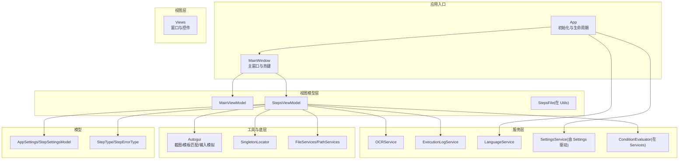
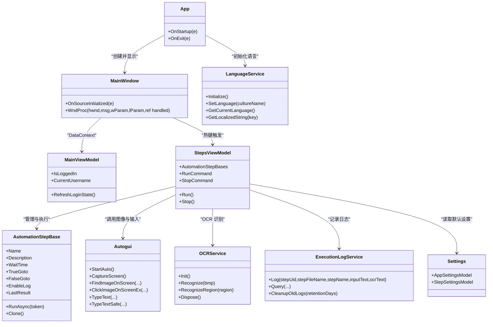
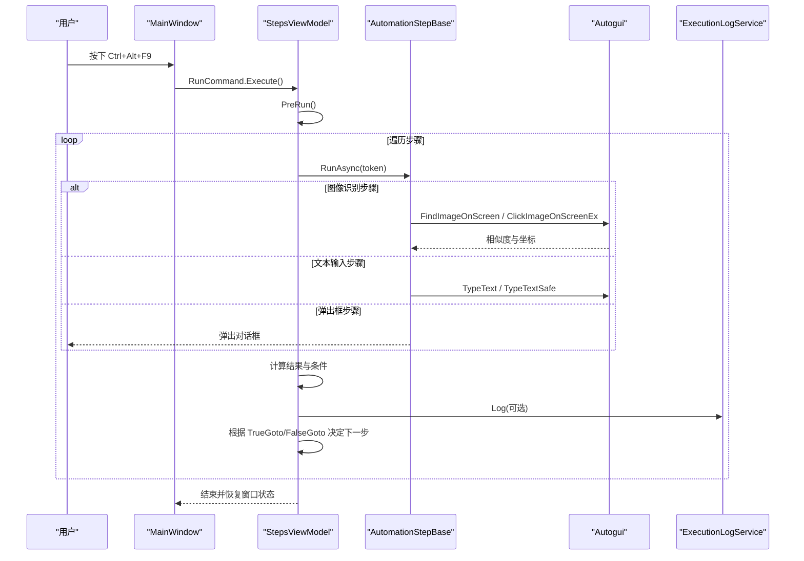
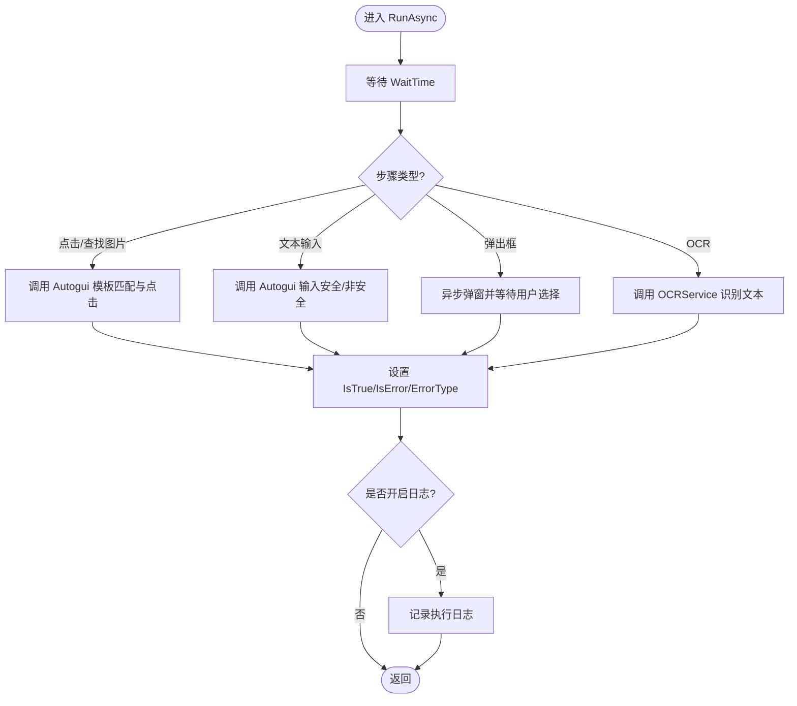
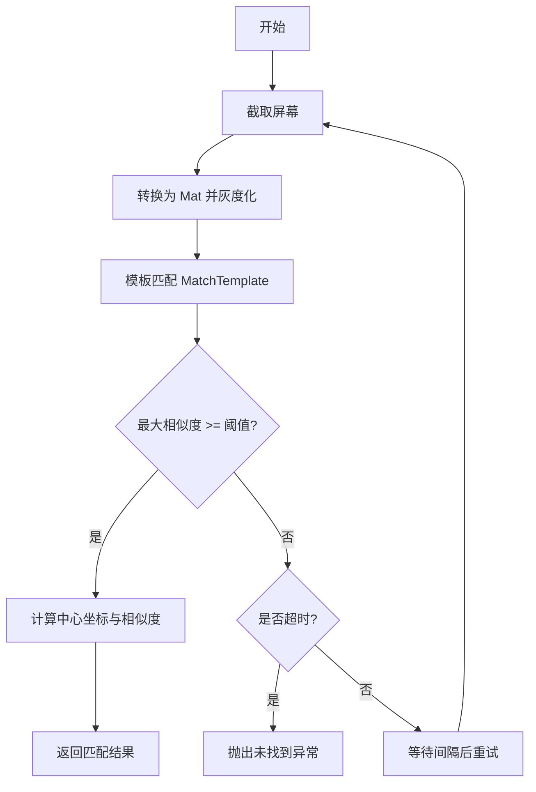
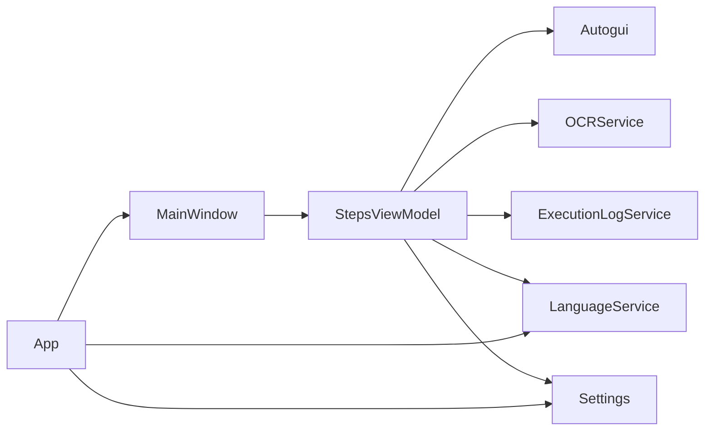

# 项目概述

<cite>
**本文引用的文件**
- [Readme.md](file://Readme.md)
- [ShaoLu.csproj](file://ShaoLu/ShaoLu.csproj)
- [App.xaml.cs](file://ShaoLu/App.xaml.cs)
- [MainWindow.xaml.cs](file://ShaoLu/MainWindow.xaml.cs)
- [MainViewModel.cs](file://ShaoLu/Viewmodels/MainViewModel.cs)
- [StepsViewModel.cs](file://ShaoLu/Viewmodels/StepsViewModel.cs)
- [AutomationStep.cs](file://ShaoLu/Viewmodels/AutomationStep.cs)
- [Autogui.cs](file://ShaoLu/Utils/Autogui.cs)
- [OCRService.cs](file://ShaoLu/services/OCRService.cs)
- [LanguageService.cs](file://ShaoLu/services/LanguageService.cs)
- [ExecutionLogService.cs](file://ShaoLu/services/ExecutionLogService.cs)
- [Settings.cs](file://ShaoLu/Models/Settings.cs)
- [SingletonLocator.cs](file://ShaoLu/Utils/SingletonLocator.cs)
- [Services.cs](file://ShaoLu/services/Services.cs)
</cite>

## 目录
1. [简介](#简介)
2. [项目结构](#项目结构)
3. [核心组件](#核心组件)
4. [架构总览](#架构总览)
5. [详细组件分析](#详细组件分析)
6. [依赖关系分析](#依赖关系分析)
7. [性能考量](#性能考量)
8. [故障排查指南](#故障排查指南)
9. [结论](#结论)
10. [附录](#附录)

## 简介
ShaoLu（烧录）是一款基于 WPF 的桌面自动化工具，通过图像识别与模拟输入实现 GUI 自动化操作。其核心价值在于：
- 以“步骤”为单位的可视化流程编排，支持点击识图、查找识图、多图点击/查找、文本输入、批量输入、从文件输入、弹出框交互、OCR 文字识别等丰富能力。
- 采用 MVVM 架构与模块化设计，结合依赖注入与单例定位器，便于扩展与维护。
- 技术栈涵盖 .NET Framework 4.8、WPF、OpenCV（模板匹配）、TesseractOCR（OCR 识别）、EPPlus（Excel 读取）、NLog（日志）、FreeSql+SQLite（执行日志）等。

快速开始（来自 Readme）：
- 启动程序后在主界面添加自动化步骤，配置参数后点击运行；支持快捷键 Ctrl+Alt+F9 运行、Ctrl+Alt+F10 停止。
- 每个步骤具备通用属性（启用、名称、描述、等待时间、条件跳转），以及各自专属参数。

**章节来源**
- [Readme.md:1-283](file://Readme.md#L1-L283)

## 项目结构
整体采用分层与功能域结合的目录组织方式：
- 视图层（Views）：WPF 窗口与用户控件，承载 UI 交互。
- 视图模型层（Viewmodels）：MVVM 中的 ViewModel，负责状态、命令与业务编排。
- 服务层（Services）：跨领域能力封装，如 OCR、语言、执行日志、设置、条件评估等。
- 工具与底层（Utils）：屏幕截图、图像识别、鼠标键盘模拟、路径与文件处理、单例定位器等。
- 模型（Models）：枚举、配置、数据实体等。
- 资源与主题（Resources、Themes、Templates）：本地化、样式与模板。
- 测试（NUnitTest）：单元测试覆盖关键逻辑。

**图表来源**
- [App.xaml.cs:18-65](file://ShaoLu/App.xaml.cs#L18-L65)
- [MainWindow.xaml.cs:32-74](file://ShaoLu/MainWindow.xaml.cs#L32-L74)
- [StepsViewModel.cs:114-130](file://ShaoLu/Viewmodels/StepsViewModel.cs#L114-L130)
- [Autogui.cs:43-46](file://ShaoLu/Utils/Autogui.cs#L43-L46)
- [OCRService.cs:21-43](file://ShaoLu/services/OCRService.cs#L21-L43)
- [ExecutionLogService.cs:14-27](file://ShaoLu/services/ExecutionLogService.cs#L14-L27)
- [LanguageService.cs:15-22](file://ShaoLu/services/LanguageService.cs#L15-L22)
- [Settings.cs:7-12](file://ShaoLu/Models/Settings.cs#L7-L12)

**章节来源**
- [ShaoLu.csproj:34-41](file://ShaoLu/ShaoLu.csproj#L34-L41)
- [ShaoLu.csproj:358-401](file://ShaoLu/ShaoLu.csproj#L358-L401)

## 核心组件
- 应用启动与依赖注入：App 中完成语言初始化、DI 容器构建、日志清理、主窗口显示。
- 主窗口与全局热键：注册 Ctrl+Alt+F9/F10 触发运行/停止，绑定 ViewModel。
- 步骤执行引擎：StepsViewModel 维护步骤集合、执行上下文、取消令牌、错误处理与跳转控制。
- 自动化步骤基类与具体步骤：AutomationStepBase 抽象出通用属性与执行接口，派生出 ClickImage、FindImage、ClickImages、FindImages、TypeText、TypeTextMore、TypeTextFromFile、Popup、TextOCR 等。
- 图像识别与输入模拟：Autogui 提供屏幕截图、模板匹配、鼠标移动与点击、安全文本输入等。
- OCR 服务：OCRService 封装 TesseractOCR，支持 Bitmap 与屏幕区域识别。
- 执行日志：ExecutionLogService 使用 FreeSql+SQLite 持久化记录文字步骤的执行历史，支持查询与清理。
- 语言与本地化：LanguageService 管理当前语言并持久化，UI 通过 WPFLocalizeExtension 获取字符串。
- 配置与设置：Settings 定义应用与步骤默认值、快捷键等。

**章节来源**
- [App.xaml.cs:18-65](file://ShaoLu/App.xaml.cs#L18-L65)
- [MainWindow.xaml.cs:32-74](file://ShaoLu/MainWindow.xaml.cs#L32-L74)
- [StepsViewModel.cs:361-582](file://ShaoLu/Viewmodels/StepsViewModel.cs#L361-L582)
- [AutomationStep.cs:25-205](file://ShaoLu/Viewmodels/AutomationStep.cs#L25-L205)
- [Autogui.cs:59-122](file://ShaoLu/Utils/Autogui.cs#L59-L122)
- [OCRService.cs:21-75](file://ShaoLu/services/OCRService.cs#L21-L75)
- [ExecutionLogService.cs:36-55](file://ShaoLu/services/ExecutionLogService.cs#L36-L55)
- [LanguageService.cs:15-40](file://ShaoLu/services/LanguageService.cs#L15-L40)
- [Settings.cs:34-75](file://ShaoLu/Models/Settings.cs#L34-L75)

## 架构总览
系统遵循 MVVM 模式，UI 与业务解耦，服务层提供可复用能力，工具层屏蔽平台差异。依赖注入贯穿应用生命周期，单例定位器简化跨层访问。

**图表来源**
- [App.xaml.cs:18-65](file://ShaoLu/App.xaml.cs#L18-L65)
- [MainWindow.xaml.cs:32-74](file://ShaoLu/MainWindow.xaml.cs#L32-L74)
- [StepsViewModel.cs:114-130](file://ShaoLu/Viewmodels/StepsViewModel.cs#L114-L130)
- [AutomationStep.cs:25-205](file://ShaoLu/Viewmodels/AutomationStep.cs#L25-L205)
- [Autogui.cs:43-46](file://ShaoLu/Utils/Autogui.cs#L43-L46)
- [OCRService.cs:21-43](file://ShaoLu/services/OCRService.cs#L21-L43)
- [ExecutionLogService.cs:14-27](file://ShaoLu/services/ExecutionLogService.cs#L14-L27)
- [LanguageService.cs:15-22](file://ShaoLu/services/LanguageService.cs#L15-L22)
- [Settings.cs:7-12](file://ShaoLu/Models/Settings.cs#L7-L12)

## 详细组件分析

### 步骤执行引擎（StepsViewModel）
- 职责：维护步骤集合、执行循环、上下文结果缓存、条件判断、错误处理、自引用限制、进度与 UI 状态更新。
- 关键点：
  - 使用 CancellationToken 支持中断。
  - 每步计时并生成 StepExecutionResult，存入执行上下文。
  - 支持自定义条件（ConditionMode.Custom）与通用跳转（TrueGoto/FalseGoto）。
  - 错误类型推断与弹窗提示（可配置）。
  - 运行前可选确认对话框与最小化窗口。

**图表来源**
- [MainWindow.xaml.cs:55-74](file://ShaoLu/MainWindow.xaml.cs#L55-L74)
- [StepsViewModel.cs:407-565](file://ShaoLu/Viewmodels/StepsViewModel.cs#L407-L565)
- [Autogui.cs:59-122](file://ShaoLu/Utils/Autogui.cs#L59-L122)
- [ExecutionLogService.cs:36-55](file://ShaoLu/services/ExecutionLogService.cs#L36-L55)

**章节来源**
- [StepsViewModel.cs:114-130](file://ShaoLu/Viewmodels/StepsViewModel.cs#L114-L130)
- [StepsViewModel.cs:361-582](file://ShaoLu/Viewmodels/StepsViewModel.cs#L361-L582)

### 自动化步骤基类与具体步骤（AutomationStep）
- 基类：统一属性（名称、描述、等待时间、跳转、错误类型、是否启用、日志开关、执行结果等），抽象 RunAsync 与 Clone。
- 具体步骤：
  - 点击/查找图片：调用 Autogui 进行模板匹配与点击。
  - 文本输入：支持普通输入、组合递增输入、从文件逐行输入。
  - 弹出框：异步弹窗，支持字体、颜色、按钮配置，响应取消信号。
  - OCR：识别屏幕区域或指定图像文本。

**图表来源**
- [AutomationStep.cs:25-205](file://ShaoLu/Viewmodels/AutomationStep.cs#L25-L205)
- [Autogui.cs:497-579](file://ShaoLu/Utils/Autogui.cs#L497-L579)
- [OCRService.cs:50-75](file://ShaoLu/services/OCRService.cs#L50-L75)
- [ExecutionLogService.cs:36-55](file://ShaoLu/services/ExecutionLogService.cs#L36-L55)

**章节来源**
- [AutomationStep.cs:209-279](file://ShaoLu/Viewmodels/AutomationStep.cs#L209-L279)
- [AutomationStep.cs:281-435](file://ShaoLu/Viewmodels/AutomationStep.cs#L281-L435)
- [AutomationStep.cs:437-602](file://ShaoLu/Viewmodels/AutomationStep.cs#L437-L602)
- [AutomationStep.cs:606-753](file://ShaoLu/Viewmodels/AutomationStep.cs#L606-L753)

### 图像识别与输入模拟（Autogui）
- 屏幕截图：高质量复制全屏像素。
- 模板匹配：OpenCV 灰度转换与 CCoeffNormed 匹配，支持超时与间隔重试。
- 鼠标操作：按锚点位置与偏移量移动并点击，支持多次点击与间隔。
- 文本输入：两种模式——逐键输入与安全剪贴板粘贴（STA 线程保障）。

**图表来源**
- [Autogui.cs:59-122](file://ShaoLu/Utils/Autogui.cs#L59-L122)

**章节来源**
- [Autogui.cs:177-186](file://ShaoLu/Utils/Autogui.cs#L177-L186)
- [Autogui.cs:256-306](file://ShaoLu/Utils/Autogui.cs#L256-L306)
- [Autogui.cs:497-579](file://ShaoLu/Utils/Autogui.cs#L497-L579)

### OCR 服务（OCRService）
- 懒加载初始化 Tesseract 引擎，支持 chi_sim+eng。
- 提供 Bitmap 与屏幕区域 OCR 识别，自动处理 DPI 缩放。
- 异常捕获与日志记录，释放引擎资源。

**章节来源**
- [OCRService.cs:21-43](file://ShaoLu/services/OCRService.cs#L21-L43)
- [OCRService.cs:50-75](file://ShaoLu/services/OCRService.cs#L50-L75)
- [OCRService.cs:82-118](file://ShaoLu/services/OCRService.cs#L82-L118)

### 执行日志（ExecutionLogService）
- 使用 FreeSql+SQLite 存储执行历史，支持关键字搜索、文件名/UID 筛选、时间范围、排序与分页。
- 提供旧日志清理接口，依据保留天数策略。

**章节来源**
- [ExecutionLogService.cs:14-27](file://ShaoLu/services/ExecutionLogService.cs#L14-L27)
- [ExecutionLogService.cs:60-107](file://ShaoLu/services/ExecutionLogService.cs#L60-L107)
- [ExecutionLogService.cs:161-176](file://ShaoLu/services/ExecutionLogService.cs#L161-L176)

### 语言与本地化（LanguageService）
- 启动时初始化语言，优先读取上次保存的语言，否则使用系统语言。
- 设置语言并持久化，提供字符串获取方法。

**章节来源**
- [LanguageService.cs:15-40](file://ShaoLu/services/LanguageService.cs#L15-L40)
- [LanguageService.cs:45-64](file://ShaoLu/services/LanguageService.cs#L45-L64)

### 配置与设置（Settings）
- 应用设置：主题、窗口尺寸、字体、日志保留天数。
- 步骤设置：错误弹窗、运行最小化、自引用上限、默认相似度/等待/超时/点击次数、快捷键。

**章节来源**
- [Settings.cs:20-33](file://ShaoLu/Models/Settings.cs#L20-L33)
- [Settings.cs:34-75](file://ShaoLu/Models/Settings.cs#L34-L75)

### 单例定位器（SingletonLocator）
- 通过 CommunityToolkit.Mvvm 的 Ioc 容器获取 MainViewModel、StepsViewModel、FileServices、UserService 等单例。
- 直接暴露 Settings 实例供全局访问。

**章节来源**
- [SingletonLocator.cs:8-17](file://ShaoLu/Utils/SingletonLocator.cs#L8-L17)

### 文件与路径服务（Services.cs）
- 打开/保存文件对话框、相对路径计算、智能文本编码检测与读取（UTF 多格式）。
- 延迟删除文件队列，应用退出时提交删除。

**章节来源**
- [Services.cs:11-81](file://ShaoLu/services/Services.cs#L11-L81)
- [Services.cs:83-140](file://ShaoLu/services/Services.cs#L83-L140)
- [Services.cs:142-175](file://ShaoLu/services/Services.cs#L142-L175)

## 依赖关系分析
- 外部依赖：
  - OpenCvSharp4.Extensions/runtime.win.slim：图像模板匹配。
  - TesseractOCR：OCR 识别。
  - EPPlus：Excel 读取。
  - InputSimulator：鼠标键盘模拟。
  - NLog：结构化日志。
  - FreeSql.Provider.Sqlite：轻量数据库。
  - CommunityToolkit.Mvvm：MVVM 与 DI。
  - WPFLocalizeExtension：本地化。
- 内部依赖：
  - App → MainWindow → ViewModels → Services → Utils。
  - StepsViewModel 作为编排中枢，协调 Autogui、OCRService、ExecutionLogService、LanguageService、Settings。

**图表来源**
- [ShaoLu.csproj:358-401](file://ShaoLu/ShaoLu.csproj#L358-L401)
- [App.xaml.cs:18-65](file://ShaoLu/App.xaml.cs#L18-L65)
- [StepsViewModel.cs:361-582](file://ShaoLu/Viewmodels/StepsViewModel.cs#L361-L582)

**章节来源**
- [ShaoLu.csproj:358-401](file://ShaoLu/ShaoLu.csproj#L358-L401)

## 性能考量
- 图像识别：
  - 模板匹配在每次循环中重新截图与转换，建议合理设置超时与间隔，避免频繁 CPU 占用。
  - 裁剪识别区域越小，匹配越快且误匹配越少。
- 文本输入：
  - 安全模式（剪贴板）兼容性更好但可能较慢；逐键输入更快但需考虑目标应用兼容性。
- OCR：
  - 首次初始化耗时，后续复用引擎；区域识别注意 DPI 缩放。
- 日志：
  - SQLite 写入开销较小，但仍应避免高频写入；可按需开启日志。
- 执行循环：
  - 使用 CancellationToken 及时中断，避免无效继续执行。

[本节为通用指导，不直接分析具体文件]

## 故障排查指南
- 未找到匹配图像：
  - 检查阈值设置（建议 0.8~0.95），确保裁剪区域精确。
  - 查看 Autogui 抛出的异常信息。
- 文本输入失败：
  - 切换安全模式（TypeTextSafe）提升兼容性。
  - 检查焦点是否正确。
- OCR 识别为空：
  - 确认 tessdata 存在且包含语言包。
  - 检查区域大小与清晰度。
- 执行日志无法写入：
  - 检查 ApplicationData 目录权限。
  - 查看 NLog 日志输出。
- 语言切换无效：
  - 确认 current_language.txt 可读可写。
  - 检查 LocalizeDictionary 配置。

**章节来源**
- [Autogui.cs:59-122](file://ShaoLu/Utils/Autogui.cs#L59-L122)
- [Autogui.cs:497-579](file://ShaoLu/Utils/Autogui.cs#L497-L579)
- [OCRService.cs:21-43](file://ShaoLu/services/OCRService.cs#L21-L43)
- [ExecutionLogService.cs:161-176](file://ShaoLu/services/ExecutionLogService.cs#L161-L176)
- [LanguageService.cs:15-40](file://ShaoLu/services/LanguageService.cs#L15-L40)

## 结论
ShaoLu 以 MVVM 为核心，结合 OpenCV 与 TesseractOCR，提供了强大的 GUI 自动化能力。其模块化设计与插件化扩展机制使得新增步骤与服务变得简单。对于初学者，可通过快速开始逐步掌握基本用法；对于有经验的开发者，可基于现有架构扩展更多自动化场景与图像处理能力。

[本节为总结性内容，不直接分析具体文件]

## 附录
- 快速开始要点：
  - 添加步骤 → 编辑参数 → 运行/停止快捷键。
  - 使用图片编辑窗口裁剪识别区域与设置点击点。
  - 利用条件跳转与自定义条件实现复杂流程。
- 术语说明：
  - 步骤：一个可执行的自动化单元。
  - 模板匹配：通过图像相似度寻找目标。
  - OCR：光学字符识别，将图像转为文本。
  - 自引用限制：防止无限循环跳转。

[本节为概念性概述，不直接分析具体文件]