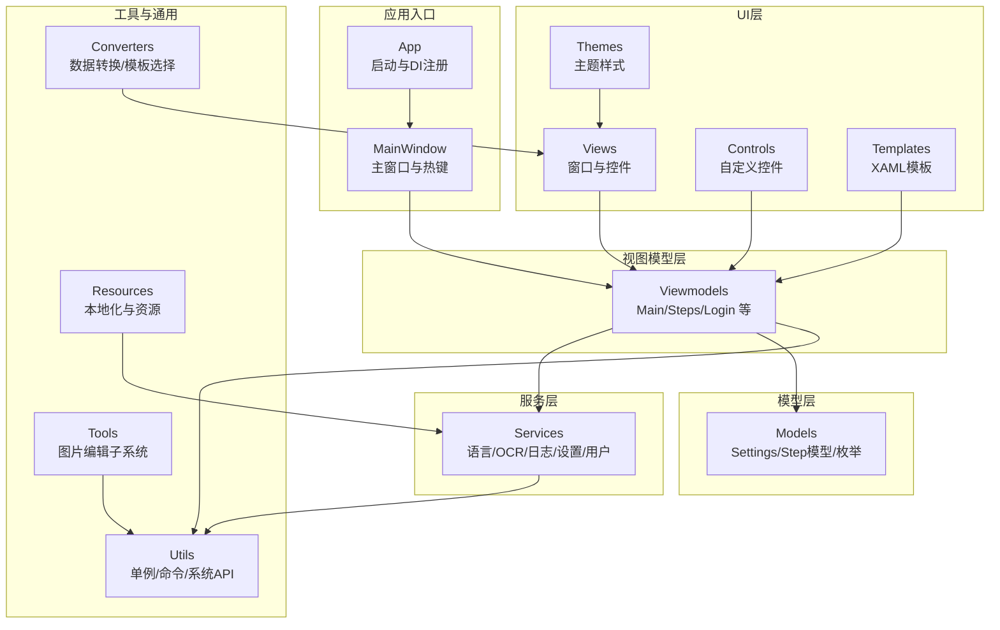
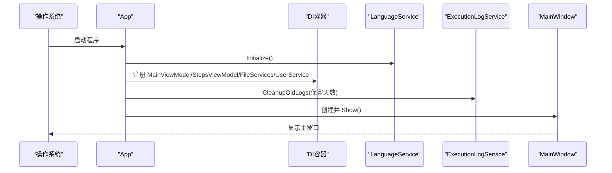
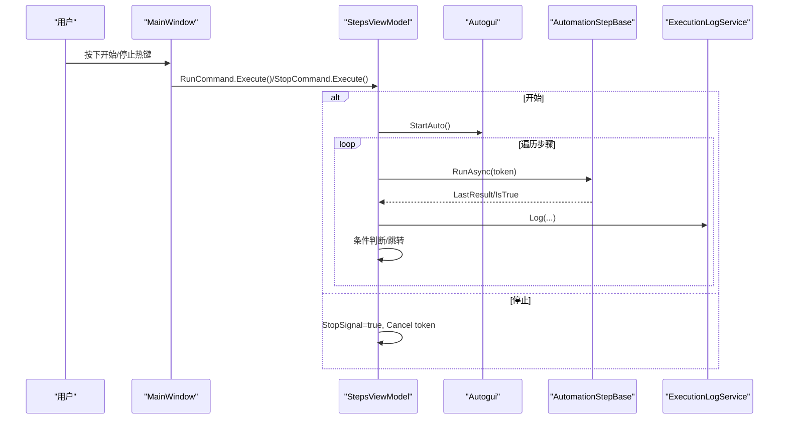
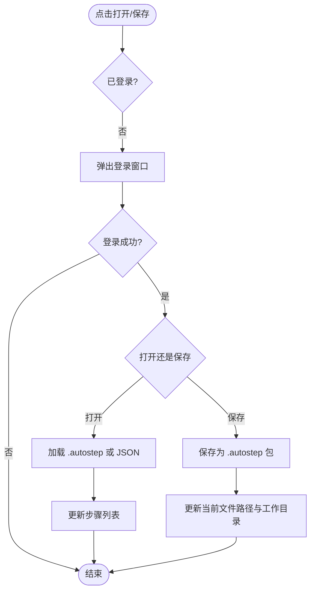
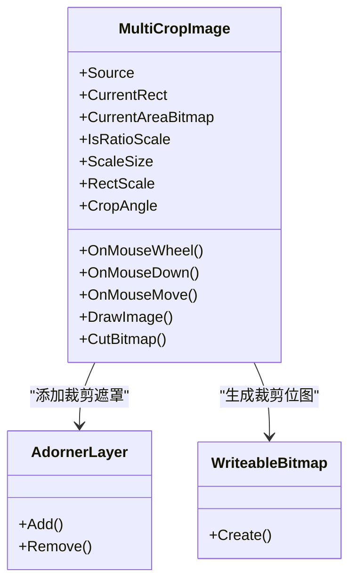

# 项目结构

<cite>
**本文引用的文件**   
- [Readme.md](file://Readme.md)
- [App.xaml.cs](file://ShaoLu/App.xaml.cs)
- [MainWindow.xaml.cs](file://ShaoLu/MainWindow.xaml.cs)
- [ShaoLu.csproj](file://ShaoLu/ShaoLu.csproj)
- [Settings.cs](file://ShaoLu/Models/Settings.cs)
- [Services.cs](file://ShaoLu/Services/Services.cs)
- [MainViewModel.cs](file://ShaoLu/Viewmodels/MainViewModel.cs)
- [SingletonLocator.cs](file://ShaoLu/Utils/SingletonLocator.cs)
- [StepsViewModel.cs](file://ShaoLu/Viewmodels/StepsViewModel.cs)
- [LanguageService.cs](file://ShaoLu/Services/LanguageService.cs)
- [AutomationStepModel.cs](file://ShaoLu/Models/AutomationStepModel.cs)
- [MultiCropImage.cs](file://ShaoLu/Controls/MultiCropImage.cs)
</cite>

## 目录
1. [简介](#简介)
2. [项目结构总览](#项目结构总览)
3. [核心组件与分层架构](#核心组件与分层架构)
4. [详细目录说明](#详细目录说明)
5. [依赖关系与调用关系](#依赖关系与调用关系)
6. [性能与可维护性要点](#性能与可维护性要点)
7. [故障排查指南](#故障排查指南)
8. [结论](#结论)

## 简介
本文件为 ShaoLu（烧录）项目的“项目结构”文档，面向开发者快速理解代码组织、命名规范、模块职责与依赖关系。ShaoLu 是一款基于 WPF 的桌面自动化工具，通过图像识别和模拟输入实现 GUI 自动化操作。项目采用 MVVM + 服务层 + 工具层的分层设计，使用依赖注入容器进行生命周期管理，并通过 XAML 模板与主题样式实现 UI 的可复用与可定制。

## 项目结构总览
整体采用按功能域划分的目录结构：
- Controls：自定义控件
- Converters：数据转换器与模板选择器
- Models：数据模型与枚举
- Services：业务服务（语言、OCR、执行日志、设置、用户等）
- Templates：XAML 模板（步骤详情、设置项、摘要）
- Themes：主题与样式资源
- Tools：独立工具集（图片编辑子系统）
- Utils：通用实用工具（单例定位器、命令、系统交互等）
- Viewmodels：MVVM 视图模型
- Views：WPF 窗口与用户控件
- Resources：本地化字符串与资源文件

图表来源
- [App.xaml.cs:18-65](file://ShaoLu/App.xaml.cs#L18-L65)
- [MainWindow.xaml.cs:32-91](file://ShaoLu/MainWindow.xaml.cs#L32-L91)
- [ShaoLu.csproj:101-129](file://ShaoLu/ShaoLu.csproj#L101-L129)

章节来源
- [Readme.md:1-283](file://Readme.md#L1-L283)
- [ShaoLu.csproj:1-433](file://ShaoLu/ShaoLu.csproj#L1-L433)

## 核心组件与分层架构
- 应用入口与生命周期
  - App 负责初始化语言、构建 DI 容器、注册 ViewModel 与服务、清理过期日志并显示主窗口；退出时释放资源并提交待删除文件。
- 主窗口与交互
  - MainWindow 负责全局热键注册/注销、登录状态检查、打开/保存步骤包、弹出子窗口（设置、关于、执行日志、用户管理等）。
- 视图模型层
  - MainViewModel：语言切换、登录状态、路径信息。
  - StepsViewModel：步骤集合、增删改查、运行/停止、条件跳转、错误处理与自引用限制。
- 服务层
  - LanguageService：多语言初始化与切换。
  - ExecutionLogService：执行日志记录与清理。
  - SettingsService：应用设置加载与持久化。
  - UserService/IUserService：用户登录/注销。
  - OCRService：OCR 能力封装。
  - PathServices/FileServices：文件对话框、相对路径计算、智能文本编码读取、延迟删除提交。
- 模型层
  - Settings：应用/步骤/用户设置模型。
  - AutomationStepModel：步骤类型与错误类型枚举。
- 工具与通用
  - SingletonLocator：集中访问 DI 中的单例服务。
  - RelayCommand/RelayParameterCommand：命令基类。
  - Autogui/NativeMethods：系统级输入与 API 封装。
- 自定义控件与模板
  - MultiCropImage：支持缩放、平移、旋转、裁剪区域与预览。
  - Templates：步骤详情、设置项、摘要的 DataTemplate。
  - Themes：图标与样式资源。

章节来源
- [App.xaml.cs:18-86](file://ShaoLu/App.xaml.cs#L18-L86)
- [MainWindow.xaml.cs:1-316](file://ShaoLu/MainWindow.xaml.cs#L1-L316)
- [StepsViewModel.cs:1-588](file://ShaoLu/Viewmodels/StepsViewModel.cs#L1-L588)
- [LanguageService.cs:1-67](file://ShaoLu/Services/LanguageService.cs#L1-L67)
- [Services.cs:1-179](file://ShaoLu/Services/Services.cs#L1-L179)
- [Settings.cs:1-76](file://ShaoLu/Models/Settings.cs#L1-L76)
- [AutomationStepModel.cs:1-47](file://ShaoLu/Models/AutomationStepModel.cs#L1-L47)
- [SingletonLocator.cs:1-19](file://ShaoLu/Utils/SingletonLocator.cs#L1-L19)
- [MultiCropImage.cs:1-714](file://ShaoLu/Controls/MultiCropImage.cs#L1-L714)

## 详细目录说明

### Controls（自定义控件）
- 职责：提供可复用的 UI 控件，封装复杂交互逻辑（如裁剪、缩放、旋转、拖拽）。
- 关键文件
  - MultiCropImage：支持图像缩放、平移、旋转、矩形裁剪框与实时预览，输出裁剪位图与当前矩形坐标。
- 使用方式：在 XAML 中通过命名空间引入并在界面中使用；由 ViewModel 绑定 Source、CurrentRect、CurrentAreaBitmap 等属性。

章节来源
- [MultiCropImage.cs:1-714](file://ShaoLu/Controls/MultiCropImage.cs#L1-L714)

### Converters（数据转换器）
- 职责：将模型数据转换为 UI 所需格式，或根据条件选择不同模板。
- 典型场景
  - 布尔值反转/可见性转换
  - 条件模式到可见性的映射
  - 步骤模板选择器（根据步骤类型选择对应 DataTemplate）
  - 设置项模板选择器
- 影响范围：Views 与 Templates 的数据绑定与呈现。

章节来源
- [ShaoLu.csproj:136-141](file://ShaoLu/ShaoLu.csproj#L136-L141)
- [ShaoLu.csproj:186](file://ShaoLu/ShaoLu.csproj#L186)

### Models（数据模型）
- 职责：定义领域实体、配置结构与枚举。
- 关键内容
  - Settings：AppSettings（应用设置）、StepSettingsModel（步骤默认参数、快捷键）、UserSettingsModel（用户记忆）。
  - AutomationStepModel：StepType（步骤类型枚举）、StepErrorType（错误类型枚举）。
- 使用范围：被 Viewmodels、Services 与 UI 层广泛引用。

章节来源
- [Settings.cs:1-76](file://ShaoLu/Models/Settings.cs#L1-L76)
- [AutomationStepModel.cs:1-47](file://ShaoLu/Models/AutomationStepModel.cs#L1-L47)

### Services（业务服务）
- 职责：封装跨层共享的业务能力与外部依赖。
- 主要服务
  - LanguageService：多语言初始化、切换、获取本地化字符串。
  - ExecutionLogService：执行日志写入与清理。
  - SettingsService：设置加载与持久化。
  - IUserService/UserService：用户认证与会话。
  - OCRService：OCR 能力封装。
  - StepExecutionContext：步骤执行上下文（结果缓存、变量传递）。
  - ConditionEvaluator：条件表达式评估。
  - PathServices/FileServices：文件对话框、相对路径、智能编码读取、延迟删除。
- 依赖关系：多数服务通过 DI 容器注册并由 SingletonLocator 暴露。

章节来源
- [LanguageService.cs:1-67](file://ShaoLu/Services/LanguageService.cs#L1-L67)
- [Services.cs:1-179](file://ShaoLu/Services/Services.cs#L1-L179)
- [ShaoLu.csproj:174-183](file://ShaoLu/ShaoLu.csproj#L174-L183)

### Templates（XAML模板）
- 职责：定义步骤详情、设置项、摘要的可视化模板，配合 Converter/Selector 动态渲染。
- 典型文件
  - SettingsTemplates.xaml：设置项模板
  - StepDetailTemplates.xaml：步骤详情模板
  - StepSummaryTemplates.xaml：步骤摘要模板
- 使用方式：在 Views 中通过 StaticResource/DynamicResource 引用，或通过 TemplateSelector 动态选择。

章节来源
- [ShaoLu.csproj:242-249](file://ShaoLu/ShaoLu.csproj#L242-L249)

### Themes（主题样式）
- 职责：统一外观风格、图标资源、控件样式。
- 典型文件
  - Generic.xaml：控件默认样式
  - Icons.xaml：图标资源
  - Styles.xaml：通用样式
- 使用方式：在 App 或页面资源字典中合并，供全局或局部使用。

章节来源
- [ShaoLu.csproj:250-261](file://ShaoLu/ShaoLu.csproj#L250-L261)

### Tools（工具类）
- 职责：提供独立工具集，尤其是图片编辑子系统（截图、裁剪、标注、保存）。
- 组织结构
  - Common/Helpers/Interop/Services/Utils/ViewModels：底层能力与状态机
  - ImageEditor/MainWin：编辑器窗口与视图模型
  - ResxGenerator：资源生成工具
- 与主项目关系：作为内部工具库，被主项目引用以支持“图片编辑窗口”等功能。

章节来源
- [ShaoLu.csproj:184](file://ShaoLu/ShaoLu.csproj#L184)

### Utils（实用工具）
- 职责：通用基础能力，降低耦合度。
- 关键文件
  - SingletonLocator：集中访问 DI 中的单例（MainViewModel、StepsViewModel、FileServices、UserService、Settings）。
  - RelayCommand/RelayParameterCommand：命令实现。
  - NativeMethods/Autogui：系统 API 与输入模拟。
  - StepsFile：步骤文件的加载/保存（兼容 .autostep 与 JSON）。
- 使用范围：贯穿 UI、ViewModel、Service 层。

章节来源
- [SingletonLocator.cs:1-19](file://ShaoLu/Utils/SingletonLocator.cs#L1-L19)
- [ShaoLu.csproj:185-190](file://ShaoLu/ShaoLu.csproj#L185-L190)

### Viewmodels（视图模型）
- 职责：承载 UI 状态与业务逻辑，响应命令，协调服务与模型。
- 关键文件
  - MainViewModel：语言、登录状态、路径信息。
  - StepsViewModel：步骤集合管理、运行/停止、条件跳转、错误处理、自引用限制。
  - LoginViewModel/UserManagementViewModel：用户相关交互。
  - EditImageViewModel：图片编辑相关状态。
  - TextOCRStep/ImagesRecognition/ImageRecognition：OCR 与图像识别步骤的 ViewModel。
- 依赖：通过 Ioc.Default 或 SingletonLocator 获取服务与设置。

章节来源
- [MainViewModel.cs:1-76](file://ShaoLu/Viewmodels/MainViewModel.cs#L1-L76)
- [StepsViewModel.cs:1-588](file://ShaoLu/Viewmodels/StepsViewModel.cs#L1-L588)
- [ShaoLu.csproj:191-199](file://ShaoLu/ShaoLu.csproj#L191-L199)

### Views（用户界面）
- 职责：WPF 窗口与用户控件，负责展示与用户交互。
- 典型窗口
  - WindowLogin、WindowSettings、WindowAbout、WindowExecutionLog、WindowUserManagement、WindowEditImage、WindowSelectRegion、WindowEditOCR、WindowAsyncPopup。
  - UserControlSteps：步骤列表控件。
- 交互流程：通过 DataContext 绑定 ViewModel，触发命令，调用服务完成业务。

章节来源
- [ShaoLu.csproj:200-305](file://ShaoLu/ShaoLu.csproj#L200-L305)

### Resources（资源文件）
- 职责：本地化字符串与静态资源。
- 内容
  - Strings.resx / Strings.zh-CN.resx / Strings.zh-TW.resx / Strings.en-US.resx：多语言资源。
  - ImageLoadState.xaml：图片加载状态模板。
- 使用方式：通过 LanguageService 与 WPFLocalizeExtension 获取本地化文本。

章节来源
- [ShaoLu.csproj:154-173](file://ShaoLu/ShaoLu.csproj#L154-L173)
- [LanguageService.cs:1-67](file://ShaoLu/Services/LanguageService.cs#L1-L67)

## 依赖关系与调用关系

### 启动与初始化序列

图表来源
- [App.xaml.cs:18-65](file://ShaoLu/App.xaml.cs#L18-L65)

### 主窗口热键与执行流程

图表来源
- [MainWindow.xaml.cs:32-74](file://ShaoLu/MainWindow.xaml.cs#L32-L74)
- [StepsViewModel.cs:362-588](file://ShaoLu/Viewmodels/StepsViewModel.cs#L362-L588)

### 文件打开/保存流程

图表来源
- [MainWindow.xaml.cs:185-233](file://ShaoLu/MainWindow.xaml.cs#L185-L233)

### 自定义控件 MultiCropImage 交互

图表来源
- [MultiCropImage.cs:1-714](file://ShaoLu/Controls/MultiCropImage.cs#L1-L714)

## 性能与可维护性要点
- 异步与取消
  - 步骤执行使用 CancellationToken，支持用户中断与异常恢复。
- 资源管理
  - 退出时释放图像识别资源并提交待删除文件，避免内存泄漏与文件占用。
- 条件与跳转
  - 自引用计数限制防止死循环；错误类型推断提升可观测性。
- 多语言与资源
  - 通过 WPFLocalizeExtension 与 resx 管理多语言，便于扩展与维护。
- 模板与样式
  - 使用 Templates 与 Themes 分离样式与布局，提高复用性与一致性。

章节来源
- [StepsViewModel.cs:407-588](file://ShaoLu/Viewmodels/StepsViewModel.cs#L407-L588)
- [App.xaml.cs:66-86](file://ShaoLu/App.xaml.cs#L66-L86)
- [Services.cs:118-179](file://ShaoLu/Services/Services.cs#L118-L179)

## 故障排查指南
- 常见问题定位
  - 步骤执行失败：查看 StepsViewModel 的错误类型与消息，确认超时、文件未找到、索引越界等。
  - 图片识别失败：检查相似度阈值、裁剪区域是否精确、图片路径是否正确。
  - 多语言不生效：确认 LanguageService 初始化与当前文化设置。
  - 文件删除失败：检查 FileServices 的延迟删除队列与权限。
- 建议调试手段
  - 启用 NLog 日志，关注执行时间与 OCR 结果。
  - 使用执行日志窗口查看历史执行记录。
  - 在步骤前后打印上下文变量，验证条件跳转逻辑。

章节来源
- [StepsViewModel.cs:487-588](file://ShaoLu/Viewmodels/StepsViewModel.cs#L487-L588)
- [LanguageService.cs:15-40](file://ShaoLu/Services/LanguageService.cs#L15-L40)
- [Services.cs:118-179](file://ShaoLu/Services/Services.cs#L118-L179)

## 结论
ShaoLu 项目采用清晰的 MVVM 分层与模块化目录组织，结合 DI 容器与丰富的工具库，实现了高内聚、低耦合的自动化脚本编排与执行能力。通过统一的模板与主题体系，UI 具备良好的可扩展性与一致性。开发者可依据本文档快速定位模块、理解依赖关系，并在此基础上扩展新的步骤类型、服务与界面元素。